# Part 87 - Continuous Threat Exposure Management (CTEM) from Zero

> **Audience:** Arti Thakur, preparing for a Zscaler Security Operations Technical Success Manager role after Microsoft enterprise Support Escalation Engineering.

> **Purpose:** Explain Continuous Threat Exposure Management from first principles, including business-aligned scoping, discovery, prioritization, safe validation, mobilization, iteration, architecture, governance, operating mechanics, troubleshooting, security, privacy, failure modes, artifacts, exercises, and the distinction between CTEM and traditional vulnerability management.

> **Scope and honesty:** Northstar Meridian Holdings, abbreviated NMH, is an explicitly fictional and synthetic customer used only for study. Every NMH person, asset, source, weakness, exposure, attack path, control, test, date, metric, decision, and outcome is invented. Arti's factual background is Microsoft 365, OneDrive, and SharePoint support; networking and trace analysis; SQL and Power BI; enterprise escalations; mentoring; and responsible AI exploration. Production Zscaler, CTEM, Risk360, Data Fabric, Asset Exposure Management, UVM, penetration testing, red teaming, vulnerability-program ownership, and customer risk authority remain learning boundaries.

> **Currency caveat:** Product wording, architecture, integrations, stages, interfaces, fields, methods, limits, entitlements, standards, and customer conditions change. The controlled official-source snapshot and source review date for this Part is exactly **2026-08-24**. Current official documentation, licensed-tenant evidence, customer policy, product specialists, Zscaler Support, authorized testing procedures, source-native evidence, and measured postconditions govern production decisions.

> **Section goal:** Build a zero-to-interview-ready CTEM mental model: define the five recurring activities, connect them to business decisions and technical evidence, distinguish CTEM from vulnerability management, show how teams safely validate and mobilize treatment, and explain how a TSM can help a customer improve the program without inventing product behavior or claiming security authority.

Zscaler's reviewed public CTEM page positions Continuous Threat Exposure Management as an ongoing program for identifying, prioritizing, validating, and addressing exposures. This Part uses the common five-activity vocabulary of scoping, discovery, prioritization, validation, and mobilization as a general CTEM operating model. The reviewed public pages for Data Fabric for Security, Asset Exposure Management, Unified Vulnerability Management, and Risk360 provide adjacent product positioning around unified security data, asset context, contextual vulnerability priority, and enterprise risk views. Those are bounded product facts. Exact feature relationships, data objects, workflows, interfaces, formulas, testing capabilities, packaging, and entitlements require current verification.

This Part labels statements as **official product fact**, **general security practice**, **scenario assumption**, **customer fact**, or **unknown**. An official page can support a public capability statement, but it cannot prove what is enabled, licensed, healthy, or effective in a particular tenant. A general practice is a recommended method, not a hidden description of Zscaler internals. An NMH statement is always fictional and synthetic.

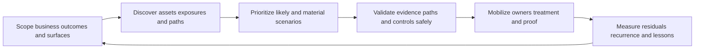

| CTEM principle | Plain meaning | Operational consequence | Failure prevented |
|---|---|---|---|
| Business aligned | Start with material services and consequences | Scope by decisions and business outcomes | Endless tool inventory |
| Exposure centered | Consider conditions attackers can combine | Join assets, identities, weaknesses, paths, and controls | CVE-only thinking |
| Evidence driven | Preserve source, time, scope, and confidence | Make priority and closure explainable | Opaque risk theater |
| Validation informed | Test assumptions within authorization | Separate plausible from demonstrated paths | Guess-based treatment |
| Mobilization focused | Convert insight into owned executable work | Include dependencies, safety, and proof | Reports without action |
| Iterative | Reassess after change and environmental drift | Run a durable loop, not a one-time project | Stale assurance |
| Human governed | Keep consequential authority with customer roles | Use approvals, separation of duties, and review | Vendor overreach |

## JD Mapping

| JD signal | Capability developed here | Practical artifact | Honest boundary |
|---|---|---|---|
| Develop deep product and domain expertise | Explain CTEM and adjacent Zscaler public positioning | Claim ledger and architecture map | No undocumented product claim |
| Become a trusted advisor | Connect business priorities to exposure decisions | Scope charter and stakeholder map | Customer owns risk appetite |
| Drive adoption and value | Turn findings into repeatable owner action | Mobilization board and review cadence | No guaranteed outcome |
| Troubleshoot complex environments | Isolate scope, source, entity, path, control, workflow, and evidence defects | Layered troubleshooting runbook | No unsupported root cause |
| Use analytics | Define denominators, cohorts, confidence, movement, and residuals | SQL/Power BI-style evidence model | No claim of product database access |
| Coordinate technical stakeholders | Align security, IT, IAM, network, cloud, application, data, risk, privacy, and change roles | RACI and decision log | TSM facilitates rather than authorizes |
| Communicate proactively | Explain scenario, evidence, uncertainty, action, owner, and checkpoint | Technical and executive summaries | No unsupported assurance |
| Partner with Support and Product | Build minimal reproducible evidence for product questions | Redacted escalation packet | No fix or roadmap promise |
| Apply AI responsibly | Use reviewed assistance for summaries, mapping, and test design | AI control checklist | No autonomous testing or risk decision |

## Candidate honesty note

Arti should use neutral syntax: "My production experience establishes X; I have studied or practiced Y in a fictional exercise; in a customer environment I would verify Z." That sentence structure is stronger than vague confidence because it tells the interviewer exactly which evidence supports each claim.

| Evidence class | Factual bridge | Safe interview wording | Unsupported claim to avoid |
|---|---|---|---|
| M365 support | Tenant, identity, permission, sync, endpoint, network, and service-layer diagnosis | "I would transfer the same scoped evidence method to exposure investigation." | "I operated CTEM in production." |
| Networking and traces | DNS, TCP, TLS, proxy, HTTP, timing, and path evidence | "I can reason about reachability and collect path evidence." | "I validated production attack paths." |
| SQL and Power BI | Joins, grain, nulls, history, reconciliation, trends, and drill-down | "I can design transparent exposure analytics." | "I queried Zscaler's internal schema." |
| Escalation work | Impact, containment, ownership, updates, RCA, and closure checks | "I can coordinate a high-severity evidence loop." | "I owned enterprise cyber risk." |
| Mentoring | Structured explanation, shadowing, teach-back, and playbooks | "I can enable users to repeat a safe process." | "I led a production CTEM rollout." |
| AI exploration | Grounded summarization, test drafting, and human review | "I would use AI only within approved controls." | "I let AI decide or exploit exposures." |
| Synthetic NMH practice | End-to-end artifacts and reasoning in this Part | "This is a fictional case used to demonstrate method." | "This is a customer result." |

## Beginner vocabulary and memory hooks

| Term | Meaning from zero | Why it matters | Analogy or memory hook |
|---|---|---|---|
| Threat | Something capable of causing harm | Gives the exposure an adversary or hazardous event | Storm approaching |
| Weakness | Flaw or condition that can be abused | Supplies an opportunity | Unlatched window |
| Vulnerability | Documented weakness, often in software or configuration | Common input to exposure decisions | Defective lock model |
| Exposure | A condition that leaves value open to harm | Includes more than software flaws | Window, ladder, and dark yard together |
| Attack surface | All reachable or interactable points an attacker might use | Defines what can be examined | Doors and windows of an estate |
| Attack path | Connected steps from entry to a valuable objective | Shows how small conditions combine | Route through linked rooms |
| Choke point | Shared step whose interruption blocks several paths | Creates efficient treatment choices | One bridge serving many roads |
| Control | Safeguard intended to prevent, detect, limit, or recover | Changes path likelihood or consequence | Lock, alarm, guard, sprinkler |
| Residual exposure | What remains after controls or treatment | Prevents false closure | Remaining rain after an umbrella |
| Scope | Explicit boundary of included outcomes, systems, people, data, and time | Makes work finite and accountable | Fence around the survey area |
| Discovery | Finding and characterizing relevant conditions | Builds evidence before priority | Inventory plus inspection |
| Prioritization | Choosing attention order under risk and capacity | Prevents equal treatment of unequal scenarios | Emergency-room triage |
| Validation | Testing whether an important assumption holds | Replaces plausibility with stronger evidence | Test a smoke alarm safely |
| Mobilization | Organizing owners, decisions, treatment, validation, and communication | Converts knowledge into change | Dispatching the repair crew |
| Iteration | Repeating the cycle using new evidence | Environments and threats change | Rechecking a map after roadworks |
| CTEM | Continuous Threat Exposure Management | Provides a business-aligned recurring exposure program | Inspect, test, fix, learn, repeat |
| VM | Vulnerability management | Discovers and treats vulnerabilities through a lifecycle | Defect-repair program |
| EASM | External Attack Surface Management | Finds and monitors internet-facing assets and exposure | Inspect the outside perimeter |
| CAASM | Cyber Asset Attack Surface Management | Unifies asset and control context across sources | Reconcile every property register |
| BAS | Breach and Attack Simulation | Executes controlled techniques to assess defenses | Fire drill for controls |
| Penetration test | Authorized human-led security test against defined scope | Finds exploitable combinations and impact | Expert safety inspector tries doors |
| Threat intelligence | Evidence about adversaries, techniques, infrastructure, and campaigns | Adds timing and relevance | Weather and crime bulletin |
| Applicability | Whether a weakness actually affects the exact asset/configuration | Avoids acting on irrelevant labels | Recall applies to this car model |
| Reachability | Whether required communication and access steps can occur | Connects exposure to plausible paths | Can the road reach the door? |
| Exploitability | Practical ability to abuse a condition under stated prerequisites | Refines urgency | Can the lock flaw be used here? |
| Business criticality | Customer-defined importance and consequence of loss | Connects technical condition to mission | Intensive-care power versus lobby sign |
| Blast radius | Potential extent of affected entities or services | Shapes urgency and containment | Rooms reached by one water leak |
| Evidence lineage | Trace from assertion back to source, transformation, and time | Enables trust and troubleshooting | Receipt and shipping trail |
| Confidence | Strength of support for a specific assertion | Keeps uncertainty visible | Clarity of a photograph |
| Risk acceptance | Authorized decision to retain stated residual risk | Prevents silent non-action | Owner signs for known hazard |

### Plain-English deep-dive 1 - CTEM is a management loop, not a scanner

Imagine a hospital safety program. A scanner is like one inspection instrument that finds defective electrical outlets. A complete safety program must also decide which buildings and clinical services matter, discover unregistered rooms and connected equipment, understand whether a defect can reach patient-care operations, test alarms and barriers safely, assign repairs around clinical change windows, confirm the repair, and repeat as equipment and use change. Buying a better outlet tester does not perform those decisions.

CTEM works at the program level. It can consume vulnerability findings, asset records, external observations, identities, permissions, cloud configuration, network relationships, data sensitivity, threat intelligence, controls, and business context. It then helps people choose and validate material scenarios and mobilize treatment. No single source is automatically complete or authoritative for every assertion. CTEM is continuous because assets, software, identities, routes, controls, adversaries, and business priorities drift.

The word "threat" does not mean every cycle starts with confirmed active compromise. It means the program studies exposure through plausible harmful scenarios and relevant adversary behavior. The word "exposure" prevents the team from reducing the problem to CVEs. The word "management" emphasizes people, decisions, work, proof, and governance. The word "continuous" emphasizes repeated sensing and learning, not nonstop intrusive testing.

## The five recurring CTEM activities

The five activities are easier to remember as a loop than as a rigid project plan. Organizations may overlap them, use different labels, or run different cadences for different scopes. The useful question is whether each decision function exists and has evidence.

| Activity | Core question | Main inputs | Main outputs | Exit evidence |
|---|---|---|---|---|
| Scoping | Which business outcomes and surfaces matter now? | Services, risk priorities, architecture, change, constraints | Charter, population, scenarios, owners, success criteria | Approved bounded scope |
| Discovery | What assets, identities, weaknesses, paths, controls, and unknowns exist? | Source-native records and observations | Evidence graph, coverage report, hypotheses | Reconciled useful evidence |
| Prioritization | Which scenarios deserve scarce attention first? | Materiality, likelihood evidence, path, controls, quality, capacity | Ranked cohorts with reasons | Reviewed executable queue |
| Validation | Which assumptions and controls hold under safe authorization? | Hypotheses, evidence, test plan, guardrails | Demonstrated, disproved, partial, unknown states | Signed result and residual |
| Mobilization | Who will do what, by when, under which authority, and how will closure be proven? | Validated priority, dependencies, change/risk policy | Work, decisions, controls, exceptions, communication | Measured postconditions |

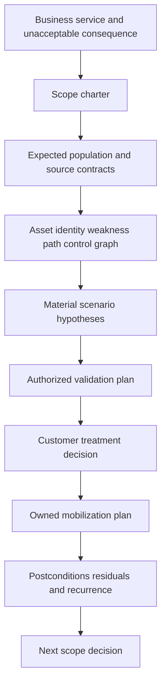

## CTEM versus vulnerability management

Vulnerability management is not obsolete and CTEM is not a replacement slogan. VM remains essential for finding, assessing, remediating, validating, and governing vulnerabilities. CTEM broadens the decision unit from a vulnerability list to exposure scenarios across assets, identities, configurations, routes, controls, and consequences. A mature VM capability can be a major CTEM input and treatment engine.

| Dimension | Vulnerability management emphasis | CTEM emphasis | Practical relationship |
|---|---|---|---|
| Primary object | Vulnerability finding or exposure episode | Business-aligned exposure scenario and path | CTEM consumes VM evidence |
| Discovery | Scanner and assessment coverage | Multiple attack surfaces, identities, paths, controls, unknowns | VM is one discovery family |
| Priority | Severity, exploit evidence, asset context, policy | Material scenario, reachability, control state, validation, capacity | Strong VM priority overlaps |
| Validation | Rescan, configuration check, patch verification | Safe path, exploitability, and control-effectiveness evidence | CTEM adds scenario validation |
| Mobilization | Patch, configuration, exception, ticket workflow | Cross-team treatment at efficient path/control choke points | VM often executes part of plan |
| Scope | Asset/application estate and vulnerability policy | Business service, attack surface, adversary objective, consequence | CTEM can cross program boundaries |
| Cadence | Recurring scans and remediation cycles | Iterative scope-to-proof cycles | Both must be continuous |
| Outcome | Reduce actionable vulnerability exposure | Reduce validated material exposure | Outcomes should reconcile |

### Plain-English deep-dive 2 - Why "CTEM replaces VM" is the wrong argument

Consider building maintenance. A defect register records every damaged hinge, expired extinguisher, and faulty wire. A route-based safety review asks whether smoke could travel from a specific storage room through an open fire door to an occupied ward, whether detection works, and which repair interrupts the most dangerous routes. The route review does not make the defect register unnecessary. It uses that register and adds relationships, consequence, and testing.

Likewise, vulnerability management provides durable hygiene, scanner operations, finding lifecycle, patch coordination, exceptions, and technical verification. CTEM asks a wider set of questions: Are unknown assets exposed? Can a low-severity misconfiguration combine with an overprivileged identity? Does segmentation actually interrupt the route? Is a public-facing asset tied to a sensitive service? Which treatment blocks several scenarios? The best operating design connects the programs and avoids duplicate queues, conflicting priorities, and competing truth claims.

## Activity 1: business-aligned scoping

Scoping is not merely selecting IP ranges. It defines why the cycle exists, what decision it supports, what consequence matters, which population is expected, what evidence is permissible, and what remains excluded. A useful first scope is bounded enough to validate and important enough to matter.

| Scope element | Question | Evidence | Common defect |
|---|---|---|---|
| Outcome | What customer decision should improve? | Strategy, risk register, service objective | Tool adoption substituted for outcome |
| Business service | Which mission or customer journey is protected? | Service map and accountable owner | Asset list without service meaning |
| Unacceptable consequence | What harm is being reduced? | Risk scenario and impact categories | Vague "improve security" statement |
| Threat scenario | Which entry, action, and objective are relevant? | Threat model and intelligence | Universal attacker with no assumptions |
| Population | Which assets, identities, data, routes, and environments belong? | Independent expected inventory | Source output used as its own denominator |
| Time | Which as-of point, observation window, and cadence apply? | UTC contract and calendar | Mixed timestamps presented as current |
| Authority | Who approves scope, testing, change, and risk? | RACI and approvals | Security team assumed universal authority |
| Constraints | Which safety, availability, privacy, legal, or supplier limits apply? | Customer policy and architecture | Validation planned without guardrails |
| Success | Which measurable postconditions matter? | Metric contract and acceptance criteria | Finding count mistaken for reduction |
| Exclusions | What is intentionally outside this cycle? | Signed boundary and residual statement | Hidden blind spots |

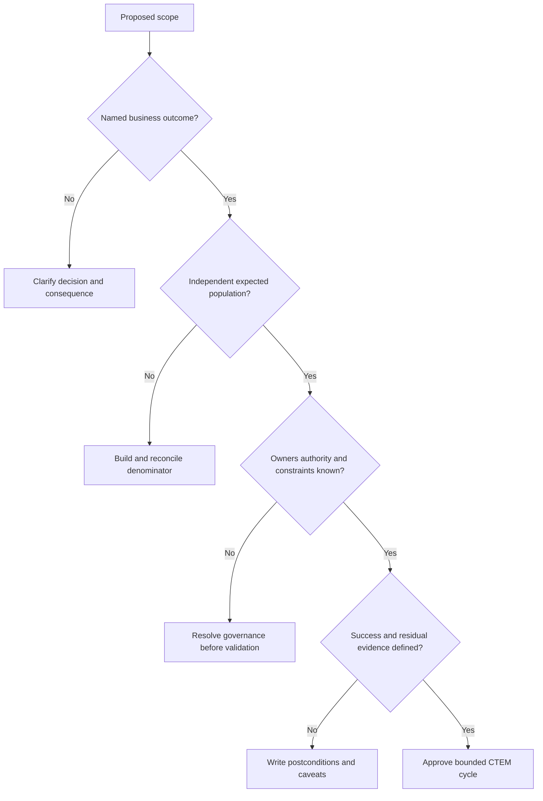

Scoping can be service led, threat led, surface led, or event led. A service-led cycle might focus on a patient portal. A threat-led cycle might examine credential theft paths. A surface-led cycle might inspect newly acquired public cloud exposure. An event-led cycle might reassess after a major architecture change or newly exploited vulnerability. Each still needs business consequence and owner authority.

## Scoping workshop mechanics

A TSM can facilitate a workshop without deciding customer risk. Start with a one-sentence outcome, draw the service and trust boundaries, name crown-jewel data or operations, list likely entry surfaces, identify required sources, expose unknown populations, capture authorities, and choose one testable cycle. End with decisions and owners, not just notes.

| Workshop block | Prompt | Artifact | Decision owner |
|---|---|---|---|
| Outcome | "Which decision is currently too slow or uncertain?" | Outcome statement | Executive/service sponsor |
| Scenario | "What harmful route are we trying to understand?" | Scenario card | Security and service risk roles |
| Boundary | "Which entities and time period count?" | Scope and exclusion ledger | Service/data owners |
| Evidence | "Which source proves each assertion?" | Source contract matrix | Source owners |
| Validation | "What may be tested, where, and how safely?" | Authorization envelope | Security/change/legal roles |
| Mobilization | "Who can alter each path or control?" | RACI and capacity view | Operational owners |
| Success | "What postcondition changes the decision?" | Metric and proof contract | Risk and service owners |

## Activity 2: discovery

Discovery answers more than "what vulnerabilities exist?" It seeks assets, services, identities, privileges, external observations, software and configuration weaknesses, cloud relationships, data, routes, security controls, ownership, and evidence gaps. The goal is not to ingest every possible record. The goal is to produce trustworthy assertions for the scoped decision.

| Discovery family | Example assertions | Typical evidence class | Important caution |
|---|---|---|---|
| Assets | Entity exists, type, lifecycle, owner, service | CMDB, cloud, endpoint, network, SaaS records | Duplicate and stale identities |
| External surface | Hostname, address, certificate, service, ownership | Authorized external observation and DNS/cloud data | Observation is not ownership proof |
| Vulnerabilities | Product/version/configuration has a weakness | Scanner, application, cloud, vendor evidence | Applicability and duplicates |
| Identities | User/workload privilege, trust, authentication state | IAM, directory, PAM, cloud identity | Effective privilege changes over time |
| Paths | Route, protocol, policy, dependency, trust edge | Network, cloud, application, identity evidence | Reachability requires exact prerequisites |
| Controls | Present, configured, healthy, enforcing, effective | Control-native telemetry and authorized tests | Installed is not effective |
| Data | Sensitivity, location, flow, access relationship | Classification, DLP, repository metadata | Privacy and minimization |
| Threats | Relevant adversary technique, campaign, exploitation | Vetted intelligence and local detections | Relevance and copied-source overlap |
| Business | Service, criticality, consequence, owner, recovery need | Customer-authoritative records | Technical tools should not invent it |
| Work | Ticket, exception, treatment, validation, recurrence | ITSM and governance records | Closed ticket is not closure proof |

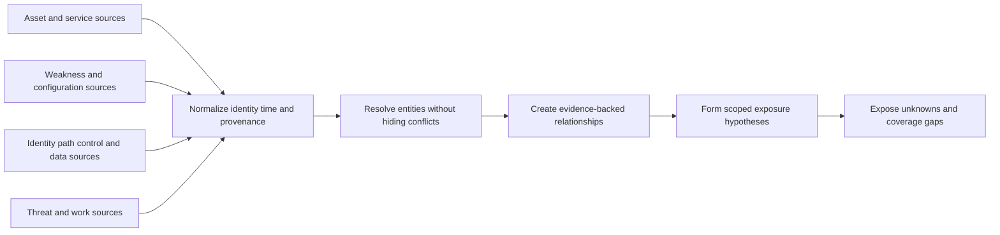

Discovery quality needs an independent denominator. If a cloud connector sees 900 resources, the team cannot declare 100 percent coverage merely because all 900 imported successfully. It needs a separately established expected population, including inaccessible subscriptions, unmanaged accounts, acquisition environments, retired-but-still-routable systems, and source exclusions. Unknown is an evidence state, not a secret zero.

### Plain-English deep-dive 3 - A graph is useful only when its edges are evidence

An exposure graph is like a transport map. Circles may represent assets, identities, weaknesses, controls, data, or business services. Lines may represent "can reach," "can assume," "depends on," "contains," or "is protected by." Drawing many lines creates an impressive picture, but a wrong line can create a fictional route and a missing line can hide a real one.

Every consequential edge therefore needs a semantic contract: exact meaning, direction, source, observation time, scope, prerequisites, confidence, authority, and expiration. "User accesses server" is too vague. Does it mean a successful session last month, current group authorization, a network route, an application role, or an inferred possibility? Those are different assertions. CTEM discovery should preserve the distinction and allow challenge.

Arti's SQL experience is directly useful here. A many-to-many join can multiply rows and make one source appear like many independent facts. A failed inner join can drop unknown assets and improve a percentage. A stale dimension can attach yesterday's owner to today's service. The transferable skill is evidence modeling and reconciliation. It is not a claim of access to any Zscaler schema.

## Source and assertion contracts

| Contract field | Why it exists | Example question |
|---|---|---|
| Purpose | Prevents purposeless data collection | Which decision uses this assertion? |
| Grain | Prevents row-count confusion | Is one row an observation, entity, edge, or episode? |
| Identity | Enables stable correlation | Which keys survive rename, movement, or reassignment? |
| Authority | Distinguishes source ownership | Is this source authoritative for lifecycle or merely observational? |
| Scope | Defines included and excluded populations | Which accounts, regions, tenants, or networks are visible? |
| Time | Makes state comparable | Observation time, effective time, ingestion time, expiry? |
| Semantics | Defines exact meaning | Does "protected" mean installed, enforcing, or tested? |
| Quality | Makes unknown and conflict visible | What completeness, freshness, validity, and conflict states exist? |
| Security | Protects sensitive evidence | Who can view identities, paths, weaknesses, and data labels? |
| Recovery | Supports operation | How are outage, backfill, duplicates, and replay handled? |

## Activity 3: prioritization

Prioritization converts discovered conditions into an attention order that is explainable and executable. A high-quality decision combines applicability, technical characteristics, observed threat activity, path prerequisites, identity privilege, business consequence, control evidence, uncertainty, dependencies, and owner capacity. It avoids pretending those dimensions are one objective truth.

| Decision dimension | Useful question | Evidence state to preserve | Misuse to avoid |
|---|---|---|---|
| Applicability | Does the exact weakness affect the entity? | Confirmed, disproved, unknown | Treating every product match as affected |
| Threat relevance | Is abuse observed or plausibly relevant now? | Local, known external, predicted, theoretical | Turning intelligence into breach proof |
| Entry exposure | Can an actor interact with the prerequisite surface? | Demonstrated, supported, blocked, unknown | Equating public DNS with exploitability |
| Path | Can steps connect to a valuable objective? | Demonstrated, inferred, partial, conflicting | Treating graph line as test result |
| Privilege | What access or trust can be acquired or abused? | Effective, conditional, stale, unknown | Reading one group name as effective access |
| Consequence | What service, data, safety, or legal harm could follow? | Customer-attested and time-bounded | Vendor invents criticality |
| Controls | Which exact prerequisite is interrupted? | Effective, partial, bypassable, stale, unknown | Crediting installation as effectiveness |
| Evidence quality | How strong and current is each assertion? | Source, time, confidence, conflicts | Hiding missing data in a low score |
| Feasibility | What treatment is safe and available? | Ready, dependent, constrained, unknown | Ranking work no owner can execute |

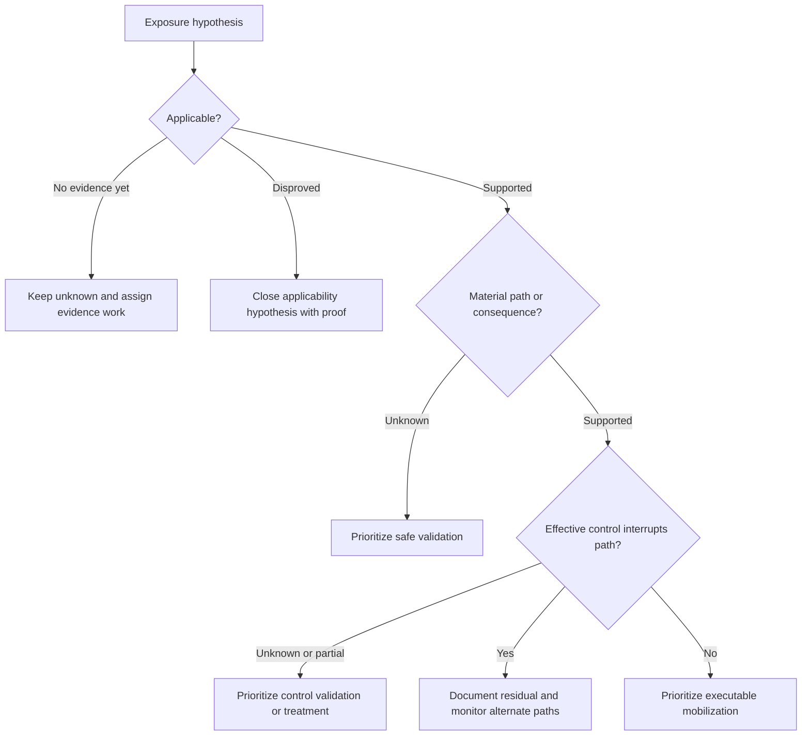

Priority can produce different queues: urgent containment, technical remediation, control validation, owner identification, source repair, architecture work, exception review, or monitoring. Unknown high-consequence evidence can be urgent even when exploitation is not proven. CTEM should prioritize the next useful decision, not only a patch.

## Activity 4: safe validation

Validation tests important assumptions. It can range from passive evidence review through configuration checks, reachability tests, control simulations, breach and attack simulation, and authorized penetration testing. The test strength should match the decision, consequence, and safety envelope. Validation is not permission to exploit production systems.

| Validation level | Example | What it can support | What it cannot prove |
|---|---|---|---|
| Evidence review | Compare native configuration, route, and control records | Stronger applicability or path hypothesis | Live behavior |
| Passive observation | Review logs and prior allowed traffic | Historical behavior under observed conditions | Current universal reachability |
| Nonintrusive check | Resolve DNS, negotiate approved connection, inspect banner safely | Specific prerequisite under test | Full exploitability or impact |
| Configuration validation | Evaluate policy and effective access | Intended/effective configuration state | Every runtime bypass |
| Control simulation | Use approved benign technique or test object | Control response for stated technique | All variants or future effectiveness |
| BAS | Execute controlled technique set in authorized scope | Repeatable technique/control evidence | Human adversary creativity |
| Penetration test | Authorized expert follows scoped paths | Demonstrated combination and impact under test | Absence of all other paths |

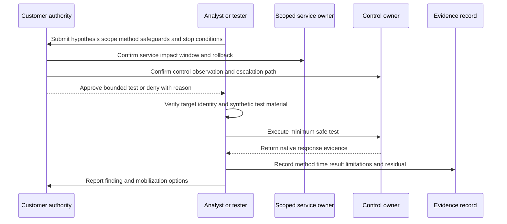

### Plain-English deep-dive 4 - Validation strengthens one claim, not every claim

If a locksmith demonstrates that one key opens one door at 10:00, the test supports a specific claim about that key, door, lock state, and time. It does not prove every door is open, that the key was used maliciously, or that the building has no other safeguards. A failed attempt can mean the lock worked, the wrong door was tested, the prerequisite was absent, or the test method was unsuitable.

Exposure validation needs the same precision. Record target identity, route, technique, prerequisites, time, source and destination, account or synthetic identity, control version and policy, expected behavior, observed evidence, limitations, safety events, and residual questions. Use explicit result states such as demonstrated, blocked by named control, partially demonstrated, disproved under tested conditions, inconclusive, not run, or out of scope. Avoid the single ambiguous word "validated."

## Validation authorization and safety envelope

| Safety field | Required content | Why it matters |
|---|---|---|
| Business purpose | Decision the test informs | Prevents curiosity-driven intrusion |
| Written scope | Exact targets, identities, routes, techniques, and times | Prevents target drift |
| Prohibited actions | Data access, persistence, destructive actions, social engineering, or load limits | Defines hard safety boundaries |
| Test material | Benign payload, test account, synthetic data, cleanup method | Protects real users and data |
| Monitoring | Observers, expected alerts, logging, and evidence capture | Supports control evaluation and incident distinction |
| Stop conditions | Service degradation, unexpected access, scope uncertainty, data contact | Enables immediate safe halt |
| Contacts | Test lead, service owner, SOC, change lead, legal/privacy, escalation | Avoids response confusion |
| Rollback | Reversal and recovery steps | Reduces operational risk |
| Retention | Storage and deletion of sensitive evidence | Protects exploit and path details |
| Sign-off | Authorized approvers and expiry | Preserves accountability |

## Activity 5: mobilization

Mobilization is the coordinated conversion of evidence into treatment. A technically correct recommendation can still fail if no owner accepts it, a change window is unavailable, a supplier dependency exists, a safety review is missing, or closure proof is undefined. CTEM therefore connects security reasoning with operating reality.

| Mobilization element | Required decision | Evidence artifact |
|---|---|---|
| Treatment | Avoid, reduce, transfer, monitor, accept, or investigate | Treatment record |
| Owner | Accountable authority and executing teams | Accepted RACI |
| Rationale | Scenario, drivers, confidence, and residual | Decision receipt |
| Dependencies | Supplier, architecture, testing, procurement, capacity, change | Dependency map |
| Sequencing | Choke point, temporary control, durable fix, later hardening | Wave plan |
| Safety | Blast radius, canary, rollback, maintenance and clinical constraints | Change plan |
| Timing | Due logic, checkpoints, exception expiry | Action register |
| Proof | Technical, path, control, service, and monitoring postconditions | Validation plan |
| Communication | Technical, operational, risk, and executive messages | Communication matrix |
| Learning | Defect, recurrence, alternate path, pattern, next scope | Retrospective record |

```mermaid
flowchart LR
    FIND[Prioritized exposure scenario] --> OWNER[Accept accountable owner]
    OWNER --> OPT[Compare treatment options]
    OPT --> DEP[Resolve dependencies and authority]
    DEP --> PLAN[Plan temporary and durable controls]
    PLAN --> CANARY[Canary with rollback and monitoring]
    CANARY --> VERIFY[Verify technical path control and service postconditions]
    VERIFY --> RESID[Record residuals exceptions and alternate paths]
    RESID --> FEED[Feed lessons into next CTEM cycle]
```

## Iteration and continuous improvement

Continuous does not mean scanning every second or testing everything repeatedly. It means cycles are triggered and refreshed at a cadence appropriate to risk and change. A critical internet service may need frequent external observation and rapid event-driven reassessment. A stable isolated system may use a slower, safety-governed cadence. Major identity, cloud, acquisition, application, threat, or control changes can trigger a new cycle.

| Trigger | Why rescope or refresh | Useful response |
|---|---|---|
| New business service | New consequence and population | Create scope charter and source contracts |
| Acquisition | Unknown assets, identities, trust, and controls | Bounded discovery and temporary segmentation |
| Architecture change | Routes and dependencies changed | Recompute and safely validate paths |
| Identity change | Privilege or trust changed | Refresh effective access evidence |
| New exploited weakness | Threat relevance changed | Reassess applicability, entry, paths, controls |
| Control change | Protection assumptions changed | Validate named control and alternate routes |
| Source outage | Confidence and denominator changed | Mark outputs degraded and repair evidence |
| Treatment completed | Claimed exposure changed | Validate postconditions and recurrence monitor |
| Incident lesson | Previously unknown path became visible | Add scenario, detection, control, and scope updates |

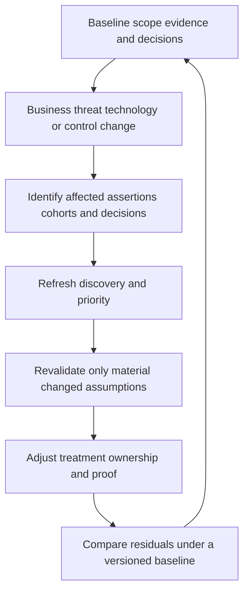

## CTEM conceptual architecture

This is a general reference architecture, not a claim about proprietary Zscaler internals. It separates evidence collection, semantic correlation, decision logic, validation, work, and governance so each layer can be tested.

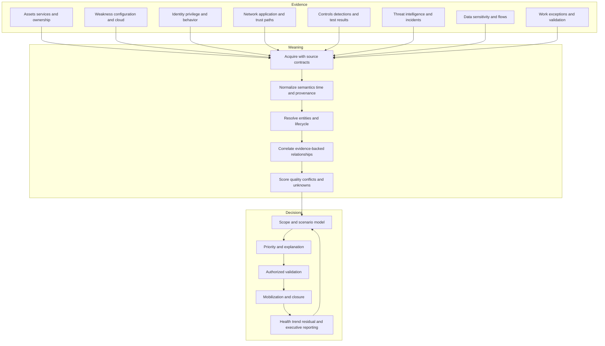

| Layer | Contract | Health question | Security question |
|---|---|---|---|
| Source | Scope, authority, grain, identity, time, semantics | Is expected evidence complete and current? | Are access and secrets least privilege? |
| Acquisition | Authentication, pagination, incremental/backfill, retries | Are records arriving without loss or duplication? | Are transport and storage protected? |
| Semantic | Mapping, units, state, null, version, provenance | Are meanings preserved across sources? | Are sensitive attributes minimized? |
| Entity | Stable identity, merge/split, lifecycle, aliases | Are entities falsely combined or fragmented? | Can users see entities they should not? |
| Relationship | Edge meaning, direction, prerequisite, expiry | Are paths based on current support? | Are attack-path details access controlled? |
| Decision | Scope, policy, priority, confidence, reason | Is output explainable and calibrated? | Can unauthorized users alter policy? |
| Validation | Authorization, method, guardrails, evidence | Are tests safe, representative, and reproducible? | Can test capability be abused? |
| Workflow | Owner, action, state, exception, proof | Are decisions delivered and reconciled? | Are approvals and audit separated? |
| Reporting | Metric, denominator, time, drill-down, caveat | Does summary reconcile to evidence? | Is audience access appropriate? |

## Product boundary map

The following is a conceptual study map. Public pages establish broad positioning, not a guaranteed technical dependency, shared object model, license bundle, data direction, or implementation sequence.

| Capability | Publicly supported study role | CTEM relationship | Boundary to state |
|---|---|---|---|
| Data Fabric for Security | Aggregate, harmonize/map, deduplicate, correlate/enrich, apply logic, workflow, and reporting positioning | Potential data and operational foundation in Zscaler's exposure story | Verify exact sources, objects, directions, and entitlement |
| Asset Exposure Management | Unified asset visibility/context and coverage-gap positioning | Supports discovery and asset/control context | Do not infer universal asset authority |
| Unified Vulnerability Management | Contextual multifactor vulnerability priority and remediation positioning | Supports vulnerability input, priority, and treatment workflows | CTEM is broader than UVM |
| CTEM | Continuous exposure-management program positioning | Organizes scope, discovery, priority, validation, mobilization | Do not reduce it to one scanner or dashboard |
| Risk360 | Risk drivers, trends, attack-stage, guided mitigation, financial/executive positioning | Can inform enterprise framing and decisions | Model outputs need assumptions and current verification |

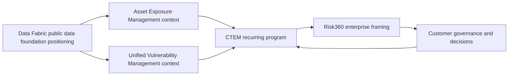

## CTEM operating model and decision rights

| Role | Typical responsibility in general practice | Decision it should not silently assume |
|---|---|---|
| Executive sponsor | Set outcome, remove blockers, fund material treatment | Technical test method alone |
| Business/service owner | Attest consequence, availability, and acceptable change | Security policy alone |
| Security/exposure lead | Operate cycle, evidence, priority, validation coordination | Enterprise risk acceptance without authority |
| Asset/CMDB owner | Maintain identity, lifecycle, ownership, and service records | Exploitability conclusion |
| VM team | Operate vulnerability evidence and remediation lifecycle | Every non-vulnerability exposure |
| IAM team | Explain identity, trust, privilege, and authentication controls | Business consequence |
| Network/cloud/app teams | Explain routes, configuration, dependencies, and treatment | Organization-wide risk appetite |
| SOC/IR | Supply detections, local threat evidence, and incident lessons | Unapproved intrusive testing |
| Control owner | Attest configuration/health and support validation | Universal control effectiveness |
| Red/purple/test team | Execute authorized validation and report limits | Production scope expansion |
| Risk/legal/privacy/change | Govern acceptance, safety, obligations, and approvals | Invent technical evidence |
| TSM | Clarify documented capability, facilitate adoption, evidence, reviews, and escalation | Customer risk, change, testing, or data authority |

## Program cadence

| Cadence | Inputs | Decisions | Outputs |
|---|---|---|---|
| Event driven | New threat, incident, source/control failure, major change | Rescope, contain, validate, communicate | Incident action and refreshed scenario |
| Daily/operational | High-attention episodes, validation safety, source/workflow health | Assign, unblock, pause, escalate | Action register and health state |
| Weekly | Priority cohorts, owner capacity, dependencies, validation results | Sequence work and resolve blockers | Mobilization board |
| Monthly | Scope coverage, trends, recurrence, exceptions, lessons | Tune model/process and approve next wave | Service review |
| Quarterly | Material scenarios, investment, maturity, value, residuals | Fund, accept, redirect, expand | Executive roadmap |
| Annual or strategy event | Business architecture, threat landscape, obligations | Reauthorize program scope and governance | CTEM charter revision |

## Evidence and metric contracts

Counting findings alone can reward source outages, exclusions, duplicate cleanup, or scope shrinkage. CTEM metrics should show outcome, evidence health, workflow, validation, and residuals together.

| Metric family | Example general metric | Denominator or contract | Caveat |
|---|---|---|---|
| Scope | Expected in-scope entities represented | Independent expected population | Unknown populations remain explicit |
| Discovery | Assertions current and source healthy | Expected assertion set by scope | More data is not automatically better |
| Priority | High-attention scenarios with reason and owner | Eligible scenario cohort | Score movement is not reduction |
| Validation | Material hypotheses tested safely | Authorized eligible hypotheses | Selection bias must be stated |
| Controls | Tested prerequisites interrupted | Controls/scenarios actually tested | One technique does not prove universal coverage |
| Mobilization | Accepted work reaching validated closure | Actionable accepted work | Ticket closure is not proof |
| Aging | Time in evidence, decision, dependency, change, validation states | Stable episode clock and time basis | Reassignment must not reset age |
| Residual | Scenarios remaining after treatment | Baseline matched cohort | Scope and model versions matter |
| Recurrence | Reappearance under defined recurrence type | Validated closed cohort | Define same episode versus new occurrence |
| Health | Source, mapping, identity, decision, test, workflow, report health | Contracted components | One green status is insufficient |

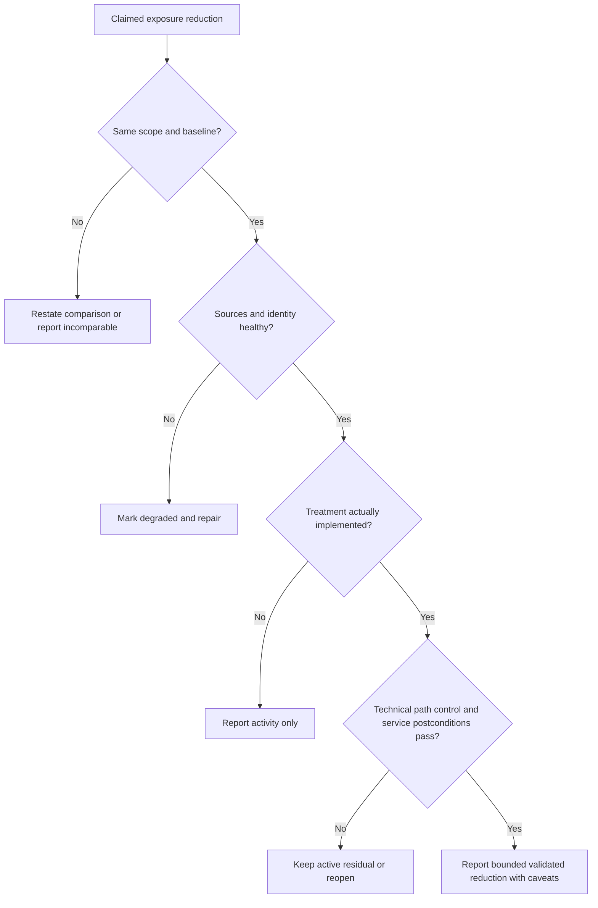

## Decision logic for choosing the next CTEM action

1. Confirm the business scope, expected population, time, and authority.
2. Confirm the entity, weakness or condition, applicability, and evidence provenance.
3. Express the harmful scenario as entry, prerequisites, actions, objective, and consequence.
4. Identify which assertions are demonstrated, supported, conflicting, stale, or unknown.
5. Identify named controls and exactly which prerequisite each is expected to interrupt.
6. Choose whether the next uncertainty requires source repair, passive evidence, safe validation, containment, treatment, or governance.
7. Compare treatment options by path coverage, safety, dependencies, reversibility, time, and residuals.
8. Mobilize the smallest effective bounded action with owner, checkpoints, rollback, and proof.
9. Validate closure, reconcile downstream records, report caveats, and feed lessons into the next scope.

## Troubleshooting CTEM from symptom to controlling layer

| Symptom | Plausible causes | Discriminating check | Containment |
|---|---|---|---|
| Exposure count suddenly drops | Source outage, scope/filter change, deduplication, valid treatment | Reconcile expected population and source controls | Mark report degraded; pause success claim |
| Path appears impossible | Wrong entity merge, stale route, ambiguous edge, missing prerequisite | Trace every edge to source/time/semantics | Remove from automation pending review |
| Critical path disappears | Failed join, control assumed effective, identity split, policy change | Left/anti-join cohort and compare versions | Preserve prior episode as active unknown |
| Validation says blocked but owner disagrees | Different route, identity, policy, time, test method | Reproduce exact tested conditions and alternate path | State bounded result only |
| Too many urgent items | Scope too broad, duplicates, poor applicability, no cohorts | Sample by source/entity/scenario and test capacity | Separate evidence repair from action queue |
| Owners reject work | Wrong owner, weak rationale, unsafe fix, dependency, trust defect | Observe task and sample disputed cases | Pause bulk routing; repair controlling cause |
| Ticket closed but exposure remains | State mapping, failed postcondition, recurrence, alternate path | Compare native evidence and closure contract | Reopen or create linked residual record |
| Test causes unexpected alert | Expected detection not coordinated or scope mismatch | Match test ID/time/technique with SOC records | Stop test and follow safety escalation |
| Executive trend improves unrealistically | Denominator shrink, model change, missing source, restatement gap | Movement bridge and fixed cohort | Withdraw unsupported narrative |

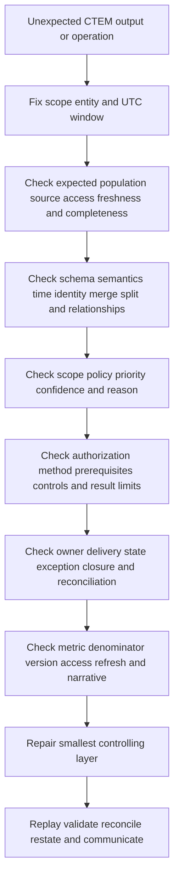

## Common failure modes and misconceptions

| Misconception or failure | Why it fails | Better decision rule |
|---|---|---|
| CTEM is a product purchase | Program decisions and ownership remain | Define operating model and verified product roles |
| CTEM is a new name for scanning | Exposure includes identity, route, controls, data, and consequence | Use multiple evidence families |
| CTEM replaces VM | Vulnerability hygiene and lifecycle remain essential | Integrate VM as a major input and action path |
| Discover everything first | Infinite ingestion delays useful decisions | Start with bounded material scope |
| Every graph edge is a fact | Inference and stale joins create fictional paths | Require edge contracts and lineage |
| Validation means exploit production | Unsafe and unauthorized | Use minimum sufficient authorized method |
| Blocked once means protected | Test result is conditional | State exact scope and examine alternate paths |
| High score means breach | Priority is not incident proof | Keep risk, detection, and incident evidence distinct |
| More findings means worse security | Coverage and duplication alter counts | Use stable denominators and movement bridges |
| Fewer findings means success | Outages and scope shrink can lower counts | Require health and postconditions |
| Patch everything first | Capacity and safety require selection | Prioritize material executable scenarios |
| Installed control means effective | Configuration, enforcement, bypass, and time matter | Validate named prerequisite interruption |
| Ticket closed means exposure closed | Workflow state is not technical truth | Require closure evidence and recurrence watch |
| Continuous means constant intrusive tests | Safety and cadence must fit context | Use risk-based event and periodic cycles |
| TSM owns customer risk | Vendor role lacks customer authority | Facilitate evidence and decisions transparently |

## Security, privacy, safety, and ethical operations

CTEM data can become a high-value blueprint: vulnerabilities, external assets, identities, privileges, paths, controls, sensitive-data locations, exceptions, and planned changes. Apply purpose limitation, minimization, least privilege, separation of duties, encryption, retention, audit, export control, regional and legal review, and secure support handling. Redact secrets, personal data, exploit material, tenant identifiers, and unnecessary topology from escalation packets.

Validation capability needs stronger control than ordinary reporting. Separate plan approval from execution where appropriate; use test identities and synthetic data; verify target identity immediately before action; record immutable authorization and expiry; rate limit; define stop conditions; monitor service and SOC response; clean up artifacts; and retain evidence according to policy. A successful test does not authorize broader action.

AI may help summarize cited evidence, classify artifacts for human review, draft hypotheses, generate benign test cases, compare versions, or prepare communication. It should not invent missing evidence, silently enrich sensitive data, select unapproved targets, execute tests, authorize remediation, accept risk, or make unsupervised production changes. Prompt injection and malicious source content are relevant because evidence may contain attacker-controlled text. Ground output in approved sources and require human verification.

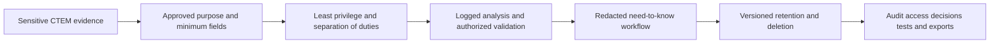

## Complete synthetic NMH CTEM case

Everything in this section is explicitly fictional and synthetic. It does not describe a Zscaler tenant, customer, product feature, supported integration, field, score, formula, attack path, test result, or Arti production experience. All dates in this section are synthetic scenario dates and are on or before the official review date. The official source snapshot remains 2026-08-24.

NMH is a fictional healthcare organization. Its synthetic CTEM cycle is dated 2026-08-18 through 2026-08-22. The fictional sponsor asks a bounded question: "Could an internet-originated credential attack reach the synthetic medication-ordering service through unmanaged external exposure or overbroad identity trust, and which safe treatment would interrupt the most plausible routes?" No real target or exploit is involved.

### Synthetic scope charter

| Field | Synthetic NMH choice |
|---|---|
| Outcome | Improve evidence and treatment decisions for one fictional medication-ordering service |
| Consequence | Unauthorized ordering, service outage, or sensitive record access |
| Included | Synthetic public names, app gateway, identity relationships, admin path, service dependencies, named controls |
| Excluded | Real exploitation, patient data, social engineering, destructive tests, persistence, supplier systems |
| Authority | Fictional security, service, change, privacy, and risk roles |
| Success | Reconciled scope, explained scenarios, safe tests, accepted actions, passed postconditions, explicit residuals |
| Cadence | One synthetic bounded cycle plus event-driven refresh |

### Synthetic discovery

Three fictional sources disagree about the gateway identity. A cloud inventory calls it `gw-med-01`; a CMDB calls it `MED-WEB-PROD`; an external observation has a public hostname and certificate but no owner. The team does not merge solely on similar names. It uses synthetic cloud resource identity, certificate evidence, DNS history, service-owner attestation, and lifecycle time. The merge is recorded as a confidence-bounded relationship with provenance.

The fictional vulnerability source reports an affected library. The service owner says the vulnerable function is disabled, but no versioned configuration evidence exists. The identity source shows a support group with conditional administration rights. A network policy source suggests a management route, while a prior synthetic connection log shows only a different subnet. A control record says endpoint protection is installed, but effectiveness for the scenario is unknown.

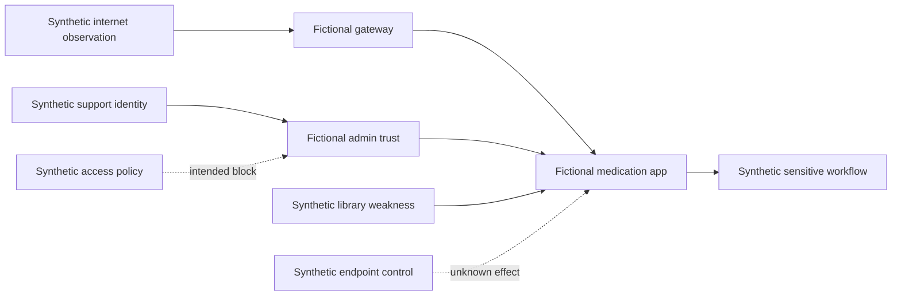

### Synthetic priority decision

The team creates three scenario hypotheses rather than one opaque score. Scenario A concerns direct use of the reported library through the public gateway. Scenario B concerns credential acquisition followed by conditional support access. Scenario C concerns a source-quality blind spot hiding another gateway. Scenario B is selected first for safe validation because it connects a plausible entry to high privilege and a material service, while its control state is uncertain. Scenario A receives urgent applicability evidence work. Scenario C receives discovery repair because an unknown external denominator could invalidate both.

| Synthetic scenario | Evidence | Unknown | Next action | Why |
|---|---|---|---|---|
| A: public library route | Product/version match and gateway relationship | Feature applicability and route prerequisite | Configuration evidence plus nonintrusive route check | Avoid unsupported exploit claim |
| B: credential-to-admin route | Conditional group and app relationship | Effective policy under test identity | Authorized synthetic identity simulation | Test a material control assumption |
| C: unknown gateway | External/CMDB count mismatch | Expected public population | Reconcile DNS, cloud, certificate, and owner lists | Scope confidence controls all other claims |

### Synthetic validation plan and result

The fictional authorization permits a synthetic test identity, approved application test endpoint, no real data, no password attack, no persistence, a five-request limit, live SOC observation, and immediate stop on service or scope anomaly. Scenario B's test shows the named policy blocks the direct support-group route under the tested conditions. A second approved configuration review reveals a separate emergency role outside that policy. The result is therefore "named route blocked; alternate privileged route supported by configuration evidence but not executed." It is not "identity risk eliminated."

### Synthetic mobilization

The fictional plan has four parallel tracks. The identity owner reviews and narrows emergency-role eligibility. The application owner supplies versioned applicability evidence and plans an update if affected. The external-surface owner reconciles the expected gateway population. The control owner adds a bounded recurring test for the named policy. The risk role records residual unknowns and the service owner approves a canary window. Closure requires identity-policy read-back, path retest, service health, source reconciliation, and residual review.

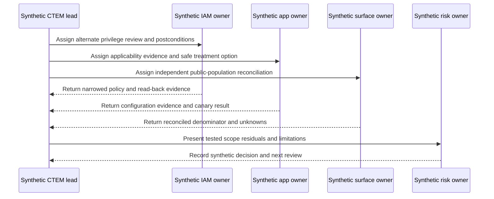

### Synthetic outcome statement

A defensible fictional statement is: "For the synthetic scope and 2026-08-22 test conditions, the named support-group route was blocked by the observed policy. An alternate emergency-role route was identified from configuration evidence and was narrowed under approved change. The public gateway population reconciled across the defined synthetic sources, with one retired record retained for monitoring. Application applicability was confirmed and a canary update passed stated technical and service postconditions. Residual supplier and alternate-path assumptions remain listed. These are synthetic exercise results, not product or customer outcomes."

## Practical scenarios and decision drills

### Scenario 1: the critical CVE with no known owner

Do not immediately create a bulk urgent patch order. Confirm entity identity and lifecycle, applicability, public or internal reachability, business relationships, control evidence, and the independent owner population. If consequence could be material, owner uncertainty is itself urgent work. Use temporary restrictions if customer authority supports them. Closure needs ownership repair and technical postconditions.

### Scenario 2: the low-severity weakness on a privileged path

Do not dismiss it because of severity. Express the route, privilege, objective, controls, and evidence. A low-severity condition may be a necessary path step; conversely, a graph inference may be wrong. Prioritize the discriminating evidence or safe test and consider a choke-point treatment that blocks multiple routes.

### Scenario 3: the control that blocks a benign simulation

Record the exact technique, route, identity, policy, version, and time. Ask whether variants, alternate routes, policy exceptions, stale endpoints, and unavailable telemetry remain. Credit the control only for the tested prerequisite. Continue durable remediation if the underlying weakness remains material under alternate assumptions.

### Scenario 4: the external inventory doubles overnight

First test whether scope, acquisition, certificates, cloud accounts, lifecycle, or deduplication changed. Do not describe the increase as a doubled attack surface until entities and ownership are reconciled. Quarantine uncertain automation, preserve raw observations, and create a movement bridge.

### Scenario 5: owner capacity cannot meet priority demand

Priority must include execution. Segment urgent containment, validation, quick choke points, supplier dependencies, and durable work. Use customer governance to choose capacity, deadlines, and acceptance. Do not quietly lower risk scores to make the queue fit.

## Customer and TSM artifact kit

| Artifact | Minimum fields | Quality test |
|---|---|---|
| CTEM charter | Outcome, service, scenario, population, time, authority, constraints, success, exclusions | One bounded decision can be stated |
| Scope register | Included/excluded entities, source, reason, owner, validity | Reconciles to independent denominator |
| Source contract | Purpose, grain, identity, scope, time, semantics, quality, security, recovery | Unknowns cannot silently disappear |
| Assertion ledger | Claim, source, time, transformation, confidence, conflict, expiry | Every material edge is challengeable |
| Scenario card | Entry, prerequisites, actions, objective, consequence, controls, unknowns | Separates fact from hypothesis |
| Priority receipt | Cohort, reasons, evidence, policy, uncertainty, owner, next action | Analyst can explain ordering |
| Validation plan | Purpose, scope, method, guardrails, stop, monitoring, rollback, approval | Minimum sufficient safe method |
| Validation record | Conditions, evidence, result state, limitations, residual, cleanup | No universal claim from bounded test |
| Mobilization board | Action, owner, dependency, due, checkpoint, safety, proof | Work is accepted and executable |
| Residual register | Remaining scenario, control, uncertainty, authority, expiry | Closure does not hide risk |
| Movement bridge | Baseline, additions, removals, changes, defects, treatment, residual | Explains trend without spin |
| Service review | Health, priority, validation, work, exceptions, outcomes, decisions | Ends with owners and checkpoints |

## TSM discovery questions

1. Which business service, unacceptable consequence, and decision define the first CTEM scope?
2. Which expected assets, identities, routes, controls, data, and environments belong, including unknown populations?
3. Which source is authoritative for each assertion, and what are its scope, time, quality, and recovery contracts?
4. How are entity merges, path edges, inferred relationships, and conflicting evidence explained and challenged?
5. Which customer roles own testing authority, service safety, change, privacy, risk acceptance, and technical execution?
6. Which hypotheses require passive review, nonintrusive checks, control simulation, BAS, or human penetration testing?
7. Which treatment options interrupt the most material paths with acceptable safety and operational cost?
8. Which technical, path, control, service, monitoring, and recurrence postconditions define closure?
9. Which product functions, integrations, directions, limits, and entitlements need current licensed-tenant verification?
10. Which review cadence converts evidence, overrides, incidents, and recurrence into the next cycle?

## Safe exercises

| Exercise | Task | Deliverable | Pass condition |
|---|---|---|---|
| 1 | Write a one-service CTEM charter | One-page scope | Outcome, denominator, authority, and proof are explicit |
| 2 | Compare CTEM and VM | Decision table | Relationship is complementary, not replacement hype |
| 3 | Build a synthetic source contract | Contract matrix | Grain, identity, time, quality, security, recovery included |
| 4 | Model five synthetic entity types | Evidence graph | Every edge has source and meaning |
| 5 | Find join-induced false confidence | SQL-style reconciliation notes | Missing and duplicated entities are exposed |
| 6 | Write three exposure scenarios | Scenario cards | Entry, prerequisites, objective, consequence, controls separated |
| 7 | Prioritize next actions | Cohort board | Evidence repair and validation can outrank patching |
| 8 | Draft a validation authorization | Safety envelope | Scope, prohibited actions, stop, monitoring, rollback present |
| 9 | Classify six validation results | Result ledger | Bounded states and limitations are precise |
| 10 | Identify choke points | Path treatment map | Shared prerequisites and alternate routes shown |
| 11 | Create a mobilization RACI | RACI and action list | Risk, test, change, service, and technical authority separated |
| 12 | Define closure postconditions | Proof contract | Technical and service evidence included |
| 13 | Diagnose a count drop | Troubleshooting tree | Source and denominator tested before success claim |
| 14 | Build a movement bridge | Reconciliation table | Every baseline movement category reconciles |
| 15 | Write an executive update | Seven-sentence brief | Scenario, evidence, action, residual, decision, owner, caveat |
| 16 | Create a redacted escalation packet | Case template | Reproduction and one ask without secrets |
| 17 | Run a tabletop source outage | Timeline and decisions | Automation and claims contained before repair |
| 18 | Review AI use | Control checklist | Grounding, data, authorization, and human review covered |

## Arti bridge: factual strengths applied to CTEM

M365, OneDrive, and SharePoint escalations often require resolving the exact tenant, user, site, file, permission, client, network route, timestamp, service dependency, and change history before making a claim. That discipline maps naturally to CTEM's entity, relationship, provenance, scope, and evidence-quality requirements. The analogy is strong because both domains punish vague identity and mixed timestamps. It does not establish CTEM production operation.

Networking and trace analysis support disciplined reachability reasoning. DNS resolution, routing, transport, TLS negotiation, proxy behavior, authentication, application response, and policy are separate prerequisites. A successful DNS lookup does not prove application access; a blocked TCP route does not prove every route is blocked. That layered method is valuable for attack-path questions without claiming offensive-security experience.

SQL and Power BI skills support expected-population reconciliation, entity matching, many-to-many detection, temporal joins, null preservation, cohort comparison, movement bridges, drill-down, and caveated executive reporting. Escalation experience supports impact framing, containment, evidence packets, ownership, checkpoints, and validation. Mentoring supports teach-back and playbooks. Responsible AI exploration supports bounded assistance with citations and review. The honest sentence remains: these are transferable capabilities; production Zscaler CTEM and customer exposure governance are learning areas.

## Official Source Anchors

Research/source snapshot and source review date: **2026-08-24**.

Official Zscaler sources below support bounded public product positioning only. The five-activity lifecycle, architecture, contracts, validation levels, decision trees, governance, metrics, troubleshooting, and exercises are general security study practices. NMH is fictional and synthetic. Exact product architecture, shared data, feature behavior, fields, testing, integrations, limits, licensing, and outcomes require current official documentation and licensed-tenant evidence.

| Source | URL | Used for | Boundary |
|---|---|---|---|
| Zscaler Continuous Threat Exposure Management | https://www.zscaler.com/products-and-solutions/ctem | Public CTEM and exposure-management positioning | CTEM remains a broader program; no exact workflow, object, method, entitlement, or result inferred |
| Zscaler Data Fabric for Security | https://www.zscaler.com/products-and-solutions/data-fabric | Public ingest, harmonize/map, deduplicate, correlate/enrich, logic, workflow, and reporting positioning | No proprietary architecture, algorithm, data direction, or latency claim |
| Zscaler Asset Exposure Management | https://www.zscaler.com/products-and-solutions/caasm | Public unified asset visibility, context, and exposure positioning | No universal source authority or CTEM dependency inferred |
| Zscaler Unified Vulnerability Management | https://www.zscaler.com/products-and-solutions/vulnerability-management | Public contextual multifactor priority, workflow, and reporting positioning | UVM is not equated with all of CTEM |
| Zscaler Risk360 | https://www.zscaler.com/products-and-solutions/zscaler-risk-360 | Adjacent public enterprise risk-driver, trend, mitigation, financial, and reporting positioning | No formula, factor count, certainty, or product dependency inferred |
| NIST Cybersecurity Framework 2.0 | https://www.nist.gov/cyberframework | Govern, Identify, Protect, Detect, Respond, Recover outcomes and profiles | Voluntary framework; customer implementation varies |
| NIST SP 800-53 Rev. 5 | https://csrc.nist.gov/pubs/sp/800/53/r5/upd1/final | Access, assessment, configuration, risk, incident, privacy, and supply-chain control context | Requires customer selection, tailoring, implementation, and assessment |
| NIST SP 800-40 Rev. 4 | https://csrc.nist.gov/pubs/sp/800/40/r4/final | Enterprise patch-management planning and verification | Does not define CTEM product behavior |
| MITRE ATT&CK | https://attack.mitre.org/ | Common technique knowledge for scenario and control discussion | Not proof that a technique occurred or applies |

## Likely Interview Questions

### Q1. What is CTEM from first principles?

**Model answer:** Continuous Threat Exposure Management is a recurring, business-aligned program for reducing material exposure. It scopes important services and consequences, discovers assets, identities, weaknesses, paths, controls, and unknowns, prioritizes executable scenarios, validates important assumptions safely, and mobilizes owners through treatment and closure proof. It repeats as the business, technology, threats, and controls change. It is broader than a scanner or dashboard and remains governed by customer authority.

### Q2. How is CTEM different from vulnerability management?

**Model answer:** Vulnerability management remains essential for discovery, assessment, remediation, exceptions, and verification of vulnerabilities. CTEM uses that evidence but broadens the decision unit to exposure scenarios involving assets, external surfaces, identity, configuration, paths, controls, data, and business consequence. It adds explicit business scoping, path and control validation, cross-team mobilization, and iterative rescoping. I would integrate the programs rather than claim CTEM replaces VM.

### Q3. What makes a good CTEM scope?

**Model answer:** A good scope names one customer decision, business service, unacceptable consequence, threat scenario, expected population, time boundary, evidence sources, owners, testing/change/risk authority, safety and privacy constraints, success postconditions, exclusions, and review cadence. It uses an independent denominator and is bounded enough to validate but important enough to matter. Tool ingestion volume is not a scope definition.

### Q4. How should discovery and prioritization work?

**Model answer:** Discovery collects only decision-relevant evidence under source contracts for grain, identity, authority, scope, time, semantics, quality, security, and recovery. It correlates assets, identities, weaknesses, routes, controls, data, threats, business context, and work while preserving conflicts and unknowns. Prioritization then considers applicability, threat relevance, path, privilege, consequence, controls, evidence quality, feasibility, and capacity. Its output is an explained next-action cohort, not merely a score.

### Q5. How do you validate an exposure safely?

**Model answer:** Start with a precise hypothesis and choose the minimum sufficient method, from evidence review through nonintrusive checks, configuration validation, control simulation, BAS, or authorized penetration testing. Obtain written scope and approvals, verify targets, use synthetic identities/data, define prohibited actions, monitoring, rate limits, stop conditions, contacts, rollback, cleanup, and retention. Record exact conditions, result state, limitations, alternate paths, and residuals. A bounded result never proves universal protection or compromise.

### Q6. What does mobilization add beyond a remediation ticket?

**Model answer:** Mobilization aligns the treatment decision, accountable owner, executing teams, rationale, dependencies, sequencing, temporary controls, change safety, capacity, checkpoints, exception or acceptance authority, communication, and closure proof. It can select choke points that interrupt several paths rather than issue one ticket per finding. It also validates technical, path, control, service, and monitoring postconditions and feeds recurrence or defects into the next cycle.

### Q7. How would you troubleshoot an implausible CTEM trend or path?

**Model answer:** Fix the exact scope, entity, viewer, and UTC window; preserve raw evidence and pause harmful automation or success claims. Reconcile the independent population, source access/freshness/completeness, schema and time mappings, entity merges/splits, edge semantics, policy/model versions, validation conditions, workflow states, exceptions, closure, metric denominators, and access filters. Repair the smallest controlling layer, replay deterministically, reconcile downstream work, restate affected history, and communicate affected decisions.

### Q8. How does Arti's background support CTEM while preserving honesty?

**Model answer:** Microsoft 365, OneDrive, and SharePoint escalation work provides adjacent discipline in exact identity, permissions, scope, layered dependencies, customer impact, evidence, containment, ownership, RCA, and validation. Networking traces support reachability reasoning. SQL and Power BI support entity correlation, nulls, temporal models, denominators, trends, and drill-down. Mentoring supports adoption, and reviewed AI assistance supports bounded summaries and tests. NMH is synthetic; production Zscaler, CTEM, offensive testing, and customer risk ownership remain learning boundaries.

## 30-Second Memory Hooks

| Concept | Memory hook |
|---|---|
| CTEM | Scope, discover, prioritize, validate, mobilize, repeat |
| Scope | Business decision before tool boundary |
| Discovery | Find entities, edges, evidence, and unknowns |
| Priority | Next useful action, not prettiest score |
| Validation | Minimum sufficient safe test |
| Mobilization | Owner, dependency, change, proof, residual |
| Exposure | Weakness plus reachable conditions and consequence |
| Attack path | Evidence-backed route, not decorative graph line |
| Choke point | One treatment interrupts many routes |
| VM relationship | Essential input and execution engine, not obsolete |
| Unknown | Visible evidence state, never hidden low risk |
| Control | Credit only the prerequisite demonstrably interrupted |
| Continuous | Refresh on risk-based cadence and change |
| Closure | Technical plus path plus control plus service proof |
| TSM | Facilitate product use, evidence, adoption, and escalation without customer authority |
| Arti bridge | Microsoft escalation rigor transfers; production CTEM experience does not |

## Completion Checklist

- [ ] I separate official product fact, general security practice, scenario assumption, customer fact, and unknown.
- [ ] I define threat, weakness, vulnerability, exposure, attack surface, attack path, choke point, control, residual exposure, scope, discovery, prioritization, validation, mobilization, iteration, CTEM, VM, EASM, CAASM, BAS, applicability, reachability, exploitability, criticality, blast radius, lineage, confidence, and risk acceptance.
- [ ] I can explain why CTEM is a management loop rather than a scanner or one-time project.
- [ ] I can explain CTEM and VM as complementary without declaring VM obsolete.
- [ ] I build scope from business outcome, service, consequence, scenario, independent population, time, authority, constraints, success, and exclusions.
- [ ] I discover assets, surfaces, weaknesses, identities, paths, controls, data, threats, business context, and work under source contracts.
- [ ] I preserve assertion meaning, direction, provenance, time, prerequisites, confidence, conflict, and expiry.
- [ ] I prioritize applicability, threat relevance, entry, path, privilege, consequence, controls, evidence quality, feasibility, and capacity.
- [ ] I use explicit unknown, stale, conflict, not-applicable, demonstrated, and disproved states.
- [ ] I choose minimum sufficient validation and obtain written authority, guardrails, monitoring, stop conditions, rollback, cleanup, and retention.
- [ ] I state validation results narrowly and examine alternate paths.
- [ ] I mobilize treatment with accepted owner, rationale, dependencies, sequencing, safety, checkpoints, exceptions, proof, communication, and learning.
- [ ] I validate technical, path, control, service, monitoring, and recurrence postconditions before closure.
- [ ] I rescope after business, architecture, identity, threat, control, source, treatment, or incident changes.
- [ ] I distinguish Data Fabric, Asset Exposure Management, UVM, CTEM, and Risk360 public positioning without inventing dependencies or entitlements.
- [ ] I troubleshoot scope, source, schema, time, identity, relationships, decision logic, validation, workflow, report, and narrative in order.
- [ ] I use independent denominators, source health, matched cohorts, movement bridges, and residuals for honest metrics.
- [ ] I protect sensitive asset, identity, weakness, path, control, data, exception, and test evidence.
- [ ] I use AI only for approved, grounded, bounded assistance with human review and no testing or risk authority.
- [ ] I can explain every NMH statement as explicitly fictional and synthetic.
- [ ] I can create the charter, source contract, assertion ledger, scenario card, priority receipt, validation plan/record, mobilization board, residual register, movement bridge, and service review.
- [ ] I can complete all eighteen exercises and explain the five practical scenarios.
- [ ] I connect M365/networking/SQL-Power BI/escalation/mentoring/AI strengths without claiming production Zscaler, CTEM, Risk360, SOC, or offensive-security experience.
- [ ] I retain the official source review date exactly as 2026-08-24.
- [ ] I can answer all eight interview questions with precise evidence and neutral honesty syntax.

[Part 88 - Exposure Validation, Attack Paths, Controls, and Mobilization](Part-88-exposure-validation-mobilization.md)