# Part 88 - Exposure Validation, Attack Paths, Controls, and Mobilization

> **Audience:** Candidates preparing for a Zscaler Security Operations Technical Success Manager role after enterprise Support Escalation Engineering.

> **Purpose:** Build an operational understanding of exposure validation, evidence-backed attack paths, control effectiveness, safe test design, choke-point prioritization, mobilization, closure proof, troubleshooting, governance, and communication without teaching unauthorized exploitation or inventing product behavior.

> **Scope and honesty:** Northstar Meridian Holdings, abbreviated NMH, is an explicitly fictional and synthetic customer used only for study. Every NMH system, identity, source, weakness, path, control, test, date, metric, ticket, decision, and result is invented. Your factual background is Microsoft 365, OneDrive, and SharePoint support; networking and trace analysis; SQL and Power BI; enterprise escalations; mentoring; and responsible AI exploration. Production Zscaler, CTEM, Risk360, exposure validation, breach and attack simulation, penetration testing, red teaming, control assurance, SOC operations, and customer risk authority remain learning boundaries.

> **Currency caveat:** Product wording, exposure methods, architecture, interfaces, telemetry, workflows, testing capabilities, limits, entitlements, and customer conditions change. The controlled official-source snapshot and source review date for this Part is exactly **2026-08-24**. Current official documentation, licensed-tenant evidence, customer testing policy, written authorization, product specialists, Zscaler Support, source-native evidence, safety monitoring, and measured postconditions govern production decisions.

> **Section goal:** Enable you to explain how a team moves from an exposure hypothesis to bounded evidence and executable treatment: model attack paths without treating inference as fact, validate prerequisites and controls with the minimum safe method, select efficient choke points, mobilize accountable owners, and prove residual reduction while keeping uncertainty and authority visible.

The reviewed Zscaler CTEM page supports bounded public positioning around continuous exposure management. The reviewed Data Fabric, Asset Exposure Management, UVM, and Risk360 pages support adjacent positioning around unified context, vulnerability priority, and enterprise risk framing. This Part does not claim a proprietary Zscaler attack-path engine, validation method, control catalog, workflow, data model, or entitlement. The path model, test ladder, assurance logic, and mobilization process below are general security practice.

Statements are labeled by evidence class: **official product fact** comes only from reviewed public pages; **general security practice** describes reusable methods; **scenario assumption** belongs only to explicitly fictional NMH; **customer fact** would require customer-authoritative evidence; and **unknown** remains unresolved. "Supported" means evidence backs a bounded assertion. It does not mean exploited, compromised, or universally true.

```mermaid
flowchart LR
    HYP[Exposure hypothesis] --> PATH[Model prerequisites and attack path]
    PATH --> CLAIM[Identify decisive claims]
    CLAIM --> METHOD[Choose minimum safe validation]
    METHOD --> RESULT[Record bounded result and limitations]
    RESULT --> CHOKE[Compare path choke points]
    CHOKE --> MOB[Mobilize owners and treatment]
    MOB --> PROOF[Validate closure and residuals]
    PROOF --> LEARN[Update paths controls and next scope]
```

| Operating rule | Meaning | Evidence expected | Failure prevented |
|---|---|---|---|
| Hypothesis before test | State exactly what must be true | Entry, prerequisites, objective, consequence | Random tool activity |
| Edge before path | Prove the meaning of each relationship | Source, direction, time, condition, confidence | Decorative graph certainty |
| Minimum sufficient method | Use the least risky test that changes a decision | Method rationale and authority | Unnecessary intrusion |
| Control-specific credit | Credit only the prerequisite actually interrupted | Policy, health, response, test conditions | Installed-equals-effective error |
| Choke-point economics | Prefer safe changes that block several material routes | Path coverage and residual analysis | Finding-by-finding overload |
| Closure by postcondition | Require evidence after treatment | Technical, path, control, service, monitoring proof | Ticket-state closure |
| Customer authority | Keep test, change, service, and risk decisions with authorized roles | Approval and audit | TSM or tool overreach |

## JD Mapping

| JD signal | Capability developed | Artifact | Honest boundary |
|---|---|---|---|
| Deep SecOps and exposure expertise | Explain path, validation, control, and treatment mechanics | Path evidence ledger | No offensive-production claim |
| Trusted advisor | Translate technical routes into customer decisions | Scenario and option brief | Customer owns risk and test authority |
| Technical success | Turn insight into safe, accepted, validated work | Mobilization plan | No guaranteed risk reduction |
| Troubleshooting | Isolate wrong edges, tests, controls, workflow, and reports | Layered runbook | No unsupported root cause |
| Analytics | Reconcile graph evidence, cohorts, coverage, and residuals | SQL/Power BI-style model | No product schema claim |
| Stakeholder coordination | Align SOC, red/purple teams, IAM, network, cloud, app, data, change, privacy, and risk | RACI and communication matrix | TSM facilitates rather than commands |
| Proactive communication | State scope, result, impact, residual, owner, and checkpoint | Technical/executive update | No universal assurance |
| Support partnership | Package unexpected product behavior precisely | Redacted support packet | No roadmap or fix promise |
| Responsible AI | Bound AI to cited analysis and draft assistance | AI review record | No autonomous target or test selection |

## Candidate honesty note

Neutral phrasing keeps transferability credible: "I have production experience with layered Microsoft service diagnosis and customer escalation. I have studied exposure-validation mechanics and practiced them only through synthetic artifacts. In a real environment, I would follow customer authorization and verify current product capabilities." Avoid affirmative unsupported statements such as "I validated attack paths," "I proved controls," or "I reduced customer exposure" when referring to production.

| Factual strength | Transfer to this topic | Safe evidence | Boundary |
|---|---|---|---|
| M365/OneDrive/SharePoint | Resolve exact entity, permission, dependency, and state | Approved production support history | Not attack-path validation |
| Networking/traces | Separate DNS, route, transport, TLS, proxy, auth, and application layers | Packet/trace reasoning | Not penetration testing |
| SQL/Power BI | Model entities/edges, temporal state, nulls, lineage, and trends | Analytics skills | Not Zscaler internal data access |
| Escalations | Contain harm, preserve evidence, coordinate owners, validate recovery | Enterprise case method | Not customer risk ownership |
| Mentoring | Explain methods, review evidence, enable teach-back | Coaching practice | Not red-team leadership |
| AI exploration | Summarize cited evidence and draft bounded test cases | Human-reviewed assistance | Not autonomous security action |
| NMH | Demonstrate synthetic reasoning and artifacts | This clearly fictional chapter | Never a customer result |

## Beginner vocabulary and memory hooks

| Term | Plain meaning | Why it matters | Analogy |
|---|---|---|---|
| Exposure hypothesis | Testable statement that harmful conditions connect | Gives validation a precise purpose | Suspected route on a map |
| Node | Entity represented in a graph | Can be asset, identity, weakness, control, data, or service | Place on a rail map |
| Edge | Defined relationship between nodes | Connects steps into a path | Track between stations |
| Prerequisite | Condition required before a step works | Identifies what can be disproved or blocked | Key needed before opening door |
| Entry point | First scoped interaction available to an actor | Anchors path beginning | Building entrance |
| Objective | State an actor seeks | Anchors path end | Room containing the safe |
| Attack path | Ordered prerequisites and actions connecting entry to objective | Reveals combined exposure | Route through rooms |
| Attack chain | Narrative sequence of adversary actions | Communicates temporal behavior | Steps in a burglary plan |
| Reachability | Ability to establish required communication/access | Supports one path prerequisite | Road reaches the property |
| Exploitability | Practical ability to abuse a weakness under conditions | Separates theoretical from actionable | Faulty lock can be operated here |
| Lateral movement | Movement from one internal identity/system to another | Expands blast radius | Crossing rooms after entry |
| Privilege escalation | Gaining greater authority | May unlock sensitive actions | Moving from visitor to master key |
| Choke point | Shared dependency whose interruption blocks many paths | Increases treatment leverage | Single bridge between districts |
| Control objective | Intended security outcome | Defines what effectiveness means | Keep unauthorized people out |
| Preventive control | Attempts to stop an action | May break the path before harm | Locked door |
| Detective control | Identifies relevant behavior | Supports response but may not block | Alarm |
| Corrective control | Restores or repairs after event | Limits duration and recurrence | Repair crew |
| Compensating control | Alternate safeguard when primary treatment is unavailable | Reduces stated residual temporarily | Guard while lock is replaced |
| Control efficacy | Ability under designed/test conditions | Laboratory or design potential | Brake model capability |
| Control effectiveness | Performance in the real intended context | Determines practical path interruption | Brakes on this car today |
| Assurance | Confidence supported by evaluation evidence | Helps govern reliance | Inspection certificate with scope |
| Test case | Inputs, conditions, expected result, and cleanup | Makes validation repeatable | Fire-drill script |
| Positive test | Expected malicious-like action should be detected/blocked safely | Confirms response path | Alarm rings for test smoke |
| Negative test | Legitimate behavior should remain allowed | Detects overblocking | Normal cooking does not trigger alarm |
| Canary | Small representative first change/test | Limits blast radius | One pilot room |
| Rollback | Defined reversal if outcomes fail | Protects service | Restore prior configuration |
| Postcondition | Evidence required after action | Determines closure | Reinspect after repair |
| Residual | Condition remaining after action | Prevents overclaiming | Side door still under review |

### Plain-English deep-dive 1 - An attack path is a chain of conditional sentences

An attack-path diagram is not a photograph of an intrusion. It is closer to a chain of conditional sentences: if an actor can reach this service, and if the exact weakness applies, and if the actor can obtain this identity, and if the policy allows this action, then the actor may reach the objective. Each "if" has evidence, age, and uncertainty. Removing one required condition can break that particular route.

Think of planning a train journey. A map shows tracks, but the journey also depends on station access, operating times, a valid ticket, an interchange, and no closure. A historical train movement does not prove today's schedule. A planned track does not prove an operating service. Exposure analysis should distinguish configured, observed, inferred, and demonstrated relationships the same way.

## From scenario to path model

Start with a scenario sentence rather than a tool result: "An external actor using a compromised contractor identity could reach a private administration service, obtain excessive cloud privilege, and access regulated data because specific access and segmentation assumptions may not hold." Break it into claims that can be supported, disproved, or left unknown.

| Path component | Required detail | Example evidence class | Common ambiguity |
|---|---|---|---|
| Actor | Capability and starting access assumed | Threat model, local incident, test identity | Generic "attacker" |
| Entry | Exact service, identity, device, or interface | External observation, IAM, application records | Public name versus reachable service |
| Condition | Weakness/configuration/trust required | Native configuration or scanner evidence | Product match versus applicability |
| Transition | Action connecting nodes | Route, policy, session, test, code path | Inferred versus observed |
| Privilege | Effective authority at each step | IAM/PAM/cloud policy and session evidence | Group membership alone |
| Control | Safeguard expected to interrupt transition | Control-native policy/health/test | Installed versus effective |
| Objective | Data, service, privilege, disruption, or persistence | Business and architecture records | Technical endpoint without consequence |
| Consequence | Customer-attested harm | Risk/service owner evidence | Vendor-assigned impact |

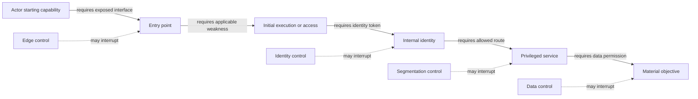

## Edge evidence contract

Each edge should have a record rather than exist only as a line. This makes path review and troubleshooting possible.

| Field | Question | Example state |
|---|---|---|
| Edge type | What exact relationship is asserted? | `identity may administer workload` |
| Direction | Which node can act on which? | Identity to workload |
| Prerequisites | Which route, credential, device, policy, or feature is required? | Managed device plus step-up authentication |
| Source | Which native record supports it? | IAM effective-policy export |
| Observation/effective time | When was it seen and when was it valid? | UTC timestamps with policy version |
| Method | Observed, configured, inferred, or tested? | Configured and read back |
| Confidence | How strong is the bounded assertion? | Supported with one stale dependency |
| Conflict | Which evidence disagrees? | Session log absent during window |
| Expiry | When must it be refreshed? | On policy change or scheduled date |
| Owner | Who can attest and correct it? | IAM control owner |

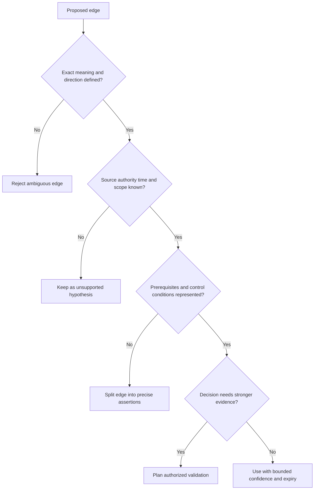

## Path types and evidence strength

| Path state | Meaning | Appropriate language | Action |
|---|---|---|---|
| Theoretical | Technically conceivable with unverified prerequisites | "A possible route requires..." | Decide whether evidence is worth collecting |
| Inferred | Source relationships support a route computationally | "The graph supports an inferred path..." | Trace edges and test decisive claims |
| Configured | Current policies/configuration permit prerequisites | "Configuration evidence supports..." | Check runtime and compensating controls |
| Observed | Logs show relevant transitions occurred | "The transition was observed in this window..." | Confirm purpose, identity, and context |
| Demonstrated | Authorized test completed the stated transition | "The route was demonstrated under these conditions..." | Mobilize and preserve strict result scope |
| Interrupted | Named control blocked a tested prerequisite | "This route was blocked at this step..." | Check variants and alternate paths |
| Disproved | Required assertion is false under defined evidence | "This hypothesis is unsupported for this scope..." | Close bounded hypothesis, monitor change |
| Inconclusive | Evidence/test cannot distinguish outcomes | "The result does not support a conclusion..." | Repair method or choose another evidence source |

### Plain-English deep-dive 2 - Reachability is a stack, not a yes/no field

When a web page fails, an escalation engineer does not stop at "network issue." DNS may resolve the wrong name, routing may lack a path, TCP may be blocked, TLS may reject a certificate, a proxy may deny policy, authentication may fail, authorization may deny the resource, or the application may return an error. Each layer has distinct evidence.

Security reachability should be decomposed similarly. "Internet reachable" might mean only that DNS exists, that a TCP port responded once, that a TLS service answered, that an unauthenticated endpoint exists, or that an affected function can be invoked. "Internal reachable" might require device posture, identity, app segment, policy, protocol, and time. A path engine or analyst should not compress these into one unexplained Boolean. Your factual networking background supports this layered reasoning, not a production claim about testing attack paths.

## Validation goals and decision value

Validation is useful only when a result changes a decision. Before choosing a method, write the claim, alternatives, consequence, current evidence, and threshold for action.

| Validation goal | Question | Possible next decision |
|---|---|---|
| Applicability | Does the exact vulnerable feature/configuration exist? | Patch, close bounded false applicability, or collect evidence |
| Exposure | Can the required interface be reached under defined conditions? | Restrict route, monitor, or retain current control |
| Privilege | Can the identity perform the claimed action? | Narrow role, require stronger authentication, or document limit |
| Path | Can connected prerequisites reach the objective? | Treat choke point or disprove bounded route |
| Prevention | Does a named control block the technique? | Rely within scope, tune, or add control |
| Detection | Does relevant telemetry generate actionable signal? | Tune detection, routing, context, or response |
| Response | Does the process contain and recover within objectives? | Fix playbook, authority, integration, or staffing |
| Closure | Did treatment remove the exact condition without harmful regression? | Close, reopen, roll back, or retain residual |

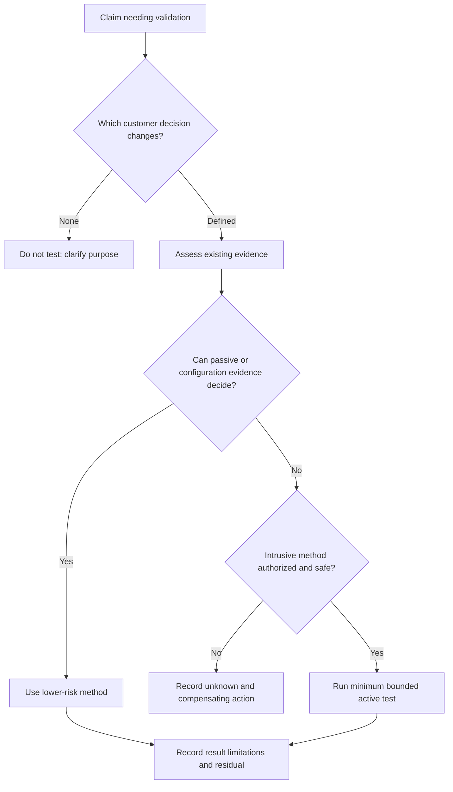

## Validation method ladder

| Method | Intrusiveness | Strength for a bounded claim | Main limitations | Typical authority |
|---|---:|---|---|---|
| Documentation and architecture review | Very low | Intended design and dependencies | May differ from effective state | Owner review |
| Native configuration read-back | Low | Effective configured state at time | Runtime and bypass uncertainty | Platform owner |
| Log/trace review | Low | Observed historical transitions | Absence is not proof of prevention | Data/control owner |
| Safe reachability probe | Low to moderate | Specific communication prerequisite | Not exploitation or impact | Change/security approval |
| Benign control test object | Moderate | Named control response | Technique/variant scope | Control and service approval |
| Synthetic identity transaction | Moderate | Authentication/authorization path | Test identity may differ from users | IAM/app/change approval |
| BAS technique simulation | Moderate to high | Repeatable technique/control path | Tool and technique coverage limits | Security/test authority |
| Penetration test | High | Human-demonstrated combinations | Point-in-time and scoped | Written legal/security authorization |
| Red/purple exercise | High | Adversary workflow plus defensive learning | Cost, safety, scope, observer effects | Executive/security authorization |

## Authorization packet

No active security validation should begin because a graph looks alarming. The authorization packet establishes purpose, target, method, prohibited behavior, monitoring, and accountability.

| Authorization field | Required detail | Failure if omitted |
|---|---|---|
| Decision purpose | Exact customer question and expected use | Testing without value |
| Target identity | Stable identifiers, owner, lifecycle, environment | Wrong-target action |
| Test identities | Synthetic/approved accounts and privileges | Real-user impact or overreach |
| Routes/techniques | Exact source, destination, protocol, action, variant | Scope drift |
| Time | UTC start/end, expiry, change window | Ambiguous correlation |
| Allowed actions | Positive list of permitted behavior | Assumed permission |
| Prohibited actions | Data access, destructive behavior, persistence, load, social tactics | Safety/legal breach |
| Data | Synthetic material, handling, cleanup, retention | Privacy exposure |
| Monitoring | Service, control, SOC, logs, success and safety signals | Invisible impact |
| Stop conditions | Scope doubt, degradation, unexpected access, real data contact | Continued harm |
| Rollback/recovery | Reversal, backup, health checks, authority | Uncontrolled outage |
| Contacts | Test lead, service, SOC, change, privacy/legal, escalation | Response confusion |
| Approval | Named authorized roles, signatures, expiration | No accountable authority |

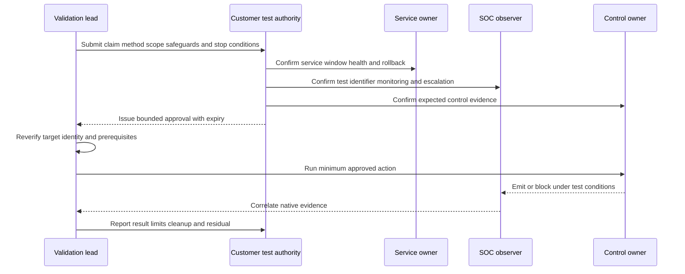

## Safe execution mechanics

1. Reconfirm that approval is current and the exact target remains in scope.
2. Announce the test identifier and UTC window to required observers without disclosing more than policy allows.
3. Capture baseline service, policy, control, and telemetry state.
4. Verify synthetic identity, destination, technique, test material, request limit, and cleanup.
5. Execute one minimum action and observe service/control/SOC signals before continuing.
6. Stop immediately on scope uncertainty, real sensitive data, unexpected privilege, degradation, or a defined threshold.
7. Preserve native evidence and time synchronization; distinguish client timeout from server-side outcome.
8. Clean up test artifacts and verify service and security state.
9. Record demonstrated, interrupted, disproved, partial, inconclusive, not-run, or out-of-scope result.
10. Communicate limitations and residuals before recommending treatment.

## Result semantics

| Result | Definition | Defensible statement | Unsafe statement |
|---|---|---|---|
| Demonstrated | Approved transition/objective occurred | "The stated step succeeded under listed conditions." | "The organization is breached." |
| Interrupted | Named control stopped stated prerequisite | "The control blocked this technique and route." | "The control prevents all attacks." |
| Partial | Some required transitions occurred | "These steps succeeded; these remain unsupported." | "The path is basically proven." |
| Disproved | Required assertion was false under defined conditions | "This bounded hypothesis did not hold." | "No exposure exists." |
| Inconclusive | Method/evidence cannot distinguish | "No conclusion; method or telemetry must be repaired." | "Probably safe." |
| Not run | Approval, safety, method, or prerequisite unavailable | "Validation remains outstanding for stated reason." | "No issue found." |
| Out of scope | Test deliberately excluded | "No assertion is made about this population." | Silent omission |

### Plain-English deep-dive 3 - A blocked test can expose a weak assurance process

Suppose a test email attachment is blocked. That is useful evidence for the exact file, channel, user policy, inspection path, signature or behavior, product state, and time. It says nothing by itself about encrypted archives, cloud links, unmanaged devices, alternate identities, another region, or a future policy version. If the team records only a green check, it loses the conditions needed to rely on the result.

Good assurance turns one test into a scoped claim plus questions: Which control objective was evaluated? What was expected? What native evidence confirms the action? Which variants are equivalent? Which alternate routes matter? How long is the result valid? What change triggers retest? What happens when telemetry is missing? This is why "blocked" is the beginning of control reasoning, not the end.

## Control model from presence to effectiveness

| Control state | Meaning | Evidence | Decision caution |
|---|---|---|---|
| Expected | Policy/architecture says control should exist | Standard and scope | No implementation proof |
| Present | Component or service is installed/available | Inventory | No configuration proof |
| Configured | Relevant policy exists | Versioned native configuration | No enforcement proof |
| Healthy | Component reports operational status | Health telemetry | Health may not equal policy effect |
| Enforcing | Control is in active prevention/detection path | Mode and transaction evidence | Exact scope matters |
| Triggered | Test/activity matched control logic | Event and test correlation | Trigger may not block or route correctly |
| Effective | Intended outcome occurred under test conditions | Native response and postcondition | Bounded to method and conditions |
| Partial | Some prerequisites/variants covered | Gap analysis | Residual must remain visible |
| Bypassed | Alternate route or condition avoids control | Demonstrated/configuration evidence | Requires containment/treatment |
| Stale | Evidence is too old after relevant change | Validity rule | Do not carry old assurance forward |
| Unknown | Evidence missing/conflicting | Quality record | Never translate to effective |
| Not applicable | Control objective genuinely irrelevant | Reviewed reason | Do not use as missing or effective |

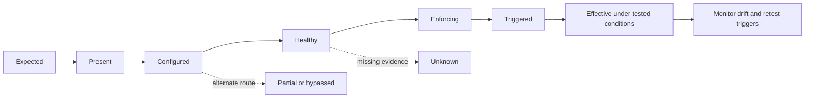

## Prevent, detect, respond, recover

Controls can interrupt different parts of a harmful scenario. A preventive control may block access. A detective control may identify behavior after access. Response may contain an identity or workload. Recovery may restore service and clean state. Crediting a detective alert as prevention overstates protection, while ignoring detection and response understates resilience.

| Control function | Path effect | Validation question | Example postcondition |
|---|---|---|---|
| Govern | Sets authority, policy, and accountability | Are decisions approved and reviewable? | Current owner and exception record |
| Identify | Maintains assets, identities, data, exposure | Is the scoped population visible? | Reconciled denominator |
| Protect/prevent | Stops prerequisite/action | Did the named action fail for the control reason? | Native block plus service health |
| Detect | Produces actionable signal | Was signal timely, accurate, enriched, and routed? | Case created with correct context |
| Respond | Contains and coordinates | Did authorized action limit the route safely? | Identity/session isolated and verified |
| Recover | Restores service and trusted state | Were integrity and operation restored? | Clean state, service test, recurrence watch |

## Choke-point analysis

A choke point is a shared prerequisite, identity, route, trust, service, or control location whose treatment interrupts multiple material paths. The best choke point is not always the node with the most graph edges. It must be effective, safe, owned, feasible, durable, observable, and resilient to alternate routes.

| Choke-point criterion | Question | Evidence |
|---|---|---|
| Path coverage | How many material paths require it? | Reviewed path set, not raw edge count |
| Consequence coverage | Which material objectives become unreachable? | Customer scenario mapping |
| Exclusivity | Are alternate routes available? | Path search and validation |
| Feasibility | Can the owner change it with available capability? | Owner and dependency acceptance |
| Safety | What legitimate services/users could be disrupted? | Dependency and negative tests |
| Durability | Will treatment survive drift and redesign? | Architecture and ownership review |
| Observability | Can effectiveness and failure be detected? | Health, logs, tests, alerts |
| Reversibility | Can change be canaried and rolled back? | Change plan |
| Time | How quickly can it reduce exposure? | Approved milestones |
| Residual | What remains after treatment? | Alternate-path and uncertainty record |

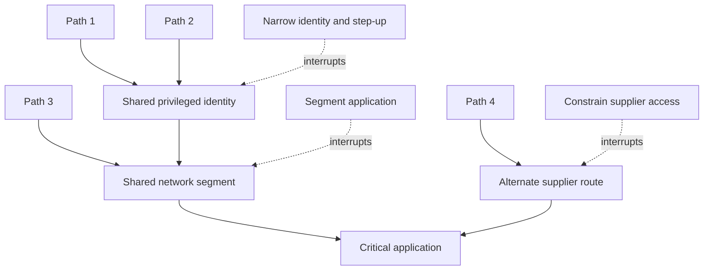

### Plain-English deep-dive 4 - The highest-leverage change can also have the highest blast radius

Closing the only bridge into a city blocks every hostile route across it, but it also blocks ambulances, employees, and supplies. A graph may correctly identify the bridge as a choke point while giving no answer about whether closure is operationally acceptable. Security priority and change safety are related but separate decisions.

Choke-point treatment therefore needs dependency analysis, legitimate-use baselines, negative tests, canary populations, exception handling, monitoring, rollback, communication, and service-owner approval. Sometimes a narrower identity or route change is safer first, followed by architecture redesign. Temporary controls should have expiry and a durable exit plan. The aim is material exposure reduction without creating a larger service risk.

## Choke-point decision logic

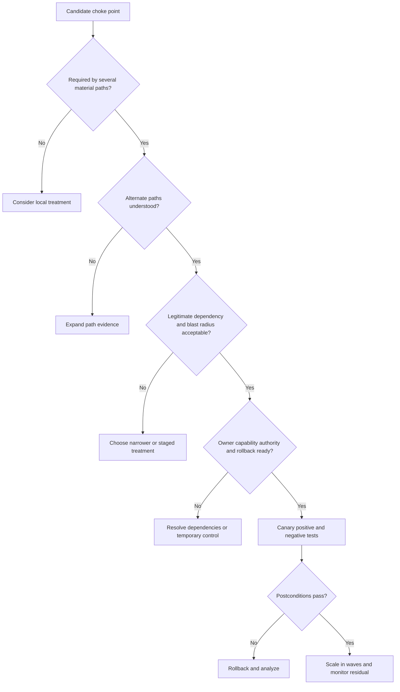

## Treatment options and tradeoffs

| Option | Path effect | Strength | Tradeoff |
|---|---|---|---|
| Remove exposed service | Eliminates entry | Strong and simple when unused | May break business dependency |
| Patch/upgrade | Removes known weakness | Durable technical treatment | Compatibility and change time |
| Reconfigure feature | Removes prerequisite | Often faster than upgrade | Drift and documentation risk |
| Narrow identity privilege | Blocks privilege transition | High cross-path leverage | Operational access redesign |
| Strengthen authentication | Raises identity prerequisite | Reduces credential-abuse routes | Enrollment, recovery, legacy gaps |
| Segment route | Blocks movement | Broad path interruption | Dependency discovery and availability |
| Restrict data permission | Limits objective access | Reduces consequence | Business workflow impact |
| Add preventive control | Blocks technique | Fast compensating option | Coverage, bypass, maintenance |
| Improve detection/response | Shortens dwell and containment | Valuable when prevention incomplete | Does not remove entry condition |
| Monitor | Watches stated residual | Useful for low/accepted risk | Not remediation |
| Accept risk | Records authorized residual | Honest governance | Requires authority, expiry, and review |
| Retire system | Removes asset/path | Durable | Migration cost and hidden dependencies |

## Mobilization architecture

Mobilization links exposure evidence to customer systems of action. It preserves one scenario identifier across work items so teams can reconcile treatment, dependencies, validation, exceptions, and residuals without duplicating the exposure story.

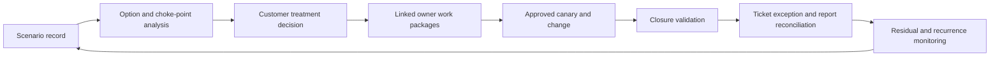

| Mobilization record field | Purpose | Quality test |
|---|---|---|
| Scenario ID/version | Connects all work to one bounded risk story | Stable across tickets and retests |
| Evidence snapshot | Preserves what drove decision | Source/time/confidence accessible |
| Selected option | States treatment and alternatives rejected | Rationale includes safety/residual |
| Accountable owner | Ensures decision authority | Owner explicitly accepts |
| Executing teams | Assigns technical work | Responsibilities do not overlap silently |
| Dependencies | Exposes supplier, identity, architecture, change, procurement | Each has owner and checkpoint |
| Temporary control | Reduces exposure while durable work waits | Scope, evidence, expiry, monitoring |
| Change plan | Defines canary, tests, rollback, communication | Service owner and change approval |
| Closure contract | Defines required postconditions | Ticket close cannot bypass it |
| Residual/exception | Preserves remaining paths and uncertainty | Authority and expiry recorded |

## RACI and separation of duties

| Decision | Responsible | Accountable | Consulted | Informed |
|---|---|---|---|---|
| Path evidence | Exposure analyst/source owners | Security/exposure lead | Architecture and service teams | Risk owner |
| Active test authorization | Validation lead prepares | Customer-authorized security/change/legal role | Service, SOC, privacy, control owners | Operations |
| Test execution | Authorized tester | Validation lead | SOC and service observers | Risk/change roles |
| Control attestation | Control owner | Control authority | Analyst/test team | Service/risk owners |
| Treatment choice | Technical owners advise | Customer risk/service authority | Security, change, privacy, finance | TSM and stakeholders |
| Production change | Executing team | Change/service owner | Security and validation | Users/support |
| Risk acceptance | Risk owner prepares | Authorized customer executive | Legal, privacy, service, security | Relevant operations |
| Closure | Validator performs | Exposure/risk process owner | Technical and service owners | Executive reporting |
| Product escalation | TSM/customer collect | Customer case owner | Zscaler Support/Product as appropriate | Stakeholders |

## Closure postconditions

| Postcondition family | Question | Evidence |
|---|---|---|
| Technical | Was weakness/configuration/identity changed as intended? | Native read-back, version, state |
| Path | Is the required transition no longer supported? | Edge refresh and bounded retest |
| Control | Does the named safeguard interrupt the prerequisite? | Native event and test correlation |
| Negative/service | Do legitimate workflows remain healthy? | Representative transactions and SLO signals |
| Security | Did change create alternate exposure or weaken another control? | Regression/path review |
| Workflow | Do tickets, exceptions, and owners reconcile? | Target-system read-back |
| Reporting | Are cohorts/trends updated without hiding history? | Movement bridge and version annotation |
| Residual | Which paths, populations, assumptions, or dependencies remain? | Signed residual register |
| Recurrence | What will detect reappearance or drift? | Monitor/test trigger and owner |

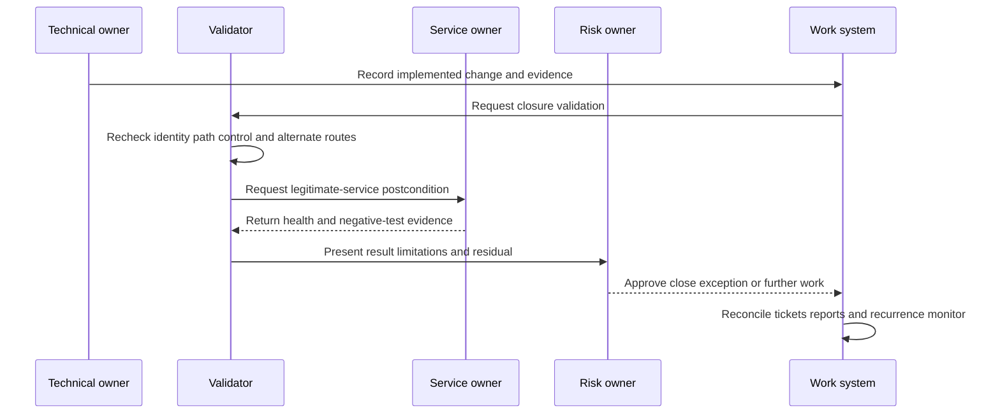

## Troubleshooting attack paths

| Symptom | Plausible controlling defect | Cheapest discriminating check |
|---|---|---|
| Path starts at retired host | Lifecycle or alias mapping stale | Compare native lifecycle and last observation |
| One identity becomes many nodes | Identifier normalization or tenant boundary missing | Reconcile immutable identity and aliases |
| Many unrelated paths share one node | False merge or generic group expansion | Inspect node provenance and membership time |
| Route exists despite deny policy | Rule order, exception, stale graph, alternate interface | Effective-policy read-back and exact probe |
| Route absent despite observed session | Missing source, time mismatch, entity split, unsupported edge | Correlate session IDs and UTC with source scope |
| Vulnerability edge remains after patch | Scan age, version detection, duplicate episode, rollback | Native version plus scanner evidence and identity |
| Control blocks graph but not test | Intended versus effective policy, wrong scope, bypass | Match policy/version/identity/route to test |
| Path disappears after source outage | Inner join or unknown-as-false logic | Anti-join expected edges and last-good snapshot |

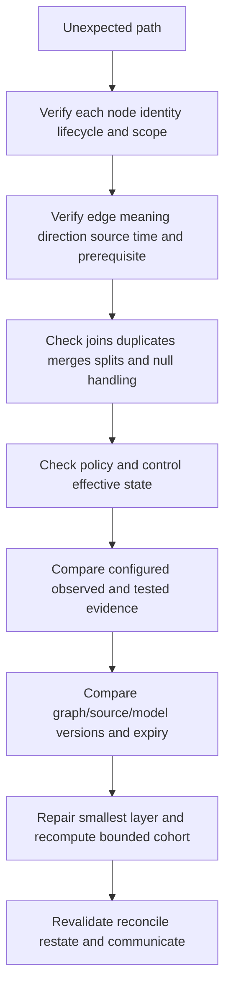

## Troubleshooting validation and controls

| Symptom | Possible cause | Safe response |
|---|---|---|
| Expected block does not occur | Wrong policy scope, unhealthy control, variant, bypass, test error | Stop, preserve evidence, contain route, engage owner |
| No alert appears | Logging disabled, time mismatch, routing failure, detection gap | Confirm native telemetry before repeating |
| Alert appears but no case | Integration, suppression, schema, queue, permissions | Trace event ID through delivery and case system |
| Test times out | Block, service failure, route issue, client timeout, unknown outcome | Check server/control evidence; do not retry blindly |
| Test hits real data | Scope/fixture error | Stop, invoke privacy/security procedure, preserve minimally |
| Service health degrades | Load, dependency, control change, coincidence | Stop, rollback, engage incident/change process |
| Positive test passes but negative fails | Overblocking or policy design defect | Roll back/tune before scale |
| Retest differs from prior result | Drift, version, environment, identity, timing, method | Compare full test contracts, not result labels |

## Common misconceptions and failure modes

| Failure | Why it is dangerous | Better practice |
|---|---|---|
| Graph path equals compromise | Inference is not incident evidence | Label path state and evidence |
| Reachable port equals exploitable app | Several prerequisites remain | Decompose protocol and feature layers |
| Exploit code exists so test it | Availability is not authorization or safety | Choose minimum authorized method |
| No logs means blocked | Telemetry could be absent | Validate prevention and logging independently |
| One blocked test proves control | Variant and path scope are narrow | Record conditions and alternate routes |
| Detection equals prevention | Alert may occur after action | Classify control function correctly |
| Highest-degree node is best fix | Business dependency and false merges matter | Evaluate coverage, safety, feasibility, residual |
| Bulk remediation is mobilization | Ownership, dependencies, proof, and governance missing | Build accepted work packages |
| Exception means closure | Residual remains | Track control health, expiry, milestones |
| Retest passed so delete history | Audit and trend become misleading | Preserve baseline and movement bridge |
| Tester decides risk acceptance | Wrong authority | Route decision to authorized customer role |
| TSM runs unapproved test | Role and safety violation | Facilitate current capability and authorization |

## Security, privacy, legal, and ethical safeguards

Attack-path and validation data can reveal the shortest routes to sensitive services. Restrict it more tightly than generic inventory. Use purpose limitation, role-based access, field/row segmentation where appropriate, encryption, audit, export controls, secure case handling, retention, and deletion. Do not place credentials, tokens, exploit payloads, personal data, or full sensitive topology in ordinary tickets or prompts.

Written authorization must be specific and current. Laws, contracts, cloud-provider rules, supplier agreements, regulated-system requirements, works-council considerations, privacy obligations, and safety rules can alter permitted testing. A TSM should never interpret silence as consent. When authorization is unavailable, preserve the unknown, use lower-risk evidence, recommend compensating controls, and route the decision.

AI inputs can contain attacker-controlled logs, banners, tickets, and documents. Treat them as untrusted data, not instructions. Limit tools and data, ground summaries in cited evidence, prevent secret exfiltration, require target/authorization checks outside the model, and keep humans responsible for test and change decisions.

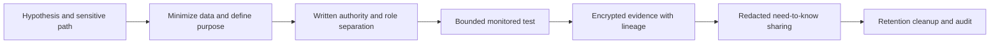

## Complete synthetic NMH validation and mobilization case

Everything in this section is explicitly fictional and synthetic. It is not a description of a Zscaler tenant, supported product graph, validation capability, customer deployment, test, incident, result, or documented production work. Every date below is a synthetic scenario date and is on or before the official source review date. The source snapshot remains 2026-08-24.

The fictional cycle runs from 2026-08-19 to 2026-08-23. NMH's synthetic question is whether a contractor identity could move from a fictional remote support entry to a medication analytics administration plane and then reach a synthetic data repository. The scenario excludes real credentials, patient data, exploitation, destructive action, persistence, social engineering, and supplier infrastructure.

### Synthetic path evidence

| Edge | Initial synthetic evidence | State | Decisive unknown |
|---|---|---|---|
| Contractor to support entry | Current test identity and intended policy | Configured | Effective device/posture rule |
| Support entry to jump service | Architecture and route configuration | Inferred/configured | Runtime segment enforcement |
| Jump service to admin plane | Emergency group membership | Supported | Conditional role activation |
| Admin plane to repository | Service identity permission record | Configured | Exact data-action scope |
| Repository to sensitive objective | Synthetic classification and service map | Customer-attested scenario | No real data used |

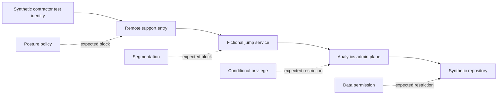

### Synthetic authorization and execution

The fictional authorization permits one synthetic contractor identity, one non-production administration endpoint, benign read-free transactions, five requests, full service and SOC observation, no real repository access, and immediate stop on unexpected privilege or data. The first test confirms posture policy blocks an unmanaged synthetic device. A negative test confirms an approved managed test device can reach the support entry. A configuration read-back reveals the emergency role can be activated by a broader group than intended. The team does not execute repository access because the configuration evidence is sufficient to trigger treatment and the authorized purpose does not require data contact.

### Synthetic choke-point choice

The graph suggests segmentation would block several paths, but the fictional jump service supports critical supplier maintenance. Immediate broad closure has unacceptable service risk. The team selects narrower emergency-role eligibility as the first choke point, adds a time-bound approval step, and schedules segmentation redesign. It also retains posture policy because the positive and negative tests passed their bounded postconditions.

| Synthetic option | Path coverage | Safety | Time | Residual | Decision |
|---|---:|---|---|---|---|
| Disable jump service | High | Unacceptable maintenance impact | Fast | Supplier emergency access unresolved | Reject for now |
| Narrow emergency role | Several privilege paths | Moderate with canary | Short | Jump route remains for approved roles | Select first |
| Segment admin plane | High | Dependency analysis required | Medium | Alternate identity path requires review | Durable roadmap |
| Monitor only | Low | Safe | Fast | Material privilege remains | Insufficient alone |

### Synthetic mobilization and closure

The identity owner changes the fictional role policy for a canary test group, validates legitimate support access, and confirms unauthorized activation fails. The network owner inventories jump-service dependencies and creates a staged segmentation plan. The SOC owner confirms test signals carry the synthetic test ID and route to the correct case queue. The risk owner records a time-bound residual for the supplier path. Closure of the first work package requires native policy read-back, positive and negative identity tests, service health, audit evidence, and alternate-path review.

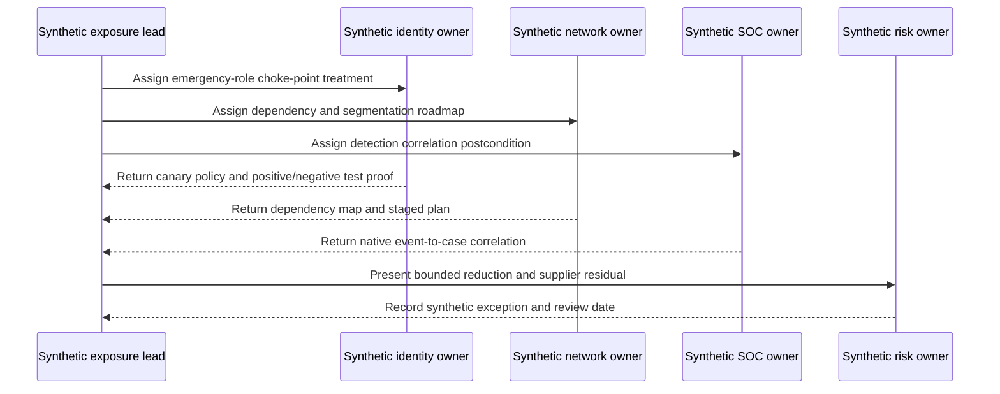

The fictional report says: "Under the synthetic 2026-08-23 conditions, unmanaged contractor access was blocked by the named posture policy, and emergency-role activation was narrowed and retested for the canary population. No repository access was attempted. The jump-service dependency and approved supplier route remain; segmentation redesign and exception review are open. These are fictional exercise results, not proof of product capability, customer control effectiveness, or financial outcome."

## Practical scenarios

### Scenario 1: inferred path with one stale edge

Do not validate the whole path immediately. Identify whether the stale edge is necessary and collect lower-risk native evidence first. If it is false, recompute affected paths. If it remains unknown and the consequence is high, maintain attention and choose a safe bounded test or compensating control.

### Scenario 2: control passes but telemetry is missing

The prevention result and detection/observability result differ. Record the block only if native response supports it; classify detection as unknown or failed. Repair telemetry and case routing before claiming complete control operation. Avoid blind retesting that could duplicate actions.

### Scenario 3: a proposed choke point interrupts a clinical workflow

Stop scale-up. Preserve canary evidence, roll back if postconditions require it, map legitimate dependencies, and compare narrower identity, route, time, or feature controls. Route residual risk and service tradeoffs to authorized owners. Security graph centrality does not override patient-service safety.

### Scenario 4: owner says a finding is a false positive

Translate disagreement into testable claims: entity, version, feature, route, identity, and time. Review native configuration and scanner evidence. Use an approved nonintrusive applicability check if needed. Update the record with evidence rather than relying on role seniority or tool authority.

### Scenario 5: active test times out

A timeout is an indeterminate client observation. Check target, control, service, server, and SOC evidence before repeating. It may represent a block, processing delay, service issue, route failure, or successful action whose response was lost. Use stable test IDs and idempotent methods where possible.

### Scenario 6: exception expires while durable work is blocked

Do not silently extend it. Reassess threat, path, control health, service consequence, dependency milestones, and temporary treatment. Escalate to the authorized risk role with options. An expired exception is a decision event, not an automatic breach or automatic renewal.

## Artifact kit

| Artifact | Minimum content | Review question |
|---|---|---|
| Scenario statement | Actor, entry, prerequisites, objective, consequence | Is it testable and bounded? |
| Path ledger | Nodes, edges, source, time, semantics, state, confidence, owner | Can every edge be challenged? |
| Validation decision record | Claim, alternatives, decision value, method choice | Is active testing necessary? |
| Authorization packet | Scope, method, prohibited actions, monitoring, stop, rollback, approval | Is permission explicit and current? |
| Test case | Preconditions, steps, expected, negative case, cleanup | Is it repeatable and safe? |
| Result record | Conditions, native evidence, state, limitations, residual | Is language narrower than evidence? |
| Control assurance card | Objective, expected/present/configured/healthy/effective state | Is effectiveness scoped? |
| Choke-point matrix | Coverage, alternates, safety, feasibility, durability, observability | Does graph leverage survive operations? |
| Mobilization plan | Option, owner, dependencies, canary, rollback, proof | Is work accepted and executable? |
| Closure packet | Technical/path/control/service/report/residual evidence | Would closure survive challenge? |
| Exception record | Residual, control, owner, authority, expiry, milestones | Is non-action governed? |
| Executive brief | Scenario, evidence, action, residual, decision, owner, caveat | Is it concise without false certainty? |

## Safe exercises

| Exercise | Task | Deliverable | Pass condition |
|---|---|---|---|
| 1 | Convert a broad risk statement into a hypothesis | Scenario card | Every prerequisite can be evaluated |
| 2 | Draw a five-node synthetic path | Mermaid diagram | Edges have direction and meaning |
| 3 | Build edge contracts | Path ledger | Source, time, method, confidence, expiry present |
| 4 | Classify paths by evidence state | Review table | Theoretical/inferred/configured/observed/tested differ |
| 5 | Decompose reachability | Layer checklist | DNS through app authorization separated |
| 6 | Select validation method | Decision record | Minimum sufficient method justified |
| 7 | Draft authorization | One-page packet | Prohibited actions and stop conditions explicit |
| 8 | Create positive and negative tests | Test cases | Security and legitimate-use outcomes covered |
| 9 | Classify ambiguous results | Result ledger | Timeout and missing logs remain inconclusive |
| 10 | Build a control assurance ladder | Control card | Presence is not effectiveness |
| 11 | Identify three choke points | Option matrix | Alternate paths and blast radius included |
| 12 | Design a canary | Change plan | Representative scope, monitoring, rollback present |
| 13 | Define closure | Postcondition contract | Technical, path, control, service, residual included |
| 14 | Troubleshoot a false path | Runbook notes | Entity and edge evidence precede recomputation |
| 15 | Troubleshoot missing alert | Event trace | Native event through case queue traced |
| 16 | Write a customer update | Bounded summary | No compromise or universal-control claim |
| 17 | Create a support packet | Redacted case | Expected/observed, UTC, versions, evidence, one ask |
| 18 | Tabletop an unsafe test event | Timeline and decisions | Stop, contain, notify, preserve, recover, learn |
| 19 | Review data access | Privacy matrix | Need-to-know path and test evidence protected |
| 20 | Challenge an AI summary | Fact-check ledger | Every assertion cites approved evidence |

## TSM operating questions

1. Which material customer decision requires stronger evidence, and what result would change it?
2. Is each path edge theoretical, inferred, configured, observed, demonstrated, interrupted, disproved, or inconclusive?
3. Which exact source, time, semantics, prerequisites, confidence, and owner support each decisive edge?
4. Can passive evidence answer the question before an active technique is considered?
5. Who authorizes target, identity, method, time, data, safety, stop conditions, and rollback?
6. Which positive and negative tests protect both security and legitimate business operation?
7. Which control objective and path prerequisite does each result actually evaluate?
8. Which candidate choke point blocks several material paths without unacceptable blast radius?
9. Which owner, dependency, canary, exception, and closure proof turns the decision into action?
10. Which current product behavior, testing capability, integration, field, limit, or entitlement remains unverified?

## Validation readiness gate

A validation request should pass a readiness gate before scheduling. Readiness is not a ceremonial approval meeting. It is evidence that the proposed action is necessary, authorized, technically coherent, observable, recoverable, and connected to a customer decision. A failed gate does not mean the exposure is unimportant. It means the next action is to repair the missing prerequisite, use a lower-risk method, apply temporary protection, or route the unresolved risk.

| Gate | Pass evidence | Hold condition | Next repair action |
|---|---|---|---|
| Decision value | Named decision and result threshold | Result would not change action | Clarify hypothesis or do not test |
| Target identity | Stable ID, owner, environment, lifecycle confirmed | Similar name or uncertain ownership | Reconcile native inventories |
| Applicability | Exact feature/configuration prerequisite stated | Generic version match only | Obtain configuration evidence |
| Authority | Current written approval covers method and target | Implied, expired, or role-ambiguous permission | Obtain correct customer approval |
| Safety | Prohibited actions, stop, service signals, and rollback ready | No tested recovery or critical dependency unknown | Tabletop and dependency review |
| Observability | Native control, service, and SOC evidence available | Test could produce an uninterpretable result | Repair telemetry or change method |
| Test isolation | Synthetic identity/data and cleanup confirmed | Real sensitive data or uncontrolled account required | Create safe fixture or use passive evidence |
| Communications | Observers and escalation contacts acknowledge window | SOC/service teams could treat test as unexplained incident | Coordinate test identifier and channels |
| Result contract | States and limitations defined before execution | Team expects only pass/fail | Write bounded result semantics |
| Mobilization | Owner can act on likely outcomes | No route from evidence to decision/work | Resolve ownership or governance first |

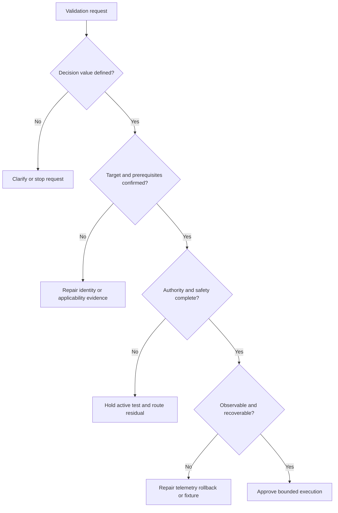

## Runbook: unexpected success during a negative test

A negative test represents behavior that should remain permitted. If it unexpectedly reaches a privileged function, sensitive object, or prohibited route, treat the observation as a potential security event and a test-safety event. Stop immediately. Do not explore further merely because access is available. Preserve the minimum evidence needed to establish target, test identity, UTC, method, and observed response. Notify the test authority, service owner, SOC, privacy or legal contact when applicable, and incident process according to the authorization packet.

Containment should be customer authorized and proportional. Options can include disabling the synthetic identity, revoking its session, restoring the prior policy, or restricting the exact route. Do not destroy evidence or expose sensitive data in chat, email, tickets, or AI prompts. The incident and validation records should cross-reference each other while preserving their different purposes. The validation record describes the authorized action and unexpected outcome; the incident record governs potential unauthorized access, containment, investigation, and recovery.

After containment, determine whether the test identity was misconfigured, the expected policy was not effective, an alternate route existed, target identity was wrong, or the expected result itself was based on a flawed assumption. Validate service health and cleanup before resuming any testing. A new authorization may be required because the risk and method have changed. The final report must state what was and was not accessed, who authorized each response, what residual remains, and which decision follows.

## Runbook: expected block with no trustworthy evidence

Sometimes the client sees a denial or timeout, yet the control owner cannot locate a native event. The team should not label the control effective solely from the client symptom. Freeze the test contract: exact source, destination, identity, protocol, test ID, UTC window, policy expectation, and client output. Check time synchronization and whether the target processed the action. Inspect route, service, intermediary, and control evidence. A network failure, application denial, stale policy, or telemetry gap can look like a security block.

If native evidence remains absent, classify prevention as unsupported or inconclusive according to the result contract, and classify observability separately as degraded. Decide whether a different benign method can distinguish the causes without repeating risk. Repair logging, ingestion, normalization, suppression, or access before relying on the control in a material decision. If temporary reliance is necessary, document the uncertainty, compensating measures, owner, expiry, and retest trigger.

## Runbook: treatment creates a new path

Security changes can alter trust and routing. Moving an application behind a gateway may close direct access while creating a broad service identity. Narrowing one administrator group may cause teams to share an emergency account. Segmentation may force traffic through an inspection bypass needed for compatibility. Closure validation should therefore search for plausible new and alternate paths rather than testing only the old route.

When a regression appears, pause scale-up, preserve before-and-after configuration and graph versions, and compare identities, routes, privileges, controls, data flows, and legitimate dependencies. Roll back if the approved postconditions require it and rollback is safer than forward repair. Keep the original exposure and the newly created condition linked but distinct. A treatment is not successful if it merely moves risk outside the original query.

## Evidence-quality review before executive communication

An executive brief compresses detail, so its evidence controls must be stronger, not weaker. Confirm the scope and as-of time, whether path status is inferred or demonstrated, which control result is bounded to which technique, whether treatment is implemented or only planned, whether legitimate service tests passed, which residual and alternate paths remain, and which decision is requested. Place important caveats beside the claim rather than in a distant appendix.

| Proposed sentence | Evidence review | Safer revision |
|---|---|---|
| "The attack path is closed." | Only one route was retested | "The named route no longer completed under the approved retest; two alternate routes remain under review." |
| "The control stopped the attack." | Benign technique blocked once | "The named control blocked the approved technique under the listed identity, route, policy, and time." |
| "Risk dropped significantly." | No stable baseline or denominator | "The validated path set for the matched cohort decreased from the stated baseline; scope and residuals are attached." |
| "No breach occurred." | Exposure test, not incident investigation | "The exercise did not evaluate whether prior compromise occurred; SOC/IR evidence remains separate." |
| "Remediation is complete." | Ticket closed before service test | "Technical change is implemented; service, alternate-path, and recurrence postconditions remain open." |
| "The product failed." | Expected behavior or entitlement unverified | "Observed behavior differed from the documented/tested expectation under these conditions; a redacted support case is open." |

The TSM can help make these sentences precise, verify the current public or tenant-specific product expectation, and organize the evidence package. The TSM should not certify a customer control, approve testing, or decide acceptable residual risk. That boundary is not a weakness; it is part of trustworthy advisory practice.

## Official Source Anchors

Research/source snapshot and source review date: **2026-08-24**.

Official Zscaler pages support bounded public positioning only. Attack-path evidence contracts, validation levels, authorization controls, control-assurance states, choke-point methods, mobilization records, troubleshooting, and exercises are general security study practices. NMH is explicitly fictional and synthetic. Current official documentation, licensed-tenant evidence, and customer-authorized procedures govern real testing and product use.

| Source | URL | Used for | Boundary |
|---|---|---|---|
| Zscaler Continuous Threat Exposure Management | https://www.zscaler.com/products-and-solutions/ctem | Public CTEM and exposure-management positioning | No attack-path engine, validation mechanism, workflow, object, field, limit, entitlement, or result inferred |
| Zscaler Data Fabric for Security | https://www.zscaler.com/products-and-solutions/data-fabric | Public data aggregation, mapping, deduplication, correlation/enrichment, logic, workflow, and reporting positioning | No proprietary graph or validation architecture inferred |
| Zscaler Asset Exposure Management | https://www.zscaler.com/products-and-solutions/caasm | Public unified asset/context/exposure positioning | No path or control-effectiveness proof inferred |
| Zscaler Unified Vulnerability Management | https://www.zscaler.com/products-and-solutions/vulnerability-management | Public contextual vulnerability-priority and remediation positioning | Vulnerability priority is not full path validation |
| Zscaler Risk360 | https://www.zscaler.com/products-and-solutions/zscaler-risk-360 | Adjacent risk-driver, attack-stage, mitigation, financial, and reporting positioning | No formula or path-test claim inferred |
| NIST Cybersecurity Framework 2.0 | https://www.nist.gov/cyberframework | Govern, Identify, Protect, Detect, Respond, Recover outcome framing | Voluntary; implementations vary |
| NIST SP 800-53 Rev. 5 | https://csrc.nist.gov/pubs/sp/800/53/r5/upd1/final | Access, assessment, configuration, incident, contingency, privacy, and testing-control context | Requires customer tailoring and authorization |
| MITRE ATT&CK | https://attack.mitre.org/ | Common adversary-technique knowledge for hypotheses and test mapping | Technique knowledge is not evidence of occurrence or customer applicability |

## Likely Interview Questions

### Q1. What is an attack path, and how do you keep a graph honest?

**Model answer:** An attack path is an ordered set of prerequisites and actions connecting a scoped entry point to a material objective. Every node and edge needs exact identity, meaning, direction, prerequisites, source, time, method, confidence, conflict, expiry, and owner. I label paths theoretical, inferred, configured, observed, demonstrated, interrupted, disproved, or inconclusive. A graph is a decision model, not incident proof, so decisive edges are traced and safely validated.

### Q2. How do reachability, exploitability, and compromise differ?

**Model answer:** Reachability means required communication or access layers can be established under stated conditions. Exploitability means a weakness can practically be abused when its prerequisites hold. Compromise means unauthorized control or impact actually occurred and requires incident evidence. DNS, a listening port, configuration permission, an inferred graph path, and a validated technique are progressively different assertions. I keep them separate and avoid turning possibility into breach language.

### Q3. How do you choose a safe exposure-validation method?

**Model answer:** Start with the exact claim and customer decision. Use existing native evidence if it is sufficient; otherwise move up a method ladder from configuration or log review to nonintrusive probes, benign control tests, synthetic identity transactions, BAS, or authorized human testing. Choose the minimum sufficient method. Require written target/method/time authority, synthetic data and identities, prohibited actions, monitoring, stop conditions, rollback, cleanup, evidence retention, and bounded result language.

### Q4. What proves a security control is effective?

**Model answer:** Presence or healthy status is not enough. Define the control objective and exact path prerequisite. Confirm expected scope, implementation, configuration, health, enforcement, trigger, and intended outcome using native evidence and an authorized positive test, while a negative test protects legitimate use. Record technique, identity, route, policy/version, time, limitations, bypasses, alternate paths, and retest triggers. Credit effectiveness only under those conditions.

### Q5. How do you select and treat a choke point?

**Model answer:** Compare how many material paths and consequences require the point, whether alternate routes exist, owner capability, safety and legitimate dependencies, durability, observability, reversibility, time, and residuals. High graph centrality alone is insufficient. Use dependency analysis, canary positive/negative tests, monitoring, rollback, and customer approvals. Sometimes a narrow identity treatment should precede broader segmentation because the latter has higher business blast radius.

### Q6. What does good mobilization look like?

**Model answer:** Preserve one scenario ID and evidence snapshot, document treatment options and rationale, obtain an accountable customer owner, assign executing teams, expose dependencies and capacity, define temporary controls and expiry, plan canary/rollback/communication, and specify technical, path, control, service, workflow, reporting, residual, and recurrence postconditions. Reconcile tickets, exceptions, and reports after validation. A bulk ticket push without accepted ownership and proof is not mobilization.

### Q7. How would you troubleshoot a path or test result that looks wrong?

**Model answer:** Fix target, identity, viewer, and UTC window; preserve evidence and contain unsafe automation. Verify node identity/lifecycle, then every edge's semantics, direction, source, time, prerequisites, joins, merges/splits, and expiry. Compare intended configuration, effective policy, observed telemetry, and test conditions. For timeouts or missing alerts, inspect server/control/SOC evidence before retrying. Repair the smallest layer, recompute, retest safely, reconcile downstream records, and restate claims.

### Q8. How does your background help without overstating experience?

**Model answer:** Microsoft 365, OneDrive, and SharePoint escalation work provides production discipline in exact identity, permissions, service dependencies, evidence, customer impact, containment, ownership, and validation. Networking traces support layered reachability analysis. SQL and Power BI support temporal graphs, nulls, joins, cohorts, and movement bridges. Mentoring and reviewed AI assistance support adoption and grounded communication. NMH is synthetic; production Zscaler, attack-path validation, control assurance, and offensive testing remain learning boundaries.

## 30-Second Memory Hooks

| Concept | Memory hook |
|---|---|
| Attack path | Conditional route, not incident photograph |
| Edge | Meaning, source, time, prerequisite, confidence |
| Reachability | DNS to route to transport to auth to feature |
| Validation | Test the claim that changes a decision |
| Safe method | Minimum sufficient evidence under written authority |
| Timeout | Unknown outcome until native evidence is checked |
| Control | Expected, present, configured, healthy, enforcing, effective |
| Effectiveness | Exact objective under exact tested conditions |
| Negative test | Security change must preserve legitimate use |
| Choke point | Shared path dependency plus safe treatment |
| Centrality | High leverage may mean high blast radius |
| Mobilization | Owner, options, dependencies, canary, proof, residual |
| Closure | Postconditions, not ticket state |
| Residual | Alternate routes and unknowns remain visible |
| TSM | Clarify, facilitate, evidence, adopt, escalate; never self-authorize |
| Experience bridge | Layered Microsoft diagnosis transfers; offensive claims do not |

## Completion Checklist

- [ ] I separate official product fact, general security practice, scenario assumption, customer fact, and unknown.
- [ ] I define hypothesis, node, edge, prerequisite, entry, objective, path, chain, reachability, exploitability, lateral movement, privilege escalation, choke point, control types, efficacy, effectiveness, assurance, tests, canary, rollback, postcondition, and residual.
- [ ] I model paths as conditional claims and never equate them with compromise.
- [ ] I give every decisive edge meaning, direction, prerequisites, source, time, method, confidence, conflict, expiry, and owner.
- [ ] I distinguish theoretical, inferred, configured, observed, demonstrated, interrupted, disproved, and inconclusive paths.
- [ ] I decompose reachability across name, route, transport, TLS, proxy, authentication, authorization, and application layers.
- [ ] I identify the exact customer decision before validating.
- [ ] I choose the minimum sufficient method from passive evidence through authorized active testing.
- [ ] I require written purpose, scope, identities, routes, time, allowed/prohibited actions, data, monitoring, stop, rollback, contacts, and approval.
- [ ] I use synthetic identities/data and preserve native evidence and synchronized time.
- [ ] I record demonstrated, interrupted, partial, disproved, inconclusive, not-run, and out-of-scope results precisely.
- [ ] I distinguish control presence, configuration, health, enforcement, trigger, effectiveness, partial coverage, bypass, stale, unknown, and not applicable.
- [ ] I validate prevention, detection, response, and recovery as different functions.
- [ ] I select choke points using path/consequence coverage, alternates, safety, feasibility, durability, observability, reversibility, time, and residuals.
- [ ] I analyze legitimate dependencies and blast radius before broad change.
- [ ] I use canary, positive/negative tests, monitoring, rollback, and wave progression.
- [ ] I mobilize accepted owners, options, dependencies, temporary controls, timing, communication, proof, and learning.
- [ ] I keep customer test, change, service, privacy, legal, and risk authority explicit.
- [ ] I require technical, path, control, service, security, workflow, reporting, residual, and recurrence postconditions.
- [ ] I troubleshoot node, edge, joins, identity, policy, telemetry, test, workflow, and report layers before claiming root cause.
- [ ] I protect path, weakness, identity, control, test, exploit, data, and topology evidence with need-to-know controls.
- [ ] I use AI only as approved grounded assistance, never for autonomous targeting, testing, change, or risk decisions.
- [ ] I can explain every NMH statement/date/result as fictional and synthetic only.
- [ ] I can create all twelve artifact types and complete all twenty exercises.
- [ ] I connect M365/networking/SQL-Power BI/escalation/mentoring/AI strengths without unsupported production Zscaler, CTEM, Risk360, SOC, control-validation, or offensive-security claims.
- [ ] I retain the official source review date exactly as 2026-08-24.
- [ ] I can answer all eight interview questions using neutral, evidence-bounded language.

[Part 89 - Risk360 Architecture, Telemetry, Factors, and Four Attack Stages](Part-89-risk360-architecture-four-stages.md)