# Part 89 - Risk360 Architecture, Telemetry, Factors, and Four Attack Stages

> **Audience:** Candidates preparing for a Zscaler Security Operations Technical Success Manager role after enterprise Support Escalation Engineering.

> **Purpose:** Explain Zscaler Risk360 from zero using only bounded public product facts, then build a general reference model for telemetry, normalization, factors, trends, the four attack stages, operations, security, privacy, troubleshooting, decision logic, artifacts, and responsible customer communication.

> **Scope and honesty:** Northstar Meridian Holdings, abbreviated NMH, is an explicitly fictional and synthetic customer used only for study. Every NMH source, asset, identity, factor, stage, score, trend, date, recommendation, decision, and outcome is invented and is not Risk360 output. Your factual background is Microsoft 365, OneDrive, and SharePoint support; networking and trace analysis; SQL and Power BI; enterprise escalations; mentoring; and responsible AI exploration. Production Zscaler, Risk360, ZIA, ZPA, DLP, ThreatLabz telemetry, Data Fabric, CTEM, UVM, SOC, enterprise risk quantification, and board reporting remain learning boundaries.

> **Currency caveat:** Product wording, inputs, factor descriptions/counts, stages, architecture, interfaces, methods, metrics, trends, integrations, recommendations, limits, packaging, and entitlements change. The controlled official-source snapshot and source review date for this Part is exactly **2026-08-24**. The reviewed live Risk360 page contained differing factor-count statements in different sections, so this Part deliberately does not memorize or assert one count. Current official documentation, licensed-tenant evidence, customer policy, product specialists, Zscaler Support, source-native evidence, and measured postconditions govern production decisions.

> **Section goal:** Enable you to explain what Risk360 publicly positions, how a risk-driver architecture can turn bounded telemetry into explainable factors and trends, how the four stages organize an enterprise attack narrative, where Risk360 stops relative to adjacent capabilities, and how a TSM investigates data or interpretation problems without inventing formulas, UI, fields, entitlements, or customer results.

The reviewed official Risk360 page describes an enterprise cyber-risk assessment and quantification offering using data from an existing Zscaler deployment and other described signals. Public positioning includes an enterprise risk view, contributing risk factors and trends, guided mitigation, potential financial exposure, executive or board-oriented reporting, and four attack stages: **external attack surface, compromise, lateral propagation, and data loss**. The page also references Zscaler telemetry or intelligence associated with areas such as ZIA, ZPA, DLP, ThreatLabz, and external signals. This is a bounded summary, not a complete source contract or architecture specification.

This Part uses **official product fact** only for reviewed public positioning, **general security practice** for the conceptual architecture and operating methods, **scenario assumption** for explicitly fictional NMH, **customer fact** only when a real customer authority and evidence establish it, and **unknown** for anything not verified. No diagram below represents proprietary Risk360 internals. No sample factor, score, weight, threshold, stage value, or trend is a product formula or output.

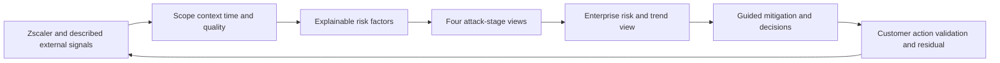

| Principle | Meaning | Safe customer statement | Overclaim to avoid |
|---|---|---|---|
| Telemetry is evidence | Signals describe bounded observations/configuration | "This source supports this factor as of this time." | "The platform sees everything." |
| Factor is a driver | A factor helps explain modeled risk | "This driver contributed under current scope." | "This factor caused a breach." |
| Score is a model output | It compresses assumptions and evidence | "Use it with drill-down and caveats." | "The score is objective truth." |
| Stage is an organizing lens | Four stages structure an attack narrative | "Drivers align to these four public stages." | "Every incident follows four equal steps." |
| Trend needs comparability | Movement can come from risk, data, or model changes | "The movement bridge explains the change." | "A lower number proves control success." |
| Mitigation is guided | Recommendations inform customer decisions | "Verify applicability, authority, and postconditions." | "Apply every recommendation automatically." |
| Boundary matters | Product view does not replace governance or incident evidence | "Risk owners decide treatment and acceptance." | "Risk360 certifies compliance or absence of compromise." |

## JD Mapping

| JD signal | Capability developed | Artifact | Honest boundary |
|---|---|---|---|
| Build deep product expertise | State dated Risk360 positioning and verification needs | Product claim ledger | No proprietary formula or tenant claim |
| Trusted advisor | Translate stage/factor evidence into decisions | Driver-to-decision brief | Customer owns risk appetite |
| Drive value | Connect factor movement to validated actions | Outcome and residual register | No guaranteed reduction |
| Troubleshoot | Trace source, scope, factor, stage, trend, access, and narrative | Layered runbook | No unsupported product root cause |
| Analyze data | Model grain, time, quality, lineage, trends, and drill-down | SQL/Power BI-style semantic design | No Risk360 schema access claim |
| Coordinate stakeholders | Align security, network, IAM, application, data, privacy, risk, and executives | RACI and review cadence | TSM facilitates customer decisions |
| Communicate proactively | Present scope, driver, movement, action, uncertainty, and checkpoint | Executive update | No false precision |
| Partner with Support/Product | Submit redacted minimal evidence for unexpected behavior | Escalation packet | No roadmap or fix promise |
| Responsible AI | Bound AI to cited summaries and reviewed drafts | AI use checklist | No autonomous risk interpretation |

## Candidate honesty note

You can say: "I have studied Risk360's dated public positioning and built a fictional factor-and-stage exercise to demonstrate how I would reason, question data quality, and communicate. My production experience is enterprise support, networking evidence, analytics, escalation, and mentoring. I would verify current tenant behavior and would not present a model output as objective loss or compromise evidence."

| Background fact | Transferable capability | Neutral wording | Boundary |
|---|---|---|---|
| M365/OneDrive/SharePoint support | Identity, permission, endpoint, network, service, and data-context reasoning | "I can investigate multi-layer evidence." | Not production Risk360 |
| Networking/traces | Source path, timing, proxy, TLS, and policy interpretation | "I can distinguish telemetry layers." | Not ZIA/ZPA administration claim |
| SQL/Power BI | Grain, joins, history, nulls, trends, drill-through, reconciliation | "I can test semantic and trend integrity." | Not product schema or dashboard claim |
| Escalations | Scope, impact, containment, ownership, status, validation | "I can coordinate an evidence-led review." | Not risk acceptance authority |
| Mentoring | Explain drivers and teach challenge methods | "I can enable customer teams." | Not customer Risk360 deployment claim |
| AI exploration | Grounded summarization and review | "I can use approved AI assistance carefully." | Not autonomous quantification |
| NMH exercise | Synthetic factor, stage, and reporting practice | "This demonstrates method only." | No real score or result |

## Beginner vocabulary and memory hooks

| Term | Meaning from zero | Why it matters | Analogy |
|---|---|---|---|
| Telemetry | Data produced by systems about state or activity | Feeds observations into decisions | Vehicle instruments |
| Signal | Specific meaningful observation from data | Can support or challenge a claim | Warning light |
| Source | System or organization supplying evidence | Establishes provenance and scope | Witness |
| Factor | Defined input or driver used in a risk view | Explains why a view changes | Ingredient |
| Factor value | Bounded state/measure for one factor | Supplies current modeled input | Ingredient amount |
| Weight/influence | Policy/model importance assigned to factor | Changes contribution | Recipe emphasis |
| Normalization | Converting different scales/meanings into governed comparable form | Prevents unit confusion | Converting currencies before totaling |
| Score | Compressed model output | Helps summarize and prioritize | Dashboard gauge |
| Driver | Factor materially influencing current result | Points to action or evidence | Reason gauge moved |
| Stage | Category in an attack narrative | Organizes drivers and discussion | Phase of a journey |
| External attack surface | Assets/services exposed to outside interaction | Potential starting conditions | Visible doors and windows |
| Compromise | Unauthorized foothold or control scenario | Represents initial successful breach of trust | Intruder gets inside |
| Lateral propagation | Expansion across internal systems/identities | Represents spread and privilege paths | Moving room to room |
| Data loss | Unauthorized disclosure, transfer, destruction, or loss of control | Represents material information consequence | Valuable records leave the building |
| Trend | Values across comparable times | Shows direction and change | Movie rather than snapshot |
| Baseline | Defined comparison starting point | Makes movement interpretable | Before photograph |
| Provenance | Where evidence came from and how it changed | Enables trust and troubleshooting | Chain of custody |
| Grain | What one record/value represents | Prevents invalid aggregation | One receipt versus one item |
| Freshness | How current evidence is for its purpose | Stale values can mislead | Expiry date |
| Coverage | Portion of expected scope represented | Makes blind spots visible | Lit area of a map |
| Confidence | Strength of support for a bounded assertion | Separates evidence from certainty | Image sharpness |
| Uncertainty | Known limitation in evidence or model | Protects decisions from false precision | Fog on map |
| Drill-down | Move from summary to contributing detail | Explains score and action | Open gauge to inspect components |
| Mitigation | Action intended to reduce likelihood or consequence | Converts insight to treatment | Repair or barrier |
| Residual risk | What remains after treatment | Prevents false closure | Remaining uncovered route |
| Financial exposure | Modeled monetary consequence concept with assumptions | Supports business framing when governed | Range on an insurance estimate |

### Plain-English deep-dive 1 - A score is a map legend, not the landscape

A weather index can compress temperature, wind, humidity, and precipitation into a warning level. The warning helps people decide whether to travel, but it does not replace the radar, local conditions, forecast uncertainty, or personal circumstances. If the station stops reporting, the index may change even though the weather did not. If the formula changes, yesterday and today may not be comparable.

A cyber-risk score behaves similarly as a decision aid. It can help summarize many observations, expose important drivers, and create a common language. It does not prove breach, predict exact loss, define customer risk appetite, certify a control, or remove the need for drill-down. A strong TSM conversation begins with scope and drivers, not with defending a number as unquestionable truth.

## What the public product positioning supports

| Publicly described area | Bounded interpretation | Verification needed in a real tenant |
|---|---|---|
| Existing Zscaler deployment data | Risk360 uses described Zscaler-derived context/signals | Which products, tenants, populations, time, and permissions contribute |
| ZIA-related signal | Internet/SaaS access and security context can inform risk views | Exact telemetry, field semantics, latency, scope, and entitlement |
| ZPA-related signal | Private-application access context can inform risk views | Exact app/user/device/policy coverage and meaning |
| DLP-related signal | Data-protection context can inform risk views | Exact channels, policies, labels, incidents, scope, and timing |
| ThreatLabz-related signal | Zscaler threat intelligence/research can inform threat context | Exact feed, relevance, freshness, and factor treatment |
| External signals | Described outside observations can add attack-surface/context evidence | Provider, authorization, coverage, identity, method, and refresh |
| Risk factors | Contributing drivers support explanation | Current definitions, counts, calculations, dependencies, and versions |
| Four stages | Drivers are organized across external surface, compromise, lateral propagation, data loss | Current mapping and interpretation |
| Trends | Risk movement is presented over time | Baseline, comparability, refresh, restatement, and model changes |
| Guided mitigation | Product provides action-oriented guidance positioning | Exact recommendation, applicability, authority, workflow, and proof |
| Executive/board reporting | Product supports leadership-oriented risk communication | Current report behavior, access, caveats, and customer governance |

## Conceptual architecture, not proprietary internals

The architecture below is a reasoning model for how any explainable risk system might be governed. It must not be presented as an internal Risk360 implementation.

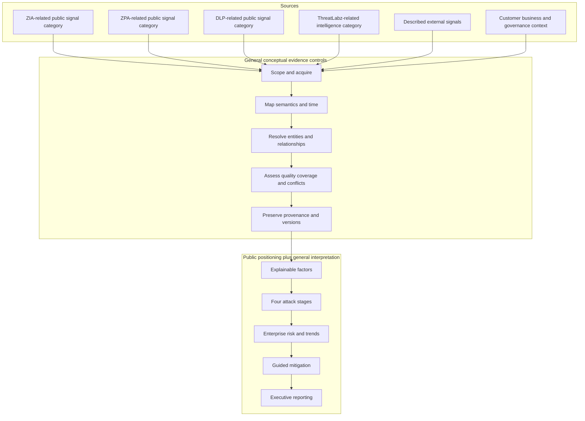

| Conceptual layer | Contract needed | Health question | Boundary |
|---|---|---|---|
| Source | Purpose, scope, authority, grain, time, semantics | Is expected evidence arriving? | Public page is not a source contract |
| Acquisition | Access, incremental/backfill, retries, reconciliation | Is data complete and duplicate-safe? | Do not infer connector mechanics |
| Mapping | Types, units, states, nulls, timestamps, versions | Are meanings preserved? | Do not infer product schema |
| Entity/context | Identity, lifecycle, relationships, ownership | Are records merged/split correctly? | Do not infer proprietary graph |
| Quality | Completeness, freshness, conflicts, confidence | Which factors are degraded? | Unknown is not low risk |
| Factor | Definition, lineage, scope, influence, reason | Can driver be explained? | Do not invent formula or count |
| Stage | Mapping and stage semantics | Are drivers classified consistently? | Stages are a lens, not an incident law |
| Trend | Baseline, cadence, model version, restatement | Are periods comparable? | Movement is not automatically outcome |
| Guidance | Applicability, owner, authority, dependencies, proof | Does recommendation become safe action? | Guidance is not automatic authorization |
| Reporting | Audience, access, drill-down, caveat, decision | Does summary reconcile to evidence? | No certification or guaranteed loss |

## Telemetry from zero

Telemetry can represent configuration, inventory, policy, transaction, threat detection, behavior, control action, service health, or external observation. Those evidence types answer different questions. A configuration says what should or may happen. A transaction says what was observed. A detection says activity matched logic. A block says a named control interrupted one action. An external observation says something was visible from a specific perspective and time.

| Telemetry class | Example assertion | Strong use | Common overreach |
|---|---|---|---|
| Inventory | Entity exists and has properties | Scope and identity | Assuming active exposure |
| Configuration | Policy/setting is effective as recorded | Intended/effective state review | Assuming runtime effectiveness |
| Transaction | User/device/workload accessed resource | Observed relationship and trend | Assuming malicious intent |
| Threat event | Activity matched threat logic | Detection and threat context | Assuming confirmed compromise universally |
| Control action | Request was blocked/allowed/isolated | Bounded control evidence | Assuming all variants covered |
| Data event | Sensitive-data policy matched a flow | Data-risk context | Assuming verified exfiltration |
| Intelligence | Technique/campaign/infrastructure is relevant | Prioritization context | Assuming customer targeting or occurrence |
| External observation | Asset/service appeared from a vantage | Surface discovery | Assuming ownership or exploitability |
| Health | Source/product component reports operational state | Confidence and troubleshooting | Assuming decision output is correct |

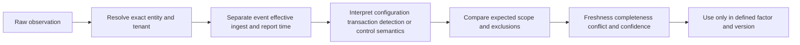

## Source contract template

| Field | Question | Why it matters |
|---|---|---|
| Product/source name | Which current source supplies evidence? | Avoids generic "platform data" |
| Purpose | Which factor and decision use it? | Minimizes irrelevant data |
| Population | Which tenants, locations, users, devices, apps, workloads, channels? | Exposes blind spots |
| Grain | Is a record an event, entity, policy, relationship, or summary? | Prevents invalid counts |
| Identity | Which keys correlate and survive lifecycle changes? | Prevents false merges/splits |
| Authority | What assertion is source-authoritative for? | One source cannot own all meaning |
| Time | Event, observation, effective, ingestion, processing, and expiry? | Supports trend integrity |
| Semantics | What do allowed, blocked, detected, protected, external mean? | Prevents label overreach |
| Quality | Completeness, freshness, validity, duplicates, conflicts? | Keeps confidence visible |
| Security/privacy | Which sensitive fields and access limits apply? | Protects people and topology |
| Recovery | How are outage, backfill, replay, and restatement handled? | Prevents false trend improvement |
| Change | How are schema, scope, policy, and version changes announced/tested? | Preserves comparability |

## Factor mechanics without inventing a formula

A factor should be treated as a governed explanatory input. It needs a plain definition, purpose, eligible population, source lineage, grain, time, transformation, missing behavior, conflict behavior, direction, influence, dependencies, security, owner, test cases, and version. This contract is general practice. It does not describe unpublished Risk360 internals.

| Factor contract item | Good question | Failure if absent |
|---|---|---|
| Name/definition | What exact condition does it represent? | Ambiguous driver |
| Decision purpose | Which action can it influence? | Data without use |
| Scope/grain | Is it per entity, event, cohort, stage, or enterprise? | Invalid aggregation |
| Source/provenance | Which records and transformations support it? | No explanation or audit |
| Time | Which as-of/window/expiry applies? | Stale driver |
| State | Numeric, category, boolean, distribution, or unknown? | Unit confusion |
| Direction | Why does movement increase/decrease concern? | Counterintuitive trend |
| Missing/conflict | How are unknowns and disagreements represented? | Secret zero or arbitrary winner |
| Dependencies | Which factors share the same evidence? | Hidden double counting |
| Influence | How does it affect decisions under current version? | Opaque score movement |
| Owner/tests | Who maintains semantics and validates boundaries? | Orphan logic |

### Plain-English deep-dive 2 - Normalization is translation, not truth creation

Suppose one source reports percentages, another reports counts, another reports categories such as high or low, and another reports event rates. Adding their raw values would be meaningless. Normalization translates them into governed forms so a model can combine or compare them. The translation still depends on choices about population, direction, thresholds, missing data, outliers, and time.

Changing normalization can move a score even when no customer control changes. A new source can make visibility better while initially increasing apparent risk. A repaired denominator can make a percentage worse while the environment is unchanged. A strong review therefore asks: Did the underlying exposure change, did evidence coverage change, or did model interpretation change? These categories should be visible in trends and executive narratives.

## Factor families as a study framework

These families are general examples for reasoning, not an official Risk360 factor catalog. The public factor count was inconsistent on the reviewed live page, so no exact count is asserted.

| General factor family | Example question | Likely stage relationship | Important caveat |
|---|---|---|---|
| External visibility | Which owned services are externally observable? | External attack surface | Visibility does not prove exploitability |
| Vulnerability/configuration | Which applicable weaknesses affect exposed entities? | External/compromise/lateral | Severity is not complete risk |
| Threat relevance | Which techniques or campaigns are pertinent? | All stages | Intelligence is not local occurrence proof |
| Identity trust | Which users/workloads hold risky privilege or trust? | Compromise/lateral | Membership differs from effective use |
| Access policy | Which interactions are allowed under context? | Compromise/lateral | Configured differs from enforced |
| Segmentation | Which paths can connect entities? | Lateral propagation | Graph inference needs validation |
| Control effectiveness | Which prerequisite is demonstrably interrupted? | All stages | Test scope and time matter |
| Data sensitivity | Which data and workflows are material? | Data loss | Classification quality and privacy matter |
| Data movement | Which channels and actions affect control of data? | Data loss | Policy match is not confirmed loss |
| Business criticality | Which services and consequences matter most? | All stages | Customer authority must attest |
| Coverage/quality | Which expected population is unknown or stale? | All stages | Unknown should not lower concern silently |

## The four attack stages as an organizing lens

The four stages form a useful executive story: what can be seen or reached from outside, what could permit or indicate a foothold, what could enable spread, and what could put data beyond intended control. They are not a mandatory sequence for every threat. Insider misuse may begin with authorized internal access; destructive attacks may target availability; identity or SaaS risks may cross stage boundaries. Keep the stages useful without forcing evidence into a simplistic story.

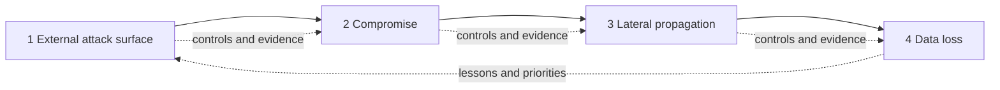

| Stage | Core question | Examples of bounded evidence | Customer decisions |
|---|---|---|---|
| External attack surface | What outside-interactable conditions exist and who owns them? | Authorized observations, inventory, DNS/certificates, service/configuration context | Remove, own, restrict, patch, monitor |
| Compromise | Which conditions could permit or suggest loss of initial trust? | Applicable weakness, risky access, threat/control evidence, detections | Prevent, harden, validate, detect, contain |
| Lateral propagation | Which identity, route, privilege, and trust relationships permit expansion? | Effective access, segmentation, service identities, attack paths | Narrow privilege, segment, isolate, monitor |
| Data loss | Which sensitive data could be accessed, moved, shared, destroyed, or lose governance? | Classification, permission, DLP/control events, repositories, channels | Minimize, restrict, encrypt, block, govern, recover |

## Stage 1: external attack surface

External attack surface covers owned or relevant assets, services, names, addresses, certificates, cloud resources, applications, and interfaces that can be observed or interacted with from outside a trust boundary. Discovery must solve ownership, lifecycle, and service relationships before the risk story is reliable.

| Question | Evidence | Failure mode | Next action |
|---|---|---|---|
| Is it ours? | Cloud/account records, certificates, DNS, owner attestation | Similar name mistaken for ownership | Reconcile identity and authority |
| Is it current? | Last observation, lifecycle, deployment records | Retired record remains active or live asset marked retired | Resolve temporal state |
| What is exposed? | Protocol/service/configuration evidence | Open port treated as full application | Decompose layers |
| Is a weakness applicable? | Exact product/feature/configuration evidence | Version-only false applicability | Validate native configuration |
| What service depends on it? | Service map and owner | Orphan exposure lacks consequence | Establish business relationship |
| Which controls apply? | Edge protection, authentication, policy, monitoring | Presence treated as effectiveness | Validate exact prerequisite |
| What is unknown? | Independent expected population and source health | Missing account improves score | Preserve unknown denominator |

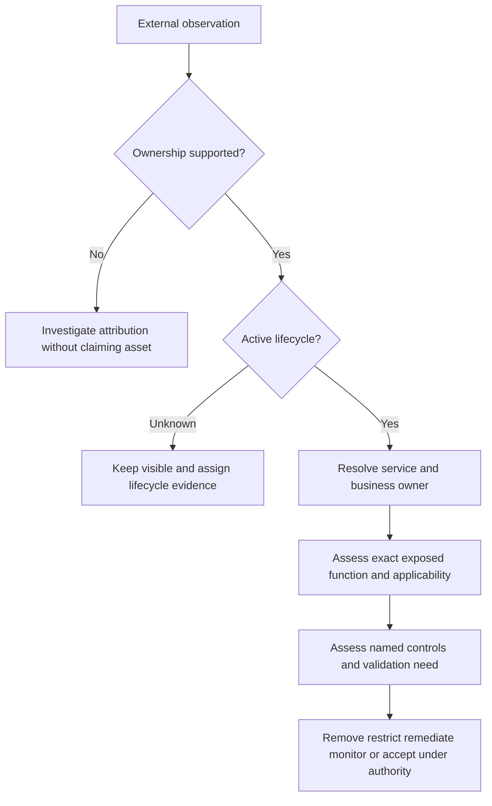

## Stage 2: compromise

Compromise describes the loss of intended trust or control, or the conditions supporting an initial foothold. Risk-factor evidence can indicate exposure or suspicious activity without proving compromise. Incident evidence and process remain distinct.

| Evidence statement | Safe meaning | Does not prove |
|---|---|---|
| Exposed applicable vulnerability | A plausible initial-access condition exists | Exploitation occurred |
| Threat intelligence references technique | External relevance may be elevated | Customer is targeted or compromised |
| Authentication anomaly | Behavior differs from baseline/rule | Malicious actor without investigation |
| Malicious content blocked | Named control interrupted observed content | Endpoint remained universally uncompromised |
| Allowed risky application transaction | Relevant interaction occurred | Unauthorized action |
| Detection event | Logic matched evidence | Confirmed incident in every case |
| Confirmed incident | IR evidence supports unauthorized activity | Every related factor/path is true |

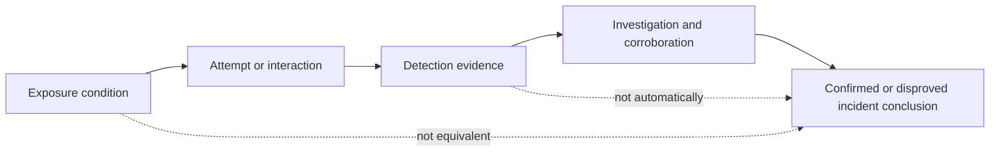

### Plain-English deep-dive 3 - Risk telemetry and incident evidence answer different questions

A smoke detector's low-battery warning raises risk because the control may not work. A heat sensor alert suggests a condition needing investigation. A firefighter seeing flames confirms a fire. These are related but not interchangeable observations.

Risk360-style factors can highlight exposed conditions, control weaknesses, risky behavior, or threat relevance. A SOC and incident-response process determines whether unauthorized activity occurred, how far it spread, and what response is required. A TSM should connect teams and evidence while avoiding two errors: calling every risk signal a breach, and ignoring a risk driver because no breach is currently confirmed.

## Stage 3: lateral propagation

Lateral propagation concerns movement or expansion across identities, workloads, applications, networks, or trust relationships after some foothold or authority exists. Important evidence includes effective privilege, service identities, group nesting, routes, segmentation, application-to-application trust, cloud roles, administrative interfaces, and control effectiveness.

| Driver question | Evidence class | Control possibility | Residual question |
|---|---|---|---|
| Which identities can administer many systems? | IAM/PAM/effective access | Least privilege, just-in-time, step-up | Emergency/break-glass path? |
| Which workloads trust each other broadly? | Cloud/app identity and policy | Narrow service trust | Alternate identity/token path? |
| Which routes cross security zones? | Network/cloud policy and observed flow | Segmentation, brokered access | Legacy or supplier bypass? |
| Which admin interfaces are reachable? | App/network/identity context | Restrict source, device, identity | Recovery access path? |
| Which controls detect movement? | EDR/NDR/access/SOC evidence | Detect, isolate, revoke | Coverage and response time? |
| Which shared services are choke points? | Dependency and path analysis | Harden, segment, monitor | Business blast radius? |

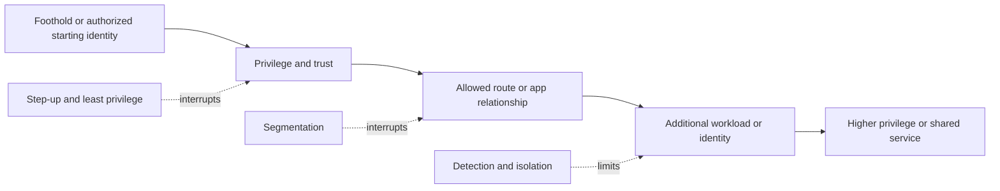

## Stage 4: data loss

Data loss is broader than a file leaving by email. It can include unauthorized disclosure, sharing, download, upload, copy, printing, transfer to unsanctioned services, public links, excessive permissions, destruction, ransomware impact, or loss of governance. The exact scope depends on product and customer definitions, which must be verified.

| Question | Evidence | Important distinction |
|---|---|---|
| What data is material? | Classification, service, legal/privacy records | Classification confidence versus truth |
| Where is it? | Repository and application inventories | Known locations versus complete population |
| Who can access it? | Effective permissions and identity relationships | Entitlement versus observed use |
| Which channels move it? | Web/SaaS/private app/endpoint/email/cloud records as available | Covered versus uncovered channels |
| Which policy applies? | Versioned DLP/access/encryption/configuration | Configured versus enforced |
| What happened? | Transaction/control/detection/incident evidence | Policy match versus confirmed loss |
| What is the consequence? | Customer risk, legal, service, contractual assessment | Model estimate versus actual loss |

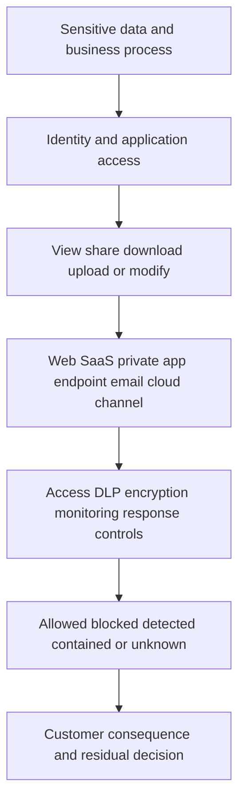

## Cross-stage relationships

Factors can influence more than one stage. An overprivileged service identity can enable compromise, lateral movement, and data access. An unknown asset can affect external scope and compromise confidence. A control-health failure can change every stage. Avoid hidden double counting when the same source observation is copied into several factors.

| Shared condition | External | Compromise | Lateral | Data loss | Governance need |
|---|---|---|---|---|---|
| Unknown asset | Ownership/exposure gap | Unassessed entry | Unknown trust | Unknown data | Discover and assign |
| Weak authentication | Exposed login risk | Initial access | Credential reuse/privilege | Unauthorized data access | Identity treatment |
| Broad service identity | Limited | Foothold impact | Expansion path | Repository permission | Least privilege and rotation |
| Segmentation gap | External route sometimes | Access to internal target | Main path enabler | Expands reachable data | Architecture change |
| DLP/control outage | Little direct | Control confidence | Possible movement signal gap | Direct channel gap | Incident and temporary control |
| Source outage | Unknown surface | Lower confidence | Missing relationships | Missing events | Mark all affected outputs degraded |

## Trends and movement bridges

A trend must separate four causes: underlying environment or threat changed; customer treatment changed exposure; evidence coverage/quality changed; or model/policy changed interpretation. Without that bridge, a lower stage or enterprise result can be mistakenly celebrated after a source outage.

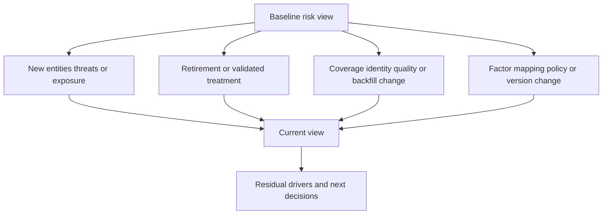

| Movement category | Example | Reporting treatment |
|---|---|---|
| Real adverse change | New exposed service or control failure | Explain driver, consequence, action |
| Real favorable change | Validated route removal or policy hardening | State postconditions and residual |
| Threat-context change | New relevant exploitation/intelligence | Explain time and relevance limits |
| Scope change | New business unit/source/population | Separate from like-for-like trend |
| Data-quality change | Identity repair or backfill | Reconcile and annotate |
| Model/policy change | Factor definition, mapping, or influence changed | Version-separate or restate |
| Source outage | Missing telemetry lowers/raises output | Mark degraded; do not claim improvement |
| Exception change | Accepted residual added/expired | Show governance movement explicitly |

## Factor drill-down receipt

Even when a product presents a factor, a customer conversation should seek a receipt sufficient to understand and act. Exact product drill-down behavior must be verified; this is a general information model.

| Receipt element | Why it matters | Customer question |
|---|---|---|
| Scope | Defines affected population | Which tenants/entities/channels count? |
| As-of/window | Defines time | Is this current enough for the decision? |
| Definition/version | Defines factor meaning | Did logic change? |
| Value/state | Shows current bounded output | Is it count, rate, category, or score? |
| Driver population | Shows entities/events contributing | Which items can owners inspect? |
| Source lineage | Connects assertion to evidence | Which source and transformation support it? |
| Quality/conflict | Exposes missing/stale/disagreement | Is confidence degraded? |
| Stage mapping | Explains attack-story placement | Does cross-stage influence exist? |
| Recommendation | Connects driver to option | Is it applicable and safe? |
| Owner/postcondition | Connects option to action/proof | Who decides, and what closes it? |

## Product and program boundaries

| Capability | Primary study purpose | Relationship to Risk360 | Do not claim |
|---|---|---|---|
| ZIA | Internet/SaaS access/security service positioning | Described telemetry/context source category | Every event/field contributes or exact weighting |
| ZPA | Private-app zero-trust access positioning | Described telemetry/context source category | Universal path or policy coverage |
| DLP/data protection | Data policy and event context | Described data-risk signal category | Policy match equals confirmed loss |
| ThreatLabz | Threat research/intelligence | Described threat-context source category | Intelligence equals customer compromise |
| Data Fabric for Security | Unified data, mapping, correlation, logic/workflow/report positioning | Adjacent data foundation in portfolio story | Exact Risk360 dependency or shared schema |
| Asset Exposure Management | Asset visibility/context and gaps | Adjacent exposure evidence | Risk360 is an asset inventory |
| UVM | Contextual vulnerability priority/workflow | Adjacent vulnerability evidence/treatment | Risk360 equals vulnerability queue |
| CTEM | Recurring exposure program | Uses risk drivers for scope/priority/action discussion | Risk360 alone completes CTEM |
| SOC/IR | Detection, investigation, containment, recovery | Consumes/provides risk and incident context | Risk factor proves incident |
| GRC/ERM | Policy, risk register, obligations, acceptance | Governs interpretation and decisions | Product score replaces enterprise governance |

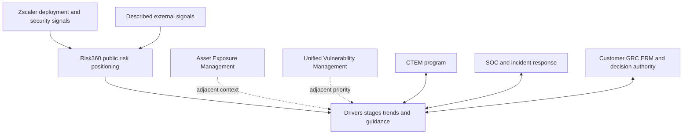

### Plain-English deep-dive 4 - Product boundaries are about decision ownership, not just feature lists

A flight dashboard shows fuel, altitude, weather, and warnings, but it does not replace air-traffic control, maintenance, the pilot, or corporate safety governance. Each uses related data for a different decision. Confusing them creates dangerous gaps: a warning is not a maintenance work order, and a forecast is not proof of engine failure.

Risk360 can be discussed as a risk-driver and executive-decision view based on its public positioning. CTEM is the recurring exposure-management program. UVM focuses on contextual vulnerability priority and remediation. Asset Exposure Management focuses on asset context and gaps. A SOC investigates and responds to active threats. Customer risk governance chooses appetite, treatment, acceptance, and disclosure. Data may connect these areas, but current product documentation and tenant evidence must establish exact integration and responsibility.

## Operating and governance cadence

| Forum | Evidence | Decision | Output |
|---|---|---|---|
| Data/telemetry health | Scope, freshness, rejects, conflicts, source changes | Repair, contain, backfill, mark degraded | Health action register |
| Factor review | Definition, driver population, quality, overrides, sensitivity | Challenge or clarify interpretation | Factor issue log |
| Technical risk review | Stage drivers, paths, controls, actions, residuals | Sequence validation and mitigation | Technical roadmap |
| Exception review | Accepted residual, control health, expiry, threat change | Extend, treat, revoke, escalate | Signed risk record |
| Executive review | Material drivers, trend bridge, decisions, uncertainty | Fund, prioritize, accept, redirect | Decision brief |
| Post-incident review | Incident evidence and prior factor/control assumptions | Correct detection, exposure, factor, process | Lessons and rescope |
| Product review | Adoption, behavior questions, cases, roadmap boundaries | Enable, escalate, validate current capability | Success plan |

## Troubleshooting architecture

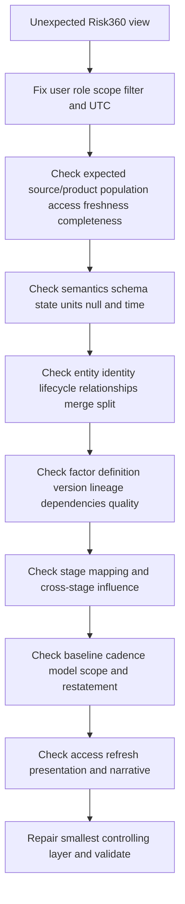

| Symptom | Plausible cause | Discriminating check | Safe containment |
|---|---|---|---|
| Enterprise view drops sharply | Source outage, scope shrink, model change, real treatment | Movement bridge plus source health | Mark degraded; pause success claim |
| Stage moves but factors look stable | Hidden factor, timing, normalization, mapping, refresh | Compare versions/as-of and complete driver set | State unexplained movement |
| Factor conflicts with native source | Time/scope mismatch, identity error, transformation, access filter | Trace representative entity end to end | Avoid action on affected cohort |
| New source raises risk | Better visibility or true new exposure | Fixed-cohort comparison | Explain coverage change separately |
| External asset is not customer-owned | Attribution/merge issue | Native cloud/DNS/certificate/owner evidence | Quarantine attribution claim |
| Data-loss driver appears after policy change | Expected new detection, backfill, overbroad policy, real behavior | Compare policy, event, channel, and baseline | Do not call confirmed exfiltration |
| Different users see different results | Role/scope/filter/refresh/access control | Reproduce exact viewer and time | Preserve least privilege; document variance |
| Recommendation seems unsafe | Applicability/dependency context missing | Customer architecture and change review | Do not automate; route decision |

## Failure modes and misconceptions

| Misconception | Why it fails | Better rule |
|---|---|---|
| Risk score is objective truth | Model depends on scope, evidence, assumptions, version | Use drivers, quality, uncertainty, and decisions |
| Exact factor count is permanent | Reviewed live page differed internally and products change | Verify current docs; understand concepts |
| Every described source feeds every tenant | Deployment, license, scope, and health vary | Verify current source contract |
| ZIA event means compromise | Transaction/detection/control semantics differ | Investigate before incident conclusion |
| DLP event means data loss occurred | Match, block, allow, incident, and loss differ | State exact event/control outcome |
| Threat intelligence means customer targeting | External relevance is not local evidence | Correlate customer context |
| Four stages are a mandatory timeline | Threats can skip, overlap, or begin internally | Use stages as organizing lens |
| Lower trend proves risk reduction | Data/model/scope changes can move output | Build movement bridge and postconditions |
| Guidance is authorization | Customer owns change/risk decisions | Verify applicability, safety, owner, proof |
| Risk360 replaces SOC, CTEM, UVM, or GRC | Each has distinct decision purpose | Connect but preserve boundaries |
| TSM certifies customer risk | Wrong authority and unsupported assurance | Facilitate evidence, adoption, escalation |

## Security, privacy, and model governance

Risk telemetry can expose identities, browsing or application activity, private applications, vulnerabilities, policies, threat events, sensitive-data classifications, external assets, and business criticality. Use purpose limitation, minimization, least privilege, separation of duties, encryption, retention, regional/legal review, export controls, auditing, and secure support handling. Executive reports should minimize operational attack detail while preserving enough explanation for decisions.

Model governance needs documented purpose, scope, factor definitions, source lineage, versioning, missing/conflict behavior, quality thresholds, access, testing, change approval, release communication, monitoring, challenge, override, and retirement. A model can aid consistency without owning customer truth. Human reviewers should be able to challenge a factor and see whether the issue is source data, semantics, entity mapping, model interpretation, or customer context.

AI may assist with cited factor summaries, trend narratives, evidence comparison, or question generation. It must not fabricate factor definitions, infer proprietary formulas, silently ingest restricted telemetry, reveal sensitive paths, or make autonomous mitigation/risk decisions. Prompt injection can arrive through attacker-controlled URLs, logs, ticket text, or external labels; treat source content as data, constrain tools, and verify every material assertion.

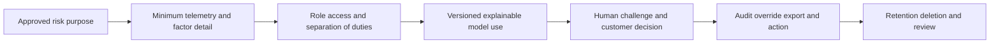

## Complete synthetic NMH Risk360-style case

Everything in this section is explicitly fictional and synthetic. It is not generated by Risk360, does not reproduce a product score or factor, and does not describe a customer, tenant, integration, UI, field, result, or documented production experience. Every date below is a synthetic scenario date on or before the official source review date. The source snapshot remains 2026-08-24.

NMH's fictional review uses a synthetic as-of date of 2026-08-22. The team creates a four-stage teaching model with no proprietary formula. Values are qualitative labels only: attention rising, stable, falling, or unknown. The exercise's purpose is to explain evidence and decisions, not quantify actual enterprise risk.

| Synthetic stage | Fictional driver | Evidence state | Trend explanation | Decision |
|---|---|---|---|---|
| External attack surface | Newly reconciled public research portal | Ownership confirmed; feature applicability unknown | Attention rising due to better coverage | Restrict route and validate configuration |
| Compromise | Test identity lacks step-up on one legacy workflow | Configured evidence, no incident evidence | Stable material exposure | Canary stronger authentication |
| Lateral propagation | Broad emergency role reaches analytics admin | Effective-access evidence; path untested | Attention rising after identity mapping repair | Narrow role and validate alternate path |
| Data loss | Synthetic sensitive repository has broad internal sharing | Permission evidence; no exfiltration evidence | Stable, confidence improved | Reduce permission and test legitimate use |

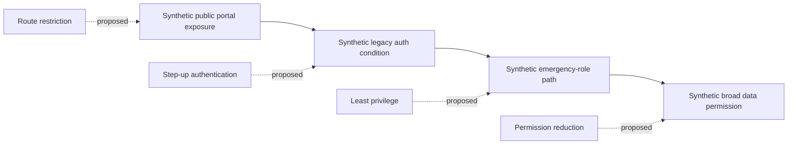

### Synthetic telemetry-quality event

The fictional external source adds one cloud account and the stage view rises. The team does not say risk deteriorated by the full movement. It separates coverage change from underlying condition. A synthetic identity-mapping fix also joins an emergency role to the correct service, raising lateral attention without any new privilege being granted. The movement bridge identifies both as evidence improvements that reveal previously unknown exposure.

### Synthetic factor challenge

The service owner disputes the external driver because the portal is intended to be public. The team clarifies that public presence alone is not the complete concern; the fictional driver combines intended visibility with uncertain owner-confirmed feature applicability and control evidence. It updates the explanation, obtains native configuration, and avoids calling the portal "misconfigured" until evidence supports that conclusion.

### Synthetic stage-to-action sequence

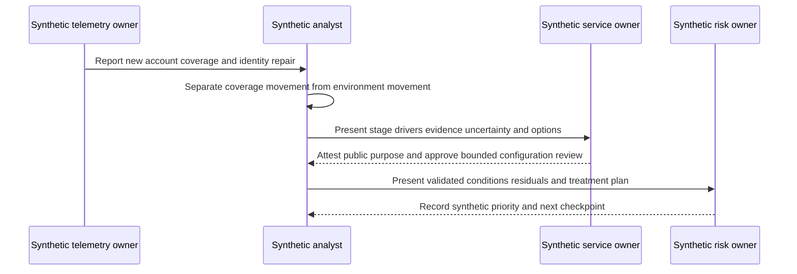

### Synthetic report language

"The synthetic four-stage view changed primarily because source coverage and identity correlation improved, not because a new event proved compromise. The public portal is intentional, while feature applicability and control evidence remain under review. The emergency-role relationship and broad repository permission are supported by fictional configuration evidence; no lateral movement or data loss is claimed. Customer-authorized canary treatments and postconditions are listed. This is a synthetic Risk360-style exercise and not product output."

## Practical scenarios

### Scenario 1: a source disappears and the enterprise view improves

Mark the view degraded and preserve the last-good state. Determine affected population, factors, stages, recommendations, and reports. Repair access or ingestion, backfill if supported, reconcile, and restate. Communicate that lower output during missing evidence is not validated improvement.

### Scenario 2: threat intelligence raises a compromise driver

Explain the intelligence source, technique, relevance, freshness, and customer applicability. Check exposed conditions and controls. Do not state customer targeting or compromise without local evidence. Use it to prioritize bounded validation, hardening, detection review, or monitoring.

### Scenario 3: a DLP-related driver rises after a policy rollout

New policy coverage can produce more observations. Separate allowed, blocked, detected, incident, and confirmed loss states. Compare channels, users, data labels, false-positive review, and policy versions. A rising driver may reflect better detection, changed behavior, or poor policy design.

### Scenario 4: lateral stage seems high but network is segmented

Check whether identity, application, cloud, management, supplier, or service-account relationships bypass network segmentation assumptions. Verify exact path and control evidence. Segmentation presence is not universal effectiveness, but the score alone is not proof of a path.

### Scenario 5: executives ask why two periods cannot be compared

Show the scope, source, factor, and model changes. Offer a fixed cohort, version-separated series, or governed restatement when evidence supports it. Do not splice incompatible values into a smooth trend. Explain that honest incomparability is better than false movement.

### Scenario 6: a recommendation conflicts with service requirements

Treat guidance as an option. Confirm driver, applicability, dependencies, service consequence, authority, alternate treatments, canary, rollback, and closure proof. Route tradeoffs to customer owners and retain residuals. Do not invent product behavior or promise outcome.

## Artifact kit

| Artifact | Minimum fields | Quality test |
|---|---|---|
| Product claim ledger | Official wording, URL, date, interpretation, boundary, verify item | No marketing inference becomes architecture fact |
| Source contract | Purpose, population, grain, identity, time, semantics, quality, security, recovery | Missing source cannot look like low risk |
| Factor dictionary | Definition, scope, lineage, time, missing/conflict, influence, owner, version | Driver can be challenged |
| Stage map | Factor-to-stage rationale and cross-stage dependencies | No forced linear story |
| Movement bridge | Baseline plus exposure, treatment, threat, data, scope, model changes | Trend reconciles |
| Driver receipt | Scope, as-of, value, population, lineage, quality, recommendation | Summary reaches evidence/action |
| Data-health board | Source, coverage, freshness, failures, affected decisions, owner | Risk shown beside health |
| Mitigation register | Driver, option, owner, dependencies, authority, postconditions, residual | Guidance becomes governed work |
| Executive brief | Material driver, movement, evidence, action, uncertainty, decision | No false precision or incident claim |
| Support packet | Viewer/scope/time, expected/observed, versions, evidence, checks, one ask | Minimal and redacted |

## Safe exercises

| Exercise | Task | Deliverable | Pass condition |
|---|---|---|---|
| 1 | Write a Risk360 claim ledger | Source table | Public fact and verification item separated |
| 2 | Draw conceptual architecture | Mermaid diagram | Labeled non-proprietary |
| 3 | Define five telemetry classes | Evidence table | Configuration/event/control semantics differ |
| 4 | Build a source contract | Contract matrix | Scope, grain, time, quality, recovery present |
| 5 | Draft a fictional factor dictionary | Three factor records | No product formula/count claim |
| 6 | Identify shared lineage | Dependency map | Double-count risk visible |
| 7 | Explain all four stages | One-minute narrative | Lens, not mandatory sequence |
| 8 | Classify ten statements | Evidence quiz | Exposure, detection, incident distinguished |
| 9 | Build an external-stage decision tree | Flowchart | Ownership before severity |
| 10 | Build a lateral path | Evidence graph | Identity and app trust included |
| 11 | Build a data-loss flow | Channel map | Policy match differs from confirmed loss |
| 12 | Create a movement bridge | Reconciliation table | Data/model/scope changes separate |
| 13 | Troubleshoot a factor mismatch | Layered notes | Native source traced to view |
| 14 | Troubleshoot viewer variance | Reproduction packet | Role, scope, filter, refresh, UTC fixed |
| 15 | Write a safe executive update | Short brief | Driver, action, uncertainty, decision |
| 16 | Review a mitigation | Option matrix | Applicability, authority, safety, proof included |
| 17 | Tabletop a source outage | Incident timeline | Affected claims contained and restated |
| 18 | Create a redacted support packet | Case artifact | No sensitive topology or invented expectation |
| 19 | Review privacy | Access matrix | Need-to-know factor and event detail |
| 20 | Challenge AI narrative | Citation ledger | Every material sentence verified |

## TSM discovery and review questions

1. Which current official Risk360 claims and tenant capabilities are verified, and which remain unknown?
2. Which Zscaler products and described external signals contribute for this customer, population, and time?
3. What are each source's grain, identity, semantics, scope, freshness, quality, privacy, and recovery contracts?
4. Which factors drive the current view, and can their definitions, lineage, dependencies, and versions be explained?
5. How are unknown, stale, conflicting, and not-applicable evidence represented?
6. How do factors map to external attack surface, compromise, lateral propagation, and data loss without forced sequencing or double counting?
7. Why did the trend move: environment, threat, treatment, scope, data quality, or model change?
8. Which guidance is applicable, customer-authorized, safe, owned, and measurable through postconditions?
9. Which outputs require technical, risk, privacy, executive, or board review before use?
10. Which unexpected behavior needs a redacted Support/Product case rather than speculation?

## Factor challenge and correction workflow

A customer should be able to challenge a factor without choosing between blind trust and total rejection. The challenge begins with a bounded statement such as: "For these three entities and this as-of time, the factor appears inconsistent with native policy evidence." That is more useful than "the score is wrong" because it creates a discriminating investigation.

First reproduce the same user role, scope, filters, and time. Capture the factor label and documented meaning without assuming an unpublished formula. Identify representative contributing entities if current product capability permits; otherwise record the absence as a verification item. Compare source-native evidence for identity, lifecycle, policy, event, and effective time. Check whether the factor reflects an intended state, observed behavior, threat context, or control outcome. Those semantics often explain apparent disagreement.

Next inspect scope and quality. A factor can differ because one system includes contractors, a new cloud account, a channel, or a period that another report excludes. It can also differ after delayed ingestion, backfill, entity merge, mapping change, or source outage. Determine whether the mismatch belongs to the source, access, ingestion, mapping, entity, factor-interpretation, stage, report, or viewer layer. Avoid changing customer policy to make the number look familiar.

If evidence suggests unexpected product behavior, build a minimal redacted case: business impact, exact scope, viewer, UTC, current versions where available, official/current expectation, observed behavior, representative stable IDs, source-native evidence, health state, recent changes, checks already completed, containment, reproducibility, and one clear question. Product specialists or Support can then confirm expected behavior or guide further collection. Do not promise a defect or fix before evidence supports it.

| Challenge state | Meaning | Owner action | Reporting treatment |
|---|---|---|---|
| Explained | Difference follows scope, time, semantics, or documented behavior | Teach and record explanation | Continue with caveat if material |
| Source defect | Native evidence is missing, stale, or wrong | Source owner repairs and backfills | Mark affected factor degraded |
| Correlation defect | Identity or relationship is false/missing | Data/entity owner repairs and recomputes | Restate affected cohort |
| Customer-context gap | Product evidence lacks business meaning | Customer owner supplies governed context | Keep unknown until attested |
| Product-behavior question | Observed behavior differs from verified expectation | TSM/customer opens redacted case | Avoid unsupported interpretation |
| Model disagreement | Output is working as designed but not useful for decision | Customer/product dialogue under current capabilities | Do not silently manipulate data |
| Unresolved | Evidence cannot distinguish causes | Assign next discriminating check | State uncertainty prominently |

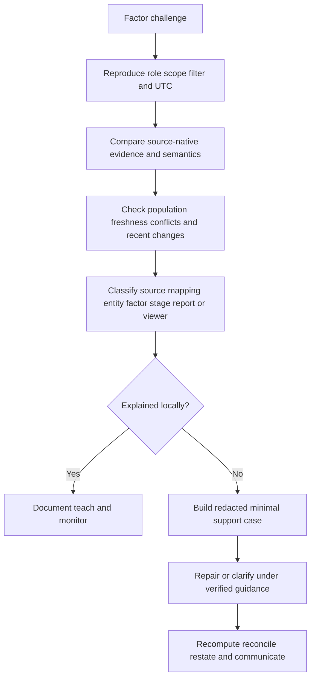

## Adoption without score worship

Adoption is not measured only by page views or exported reports. A risk owner adopts the capability when they can explain a material driver, challenge evidence, choose an authorized treatment, and track residuals. A technical owner adopts it when they can reach the contributing population, understand the rationale, verify applicability, perform safe work, and supply closure evidence. An executive adopts it when the view improves resource decisions without creating false precision.

| Adoption level | Observable behavior | Enablement need | Evidence |
|---|---|---|---|
| Awareness | Stakeholder knows purpose and boundaries | Introductory stage/factor explanation | Can restate intended use |
| Access | Correct role can reach relevant output | Access and privacy setup | Least-privilege access test |
| Comprehension | User distinguishes score, factor, event, and incident | Worked driver examples | Teach-back |
| Challenge | User traces and questions evidence constructively | Drill-down and source training | Completed challenge record |
| Decision | User links driver to owned treatment or acceptance | Governance and option coaching | Decision log |
| Routine | Review occurs at useful cadence | Playbook and agenda | Repeatable meeting outputs |
| Outcome | Actions pass postconditions and residuals remain visible | Validation and reporting | Bounded validated change |
| Improvement | Overrides, defects, and incidents tune future use | Feedback loop | Versioned lessons and backlog |

Common adoption resistance should be treated as evidence. A service owner may reject a driver because identity is wrong, the recommendation is unsafe, the same issue was closed previously, or executive language overstates the evidence. Training will not repair those defects. Observe the user's task, sample disputed cases, classify the cause, and fix the controlling layer. Conversely, a technically correct output can remain unused because ownership, capacity, workflow, or review cadence is absent. Adoption is a system property.

## Risk and data health must be reviewed together

Risk views should never be presented without evidence-health context. A concise health companion can show source coverage, freshness, failures, entity conflicts, factor degradation, model version, and report as-of time. This does not require exposing sensitive operational details to every audience; it requires making material limitations visible.

| Health dimension | Technical indicator | Decision implication |
|---|---|---|
| Population coverage | Expected versus represented entities/channels | Missing population limits enterprise claim |
| Freshness | Distribution of source and factor ages | Stale factors may not support current action |
| Ingestion | Failures, lag, retries, backfill state | Trend may be provisional |
| Identity | Merge/split conflicts and unresolved aliases | Driver population may be wrong |
| Semantics | Unknown mappings, changed state meanings, unit conflicts | Factor interpretation may be invalid |
| Factor quality | Missing/conflicting inputs and unexplained shifts | Score/stage confidence is degraded |
| Model/version | Current version and change annotations | Period comparison may require restatement |
| Viewer/report | Refresh, access, filter, and export state | Different audiences may see different scope |

During an outage, preserve last-good evidence with its timestamp rather than silently substituting it as current. Mark affected factors and downstream reports degraded. Determine which customer decisions should pause and which can continue using other evidence. After recovery, validate completeness, deduplication, ordering, identity, and mapping; recompute or backfill under supported methods; reconcile movement; restate affected reporting; and notify decision owners. Repairing transport alone does not repair decisions already made from incomplete evidence.

## Executive translation rehearsal

A technical statement might say: "The lateral-stage driver increased after an identity-source backfill joined 412 previously unresolved service principals to 37 administration scopes; 18 relationships are stale and under owner review." An executive translation can say: "Improved identity coverage revealed additional privileged relationships around two important services. No new compromise is asserted. Owners are validating the relationships, narrowing confirmed excess access, and will return with residual paths and resource needs at the next review."

Both statements retain the same evidence boundary. The executive version removes unnecessary implementation detail but preserves why the view changed, what is not claimed, what action follows, and when a decision returns. The TSM can help audiences move between these levels without changing the underlying truth.

## Official Source Anchors

Research/source snapshot and source review date: **2026-08-24**.

Official Zscaler pages support bounded public positioning only. The conceptual architecture, source/factor contracts, factor families, quality model, movement bridges, governance, troubleshooting, synthetic case, and exercises are general study practices. The reviewed Risk360 live page contained differing factor-count statements; no count is asserted. Current official material and licensed-tenant evidence govern real inputs, functions, interfaces, packaging, and outputs.

| Source | URL | Used for | Boundary |
|---|---|---|---|
| Zscaler Risk360 | https://www.zscaler.com/products-and-solutions/zscaler-risk-360 | Public enterprise risk, drivers/factors, trends, four stages, described Zscaler/external signals, guided mitigation, potential financial exposure, executive/board reporting positioning | No formula, exact factor count, source contract, architecture, field, UI, weight, threshold, entitlement, certainty, or result inferred |
| Zscaler Zero Trust Exchange | https://www.zscaler.com/products-and-solutions/zero-trust-exchange-zte | Adjacent platform and attack-stage context | No Risk360 implementation dependency inferred |
| Zscaler Data Fabric for Security | https://www.zscaler.com/products-and-solutions/data-fabric | Public ingest/map/deduplicate/correlate/enrich/logic/workflow/report positioning | No exact Risk360 data path or shared schema inferred |
| Zscaler Asset Exposure Management | https://www.zscaler.com/products-and-solutions/caasm | Adjacent asset visibility/context positioning | Not a Risk360 factor or product dependency claim |
| Zscaler Unified Vulnerability Management | https://www.zscaler.com/products-and-solutions/vulnerability-management | Adjacent contextual vulnerability-priority positioning | Not a Risk360 formula/input guarantee |
| Zscaler Continuous Threat Exposure Management | https://www.zscaler.com/products-and-solutions/ctem | Adjacent continuous exposure-program positioning | Risk360 is not equated with the entire CTEM lifecycle |
| NIST Cybersecurity Framework 2.0 | https://www.nist.gov/cyberframework | General governance and outcome framing | Voluntary; customer implementation varies |
| NIST SP 800-53 Rev. 5 | https://csrc.nist.gov/pubs/sp/800/53/r5/upd1/final | General access, assessment, risk, incident, privacy, and control context | Requires customer tailoring and assessment |
| MITRE ATT&CK | https://attack.mitre.org/ | General technique vocabulary for stage/path discussion | Not proof of customer activity or Risk360 mapping |

## Likely Interview Questions

### Q1. What does Zscaler publicly say Risk360 does?

**Model answer:** The reviewed public page positions Risk360 as an enterprise cyber-risk assessment and quantification offering using data from an existing Zscaler deployment and described external signals. It presents risk drivers/factors and trends, organizes views across external attack surface, compromise, lateral propagation, and data loss, and describes guided mitigation, potential financial exposure, and executive or board reporting. Exact sources, formulas, factor counts, fields, interfaces, packaging, and tenant outputs require current verification.

### Q2. How would you explain the Risk360 architecture without inventing internals?

**Model answer:** I would label a conceptual flow, not a proprietary diagram: bounded ZIA-, ZPA-, DLP-, ThreatLabz-, external-, and customer-context evidence needs scope, semantic/time mapping, entity correlation, quality, provenance, and versions before supporting explainable factors. Factors can organize into four stage views, enterprise trends, guidance, and reporting. Then customer governance decides action and validates outcomes. Every implementation detail remains a current documentation and tenant verification item.

### Q3. What makes a risk factor explainable?

**Model answer:** It needs a plain definition, decision purpose, scope and grain, source lineage, as-of/window, value type, transformations, direction, missing/conflict behavior, dependencies, influence under a named version, security classification, owner, tests, driver population, recommendation, and postcondition. Explainability lets a customer distinguish a real exposure change from a data or model change and challenge the right layer.

### Q4. Explain the four attack stages and their limitations.

**Model answer:** External attack surface asks what outside-interactable conditions exist; compromise concerns initial loss of intended trust or foothold conditions; lateral propagation concerns expansion through identity, route, privilege, and trust; data loss concerns unauthorized disclosure, transfer, destruction, or loss of data control. They create an executive organizing lens, not a mandatory timeline. Insider, SaaS, identity, and availability scenarios can overlap or skip stages, so factor evidence and customer context govern interpretation.

### Q5. How do telemetry and incident evidence differ?

**Model answer:** Inventory, configuration, transactions, detections, control actions, intelligence, external observations, and health signals answer different questions. Exposure or anomaly evidence can increase concern without proving compromise. A blocked event proves only a bounded control action; a DLP match does not automatically prove data loss; intelligence does not prove local targeting. SOC and IR corroboration establish incident conclusions under their process.

### Q6. How would you explain a Risk360 trend responsibly?

**Model answer:** Start with scope, as-of time, source/model versions, and health. Build a movement bridge separating real adverse change, validated treatment, threat-context movement, population/scope change, data-quality/coverage change, factor/model change, outage, and exception movement. Use fixed cohorts or restatement when needed. Report drivers, actions, residuals, and uncertainty. A lower score or stage value alone is not validated risk reduction.

### Q7. How would you troubleshoot an unexpected factor or stage view?

**Model answer:** Reproduce exact user, role, scope, filter, refresh, and UTC. Reconcile expected source/product populations and health; then trace one representative entity through semantics, timestamps, nulls, identity/lifecycle, relationships, factor definition/version/lineage/dependencies, stage mapping, baseline/model changes, and presentation/access. Contain affected claims, repair the smallest layer, backfill or recompute as appropriate, reconcile, restate, and escalate a redacted minimal case if product behavior remains unexplained.

### Q8. How does your background transfer while remaining honest?

**Model answer:** Microsoft 365, OneDrive, and SharePoint escalation work supports multi-layer identity, permission, network, service, and data reasoning. Networking traces support telemetry-path and timing analysis. SQL and Power BI support grain, temporal joins, nulls, lineage, factor drill-down, trends, and movement bridges. Escalation and mentoring support customer communication and adoption; reviewed AI can assist cited summaries. NMH is synthetic, and production Risk360/Zscaler telemetry operation, quantification, and board reporting remain learning boundaries.

## 30-Second Memory Hooks

| Concept | Memory hook |
|---|---|
| Risk360 | Drivers, four stages, trends, guided decisions, caveats |
| Score | Model output, not objective truth |
| Factor | Governed driver with lineage and time |
| Telemetry | Configuration, event, detection, control, and health differ |
| ZIA/ZPA/DLP/ThreatLabz | Public signal categories; exact tenant inputs verify |
| External surface | What outside interaction and ownership exist? |
| Compromise | Exposure or signal is not confirmed incident |
| Lateral propagation | Identity plus route plus privilege plus trust |
| Data loss | Policy match is not automatically confirmed loss |
| Four stages | Organizing lens, not mandatory sequence |
| Trend | Environment plus treatment plus data plus model movement |
| Unknown | Visible quality state, never secret zero |
| Factor count | Do not memorize; reviewed page conflicted |
| Guidance | Option requiring customer applicability and authority |
| Product boundary | Connect data and decisions without merging responsibilities |
| Experience bridge | Analytics and escalation transfer; Risk360 production does not |

## Completion Checklist

- [ ] I separate official product fact, general security practice, scenario assumption, customer fact, and unknown.
- [ ] I state public Risk360 positioning without inventing formula, factor count, source contract, architecture, field, UI, weight, threshold, entitlement, or result.
- [ ] I remember the reviewed live page contained differing factor-count statements and refuse to memorize one number.
- [ ] I define telemetry, signal, source, factor, value, influence, normalization, score, driver, stage, all four stages, trend, baseline, provenance, grain, freshness, coverage, confidence, uncertainty, drill-down, mitigation, residual, and financial exposure.
- [ ] I distinguish inventory, configuration, transaction, threat, control, data, intelligence, external, and health telemetry.
- [ ] I verify which ZIA-, ZPA-, DLP-, ThreatLabz-, and external-signal categories apply in a real tenant.
- [ ] I create source contracts for population, grain, identity, authority, time, semantics, quality, security, recovery, and change.
- [ ] I create factor contracts for definition, purpose, scope, lineage, time, state, direction, missing/conflict, dependencies, influence, owner, and tests.
- [ ] I explain normalization as governed translation rather than truth creation.
- [ ] I explain external attack surface through ownership, lifecycle, function, applicability, business service, controls, and unknowns.
- [ ] I distinguish compromise exposure, attempt, detection, investigation, and confirmed incident.
- [ ] I explain lateral propagation through identity, route, privilege, trust, controls, and alternate paths.
- [ ] I explain data loss across data, access, action, channel, policy, control outcome, and consequence.
- [ ] I treat the four stages as a lens rather than a mandatory timeline.
- [ ] I detect cross-stage shared lineage and avoid hidden double counting.
- [ ] I build trends using comparable scope/time/model and a movement bridge.
- [ ] I require factor drill-down with scope, time, version, population, lineage, quality, recommendation, owner, and proof.
- [ ] I preserve boundaries among ZIA, ZPA, DLP, ThreatLabz, Data Fabric, AEM, UVM, CTEM, Risk360, SOC/IR, and GRC/ERM.
- [ ] I troubleshoot viewer, source, semantics, time, entity, factor, stage, trend, report, and narrative layers.
- [ ] I protect identity, activity, private-app, weakness, threat, data, path, and business telemetry under privacy/security controls.
- [ ] I govern models with purpose, lineage, versioning, tests, challenge, overrides, access, monitoring, and change control.
- [ ] I use AI only for approved grounded assistance with human review and no autonomous interpretation or mitigation.
- [ ] I can explain every NMH item and date as explicitly fictional and synthetic, never Risk360 output.
- [ ] I can build all ten artifacts and complete all twenty exercises.
- [ ] I connect M365/networking/SQL-Power BI/escalation/mentoring/AI strengths without unsupported production Zscaler, Risk360, CTEM, SOC, quantification, or board-reporting claims.
- [ ] I retain the source review date exactly as 2026-08-24.
- [ ] I can answer all eight interview questions with bounded product facts and neutral honesty syntax.

[Part 90 - Risk360 Quantification, Financial Exposure, Guided Mitigation, and Board Reporting](Part-90-risk360-quantification-reporting.md)