# Part 90 - Risk360 Quantification, Financial Exposure, Guided Mitigation, and Board Reporting

> **Audience:** Arti Thakur, preparing for a Zscaler Security Operations Technical Success Manager role after Microsoft enterprise Support Escalation Engineering.

> **Purpose:** Explain Risk360 quantification and reporting from zero using bounded public product facts and clearly labeled general risk-analysis practice. Cover factor drill-down, weighting, uncertainty, potential financial exposure, scenario ranges, guided mitigation, policy links, governance, executive and board reporting, operations, troubleshooting, security, privacy, artifacts, exercises, and responsible caveats.

> **Scope and honesty:** Northstar Meridian Holdings, abbreviated NMH, is an explicitly fictional and synthetic customer used only for study. Every NMH scenario, source, factor, value, weight, score, probability, financial range, date, recommendation, policy, decision, and result is invented and is not Risk360 output. Arti's factual background is Microsoft 365, OneDrive, and SharePoint support; networking and trace analysis; SQL and Power BI; enterprise escalations; mentoring; and responsible AI exploration. Production Zscaler, Risk360, enterprise cyber-risk quantification, financial modeling, actuarial work, GRC ownership, policy authority, and executive or board reporting remain learning boundaries.

> **Currency caveat:** Product wording, factors/counts, architecture, metrics, quantification methods, financial-exposure presentation, recommendations, reports, interfaces, fields, limits, packaging, and entitlements change. The controlled official-source snapshot and source review date for this Part is exactly **2026-08-24**. The reviewed Risk360 live page contained differing factor-count statements, so no factor count is asserted. Current official documentation, licensed-tenant evidence, customer model/policy governance, finance/legal/risk review, product specialists, Zscaler Support, source-native evidence, and measured postconditions govern production decisions.

> **Section goal:** Enable Arti to explain how factor evidence can support a risk and potential-financial-exposure conversation without false precision, how to drill from summary to assumptions and actions, how guided mitigation connects to customer policy and authority, and how technical and board audiences receive concise decision support with explicit uncertainty and product boundaries.

The reviewed public Risk360 page supports bounded positioning around enterprise risk drivers and trends, the four attack stages, guided mitigation, potential financial exposure, and executive or board-oriented reporting using described Zscaler and external signals. It does not publicly establish a complete formula, factor count, weighting scheme, loss distribution, confidence method, field catalog, interface, entitlement, or guaranteed financial result. Nothing in this Part fills those gaps by inference.

The quantitative models below are **general educational examples**, never Risk360 formulas. In a real organization, finance, enterprise risk, legal, privacy, security, business/service owners, internal audit, and model-governance roles may need to review assumptions and use. A product output can inform a decision; it does not transfer customer fiduciary, disclosure, or risk-acceptance authority to a vendor or TSM.

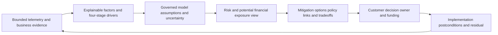

| Principle | Practical meaning | Board-safe effect | Failure prevented |
|---|---|---|---|
| Scenario before money | Define event, scope, pathway, and consequence | Numbers have a business story | Meaningless currency precision |
| Assumptions visible | Show evidence, ranges, dependencies, and versions | Decision can be challenged | Black-box authority |
| Range before point | Use bounded distributions or scenarios where appropriate | Uncertainty remains visible | False exact loss |
| Expected is not maximum | Separate central tendency, tail, and plausible extremes | Funding considers severity and uncertainty | Average-only decisions |
| Model is not incident evidence | Quantification estimates scenarios | Avoids claiming breach/loss occurred | Exposure-to-incident confusion |
| Guidance is not authorization | Customer policy and owners govern action | Accountability remains correct | Automated overreach |
| Outcome needs proof | Validate control/path/service change and residual | Reports show actual progress | Activity-as-risk-reduction |
| Caveat near claim | Put material limitations where decision is made | Readers cannot miss uncertainty | Footnote theater |

## JD Mapping

| JD signal | Capability developed | Artifact | Honest boundary |
|---|---|---|---|
| Product expertise | State current Risk360 positioning and gaps | Claim and verification ledger | No formula or UI invention |
| Trusted advisory | Translate drivers/uncertainty into options | Decision brief | Customer owns risk and finance authority |
| Value realization | Link action to bounded validated outcome | Mitigation benefit register | No guaranteed avoided loss |
| Analytics | Build transparent scenario/range and trend logic | SQL/Power BI-style semantic model | No Risk360 schema access claim |
| Troubleshooting | Trace factor, assumption, model, recommendation, policy, report | Layered runbook | No unsupported root cause |
| Stakeholder coordination | Align security, service, risk, finance, legal, privacy, audit, executives | RACI and review cadence | TSM facilitates, not certifies |
| Executive communication | Compress evidence into material decisions | Board-ready one-page brief | No false precision or assurance |
| Product partnership | Escalate unexpected behavior with minimal evidence | Redacted case packet | No fix/roadmap promise |
| Responsible AI | Bound AI to cited drafting and challenge | AI review ledger | No autonomous quantification or disclosure |

## Candidate honesty note

Use neutral, evidence-labeled phrasing: "I understand the general mechanics of scenario-based cyber-risk quantification and have practiced them in a fictional case. Risk360's public page describes potential financial exposure and board-oriented reporting, but I have not operated it in production. My production bridge is evidence-led Microsoft escalation, networking analysis, SQL/Power BI, customer communication, and mentoring. I would verify the current product model and keep finance, legal, and customer risk authorities involved."

| Factual background | Transferable skill | Safe phrasing | Boundary |
|---|---|---|---|
| M365/OneDrive/SharePoint | Connect identity, permissions, service, data, and business impact | "I can build a scoped consequence narrative." | Not risk quantification ownership |
| Networking/traces | Validate path and timing assumptions | "I can test technical prerequisites." | Not financial model validation |
| SQL/Power BI | Grain, distributions, ranges, trends, sensitivity, drill-through | "I can build transparent analytics." | Not Risk360 internal model access |
| Escalations | Explain impact, uncertainty, options, owner, checkpoint | "I can support decision-grade communication." | Not board disclosure authority |
| Mentoring | Teach assumptions, caveats, and challenge methods | "I can enable repeated correct use." | Not risk committee leadership |
| AI exploration | Assist cited drafts and scenario checks | "I require human review and approved data." | Not automated loss estimate |
| Synthetic NMH | Demonstrate method and honesty | "These values are invented for learning." | No customer/product outcome |

## Beginner vocabulary and memory hooks

| Term | Plain meaning | Why it matters | Analogy |
|---|---|---|---|
| Quantification | Expressing an assessment numerically under rules | Supports comparison and tradeoffs | Measuring with a labeled ruler |
| Qualitative | Descriptive categories such as low/medium/high | Useful when evidence does not support numbers | Weather words |
| Semi-quantitative | Ordered scores or bands with numeric structure | Supports consistency without monetary claim | Rating stars |
| Quantitative | Numeric estimate with units and assumptions | Can support ranges and economics | Temperature in degrees |
| Scenario | Defined harmful event/path and consequence | Gives numbers meaning | Story being estimated |
| Frequency | How often an event may occur in a period | One part of loss estimation | Expected storms per year |
| Probability | Chance of an event within defined conditions/time | Communicates uncertainty | Rain chance tomorrow |
| Likelihood | General chance or frequency concept | Often used loosely; define it | How plausible/often |
| Magnitude | Size of consequence if event occurs | Captures impact | Depth of flood |
| Loss | Adverse financial or operational consequence | Unit being estimated | Repair bill plus interruption |
| Exposure | Conditions leaving value open to harm | Precedes but does not equal loss | House in flood zone |
| Potential financial exposure | Modeled monetary consequence concept under assumptions | Business-oriented risk framing | Estimated range, not invoice |
| Expected loss | Probability/frequency-weighted average across possibilities | Useful central tendency | Long-run average cost |
| Tail loss | Low-frequency, high-magnitude portion | Important for resilience | Rare severe flood |
| Percentile | Value below which a stated fraction of modeled outcomes falls | Describes distribution | 90th-percentile travel time |
| Distribution | Range of possible values and relative plausibility | Preserves uncertainty | Shape of weather outcomes |
| Range | Lower-to-upper bounded estimate | More honest than false point | Price estimate interval |
| Confidence | Strength of evidence/method for an assertion | Not same as probability of event | Quality of measuring tool |
| Uncertainty | What is unknown or variable | Must shape decision and caveat | Fog around route |
| Sensitivity | How output changes when an assumption changes | Identifies decision-driving assumptions | Turn one dial and watch gauge |
| Correlation | Variables move together | Prevents assuming independence | Umbrellas and rain move together |
| Dependency | One event/variable affects another | Changes combined risk | Shared power supply |
| Weight | Model influence assigned to an input | Reflects design/policy, not objective truth | Volume knob |
| Calibration | Compare model with reviewed evidence/outcomes and tune | Improves usefulness over time | Adjust thermometer |
| Materiality | Importance sufficient to affect a decision | Focuses executives and boards | Big enough to change course |
| Risk appetite | Amount/type of risk organization is willing to pursue/retain | Governs choices | Lane boundaries |
| Risk tolerance | Specific acceptable variation around objectives | Creates thresholds and escalation | Speed limit |
| Mitigation | Action reducing likelihood or consequence | Converts assessment to work | Flood barrier |
| Cost-benefit | Compare expected costs, benefits, uncertainty, and constraints | Supports resource allocation | Repair versus expected damage |
| Residual risk | Risk remaining after action | Prevents claims of elimination | Water still possible after barrier |

### Plain-English deep-dive 1 - Financial exposure is an estimate, not a future invoice

A home-insurance estimate may consider fire frequency, building value, repair cost, displacement, and safeguards. It can produce a range useful for choosing coverage, but it cannot tell the homeowner the exact date or cost of a future fire. If local construction costs rise or a sprinkler fails, the estimate changes. If the model learns about an unknown extension, apparent exposure can rise even though the house did not change that day.

Cyber financial exposure is similar. A defined scenario may include response, restoration, business interruption, legal, notification, contractual, fraud, data, and longer-term costs. Each component has uncertain frequency, magnitude, dependencies, evidence quality, and organizational context. A model can support prioritization and budgeting. It should not be called guaranteed loss, accounting reserve, insurance quote, regulatory disclosure, or avoided cost without the appropriate model and authorities.

## Quantification ladder: use only the precision evidence supports

| Level | Output | Appropriate when | Main limitation |
|---|---|---|---|
| Narrative | Scenario, drivers, consequences, uncertainty | Early/novel issue | Difficult to compare at scale |
| Ordinal category | Low/medium/high under defined rubric | Sparse evidence but stable policy | Distances between categories unknown |
| Weighted index | Combined factor score | Consistent prioritization with governance | Units are not money/probability |
| Scenario range | Bounded likelihood/magnitude intervals | SMEs can defend ranges | Subjective and dependency-sensitive |
| Probabilistic model | Distribution from input distributions | Mature data/model governance | Model risk and interpretation complexity |
| Financial exposure view | Monetary range/statistics under documented model | Business decisions with finance/risk review | Not actual loss or certainty |

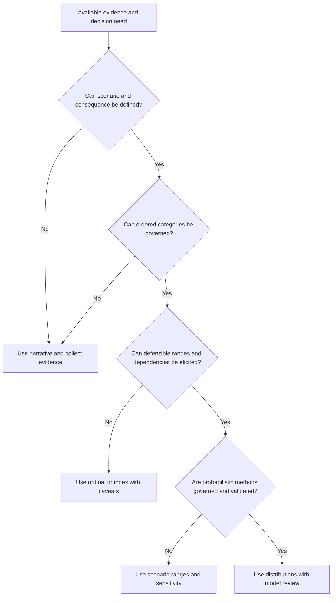

## Product fact, general model, and customer model

| Evidence class | Example statement | Who verifies | How to speak |
|---|---|---|---|
| Official product fact | Risk360 publicly describes potential financial exposure and board reporting | Current official material/product specialist | "The reviewed page describes..." |
| Product unknown | Exact formula, fields, distribution, factor influence, report behavior | Current docs and licensed tenant | "I would verify..." |
| General practice | Scenario frequency and magnitude can support monetary ranges | Risk methodology references and experts | "A common general method is..." |
| Customer model | Cost categories, appetite, ranges, dependencies, currency, period | Customer finance/risk/legal/business owners | "The customer-authorized model uses..." |
| Synthetic scenario | NMH values and arithmetic | This chapter only | "In the fictional exercise..." |

## Factor drill-down before quantification

Quantification should not begin with a summary score alone. Drill into the material drivers, affected population, evidence quality, stage relationship, business service, control state, and treatment options. A low-confidence factor may justify urgent evidence work rather than a precise monetary estimate.

| Drill-down layer | Questions | Evidence |
|---|---|---|
| Scope | Which entities, services, regions, users, channels, and period? | Population contract |
| Driver | What condition contributes and why? | Factor definition/version |
| Population | Which records/entities drive it? | Reconciled cohort |
| Lineage | Which sources and transformations support it? | Provenance chain |
| Quality | What is missing, stale, conflicting, or inferred? | Quality state |
| Stage/path | How does it relate to external, compromise, lateral, data loss? | Scenario/path model |
| Consequence | Which operations, data, obligations, customers, or safety concerns? | Customer owner attestation |
| Controls | Which prerequisites are prevented, detected, contained, recovered? | Native/test evidence |
| Trend | Did environment, threat, treatment, data, scope, or model change? | Movement bridge |
| Decision | Which option, owner, authority, cost, and postcondition? | Decision record |

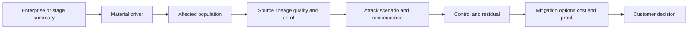

## Weighting and influence

A weight expresses model influence. It may reflect policy judgment, statistical fit, expert design, or another method. It is not evidence that one factor is universally more "true" or that customer risk mechanically equals a weighted sum. Exact Risk360 methods are unknown here and must not be inferred.

| Weighting question | Why it matters | Test |
|---|---|---|
| Purpose | What decision should weighting improve? | Compare decision outcomes, not attractive score spread |
| Scale | Are factors on compatible governed scales? | Boundary and unit tests |
| Direction | Does higher/lower mean more concern consistently? | Monotonicity test |
| Missing | Does unknown become zero, imputed, blocked, or explicit? | Missing/stale/conflict cases |
| Dependence | Are correlated factors counted repeatedly? | Lineage and correlation review |
| Concentration | Can one extreme factor dominate? | Outlier and cap/floor sensitivity |
| Segment | Does influence behave differently by service/population? | Segment fairness/usefulness review |
| Version | Are changes governed and trend-compatible? | Before/after shadow comparison |
| Explainability | Can a user see why ranking changed? | Reason-code review |

### Plain-English deep-dive 2 - A weight is a policy/model dial, not a truth dial

In a hiring rubric, increasing the weight on experience changes candidate ranking. It does not make the experience data more accurate, prove the best performer, or erase missing interview evidence. The weight encodes what the rubric values under a decision design.

Risk-factor weighting behaves similarly. Raising external exposure influence may increase attention to public services, while raising business criticality may move essential internal services. If factors share source lineage, weighting both heavily can tell the same story twice. A responsible review asks whether weighting produces useful, explainable, capacity-aware decisions across representative and boundary cases. It never describes weights as discovered laws of cyber risk.

## General financial-risk mechanics

For education, a simple scenario view can separate event frequency and loss magnitude. A stylized relationship is:

$$
\text{Expected annual loss} = \text{Expected annual event frequency} \times \text{Expected loss magnitude per event}
$$

This is a general teaching identity, not a Risk360 formula. Real models may use distributions, multiple event types, conditional probabilities, control states, dependencies, simulation, and additional outputs. Expected loss is a long-run average under assumptions; it is not the most likely single-year outcome and does not describe tail severity by itself.

| Input | Definition | Evidence source | Uncertainty |
|---|---|---|---|
| Threat-event frequency | Attempts/events potentially reaching scenario boundary | Intelligence, incidents, exposure, experts | Threat change and sparse history |
| Vulnerability/contact frequency | Portion encountering susceptible conditions | Asset/path/control evidence | Coverage and applicability |
| Action probability | Chance prerequisites/actions succeed | Test, control, incident, expert evidence | Dependence and adversary adaptation |
| Loss-event frequency | Successful events causing scoped consequence | Modeled chain | Compounded input uncertainty |
| Primary loss | Direct response, restoration, interruption, replacement | Finance/operations history and estimates | Scope and cost volatility |
| Secondary loss | Legal, notification, contractual, stakeholder, follow-on effects | Legal/risk/finance expertise | Conditional and jurisdictional variation |
| Control effect | Change in a defined prerequisite/frequency/magnitude | Design/test/operating evidence | Drift, bypass, alternate paths |

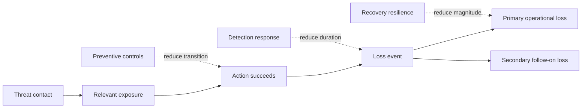

## Loss categories

| Category | Examples | Customer owner | Double-count caution |
|---|---|---|---|
| Incident response | Investigation, containment, forensics, specialist help | Security/finance | Included in vendor contract? |
| Restoration | Rebuild, recovery, validation, overtime | IT/operations | Overlap with interruption labor |
| Business interruption | Lost/reduced service, productivity, revenue, contractual impact | Business/finance | Gross revenue is not net loss automatically |
| Data response | Review, notification, support, monitoring | Privacy/legal/finance | Population and jurisdiction vary |
| Fraud/theft | Unauthorized transactions or asset loss | Finance/fraud | Recovery/insurance offsets uncertain |
| Legal/regulatory | Counsel, proceedings, penalties where applicable | Legal/compliance | Do not speculate without authority |
| Third party | Supplier/customer claims and remediation | Legal/procurement | Contract terms and causation matter |
| Reputation/retention | Customer/partner behavior and acquisition costs | Executive/finance | High uncertainty; avoid arbitrary multipliers |
| Safety/mission | Clinical or operational consequence | Service/safety leadership | Money may not capture full severity |
| Long-term security | Increased controls, audits, transformation | Security/finance | Improvement investment may not be pure loss |

## Ranges, distributions, and percentiles

A range is useful only when its construction is visible. "Between one and ten million" without scope, currency, period, scenario, probability, evidence, and rationale is not decision-grade. Ranges can be elicited from calibrated experts, internal history, external data under careful comparability, contractual costs, operational models, or simulation.

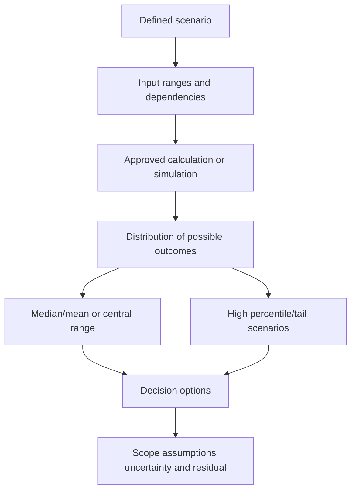

| Output | Meaning | Useful question | Misinterpretation |
|---|---|---|---|
| Minimum/maximum bound | Stated modeled limits | Are bounds plausible and evidence-based? | Guaranteed floor/ceiling |
| Median | Half modeled outcomes below/above | What is a central outcome under model? | Expected value in every year |
| Mean | Probability-weighted average | What is long-run average under assumptions? | Most likely outcome |
| Percentile | Fraction of modeled outcomes below value | What tail capacity should be considered? | Confidence that event occurs |
| Exceedance probability | Chance modeled loss exceeds threshold | How often could budget/capital be exceeded? | Prediction of exact event |
| Scenario band | Low/central/high under stated assumptions | Which decisions are robust across bands? | Statistical confidence interval automatically |

## Uncertainty taxonomy

| Uncertainty type | Example | Treatment | Communication |
|---|---|---|---|
| Scope | Unknown subsidiary or channel | Discover/reconcile or exclude explicitly | "Estimate excludes..." |
| Measurement | Telemetry misses or duplicates events | Quality model and sensitivity | "Source coverage is..." |
| Parameter | Event frequency or cost range uncertain | Use distributions/ranges | "Results are sensitive to..." |
| Structural | Model omits a dependency or pathway | Alternative models/scenarios | "Model does not represent..." |
| Correlation | Losses share provider/identity/control | Model dependencies | "Events may not be independent..." |
| Threat | Adversaries adapt and rates change | Time-bound scenarios and refresh | "Threat assumptions as of..." |
| Control | Effectiveness drifts or alternate paths exist | Test/monitor and residual | "Control evidence covers..." |
| Business | Service growth, recovery, cost, legal context changes | Owner ranges and scenario updates | "Impact assumes..." |
| Model | Calibration/validation limits | Governance and benchmark | "Not validated for..." |
| Decision | Different risk appetite and constraints | Show options, do not hide | "Customer authority chooses..." |

### Plain-English deep-dive 3 - Confidence and event probability are not the same

Imagine a weather forecaster says there is a 30 percent chance of rain and has high confidence in that estimate. The 30 percent describes modeled event probability. High confidence describes evidence and model support. Another forecast may say 70 percent rain with low confidence because sensors are failing. Mixing these concepts makes decisions worse.

In cyber analysis, a scenario can have a high modeled likelihood but low confidence due to source gaps, or a lower modeled likelihood but strong evidence and severe tail consequences. Risk reporting should expose both. A confidence label should not be mechanically multiplied into probability unless an approved model explicitly defines and validates that operation. Often the right response to low confidence is targeted evidence work plus prudent temporary controls.

## Sensitivity and scenario analysis

Sensitivity analysis changes one or more assumptions to see which ones drive output and whether a decision remains useful. It is more important than producing many decimals.

| Test | Question | Decision value |
|---|---|---|
| One-way sensitivity | Which input most changes output? | Prioritize evidence and controls |
| Threshold test | When does option ranking change? | Identify decision boundary |
| Best/central/worst scenario | Are choices robust across plausible states? | Avoid optimizing one forecast |
| Control-effect test | How much effectiveness is needed for value? | Set validation target |
| Correlation test | What if events/losses share dependencies? | Reveal concentration risk |
| Scope test | What if unknown population is included? | Prevent denominator optimism |
| Time-horizon test | How do annual/multi-year views differ? | Align investment and lifecycle |
| Model-version test | Does conclusion survive method change? | Assess model dependence |

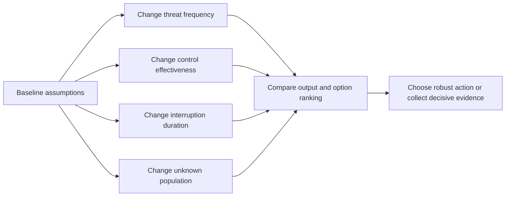

## Guided mitigation from factor to action

The public page's guided-mitigation positioning should be discussed as decision support. Exact recommendation generation, fields, workflows, or automation require current verification. A recommendation becomes executable only after customer context and authority are applied.

| Step | Question | Artifact |
|---|---|---|
| Driver | Which factor/scenario creates concern? | Driver receipt |
| Applicability | Does it apply to exact population and configuration? | Applicability evidence |
| Objective | Which path prerequisite or consequence changes? | Control/treatment objective |
| Options | Remove, restrict, patch, harden, detect, contain, recover, transfer, accept? | Option matrix |
| Policy | Which standard, risk, change, privacy, and exception rules govern? | Policy linkage |
| Owner | Who decides and who executes? | RACI |
| Dependencies | Service, supplier, architecture, identity, capacity, procurement? | Dependency map |
| Safety | Canary, negative tests, monitoring, rollback? | Change plan |
| Benefit | Which bounded likelihood/magnitude driver may change? | Benefit hypothesis |
| Proof | Which technical/path/control/service postconditions close? | Validation contract |
| Residual | Which risks and uncertainties remain? | Residual record |

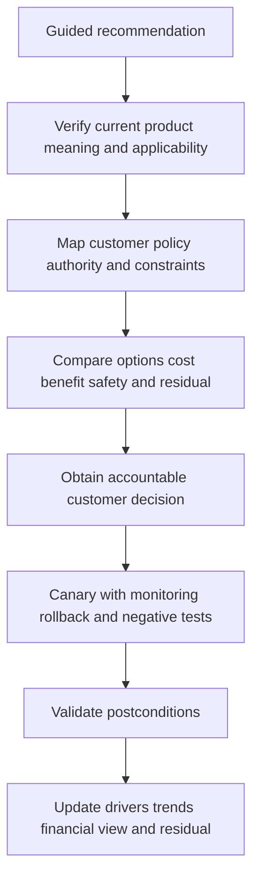

## Policy links

A policy link is not merely a hyperlink. It should identify the customer rule, control objective, owner, version, applicable population, required action, exception process, evidence, review cadence, and relationship to the recommendation. Product guidance should not silently become policy.

| Policy class | Role in mitigation | Example governance question |
|---|---|---|
| Risk appetite/tolerance | Sets escalation and retention boundaries | Does residual exceed authorized tolerance? |
| Access/identity | Defines authentication, privilege, review | Which identities and exceptions are covered? |
| Vulnerability/patch | Defines remediation tiers and evidence | Is applicability and service safety addressed? |
| Data protection | Defines classification, handling, channels | Which data and jurisdictions apply? |
| Network/application | Defines segmentation and exposure | Which legitimate dependencies remain? |
| Incident response | Defines escalation, containment, recovery | Does evidence indicate incident process? |
| Change management | Governs canary, approval, rollback | Who accepts service risk? |
| Exception/risk acceptance | Governs temporary residuals | Owner, rationale, control, expiry, milestones? |
| Privacy/legal | Governs telemetry, testing, reporting, disclosure | What can be collected/shared and by whom? |
| Financial/model governance | Governs estimates and use | Who validates model and board language? |

## Cost-benefit without claiming avoided loss

Mitigation economics can compare implementation/operating cost, disruption, option value, expected driver change, tail reduction, compliance or customer obligations, and residuals. It should not assert "this control saves exactly X" unless a governed model and evidence support that statement.

| Benefit class | Evidence | Caveat |
|---|---|---|
| Exposure reduction | Removed route, privilege, weakness, or public service | Validate alternate paths |
| Likelihood reduction | Named prerequisite/control change | Model relationship and control evidence needed |
| Magnitude reduction | Faster containment/recovery, less data/service scope | Scenario and operational evidence needed |
| Detection improvement | Better coverage, quality, routing, response | Detection is not prevention |
| Operational efficiency | Fewer duplicates/manual steps, faster accepted decisions | Baseline and quality guardrails needed |
| Governance value | Better ownership, audit, exception expiry, visibility | Difficult to monetize precisely |
| Strategic enablement | Safer business initiative or architecture | Avoid attributing all value to one control |

## Executive and board audience design

Executives need enough detail to decide, not a wall of telemetry. Boards need oversight of material risk, management response, resources, trend, resilience, and uncertainty. Neither audience should receive unsupported technical certainty or an unexplained score.

| Audience | Primary question | Include | Usually omit or move to appendix |
|---|---|---|---|
| Analyst | What evidence and factor caused this? | Lineage, entities, quality, method, technical action | Broad corporate narrative |
| Technical owner | What must change safely and how is closure proven? | Applicability, dependencies, tests, rollback | Unnecessary monetary detail |
| CISO/risk executive | Which material scenarios/drivers changed and what decision is needed? | Trends, options, residual, confidence, owner | Raw event volume |
| Finance/legal/privacy | Which assumptions, costs, obligations, and uses apply? | Model, ranges, data handling, disclosure boundary | Unsupported security shorthand |
| Board/risk committee | Is management governing material cyber risk and resilience? | Material scenarios, trend bridge, action, resources, residual, caveats | Sensitive attack-path detail |

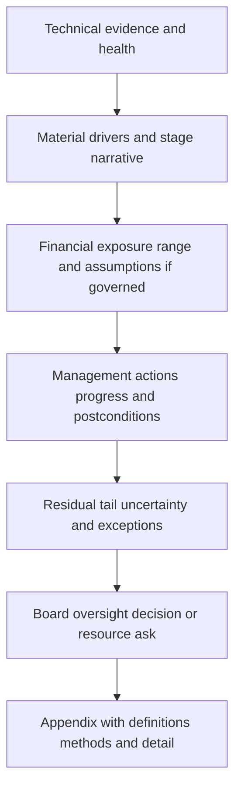

## Board-ready narrative pattern

1. **Scope and period:** State business services, population, currency/time horizon, and as-of date.
2. **Material scenario:** Explain the harmful pathway and consequence in plain language.
3. **Movement:** Explain whether environment, threat, treatment, data, scope, or model changed.
4. **Financial framing:** Provide governed range/statistics and assumptions, or say it is not quantified.
5. **Management action:** State completed, in-progress, and blocked treatments with owners.
6. **Validation:** State which postconditions passed and which remain.
7. **Residual/tail:** State remaining scenarios, uncertainty, dependencies, and exceptions.
8. **Decision:** Ask for funding, priority, tolerance, governance, or no decision.
9. **Caveat:** Place the material limitation beside the claim.

## Caveat library

| Claim area | Responsible caveat |
|---|---|
| Product scope | "Current enabled sources, factor behavior, and entitlement require tenant verification." |
| Factor count | "The reviewed public page contained differing counts; no fixed count is relied upon." |
| Financial exposure | "This is a modeled potential range under stated assumptions, not actual or guaranteed loss." |
| Probability | "The estimate is scenario- and period-specific and does not predict an event date." |
| Control | "Effectiveness evidence covers the named technique, route, policy, population, and test time." |
| Trend | "Movement includes stated scope/data/model changes and is not solely underlying-risk change." |
| Incident | "Risk telemetry does not establish whether compromise or data loss occurred." |
| Mitigation | "Recommendation requires customer applicability, authority, safety, and postcondition review." |
| Avoided loss | "No prevented incident or exact financial loss avoided is claimed." |
| Board use | "Management, finance, legal, and risk owners govern interpretation and disclosure." |

### Plain-English deep-dive 4 - Board brevity must compress detail without compressing uncertainty

A pilot does not read every engine sensor to passengers, but a warning about fuel must retain the amount, consequence, action, and uncertainty needed for a safe decision. Saying "all green" because the technical appendix is complex would be irresponsible. Saying "catastrophe is certain" because one sensor is high would also be irresponsible.

Board reporting should compress evidence into material scenarios, movement, management action, resource decisions, resilience, and residual uncertainty. It can move formulas and record-level evidence to an appendix, but it cannot remove scope, assumptions, model limitations, source degradation, or authority boundaries. A short report is successful when decision-makers know what changed, why it matters, what management is doing, what remains, and what they must decide.

## Reporting architecture and controls

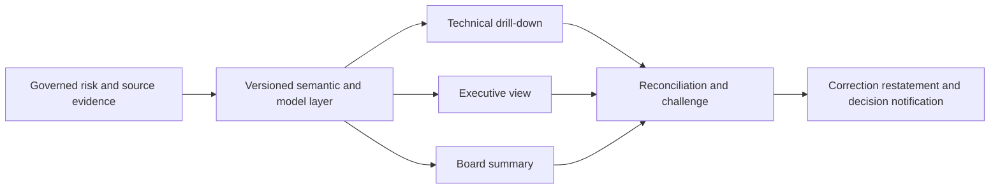

| Reporting control | Purpose | Test |
|---|---|---|
| Metric/model contract | Defines units, scope, formula authority, versions | Independent recomputation where authorized |
| Role-based access | Protects telemetry, paths, identities, financial assumptions | Least-privilege viewer tests |
| As-of/refresh | Makes timing visible | Source-to-report latency checks |
| Drill consistency | Connects summary to factors/entities/evidence | Sample reconciliation |
| Change annotation | Explains scope/data/model breaks | Movement bridge completeness |
| Restatement | Corrects material prior reporting | Version and notification audit |
| Export control | Prevents uncontrolled sensitive copies | Access and distribution review |
| Approval | Ensures finance/legal/risk review where needed | Sign-off record |
| Decision log | Records action, owner, due, residual | Follow-up reconciliation |

## Troubleshooting quantification and reporting

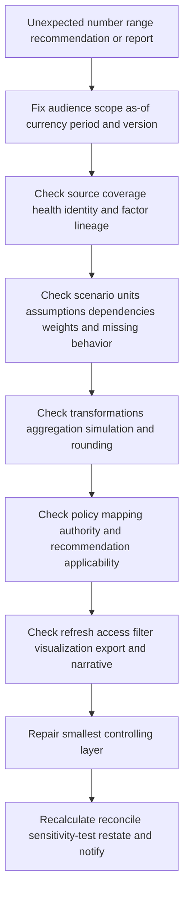

| Symptom | Possible cause | Discriminating check | Containment |
|---|---|---|---|
| Financial view changes dramatically | Source/scope/model/assumption change or real exposure | Versioned movement bridge and input sensitivity | Pause decision claim until explained |
| Range appears too narrow | Missing uncertainty, correlation, tail, rounding | Inspect input distributions/dependencies | Widen caveat or withhold estimate |
| Expected loss exceeds stated maximum | Unit/time/calculation or definition mismatch | Recompute dimensional units and bounds | Mark invalid |
| Mitigation benefit exceeds baseline exposure | Double count, incompatible scenarios, avoided-loss error | Trace option effect and baseline | Withdraw benefit claim |
| Recommendation violates policy | Wrong applicability/context or stale policy link | Compare current policy/version/owner | Do not automate |
| Board and technical numbers differ | Scope/filter/refresh/model/access mismatch | Reconcile shared semantic layer | Publish correction if material |
| Trend improves after source failure | Unknown treated as zero or population dropped | Independent denominator/source health | Mark degraded and restate |
| Currency/time horizon mixed | Conversion or annualization defect | Units and effective-date audit | Suspend comparison |
| Tail jumps while mean stable | Distribution/dependency/tail assumption changed | Compare percentile and input drivers | Explain distinct decision impact |

## Failure modes and misconceptions

| Misconception | Why it fails | Better rule |
|---|---|---|
| Score is money | Index units and currency differ | Verify documented financial view/model |
| Potential exposure is predicted loss | It is modeled under assumptions | Use ranges, period, scenario, caveats |
| Mean is most likely outcome | Distribution may be skewed | Show median, mean, percentiles as appropriate |
| High percentile is confidence | Percentile describes modeled outcome distribution | Explain probability and model confidence separately |
| More decimals mean accuracy | Precision can exceed evidence | Round to decision-relevant bands |
| Historical incidents predict future exactly | Threat, controls, business, and reporting change | Refresh and stress assumptions |
| Factors are independent | Shared sources/controls create correlation | Map dependencies |
| Control reduces every scenario equally | Coverage and bypass differ | Map exact prerequisite and validate |
| Lower score equals dollars saved | Attribution and counterfactual unsupported | Report bounded postconditions, not prevented loss |
| Guidance is mandatory policy | Customer governance decides | Link current policies and owners |
| Board wants no caveats | Oversight requires material limitations | Put caveat beside claim |
| TSM validates financial statements | Wrong expertise/authority | Facilitate evidence and proper review |

## Security, privacy, model-risk, and ethical safeguards

Quantification can combine sensitive identity, activity, private-application, vulnerability, control, data classification, legal, financial, and business-criticality evidence. Apply purpose limitation, minimization, least privilege, separation of duties, encryption, retention, regional/legal review, export control, audit, and secure support handling. Board reports should minimize operational path detail, personal data, exact control gaps, and exploitability while retaining decision-relevant truth.

Model-risk governance should document intended use, prohibited uses, scope, owners, sources, assumptions, methodology, validation, calibration, dependencies, versions, thresholds, limitations, monitoring, challenge, overrides, approvals, and retirement. Independent review may be appropriate when decisions are consequential. Users should know when output is provisional or outside validated use.

AI can assist in drafting cited scenario descriptions, checking arithmetic, comparing versions, or generating challenge questions. It should not invent probability ranges, cost assumptions, policy links, proprietary product methods, or board conclusions. Sensitive data should not enter unapproved models. Human finance, legal, risk, security, and business owners remain accountable for assumptions, decisions, and disclosures.

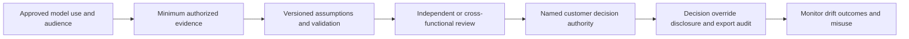

## Complete synthetic NMH quantification case

Everything in this section is explicitly fictional and synthetic. It is not Risk360 output, does not reproduce any product formula, and does not describe a customer, tenant, factor, score, financial estimate, recommendation, policy, report, or Arti production experience. Every date below is a synthetic scenario date on or before the official source review date. The source snapshot remains 2026-08-24.

NMH creates a synthetic scenario on 2026-08-21: unauthorized use of a fictional privileged analytics identity could disrupt a medication-reporting service and expose synthetic records. The exercise uses invented low/central/high bands solely to practice transparency. Currency is fictional USD, the horizon is one synthetic year, and no actual probability, event, loss, or avoided loss is claimed.

| Synthetic assumption | Low | Central | High | Evidence/confidence note |
|---|---:|---:|---:|---|
| Annual loss-event frequency | 0.02 | 0.08 | 0.25 | Invented expert-teaching range; low confidence |
| Response/restoration magnitude | 200,000 | 700,000 | 2,000,000 | Synthetic operations estimates |
| Interruption and follow-on magnitude | 300,000 | 1,500,000 | 7,000,000 | Synthetic, highly uncertain and dependent |
| Control effectiveness for named path | 40% | 70% | 90% | Synthetic range requiring validation |

No one multiplies the matching low columns and calls that a statistically valid confidence interval. The table contains scenarios, not calibrated distributions. The team uses it to discover that interruption duration and alternate-path control effectiveness drive the decision more than response labor. It requests better recovery evidence and a bounded identity-control test.

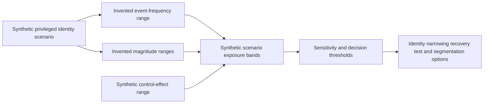

### Synthetic guided mitigation

The fictional recommendation is not copied from Risk360. Option A narrows emergency-role eligibility and adds time-bound activation. Option B improves recovery rehearsal and immutable backup validation. Option C redesigns segmentation around the analytics administration plane. The customer-style policy mapping identifies identity, change, recovery, exception, and privacy rules. Each option has a customer owner, canary, rollback, cost range, path postcondition, service negative test, and residual.

| Synthetic option | Primary driver change | Cost/constraint | Validation | Residual |
|---|---|---|---|---|
| Narrow privilege | Reduces path/action opportunity | Support workflow redesign | Positive/negative role tests | Break-glass route remains |
| Improve recovery | Reduces interruption magnitude | Exercise and storage cost | Restore-time/integrity rehearsal | Initial access remains |
| Segment admin plane | Reduces lateral route | Dependency and availability risk | Canary route and service tests | Identity misuse within segment |
| Monitor/accept temporarily | Adds detection/governance only | Requires risk authority | Alert/case and expiry checks | Main exposure retained |

### Synthetic executive and board statement

"The fictional analytics scenario remains material because broad emergency privilege and recovery uncertainty can combine. A teaching-only financial range is highly sensitive to interruption duration and control effectiveness; it is not Risk360 output or a predicted loss. Management's synthetic first action narrows privilege, while recovery testing and segmentation proceed in stages. No compromise, data loss, incident prevention, or dollars avoided are claimed. The decision requested is fictional funding for recovery rehearsal and dependency mapping, with residual review after postconditions."

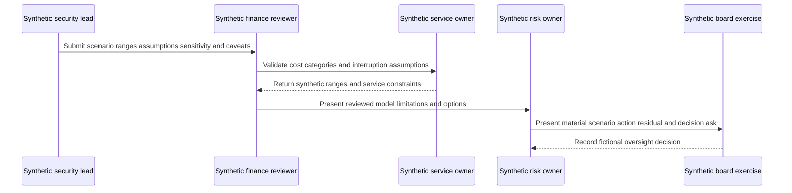

## Practical scenarios

### Scenario 1: executive asks for one exact dollar number

Explain what the model supports. Offer a rounded central statistic plus a range or percentiles, scenario, period, assumptions, and sensitivity if governed. If evidence supports only qualitative/semi-quantitative analysis, say so. Do not manufacture precision to satisfy formatting preference.

### Scenario 2: financial exposure rises after better telemetry

Separate evidence coverage from underlying environment change. Use a matched cohort or movement bridge. Explain that previously unknown conditions are now represented. Do not call the full increase risk deterioration, but do not suppress it to preserve a favorable trend.

### Scenario 3: two mitigations claim the same benefit

Map each to the same scenario prerequisites and avoid adding benefits as independent. Model sequence and dependency: if either blocks the route, combined incremental benefit may be less than the sum. Preserve defense-in-depth and resilience value without double-counting avoided loss.

### Scenario 4: a board report says "breaches prevented"

Replace the unsupported counterfactual. State validated exposure/control changes and modeled scenario implications under assumptions. Unless a defensible causal method establishes otherwise, the organization cannot observe incidents that would have happened in an alternate world.

### Scenario 5: recommendation conflicts with customer policy

Verify current product meaning and customer policy version, applicability, risk tolerance, change/safety constraints, and ownership. Treat guidance as an option, not authority. Document rejected/modified options and residuals. Escalate product questions separately from governance decisions.

### Scenario 6: mean improves but tail worsens

Explain that common events may be less costly while dependency or rare severe outcomes increased. Review concentration, recovery, supplier, identity, and catastrophic scenarios. Funding can rationally target tail resilience even when expected loss declines.

## Artifact kit

| Artifact | Minimum fields | Quality test |
|---|---|---|
| Product claim ledger | Source/date, public claim, interpretation, unknown, verification owner | No formula/UI/entitlement inferred |
| Driver receipt | Scope, factor, lineage, quality, stage, population, recommendation | Summary reaches evidence |
| Scenario definition | Actor/event, path, objective, consequence, population, period | Numbers have one bounded meaning |
| Assumption register | Input, unit, range/distribution, source, owner, confidence, dependency, expiry | Every input challengeable |
| Model card | Purpose, method, outputs, versions, validation, limitations, prohibited use | Intended use explicit |
| Sensitivity report | Input changes, output/option movement, thresholds | Decision-driving assumptions visible |
| Mitigation option matrix | Driver, cost, dependency, policy, owner, safety, benefit, residual | No duplicate benefit |
| Policy link record | Policy/version/owner/scope/requirement/exception/evidence | Guidance does not become policy silently |
| Executive brief | Scope, scenario, drivers, trend, range, action, residual, ask, caveat | Decision-ready without false certainty |
| Board one-pager | Material risks, management response, resilience, uncertainty, oversight ask | No operational overexposure |
| Movement bridge | Environment, threat, treatment, data, scope, model, exception | Trend reconciles |
| Restatement notice | Affected reports/decisions, correction, cause, owner, action | Prior decisions repaired |

## Safe exercises

| Exercise | Task | Deliverable | Pass condition |
|---|---|---|---|
| 1 | Classify product/general/customer/synthetic statements | Claim ledger | No method invented |
| 2 | Define a bounded risk scenario | Scenario card | Population, path, consequence, period clear |
| 3 | Choose quantification ladder level | Decision note | Precision matches evidence |
| 4 | Build factor drill-down | Driver receipt | Lineage, quality, action present |
| 5 | Explain a weight | One-page teaching note | Policy influence differs from truth |
| 6 | Create a synthetic assumption register | Input table | Units, sources, dependencies, confidence |
| 7 | Compare mean/median/percentile | Explanation | No percentile/confidence confusion |
| 8 | Build uncertainty taxonomy | Risk table | Measurement/parameter/structural differ |
| 9 | Run one-way sensitivity | Chart/table | Decision driver identified |
| 10 | Test correlation | Scenario comparison | Shared dependencies visible |
| 11 | Map loss categories | Consequence worksheet | Double counts challenged |
| 12 | Review mitigation benefit | Option matrix | No exact avoided-loss claim |
| 13 | Link guidance to policy | Policy record | Owner/version/exception/proof present |
| 14 | Write an executive brief | One page | Scope, movement, action, uncertainty, ask |
| 15 | Write a board summary | One page | Material and oversight focused |
| 16 | Repair an unsafe claim | Before/after language | Counterfactual removed |
| 17 | Troubleshoot a financial jump | Layered runbook | Source through report traced |
| 18 | Tabletop source/model correction | Restatement notice | Affected decisions notified |
| 19 | Review model access/privacy | Control matrix | Sensitive evidence minimized |
| 20 | Challenge AI-produced range | Citation/assumption audit | Unsupported inputs rejected |

## TSM discovery and review questions

1. What does current official Risk360 material and the licensed tenant actually support for factors, financial exposure, guidance, and reporting?
2. Which scenario, population, currency, time horizon, and customer decision does quantification support?
3. Which source/factor evidence, quality, and stage/path relationships support the scenario?
4. Which method and precision level are justified, and which uses are prohibited?
5. Who owns each frequency, magnitude, cost, control, dependency, and business assumption?
6. Which uncertainties, correlations, tail conditions, and unknown populations drive results?
7. Which mitigation changes which prerequisite or magnitude, under which policy and authority?
8. Which canary, negative test, rollback, and postconditions validate action safely?
9. Which executive or board decision is requested, and which caveats must appear beside the claim?
10. How will source/model changes, restatement, overrides, and affected prior decisions be governed?

## Model validation from first principles

Model validation asks whether a model is appropriate for its intended use, implemented as designed, understandable, and monitored. It does not ask whether every future outcome can be predicted. A model can be mathematically correct yet unsuitable because the scenario, population, inputs, dependencies, or decision use are wrong. Conversely, a simple range model can be useful when its limits are visible and the decision is robust across plausible assumptions.

Validation begins with conceptual soundness. Review the causal story from threat contact through exposure, control, event, and consequence. Ask whether the model omits a material pathway, double-counts the same loss, assumes independence where shared identities or providers create correlation, or assigns customer impact without an accountable owner. Confirm units: annual frequency cannot be multiplied by a five-year magnitude without an explicit time transformation, and percentages cannot be added to currency.

Implementation verification checks whether approved definitions became calculation behavior. Use known-value examples, boundary values, empty/unknown inputs, extreme ranges, unit tests, reconciliation totals, and independent calculations where authorized. Confirm random simulation behavior if used, including stable seeds for reproducible tests where appropriate, convergence diagnostics, and output summaries. These are general practices, not statements about Risk360 implementation.

Outcome and use validation compares outputs with reviewed historical cases, expert judgment, alternative models, and decision outcomes while acknowledging sparse, changing cyber data. Calibration should not force the past to fit perfectly or use incidents that share reporting bias as independent proof. Monitor input drift, output drift, override patterns, decision reversals, actual control performance, and scenarios that the model failed to represent. Document what would trigger recalibration, restricted use, or retirement.

| Validation dimension | Question | Evidence | Failure response |
|---|---|---|---|
| Intended use | Which decision/audience may use output? | Model card and approval | Restrict unsupported use |
| Conceptual soundness | Does scenario logic represent material pathways and consequences? | Expert and owner review | Redesign structure |
| Data suitability | Are source, population, time, quality, and authority adequate? | Data/source contracts | Improve evidence or lower precision |
| Implementation | Does calculation match approved design? | Tests and independent checks | Correct, recompute, restate |
| Sensitivity | Do outputs move reasonably at boundaries? | Sensitivity suite | Adjust method or decision rule |
| Dependency | Are correlations and shared controls represented? | Dependency map/stress tests | Model alternatives and concentration |
| Calibration | Are estimates reasonable against reviewed evidence? | Backtesting/expert comparison | Recalibrate with caveats |
| Interpretability | Can users explain inputs, output, uncertainty, and action? | User challenge exercises | Improve explanations/training |
| Monitoring | Are drift, errors, overrides, and misuse detected? | Health and governance metrics | Contain output and investigate |
| Change control | Are versions, approvals, migration, and trend effects governed? | Release/restatement record | Pause incompatible comparison |

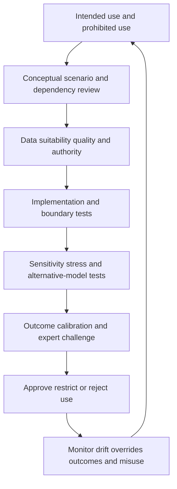

## Quantification adoption and decision quality

Adoption is not the number of people who see a monetary value. It is repeated correct use: stakeholders can identify the scenario and model version, explain assumptions and uncertainty, challenge evidence, compare options, avoid prohibited claims, record authority, and validate action. A report can have high viewing activity and low decision quality if readers copy one number without context.

| Adoption behavior | Good evidence | Warning signal | Enablement |
|---|---|---|---|
| Scenario comprehension | User states event, population, path, consequence, period | Talks only about one score | Scenario teach-back |
| Assumption literacy | User names decision-driving ranges/dependencies | Treats defaults as facts | Assumption workshop |
| Uncertainty use | User changes evidence/action based on uncertainty | Hides caveats to simplify | Sensitivity exercise |
| Option comparison | User compares likelihood/magnitude, cost, safety, residual | Picks highest advertised benefit | Option matrix coaching |
| Authority | Decision and disclosure owners are explicit | Analyst or vendor silently approves | RACI and governance review |
| Closure | Postconditions and residuals update model/report | Ticket close treated as dollars saved | Validation playbook |
| Challenge | Users report source/model discrepancies precisely | Rejects or worships black box | Factor/model challenge workflow |
| Learning | Incidents, near misses, tests, and overrides refresh scenarios | Static annual estimate | Feedback cadence |

The TSM can improve adoption by teaching the difference between index and currency, walking one driver to evidence, rehearsing a sensitivity conversation, documenting current product verification items, and helping establish a review cadence. The TSM should not supply customer financial assumptions or approve board disclosure. When a customer asks for that authority, the correct response is to bring the appropriate finance, legal, risk, and product experts into a clearly scoped discussion.

## Decision-package quality gate

Before an executive or board package is distributed, a quality gate should confirm that the numbers and narrative support the intended decision. The gate protects against last-minute simplification that strips essential limitations.

| Gate question | Pass evidence | If not passed |
|---|---|---|
| Is the decision explicit? | Funding, priority, tolerance, or oversight ask named | Return for purpose clarification |
| Is scope unambiguous? | Services, population, period, currency, as-of visible | Hold comparison |
| Is product behavior verified? | Current source and tenant evidence or explicit unknown | Add verification caveat |
| Is scenario traceable? | Factor to path to consequence to model | Remove unsupported number |
| Are assumptions owned? | Named customer owners and evidence | Mark provisional or defer |
| Is uncertainty decision-relevant? | Ranges, sensitivity, tail, confidence explained | Add analysis and caveat |
| Is movement reconciled? | Environment/threat/treatment/data/scope/model bridge | Do not claim improvement |
| Is mitigation governed? | Applicability, policy, owner, safety, postconditions | Present as option only |
| Is residual explicit? | Alternate paths, exceptions, limitations, next review | Do not state complete closure |
| Is disclosure approved? | Required security/risk/finance/legal review recorded | Restrict distribution |

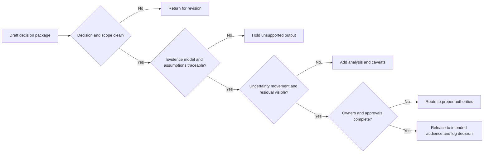

## After the decision: evidence does not stop

Once a mitigation is funded, record the hypothesis linking action to a specific frequency or magnitude driver. Measure implementation quality, legitimate-service effects, control/path postconditions, residuals, and operating cost. Do not immediately reduce a financial estimate because a purchase order was signed or a control was deployed. Update only when the governed model and evidence support the change.

If validation fails, decide whether implementation, control efficacy, scope, alternate paths, or the original model assumption was wrong. Preserve both the decision-time model and the revised view. This prevents hindsight from erasing what decision-makers actually knew. If a report materially changes, restate it and notify prior decision owners. A mature process learns from incorrect assumptions without turning every difference into blame.

After an incident, compare the modeled scenario, actual pathway, control behavior, loss categories, response/recovery, and dependencies. The aim is not to claim the model should have predicted an exact event. It is to identify missing scenarios, biased ranges, hidden correlations, weak controls, or reporting gaps and improve future decisions. Keep incident evidence separate from estimates while allowing each to inform the other under governance.

## Official Source Anchors

Research/source snapshot and source review date: **2026-08-24**.

Official Zscaler pages support bounded public positioning only. All formulas, quantification ladders, scenario methods, assumption registers, uncertainty types, sensitivity methods, cost-benefit logic, policy links, governance, reports, troubleshooting, and exercises are general educational practice. NMH is explicitly fictional and synthetic. Current official material, licensed-tenant evidence, and customer finance/legal/risk/model governance control real use.

| Source | URL | Used for | Boundary |
|---|---|---|---|
| Zscaler Risk360 | https://www.zscaler.com/products-and-solutions/zscaler-risk-360 | Public enterprise risk drivers/trends, four stages, guided mitigation, potential financial exposure, executive/board reporting positioning | No formula, exact factor count, distribution, weight, field, UI, threshold, entitlement, accounting treatment, certainty, or outcome inferred |
| Zscaler Zero Trust Exchange | https://www.zscaler.com/products-and-solutions/zero-trust-exchange-zte | Adjacent platform/attack-stage context | No quantification dependency inferred |
| Zscaler Data Fabric for Security | https://www.zscaler.com/products-and-solutions/data-fabric | Adjacent public data/correlation/logic/workflow/report positioning | No Risk360 model architecture inferred |
| Zscaler Unified Vulnerability Management | https://www.zscaler.com/products-and-solutions/vulnerability-management | Adjacent contextual vulnerability-priority positioning | Vulnerability score is not financial exposure |
| Zscaler Continuous Threat Exposure Management | https://www.zscaler.com/products-and-solutions/ctem | Adjacent continuous exposure-program positioning | CTEM outcome is not automatically monetary benefit |
| NIST Cybersecurity Framework 2.0 | https://www.nist.gov/cyberframework | Governance, risk communication, outcomes, improvement | Voluntary; customer implementation varies |
| NIST SP 800-53 Rev. 5 | https://csrc.nist.gov/pubs/sp/800/53/r5/upd1/final | Risk assessment, controls, privacy, incident, contingency, governance context | Requires customer selection/tailoring/assessment |

## Likely Interview Questions

### Q1. What can you safely say about Risk360 quantification and financial exposure?

**Model answer:** The reviewed public page positions Risk360 around enterprise risk drivers/trends, four attack stages, guided mitigation, potential financial exposure, and executive or board reporting using described signals. I would not infer a formula, factor count, weighting, distribution, confidence method, field, interface, entitlement, or guaranteed result. A financial view is a modeled decision input under assumptions; customer finance, legal, risk, business, and model-governance authorities control interpretation and use.

### Q2. How do you move from a risk factor to a defensible financial conversation?

**Model answer:** Drill from summary to material driver, population, source lineage, quality, stage/path, business service, consequence, controls, and trend movement. Define one scenario, population, currency, period, frequency and magnitude concepts, cost categories, dependencies, and uncertainty. Choose only the precision evidence supports, from narrative to ranges or governed distributions. Show sensitivity, tails, limitations, and owners. Never turn an unexplained score directly into dollars.

### Q3. What is expected loss, and what are its limitations?

**Model answer:** In a simple general teaching model, expected annual loss is expected annual event frequency times expected loss magnitude per event. Real models can use distributions, conditional paths, dependencies, controls, simulation, and multiple scenarios. Expected loss is a long-run average under assumptions, not the most likely annual outcome, event-date prediction, maximum loss, or product formula. Tail percentiles and uncertainty may drive different resilience decisions.

### Q4. How do you represent uncertainty without making analysis unusable?

**Model answer:** Classify scope, measurement, parameter, structural, correlation, threat, control, business, model, and decision uncertainty. Use ranges/distributions or scenarios with source, owner, confidence, and expiry. Run sensitivity and threshold tests to identify which uncertainty changes the decision. Pair low-confidence material assumptions with evidence work or temporary controls. Keep confidence in evidence separate from event probability and put important caveats beside the result.

### Q5. How should guided mitigation connect to policy and action?

**Model answer:** Verify the current recommendation and applicability, identify the factor/path prerequisite and control objective, compare options and residuals, then link the applicable customer policy/version, owner, scope, requirement, exception path, evidence, and review cadence. Resolve service, supplier, privacy, change, cost, and capacity constraints. Obtain customer authority, canary with positive/negative tests and rollback, validate postconditions, and update drivers/trends/residuals. Guidance is not automatic policy or authorization.

### Q6. What makes an executive or board risk report responsible?

**Model answer:** It states scope/as-of/period, material scenario and drivers, a movement bridge, governed financial range if supported, management actions and validation, residual/tail/uncertainty, accountable owners, and a decision or oversight ask. Technical details can move to an appendix, but material source/model limitations stay beside claims. It avoids exact-loss predictions, incident claims from risk telemetry, breaches-prevented counterfactuals, and unexplained score movement.

### Q7. How would you troubleshoot an unexpected financial view or report?

**Model answer:** Reproduce audience, scope, as-of, currency, period, and model/version. Trace source health, identity, factor lineage, scenario, units, ranges/distributions, dependencies, weights, missing behavior, transformations, aggregation/simulation, rounding, policy mapping, recommendation applicability, refresh, access, filters, visualization, and narrative. Contain affected decisions, repair the smallest layer, recalculate, reconcile, sensitivity-test, restate material reports, and notify affected decision owners.

### Q8. How does Arti's background support this work without overstating experience?

**Model answer:** Microsoft 365, OneDrive, and SharePoint escalation work supports scoped scenario, identity, permission, service, data, impact, and evidence reasoning. Networking traces support technical prerequisite validation. SQL and Power BI support grain, ranges, distributions, sensitivity, joins, trends, drill-through, and reconciliation. Escalation and mentoring support decision communication; reviewed AI can assist cited drafts. NMH is synthetic; production Risk360, financial quantification, model governance, and board reporting remain learning boundaries.

## 30-Second Memory Hooks

| Concept | Memory hook |
|---|---|
| Financial exposure | Modeled range, not future invoice |
| Scenario | Event, path, consequence, population, period |
| Quantification ladder | Use only precision evidence earns |
| Factor drill-down | Scope, lineage, quality, path, consequence, action |
| Weight | Influence dial, not truth dial |
| Expected loss | Long-run average, not most likely or maximum |
| Tail | Rare severe outcomes can drive resilience |
| Percentile | Outcome distribution, not confidence label |
| Confidence | Evidence/model support, not event probability |
| Uncertainty | Classify, range, test sensitivity, communicate |
| Correlation | Shared identity/provider/control breaks independence |
| Guidance | Verify, map policy, authorize, canary, prove |
| Benefit | Bounded driver change, not exact prevented dollars |
| Board report | Material scenario, action, residual, ask, caveat |
| Restatement | Repair affected decisions, not just dashboard |
| Arti bridge | Analytics and escalation transfer; quantification authority does not |

## Completion Checklist

- [ ] I separate official product fact, product unknown, general practice, customer model, scenario assumption, and unknown.
- [ ] I state Risk360 financial/guidance/reporting positioning without inventing formula, factor count, field, UI, distribution, weight, threshold, entitlement, or result.
- [ ] I define quantification, qualitative/semi-quantitative/quantitative, scenario, frequency, probability, magnitude, loss, exposure, potential financial exposure, expected loss, tail, percentile, distribution, range, confidence, uncertainty, sensitivity, correlation, dependency, weight, calibration, materiality, appetite, tolerance, mitigation, cost-benefit, and residual.
- [ ] I choose a quantification level whose precision matches evidence and decision need.
- [ ] I drill from factor to population, lineage, quality, stage/path, consequence, controls, trend, and decision before using money.
- [ ] I treat weights as governed influence rather than objective truth.
- [ ] I state the expected-loss teaching identity as general practice, never a Risk360 formula.
- [ ] I distinguish mean, median, percentile, exceedance probability, bounds, and scenario bands.
- [ ] I build scenario-specific loss categories without double counting.
- [ ] I classify scope, measurement, parameter, structural, correlation, threat, control, business, model, and decision uncertainty.
- [ ] I keep evidence confidence separate from event probability.
- [ ] I run one-way, threshold, scenario, control, correlation, scope, time, and model-version sensitivity tests as appropriate.
- [ ] I map guided mitigation through applicability, objective, options, policy, owner, dependencies, safety, benefit, proof, and residual.
- [ ] I link current customer policy/version/owner/scope/requirement/exception/evidence rather than treating guidance as policy.
- [ ] I compare costs and benefits without claiming exact prevented incidents or dollars avoided.
- [ ] I create audience-specific technical, executive, finance/legal, and board views from one governed evidence/model layer.
- [ ] I use the board narrative pattern: scope, scenario, movement, financial framing, action, validation, residual, decision, caveat.
- [ ] I place material caveats beside claims and never hide them in footnotes.
- [ ] I reconcile source, factor, model, policy, report, and narrative layers when troubleshooting.
- [ ] I restate material errors and notify affected prior decision owners.
- [ ] I protect security, identity, data, financial, legal, model, and path evidence with purpose and least privilege.
- [ ] I govern model purpose, prohibited use, sources, assumptions, validation, versions, limits, monitoring, challenge, overrides, and retirement.
- [ ] I use AI only for approved grounded assistance with human review, never autonomous estimates, recommendations, or disclosure.
- [ ] I can explain every NMH value/date/calculation/report as fictional and synthetic, never Risk360 output.
- [ ] I can build all twelve artifacts and complete all twenty exercises.
- [ ] I connect M365/networking/SQL-Power BI/escalation/mentoring/AI strengths without unsupported production Zscaler, Risk360, financial-model, GRC, or board-reporting claims.
- [ ] I retain the source review date exactly as 2026-08-24.
- [ ] I can answer all eight interview questions with responsible caveats and neutral honesty syntax.

[Part 91 - SOC Fundamentals, Roles, Tiers, Processes, and Operating Models](Part-91-soc-fundamentals-operating-model.md)