# Part 91 - SOC Fundamentals, Roles, Tiers, Processes, and Operating Models

> **Audience:** Arti Thakur, preparing for a Zscaler Security Operations Technical Success Manager role after Microsoft enterprise Support Escalation Engineering.

> **Purpose:** Explain Security Operations Center fundamentals from zero: mission, services, people/process/technology, analyst roles and tiers, detection engineering, triage, investigation, threat hunting, incident response, threat intelligence, case management, shift handoff, managed services, operating models, metrics, security/privacy, troubleshooting, failure modes, artifacts, exercises, and customer decision logic.

> **Scope and honesty:** Northstar Meridian Holdings, abbreviated NMH, is an explicitly fictional and synthetic customer used only for study. Every NMH alert, case, incident, role, service, tool, date, metric, workflow, decision, and result is invented. Arti's factual background is Microsoft 365, OneDrive, and SharePoint support; networking and trace analysis; SQL and Power BI; enterprise escalations; mentoring; and responsible AI exploration. Production Zscaler, SOC, SIEM, SOAR, XDR, EDR, NDR, UEBA, MDR, detection engineering, threat hunting, incident command, and customer security-operations ownership remain learning boundaries.

> **Currency caveat:** SOC practices, threats, standards, technologies, product names, workflows, automation, managed-service models, legal/privacy obligations, and customer environments change. The controlled source review date for this Part is exactly **2026-08-24**. Current official references, customer policies, product documentation, licensed-tenant evidence, service contracts, legal/privacy guidance, source-native evidence, and tested runbooks govern production decisions.

> **Section goal:** Build a complete beginner-to-interview SOC operating model: explain why the SOC exists, how roles and tiers cooperate, how signals become cases and incidents, how detections/hunts/intelligence/response improve one another, how 24x7 handoffs and managed services preserve accountability, and how a TSM can support product adoption and troubleshooting without claiming customer incident authority or production SOC experience.

This Part is primarily **general security practice**, not a Zscaler product chapter. The reviewed public Zscaler Agentic Security Operations page is an official source anchor only for adjacent portfolio context that later Parts will examine. Nothing here asserts a Zscaler-specific SOC architecture, alert schema, workflow, analyst tier, service level, integration, automation, AI agent, entitlement, or result.

Every statement should be classified as **official product fact**, **general security practice**, **scenario assumption**, **customer fact**, or **unknown**. Customer policy decides severity, escalation, containment authority, evidence retention, privacy, staffing, service levels, and incident declaration. A TSM may facilitate product use and evidence, but does not silently become the customer's SOC manager or incident commander.

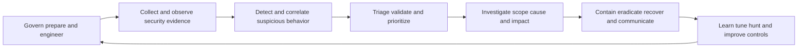

| SOC principle | Plain meaning | Operational consequence | Failure prevented |
|---|---|---|---|
| Mission before tools | Define outcomes and authority first | Build services around customer risk | Tool collection without operation |
| Evidence before conclusion | Preserve source, entity, time, and confidence | Hypotheses remain challengeable | Alert-equals-incident thinking |
| Risk and impact aware | Prioritize context, not alarm volume alone | Material cases receive attention | Queue sorted only by vendor severity |
| Human governed automation | Automate bounded repeatable actions | Approvals and rollback protect operations | Fast harmful response |
| Closed learning loop | Feed incidents, hunts, overrides, and misses back | Detections and playbooks improve | Recurring blind spots |
| Explicit handoff | Transfer state, evidence, ownership, and next action | Work survives shift/provider boundaries | Context loss and duplicate action |
| Measured quality | Track coverage, accuracy, speed, outcome, safety, cost | Metrics guide improvement | Dashboard theater |
| Shared accountability | Customer retains governance across suppliers | Contracts and RACI expose gaps | Outsourced responsibility illusion |

## JD Mapping

| JD signal | Capability developed | Customer/TSM artifact | Honest boundary |
|---|---|---|---|
| Develop SecOps expertise | Explain SOC mission, roles, processes, technologies, and models | SOC reference architecture | No production SOC claim |
| Trusted advisor | Connect customer risks to operating capabilities | Service charter and maturity map | Customer owns incident/risk authority |
| Drive adoption/value | Turn product signals into repeated correct analyst tasks | Use-case and adoption scorecard | No guaranteed detection outcome |
| Troubleshoot integrations | Isolate source, time, schema, entity, rule, case, action defects | Layered runbook | No unsupported root cause |
| Use analytics | Define event/case/incident grains, denominators, quality, trends | SQL/Power BI-style semantic model | No product schema access claim |
| Coordinate stakeholders | Align SOC, IR, IT, IAM, network, cloud, app, legal, privacy, communications, suppliers | RACI and escalation matrix | TSM facilitates, not commands response |
| Communicate proactively | State evidence, impact, containment, owner, ETA boundary, checkpoint | Incident/service updates | No unsupported assurance |
| Partner with Support/Product | Package redacted product/integration evidence | Escalation packet | No fix or roadmap promise |
| Apply AI responsibly | Bound AI to grounded assistance and human approval | AI control plan | No autonomous high-impact response |

## Candidate honesty note

Arti can say: "My production experience is enterprise Support Escalation Engineering rather than SOC operations. It built adjacent strengths in high-severity intake, layered evidence, networking traces, customer impact, cross-team coordination, timelines, containment discussions, RCA, communication, analytics, and mentoring. I have studied SOC operating models and practiced only with fictional artifacts. In a customer environment I would follow their incident authority and verify current product behavior."

| Factual strength | SOC transfer | Neutral evidence statement | Unsupported statement to avoid |
|---|---|---|---|
| M365/OneDrive/SharePoint | Cloud identity, permission, endpoint, sync, service, and data context | "I have diagnosed multi-layer enterprise service incidents." | "I investigated security incidents in a SOC." |
| Networking/traces | DNS, TCP, TLS, proxy, HTTP, packet/timestamp analysis | "I can test network and telemetry-path hypotheses." | "I operated NDR or hunted adversaries." |
| SQL/Power BI | Event/case models, joins, time windows, trends, reconciliation | "I can analyze operational quality and build transparent reports." | "I queried a production SIEM." |
| Escalations | Severity, impact, ownership, updates, containment, RCA, closure | "I can coordinate evidence under pressure." | "I served as incident commander." |
| Mentoring | Teach-back, shadowing, playbooks, quality review | "I can help analysts/users learn structured methods." | "I managed L1-L3 SOC analysts." |
| AI exploration | Grounded summary, query/test drafting, human review | "I use AI as bounded assistance." | "I automated autonomous response." |
| Synthetic NMH | Demonstrates method, artifacts, and interview reasoning | "This is a fictional SOC exercise." | "This is a customer outcome." |

## Beginner vocabulary and memory hooks

| Term | Meaning from zero | Why it matters | Analogy |
|---|---|---|---|
| Security operations | Ongoing work to identify, investigate, respond to, and learn from threats | Protects daily operations | Emergency and safety service |
| SOC | Security Operations Center: coordinated people, process, technology, and governance | Provides a security-operations function | Airport operations center |
| Event | Recorded observation from a system | Raw evidence unit | One sensor reading |
| Log | Sequence of recorded events | Supports reconstruction and detection | Ship's logbook |
| Telemetry | Data describing state or activity | Broad evidence input | Instrument panel data |
| Signal | Event/pattern considered security-relevant | Candidate attention | Smoke-detector chirp |
| Alert | Notification that detection logic matched | Starts triage, not a conclusion | Alarm bell |
| Finding | Documented condition or observation requiring assessment | Can be exposure, control, or investigation result | Inspector's note |
| Case | Work container for related evidence, tasks, decisions, and communications | Preserves investigation state | Patient chart |
| Incident | Confirmed or declared adverse security event under customer policy | Activates response/governance | Confirmed fire |
| Triage | Rapid assessment of validity, urgency, impact, and next action | Allocates scarce attention | Emergency-room sorting |
| Investigation | Evidence-led effort to explain what happened, scope, cause, and impact | Supports response decision | Detective reconstruction |
| Hypothesis | Testable explanation | Guides discriminating checks | Suspected cause |
| Indicator | Observable artifact associated with activity | Supports matching and pivoting | Footprint |
| IOC | Indicator of Compromise | Potential evidence of malicious activity | Known stolen-car plate |
| IOA | Indicator of Attack | Behavior suggesting attack activity | Suspicious driving pattern |
| Tactic | High-level adversary goal | Organizes behavior | Objective in a plan |
| Technique | General way an adversary achieves a goal | Supports detection/hunting knowledge | Method used |
| Procedure | Specific implementation of a technique | Adds concrete behavior | Exact steps used |
| Detection | Logic/process that identifies evidence worth assessment | Creates signal | Smoke detector |
| Detection engineering | Design, test, deploy, monitor, and improve detections | Makes detection reliable | Building and maintaining alarms |
| Threat hunting | Proactive, hypothesis-driven search for activity not already resolved by alerts | Tests blind spots | Searching for quiet leaks |
| Threat intelligence | Evidence and analysis about threats and implications | Adds relevance and context | Weather/adversary bulletin |
| Incident response | Prepare, detect/analyze, contain, eradicate, recover, learn | Manages confirmed/suspected incidents | Fire response lifecycle |
| Containment | Limit spread or harm | Buys time and reduces impact | Close fire doors |
| Eradication | Remove malicious cause/artifacts | Restores trustworthy state | Remove ignition source |
| Recovery | Return safely to service and monitor | Restores operation | Reopen inspected building |
| Playbook | Governed response pattern with decisions and branches | Guides judgment | Field manual |
| Runbook | Detailed repeatable task steps | Reduces execution ambiguity | Checklist |
| Escalation | Transfer/involve higher or different authority/expertise | Matches work to capability | Call specialist |
| SLA | Service Level Agreement: contractual service commitment | Sets expectations/remedies | Delivery contract |
| SLO | Service Level Objective: target for service performance | Guides operation | Internal delivery target |
| KPI | Key Performance Indicator tied to objective | Tracks outcome/progress | Navigation gauge |
| MSSP | Managed Security Service Provider | Operates contracted security services | Outsourced operations team |
| MDR | Managed Detection and Response | Provider detects/investigates/responds under contract | Specialist monitored response service |
| Shift handoff | Structured transfer between analysts/teams | Preserves continuity | Clinical shift report |

### Plain-English deep-dive 1 - A SOC is a service system, not a room with screens

A hospital emergency department is not defined by monitors alone. It has a mission, intake criteria, trained roles, triage, diagnostic evidence, escalation, treatment authority, patient records, handoffs, quality review, privacy, and capacity planning. More alarms without staff, process, authority, or records would make care worse.

A SOC works similarly. Security tools produce evidence and signals. The operating system decides which sources matter, how detections are tested, who triages, when an issue becomes a case or incident, who may contain an identity or device, how business owners are involved, what records are retained, how shifts hand over work, and how lessons improve controls. A modern SOC can be centralized, distributed, virtual, internal, outsourced, or hybrid. The mission and service contracts matter more than the physical room.

## SOC mission and outcomes

A concise mission might be: "Reduce the likelihood and impact of material security incidents by maintaining relevant visibility, detecting suspicious behavior, investigating evidence, coordinating authorized response and recovery, and improving controls continuously." The mission should fit customer risk, regulation, architecture, staffing, and service hours.

| Mission outcome | Operational question | Evidence |
|---|---|---|
| Visibility | Can relevant assets, identities, apps, cloud, network, and data activity be observed? | Coverage and source health |
| Detection | Are material behaviors detectable with acceptable quality and latency? | Coverage map and validation results |
| Triage | Can attention be assigned based on evidence and impact? | Queue quality and decision records |
| Investigation | Can analysts reconstruct entity, timeline, scope, and cause? | Case completeness and reproducibility |
| Response | Can authorized teams contain, eradicate, and recover safely? | Playbook tests and outcomes |
| Communication | Do stakeholders receive accurate, timely, audience-appropriate updates? | Communication log and feedback |
| Learning | Do misses, overrides, incidents, hunts, and threat changes improve capability? | Tuning and improvement backlog |
| Governance | Are authority, privacy, risk, audit, and supplier responsibilities explicit? | Charter, RACI, policy, review |

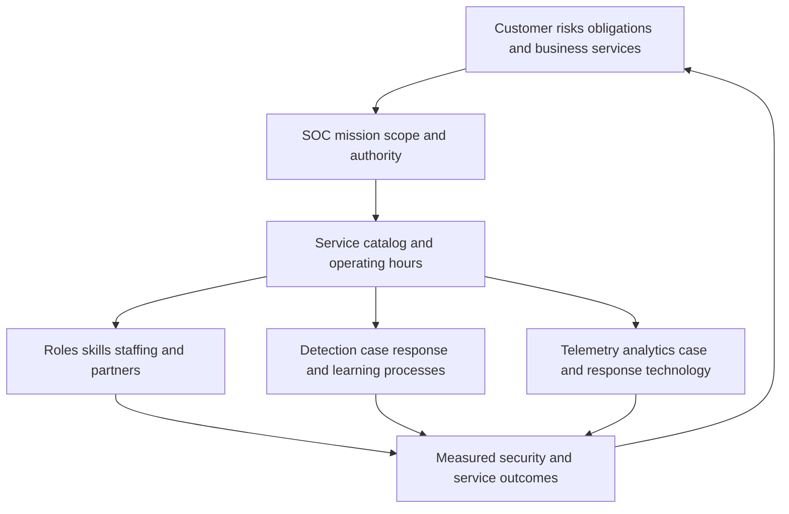

## SOC service catalog

| Service | Purpose | Inputs | Outputs | Boundary |
|---|---|---|---|---|
| Security monitoring | Observe prioritized environments and controls | Telemetry/health | Signals and coverage state | Not universal visibility |
| Alert triage | Assess detection matches | Alerts, context, policy | Close, enrich, escalate, case | Alert is not incident |
| Investigation | Establish timeline, entities, scope, confidence | Events, assets, identity, threat, business context | Findings and response options | Evidence limitations remain |
| Incident response coordination | Manage authorized containment through recovery | Confirmed/suspected incident evidence | Actions, communication, recovery, lessons | Authority/customer policy governs |
| Detection engineering | Create and maintain detection content | Threat, incidents, hunts, telemetry | Versioned detections and tests | Tool syntax/coverage varies |
| Threat hunting | Proactively test hypotheses and blind spots | Intelligence, behavior, telemetry | Findings, new detections, gaps | Hunt result is bounded |
| Threat intelligence | Collect/analyze threat evidence for decisions | Internal/external sources | Requirements, assessments, enrichment | Intelligence is not occurrence proof |
| Vulnerability/exposure liaison | Connect exposure priority to detection/response | CTEM/UVM/asset/path evidence | Monitoring and response priorities | SOC does not own all remediation |
| Case management | Preserve work, evidence, decisions, ownership, audit | Alerts, tasks, communications | Case/incident record | Case system is not source truth for all data |
| Reporting/improvement | Measure quality, risk, service, capacity, lessons | Events, cases, outcomes, feedback | Reviews and backlog | Speed alone is not success |

## Scope and service charter

| Charter field | Question | Common failure |
|---|---|---|
| Customers | Which internal/business stakeholders receive service? | "Everyone" with no expectations |
| Outcomes | Which risks and decisions improve? | Tool operation substituted for outcome |
| Coverage | Which entities, environments, channels, regions, hours? | Unknown blind spots |
| Services | Which catalog items are delivered? | Monitoring assumed to include response |
| Authority | Who may declare, contain, isolate, disable, collect, disclose? | Analyst acts beyond authority |
| Inputs | Which sources and context are required? | Ingestion without source contracts |
| Severity | How are evidence, business impact, confidence, and urgency combined? | Vendor severity copied blindly |
| Escalation | Which functional/management/provider paths and clocks? | Stalled or misrouted cases |
| Privacy/legal | What collection, access, retention, and jurisdiction rules apply? | Excessive surveillance/data exposure |
| Service levels | Which SLA/SLO definitions, pauses, exclusions, and remedies? | Clock gaming |
| Dependencies | Which IT, IAM, cloud, app, legal, communications, vendors? | SOC treated as self-contained |
| Success | Which quality/outcome/capacity measures matter? | Alert-count theater |

## People, process, and technology

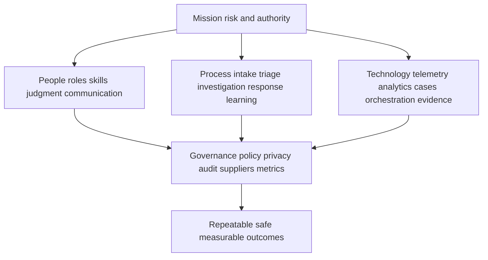

| Dimension | Must answer | Anti-pattern |
|---|---|---|
| People | Who has skill, authority, capacity, backup, and growth path? | Buying tools to solve staffing/authority gaps |
| Process | How does evidence move from signal to learning? | Tribal knowledge and inconsistent closure |
| Technology | What acquires, analyzes, stores, orchestrates, and presents evidence? | One tool expected to be every system |
| Governance | Who defines risk, privacy, retention, response, exceptions, suppliers? | SOC silently defines enterprise policy |
| Data | Which source, identity, time, quality, lineage, and access contracts apply? | Alert content treated as complete truth |
| Measurement | Which decisions and outcomes improve without unsafe incentives? | Optimizing one response-time average |

### Plain-English deep-dive 2 - People, process, and technology fail as a chain

A smoke detector can work perfectly, but if nobody hears it, no one knows which building it covers, the response number is wrong, or responders lack authority to enter, the safety system fails. Hiring more responders does not fix a detector that sends constant false alarms. Writing a perfect procedure does not help if required evidence is unavailable.

SOC design must treat people, process, technology, data, and governance as one chain. When analysts ignore alerts, ask whether detection relevance, context, queue design, workload, training, incentives, authority, or prior trust is controlling behavior. Training is not the universal fix. When automation fails, ask whether inputs and decisions were stable enough to automate. The root cause often sits at a boundary between teams or systems.

## Roles and responsibilities

| Role | Primary purpose | Typical work | Must not assume silently |
|---|---|---|---|
| L1/triage analyst | Rapid initial assessment and routing | Validate alert, enrich, scope basics, document, escalate/close | Final authority for novel severe incident |
| L2/investigator | Deeper multi-source investigation | Timeline, pivots, scope, hypotheses, containment recommendation | Universal forensic/legal authority |
| L3/senior analyst/SME | Handle complex/novel cases and improve capability | Advanced analysis, guidance, quality, tooling, detection feedback | Management/risk authority by seniority |
| Detection engineer | Design/test/operate detection content | Requirements, logic, testing, release, monitoring, tuning | Declaring incidents from rule output |
| Threat hunter | Proactively test hypotheses | Hunt design, queries, pivots, findings, detection gaps | Free-form surveillance without purpose |
| Threat-intelligence analyst | Turn threat information into decision support | Requirements, collection, evaluation, assessment, dissemination | Treating reports as local proof |
| Incident responder/DFIR | Contain, collect/analyze evidence, eradicate, recover | Host/cloud/identity/data response and forensics | Unapproved destructive action |
| Incident commander | Coordinate objectives, decisions, owners, cadence | Command structure, updates, blockers, transitions | Doing every technical task |
| SOC lead/manager | Operate service, people, quality, capacity, stakeholders | Staffing, governance, metrics, improvement, suppliers | Editing evidence to improve metrics |
| Platform/content engineer | Operate data, integrations, automation, case platforms | Source health, schemas, pipelines, actions | Security interpretation alone |
| Business/service owner | Explain consequence and approve service tradeoffs | Impact, dependency, recovery, communications | Technical threat conclusion alone |
| Legal/privacy/comms | Govern obligations, privacy, privilege, disclosure, messaging | Review and decisions | Technical investigation execution |
| TSM | Enable documented product use, adoption, evidence, reviews, support escalation | Discovery, health, troubleshooting, value, coordination | Customer incident command or risk acceptance |

## Tiering models and their limits

L1, L2, and L3 are common role shorthand, not universal standards. Some SOCs use pods, product-aligned teams, swarming, follow-the-sun, or no tiers. Tiering can help route work and build skills, but rigid escalation can create queues and context loss.

| Model | Strength | Risk | Good fit |
|---|---|---|---|
| L1-L2-L3 tiers | Clear entry, escalation, specialization, career progression | Handoffs, L1 monotony, "throw over wall" | Stable high-volume operations |
| Swarming | Right experts collaborate early | Coordination cost and scarce SME load | Complex/novel high-impact cases |
| Domain pods | Identity/cloud/data/endpoints specialists own end-to-end | Cross-domain gaps and inconsistent process | Distinct technology/risk domains |
| Product/service aligned | Analysts know business application deeply | Duplicate capability and local blind spots | Critical product organizations |
| Follow-the-sun | Uses global teams for 24x7 continuity | Handoffs, privacy, consistency, latency | Distributed organizations |
| On-call | Efficient for lower overnight demand | Fatigue and slower response | Lower-volume bounded scope |
| Hybrid | Uses tiers for routine and swarms for complexity | Governance complexity | Most mature mixed environments |

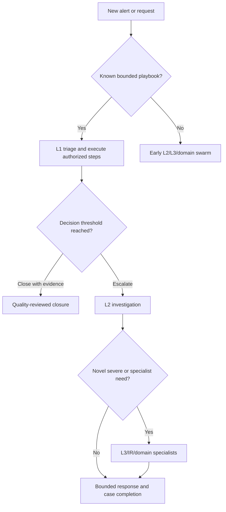

## Triage from alert to decision

Triage should answer: Is the alert technically valid? Which entities and time are involved? What behavior and detection logic matched? What context changes urgency? Is there evidence of impact or active continuation? Which next action and authority apply? What must be documented?

| Triage field | Question | Evidence |
|---|---|---|
| Alert identity | Which source, rule/version, event IDs, and UTC window? | Native IDs and timestamps |
| Entity identity | Which user, device, workload, app, data, tenant? | Stable identifiers and lifecycle |
| Detection meaning | What exact condition matched? | Rule description and contributing events |
| Data quality | Are source, time, fields, mappings, and enrichment healthy? | Health and provenance |
| Context | Privilege, criticality, exposure, controls, threat relevance? | Authoritative contextual sources |
| Behavior | What occurred before/during/after? | Timeline and pivots |
| Impact | Which business/data/service consequence is supported? | Owner and evidence |
| Confidence | Strong, weak, conflicting, missing? | Hypothesis ledger |
| Urgency | Is activity active, spreading, destructive, or time-sensitive? | Recent evidence and scenario |
| Decision | Close, monitor, enrich, escalate, declare, contain? | Customer policy and authority |

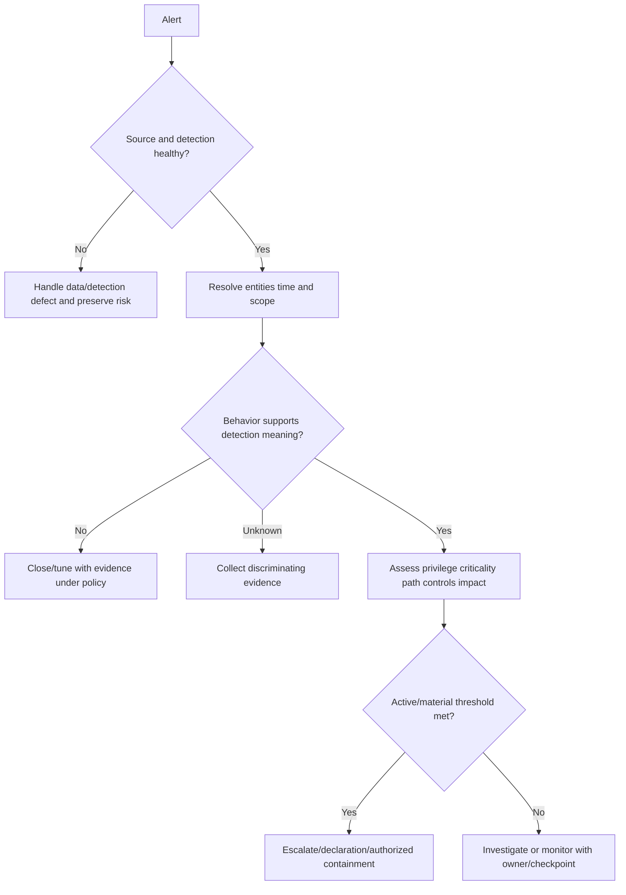

## Severity and priority

Severity should combine technical behavior, confidence, business impact, scope, privilege, sensitivity, active status, control state, and time pressure under customer policy. Vendor alert severity is one input. Priority also considers response capacity and dependencies without lowering material risk merely to fit the queue.

| Dimension | Example question | Common error |
|---|---|---|
| Validity/confidence | Is detection supported by native evidence? | Treating low confidence as no risk |
| Business impact | Which service/data/safety objective could be affected? | Vendor invents criticality |
| Scope/blast radius | One entity, many entities, shared identity/provider? | Counting alerts instead of affected entities |
| Privilege | Does activity involve admin/service/break-glass authority? | Group label without effective privilege |
| Activity state | Is it active, contained, historical, recurring? | Old event treated as active without context |
| Threat relevance | Known technique/campaign/local indicator? | Intelligence equals local compromise |
| Controls | Prevented, detected, partial, bypassed, unknown? | Installed equals effective |
| Time sensitivity | Credential lifetime, destructive behavior, disclosure clock? | Same SLA for every scenario |
| Evidence quality | Missing sources or time skew? | Unknown silently lowers severity |

## Investigation lifecycle

```mermaid
flowchart LR
    Q[Question and initial hypothesis] --> P[Preserve evidence and scope]
    P --> T[Build normalized timeline]
    T --> E[Resolve entities relationships and pivots]
    E --> H[Test competing hypotheses]
    H --> S[Determine scope impact and confidence]
    S --> R[Recommend/execute authorized response]
    R --> C[Validate recovery close residuals and learn]
```

1. Write what is observed separately from what is inferred.
2. Preserve native IDs, timestamps, source versions, volatile evidence, and chain-of-custody requirements.
3. Normalize time carefully: event time, device time, ingestion time, processing time, and display time can differ.
4. Resolve stable entity identity and lifecycle before pivoting.
5. Build a timeline with gaps and conflicting evidence visible.
6. State competing hypotheses and choose checks that distinguish them.
7. Expand scope by justified pivots, not unlimited curiosity.
8. Assess business impact with service/data owners.
9. Coordinate authorized containment without destroying needed evidence or service.
10. Validate eradication/recovery, document residuals, and feed lessons into detection/hunting/controls.

## Hypothesis and evidence ledger

| Field | Purpose | Example neutral syntax |
|---|---|---|
| Observation | Preserve raw supported fact | "Source recorded authentication from X at UTC time." |
| Hypothesis | Testable explanation | "The session may reflect stolen credentials." |
| Alternative | Avoid confirmation bias | "It may reflect approved travel or automation." |
| Prediction | What evidence should exist if true? | "Token, device, route, and follow-on behavior should align." |
| Check | Discriminating action | "Compare device identity and token/session evidence." |
| Result | Supported/disproved/inconclusive | "Device mismatch supports but does not prove theft." |
| Confidence | Strength and limitations | "Moderate; source B is delayed." |
| Next action | Owner, authority, checkpoint | "IAM owner reviews/revokes under policy." |

### Plain-English deep-dive 3 - Investigation is competing stories, not evidence collection without end

If a front door opens at midnight, one story is burglary. Other stories include the owner returning, a cleaner's schedule, a faulty sensor, or an automated test. Collecting every event in the neighborhood is inefficient. Good investigation identifies evidence that differs between stories: whose key, which camera, alarm state, movement afterward, and owner confirmation.

SOC investigation uses the same method. An unusual login can reflect credential theft, travel, proxy egress, automation, shared infrastructure, time skew, or a data-mapping defect. The analyst should state alternatives and run discriminating checks. This reduces confirmation bias, controls search scope, improves case notes, and makes escalation easier. A hypothesis is not weak language; it is disciplined uncertainty.

## Case management

A case is the durable record of work. It should preserve the connection from source event to decisions and response while respecting privacy and legal requirements. Exact case fields and tools vary.

| Case component | Minimum content | Quality question |
|---|---|---|
| Identity | Stable case ID, parent/child/related records | Are duplicates and related cases linked? |
| Intake | Source, rule/request, UTC, entities, initial severity | Can alert be reproduced? |
| Scope | Included/excluded populations and time | Is expansion justified? |
| Timeline | Observations, actions, communications, changes | Are source and event times distinct? |
| Hypotheses | Current/alternative explanations and tests | Is uncertainty visible? |
| Evidence | Native IDs, provenance, integrity, access | Can claims be challenged? |
| Decisions | Close/escalate/declare/contain rationale and authority | Who approved consequential action? |
| Tasks | Owner, due, dependency, state, checkpoint | Is work executable? |
| Communications | Audience, message, time, sender | Are updates consistent? |
| Closure | Classification, root/cause where supported, postconditions, residual | Does closure exceed evidence? |
| Learning | Detection/playbook/control/data/process changes | Did feedback reach owners? |

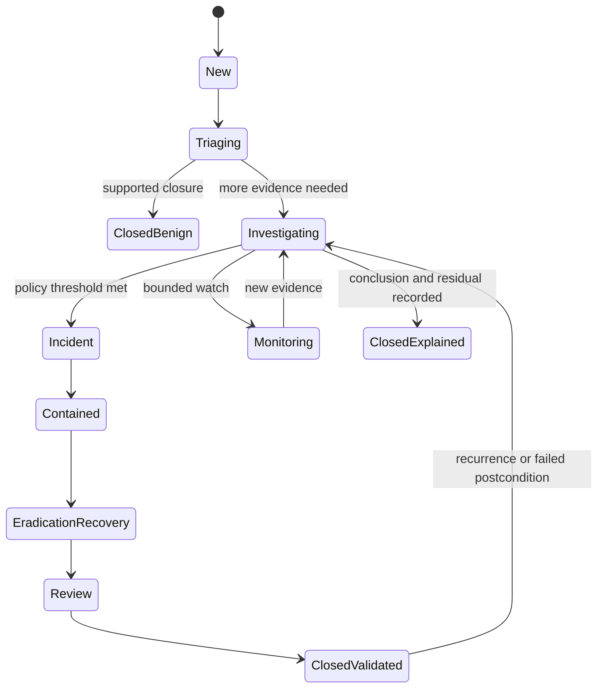

## Incident response lifecycle

Different frameworks use different labels. A practical lifecycle is prepare; detect/analyze; contain; eradicate; recover; and learn. Activities can overlap. Evidence preservation, communication, legal/privacy, safety, and business continuity run throughout.

| Phase | Core work | Decision | Evidence |
|---|---|---|---|
| Prepare | Roles, playbooks, telemetry, backups, access, exercises | Is response ready? | Readiness tests |
| Detect/analyze | Validate, scope, classify, assess impact | Is it an incident and how severe? | Timeline/hypothesis/case |
| Contain | Limit access, movement, harm, or disclosure | Which action balances risk and service? | Authorized action and health |
| Eradicate | Remove malicious artifacts/cause, repair exploited condition | Is trustworthy state restored? | Technical proof |
| Recover | Restore service/data, monitor, communicate | Can normal operation resume? | Service/security postconditions |
| Learn | Review cause, controls, detections, process, communication | What changes and who owns it? | Action register and validation |

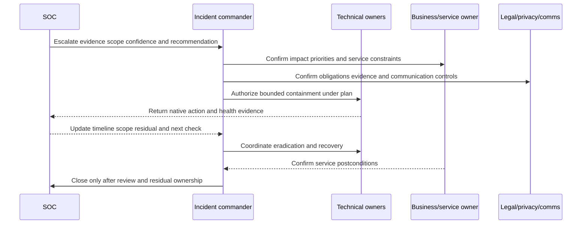

## Containment tradeoffs

| Containment option | Potential benefit | Potential harm | Required checks |
|---|---|---|---|
| Disable identity | Stops account use | Disrupts critical work, attacker may pivot | Identity, sessions, service dependency, recovery |
| Revoke sessions/tokens | Limits current access | Incomplete for other credentials; user impact | Token types, propagation, reauth plan |
| Isolate endpoint | Limits network spread | Loses remote access/evidence or disrupts operation | EDR state, business/safety, evidence plan |
| Block domain/IP/hash | Stops known indicator | Shared infrastructure/false positive/evasion | Specificity, expiry, monitoring, rollback |
| Restrict application | Reduces target access | Service outage or bypass | Dependency, alternate path, canary |
| Segment network/workload | Blocks movement | Broad blast radius | Route/dependency tests and rollback |
| Disable integration/key | Stops automation/abuse | Downstream failure | Ownership, rotation, service restore |
| Increase logging | Improves evidence | Cost, privacy, performance | Purpose, duration, access, retention |
| Monitor only | Preserves observation | Allows harm to continue | Explicit authority and time-bounded rationale |

## Detection engineering lifecycle

Detection engineering turns threat, incident, hunt, exposure, and business requirements into testable analytics. It includes data contracts, logic, content-as-code or controlled content, release, monitoring, tuning, and retirement.

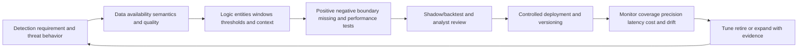

| Detection contract field | Question | Failure if missing |
|---|---|---|
| Threat behavior | What tactic/technique/procedure or misuse is targeted? | Rule without security purpose |
| Scope | Which entities/environments and exclusions? | Unknown coverage |
| Data | Which sources, fields, time, identity, quality? | Brittle logic |
| Logic | Sequence, threshold, baseline, join, suppression? | Unexplainable alert |
| Context | Privilege, service, asset, data, control, threat? | Low-actionability queue |
| Expected output | Alert/case fields, severity, reason, pivots? | Analyst reconstructs rule manually |
| Tests | Positive, negative, boundary, missing, delayed, duplicate, volume? | Production-only discovery of defects |
| Response | Which playbook and authority? | Detection disconnected from action |
| Owner/version | Who maintains and approves changes? | Orphan content |
| Metrics | Coverage, precision, recall proxies, latency, workload, outcome? | Tuning only to volume |
| Retirement | When is rule obsolete/replaced? | Content debt |

## Detection quality concepts

| Concept | Meaning | Caution |
|---|---|---|
| True positive | Detection matched relevant activity under reviewed classification | Classification can be uncertain |
| False positive | Detection matched but target condition not present/relevant | Do not call all benign admin activity "false" without taxonomy |
| True negative | Non-target behavior correctly not alerted | Usually hard to observe completely |
| False negative | Target activity occurred but detection missed | Often discovered through incident/hunt/test |
| Precision | Fraction of alerts reviewed as relevant under definition | Can improve by suppressing hard cases |
| Recall | Fraction of target activity detected | Denominator often unknown in real operations |
| Coverage | Behaviors/entities/data/time the detection can address | Mapping does not prove effectiveness |
| Latency | Time from source event to actionable signal | Device/ingest/process/queue components matter |
| Fidelity | Strength and specificity of evidence | High fidelity can still lack business context |
| Actionability | Analyst can choose a correct next action | Depends on context and authority |

## Threat hunting

Hunting is not scrolling through logs until something looks strange. It begins with a hypothesis, expected evidence, eligible population, data/quality review, queries or analytical steps, stopping criteria, findings, and feedback. Hunts may discover suspicious activity, false assumptions, data gaps, or new detection opportunities.

| Hunt field | Purpose | Example general question |
|---|---|---|
| Intelligence/trigger | Why hunt now? | New technique, incident lesson, exposure path, control gap |
| Hypothesis | What activity may exist? | Could service identities create unusual cross-app access? |
| Population/window | Where and when? | Defined identities/apps/period |
| Required evidence | Which sources/fields/identity/time? | Auth, app, endpoint, network, cloud |
| Method | Queries, pivots, baselines, sequence | Explainable analysis |
| Stop criteria | When is search sufficient or blocked? | Coverage reached, evidence gap, finding escalated |
| Result | Found, not found under scope, inconclusive, data gap | Avoid "no threats exist" |
| Feedback | Detection, control, data, intelligence, process change | Hunt creates durable value |

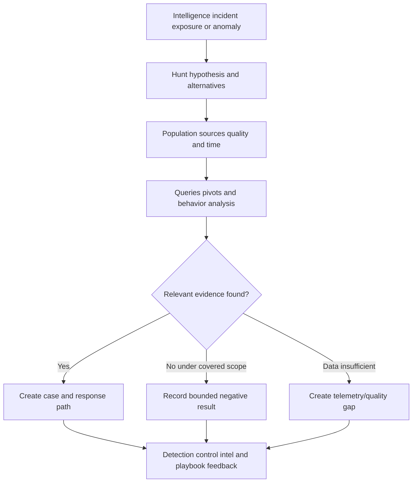

### Plain-English deep-dive 4 - "Nothing found" is not "nothing happened"

Searching a warehouse with cameras covering only half the aisles can truthfully conclude that no target was seen in the covered aisles during the reviewed period. It cannot conclude that no target entered the building. Search quality depends on coverage, camera health, retention, blind spots, and the target behavior.

A hunt result must state population, period, sources, health, method, limitations, and stopping criteria. "No evidence found" means exactly that under stated scope. It can increase confidence when coverage and method are strong, but it never proves universal absence. An inconclusive hunt can still be valuable if it exposes a telemetry or identity gap and assigns repair.

## Threat intelligence lifecycle

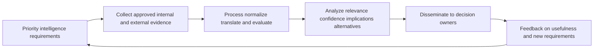

| Intelligence concept | Meaning | Decision use | Caution |
|---|---|---|---|
| Strategic intelligence | Trends, actors, business/geopolitical implications | Strategy and risk | Broad and uncertain |
| Operational intelligence | Campaign intent, timing, infrastructure, targeting | Preparedness and prioritization | Short-lived and attribution-sensitive |
| Tactical intelligence | Techniques and behavior | Detection/hunting/control design | Mapping does not prove local use |
| Technical intelligence | IPs, domains, hashes, certificates, artifacts | Enrichment and blocking | Decays quickly, shared infrastructure |
| PIR | Priority Intelligence Requirement | Focuses collection/analysis | Must connect to decision |
| Source reliability | Trustworthiness/history of source | Weighs evidence | Reliable source can still be wrong this time |
| Information credibility | Plausibility/corroboration of claim | Sets confidence | Popular repetition may share one origin |
| Confidence statement | Analytic judgment and limitations | Supports decision | Not mathematical probability unless defined |

## Intelligence to operations

| Intelligence output | SOC action | Validation |
|---|---|---|
| New technique | Assess data/detection/hunt/control coverage | Detection tests and bounded hunt |
| New infrastructure indicator | Search/enrich/block under policy | Ownership/shared-service/expiry checks |
| Relevant exploited vulnerability | Prioritize exposure, detection, containment readiness | Applicability/path/control evidence |
| Targeting report | Review customer relevance and monitoring | Local evidence and source credibility |
| Adversary procedure | Update playbooks and analyst context | Tabletop or simulation |
| Supplier campaign | Coordinate third-party access and response | Contract, identity, route, communications |

## Shift handoff

Handoff transfers responsibility, not merely information. It should make the next analyst capable of acting without rereading the entire case or repeating harmful steps. High-severity active incidents may require live verbal handoff plus written record and acknowledgement.

| Handoff field | Content | Failure prevented |
|---|---|---|
| Case/incident ID | Stable link and classification | Wrong record |
| Current situation | One-paragraph evidence-bounded state | Long history without status |
| Scope/impact | Entities, services, data, users, regions, confidence | Under/overstatement |
| Timeline | Critical events/actions in UTC | Time confusion |
| Hypotheses | Supported, alternative, disproved, unknown | Confirmation bias reset |
| Actions completed | What, who, authority, result, side effects | Duplicate containment |
| Active work | Owner, due, dependency, progress | Orphan task |
| Next discriminating check | Exact check and expected branches | Aimless investigation |
| Decisions/authority | Who can declare/contain/notify/restore | Unauthorized action |
| Communications | Last update, audience, next due, approved wording | Missed stakeholder update |
| Safety/privacy | Sensitive evidence and handling constraints | Data exposure |
| Acceptance | Receiving analyst acknowledges ownership | Assumed transfer |

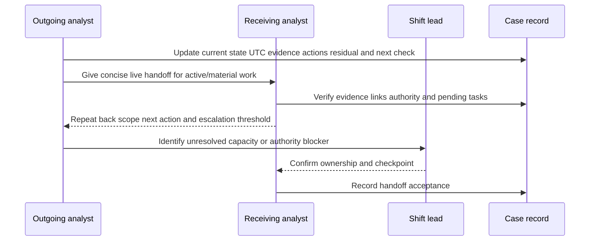

## Case closure and quality review

| Closure requirement | Question | Evidence |
|---|---|---|
| Classification | What was the alert/case/incident under policy? | Supported reason and confidence |
| Scope | Which entities/time are covered and excluded? | Reconciled population |
| Timeline | Are material events/actions ordered and sourced? | UTC timeline |
| Decision | Why close, monitor, or transition? | Authorized record |
| Response | Were containment/eradication/recovery postconditions met? | Native and service evidence |
| Residual | Which unknowns, alternate paths, exceptions remain? | Assigned owner/checkpoint |
| Communication | Were required audiences updated? | Communication log |
| Data handling | Is evidence retained/restricted/deleted correctly? | Policy confirmation |
| Feedback | Which detection, data, control, process, training changes? | Linked backlog |
| Reopen | Which recurrence/new evidence triggers reopen? | Monitor and rule |

## Managed services: MSSP and MDR

Managed services can provide expertise, coverage, scale, and technology operation. They do not eliminate customer accountability. Contracts must distinguish monitoring, triage, investigation, threat hunting, detection engineering, containment recommendations, authorized actions, incident response, forensics, notification, and reporting.

| Service aspect | Questions | Contract evidence |
|---|---|---|
| Scope | Which entities, sources, regions, hours, threats, and exclusions? | Service schedule |
| RACI | Who monitors, decides, acts, communicates, and accepts risk? | Responsibility matrix |
| Access | Which data/actions may provider access and from where? | Security/privacy terms |
| SLA/SLO | Which clocks, severities, pauses, dependencies, remedies? | Definitions and reports |
| Escalation | Which contacts, channels, acknowledgement, retry, management path? | Tested call tree |
| Containment | Recommend-only or pre-authorized actions? | Action matrix and rollback |
| Detection content | Who creates/owns/tunes/exports content? | IP/content terms |
| Evidence | Which raw/normalized/case records are retained and portable? | Retention and exit clauses |
| Integration | Who owns source/action health and troubleshooting? | Operational procedures |
| Subprocessors | Which additional providers/regions handle data? | Third-party terms |
| Transition | How onboarding, knowledge transfer, and exit work? | Transition plan |
| Quality | How false positives, misses, incidents, feedback, and improvements are reviewed? | Governance cadence |

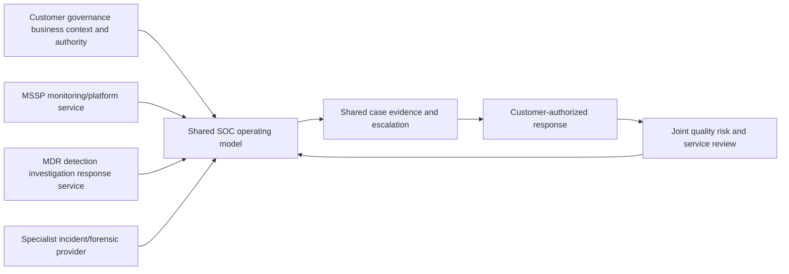

## SOC operating models

| Model | Benefits | Risks | Decision factors |
|---|---|---|---|
| Fully internal | Control, context, integration, knowledge retention | Staffing, 24x7 cost, skill breadth | Scale, risk, talent, geography |
| Fully outsourced | Rapid coverage and specialist scale | Context gaps, dependency, data/control concerns | Contract maturity, oversight capability |
| Co-managed | Combines provider scale with customer context/authority | Boundary confusion and duplicate work | Strong RACI, shared tooling/cases |
| Hybrid internal/MDR | Provider handles monitoring/investigation, internal team owns decisions/response | Handoff and containment latency | Pre-authorized actions and escalation |
| Centralized enterprise SOC | Consistency and shared capabilities | Business-unit context/distance | Federated liaison model |
| Federated SOC | Local context and regulatory fit | Inconsistent tools/process/metrics | Common standards and shared services |
| Follow-the-sun | 24x7 with regional teams | Handoff, data residency, cultural/process variation | Standard records and authority |
| Virtual/distributed | Flexible talent and resilience | Coordination/access/home environment risk | Secure collaboration and evidence controls |

## Choosing an operating model

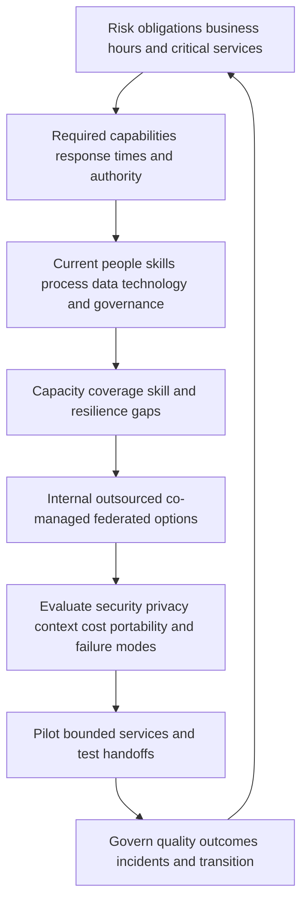

| Decision dimension | Internal question | Provider question |
|---|---|---|
| Business context | Can analysts understand services/impact rapidly? | How will context be supplied and refreshed? |
| 24x7 need | Is overnight volume/risk sufficient? | What exactly occurs out of hours? |
| Skills | Which domains/forensics/detection skills are scarce? | Are named capabilities staffed and evidenced? |
| Authority | Who can isolate, disable, notify, restore? | Which actions are pre-authorized? |
| Data/privacy | Which telemetry/evidence can cross boundaries? | Regions, subprocessors, retention, access? |
| Tooling | Who operates/integrates content and data? | Portability, APIs, ownership, exit? |
| Resilience | What if site/provider/tool is unavailable? | Continuity and fallback tests? |
| Cost | Fixed/variable data, staffing, licensing, response cost? | Overage, retention, ingestion, surge costs? |
| Quality | How are misses, false positives, handoffs, incidents improved? | Joint review and corrective action? |

## Automation and orchestration

Automation should begin with stable, bounded, reversible tasks: enrichment, formatting, deduplication, context lookup, case creation, notification, or evidence collection. Higher-impact actions such as identity disablement, endpoint isolation, blocking, deletion, or policy change need stronger authorization, safeguards, and often human approval.

| Automation level | Example | Control requirement |
|---|---|---|
| Assist | Retrieve entity/source context | Read access, provenance, timeout handling |
| Recommend | Suggest classification or next query | Explanation, confidence, human decision |
| Prepare | Draft case/update/action request | Review and approved recipients |
| Low-impact execute | Create case, tag, route, request evidence | Idempotency, reconciliation, retry safety |
| Reversible containment | Revoke test session or isolate under bounded policy | Approval, target verification, rollback, monitoring |
| High-impact response | Disable critical identity/service or delete artifact | Explicit authority, separation, safety, incident command |

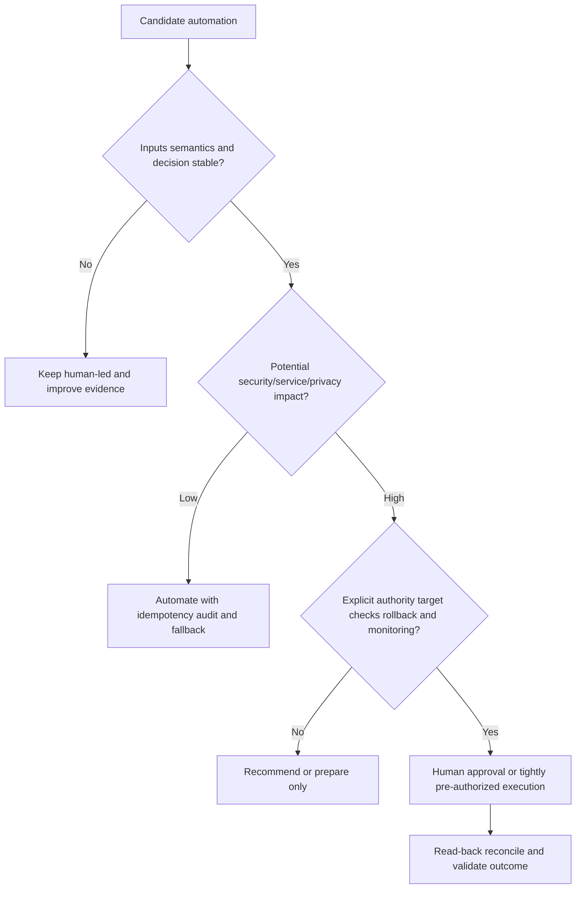

## AI in SOC operations

AI can summarize cited events, translate queries, suggest hypotheses, explain detections, group similar cases, draft communications, or recommend playbook steps. Risks include hallucination, missing evidence, prompt injection, poisoned telemetry, sensitive-data leakage, automation bias, unauthorized tool use, and loss of analyst skill.

| AI use | Potential value | Required guardrail |
|---|---|---|
| Case summary | Faster understanding | Source citations, time/entity checks, human edit |
| Query assistance | Faster syntax and pivots | Approved sources, query review, cost/scope limits |
| Hypothesis suggestions | Broader alternatives | Analyst selects/tests; no conclusion by model |
| Detection drafting | Faster prototypes | Positive/negative tests, code/content review |
| Threat-intel synthesis | Compare reports | Source reliability, copied-origin detection |
| Communication draft | Audience-appropriate updates | Evidence lock, approvals, privacy review |
| Response recommendation | Consistency | Policy grounding, authority and impact check |
| Action execution | Speed | Strong tool authorization, target verification, approval, rollback, audit |

## Metrics: speed, quality, outcome, capacity, and cost

| Metric | Definition requirement | Common misuse |
|---|---|---|
| MTTD | Start event and detection point, eligible cohort, time basis | Comparing unlike telemetry/attacks |
| MTTA | Alert availability to acknowledged ownership | Optimizing click without analysis |
| MTTR | Must define respond/remediate/recover/resolve | One ambiguous acronym |
| Dwell time | Compromise start to detection/containment under evidence | Often unknowable precisely |
| Alert volume | Events per source/rule/time | Treating more/less as quality |
| Precision/relevance | Reviewed positive taxonomy and denominator | Suppression improves number by hiding risk |
| Coverage | Behaviors/entities/data/time with tested detection | ATT&CK mapping equals coverage |
| Case aging | Stable clock and workflow states | Reassignment resets age |
| Escalation quality | Correct routing, evidence completeness, acceptance | Escalation count alone |
| Containment time | Decision/authority/action/read-back components | Penalizing safety approvals |
| Recurrence | Defined same incident/control/cause/path return | Counting unrelated events together |
| Analyst load | Work by complexity/time/cognitive burden | Alert count as equal work |
| Automation safety | Success, duplicate, wrong-target, rollback, reconciliation | Tasks automated as value |
| Cost | Data, platform, people, provider, response, opportunity | Cost reduction without risk/quality guardrail |

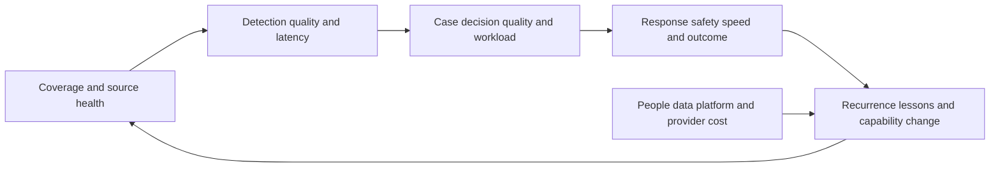

## SOC health model

| Dimension | Indicators | Red condition example |
|---|---|---|
| Source/data | Coverage, freshness, rejects, time, identity, schema | Critical source absent/untrusted |
| Detection | Tests, errors, drift, precision, blind spots, ownership | Material rule silently not evaluating |
| Queue/case | Aging, unassigned, duplicates, state mismatch, handoff | Active severe case without accepted owner |
| Response | Playbook readiness, contacts, access, action/read-back | Containment action cannot be executed/verified |
| People | Coverage, fatigue, skills, supervision, turnover | Unsafe workload or missing critical skill |
| Provider | SLA, escalation, context, evidence, portability | Provider/customer responsibility gap |
| Security/privacy | Access, exports, retention, secrets, audit | Unauthorized evidence exposure |
| Governance | Decisions, exceptions, action aging, lessons | Expired authority or ignored corrective action |
| Technology | Availability, latency, integration, storage, automation | Case/action pipeline unavailable |
| Outcome | Material detection/response/control improvement | Recurrent known failure without action |

## Layered troubleshooting

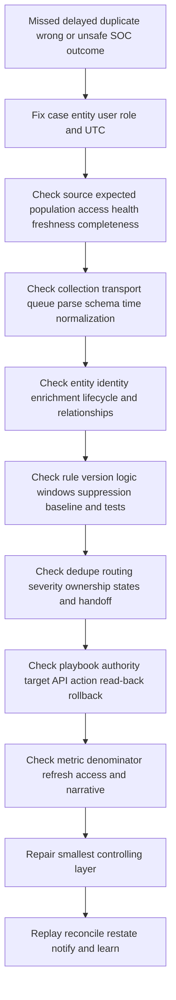

| Symptom | Plausible cause | Discriminating check | Containment |
|---|---|---|---|
| Expected alert missing | Source gap, parse/schema change, rule disabled/error, suppression, time skew | Replay known test from native event through rule version | Mark coverage degraded; add temporary monitoring |
| Duplicate alerts/cases | Retry, multiple rules, entity mismatch, idempotency failure | Compare stable source/detection/case IDs | Pause harmful automation; dedupe carefully |
| Alert arrives late | Device/transport/ingest/processing/queue latency | Timestamp decomposition | Adjust urgency; fix bottleneck |
| Wrong user/device context | Identity merge, stale directory, NAT/proxy, shared device | Trace immutable IDs and effective time | Avoid containment on uncertain target |
| Case not escalated | Routing rule, severity mapping, queue permissions, provider SLA | Trace state/owner transitions and audit | Manual governed escalation |
| Containment timed out | API/network/auth/rate/service/ambiguous outcome | Target-system read-back before retry | Stop blind retry; verify state |
| Shift repeats action | Handoff missing or case state stale | Audit timeline and acceptance | Assign one owner and reconcile |
| Metric improves during outage | Denominator/source drop | Independent expected population | Withdraw success claim |

## Troubleshooting packet for Support/Product/provider

| Field | Content |
|---|---|
| Impact | Security/service/customer decisions affected |
| Scope | Tenant/environment/source/rule/case/action population |
| UTC window | First/last seen and exact reproductions |
| Identifiers | Redacted stable event/entity/rule/case/request IDs |
| Versions | Product, connector, schema, rule, API, content, policy where available |
| Expected | Verified current documented/tenant behavior |
| Observed | Exact outcome and error without interpretation |
| Health | Source, transport, ingestion, processing, case, action states |
| Changes | Deployment, config, permission, schema, volume, provider changes |
| Checks | Results that eliminated local causes |
| Evidence | Minimal redacted logs/traces/screens/exports under policy |
| Containment | Automation paused, manual monitoring, risk communication |
| Ask | One discriminating question or requested next collection |

## Common misconceptions and failure modes

| Misconception/failure | Why it fails | Better rule |
|---|---|---|
| SOC is a SIEM | One technology is not the operating service | Start with mission/services/authority |
| Every alert is an incident | Detection match needs triage/investigation | Preserve evidence states |
| L1 closes, L2 investigates, L3 knows everything | Rigid tiers lose context and overload SMEs | Use escalation plus swarming where useful |
| More alerts mean better coverage | Duplicates/noise can hide blind spots | Measure tested behavior/entity coverage |
| Fewer alerts mean improvement | Source/rule failures can reduce volume | Show health and denominator |
| Threat intel list equals detection | Indicators decay and context matters | Convert requirements into tested analytics |
| Hunt finds nothing, so environment is clean | Coverage and method are bounded | State negative result limits |
| Fast containment is always best | Wrong target/service disruption/evidence loss possible | Balance authority, safety, urgency |
| Automation removes analysts | Novel judgment and governance remain | Automate stable bounded tasks |
| Outsourcing transfers accountability | Customer retains risk and oversight | Contract RACI, evidence, transition |
| MTTR alone measures success | Definitions and outcomes differ | Use multidimensional metrics |
| Training fixes rejected alerts | Data/process/tool defects may control behavior | Diagnose resistance |
| AI summary is evidence | It can omit/invent/misread | Cite sources and require review |
| TSM is incident commander | Wrong customer authority | Enable product use and escalation |

## Security, privacy, legal, and analyst-safety operations

SOC evidence can include personal activity, communications metadata, credentials/tokens, private applications, vulnerabilities, malware, sensitive data, employee/contractor behavior, customer records, and legal material. Apply purpose limitation, minimization, least privilege, separation of duties, encryption, tenant/region boundaries, retention/deletion, immutable audit where appropriate, export control, case sensitivity, legal privilege processes, and secure provider/support handling.

Investigation should avoid unlimited employee surveillance. Define approved purposes, populations, queries, access, review, and escalation. Separate insider-risk, HR, legal, and security authorities. Redact unnecessary personal or sensitive content. Chain of custody and forensic soundness may matter for legal or disciplinary use; analysts should follow customer procedures rather than improvising.

Analyst safety matters. High alert volume, night shifts, repeated exposure to harmful content, and sustained incident stress can degrade judgment and health. Use staffing, rotation, breaks, supervision, psychological support, content controls, workload limits, and no-blame learning. Metrics should not reward skipping evidence or unsafe response.

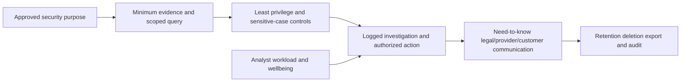

## Complete synthetic NMH SOC case

Everything in this section is explicitly fictional and synthetic. It does not describe a Zscaler tenant, product alert, integration, SOC, provider, customer incident, result, or Arti production experience. Every date and time below is a synthetic scenario date on or before the official source review date. The source snapshot remains 2026-08-24.

At synthetic time 2026-08-22 01:40 UTC, NMH's fictional identity detection reports a service account authenticating to a new application and then attempting an administration action. The alert is medium by fictional tool label. The SOC charter says privileged cross-service activity on medication systems requires expedited triage regardless of vendor label.

### Synthetic triage

The L1 analyst verifies the alert's rule version and two native synthetic event IDs. Identity enrichment initially maps the account to a retired analytics service, while the CMDB maps the target to an active medication-reporting service. The analyst does not disable the account because entity ownership and service dependency conflict. The analyst records a hypothesis of credential misuse and alternatives of approved migration automation, stale identity mapping, or a detection join defect.

| Synthetic evidence | State | Interpretation | Next check |
|---|---|---|---|
| New app authentication | Observed in fictional identity log | Relevant behavior, not malicious proof | Compare change/migration record |
| Admin action attempt | Fictional application event shows denied | Control interrupted one action | Check other routes/actions |
| Retired service mapping | Conflicts with current owner record | Identity context unreliable | Resolve immutable service identity |
| Overnight timing | Observed | Adds context only | Compare automation schedule |
| Threat indicator | None | No technical IOC available | Behavior-led investigation continues |

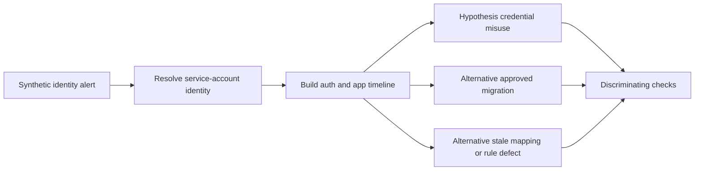

### Synthetic escalation and investigation

L1 escalates to L2 with the conflict, timeline, hypotheses, and next check. L2 finds a fictional approved migration change but its service identity is different. A synthetic secret-management record shows the alerted identity was scheduled for retirement but remained enabled. A second denied administration attempt appears from the same test network location. There is still no evidence of successful privileged action or data access.

The fictional incident commander and identity/service owners authorize revoking the service account's active sessions and disabling only that identity after confirming the medication application does not depend on it. The SOC preserves relevant synthetic evidence and checks for alternate credentials, successful sessions, downstream activity, and similar stale identities. Service health remains normal.

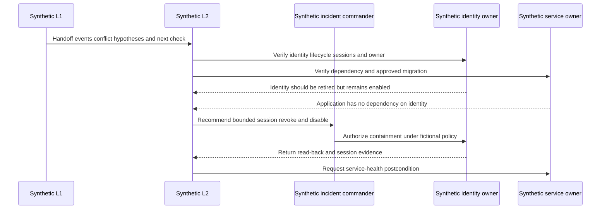

### Synthetic handoff

At synthetic time 2026-08-22 05:55 UTC, the outgoing analyst records: identity disabled and sessions revoked; two denied admin actions; no successful privileged or data action found within covered synthetic sources; source health normal except stale ownership mapping; active tasks are checking alternate identities and correcting lifecycle reconciliation; next update due at 08:00 UTC. The receiving analyst repeats back scope, next checks, and escalation threshold, then accepts the case.

### Synthetic resolution and learning

The fictional investigation concludes the identity was used by an obsolete automation job that was restarted during an uncoordinated test. It is classified under synthetic policy as a security-relevant control/process incident rather than confirmed malicious compromise. The result does not erase the material exposure: a stale privileged identity remained enabled and attempted prohibited actions. Closure requires identity removal, job-owner/process correction, service health, search for equivalent stale identities, lifecycle-source repair, detection retest, and residual review.

```mermaid
flowchart LR
    ROOT[Synthetic obsolete automation and stale identity] --> FIX1[Remove identity and secret]
    ROOT --> FIX2[Repair migration/change procedure]
    ROOT --> FIX3[Repair identity lifecycle reconciliation]
    ROOT --> FIX4[Retest privileged cross-service detection]
    FIX1 --> PROOF[Security and service postconditions]
    FIX2 --> PROOF
    FIX3 --> PROOF
    FIX4 --> PROOF
    PROOF --> LEARN[Hunt similar identities and update playbook]
```

The synthetic executive statement is: "A fictional stale service identity generated denied privileged actions during an uncoordinated automation test. No successful privileged action or data access was found within the stated synthetic coverage, and malicious compromise was not established. The identity and sessions were removed without service impact. Lifecycle reconciliation, change coordination, and equivalent-identity review remain active, with closure dependent on listed postconditions. This is a fictional exercise, not a customer or product result."

## Practical scenarios and decision drills

### Scenario 1: high-severity alert with unhealthy source

Do not close because evidence is missing or declare compromise from a label. Mark the source/detection degraded, preserve last-good and native evidence, assess business/context urgency, create temporary monitoring or containment under authority, repair the pipeline, backfill if supported, and revisit affected cases.

### Scenario 2: analyst wants to isolate a critical server

Confirm entity identity, active threat evidence, business/service consequence, current dependencies, incident authority, evidence-preservation need, alternative containment, monitoring, and rollback. If active destructive behavior makes delay dangerous, follow pre-authorized emergency policy. Document decision, read back target state, and validate service effects.

### Scenario 3: repeated false positives from administrators

Sample cases and classify authorized behavior, detection design, missing context, identity ambiguity, change-process gaps, or genuine risky practice. Add contextual suppression only when its safety is tested. Consider separate visibility for risky but authorized behavior. Do not suppress an entire privileged population to improve precision.

### Scenario 4: provider says case was escalated, customer never received it

Trace provider case ID, timestamps, severity mapping, contact method, retries, acknowledgement, customer queue, permissions, and audit. Restore manual escalation for material cases, reconcile records, test the call tree, and review SLA semantics. Avoid arguing from dashboards alone.

### Scenario 5: hunt finds no activity

Report population, period, sources, quality, hypothesis, method, and limitations. Distinguish bounded negative result from inconclusive data gap. Create detection/data work when useful. Do not say the threat is absent from the enterprise.

### Scenario 6: containment API times out

Do not retry blindly. A timeout means the requester lacks a definite response. Query target state using stable IDs, inspect audit and source-native evidence, determine idempotency, and engage the action owner/provider. Duplicate isolation or disablement can increase impact.

### Scenario 7: shift handoff misses an update deadline

Establish current owner and incident state immediately, send an evidence-bounded late update, identify whether case record, acceptance, workload, alerting, or management supervision failed, and repair the handoff control. Do not fabricate an ETA to compensate.

### Scenario 8: AI summary states data exfiltration

Stop distribution and compare cited events. A DLP match, upload, or blocked transaction may not establish loss. Correct the case and any downstream report, assess sensitive-data disclosure caused by the AI workflow, record the model error, tighten grounding/permissions, and require human approval for impact language.

## Customer and TSM artifact kit

| Artifact | Minimum content | Quality test |
|---|---|---|
| SOC charter | Mission, customers, scope, services, hours, authority, inputs, severity, escalation, privacy, success | One service decision can be explained |
| Service catalog | Service, input/output, hours, owner, dependencies, SLA/SLO, exclusions | Monitoring/response distinctions explicit |
| RACI | Triage, declaration, containment, legal/privacy, communication, recovery, closure, risk | No supplier/TSM authority gap |
| Source contract | Purpose, population, grain, time, identity, semantics, quality, security, recovery | Missing data cannot look safe |
| Detection specification | Behavior, data, logic, context, tests, response, owner, metrics, retirement | Reproducible and actionable |
| Triage guide | Required fields, evidence, thresholds, branches, escalation | Alert label is not decision |
| Case template | Intake, scope, timeline, hypotheses, evidence, decisions, tasks, communications, closure | Work survives handoff |
| Playbook | Trigger, roles, decision branches, actions, safety, comms, recovery, learning | Tabletop-tested |
| Handoff template | Current state, scope, evidence, actions, next checks, authority, update, acceptance | Receiving analyst can act |
| Hunt plan | Trigger, hypothesis, population, sources, method, stop, result, feedback | Negative result bounded |
| Intelligence requirement | Decision, question, owner, priority, sources, cadence, dissemination | Intelligence has customer use |
| Provider schedule | Scope, RACI, data, SLA, escalation, actions, evidence, exit | Outsourcing boundary explicit |
| Metric dictionary | Definition, grain, denominator, time, exclusions, owner, decision | No metric theater |
| Health dashboard | Data, detection, case, response, people, provider, privacy, governance, outcome | Health beside risk/workload |
| Escalation packet | Impact, scope, UTC, IDs, versions, expected/observed, checks, evidence, containment, ask | Minimal and redacted |

## Safe exercises

| Exercise | Task | Deliverable | Pass condition |
|---|---|---|---|
| 1 | Write a SOC mission | One paragraph | Risk, detection, response, learning included |
| 2 | Build a service charter | Charter table | Scope, authority, privacy, success explicit |
| 3 | Design an L1-L3 plus swarm model | Role map | Handoffs and escalation limits visible |
| 4 | Classify event/signal/alert/case/incident | Ten-item quiz | No alert-equals-incident errors |
| 5 | Triage a synthetic alert | Decision record | Identity, time, detection, context, evidence |
| 6 | Write competing hypotheses | Ledger | Alternatives and discriminating checks |
| 7 | Build a UTC timeline | Timeline table | Event/ingest/action time separated |
| 8 | Draft containment options | Tradeoff matrix | Authority, safety, evidence, rollback |
| 9 | Create a detection spec | Content document | Data contract and tests included |
| 10 | Write positive/negative detection tests | Test suite | Missing/delayed/duplicate cases included |
| 11 | Design a hunt | Hunt plan | Population, stop, bounded result included |
| 12 | Create a PIR | Intelligence requirement | Decision and feedback owner clear |
| 13 | Build a case template | Case artifact | Hypotheses, decisions, residuals preserved |
| 14 | Conduct a handoff role-play | Written/live handoff | Receiving analyst repeats and accepts |
| 15 | Design an IR tabletop | Scenario and injects | Business/legal/privacy/provider roles included |
| 16 | Compare internal/MSSP/MDR models | Decision matrix | Scope/RACI/data/exit covered |
| 17 | Review an SLA | Contract notes | Start/stop/pause/acknowledge/response defined |
| 18 | Troubleshoot a missing alert | Layered trace | Native event through detection checked |
| 19 | Troubleshoot failed containment | Action audit | Read-back before retry |
| 20 | Build metric contracts | Five definitions | Grain/denominator/time/decision stated |
| 21 | Create a SOC health view | Dimension table | Source health shown beside operations |
| 22 | Review case privacy | Access/retention matrix | Purpose and minimum data enforced |
| 23 | Red-team an AI summary | Citation ledger | Unsupported impact statements removed |
| 24 | Write a customer incident update | Seven-sentence brief | Evidence, impact, action, owner, checkpoint, caveat |
| 25 | Create a support/provider packet | Redacted artifact | One discriminating ask |
| 26 | Run a post-incident review | Action register | System causes and validation owners, not blame |

## TSM discovery and operating questions

1. Which business risks, obligations, services, and hours define the SOC mission and scope?
2. Which monitoring, triage, investigation, response, hunting, intelligence, engineering, and reporting services are included or excluded?
3. Who owns alert closure, incident declaration, containment, forensics, legal/privacy, communications, recovery, and risk acceptance?
4. Which source/data contracts and context are required, and how are blind spots and source degradation represented?
5. How do L1, L2, L3, domain specialists, swarms, shifts, and providers transfer work without losing evidence?
6. How are detections specified, tested, released, monitored, tuned, challenged, and retired?
7. How do hunts and intelligence requirements feed cases, detections, controls, exposure, and playbooks?
8. Which actions are assistive, recommend-only, human-approved, pre-authorized, reversible, or prohibited?
9. Which speed, quality, outcome, capacity, cost, privacy, and provider metrics guide decisions without unsafe incentives?
10. Which current product integrations, fields, actions, service levels, and entitlements require verification rather than assumption?

## Official Source Anchors

Research/source snapshot and source review date: **2026-08-24**.

This Part teaches general SOC practice. The Zscaler source supports only adjacent public portfolio positioning; it does not define the generic L1-L3 model, case states, detection lifecycle, hunt process, IR lifecycle, handoff, service contracts, metrics, or operating models in this chapter. Current official product documentation, licensed-tenant evidence, customer policy, and provider contracts govern real operations.

| Source | URL | Used for | Boundary |
|---|---|---|---|
| Zscaler Agentic Security Operations | https://www.zscaler.com/products-and-solutions/security-operations | Adjacent public proactive/reactive security-operations portfolio context for later Parts | No exact SOC workflow, AI agent, detection, case, action, integration, MDR scope, autonomy, field, SLA, entitlement, or outcome inferred |
| NIST Cybersecurity Framework 2.0 | https://www.nist.gov/cyberframework | Govern, Identify, Protect, Detect, Respond, Recover outcome framing | Voluntary; customer profiles/implementation vary |
| NIST SP 800-61 Rev. 3 | https://csrc.nist.gov/pubs/sp/800/61/r3/final | Current incident-response recommendations and CSF 2.0 community-profile context | Organizations tailor procedures to risks, requirements, and operations |
| NIST SP 800-53 Rev. 5 | https://csrc.nist.gov/pubs/sp/800/53/r5/upd1/final | Audit, access, incident, assessment, configuration, contingency, privacy, supply-chain control context | Requires customer selection, tailoring, implementation, and assessment |
| MITRE ATT&CK | https://attack.mitre.org/ | Common tactic/technique knowledge for detection, hunting, and intelligence | Mapping is not proof of coverage, occurrence, or effectiveness |
| CISA Cybersecurity resources | https://www.cisa.gov/topics/cyber-threats-and-advisories | General public threat/advisory context | Advisories require customer applicability review |

## Likely Interview Questions

### Q1. What is a SOC, and what is its mission?

**Model answer:** A SOC is a coordinated security-operations service made of people, process, technology, data, and governance; it is not merely a room or SIEM. Its mission is to reduce material incident likelihood and impact by maintaining relevant visibility, detecting suspicious behavior, triaging and investigating evidence, coordinating authorized containment through recovery, communicating accurately, and improving controls continuously. Scope, service hours, authority, privacy, dependencies, and success measures must be explicit.

### Q2. How do L1, L2, and L3 roles differ, and when would you avoid rigid tiers?

**Model answer:** L1 usually performs rapid validation, enrichment, documentation, closure, and escalation for known playbooks; L2 conducts deeper multi-source investigation and response recommendations; L3 handles complex/novel cases, specialist analysis, and capability improvement. Titles vary and seniority does not grant risk authority. Rigid tiers can create context-loss queues, so I would swarm early for novel, active, or high-impact cases while retaining clear ownership, records, quality, and career development.

### Q3. How should an analyst triage an alert?

**Model answer:** Reproduce the alert's source, rule/version, native IDs, and UTC; resolve exact entities and lifecycle; understand what logic matched; check source/data health; build a short timeline; add privilege, business criticality, exposure, control, and threat context; distinguish observations from hypotheses; assess impact, confidence, active status, and urgency; then close, monitor, enrich, escalate, declare, or recommend containment under customer policy. Vendor severity alone is not the decision.

### Q4. What is detection engineering?

**Model answer:** It is the lifecycle for turning threat, incident, hunt, exposure, and business requirements into reliable analytics. Define targeted behavior, scope, data/semantic/time contracts, logic, entities/windows/context, expected output, playbook, owner, and metrics. Test positive, negative, boundary, missing, delayed, duplicate, and volume cases; shadow/backtest; deploy with versioning; monitor coverage, precision, latency, cost, drift, and analyst outcomes; then tune or retire. ATT&CK mapping alone does not prove effectiveness.

### Q5. How do hunting, threat intelligence, and incident response connect?

**Model answer:** Intelligence requirements collect and assess threat evidence for decisions. That evidence, incidents, exposures, or anomalies can form bounded hunt hypotheses. Hunts search defined populations and may find cases, bounded negative results, or data gaps. Findings feed detections, controls, playbooks, intelligence requirements, and exposure work. Incident response handles preparation, detection/analysis, containment, eradication, recovery, and learning under authority. Intelligence is not occurrence proof, and no-find hunts do not prove absence.

### Q6. What makes case management and shift handoff effective?

**Model answer:** A case preserves stable identity, source intake, scope, UTC timeline, observations, competing hypotheses, evidence/provenance, decisions/authority, tasks/dependencies, communications, response, closure postconditions, residuals, and learning. A handoff gives current situation, scope/impact, actions/results, active work, next discriminating check, escalation threshold, authority, update deadline, and safety/privacy constraints. The receiving analyst verifies links, repeats back, and explicitly accepts ownership.

### Q7. How would you choose between internal, MSSP, MDR, and co-managed SOC models?

**Model answer:** Start with business risk, obligations, critical services, service hours, required capabilities, response times, and authority. Assess internal skills, capacity, technology, context, resilience, privacy, and cost gaps. Compare provider scope, RACI, data/regions/subprocessors, SLA definitions, escalation, containment authority, detection/content ownership, evidence portability, integration responsibility, surge/IR coverage, quality governance, and exit. Pilot handoffs and actions. Outsourcing capability never outsources customer accountability.

### Q8. How does Arti's background support SOC work while preserving honesty?

**Model answer:** Microsoft 365, OneDrive, and SharePoint escalation work provides adjacent production experience in high-severity intake, exact identity/permission/service scope, layered evidence, customer impact, containment discussions, ownership, timelines, RCA, updates, and validation. Networking traces support telemetry-path diagnosis. SQL and Power BI support event/case models, windows, joins, trends, and quality. Mentoring and reviewed AI assistance support enablement. NMH is synthetic; production SOC, detection engineering, hunting, IR command, and managed-response operation remain learning boundaries.

## 30-Second Memory Hooks

| Concept | Memory hook |
|---|---|
| SOC | People, process, technology, data, governance, outcomes |
| Mission | See, detect, decide, respond, recover, learn |
| Event to incident | Observation, signal, alert, case, confirmed policy threshold |
| L1 | Validate, enrich, document, route known work |
| L2 | Investigate across sources and scope |
| L3 | Complex/novel expertise plus capability improvement |
| Swarm | Bring right experts early for material complexity |
| Triage | Identity, time, meaning, health, context, impact, decision |
| Investigation | Competing hypotheses and discriminating checks |
| Case | Durable evidence, decisions, tasks, communications, residual |
| Detection engineering | Requirement, data, logic, tests, deploy, monitor, tune |
| Hunt | Hypothesis, population, method, bounded result, feedback |
| Intelligence | Decision requirement, source quality, relevance, implication |
| IR | Prepare, analyze, contain, eradicate, recover, learn |
| Handoff | State, evidence, action, next check, authority, acceptance |
| Managed service | Outsource capability, never accountability |
| Automation | Stable, bounded, authorized, reversible, audited |
| Metrics | Speed plus quality plus outcome plus capacity plus cost |
| TSM | Enable documented capability and evidence, not incident command |
| Arti bridge | Escalation rigor transfers; production SOC claims do not |

## Completion Checklist

- [ ] I separate official product fact, general security practice, scenario assumption, customer fact, and unknown.
- [ ] I define security operations, SOC, event, log, telemetry, signal, alert, finding, case, incident, triage, investigation, hypothesis, indicator, IOC, IOA, tactic, technique, procedure, detection, detection engineering, hunting, intelligence, IR, containment, eradication, recovery, playbook, runbook, escalation, SLA, SLO, KPI, MSSP, MDR, and handoff.
- [ ] I explain a SOC as a service system rather than a room or SIEM.
- [ ] I create a mission and charter with customers, outcomes, coverage, services, authority, inputs, severity, escalation, privacy, service levels, dependencies, and success.
- [ ] I explain people, process, technology, data, governance, and measurement as one chain.
- [ ] I distinguish L1, L2, L3, detection, hunting, intelligence, IR, command, management, platform, business, legal/privacy, provider, and TSM roles.
- [ ] I compare tiered, swarm, pod, aligned, follow-the-sun, on-call, and hybrid delivery.
- [ ] I triage using source/rule, native IDs, UTC, entity, detection meaning, health, context, behavior, impact, confidence, urgency, and decision.
- [ ] I combine technical severity with customer impact, scope, privilege, active state, threat, controls, time, and evidence quality.
- [ ] I investigate with observations, competing hypotheses, predictions, discriminating checks, bounded pivots, and visible uncertainty.
- [ ] I preserve case identity, scope, timeline, evidence, decisions, tasks, communications, closure, residuals, and learning.
- [ ] I explain prepare, detect/analyze, contain, eradicate, recover, and learn with cross-cutting evidence/communication/governance.
- [ ] I compare containment benefit, business harm, authority, evidence preservation, target verification, rollback, and postconditions.
- [ ] I build detection requirements, data contracts, logic, tests, deployment, monitoring, tuning, ownership, and retirement.
- [ ] I distinguish true/false positives/negatives, precision, recall, coverage, latency, fidelity, and actionability with limitations.
- [ ] I design hunts with trigger, hypothesis, population, evidence, method, stop, bounded result, and feedback.
- [ ] I operate intelligence requirements, collection, processing, analysis, dissemination, feedback, reliability, credibility, and confidence.
- [ ] I execute handoffs with current state, scope, timeline, hypotheses, actions, active work, next check, authority, communication, safety, and acceptance.
- [ ] I close cases only with classification, scope, timeline, decision, response/recovery proof, residual, communication, data handling, feedback, and reopen triggers.
- [ ] I compare internal, outsourced, co-managed, hybrid, centralized, federated, follow-the-sun, and virtual SOC models.
- [ ] I define provider scope, RACI, access, SLA/SLO, escalation, containment, content, evidence, integration, subprocessors, transition, and quality.
- [ ] I automate stable bounded work with idempotency, target verification, authority, read-back, rollback, audit, and human control for high impact.
- [ ] I use metrics with explicit grains, denominators, time bases, exclusions, decisions, and guardrails.
- [ ] I troubleshoot source, transport, parse/schema/time, entity, detection, case, action, report, and narrative layers.
- [ ] I protect SOC evidence with purpose, minimization, least privilege, privacy/legal process, retention, export control, audit, and analyst-safety practices.
- [ ] I use AI only for approved grounded assistance with source citations, human review, and no unsupported impact or autonomous high-impact action.
- [ ] I can explain every NMH alert/date/decision/result as explicitly fictional and synthetic.
- [ ] I can build all fifteen artifacts and complete all twenty-six exercises.
- [ ] I connect M365/networking/SQL-Power BI/escalation/mentoring/AI strengths without unsupported production Zscaler, SOC, SIEM, SOAR, XDR, detection, hunting, IR, or MDR claims.
- [ ] I retain the source review date exactly as 2026-08-24.
- [ ] I can answer all eight interview questions with neutral evidence-bounded language.

[Part 92 - SIEM, SOAR, XDR, EDR, NDR, UEBA, and Security Data Fabric](Part-92-siem-soar-xdr-edr-ndr.md)