# Part 92 - SIEM, SOAR, XDR, EDR, NDR, UEBA, and Security Data Fabric

> **Audience:** Candidates preparing for a Zscaler Security Operations Technical Success Manager role after enterprise Support Escalation Engineering.

> **Purpose:** Explain SIEM, SOAR, XDR, EDR, NDR, UEBA, and security data fabric from zero, compare their purposes and overlaps, show how they integrate, expose their limitations, and describe how Zscaler can complement an existing security stack without inventing product behavior.

> **Scope and honesty:** Northstar Meridian Holdings, abbreviated NMH, is an explicitly fictional and synthetic customer used only for study. Every NMH source, tool, alert, identity, asset, integration, date, metric, decision, action, and result is invented. Your factual background is Microsoft 365, OneDrive, and SharePoint support; networking and trace analysis; SQL and Power BI; enterprise escalations; mentoring; and responsible AI exploration. Production Zscaler, SOC, SIEM, SOAR, XDR, EDR, NDR, UEBA, security-data-fabric, detection-engineering, threat-hunting, and incident-response ownership remain learning boundaries.

> **Currency caveat:** Product names, architectures, connectors, schemas, interfaces, fields, detections, actions, integrations, packaging, limits, and entitlements change. The controlled official-source snapshot and source review date for this Part is exactly **2026-08-24**. Current official documentation, licensed-tenant evidence, customer contracts and policies, product specialists, Support, source-native evidence, and tested runbooks govern production decisions.

> **Section goal:** Build a beginner-to-interview-ready map of the modern SecOps toolchain: identify the job each category is meant to perform, reason about event-centric and entity-centric data, design defensible integration boundaries, troubleshoot the complete signal-to-action path, and explain Zscaler complementarity using neutral, evidence-bounded language.

This Part is primarily **general security practice**. The reviewed public Zscaler Agentic Security Operations and Data Fabric for Security pages support only bounded portfolio positioning: Zscaler describes combining first-party telemetry with third-party signals, contextualizing security data, complementing existing SIEM, EDR, IAM, and ticketing tools, and connecting insight to risk-appropriate controls. Nothing in this Part asserts a hidden Zscaler architecture, specific connector, UI, field, entitlement, detection, response action, latency, accuracy, replacement outcome, or customer result.

Every claim belongs to one of five evidence classes. **Official product fact** means a dated statement supported by a reviewed public source. **General security practice** means a reusable industry model, not a product description. **Scenario assumption** means an explicitly fictional and synthetic NMH teaching fact. **Customer fact** requires current customer-authoritative evidence. **Unknown** means the evidence does not yet support a conclusion.

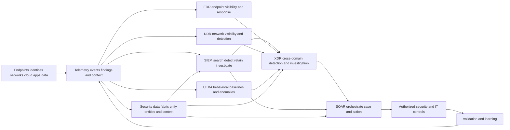

| Operating principle | Plain meaning | Practical consequence | Failure prevented |
|---|---|---|---|
| Start with jobs | Define the decision or action before selecting a category | Map use cases to required evidence and authority | Tool-name architecture |
| Preserve source truth | Keep native identifiers, time, lineage, and raw evidence | Analysts can reproduce conclusions | Context without proof |
| Separate event and entity | Activity happened; an entity has continuing state | Use different grains and retention models | Invalid joins and counts |
| Expect overlap | Categories share collection, analytics, cases, and actions | Define system-of-record and handoff rules | Duplicate alerts and actions |
| Treat correlation as a claim | A relationship needs identity, time, semantics, and confidence | Keep alternatives and uncertainty visible | One-person-by-similar-name error |
| Govern response | Consequential action needs authority, safeguards, and validation | Add approval, target check, rollback, and audit | Fast harmful containment |
| Measure the pipeline | Health includes collection through outcome | Track loss, delay, parse, identity, rule, case, action, and feedback | Green connector, broken outcome |
| Complement deliberately | Integration value comes from a defined gap and contract | Retain tools that remain authoritative | Replacement assumptions |

## JD Mapping

| JD signal | Capability developed | Customer or TSM artifact | Honest boundary |
|---|---|---|---|
| Develop SecOps expertise | Explain category purposes, architecture, mechanics, overlaps, and limits | Tool-purpose and responsibility map | No production platform operation claim |
| Trusted technical advisor | Translate business risks into data, detection, investigation, and response needs | Capability-gap decision record | Customer owns architecture and risk |
| Drive adoption and value | Connect integrated signals to repeated analyst decisions | Use-case acceptance scorecard | No guaranteed detection or savings |
| Troubleshoot complex systems | Isolate source, transport, parse, schema, time, entity, analytic, case, and action failures | Layered integration runbook | No unsupported root cause |
| Use analytics | Define grains, joins, baselines, denominators, latency, quality, and trends | SQL and Power BI-style semantic model | No product-internal schema claim |
| Coordinate stakeholders | Align SOC, endpoint, network, IAM, cloud, data, privacy, ITSM, vendors, and business owners | RACI and escalation map | TSM facilitates rather than commands |
| Communicate proactively | State observed evidence, impact, uncertainty, owner, next check, and decision | Technical and executive updates | No assurance from tool status alone |
| Partner with Support and Product | Package redacted reproducible integration evidence | Minimal escalation packet | No roadmap, defect, or fix promise |
| Apply AI responsibly | Bound assistance to grounded evidence and governed actions | AI use and validation plan | No autonomous high-impact response claim |

## Candidate honesty note

You can say: "My production experience is enterprise support rather than operating a SOC toolchain. I have investigated identity, endpoint, network, browser, permission, sync, and service dependencies; used traces and analytics; led escalations; and communicated evidence under pressure. I have studied SIEM, SOAR, XDR, EDR, NDR, UEBA, and security-data-fabric patterns and practiced only through fictional artifacts. In a customer environment I would validate the licensed products, schemas, authority, and measured behavior."

Neutral syntax is important. Say what the evidence establishes, identify the transfer, label study or synthetic practice, and state what production verification would follow. Do not convert adjacent experience into an affirmative security-product claim.

| Factual background | Transferable capability | Neutral evidence statement | Unsupported statement to avoid |
|---|---|---|---|
| M365, OneDrive, and SharePoint support | Resolve exact tenant, user, device, permission, sync, network, and service state | "I diagnose multi-layer enterprise service behavior." | "I investigated production XDR incidents." |
| Packet, browser, and process traces | Test collection, timing, routing, TLS, proxy, and application hypotheses | "I can troubleshoot telemetry paths methodically." | "I operated an NDR platform." |
| SQL and Power BI | Model event/entity grains, joins, quality, cohorts, and trends | "I can build transparent operational analytics." | "I queried a production SIEM." |
| Critical escalations | Establish impact, workstreams, evidence, ownership, updates, and validation | "I coordinate evidence-led technical recovery." | "I commanded cyber containment." |
| Mentoring and training | Explain methods, review artifacts, and support teach-back | "I can enable repeatable troubleshooting." | "I managed SOC analysts." |
| Responsible AI work | Ground summaries and drafts, evaluate output, retain human review | "I use AI as bounded assistance." | "I deployed autonomous security agents." |
| Fictional synthetic NMH exercises | Demonstrate architecture and decision reasoning | "This artifact shows my learning method." | "This is a customer deployment or result." |

## Beginner vocabulary and memory hooks

| Term | Meaning from zero | Why it matters | Analogy or memory hook |
|---|---|---|---|
| Event | One recorded observation at a time | Basic activity grain | One line in a ship log |
| Log | Ordered collection of events from a source | Supports search and reconstruction | Bound logbook |
| Telemetry | Data describing activity, state, or performance | Broader than alerts | Instrument readings |
| Signal | Observation or pattern considered security relevant | Candidate input for assessment | A smoke smell |
| Alert | Notification that detection logic matched | Starts triage, not proof | Alarm bell |
| Finding | Documented condition needing assessment | May describe posture, exposure, or behavior | Inspector note |
| Entity | Continuing object such as user, device, app, IP, or asset | Connects activity across sources | Person or place in a case |
| Context | Facts that change interpretation | Adds criticality, ownership, privilege, exposure, and controls | Address and role beside a name |
| Correlation | Reasoned association among observations | Can turn fragments into a story | Matching receipts to a journey |
| Enrichment | Adding relevant information to an observation | Reduces analyst pivoting | Adding a customer record to an order |
| Detection | Logic or process identifying activity worth assessment | Creates signals from evidence | Smoke detector logic |
| SIEM | Security Information and Event Management | Centralizes event search, analytics, alerting, and often retention/case support | Security library and alarm desk |
| SOAR | Security Orchestration, Automation, and Response | Coordinates tools, workflows, cases, and governed actions | Air-traffic controller with runbooks |
| EDR | Endpoint Detection and Response | Observes and responds on laptops, desktops, and servers | Security camera and controls inside rooms |
| NDR | Network Detection and Response | Analyzes network communications and behavior | Traffic control watching roads |
| XDR | Extended Detection and Response | Correlates multiple security domains for detection and investigation | Detective team joining several departments |
| UEBA | User and Entity Behavior Analytics | Models behavior and identifies notable deviations | Bank noticing unusual spending behavior |
| Security data fabric | Architecture/capability for connecting, harmonizing, resolving, enriching, and operationalizing security and business data | Supplies reusable context across applications | City data exchange joining registries |
| Data lake | Scalable storage for large raw or processed data | Can retain flexible data for many uses | Warehouse of labeled crates |
| Data warehouse | Structured analytical store optimized for governed queries | Supports consistent reporting | Organized distribution center |
| Collector | Component or service that obtains source data | First technical intake point | Courier pickup |
| Parser | Logic that turns source representation into fields | Makes data usable | Translator reading a form |
| Schema | Defined shape and meaning of data | Supports consistent queries and joins | Form template |
| Normalization | Mapping different representations to common meanings | Enables cross-source comparison | Converting units |
| Entity resolution | Deciding which records refer to the same real object | Enables safe correlation | Matching aliases to one person |
| Baseline | Expected behavior under stated scope and time | Supports anomaly reasoning | Normal temperature range |
| Anomaly | Significant deviation from a baseline or peers | Investigation clue, not malicious proof | Unusual temperature reading |
| Playbook | Governed workflow with decision branches | Guides coordinated response | Emergency field guide |
| Runbook | Detailed repeatable task instructions | Reduces execution ambiguity | Maintenance checklist |
| IOC | Indicator of Compromise | Observable associated with malicious activity | Known stolen license plate |
| IOA | Indicator of Attack | Behavior suggestive of attack activity | Suspicious driving pattern |
| Fidelity | Degree to which a signal reliably represents the intended behavior | Shapes analyst trust and effort | Sharpness of a photograph |
| Provenance | Origin and transformation history of data | Makes claims reproducible | Chain of custody |
| System of record | Authoritative place for a defined object or decision | Prevents conflicting state | Official registry |
| Idempotency | Repeating an action produces no additional unintended effect | Protects retries | Pressing an already-locked lock button |
| Dwell time | Time harmful activity remains before detection or removal | Outcome indicator with measurement caveats | Time a leak remains unnoticed |

### Plain-English deep-dive 1 - Categories are jobs, not mutually exclusive boxes

Imagine a large hospital. The medical record stores longitudinal patient facts. The monitoring system watches live vital signs. Imaging reveals internal conditions. The triage desk assigns urgency. The workflow system routes tests, approvals, and treatment. Analytics compare populations and trends. These systems overlap because the same patient and episode appear in several places, but they are not interchangeable. A monitor can store readings, a record can raise reminders, and a workflow can show status; those overlaps do not erase their primary jobs.

SecOps categories work the same way. A SIEM may search, detect, manage cases, and call actions. An EDR may correlate endpoint behavior, create incidents, isolate devices, and retain endpoint telemetry. An XDR may include SIEM-like search and SOAR-like automation. A SOAR may enrich alerts and maintain case timelines. A security data fabric may drive reports and workflows. Product boundaries vary by vendor and release, so category labels are starting questions rather than architectural proof.

The disciplined approach asks five questions. What decision must be made? Which evidence is required? Which system is authoritative for each entity and state? Which system executes an action? How is the outcome verified and learned from? If a customer already has overlapping capabilities, the goal is not to force one universal console. It is to reduce duplicate work, preserve source evidence, clarify ownership, and make the end-to-end outcome reliable.

## The work chain these categories support

Security operations has several related data shapes. Events describe activity. Entity records describe continuing state. Findings describe assessed conditions. Alerts describe rule matches. Cases organize work. Incidents represent confirmed or declared adverse situations under customer policy. Actions change systems. Decisions record why authorized people chose a branch. Metrics summarize a clearly defined population and period.

| Work object | Typical grain | Primary questions | Common systems | Critical integrity check |
|---|---|---|---|---|
| Event | One source observation | What happened, where, when, to which entity? | SIEM, EDR, NDR, source platform | Native ID, UTC, source, parse, retention |
| Entity | One version of user/device/app/asset | What is it, who owns it, what state applies? | Data fabric, CMDB, IAM, EDR, XDR | Identity, lifecycle, authority, effective time |
| Finding | One assessed condition on scoped object | What condition exists and why does it matter? | Exposure tools, XDR, SIEM, case platform | Source evidence, scope, state, confidence |
| Alert | One detection output | Which logic matched which evidence? | SIEM, EDR, NDR, XDR | Rule/version, input health, duplication |
| Threat story or incident candidate | Related observations and entities | What connected behavior may be occurring? | XDR, SIEM, Agentic SOC-style workflow | Correlation rationale and alternatives |
| Case | One work container | Who owns what evidence, task, decision, and update? | SOAR, SIEM, XDR, ITSM | Stable ID, timeline, handoff, closure |
| Incident | Customer-declared adverse event | What impact, scope, response, and governance apply? | IR/case platform, SIEM, ITSM | Declaration authority and communications |
| Action | One requested/executed change | What target, authority, result, rollback, and postcondition? | SOAR, EDR, IAM, network, ZT controls | Target binding and read-back |
| Metric | One defined measure for cohort and period | Is quality, speed, coverage, outcome, or cost changing? | SIEM, warehouse, fabric, BI | Grain, denominator, exclusions, comparability |

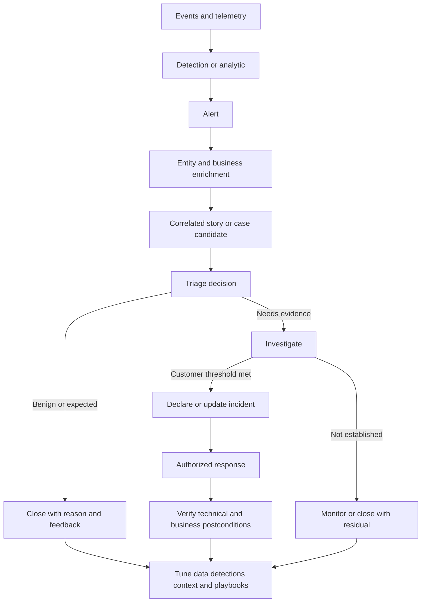

## SIEM from first principles

SIEM means Security Information and Event Management. The category grew from centralized log collection and security-event analysis. A modern SIEM commonly ingests events from many sources, parses and normalizes fields, indexes or otherwise makes data searchable, runs rules or analytics, produces alerts, supports investigation, and may provide dashboards, cases, threat-intelligence matching, orchestration, retention controls, and reporting. Those are common capabilities, not guaranteed features of every product or license.

The SIEM's strongest general purpose is broad event visibility across heterogeneous systems. It gives analysts a place to ask cross-source questions over time: which identities authenticated, which devices communicated, which cloud actions occurred, which policy decisions matched, and what happened before or after an alert? It can also centralize detection logic that needs multiple event sources. A SIEM is not automatically the authoritative inventory, identity directory, packet store, endpoint forensic system, ticketing system, or incident command process.

| SIEM layer | Job | Evidence of health | Frequent limitation |
|---|---|---|---|
| Source onboarding | Define scope, method, credentials, and ownership | Expected sources and populations report | "Connected" hides excluded populations |
| Collection | Receive or retrieve records | Source-to-receipt counts and latency | Rate limits, outages, cursor gaps |
| Parsing | Extract fields from source representation | Known samples parse with versioned rules | Format drift creates nulls/wrong fields |
| Normalization | Map source meanings to common schema | Semantic tests preserve native meaning | Lowest-common-denominator loss |
| Storage/index | Retain and make data queryable | Search completeness and retention tests | Cost, tiering, delayed availability |
| Analytics | Match behavior or conditions | Positive, negative, boundary, delayed tests | Missing context and rule drift |
| Alerting | Notify with evidence and priority | Alert links reproduce input and logic | Duplicate/noisy outputs |
| Investigation | Search, pivot, timeline, compare | Analysts can reconstruct scope | Joins by weak identifiers |
| Case/report | Organize work and communicate | Stable ownership and denominator integrity | Conflicting system-of-record state |
| Integration | Send/receive context and actions | Contract and end-to-end acceptance test | One-way success assumption |

```mermaid
flowchart LR
    SRC[Source-native records] --> COLLECT[Collect with cursor and scope]
    COLLECT --> PARSE[Parse versioned format]
    PARSE --> NORM[Normalize while retaining native evidence]
    NORM --> STORE[Store index and retain]
    STORE --> ANALYTIC[Rules analytics and search]
    ANALYTIC --> ALERT[Alert with evidence]
    ALERT --> CASE[Case investigation and workflow]
    CASE --> ACTION[Authorized external action]
    ACTION --> READBACK[Read back result]
    READBACK --> QUALITY[Quality and learning]
    QUALITY --> COLLECT
```

### SIEM tradeoffs and operating decisions

Broad collection creates visibility but also cost, privacy, complexity, and false confidence. Sending every verbose record forever can make search expensive while important semantic defects remain unnoticed. Filtering too aggressively can remove the evidence needed for reconstruction. Normalizing everything into one schema simplifies common queries but can discard source-specific meaning. Retaining only raw data preserves detail but raises the cost of every investigation. Mature design preserves a raw or source-faithful path where justified, creates tested normalized representations for repeatable use cases, and documents retention by purpose and obligation.

Detection logic also has a cost-quality frontier. A simple rule may be transparent and fast but miss context. A complex statistical or machine-learning method may find subtle behavior but require stable inputs, validation, explanation, drift monitoring, and analyst feedback. A correlation that joins five sources can appear sophisticated while silently failing whenever one source is late. Use-case acceptance must include missing, delayed, duplicated, reordered, and malformed data, not only a happy-path alert.

## SOAR from first principles

SOAR means Security Orchestration, Automation, and Response. **Orchestration** coordinates multiple systems and people. **Automation** executes repeatable steps with limited manual effort. **Response** applies a governed decision to contain, remediate, communicate, or collect evidence. A SOAR platform may also provide case management, playbook design, integration connectors, approvals, tasks, evidence handling, timers, notifications, and metrics. Again, exact capabilities vary.

The useful analogy is an airport operations controller. The controller does not replace aircraft, maintenance, security, weather services, or human authority. It receives state, applies procedures, requests actions from the correct system, waits for acknowledgements, handles exceptions, records decisions, and escalates when assumptions fail. A SOAR playbook should behave similarly. It should not merely chain API calls. It should encode preconditions, branches, ownership, timeouts, retries, approvals, evidence, safe failure, and postconditions.

| Playbook element | Required question | Safe design pattern | Unsafe shortcut |
|---|---|---|---|
| Trigger | Which stable event or decision starts work? | Versioned criterion with deduplication key | Any alert with matching title |
| Context | Which source and entity facts are required? | Retrieve with freshness and provenance | Trust copied alert text |
| Target | Which exact user, device, session, app, or object? | Bind immutable/native identifiers | Match display name only |
| Authority | Who may approve or execute this effect? | RACI, policy, role, separation of duties | Tool permission equals business authority |
| Branch | What evidence changes the next step? | Explicit true/false/unknown branches | Assume missing means false |
| Action | What bounded request is sent? | Least-impact, idempotent operation | Broad disable/isolate by default |
| Timeout/retry | How is uncertainty handled? | Bounded retries and reconciliation | Retry consequential action blindly |
| Read-back | How is actual state verified? | Query target system and preserve response | HTTP success equals desired effect |
| Rollback | How can the change be reversed safely? | Tested restoration and owner | Manual improvisation after harm |
| Audit | What must be reconstructable? | Input, decision, approver, request, result, time | Final status only |
| Feedback | What changes after outcome? | Tune detection, context, playbook, control | Close and forget |

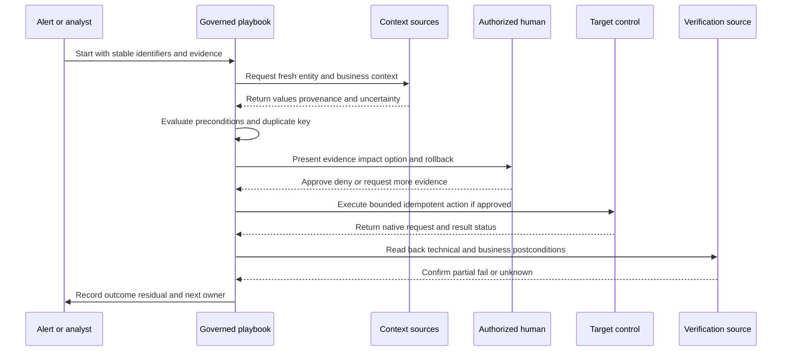

### Plain-English deep-dive 2 - Automation accelerates assumptions

A spreadsheet formula can calculate ten thousand rows perfectly and still produce the wrong answer if the input units are mixed. Automation has the same property. It accelerates whatever assumptions have been encoded. If an identity mapping confuses two people, the playbook can disable the wrong person faster. If an alert is duplicated, a non-idempotent action can repeat. If an API returns accepted rather than completed, the case can claim containment before the control changed.

Therefore, the first automation goal is not "no humans." It is consistent, observable, bounded work. Automate evidence retrieval, formatting, duplicate checks, timer management, and low-impact reversible tasks first. For high-impact actions, use recommendations, explicit approval, exact target binding, blast-radius preview, rollback, and read-back. Increase autonomy only after measured reliability, policy approval, failure drills, and audit evidence support it. Some actions should remain prohibited regardless of technical possibility.

## EDR from first principles

EDR means Endpoint Detection and Response. An endpoint is a user or server computing system such as a laptop, workstation, or server. EDR commonly collects endpoint activity and state, detects suspicious behavior, supports investigation, and enables response actions on managed endpoints. Common conceptual evidence includes process execution, parent-child relationships, file activity, network connections, account activity, persistence mechanisms, security-control state, and device identity. The exact telemetry and response set depend on the product, operating system, policy, sensor health, privacy configuration, and license.

EDR is strong where endpoint-local causality matters. A network observation may show a device contacted a destination. Endpoint evidence may show which process, user session, command, file, or parent initiated it. EDR can often preserve richer endpoint timelines than a general SIEM receives. It may also support actions such as containment or evidence collection, but never assume an action exists or has the same semantics across platforms.

| EDR question | Evidence needed | Limitation to surface | Operational safeguard |
|---|---|---|---|
| Is the endpoint covered? | Managed population, sensor presence, policy, health, last contact | Unmanaged or unsupported systems | Coverage denominator by platform and owner |
| What executed? | Process identity, parent, signer/hash, user, command evidence, time | Collection gaps, privacy masking, short retention | Preserve source-native event references |
| What changed? | File, registry/configuration, account, service, persistence evidence | Product/OS telemetry differences | State and event cross-check |
| What communicated? | Process-linked network activity and destination resolution | Proxy/NAT/encryption can alter perspective | Correlate endpoint and network views |
| Can response occur? | Exact device identity, health, authority, action contract | Offline device, stale identity, unsupported action | Verify target and read back state |
| Was containment sufficient? | Remaining sessions, identities, cloud tokens, routes, business service | Device-only control misses identity/cloud scope | Multi-domain containment plan |

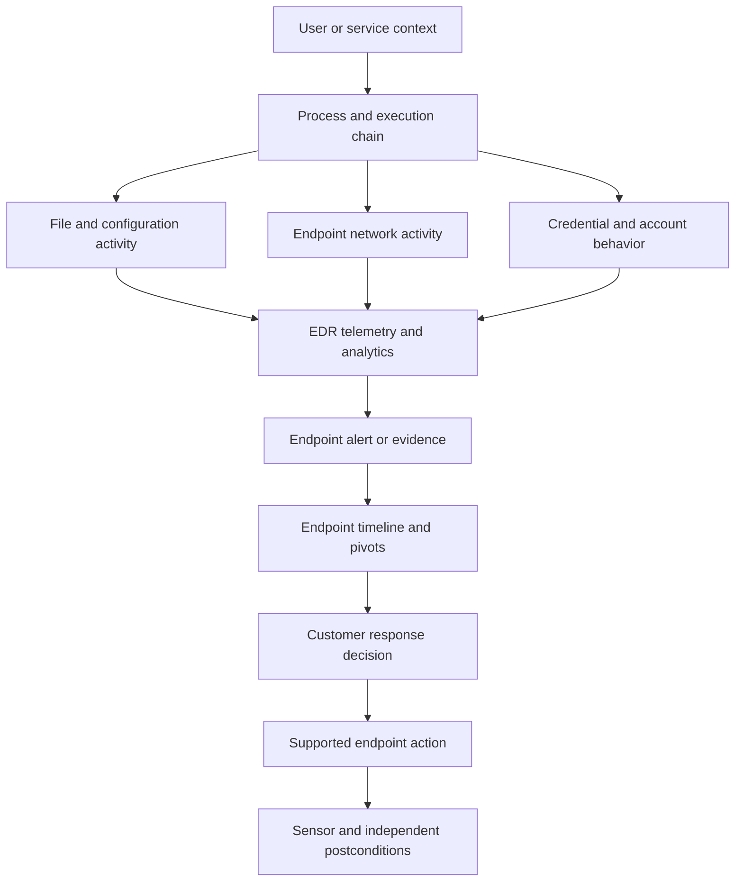

## NDR from first principles

NDR means Network Detection and Response. It observes network communications to identify suspicious patterns and support investigation and response. Depending on architecture, an NDR capability may analyze packets, metadata, flows, DNS, protocol transactions, encrypted-session characteristics, identity mappings, or network-device records. Visibility depends on placement, routing, cloud architecture, encryption, tunneling, sampling, address translation, and whether traffic traverses the observation point.

NDR is valuable for devices without endpoint agents, cross-device communication patterns, protocol misuse, lateral movement clues, command-and-control patterns, and broad network context. Yet a network view does not automatically reveal user intent, endpoint process lineage, encrypted content, or activity that bypasses the sensor. "No network alert" means only that no relevant analytic matched the data observed under current coverage and health.

| Network perspective | What it can support | What can distort it | Compensating evidence |
|---|---|---|---|
| Packet/content | Protocol and payload details where available and authorized | Encryption, truncation, privacy, asymmetric path | Endpoint, proxy, service-native logs |
| Flow/metadata | Source/destination, volume, timing, direction | NAT, proxies, sampling, shared infrastructure | Identity mappings and gateway records |
| DNS | Name queries, answers, timing, resolver behavior | Caching, encrypted DNS, local overrides | Endpoint resolver and proxy evidence |
| TLS metadata | Session properties and certificate context | Resumption, interception, product visibility limits | Proxy and endpoint process evidence |
| East-west traffic | Internal movement and service relationships | Cloud overlays, segmentation, unobserved paths | Cloud-native and workload telemetry |
| Internet/SaaS path | Destination and policy/traffic context | Direct paths, split tunnels, unmanaged devices | Inline service and endpoint coverage |

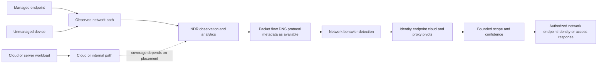

## UEBA from first principles

UEBA means User and Entity Behavior Analytics. A user may be a human or service identity. An entity may be a device, app, workload, IP address, repository, or other object. UEBA builds or applies behavioral expectations, peer comparisons, rules, or statistical models and highlights deviations or risky combinations. It may be a standalone category or embedded in SIEM, XDR, identity, cloud, or data-security products.

An anomaly is not equivalent to malicious activity. A user downloading more than usual may be preparing an approved migration, responding to a legal request, or experiencing account compromise. A service identity logging in from a new host may reflect deployment, misconfiguration, or theft. Behavior requires context: role, peer group, seasonality, change calendar, travel, device, privilege, application, data sensitivity, and source health.

| UEBA design choice | Question | Risk | Guardrail |
|---|---|---|---|
| Baseline window | Which past period represents expected behavior? | Includes compromise or excludes seasonality | Version and review baseline assumptions |
| Peer group | Which entities are meaningfully comparable? | Bad groups make normal look abnormal | Business-owner and data validation |
| Feature | Which measurable behavior represents the concern? | Proxy metric does not equal intent | Link feature to hypothesis and source |
| Threshold/model | What deviation deserves review? | Noise, hidden bias, unstable drift | Backtest, explain, monitor distribution |
| Identity resolution | Are records joined to the correct entity and lifecycle? | Shared/recycled accounts corrupt history | Effective-time identity model |
| Context | Which privilege, asset, data, and change facts matter? | Missing context inflates or hides urgency | Freshness and unknown state visible |
| Feedback | Which analyst outcomes update tuning? | Closure labels can be inconsistent | Quality-reviewed outcome taxonomy |

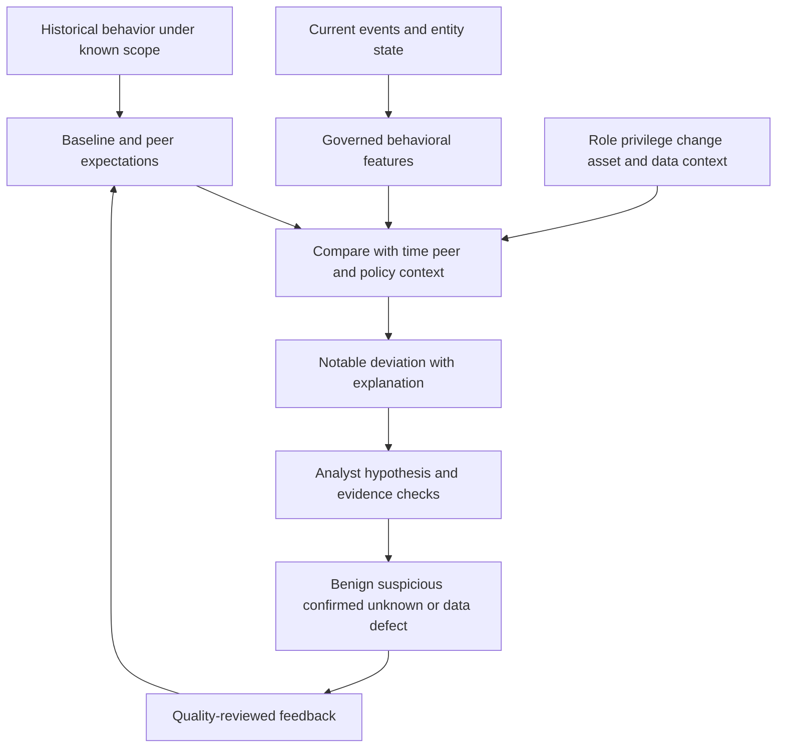

### Plain-English deep-dive 3 - "Unusual" and "dangerous" answer different questions

A night-shift nurse entering a hospital at 2 a.m. is normal for that role. A visitor entering at 2 a.m. is unusual. A surgeon entering an unfamiliar ward may be unusual but appropriate during an emergency. Someone entering with a stolen badge may appear statistically normal if the badge follows its usual schedule. Behavioral difference helps ask better questions; it does not determine intent by itself.

UEBA can rank attention when static rules are insufficient, but its output needs an explanation: which behavior changed, compared with what, across which time and peer group, using which source coverage, and with what context? Analysts must test account lifecycle, approved change, travel, automation, shared identity, data defects, and malicious hypotheses. A mature process also protects people from unfair conclusions. Behavioral analytics should not become secret employee-performance surveillance or a substitute for investigation and due process.

## XDR from first principles

XDR means Extended Detection and Response. The category aims to connect detection, investigation, and response across more than one security domain. Those domains may include endpoint, identity, email, network, cloud, applications, data, and vendor-native controls. Some XDR products are anchored in one vendor's ecosystem; others emphasize open integrations. Definitions and product scope vary substantially.

XDR's intended advantage is not merely another alert list. It is the ability to relate observations across domains into a stronger detection or investigation story, preserve a cross-domain timeline, and coordinate response. For example, an identity anomaly, endpoint process chain, network destination, cloud permission change, and data movement may become more meaningful together than separately. The weakness is that integration depth, data fidelity, action semantics, and third-party coverage may be uneven.

| XDR promise | Required reality check | Failure mode | Acceptance evidence |
|---|---|---|---|
| Cross-domain visibility | Which sources, populations, fields, and retention are actually present? | Logo integration without useful semantics | Coverage and known-event reconciliation |
| Unified incident | How are alerts grouped, split, updated, and explained? | Incorrect merge hides separate actors | Reproducible correlation and alternatives |
| Entity graph | How are identities/assets resolved over time? | Shared names/IPs create false relationships | Native IDs, lifecycle, confidence |
| Faster investigation | Which pivots and evidence are preserved? | Summary replaces source proof | Analyst can reproduce timeline |
| Coordinated response | Which systems/actions/approvals/rollback exist? | One action treated as complete containment | End-to-end response test |
| Better priority | Which business/risk context and policy drive ranking? | Opaque score becomes truth | Driver explanation and override review |

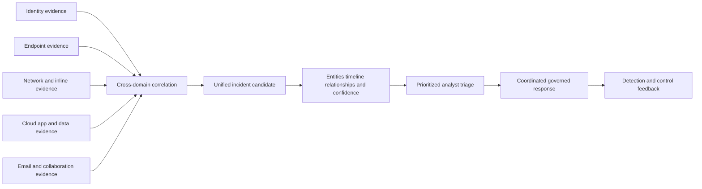

## Security data fabric from first principles

A security data fabric is an architecture and capability set for connecting security and business data across sources, harmonizing representations, resolving entities, correlating relationships, enriching with context, applying business logic, and operationalizing results through applications, reports, and workflows. The term does not have one universally enforced implementation. It can include integration, modeling, quality, lineage, graph, analytics, workflow, and governance capabilities.

The reviewed Zscaler Data Fabric for Security page publicly describes aggregating and unifying data across security tools and business systems; ingesting, harmonizing/mapping, deduplicating, correlating/enriching; applying business logic; supporting workflows and reporting; and powering current exposure-management applications. The public page also distinguishes a security data fabric from a SIEM by describing the SIEM as focused on event-related log data while the fabric manages broader security data types. Treat that as dated vendor positioning, not a universal category law or proof of a specific customer deployment.

| Data-fabric function | General purpose | Example evidence type | Important boundary |
|---|---|---|---|
| Connect/ingest | Obtain data under a source contract | Events, assets, identities, findings, policies, tickets, business records | "Any source" marketing needs actual connector verification |
| Harmonize/map | Preserve meaning while aligning models | Source fields to canonical concepts | Mapping can lose source nuance |
| Deduplicate | Identify repeated records or representations | Same asset from scanner, EDR, CMDB | Similarity is not identity proof |
| Resolve entities | Create time-aware identity for objects | User, device, app, owner relationships | Lifecycle and shared identifiers matter |
| Correlate | Establish meaningful relationships | Asset-owner-finding-control-business service | Graph edge requires provenance/confidence |
| Enrich | Add relevant facts | Criticality, privilege, exposure, owner, policy | Stale context can misprioritize |
| Apply logic | Encode customer grouping, scoring, and workflow rules | Ownership, SLA, routing, priority | Business logic is not universal truth |
| Operationalize | Drive applications, workflow, reporting, feedback | Exposure backlog, dashboard, ticket, review | Action and result need separate proof |

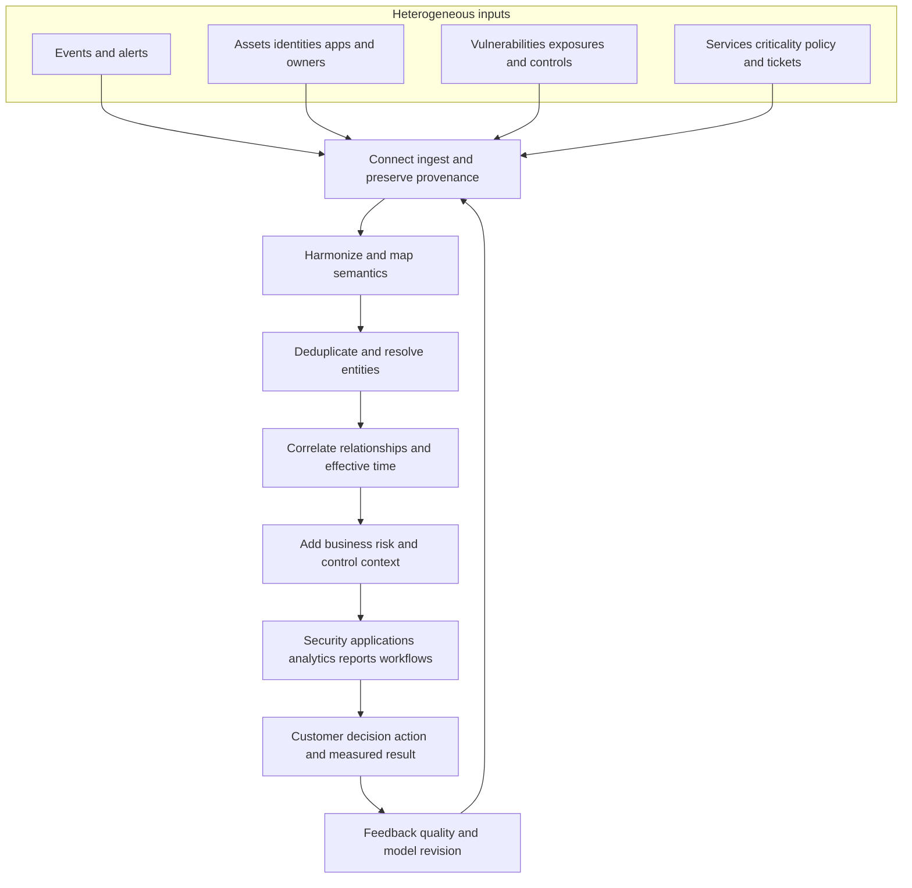

### Security data fabric versus adjacent data systems

The boundaries are architectural, not absolute. A SIEM may store entity tables. A data lake may run detections. A warehouse may support security investigations. An XDR may maintain a graph. A security data fabric may process event data. The choice should depend on latency, scale, semantics, workload, governance, authority, existing investment, and operational ownership.

| Category | Primary general focus | Natural grain | Strong fit | Common gap |
|---|---|---|---|---|
| SIEM | Security event collection, search, analytics, alerting, investigation | Events over time | Broad log search and detections | Entity/business truth may be fragmented |
| SOAR | Cross-system workflow, case, automation, response | Tasks, decisions, actions, cases | Repeatable coordination and execution | Depends on input and integration quality |
| EDR | Endpoint telemetry, detection, investigation, response | Device/process/file/user activity | Endpoint causality and controls | Unmanaged devices and non-endpoint domains |
| NDR | Network communication visibility and detection | Flows, packets, sessions, protocol events | Agentless and cross-network behavior | Placement, encryption, identity/process gaps |
| XDR | Cross-domain detection, story, investigation, response | Correlated incidents/entities/events | Integrated investigation and coordinated response | Ecosystem depth and opaque correlation vary |
| UEBA | Behavioral modeling and anomaly analysis | Entity features across time | Unknown or subtle deviations | Anomaly does not establish threat |
| Security data fabric | Multi-type data integration, entity/context, logic, operationalization | Entities, relationships, findings, events, business context | Reusable data truth and context | Does not automatically replace event analytics or response operations |
| Data lake | Scalable flexible storage/processing | Raw and curated objects | Long-term flexible analytics | Operational semantics and workflow need design |
| Warehouse | Governed structured analytics | Facts and dimensions | Consistent reporting and cohorts | May not fit high-volume low-latency telemetry |
| ITSM/case platform | Work, ownership, approvals, change, service records | Tickets/cases/tasks | Enterprise workflow and accountability | Security evidence depth may be limited |

## Purposes, overlaps, and limits in one matrix

No cell below is a promise about a specific product. "Common" means frequently associated with the category; "possible" means some products may provide it; "dependent" means architecture and integration determine usefulness.

| Capability | SIEM | SOAR | EDR | NDR | XDR | UEBA | Data fabric |
|---|---|---|---|---|---|---|---|
| Broad event collection/search | Common | Possible | Endpoint only | Network only | Dependent | Dependent | Possible, broader data focus |
| Native endpoint process detail | Via ingestion | Via integration | Common | Rare | Common when endpoint integrated | Input dependent | Via source contract |
| Native network observation | Via ingestion | Via integration | Endpoint perspective | Common | Common when network integrated | Input dependent | Via source contract |
| Behavioral anomaly | Possible | Consumes result | Possible | Possible | Common/possible | Primary focus | Possible with modeled data |
| Cross-domain correlation | Common/possible | Workflow correlation | Limited outside endpoint | Limited outside network | Primary focus | Across chosen entities | Core relationship/context function |
| Case management | Common/possible | Common | Possible | Possible | Common | Usually integrated | Workflow dependent |
| Response execution | Via integration | Primary orchestration job | Native endpoint actions | Native/integrated network actions | Cross-domain/integrated | Usually recommendation/integration | Workflow/integration dependent |
| Entity/business context | Via enrichment | Retrieved for decisions | Endpoint-centric | Mapping dependent | Often emphasized | Essential | Primary focus |
| Long-term raw retention | Common/possible | Not primary | Product dependent | Product dependent | Product dependent | Not primary | Architecture dependent |
| Business workflow/reporting | Possible | Common | Limited | Limited | Possible | Possible | Common positioning |

## Event-centric and entity-centric design

An event table answers "what was observed?" An entity table answers "what object existed in which state during which time?" Mixing the two causes subtle errors. A laptop can change owner. An IP can be reassigned. An account can be disabled and later recreated. A cloud app can move between business services. A single current-state join can attach today's owner to last month's event.

A sound model uses stable source identifiers where available, records aliases separately, represents effective time, retains provenance, and permits unresolved identity. It does not force a match merely to produce a complete dashboard. Correlation windows must reflect source latency and behavior, not just convenience. The same event may participate in several hypotheses without being duplicated as separate source facts.

| Modeling concern | Weak design | Better design | Analyst effect |
|---|---|---|---|
| Identity key | Display name or email alone | Native IDs plus scoped aliases and lifecycle | Fewer wrong-person joins |
| Device key | Hostname or current IP alone | Sensor/asset IDs, serial/cloud IDs, observed aliases | Better device continuity |
| Time | Local display time without zone | Source time, receipt time, UTC, clock-quality metadata | Reproducible sequence |
| State history | Overwrite current owner/criticality | Effective-from/to versions | Correct historical context |
| Missing value | Treat as false or low risk | Explicit unknown with reason | Honest uncertainty |
| Duplicates | Count every received record | Preserve raw, define semantic duplicate logic | Stable alert and metric counts |
| Correlation | Match any shared attribute | Require relationship semantics, window, direction, confidence | Explainable stories |
| Lineage | Copy values without source | Source ID, transformation/version, retrieval time | Faster troubleshooting |

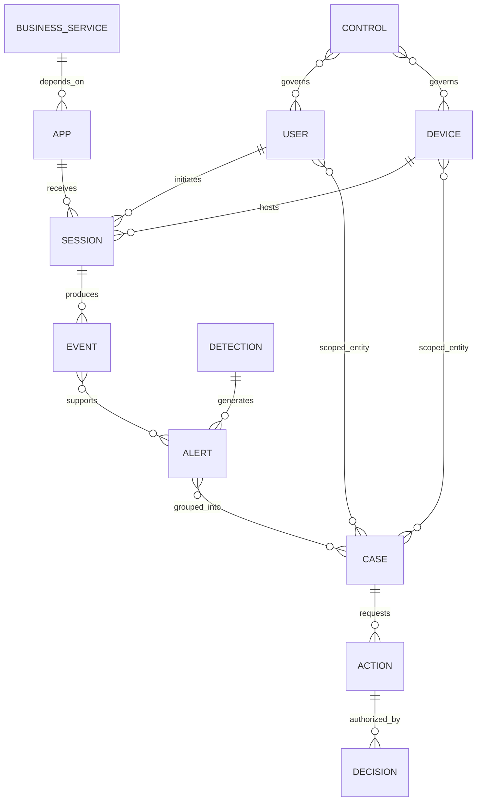

## Integration architecture

Integration is a contract, not a logo. For every data flow define purpose, producer, consumer, object grain, scope, field semantics, identity keys, source and receipt time, expected volume, delivery method, cursor/retry behavior, ordering, duplicates, schema version, privacy classification, retention, access, health, ownership, escalation, and acceptance tests. For every action flow also define target binding, authorization, idempotency, rate limits, asynchronous states, read-back, rollback, and audit.

A common architecture keeps source-native tools authoritative for their native evidence and controls, uses a SIEM for broad event search and selected detections, uses XDR for cross-domain stories where integrated, uses SOAR or a case platform for governed work, uses a data fabric for reusable entities/business context, and uses ITSM for enterprise ownership/change where appropriate. This is one general pattern, not a mandatory design.

| Contract field | Data-flow question | Action-flow extension | Acceptance example |
|---|---|---|---|
| Purpose | Which decision needs this flow? | Which approved outcome may it request? | Use case can be demonstrated end to end |
| Scope | Which tenants, accounts, regions, sources, populations? | Which targets/actions are allowed? | Expected cohort reconciles |
| Grain | What does one record represent? | What does one request affect? | No count or target ambiguity |
| Identity | Which stable IDs and aliases exist? | How is target revalidated at execution? | Recycled/shared identifier test passes |
| Time | Source, receipt, effective, update times? | Request, acceptance, completion, verification times? | Delayed/reordered test is explained |
| Delivery | Push, pull, stream, batch, file, API? | Sync or asynchronous command? | Retry and cursor behavior tested |
| Schema | Which version and semantic definitions? | Which request/result states? | Unknown/new fields do not silently corrupt |
| Quality | Completeness, freshness, validity, uniqueness? | Success, partial, fail, unknown, timeout? | Health reflects customer outcome |
| Security | Credentials, encryption, least privilege, secrets? | Separation of duties and approval? | Access review and secret rotation tested |
| Privacy | Which personal/sensitive content and purpose? | What action/evidence is retained? | Minimization and retention approved |
| Ownership | Who operates each boundary? | Who authorizes and restores? | RACI and escalation drill completed |

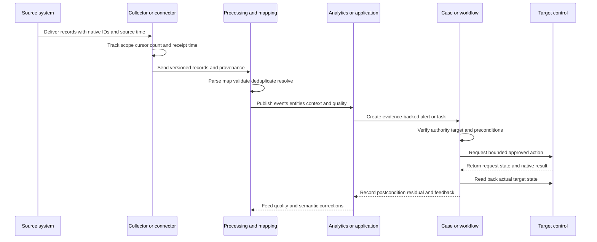

## Zscaler complementarity without replacement assumptions

The reviewed public Agentic Security Operations page says integration and interoperability matter because organizations often do not want to replace SIEM, EDR, IAM, and ticketing systems. It positions Zscaler Agentic SecOps as complementing existing tools by enriching signals with Zscaler telemetry and context and enabling coordinated workflows. The page also describes first-party telemetry plus third-party signals, a security graph and business context, unified threat stories, risk-based prioritization, agentic triage/investigation, and right-sized response. Part 96 examines those current public statements in depth.

For this Part, complementarity means asking where inline zero-trust, traffic, identity, policy, application, data, posture, exposure, and other available Zscaler context can improve an existing decision; where third-party endpoint, identity, cloud, SIEM, or ticketing evidence remains necessary; and which system should retain authority. It does not mean every signal is available, every tool is integrated, or the SIEM can be removed.

| Existing capability | Potential complementary question | Evidence to verify | Boundary |
|---|---|---|---|
| SIEM | Can selected Zscaler evidence/context improve search, detection, or incident narrative? | Actual source contract, fields, scope, latency, retention | Do not assert replacement or cost result |
| EDR | Can network/identity/inline context reveal behavior beyond endpoint visibility? | Device/user resolution and correlated source evidence | EDR remains important for endpoint causality/actions |
| NDR | Can inline proxy/zero-trust evidence add user/app/policy context? | Observation points, encrypted-traffic semantics, identity mapping | Do not claim complete network visibility |
| XDR | Can Zscaler signals enrich cross-domain stories and actions? | Integration depth, entity mapping, story logic, action contract | Avoid duplicate incident ownership |
| UEBA | Can current identity, access, app, and risk context refine anomalies? | Baseline, effective-time context, explanation | Context does not prove intent |
| SOAR | Can a governed playbook use available Zscaler or integrated controls? | Exact supported actions, approvals, rollback, read-back | No assumed action or autonomy |
| IAM | Can risk-appropriate policy use identity and session context? | Authority, identity binding, step-up/access semantics | IAM remains identity authority as designed |
| ITSM | Can context-rich work preserve owner, SLA, decision, and outcome? | Ticket integration and reconciliation contract | Ticket closure is not security proof |
| Data fabric | Can broader security/business data improve entity and exposure context? | Sources, mappings, quality, lineage, application boundary | Fabric is not automatically SIEM/XDR/SOAR replacement |

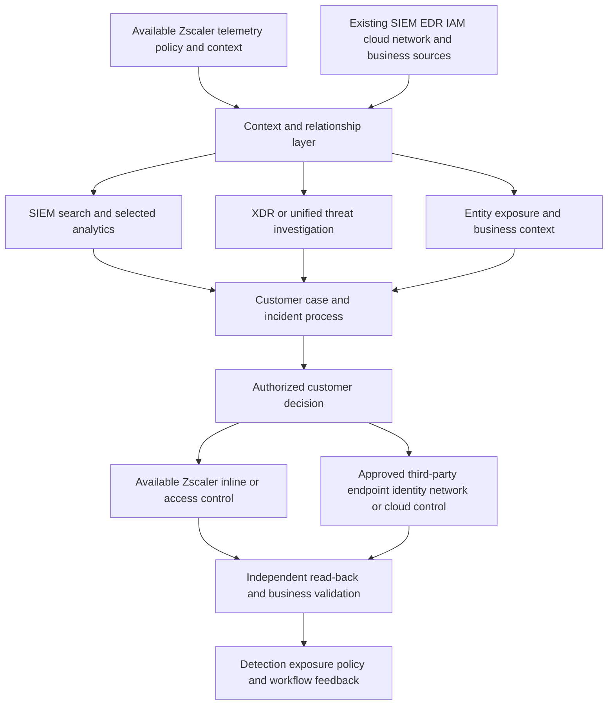

### Plain-English deep-dive 4 - Complementarity is a contract, not a slogan

Suppose a hospital adds a specialist imaging service. It does not automatically replace the patient record, laboratory, triage desk, pharmacy, or operating theatre. Value appears when the hospital decides which patients need imaging, how identity and orders are matched, how images and interpretations reach clinicians, which system stores the official report, who acts, and how urgent failures escalate. A logo on the integration page does not prove that workflow.

Security-tool complementarity is similar. Zscaler context might strengthen an investigation while EDR supplies process lineage, IAM supplies identity lifecycle, SIEM supplies long-period event search, and ITSM supplies change ownership. The architecture should nominate source-of-truth responsibilities and avoid copying a conclusion until no one knows where it came from. A TSM earns trust by defining and testing the full decision path, not by claiming one product eliminates every adjacent tool.

## Selection and rationalization decisions

Begin with use cases and operating constraints. List material threats and business services. Define evidence, response authority, service hours, privacy, retention, latency, volume, skills, resilience, and cost constraints. Map existing capabilities and pain. Then compare options: tune the current tool, integrate complementary context, consolidate overlapping platforms, retain specialized depth, or retire a capability only after dependencies and evidence portability are addressed.

| Decision question | Why it matters | Evidence | Warning sign |
|---|---|---|---|
| Which customer outcome is blocked? | Prevents generic platform shopping | Incident/hunt/exposure/service evidence | "We need XDR because peers have it" |
| Which data or context is missing? | Identifies the actual gap | Coverage and investigation pivot study | More ingestion without semantic need |
| Which workflow is slow or unsafe? | Separates data from process problems | Case timing and rework evidence | Buying automation for unclear process |
| Which system is authoritative? | Prevents state conflict | RACI and data/action ownership map | Every tool closes the same incident |
| What overlap is beneficial? | Redundancy can improve resilience or depth | Tested failure and use-case analysis | Duplicate alerts with no purpose |
| What overlap is waste? | Supports cost and complexity decisions | Usage, quality, dependency, retention evidence | License cost alone determines retirement |
| Which action authority exists? | Response is governance plus technology | Policy, role, approval, rollback tests | API permission treated as approval |
| What happens during outage or exit? | Protects operations and portability | Continuity, export, migration, contract | No source evidence outside vendor UI |

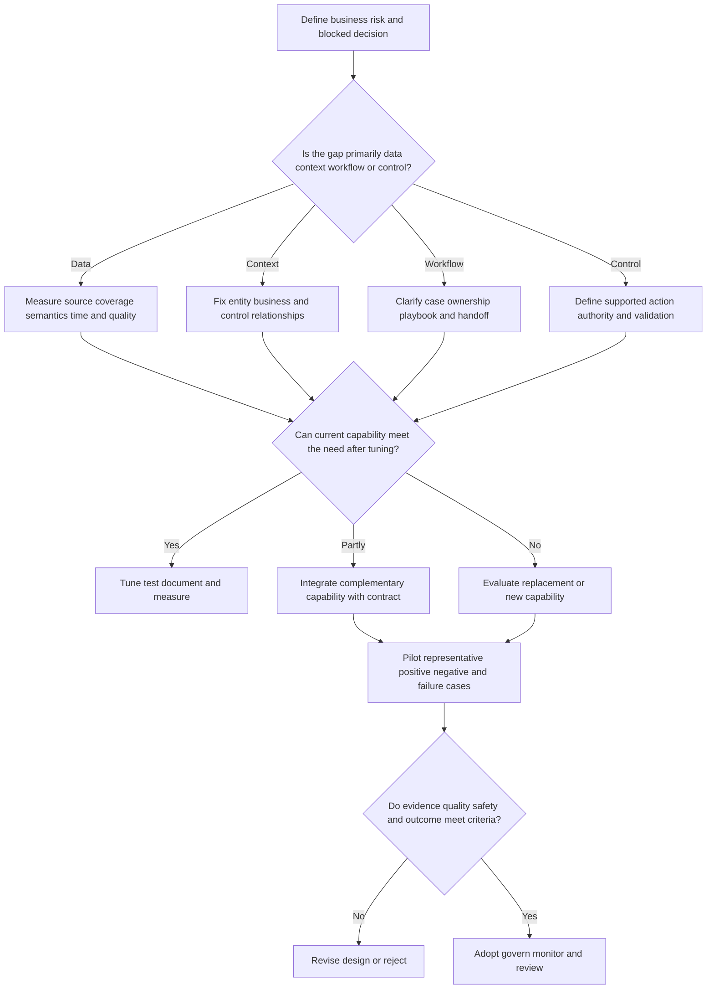

## Operating model and RACI

Technology ownership rarely matches decision ownership. The endpoint team may operate EDR, network security may operate NDR or inline controls, identity may own IAM, a platform team may operate SIEM/SOAR, data governance may approve retention, the SOC may investigate, incident response may lead declared incidents, and business owners may approve service-impacting containment. Vendors and a TSM support products and adoption within agreed boundaries.

| Work | Accountable customer role | Typical responsible roles | TSM contribution | Boundary |
|---|---|---|---|---|
| Source onboarding | Security platform/data owner | Source owner, SIEM/fabric engineer | Discovery, prerequisite tracking, validation coordination | Does not grant source access |
| Semantic mapping | Data/product owner | Source SME, detection/data engineer | Clarify evidence and escalation | Does not invent field meaning |
| Detection release | Detection governance owner | Detection engineer, SOC analyst | Product guidance and adoption support | Does not approve customer risk logic |
| Case triage | SOC manager | Authorized analysts/provider | Help troubleshoot product evidence | Does not close customer incidents |
| Containment | Incident/business authority | IR, IAM, endpoint, network, app teams | Explain supported capability and coordinate support | Does not authorize action |
| Privacy/retention | Legal/privacy/data governance | Platform and source owners | Surface product/configuration questions | Does not give legal approval |
| Connector incident | Integration service owner | Source, network, platform, vendor teams | Evidence package and cross-team tracking | Does not promise root cause/ETA |
| Value review | Security executive/service owner | SOC, platform, finance, business stakeholders | Connect use case, adoption, quality, outcome | Does not attribute avoided incidents without evidence |

## Data quality and service objectives

An integration can be technically up yet operationally unusable. Monitor coverage, completeness, freshness, validity, uniqueness, semantic correctness, entity resolution, analytic execution, action success, and evidence reproducibility. Each metric needs a grain and denominator. "Ninety-nine percent healthy" is meaningless until the expected population, time window, exclusions, and decision are defined.

| Quality dimension | Question | Example measure design | Misleading shortcut |
|---|---|---|---|
| Coverage | Which expected sources/entities are represented? | Reporting managed devices / expected managed devices by platform | Records received > 0 |
| Completeness | Are required fields present when applicable? | Valid native user ID / events requiring identity | Non-null across irrelevant events |
| Freshness | How late is useful data? | Receipt minus source time by source percentile | Last connector heartbeat only |
| Validity | Do values conform to syntax and domain? | Valid action/result states / total action records | Parser succeeded |
| Semantic accuracy | Do mapped values mean what users think? | Known-event expected canonical meaning | Field exists |
| Uniqueness | Are semantic duplicates controlled? | Unique native events after documented retry logic | Drop all repeated-looking events |
| Entity resolution | Are records joined to correct lifecycle object? | Reviewed true/false/unresolved matches | Match rate alone |
| Detection health | Do expected behaviors produce correct outputs? | Positive/negative/boundary test suite | Rule ran |
| Workflow health | Do tasks/approvals/actions reach valid states? | Completed verified outcomes / eligible requests | API returned 200 |
| Reproducibility | Can analyst trace conclusion to sources? | Sample cases with complete lineage | Summary exists |

## Layered troubleshooting

Troubleshoot from the nearest source truth toward the user-visible symptom. First define one missing or wrong object: an event, field, entity, alert, story, case, action, or report value. Capture exact source IDs, UTC times, expected scope, observed state, first-known boundary, and business impact. Then test one layer at a time.

1. **Source:** Did the source create the expected native record or state for the correct population?
2. **Authorization and scope:** Could the integration access that object, tenant, account, region, or API under current permissions and policy?
3. **Transport:** Was the record delivered or retrieved without cursor gaps, rate-limit loss, outage, or network/TLS failure?
4. **Parse and schema:** Did the versioned parser understand the representation and preserve required fields?
5. **Time:** Are source, receipt, effective, update, and display times interpreted correctly, including clock drift and late arrival?
6. **Normalization and semantics:** Did mapping preserve the source meaning?
7. **Entity resolution:** Was the event joined to the correct user, device, app, asset, and lifecycle?
8. **Analytic:** Did rule/model inputs, windows, exclusions, versions, and dependencies match?
9. **Correlation/story:** Were records merged or split for an explainable reason?
10. **Case/workflow:** Did ownership, state, task, timer, and handoff behave as intended?
11. **Action:** Was the exact target authorized, requested, accepted, completed, and read back?
12. **Report/narrative:** Does the displayed count or statement use the correct grain, denominator, filter, and uncertainty?

| Symptom | Cheap discriminating check | Plausible layers | Evidence packet |
|---|---|---|---|
| Source shows event; SIEM does not | Search by native ID and receipt-time range | Scope, cursor, transport, parser, retention | Native record, connector state, UTC, query |
| Alert lacks user | Compare raw source identity with parsed/canonical fields | Parser, mapping, privacy, entity resolution | Redacted raw/mapped sample and schema version |
| XDR story joins wrong device | Inspect join key and effective-time aliases | Entity resolution, NAT/IP reuse, stale inventory | Native device IDs, alias history, correlation rationale |
| UEBA spike after reorganization | Compare peer/baseline version and identity lifecycle | Baseline, peer group, HR/IAM update, data delay | Distribution, change date, model inputs |
| SOAR action says success; access remains | Read target system state and async operation | Action semantics, wrong target, timeout, partial result | Request ID, target ID, result states, read-back |
| Counts differ across tools | Align grain, window, timezone, filters, dedupe, late data | Semantics, retention, restatement | Query definitions and sample reconciliation |
| Duplicate incidents | Compare source/detection/story/case dedupe keys | Retries, multiple rules, parallel systems | IDs, timestamps, grouping rules, ownership |
| No NDR evidence | Verify traffic path and observation coverage | Routing, cloud overlay, encryption, sampling | Path diagram, sensor health, packet/flow alternatives |

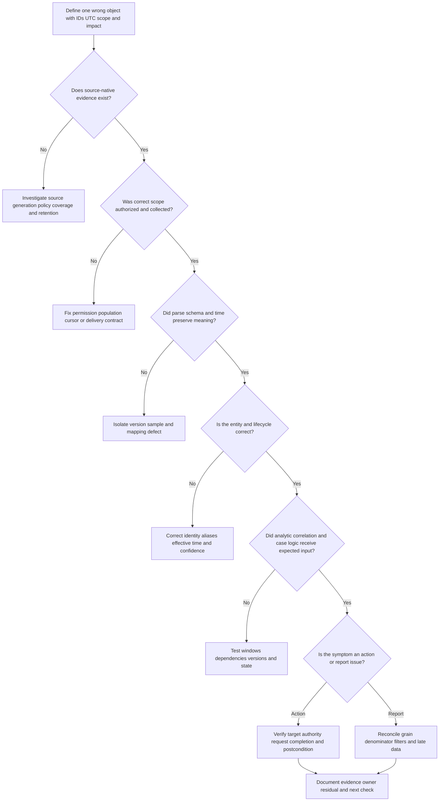

### Plain-English deep-dive 5 - A green connector is only a pulse

A courier application can show the truck online while the wrong packages are being collected, labels are unreadable, deliveries are late, and recipients cannot use the contents. A heartbeat proves one narrow condition: some component recently communicated. It does not prove complete scope, correct semantics, timely delivery, successful entity resolution, valid detections, or usable response.

Operational monitoring should therefore use synthetic or known-event tests where safe, source-to-destination reconciliation, schema checks, latency distributions, entity-resolution review, and action read-back. Health must be tied to a customer decision. If the use case is "triage privileged identity activity within a defined time," the service objective must measure the necessary sources, identity context, analytic path, and workflow, not simply connector uptime.

## Security, privacy, legal, and resilience

Security platforms contain sensitive evidence: identities, device state, browsing and application activity, process details, network destinations, data classifications, vulnerabilities, investigation notes, and response actions. Centralization can increase value and blast radius simultaneously. Apply purpose limitation, minimization, least privilege, strong authentication, separation of duties, encryption, key/secret governance, tenant and environment separation, immutable or protected audit where appropriate, retention limits, export controls, monitoring, and tested recovery.

Behavioral analysis requires special care because it can affect people. Define security purpose, approved features, access, retention, review, false-positive handling, legal/employee requirements, and appeal or correction mechanisms as applicable. Do not use a security anomaly score as an employment conclusion. Protect analysts from unnecessary harmful content and restrict access to sensitive investigations.

| Risk area | Threat or harm | Control questions | Evidence of operation |
|---|---|---|---|
| Integration credential | Broad token stolen or misused | Least scope, vaulting, rotation, source restrictions? | Access review and rotation test |
| Data concentration | Compromise exposes broad telemetry | Segmentation, encryption, access, monitoring, export controls? | Audit and recovery exercise |
| Cross-tenant/entity error | Evidence or action applies to wrong object | Tenant binding, immutable IDs, target revalidation? | Negative and recycled-ID test |
| Automation abuse | Compromised workflow performs harmful actions | Approval, least action, limits, idempotency, rollback? | Failure drill and read-back |
| Insider misuse | Authorized user searches sensitive activity improperly | Purpose-based role, query/action audit, review? | Access/query review record |
| Privacy overcollection | Data exceeds purpose or retention | Minimization, masking, jurisdiction, deletion? | Approved inventory and deletion test |
| Model bias/drift | Behavioral ranking unfair or unreliable | Feature review, peer validation, drift, human challenge? | Distribution and outcome review |
| Evidence tampering | Timeline or conclusion cannot be trusted | Provenance, protected source, audit, integrity checks? | Reproducible chain of evidence |
| Availability | Platform outage blocks investigation/response | Continuity, degraded modes, export, manual process? | Recovery and fallback exercise |
| Vendor dependency | Exit or outage removes access to evidence/workflow | Portability, retention, contract, ownership? | Tested export and transition plan |

## Failure modes and misconceptions

| Misconception or failure | Why it fails | Better mental model |
|---|---|---|
| "The SIEM is the SOC" | A tool does not supply mission, authority, skills, process, handoff, or learning | SIEM supports a governed operating service |
| "XDR replaces SIEM everywhere" | Scope, retention, search, integration, and governance differ | Compare use cases and evidence, not labels |
| "SOAR means autonomous response" | High-impact actions require context, authority, safeguards, and validation | Automate bounded work under governance |
| "EDR sees everything on a device" | Sensor, OS, policy, health, privacy, tampering, and retention limit evidence | State exact endpoint coverage and blind spots |
| "NDR sees all traffic" | Placement, routing, encryption, cloud paths, and sampling limit visibility | Draw observation points and alternate paths |
| "An anomaly is an attack" | Statistical difference is not malicious intent | Treat anomaly as a hypothesis input |
| "A data fabric is just another data lake" | Fabric emphasizes integration, semantics, entities, context, logic, and operationalization | Compare architecture and workloads explicitly |
| "Normalization creates truth" | Mapping can discard or misinterpret source meaning | Retain native evidence and test semantics |
| "More alerts improve coverage" | Noise can consume capacity and hide material cases | Measure behavior coverage, fidelity, and outcome |
| "One score can rank all risk" | Context, model assumptions, uncertainty, and risk appetite vary | Expose drivers and customer decisions |
| "Connector healthy means use case healthy" | Heartbeat does not prove scope, data, analytics, or action | Test end-to-end decision service |
| "Integration means replacement" | Existing systems may remain authoritative or deeper | Define complementarity and system-of-record |
| "Ticket closed means threat contained" | Administrative state does not prove technical postconditions | Read back controls and business recovery |
| "AI summary is evidence" | A summary can omit, merge, or invent claims | Cite and reproduce source evidence |

## Explicitly fictional and synthetic NMH scenario

Everything in this section is an explicitly fictional and synthetic NMH teaching scenario. All dates are deliberately later than the source snapshot and are labeled fictional future dates. They are not predictions, customer facts, Zscaler output, or product results.

On fictional future date **2026-09-15**, fictional synthetic NMH receives three teaching signals: a fictional EDR alert for an unusual command chain on test endpoint `nmh-lab-044`; a fictional identity anomaly for test identity `lab.contractor17`; and a fictional inline web-policy event for a newly observed destination. The fictional SIEM also receives a cloud audit record showing a denied privilege change. A synthetic CMDB extract marks the test endpoint as belonging to a nonproduction training environment, while a stale identity table incorrectly labels the identity as a finance administrator.

The exercise deliberately creates a conflict. An alert count might imply escalating danger, but the strongest business-context field is stale. The analyst must preserve each native fictional ID, compare source and receipt times, resolve the endpoint and identity lifecycle, and avoid merging by display name. The first useful decision is not containment. It is to determine whether the signals refer to one current entity and whether the criticality label is valid.

| Fictional synthetic evidence | Observed teaching state | Interpretation | Next discriminating check |
|---|---|---|---|
| EDR process alert | Test device and native process chain present | Endpoint behavior needs explanation | Verify sensor time, parent chain, signer, lab activity |
| Identity anomaly | New source pattern for test identity | Unusual, not yet malicious | Check identity lifecycle, peer group, approved exercise |
| Inline destination event | Policy event tied to identity alias | Adds network/policy context | Verify stable user/device IDs and destination category time |
| Cloud denied action | No successful privilege change in source evidence | Supports attempted/denied behavior only | Search bounded surrounding window and alternate identities |
| CMDB environment | Nonproduction training | Reduces direct business criticality | Confirm source authority and effective time |
| Identity criticality | Finance admin label is stale | Context defect could inflate priority | Reconcile IAM/HR source and update provenance |

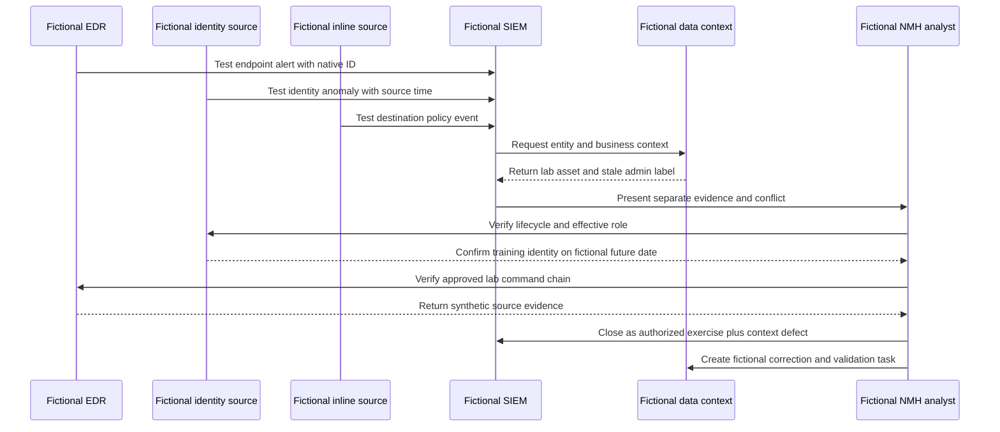

The fictional decision is to close the security behavior as an authorized training exercise only after source owners verify it, while opening a separate data-quality task for the stale identity classification. No production containment occurs. The learning is that SIEM, EDR, UEBA-style analysis, inline telemetry, and data-fabric context each contribute different evidence. Correlation should preserve conflicts rather than average them into a confident but wrong story.

## Scenarios and decision drills

### Scenario 1 - SIEM and XDR create separate incidents

The same endpoint alert appears in both systems, and analysts duplicate work. Define the authoritative case system, preserve cross-references, identify grouping keys, decide which platform owns detection versus investigation, and test reopen/update behavior. Do not delete one path until retention, evidence, provider, and continuity dependencies are understood.

### Scenario 2 - NDR sees traffic but EDR does not

Check device identity, sensor health, traffic path, NAT/proxy behavior, event retention, and whether the source is unmanaged. Possible conclusions include an EDR gap, a wrong device mapping, a network false association, or expected traffic. "EDR missed the attack" is only one hypothesis.

### Scenario 3 - UEBA flags a senior executive

Protect confidentiality, verify identity and peer group, check travel and approved changes through authorized channels, review source/model health, and investigate behavior without treating status as innocence or anomaly as guilt. Limit access and document purpose.

### Scenario 4 - SOAR times out after requesting isolation

Do not blindly retry. Record the native request, query target state, determine whether execution is pending/partial/failed, verify exact device identity, assess current risk, and escalate under the action contract. A timeout is an unknown state, not a failure or success.

### Scenario 5 - Data-fabric asset count differs from CMDB

Align scope, grain, lifecycle, time, deduplication, aliases, and source authority. The fabric may reveal unmanaged assets; it may also contain stale or duplicate records. Reconcile samples and classify differences rather than forcing counts to match.

### Scenario 6 - Leadership asks whether Zscaler can replace SIEM

Answer with use cases. Inventory required retention, search, detections, sources, investigations, compliance, workflows, staffing, and current public product boundaries. Explain complementarity supported by the official page. Recommend a representative pilot and dependency analysis, not an unsupported yes/no replacement promise.

### Scenario 7 - Alert volume drops sharply after parser change

Treat the apparent improvement as suspicious until source volume, parse validity, required fields, rule input counts, and known-event tests reconcile. A lower queue can reflect data loss rather than risk reduction.

### Scenario 8 - AI-generated story states "confirmed exfiltration"

Return to source evidence. Distinguish attempted, allowed, transferred, received, sensitive, and unauthorized claims. Require citations, data-classification context, scope, and customer incident authority. Correct the narrative and record the quality failure.

## Artifact kit

| Artifact | Minimum content | Quality gate | Candidate use |
|---|---|---|---|
| Tool-purpose map | Category, product, owner, primary job, overlaps, limits | Every claim is verified or unknown | Explain architecture without logo bias |
| Source inventory | Source, scope, grain, IDs, times, method, owner, retention | Expected population and authority defined | Demonstrate discovery rigor |
| Integration contract | Semantics, delivery, quality, security, privacy, action behavior | Positive, negative, delay, duplicate, failure tests | Show operational thinking |
| Entity dictionary | User/device/app keys, aliases, lifecycle, provenance | Effective-time and unresolved state supported | Explain correlation safety |
| Use-case specification | Threat/decision, evidence, logic, output, owner, response | Missing-data behavior and tests included | Connect tools to outcome |
| Playbook design | Trigger, context, branches, approvals, action, rollback, read-back | Unknown and timeout branches tested | Explain governed automation |
| Health dashboard | Coverage through action outcome with denominators | No heartbeat-only health | Show analytics strength |
| Reconciliation workbook | Source and destination counts/samples/times | Differences classified, not hidden | Troubleshooting portfolio evidence |
| RACI | Data, detection, triage, containment, privacy, support ownership | Authority distinguished from operation | Trusted-advisor discussion |
| Escalation packet | Symptom, impact, IDs, UTC, scope, evidence, tests, ask | Redacted and reproducible | Support/Product partnership |
| Decision record | Need, options, tradeoffs, evidence, choice, residual, review | No replacement assumption | Architecture governance |
| Privacy assessment | Purpose, data, access, retention, regions, exports, deletion | Legal/privacy owner approval represented | Responsible operations |
| Continuity plan | Outage mode, fallback, export, recovery, communications | Recovery exercise recorded | Resilience discussion |
| Adoption scorecard | Use-case use, quality, analyst behavior, outcome, friction | Usage not confused with value | TSM value conversation |
| Claim ledger | Fact class, statement, source/date, caveat, owner | No unsupported affirmative claims | Interview honesty |

## Safe exercises

All exercises use invented or sanitized data and create no production security action.

1. Draw a tool-purpose map for a generic company with SIEM, EDR, IAM, ITSM, network telemetry, and a data fabric. Mark primary jobs, authoritative objects, and overlaps.
2. Create twenty synthetic events across endpoint, identity, DNS, proxy, and cloud sources. Preserve native IDs and source/receipt times.
3. Design canonical user, device, app, event, alert, case, and action tables. Add effective-time ownership and explicit unknowns.
4. Write a reconciliation worksheet comparing expected and received records by source, hour, and entity cohort.
5. Draft a SIEM detection specification with positive, negative, boundary, delayed, duplicate, and missing-source cases.
6. Build a paper SOAR playbook for suspicious identity activity. Include recommend-only, approval, denied, timeout, partial, rollback, and read-back branches.
7. Compare endpoint and network perspectives for one synthetic web request. Explain what each can and cannot establish.
8. Create a UEBA example with a seasonal baseline and show how a poor peer group creates a false positive.
9. Correlate three synthetic alerts into two competing stories. Record why one merge remains uncertain.
10. Design a data-fabric entity-resolution rule and test shared email, reused IP, renamed device, and recreated account cases.
11. Write an integration contract for an imaginary EDR-to-SIEM feed without using vendor-specific fields.
12. Create an action contract for a fictional device-isolation request with exact target, approval, idempotency, asynchronous states, rollback, and audit.
13. Build a quality dashboard specification with denominators for coverage, freshness, parse validity, entity resolution, detection tests, and verified actions.
14. Conduct a tabletop where the connector heartbeat is green but one source population is missing.
15. Prepare a neutral two-minute answer to "Will Agentic SecOps replace our SIEM?" using dated official positioning and verification questions.
16. Produce a redacted escalation packet for a schema change that turns a required identity field null.
17. Review a synthetic AI incident summary and mark every sentence as source fact, inference, scenario assumption, or unsupported.
18. Explain the complete architecture aloud without claiming production SIEM, XDR, Zscaler, or SOC operation.

## TSM discovery questions

1. Which business services and threat scenarios drive the SecOps architecture?
2. Which systems currently collect, detect, correlate, investigate, manage cases, execute actions, and retain evidence?
3. What object is authoritative in each system: event, identity, device, asset, alert, case, incident, ticket, action, or risk decision?
4. Which source populations, retention periods, latency needs, privacy restrictions, and regions apply?
5. Where do analysts lose time: missing data, weak identity, duplicate alerts, console pivots, unclear authority, action failure, or handoff?
6. Which detections depend on multiple sources, and what happens when one is late or absent?
7. How are entity aliases, recycled identifiers, ownership changes, and effective time represented?
8. Which actions are recommend-only, human-approved, pre-authorized, reversible, prohibited, or externally owned?
9. How are connector, semantic, analytic, case, and action health measured end to end?
10. Which existing SIEM, EDR, IAM, ITSM, cloud, network, and data investments must remain authoritative?
11. Which Zscaler products are licensed and deployed, and which exact telemetry or controls are available under current documentation?
12. Which official claims, tenant facts, general practices, assumptions, and unknowns must remain separate?
13. How are AI-generated groupings, summaries, priorities, and recommendations grounded, reviewed, corrected, and audited?
14. What continuity, evidence-export, provider, and exit requirements exist?
15. What measured adoption and customer outcome would justify the integration or consolidation decision?

## Official Source Anchors

Research/source snapshot and source review date: **2026-08-24**.

The Zscaler sources below support only dated public positioning. The NIST and MITRE sources support general security concepts. They do not establish customer entitlement, implementation, accuracy, integration, action, autonomy, or outcome. Current technical and ordering documentation, licensed-tenant evidence, source contracts, and customer policy control production decisions.

| Source | URL | Used for | Boundary |
|---|---|---|---|
| Zscaler Agentic Security Operations | https://www.zscaler.com/products-and-solutions/security-operations | Complementing existing SIEM/EDR/IAM/ticketing, first/third-party signals, context, threat stories, triage/investigation, right-sized action | Emerging architecture; no connector, UI, field, entitlement, autonomy, metric, or result inferred |
| Zscaler Data Fabric for Security | https://www.zscaler.com/products-and-solutions/data-fabric | Public ingest, harmonize/map, deduplicate, correlate/enrich, business logic, workflow/report, and SIEM distinction positioning | No universal category definition or customer implementation inferred |
| Zscaler Zero Trust Exchange | https://www.zscaler.com/products-and-solutions/zero-trust-exchange-zte | Public least-privilege, identity/context/business-policy, proxy, inline-control context | No specific SecOps action or policy semantics inferred |
| NIST Cybersecurity Framework 2.0 | https://www.nist.gov/cyberframework | Govern, Identify, Protect, Detect, Respond, Recover outcome framing | Voluntary; profiles and implementation vary |
| NIST SP 800-61 Rev. 3 | https://csrc.nist.gov/pubs/sp/800/61/r3/final | Incident-response and CSF-aligned preparation/response context | Customer tailors roles and procedures |
| NIST SP 800-207 | https://csrc.nist.gov/pubs/sp/800/207/final | General zero-trust architecture concepts | Does not prescribe a vendor product |
| MITRE ATT&CK | https://attack.mitre.org/ | Common adversary tactic/technique knowledge for use cases | Mapping is not proof of detection or occurrence |

## Likely Interview Questions

### Q1. Explain SIEM, SOAR, EDR, NDR, XDR, UEBA, and a security data fabric simply.

**Model answer:** A SIEM centralizes event search, analytics, alerts, and often investigation. SOAR coordinates cases, tools, approvals, and governed actions. EDR provides endpoint-local telemetry, detection, investigation, and response. NDR observes network communications and detects network behavior. XDR connects multiple security domains into cross-domain stories and response. UEBA identifies notable changes in user/entity behavior. A security data fabric connects broader security and business data, resolves entities and relationships, adds context, and operationalizes it. Products overlap, so I verify actual scope rather than treating labels as fixed boxes.

### Q2. Does XDR replace SIEM?

**Model answer:** Not as a universal rule. I compare required sources, retention, search, detections, investigation depth, compliance, cases, response, integrations, cost, skills, and continuity. XDR may provide a strong cross-domain incident experience; a SIEM may remain the broad event-search or retention platform. Some customers consolidate, others complement. I would define use cases, authoritative systems, and measurable acceptance criteria before recommending retirement.

### Q3. What makes a SOAR playbook safe?

**Model answer:** It starts with stable evidence and a deduplication key, retrieves fresh context with provenance, verifies the exact target, checks policy authority, handles true/false/unknown branches, uses least-impact idempotent actions, bounds retries, records approvals and native results, reads back actual state, supports tested rollback, and preserves audit and residual risk. A timeout is unknown, and technical API permission is not business authorization.

### Q4. How do EDR and NDR complement each other?

**Model answer:** EDR can provide endpoint process, file, user, and device causality plus supported endpoint controls. NDR can observe communications across managed, unmanaged, and infrastructure entities at covered network points. Endpoint evidence may explain which process initiated traffic; network evidence may reveal cross-device patterns or agentless activity. Both have blind spots, so I reconcile identity, time, path, encryption, sensor health, and source scope before drawing conclusions.

### Q5. Why is a UEBA anomaly not proof of an attack?

**Model answer:** UEBA answers whether behavior differs from a baseline, peers, or policy under defined inputs. Approved change, travel, seasonality, automation, lifecycle changes, or data defects can also create deviations, while stolen credentials can imitate normal behavior. I ask which feature changed, compared with what, over which window and peer group, with which source health and context, then test competing hypotheses and protect privacy.

### Q6. How is a security data fabric different from a SIEM?

**Model answer:** In general, a SIEM is event-centric: collect logs, search, detect, alert, and investigate over time. A security data fabric emphasizes connecting many data types, harmonizing them, resolving entities, correlating relationships, enriching with business context, applying logic, and serving applications/workflows. They can overlap and feed each other. Zscaler's dated public page makes a similar positioning distinction, but I would verify actual customer architecture and not claim automatic replacement.

### Q7. How can Zscaler complement an existing SecOps stack?

**Model answer:** Zscaler's current public Agentic SecOps material says organizations often retain SIEM, EDR, IAM, and ticketing tools and positions integration as complementary. Conceptually, available Zscaler traffic, identity, policy, app, data, posture, exposure, and inline-control context can enrich existing evidence and support risk-appropriate workflows, while third-party tools retain endpoint, identity, event, or case authority as designed. I would verify licensed sources, schemas, mappings, actions, approvals, and measured end-to-end behavior.

### Q8. How does your background transfer to this topic without overclaiming?

**Model answer:** Your prior enterprise support work provides production experience in identity, permission, endpoint, network, browser, sync, service, and customer-impact diagnosis. Packet/process/browser traces support collection-path troubleshooting. SQL and Power BI support event/entity models, joins, time windows, quality, and metrics. Escalation and mentoring support governance and enablement. You have studied these SecOps categories and used fictional exercises; production SIEM, SOAR, XDR, EDR, NDR, UEBA, Zscaler, and SOC operation remain explicit ramp areas.

## 30-Second Memory Hooks

| Concept | Memory hook |
|---|---|
| SIEM | Broad event library, search, analytics, alarms |
| SOAR | Coordinate people, tools, decisions, and safe action |
| EDR | What happened inside this managed endpoint? |
| NDR | What communications crossed this observed path? |
| XDR | Join domains into an explainable threat story |
| UEBA | Unusual is a clue, not a verdict |
| Security data fabric | Connect, map, resolve, relate, enrich, operationalize |
| Event | One observation at a time |
| Entity | Continuing object with lifecycle and context |
| Correlation | Relationship claim with identity, time, semantics, confidence |
| Enrichment | Add relevant context without replacing evidence |
| System of record | One accountable home for each state or decision |
| Automation | Accelerates assumptions; govern the assumptions |
| Timeout | Unknown state until reconciled |
| Health | Source through verified outcome, not heartbeat alone |
| Complementarity | Define the gap, contract, authority, and test |
| Zscaler | Dated public context plus inline-control positioning; verify tenant reality |
| Experience bridge | Enterprise evidence and analytics transfer; product operation does not |

## Completion Checklist

- [ ] I separate official product fact, general security practice, fictional scenario assumption, customer fact, and unknown.
- [ ] I define event, log, telemetry, signal, alert, finding, entity, context, correlation, enrichment, detection, case, incident, action, and provenance.
- [ ] I explain SIEM, SOAR, EDR, NDR, XDR, UEBA, security data fabric, data lake, warehouse, and ITSM from zero.
- [ ] I compare each category by purpose, grain, strengths, limitations, and common overlap.
- [ ] I explain why category labels do not prove a product's architecture, fields, actions, or entitlement.
- [ ] I model events separately from time-aware entities and preserve native identifiers and aliases.
- [ ] I design a SIEM path from source through collection, parse, normalization, storage, analytics, alert, case, action, and feedback.
- [ ] I design a safe SOAR playbook with deduplication, target verification, authority, branches, idempotency, retries, read-back, rollback, and audit.
- [ ] I state EDR coverage, sensor, OS, identity, retention, and response limitations.
- [ ] I state NDR placement, routing, encryption, sampling, identity, and process limitations.
- [ ] I treat UEBA anomalies as hypothesis inputs and govern privacy and model drift.
- [ ] I require XDR correlation, graph, priority, investigation, and response claims to be explainable and testable.
- [ ] I explain data-fabric connect, map, deduplicate, resolve, correlate, enrich, logic, workflow, reporting, and feedback functions.
- [ ] I define integration contracts for purpose, scope, grain, identity, time, delivery, schema, quality, security, privacy, ownership, and actions.
- [ ] I define authoritative systems and prevent duplicate incident/action ownership.
- [ ] I use denominators for coverage, completeness, freshness, validity, uniqueness, entity resolution, detection, workflow, and reproducibility.
- [ ] I troubleshoot source, access, transport, parse, schema, time, normalization, entity, analytic, story, case, action, and report layers.
- [ ] I protect centralized security data with minimization, least privilege, separation, encryption, audit, retention, export, and recovery controls.
- [ ] I can explain Zscaler complementarity without asserting replacement, integration, action, UI, field, entitlement, autonomy, or result.
- [ ] I can identify every NMH element and date as explicitly fictional, synthetic, and future-dated.
- [ ] I can produce all fifteen listed artifacts and complete all eighteen safe exercises.
- [ ] I use neutral candidate syntax and make no unsupported production Zscaler or SOC-tool claim.
- [ ] I retain the source review date exactly as 2026-08-24.
- [ ] I can answer all eight interview questions using evidence-bounded language.

[Part 93 - From Atomic Alerts to Unified Threat Stories](Part-93-alerts-to-threat-stories.md)