# Part 93 - From Atomic Alerts to Unified Threat Stories

> **Audience:** Candidates preparing for a Zscaler Security Operations Technical Success Manager role after enterprise Support Escalation Engineering.

> **Purpose:** Explain how individual security alerts can become unified threat stories through quality checks, deduplication, entity resolution, temporal and behavioral correlation, timelines, attack paths, confidence, scope, business impact, and an evidence-backed incident narrative.

> **Scope and honesty:** Northstar Meridian Holdings, abbreviated NMH, is an explicitly fictional and synthetic customer used only for study. Every NMH alert, entity, event, source, timeline, graph, attack path, date, score, decision, action, and outcome is invented. Your factual background is Microsoft 365, OneDrive, and SharePoint support; networking and trace analysis; SQL and Power BI; enterprise escalations; mentoring; and responsible AI exploration. Production Zscaler, Agentic SOC, SIEM, XDR, alert-correlation, threat-story, SOC, detection-engineering, threat-hunting, and incident-response ownership remain learning boundaries.

> **Currency caveat:** Product names, correlation methods, AI agents, schemas, interfaces, fields, scores, workflows, response options, limits, packaging, and entitlements change. The controlled official-source snapshot and source review date for this Part is exactly **2026-08-24**. Current official documentation, licensed-tenant evidence, customer incident policy, source-native records, product specialists, Support, and tested runbooks govern production decisions.

> **Section goal:** Build a beginner-to-interview-ready method for moving from isolated alert notifications to a reproducible threat narrative: verify alert quality, resolve the correct entities and time, correlate only with explicit reasoning, preserve contradictory evidence, estimate scope and business impact, communicate confidence, and give an analyst the next discriminating action.

The reviewed public Zscaler Agentic Security Operations page supports bounded official positioning that Agentic SOC can unify Zscaler and third-party alerts, produce connected threat narratives, enrich threats with business context, prioritize by risk, and support investigation with summaries, unified evidence, timelines, and attack-path context. Those are dated public statements. This Part does not invent a Zscaler schema, correlation rule, score, user interface, field, agent implementation, source list, entitlement, response action, latency, accuracy, or customer result.

The mechanics below are **general security practice** unless a paragraph explicitly labels a dated **official product fact**. Any NMH material is an explicitly fictional and synthetic **scenario assumption**. A **customer fact** requires customer-authoritative evidence. An **unknown** stays visible when the available evidence cannot establish identity, sequence, intent, scope, impact, or cause.

```mermaid
flowchart LR
    ATOMIC[Atomic alerts from separate detections] --> QUALITY[Verify source logic time and data health]
    QUALITY --> DEDUPE[Remove technical duplicates without losing evidence]
    DEDUPE --> ENTITY[Resolve identities devices apps assets and data]
    ENTITY --> CORR[Correlate by behavior relationship and time]
    CORR --> TIMELINE[Build source-linked UTC timeline]
    TIMELINE --> PATH[Model observed inferred and unknown path edges]
    PATH --> SCOPE[Estimate affected and at-risk scope]
    SCOPE --> IMPACT[Add business criticality and consequence]
    IMPACT --> STORY[Unified threat story with confidence and alternatives]
    STORY --> DECISION[Triage investigate contain monitor or close]
    DECISION --> FEEDBACK[Correct entities detections context and controls]
    FEEDBACK --> QUALITY
```

| Story principle | Plain meaning | Operational consequence | Failure prevented |
|---|---|---|---|
| Alert is a claim | A rule matched evidence under conditions | Reproduce source, logic, version, and inputs | Alert-equals-incident thinking |
| Preserve atoms | Grouping must not erase native observations | Keep source IDs, raw references, and lineage | Unchallengeable summary |
| Correlation needs a reason | Shared attributes alone are insufficient | State identity, relationship, time, behavior, and confidence | Accidental mega-incident |
| Contradictions are evidence | Conflicting facts reveal uncertainty or defects | Display and investigate disagreement | Majority-vote truth |
| Time has several meanings | Event, receipt, effective, and update times differ | Use UTC and model delay/clock quality | Impossible sequence |
| Scope is bounded | Observed, affected, at-risk, checked, and unknown differ | Publish denominators and blind spots | "Only one host" overclaim |
| Impact is customer context | Technical severity is not business consequence | Involve owners and authoritative context | Vendor score as risk truth |
| Confidence is claim-specific | Identity may be high confidence while intent is low | Attach confidence and evidence per assertion | One opaque overall certainty |
| Story drives a decision | Narrative must expose the next discriminating action | End with owner, authority, branch, and checkpoint | Attractive but inert summary |

## JD Mapping

| JD signal | Capability developed | Customer or TSM artifact | Honest boundary |
|---|---|---|---|
| Develop SecOps expertise | Explain alert quality, correlation, timelines, graphs, scope, confidence, and impact | Threat-story reference model | No production SOC claim |
| Trusted advisor | Turn fragmented signals into decision-ready context | Evidence-backed narrative brief | Customer owns incident declaration |
| Drive product adoption | Define useful analyst outcomes and acceptance tests | Threat-story quality scorecard | No guaranteed noise or time reduction |
| Troubleshoot integrations | Isolate source, time, entity, dedupe, correlation, context, and case defects | Layered story runbook | No unsupported product root cause |
| Use analytics | Model event/alert/entity/story grains, windows, joins, denominators, and drift | SQL/Power BI-style semantic model | No internal product schema claim |
| Coordinate stakeholders | Align SOC, endpoint, IAM, network, cloud, data, app, business, privacy, and IR owners | Story RACI and decision log | TSM facilitates rather than commands |
| Communicate proactively | State observations, hypotheses, scope, impact, confidence, unknowns, and next check | Technical/executive story formats | No unsupported certainty |
| Partner with Support/Product | Package reproducible wrong-merge, split, timeline, or context evidence | Redacted escalation packet | No defect or fix promise |
| Apply AI responsibly | Evaluate grouping, summaries, and recommendations against source evidence | Agentic-output validation rubric | No autonomous conclusion or containment claim |

## Candidate honesty note

You can say: "My production support experience required me to correlate identity, endpoint, network, permission, sync, and service evidence into customer-impact narratives while keeping hypotheses separate from facts. I have studied security alert-to-story methods and practiced them only with fictional data. I have not operated Zscaler Agentic SOC or a production SOC, so I would validate current product behavior and follow the customer's incident authority."

This is a stronger answer than claiming direct alert-correlation experience. It identifies a factual production method, a relevant transfer, a studied domain, and the next verification step. Neutral phrases such as "the evidence supports," "the current hypothesis is," and "I would verify" keep the statement defensible.

| Factual strength | Transfer to threat stories | Safe wording | Unsupported wording to avoid |
|---|---|---|---|
| M365/OneDrive/SharePoint escalation | Correlate tenant, user, device, permissions, client, network, and service events | "I reconstruct multi-layer service timelines." | "I correlated production cyberattacks." |
| Networking and traces | Align DNS, TCP, TLS, HTTP, proxy, process, and timestamp evidence | "I can test sequence and path hypotheses." | "I performed production NDR investigations." |
| SQL and Power BI | Join grains, window events, reconcile counts, expose confidence and trends | "I can model explainable operational evidence." | "I queried a production Agentic SOC graph." |
| Critical incidents | State impact, owners, hypotheses, next checks, updates, and residuals | "I communicate evidence under ambiguity." | "I declared and contained cyber incidents." |
| Mentoring | Review case quality and teach structured narratives | "I can enable evidence-led analysis." | "I managed SOC detection teams." |
| Responsible AI | Ground summaries, inspect omissions, and retain human review | "I evaluate AI output against sources." | "I deployed autonomous SOC agents." |
| Fictional synthetic NMH | Demonstrate a complete learning artifact | "This story is synthetic practice." | "This is a Zscaler or customer result." |

## Beginner vocabulary and memory hooks

| Term | Meaning from zero | Why it matters | Analogy or memory hook |
|---|---|---|---|
| Atomic alert | One detection output treated as a small independent unit | Starting point before correlation | One emergency call |
| Detection | Logic or process that identifies evidence worth assessment | Explains why an alert exists | Alarm rule |
| Rule match | Inputs satisfied defined conditions | Reproducible claim, not verdict | Sensor crossed threshold |
| Deduplication | Identifying repeated representations of the same intended object | Reduces duplicate work | Remove duplicate receipts |
| Suppression | Preventing or delaying an output under a policy | Controls noise but can hide evidence | Silence repeated alarm notices |
| Correlation | Associating observations because a defined relationship is plausible | Builds a richer hypothesis | Link travel receipts into one trip |
| Entity | Continuing object such as user, device, app, asset, IP, or file | Story characters and places | Person in a case |
| Entity resolution | Deciding which records refer to the same real object over time | Prevents wrong joins | Match aliases to one person |
| Timeline | Ordered observations and decisions with source-linked times | Supports sequence and causality tests | Flight recorder chronology |
| Temporal window | Allowed time relationship for correlation | Controls which observations may relate | Connection time between trains |
| Attack path | Connected conditions/actions from entry toward an objective | Explains possible or observed progression | Route through linked rooms |
| Node | Entity or condition in a graph | Represents a story object | Station on a map |
| Edge | Defined relationship between nodes | Connects evidence and hypotheses | Track between stations |
| Observation | What a source directly recorded | Strongest factual layer | Camera frame |
| Inference | Conclusion reasoned from observations | Useful but must be challengeable | Footprints imply travel |
| Hypothesis | Testable explanation | Organizes investigation | Candidate story |
| Confidence | Strength of support for a specific assertion | Makes uncertainty actionable | Image sharpness |
| Severity | Technical or policy-assigned seriousness | One input to prioritization | Alarm category |
| Priority | Order of attention based on urgency, impact, confidence, and capacity | Allocates scarce analyst effort | Emergency queue position |
| Scope | Set of affected, observed, checked, at-risk, or unknown entities | Controls response and communication | Boundary on a map |
| Blast radius | Potential extent of harm or reach | Shapes urgency and containment | Rooms reached by a leak |
| Business impact | Consequence to services, data, people, obligations, or objectives | Connects technical evidence to decisions | Hospital care disruption |
| Criticality | Customer-assigned importance of an entity or service | Adjusts priority and response | Intensive care versus lobby display |
| Threat story | Connected evidence, entities, timeline, hypotheses, scope, impact, confidence, and decisions | Gives analysts coherent work | Case narrative with citations |
| Incident narrative | Evidence-bounded account used for response and communication | Aligns technical and business teams | Verified event brief |
| Provenance | Origin and transformation history of evidence | Enables reproduction | Chain of custody |
| Contradiction | Evidence that cannot all fit the same claim | Signals alternatives or data defects | Two clocks disagree |
| False merge | Separate activities incorrectly grouped | Inflates scope and confuses response | Two patients share one chart |
| False split | Related activity left in separate stories | Hides progression and repeats work | One journey split into unrelated tickets |
| Story version | Recorded state of narrative at a time | Preserves how understanding changed | Edition history |
| Next discriminating check | Cheapest safe test that separates live hypotheses | Keeps investigation purposeful | Test that rules out one cause |

### Plain-English deep-dive 1 - A threat story is a case file, not a longer alert

Imagine four calls to emergency services: a door alarm, a report of broken glass, a badge failure, and smoke seen from a window. Putting all four lines into one paragraph does not create an investigation. A case file asks whether the calls refer to the same building, which entrances and times are involved, whether the badge belongs to an authorized worker, whether the smoke is from a kitchen test, what direct evidence exists, and what remains unknown. It also records who must check which fact and who can evacuate the building.

A unified threat story performs that discipline for security evidence. It preserves each alert and source observation, resolves the exact entities, aligns time, explains why records may relate, shows alternative explanations, adds business context, estimates scope, and recommends a governed next step. If grouping merely makes one larger alarm, it can increase confidence without increasing truth.

## Atomic alerts and their quality contract

An alert should be reconstructable. The analyst needs the source, native alert ID, detection name and version, triggering evidence, source time, receipt and processing time, entity identifiers, scope, threshold/window, exclusions, suppression state, source health, and links or references to underlying events. Vendor severity is useful metadata but not sufficient priority or incident evidence.

| Alert quality dimension | Core question | Evidence | Failure signal |
|---|---|---|---|
| Validity | Did the intended logic match the intended input? | Rule/version and reproducing events | Alert cannot be reconstructed |
| Completeness | Are required observations and entities present? | Required fields and source coverage | Blank user/device/context |
| Timeliness | Did the alert arrive in time for its decision? | Source, receipt, evaluation, alert times | Large or unexplained delay |
| Uniqueness | Is this a new logical alert or a repeat? | Native ID and dedupe key | Retry creates new incident |
| Explainability | Can an analyst state why it fired? | Conditions, evidence, threshold/window | Opaque score only |
| Actionability | Is there a clear safe next check or decision? | Playbook and required context | Generic "investigate" |
| Fidelity | Does it reliably represent the intended behavior? | Reviewed outcomes and tests | High rework or missed behavior |
| Coverage | Which target behavior/population is observable? | Data and behavior coverage map | Tool count mistaken for coverage |
| Provenance | Can every assertion trace to source? | Native references and transformation | Copied summary without lineage |
| Governance | Who owns tuning, triage, and retirement? | Owner and lifecycle record | Orphaned permanent rule |

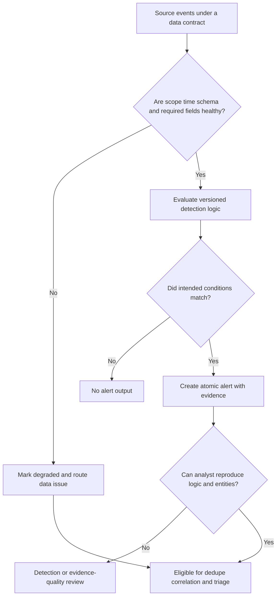

## Event, alert, story, case, and incident grains

Many correlation errors are actually grain errors. One endpoint event can contribute to two alerts. Two alerts can contribute to one story. One story can be one case, but a case may contain several stories during investigation. A customer may declare one incident that contains several cases or affected business services. Counting rows without defining the grain produces misleading volume, precision, and response metrics.

| Object | One record represents | Changes when | Should not be confused with |
|---|---|---|---|
| Event | One source observation | Source emits another observation | Alert or conclusion |
| Detection match | One analytic evaluation result | Logic/window produces another match | Analyst decision |
| Alert | One notification for a logical match under dedupe policy | New logical alert identity | Raw event count |
| Story | One evolving correlated threat hypothesis and evidence set | Story versions update; split/merge controlled | Confirmed incident |
| Case | One governed work container | Tasks, owner, state, evidence evolve | Threat truth itself |
| Incident | One customer-declared adverse event | Incident command/governance changes it | Vendor alert severity |
| Action | One requested bounded effect on exact target | New request or state transition | Verified containment outcome |
| Metric | One calculation over defined cohort and period | Definition/data/version changes | Objective truth without denominator |

## Deduplication before correlation

Deduplication asks whether two records represent the same intended logical object. Correlation asks whether distinct objects are meaningfully related. Combining these questions creates mistakes. A repeated delivery of one native alert should usually be deduplicated. Two different detections over the same process may be distinct evidence worth correlating. Two alerts with the same title may concern different tenants, users, devices, or time windows and must remain separate.

Use stable native IDs where possible. If none exists, build a documented key from source scope, detection identity/version, exact entities, event identifiers, and window. Keep delivery duplicates for audit if required while presenting one logical alert. Record why an alert was suppressed or collapsed, because hidden suppression can conceal detection changes or repeated behavior.

| Duplicate pattern | Same logical alert? | Test | Treatment |
|---|---|---|---|
| Connector retries same native ID | Usually yes | Compare immutable source ID and payload/version | One logical alert, retain delivery history |
| Same rule matches same event twice after restart | Likely | Rule/version, event IDs, window, execution ID | Dedupe and fix execution state |
| Same title on two devices | No | Native device and event identities | Separate alerts, maybe correlate later |
| EDR and SIEM alert on same endpoint behavior | No, usually separate detections | Compare source evidence and logic | Preserve both, correlate with overlap note |
| Repeated password failures | Often distinct events/possibly one aggregate alert | Detection aggregation contract | Keep event series and defined alert grain |
| Updated source alert | Same alert with version/state | Native ID and update semantics | Version the logical alert |
| Similar hash on unrelated files | No automatic duplicate | File identity, path, signer, process, time | Separate observations pending correlation |

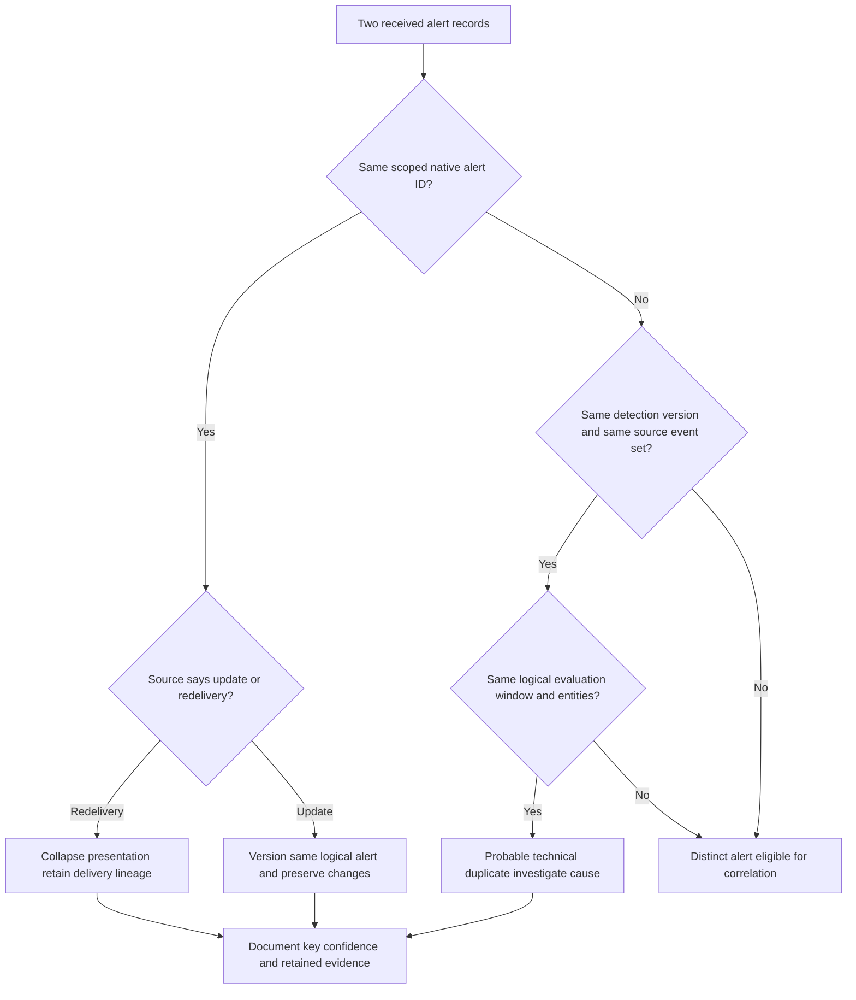

### Plain-English deep-dive 2 - Deduplication removes copies; correlation connects meaning

If a bank emails the same statement twice, those are duplicate deliveries. If the statement and a purchase receipt both refer to the same trip, they are distinct documents that may be correlated. Deleting the receipt as a duplicate would destroy evidence. Treating two emailed copies as separate financial events would inflate activity.

Security data has the same distinction. A retried alert message may be one logical alert. An endpoint alert and an identity alert can describe separate observations that form one hypothesis. The system should retain enough lineage to show what was collapsed, what remained distinct, and why records were connected. Analysts need both a quiet workspace and an auditable evidence trail.

## Entity resolution

Threat stories depend on correct characters. A display name is not a stable identity. Email aliases change. User accounts are disabled or recreated. Hostnames are reused after reimaging. IP addresses are translated and reassigned. Browser sessions, cloud workload identities, service principals, and shared devices create many-to-many relationships. Entity resolution must be scoped by tenant/domain, source, lifecycle, and effective time.

Prefer authoritative/native identifiers, but do not assume one source is authoritative for every attribute. IAM may own account lifecycle; endpoint management may own device enrollment; CMDB may own service relationship; cloud-native inventory may own workload identity; a business owner may attest criticality. Keep source claims and conflict rather than overwriting them into one unexplained record.

| Entity | Weak key | Stronger evidence set | Important temporal issue |
|---|---|---|---|
| Human/user | Display name or email | Directory object ID, tenant, employee/contract reference under policy, aliases | Rename, leave/rejoin, role change |
| Service identity | Account name | Directory/app object ID, tenant, owner, credential/workload relationship | Rotation, recreation, transfer |
| Endpoint | Hostname or current IP | EDR/MDM ID, serial/hardware/cloud ID, enrollment, aliases | Reimage, reassignment, offline stale record |
| Workload | IP or name | Cloud resource ID, account/subscription/project, instance lineage | Ephemeral replacement and scaling |
| App | URL text | App/service ID, tenant, environment, owner, business service | Domain change, multi-tenant service |
| IP | Address alone | Observation point, NAT/proxy/session mapping, time | Reassignment and shared egress |
| File | Filename | Hash plus path, signer, size, source, process context | Same content, different role; mutation |
| Data object | Label/name | Repository/object ID, owner, classification provenance | Classification and ownership changes |

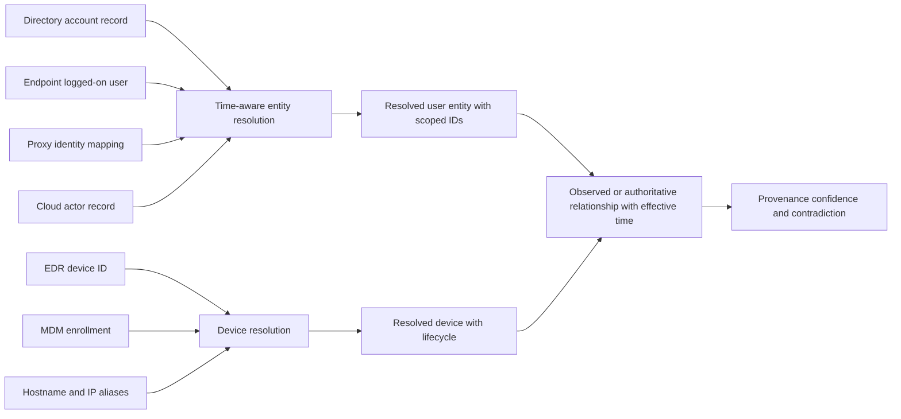

## Temporal correlation and clocks

Security stories are temporal, but one timestamp rarely tells the whole truth. **Event time** is when the source says activity occurred. **Receipt time** is when a collector received it. **Processing time** is when parsing or analytics handled it. **Effective time** is when an entity state or relationship applied. **Update time** is when a source record changed. **Display time** may be localized. Clock drift, buffering, batch delivery, retries, and late cloud records can reorder apparent events.

Use UTC for the working timeline while retaining source timezone and raw value. Estimate clock quality where possible. Correlation windows should be behavior-specific and source-aware. A five-minute window can miss a delayed record; a 24-hour window can merge unrelated activity. Keep the difference between sequence and causation: event A before B does not prove A caused B.

| Time concept | Example question | Correlation risk | Guardrail |
|---|---|---|---|
| Source event time | When did the source record activity? | Bad source clock | Compare trusted time and neighboring events |
| Receipt time | When did pipeline receive it? | Delay mistaken for activity sequence | Track latency distribution |
| Processing time | When did analytic evaluate it? | Backfill creates late alerts | Mark replay/backfill |
| Effective time | When did role/owner/policy apply? | Current context attached to old event | Temporal joins |
| Update time | When did source revise record? | Mutable alert appears new | Version same logical object |
| Display time | Which timezone did user see? | Human timeline disagreement | Show UTC and explicit conversion |
| Window | Which time distance permits a relationship? | Too narrow misses; too broad merges | Validate behavior and source latency |
| Sequence confidence | How reliable is relative order? | Causal language from uncertain clocks | State order uncertainty |

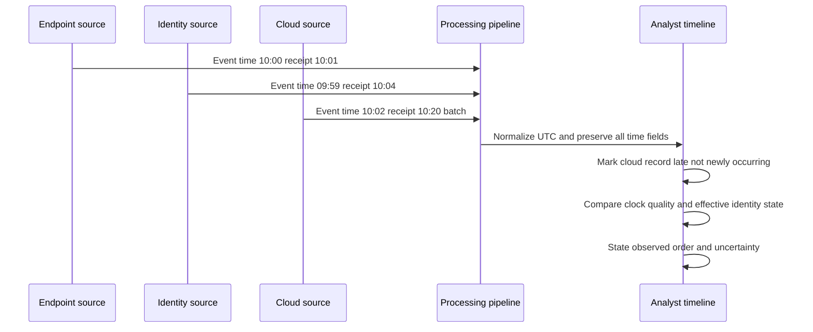

## Correlation dimensions

Strong correlation usually combines several independent dimensions rather than one shared field. Identity says who or what. Temporal proximity says when. Behavioral sequence says whether actions form a meaningful progression. Infrastructure says whether network, domain, file, or tool indicators relate. Topology says which entity can reach or trust another. Campaign/threat intelligence says whether patterns align with known activity, but intelligence is not occurrence proof. Business context says why the activity may matter.

| Dimension | Example relationship | Evidence requirement | Common trap |
|---|---|---|---|
| Identity | Same scoped user/session/device | Native IDs, aliases, lifecycle, time | Same display name |
| Time | Events occur within meaningful interval | Source/receipt time and latency | Arbitrary large window |
| Behavior | Execution followed download and auth | Source-linked observations and plausible order | Sequence equals causation |
| Infrastructure | Same domain/IP/certificate/file | Time, sharing, reputation, provenance | Shared cloud/CDN indicator |
| Topology | Device can reach app or identity controls resource | Policy, route, session, cloud relationship | Configured relationship equals observed use |
| Technique | Events align with an adversary technique | Observable behavior and mapping rationale | ATT&CK label as proof |
| Campaign | Intelligence relates infrastructure/procedure | Source reliability, relevance, freshness | External report equals local compromise |
| Business | Entity supports critical service/data | Authoritative owner/criticality/context | Vendor-assigned importance |
| Control | Preventive/detective action affected path | Control-native state and observed result | Installed equals effective |

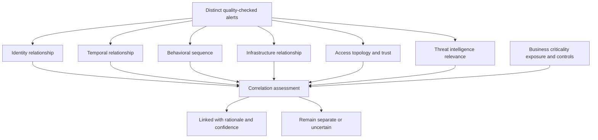

### Plain-English deep-dive 3 - Correlation is a falsifiable argument

Suppose two travel receipts share the surname "Patel." That is weak evidence they belong to one trip. If they share the same booking reference, traveler identity, dates, route, and payment account, the relationship is stronger. If one receipt is in a different country at an impossible overlapping time, the contradiction matters. A good investigator can state what would disprove the grouping.

Security correlation should be equally challengeable. "These alerts belong together because the same immutable device and user session performed a plausible sequence within a validated window" is an argument. "The platform grouped them" is not. The story should retain link reasons, source references, confidence, and split criteria. A story that cannot be split when evidence changes is an administrative container, not a trustworthy analytical model.

## Timeline construction

A useful timeline is concise at the top and deep underneath. Each row should identify UTC, time quality, source/native ID, observation, entities, evidence class, interpretation, confidence, and story relevance. Decisions and actions belong on the same timeline but must be labeled so that human response is not mistaken for adversary activity.

Start with anchor events. Expand only enough before and after each anchor to test hypotheses. Keep duplicate delivery separate from logical activity. Identify gaps explicitly. If a source was unavailable, show the interval. Use story versions so later evidence does not rewrite what analysts knew at an earlier decision point.

| Timeline field | Purpose | Example neutral syntax | Avoid |
|---|---|---|---|
| UTC and source time | Establish comparable sequence | "Source reported 10:02 UTC; received 10:20 UTC" | Hidden local time |
| Native source/ID | Enable reproduction | "EDR event E-104" | Screenshot-only proof |
| Observation | State direct record | "Process created child process" | "Attacker executed" without identity proof |
| Entity | Bind exact scoped object | "Device ID D-44; alias host-x" | Current hostname only |
| Evidence class | Separate fact/inference/assumption | "Source observation" | Mixed narrative |
| Interpretation | Explain relevance | "Consistent with scripted discovery" | "Confirmed compromise" too early |
| Confidence | Show support for this claim | "High identity; medium sequence" | One overall percentage |
| Gap/contradiction | Preserve uncertainty | "Identity source delayed 18 minutes" | Silent omission |
| Decision/action | Record human response | "Analyst requested approval" | Merge with hostile behavior |

## Graphs and attack paths

A graph represents entities as nodes and relationships as edges. It can help an analyst pivot from a user to sessions, devices, apps, alerts, vulnerabilities, controls, business services, and data. Graph usefulness depends on edge meaning. "Logged on to," "owns," "can access," "communicated with," "alerted on," and "supports business service" are different relationships with different evidence and time.

An attack path may combine observed edges, configured edges, inferred edges, and unknown prerequisites. Display these differently. An observed authentication does not prove an exploit. A configured permission does not prove it was used. A network route does not prove application authorization. An attack-path view is a decision aid, not a photograph of an intrusion.

| Edge state | Meaning | Evidence | Allowed statement |
|---|---|---|---|
| Observed | Source recorded the relationship/action | Native event with entities and time | "This communication/authentication was observed" |
| Configured | Policy/configuration permits or defines relationship | Authoritative configuration effective at time | "This access was configured/allowed in principle" |
| Inferred | Evidence suggests relationship but does not directly record it | Reasoned association with confidence | "Evidence is consistent with" |
| Demonstrated | Authorized test established bounded behavior | Approved method, result, conditions | "Test demonstrated under these conditions" |
| Contradicted | Evidence challenges the edge | Source conflict or impossible condition | "This path step is currently disputed" |
| Unknown | Evidence cannot establish the edge | Missing/unhealthy/out-of-scope source | "This prerequisite remains unknown" |

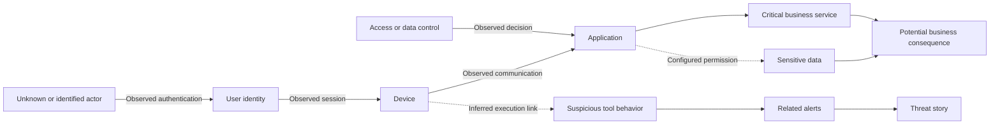

## Confidence without fake precision

Confidence answers how strongly evidence supports a particular assertion. It is not severity, probability of breach, model accuracy, or business impact. Confidence can differ by claim: high confidence that three events belong to device D-44, medium confidence that one identity initiated them, low confidence that the behavior was malicious, and unknown confidence about data access due to a missing source.

Use a small qualitative scale with explicit criteria unless a validated quantitative model has a defined meaning. Record evidence for and against, source reliability, directness, corroboration, contradiction, freshness, and coverage. Never average unrelated dimensions into one impressive number.

| Confidence level | General meaning | Required communication | Decision implication |
|---|---|---|---|
| High | Multiple reliable direct sources support claim; material alternatives challenged | State bounded claim and remaining limits | Can support stronger action if impact/authority also justify |
| Medium | Credible evidence supports claim but alternatives or gaps remain | Name decisive missing evidence | Investigate or use reversible containment where warranted |
| Low | Limited/indirect evidence; several plausible alternatives | Present as hypothesis, not fact | Prefer discriminating checks and monitoring |
| Unknown | Required evidence unavailable, unhealthy, or out of scope | State exactly why unknown | Escalate data gap or make risk decision under uncertainty |
| Contradicted | Reliable evidence conflicts | Display both claims and owner | Do not silently choose convenient result |

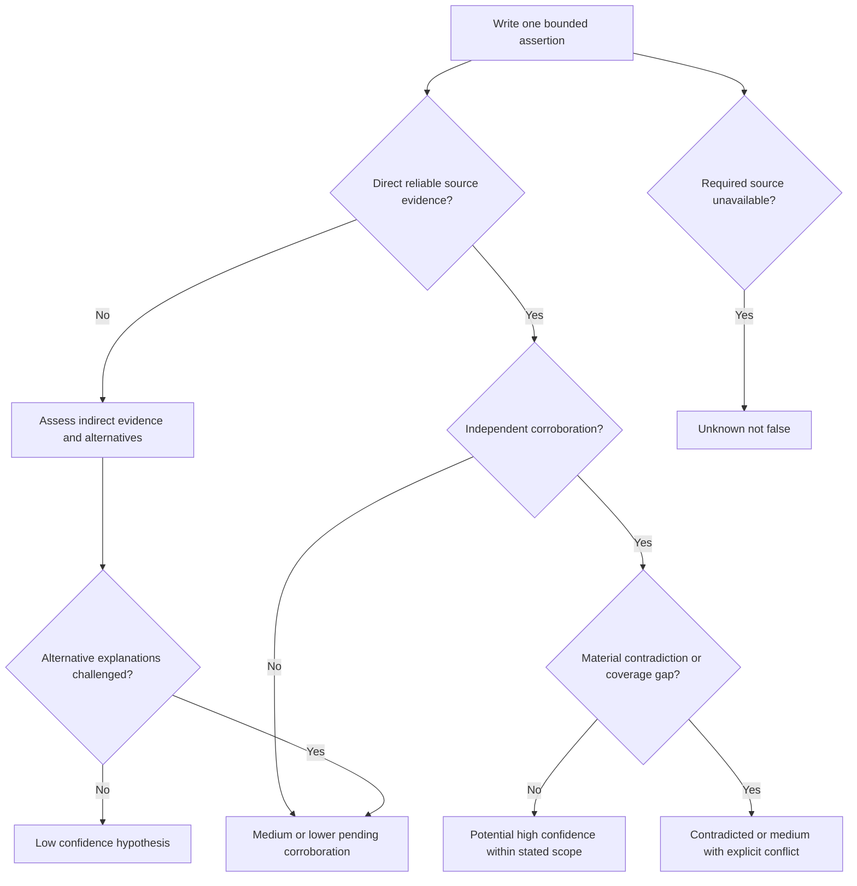

## Scope and blast radius

Scope has several populations. **Observed scope** contains entities present in evidence. **Affected scope** contains entities with established adverse effect under customer criteria. **At-risk scope** contains entities sharing relevant exposure or relationship. **Checked scope** contains entities actually searched with healthy data and method. **Unknown scope** contains missing, unhealthy, or out-of-scope populations. These populations should not be collapsed.

Start from known entities, then pivot through bounded relationships: same identity sessions, same device users, same indicator, same application, same permission, same vulnerable cohort, same network segment, same business process, or same data repository. Track both positive and negative results. A search with no hits is meaningful only for the covered population, time, fields, and detection method.

| Scope class | Question | Denominator | Safe statement |
|---|---|---|---|
| Observed | Which entities appear directly in relevant records? | Available relevant records | "Three devices are observed in evidence" |
| Affected | Which entities meet customer impact/compromise criteria? | Assessed observed entities | "One account meets the declared criterion" |
| At risk | Which entities share the required exposure/path? | Defined exposure population | "Twenty devices share the tested condition" |
| Checked | Which entities were searched with healthy evidence? | Eligible healthy population | "Eighteen of twenty were checked" |
| No evidence found | Where did the method return no relevant evidence? | Checked scope and window | "No matching activity was found in the checked set" |
| Unknown | Which entities could not be assessed? | Expected minus healthy checked | "Two offline devices remain unknown" |
| Blast radius | What could be reached or harmed under current hypotheses? | Path and consequence model | "Potential scope includes the service if prerequisite P holds" |

## Business-context enrichment and impact

Business context should come from authoritative or attested sources and retain effective time. Useful context can include service dependency, asset criticality, identity privilege, data sensitivity, customer-facing function, safety implications, regulatory obligations, geographic constraints, recovery requirements, owner, change window, and compensating controls. Stale or contradictory context can make a low-risk alert look urgent or hide a material case.

Technical severity describes a detection or behavior. Business impact describes consequences under customer conditions. A high-severity alert on an isolated test system may have lower immediate business impact than a medium-severity identity signal controlling a critical production service. The answer still depends on confidence, active status, blast radius, and policy.

| Impact dimension | Discovery question | Evidence owner | Overclaim to avoid |
|---|---|---|---|
| Service | Which customer process depends on this entity? | Service/application owner | Asset tag alone proves outage |
| Data | Which data could be viewed, changed, destroyed, or transferred? | Data owner and source evidence | Sensitive repository means data accessed |
| Identity | What effective privilege and sessions exist? | IAM/PAM/app owner | Group membership means privilege used |
| Customer | Which users/partners are affected? | Business/service owner | Technical alert equals customer impact |
| Financial | Which modeled cost categories may apply? | Risk/finance under approved model | Exact loss prediction |
| Legal/privacy | Which obligations or notification decisions may apply? | Legal/privacy | Analyst declares breach obligation |
| Safety | Could action or incident affect physical safety? | Safety/operations authority | Generic containment without review |
| Recovery | What restoration dependencies and objectives exist? | Service continuity owner | Isolation has no business cost |
| Reputation | Which stakeholder trust consequences are plausible? | Executive/communications | Guaranteed reputational damage |

### Plain-English deep-dive 4 - Business context changes the queue, not the evidence

An alarm in a storage closet and an alarm in an operating theatre may use the same sensor. The operating theatre requires faster coordination because the consequence is different. That does not make the sensor reading more factually certain. Criticality changes urgency and response planning; it should not rewrite weak technical evidence into a confirmed incident.

The opposite is also important. A critical label can be stale. An asset may have moved to a lab, or a service may have changed owners. Threat stories should show context source, effective time, and confidence. When context is disputed, the analyst should preserve the technical story and open a context-quality check rather than choosing whichever label produces the most dramatic priority.

## Severity, priority, and confidence

These three concepts answer different questions. Severity asks how serious the technical behavior or condition could be. Priority asks what should receive attention first under current urgency, impact, active state, confidence, controls, and capacity. Confidence asks how strongly evidence supports a claim. A low-confidence but potentially catastrophic active scenario may justify rapid reversible precautions. A high-confidence minor policy violation may be lower priority.

| Dimension | Question | Typical inputs | Output use |
|---|---|---|---|
| Technical severity | How harmful is this behavior/condition if true? | Detection logic, technique, privilege, action | Initial classification |
| Business impact | What customer consequence is plausible or observed? | Service, data, people, obligations, recovery | Escalation and communication |
| Urgency | Is activity active, time-sensitive, or expanding? | Recency, continuation, threat context | Queue and containment timing |
| Scope | How many/which entities are affected, at risk, checked, unknown? | Pivots and coverage | Resource and response design |
| Confidence | How strongly is each assertion supported? | Reliability, directness, corroboration, conflict | Decision risk and next checks |
| Control state | Which safeguards interrupt or observe the path? | Policy, health, test, decision evidence | Residual and containment options |
| Priority | What receives scarce attention now? | Combined customer policy and capacity | Work order and escalation |

## Evidence and hypothesis ledger

The ledger prevents a story summary from becoming its own evidence. For each claim record supporting observations, contradicting observations, assumptions, unknowns, confidence, next check, owner, and decision relevance. Separate malicious, benign, policy-error, data-defect, and simulation hypotheses where plausible.

| Ledger field | Purpose | Example neutral entry |
|---|---|---|
| Claim | One bounded testable assertion | "Device D-44 initiated session S-9" |
| Supporting evidence | Source-linked facts | Endpoint and gateway records share device/session mapping |
| Contradicting evidence | Facts challenging claim | MDM says device retired before event |
| Assumptions | Conditions not established | Gateway mapping clock assumed within two minutes |
| Unknowns | Required missing facts | Reimage/reassignment history unavailable |
| Alternatives | Other explanations | Reused hostname; stale gateway mapping |
| Confidence | Support for this claim | Medium |
| Next discriminating check | Cheapest safe separator | Retrieve enrollment and certificate lineage |
| Owner/checkpoint | Accountability and time | Endpoint owner; next review 14:00 UTC |
| Decision relevance | Why this matters | Determines correct containment target |

## Threat-story structure

A concise story can use the following layers. First, one sentence states current situation without causal overreach. Second, the entity and time scope identifies what is observed and unknown. Third, the timeline lists decisive evidence. Fourth, the narrative explains the strongest hypothesis and alternatives. Fifth, business context states potential or observed consequence. Sixth, current controls and actions are described. Seventh, confidence is assigned per key claim. Finally, owner, next discriminating check, authority, and checkpoint make the story actionable.

| Story section | Question answered | Quality criterion |
|---|---|---|
| Headline | What bounded situation requires attention? | Observation plus significance, no unsupported conclusion |
| Entities | Who/what exactly is involved? | Stable IDs, aliases, lifecycle, owners |
| Time | When did relevant observations and decisions occur? | UTC, time quality, late data visible |
| Evidence | Which source facts support the story? | Native references and lineage |
| Correlation | Why do distinct alerts belong together? | Dimensions, windows, alternatives, confidence |
| Timeline/path | What sequence and relationships are observed/inferred? | Edge states and gaps visible |
| Scope | What is observed, affected, at risk, checked, and unknown? | Denominators and blind spots |
| Impact | What business consequence is plausible/observed? | Customer-authoritative context |
| Decision | What has been decided and by whom? | Authority and rationale |
| Next | What check/action separates branches? | Owner, due time, safe method |

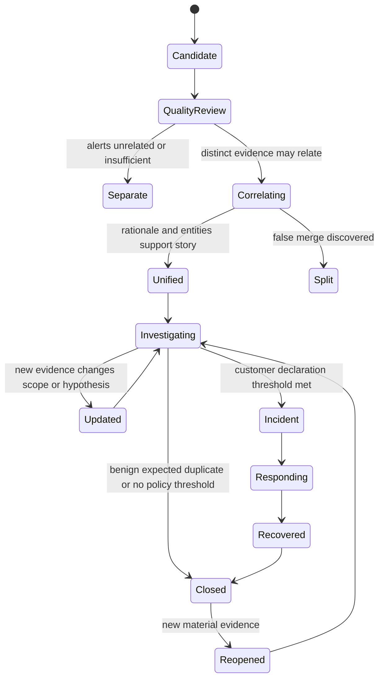

## Human and agentic assistance

AI or agentic functions may help group alerts, retrieve context, build timelines, summarize evidence, propose hypotheses, recommend pivots, and draft next steps. The public Zscaler page positions agentic triage and investigation in this area. Assistance must remain grounded in accessible evidence and current authorization. An agent-generated relationship is a hypothesis unless source evidence establishes it.

Validate completeness and correctness. Did the summary omit a contradiction? Did it join an alias across tenants? Did it turn "denied" into "performed"? Did it confuse alert time with event time? Did it state potential data access as exfiltration? Did it recommend an action that is unsupported, unauthorized, or too broad? Preserve prompt/task, tool calls or retrieval references as available, output version, reviewer, corrections, and decision.

| Agentic task | Useful assistance | Required validation | Human boundary |
|---|---|---|---|
| Alert grouping | Suggest related alerts and duplicate candidates | Source IDs, entity/time logic, split criteria | Analyst accepts/rejects grouping |
| Enrichment | Retrieve asset, identity, exposure, and business context | Authority, freshness, provenance, conflict | Owner validates material context |
| Timeline | Order source-linked events | Time fields, late data, omissions, duplicates | Analyst approves decisive sequence |
| Summary | Compress evidence and unknowns | Sentence-level citation and entailment | Analyst owns communicated narrative |
| Hypotheses | Propose plausible explanations | Alternatives, safety, discriminating checks | Analyst chooses investigation path |
| Priority | Apply business/risk context | Drivers, policy, stale context, override | Customer policy owns queue decision |
| Response recommendation | Suggest right-sized options | Capability, target, authority, blast radius, rollback | Authorized role approves action |
| Feedback | Suggest tuning and data corrections | Reviewed outcomes and unintended effects | Capability owner changes production logic |

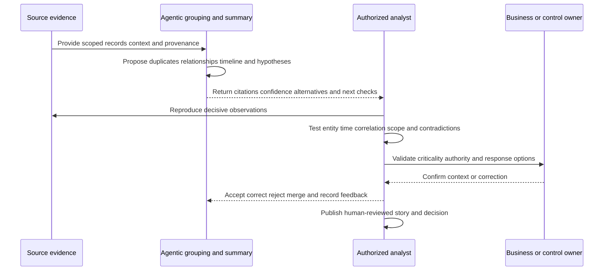

### Plain-English deep-dive 5 - A fluent summary can be less trustworthy than a rough timeline

A polished witness statement may sound coherent while combining two people, omitting a conflicting time, and assuming motive. A rough table with names, times, source documents, and question marks can be more useful because every claim is visible and challengeable. Fluency is a presentation property, not an evidence property.

AI-generated threat stories should therefore be judged by traceability, not prose quality. Require citations or direct source references, represent unknowns, compare the summary to the timeline, and sample excluded evidence. The analyst must be able to reproduce the conclusion without trusting the language model. Where access or privacy policy prevents the agent from seeing a source, that blind spot should be explicit.

## Story operations, handoff, and versioning

A story evolves. New evidence can change entity resolution, split one story into two, merge previously separate stories, raise or lower confidence, expand scope, or invalidate business context. Version important changes. Record who changed grouping, why, which evidence arrived, how priority changed, and which actions remain safe.

Handoff must include current headline, exact entities, UTC window, decisive observations, active hypotheses, contradictions, observed/affected/at-risk/checked/unknown scope, actions and results, authority, next check, escalation threshold, update deadline, and sensitive-data handling. The receiver should verify links, repeat back, and accept ownership.

| Operational event | Required record | Quality risk |
|---|---|---|
| Merge | Source stories, rationale, entities, time, reviewer | Hides separate incidents |
| Split | New story IDs, evidence allocation, reason, cross-links | Loses shared evidence |
| Priority change | Driver change, policy, approver, time | Opaque queue manipulation |
| Context correction | Old/new value, source, effective time, affected decisions | History rewritten silently |
| Confidence change | Claim, new evidence, alternatives resolved/open | Overall score changes without explanation |
| Scope expansion | Pivot method, denominator, positives, unknowns | "All affected" without coverage |
| Response | Target, authority, request, result, read-back, rollback | Action status treated as outcome |
| Handoff | State, evidence, next check, authority, acceptance | Context loss or duplicate action |
| Closure/reopen | Criteria, residual, feedback, trigger | Premature permanent closure |

## Troubleshooting wrong stories

Begin with one wrong relation or missing alert, not the whole narrative. Capture story ID, version, alert/source IDs, entities, UTC, expected and actual grouping, impact, and first-known occurrence. Then trace source quality, deduplication, entity resolution, time, correlation, enrichment, ranking, presentation, and case synchronization.

| Symptom | Cheap discriminating check | Likely layer | Evidence packet |
|---|---|---|---|
| Two people merged | Compare scoped immutable identity IDs and effective-time aliases | Entity resolution | Directory/source IDs and alias history |
| One incident split | Compare shared events/entities/windows and suppression | Correlation/dedupe | Detection and grouping rationale |
| Timeline impossible | Compare event/receipt/update times and clock quality | Time normalization | Raw times, timezone, latency |
| Story says successful action; source says denied | Inspect source event semantics and mapped outcome | Parsing/summary | Native record and mapping version |
| Priority unexpectedly high | Inspect business context source/effective time and drivers | Enrichment/ranking | Context lineage and policy version |
| Scope too small | Review pivot population and missing-source intervals | Coverage/investigation | Denominators and source health |
| AI summary omits contradiction | Compare included/excluded evidence and citations | Retrieval/summarization | Input set, output, reviewer correction |
| Closed story reappears | Compare logical alert/story keys and update semantics | Dedupe/case state | IDs, versions, reopen policy |

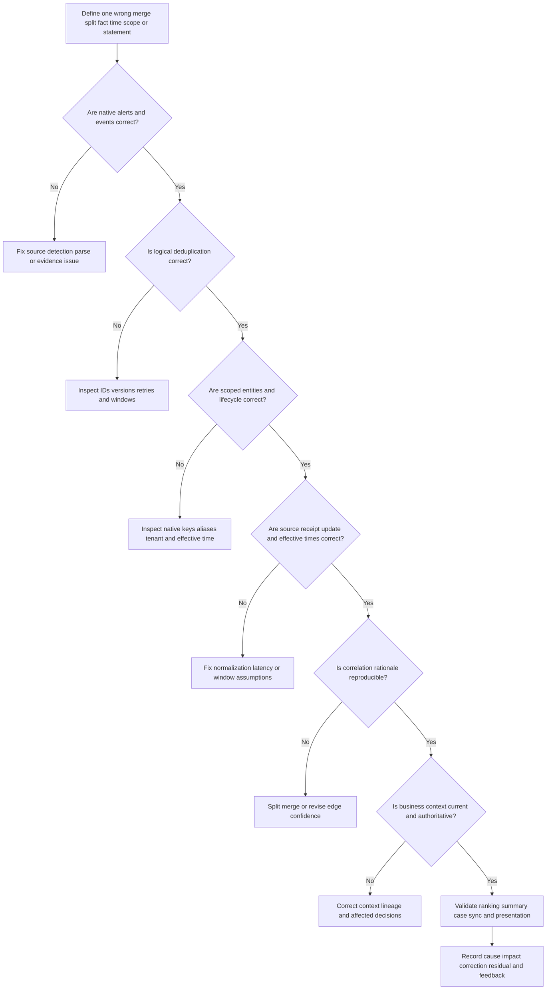

## Security, privacy, and evidence governance

Threat stories concentrate sensitive information and accusations. Limit access by role and purpose. Minimize personal and data content. Separate test from production. Protect exports and communications. Apply retention, legal hold, regional, labor, privacy, and evidence requirements. Audit viewing, changes, merges/splits, priority overrides, and actions where appropriate. Correct wrong entity associations promptly while preserving required audit history.

Do not expose sensitive identity, health, financial, legal, or investigation context to every integrated tool merely because enrichment is technically possible. Agents and third-party services should receive only approved data for the task. Prompt injection and malicious content can appear inside logs, tickets, webpages, or files; treat retrieved content as untrusted evidence, not instructions.

| Governance risk | Harm | Control | Validation |
|---|---|---|---|
| Wrong-person merge | Unfair action and privacy breach | Strong scoped identity, human review, correction path | Alias/recycled-account tests |
| Overbroad story access | Sensitive investigation disclosure | Purpose-based least privilege | Access review and audit sample |
| Excess enrichment | Personal/business data spreads unnecessarily | Field/task minimization and masking | Data-flow inventory review |
| AI prompt injection | Evidence text manipulates agent behavior | Separate instructions/data, tool allowlist, output validation | Adversarial test cases |
| Unsupported accusation | Narrative harms person/vendor | Observation/inference syntax and legal process | Story quality review |
| Evidence alteration | Decisions cannot be reconstructed | Provenance, versioning, protected originals | Reproduction exercise |
| Premature deletion | Legal/incident evidence lost | Retention and hold policy | Deletion/hold test |
| Excess retention | Privacy and breach impact increase | Purpose-based retention and deletion | Periodic cohort cleanup |
| Action leakage | Story reader can execute high-impact control | Separation of view/recommend/approve/execute | Role and negative-permission test |
| Cross-tenant leak | Data/action reaches wrong customer scope | Tenant binding and immutable identifiers | Isolation tests |

## Failure modes and misconceptions

| Misconception or failure | Why it fails | Better practice |
|---|---|---|
| More alerts mean a stronger story | Repeated or dependent alerts may add no independent evidence | Evaluate source independence and meaning |
| Same IP means same device | NAT, proxy, reuse, and shared infrastructure break identity | Use time-aware source mappings |
| Same username means same human | Shared/recreated/service accounts exist | Resolve scoped immutable identity and lifecycle |
| Chronology proves causality | A before B may be coincidence or delayed data | State sequence and test causal prerequisites |
| One risk score states truth | Severity, confidence, impact, and priority differ | Expose drivers and claim-level confidence |
| Attack path means observed intrusion | Edges may be configured, inferred, or unknown | Label every edge state |
| No hits means no activity | Coverage, method, time, and data health bound the result | State checked and unknown populations |
| Critical asset makes alert true | Criticality changes urgency, not technical certainty | Keep impact and confidence separate |
| AI summary is evidence | It is a transformation that can omit or invent | Reproduce source-linked claims |
| Unified story should never split | New evidence can reveal false merge | Version and support reversible grouping |
| Closing all component alerts closes incident | Administrative state is not response proof | Apply customer closure postconditions |
| Business context is always current | CMDB/HR/service mappings drift | Preserve authority and effective time |
| Contradiction lowers quality | Visible conflict can improve investigation honesty | Surface and assign the conflict |
| ATT&CK mapping proves maliciousness | Technique knowledge does not establish local occurrence | Use mapping as a behavior vocabulary |

## Explicitly fictional and synthetic NMH threat-story case

Everything in this section is an explicitly fictional and synthetic NMH teaching scenario. Every date is a labeled fictional future date later than the 2026-08-24 source snapshot. Nothing is a customer fact, Zscaler output, production result, or prediction.

On fictional future date **2026-09-21**, fictional synthetic NMH receives five invented alerts. A test identity shows a fictional unusual authentication. A test endpoint produces a fictional script-execution alert. A fictional web-control record shows a newly observed destination. A fictional cloud source records a denied permission change. A fictional data source reports an unusually large read count from a synthetic repository. The alerts arrive in different order because the fictional cloud source is delayed.

At first, a shared display name causes two identities to appear related. Native fictional directory IDs show they are separate: one is a current lab contractor, and one is a disabled service account retained in a synthetic archive. The endpoint and web events belong to the lab contractor. The cloud denied action belongs to the archived service account and must split into a separate story. The data-read signal belongs to an approved synthetic performance test but initially lacks its change reference.

| Fictional synthetic atom | Direct teaching observation | Initial hypothesis | Decisive check |
|---|---|---|---|
| Identity alert A-101 | New authentication pattern for lab identity U-17 | Compromised contractor identity | Verify native ID, device, session, approved lab plan |
| Endpoint alert A-102 | Script chain on device D-44 | Discovery or test automation | Inspect parent chain and signed test package |
| Web event E-103 | Destination reached through test policy | Possible command-and-control | Resolve destination ownership and lab allowlist |
| Cloud alert A-104 | Denied permission action by U-88 | Privilege attempt in same story | Native ID proves different archived identity |
| Data alert A-105 | High synthetic repository read count | Potential collection | Check performance-test change and data classification |

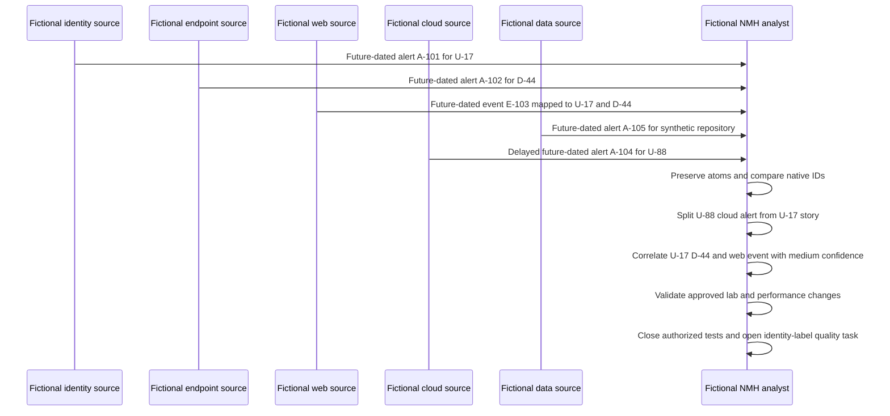

The fictional synthetic story headline becomes: "Three source observations involve lab identity U-17 and test device D-44 during an authorized exercise; one delayed cloud alert belongs to archived identity U-88 and has been split; no successful privilege change or production data access is observed in covered synthetic sources." Confidence is high for entity separation, high for the denied cloud action, medium for the endpoint-to-destination behavior until the test owner validates it, and unknown outside the explicitly checked lab population.

The case demonstrates that a smaller, more accurate story is better than a dramatic unified one. It also demonstrates the value of contradictory identity evidence, late-arriving records, business-context validation, and claim-specific confidence. No containment is performed because the scenario is an approved synthetic exercise after validation.

## Practical scenarios and decision drills

### Scenario 1 - Ten identical alerts arrive after connector recovery

Compare native IDs, update semantics, source event sets, rule execution IDs, and delivery history. Collapse only transport duplicates. Preserve distinct evaluation results and investigate replay behavior. Do not use title and timestamp alone.

### Scenario 2 - Endpoint and identity alerts share a username but not a directory ID

Keep stories separate until alias/lifecycle evidence explains the difference. Check tenant, domain, account recreation, service/shared identity, and effective time. A false merge could cause wrong-user containment.

### Scenario 3 - The attack-path graph shows a route to sensitive data

Inspect every edge as observed, configured, inferred, demonstrated, contradicted, or unknown. Ask whether the path was used and whether controls interrupted it. Communicate potential exposure separately from observed access.

### Scenario 4 - Business criticality changes during the investigation

Version the context, identify its authoritative source and effective time, recalculate priority under policy, and record which decisions were affected. Do not rewrite the prior story as though analysts always knew the new value.

### Scenario 5 - AI groups two incidents across a wide time window

Ask for grouping rationale, source references, entity lifecycle, temporal assumptions, and split criteria. Compare a narrower behavior-specific window. Reject the merge if shared infrastructure is the only link.

### Scenario 6 - No additional events are found during scoping

State the query/method, time window, eligible population, healthy checked population, exclusions, and unknowns. "No evidence found in 92 of 100 covered devices" is meaningful; "no other impact" is not.

### Scenario 7 - Executive asks, "Were data stolen?"

Separate access, read, transfer attempt, allowed transfer, external receipt, sensitivity, authorization, and customer declaration. Give the strongest bounded statement and next evidence. Avoid translating a data alert directly into exfiltration.

### Scenario 8 - Story priority is high but confidence is low

Consider potential consequence, active status, reversible safeguards, evidence-preservation needs, and authority. Low confidence does not always mean wait; it means response must account for decision risk and uncertainty.

## Artifact kit

| Artifact | Minimum content | Quality gate | Interview value |
|---|---|---|---|
| Alert quality card | Source, rule/version, evidence, entities, times, health, owner | Alert reproducible | Shows detection literacy |
| Logical dedupe specification | Native IDs, keys, update/retry semantics, audit | Distinct evidence retained | Shows grain discipline |
| Entity-resolution ledger | Native keys, aliases, lifecycle, effective time, confidence | Shared/recycled tests pass | Shows identity safety |
| Correlation rationale | Dimensions, window, supporting/conflicting evidence, split rule | Falsifiable relationship | Shows analytical rigor |
| UTC timeline | Source/receipt/effective times, native IDs, observations, decisions | Late data and gaps visible | Shows investigation skill |
| Graph edge dictionary | Relationship semantics, direction, source, time, state | No decorative unexplained edges | Shows graph literacy |
| Attack-path worksheet | Entry, objective, prerequisites, edge states, controls, residual | Potential versus observed separated | Shows exposure-to-incident thinking |
| Confidence ledger | Claim-level evidence, alternatives, confidence, next check | No fake precision | Shows calibrated judgment |
| Scope matrix | Observed, affected, at-risk, checked, unknown populations | Denominators explicit | Shows blast-radius discipline |
| Impact brief | Service, data, identity, legal/privacy, recovery context | Customer authority identified | Shows business translation |
| Threat-story template | Headline through next check and checkpoint | Every sentence traceable | Shows communication skill |
| Agentic validation rubric | Grouping, citations, omissions, entity/time, recommendation checks | Human reviewer and corrections recorded | Shows responsible AI thinking |
| Story handoff | State, evidence, hypotheses, scope, action, next, authority, acceptance | Receiver can act without rereading | Shows operations maturity |
| Wrong-correlation packet | IDs, version, expected/actual, samples, impact, reproduction | Minimal and redacted | Shows Support partnership |
| Story quality dashboard | Merge/split corrections, citation, entity, timeline, scope, outcome metrics | Denominators and incentives reviewed | Shows analytics capability |

## Safe exercises

All exercises use fictional, synthetic, or sanitized data and perform no production action.

1. Create twelve atomic alerts from endpoint, identity, network, cloud, and data sources with source and receipt time.
2. Mark which alert deliveries are duplicates and which are distinct detections of the same behavior.
3. Build a dedupe key and test update, replay, retry, same-title/different-device, and backfill cases.
4. Resolve synthetic users with aliases, reused email, disabled/recreated accounts, and cross-tenant display names.
5. Resolve devices with hostname reuse, reimage, current IP reuse, and separate EDR/MDM identifiers.
6. Construct a UTC timeline containing late, duplicated, and clock-drifted records.
7. Correlate alerts using identity, time, behavior, infrastructure, topology, threat, and business dimensions. Document one rejected correlation.
8. Draw a graph whose edges are explicitly observed, configured, inferred, contradicted, and unknown.
9. Write three claim-level confidence assessments without percentages.
10. Define observed, affected, at-risk, checked, and unknown scope for one synthetic case.
11. Produce a one-paragraph executive story that distinguishes attempted, denied, successful, and unknown actions.
12. Split one deliberately over-grouped story and preserve cross-links and audit history.
13. Merge two under-grouped stories only after writing a falsifiable rationale and split criterion.
14. Review an AI-generated story for unsupported causality, wrong identity, time confusion, omitted contradiction, and excessive response.
15. Create a story handoff and have another person or self-review rubric identify the next check without rereading raw data.
16. Build a Power BI-style semantic design for alerts, entities, stories, story-alert bridges, decisions, actions, and story versions.
17. Draft a wrong-correlation escalation packet with redacted native IDs and minimum reproducing evidence.
18. Explain the story aloud using neutral syntax and explicitly state that the practice data is synthetic.

## TSM discovery and quality questions

1. What does one alert, story, case, and incident represent in each current system?
2. Which native IDs, timestamps, rule versions, entities, and source links are preserved?
3. How are retries, updates, replays, backfills, suppression, and logical duplicates handled?
4. Which identifiers and effective-time sources resolve users, devices, apps, workloads, and data?
5. Which correlation dimensions and behavior-specific windows drive grouping?
6. Can analysts see and challenge why alerts merged, split, ranked, or changed?
7. How are observed, configured, inferred, demonstrated, contradicted, and unknown graph edges distinguished?
8. Which business criticality, privilege, exposure, control, and data context sources are authoritative and fresh?
9. How are severity, confidence, impact, urgency, scope, and priority kept separate?
10. Which source-health gaps are visible inside the story rather than hidden on another dashboard?
11. How are AI summaries grounded, cited, reviewed, corrected, and prevented from acting as evidence?
12. Who can merge, split, reprioritize, declare, contain, close, reopen, and communicate?
13. How is story quality measured without rewarding fewer alerts or faster closure at the expense of accuracy?
14. What evidence is retained for Support/Product when a grouping, timeline, context, or summary appears wrong?
15. Which exact current Zscaler capabilities, integrations, licensed sources, and response boundaries require verification?

## Official Source Anchors

Research/source snapshot and source review date: **2026-08-24**.

The Zscaler sources support current public product positioning only. General alert, evidence, graph, incident, and zero-trust methods are not claims about proprietary internals. No public marketing statement proves a customer's configuration, data quality, entitlement, model output, autonomy, response, or outcome.

| Source | URL | Used for | Boundary |
|---|---|---|---|
| Zscaler Agentic Security Operations | https://www.zscaler.com/products-and-solutions/security-operations | Public first/third-party alert context, unified threat stories, business enrichment, risk priority, summaries, evidence, timelines, attack-path context, guided response | No invented schema, correlation, score, UI, field, agent, action, entitlement, metric, or result |
| Zscaler Data Fabric for Security | https://www.zscaler.com/products-and-solutions/data-fabric | Public harmonization, deduplication, correlation, enrichment, business logic, and feedback context | Exposure-focused positioning; no hidden Agentic SOC implementation inferred |
| Zscaler Zero Trust Exchange | https://www.zscaler.com/products-and-solutions/zero-trust-exchange-zte | Public identity/context/business-policy and inline zero-trust foundation context | No specific story field or response action inferred |
| NIST SP 800-61 Rev. 3 | https://csrc.nist.gov/pubs/sp/800/61/r3/final | Incident-response analysis, response, recovery, and improvement context | Organizations tailor procedures and authority |
| NIST Cybersecurity Framework 2.0 | https://www.nist.gov/cyberframework | Govern, Identify, Protect, Detect, Respond, Recover outcomes | Voluntary and outcome-oriented |
| MITRE ATT&CK | https://attack.mitre.org/ | Behavior/tactic/technique vocabulary for hypotheses and coverage | Mapping is not proof of occurrence or detection |

## Likely Interview Questions

### Q1. What is the difference between an atomic alert and a unified threat story?

**Model answer:** An atomic alert is one detection output: logic matched evidence under a source, entity, time, and version contract. A unified threat story preserves distinct alerts and links them through explainable entity, temporal, behavioral, infrastructure, topology, threat, and business relationships. It adds a source-linked timeline, scope, impact, claim-level confidence, alternatives, decisions, and next checks. Grouping alone does not make a story true or an incident confirmed.

### Q2. How do you deduplicate alerts without losing evidence?

**Model answer:** I separate delivery records from logical alerts. I prefer scoped native IDs and source update semantics; otherwise I use a documented key based on detection version, source event set, entities, and window. I collapse retries or redelivery in presentation while retaining lineage. Distinct detections of the same behavior remain separate atoms that may be correlated. Every suppression or collapse is auditable.

### Q3. What makes correlation defensible?

**Model answer:** It is a falsifiable argument, not a shared field. I verify scoped immutable identities and lifecycle, use behavior-specific time windows and source-latency knowledge, test sequence and relationship semantics, preserve source provenance and contradictions, compare alternatives, and state why the story would split. Multiple independent dimensions strengthen the link; a same name, IP, domain, or ATT&CK label alone is weak.

### Q4. How should a threat-story timeline handle time?

**Model answer:** Preserve source event, receipt, processing, effective, update, and display times; normalize the working timeline to UTC; retain source timezone/raw values; mark clock quality, buffering, backfill, and late arrival. Separate activity from analyst decisions/actions. Sequence does not prove causality, so I state ordering uncertainty and use anchor events plus bounded expansion.

### Q5. How do attack paths and security graphs help an investigation?

**Model answer:** A graph links users, devices, apps, sessions, alerts, vulnerabilities, controls, data, and business services through defined edges. It supports pivots and scope. An attack path connects prerequisites from entry toward an objective. Every edge should be labeled observed, configured, inferred, demonstrated, contradicted, or unknown with source/time/confidence. A possible path is not proof it was used.

### Q6. How do severity, confidence, business impact, and priority differ?

**Model answer:** Severity describes potential technical seriousness. Confidence describes support for a specific assertion. Business impact describes customer consequences to services, data, people, obligations, or recovery. Priority orders attention using those factors plus urgency, active state, scope, controls, policy, and capacity. A critical asset can raise urgency but cannot make weak evidence true.

### Q7. How would you validate an AI-generated threat story?

**Model answer:** Reproduce decisive observations from native sources; verify entity scope and lifecycle; compare event, receipt, and effective time; inspect grouping rationale and excluded alerts; require sentence-level citations; preserve contradictions and unknowns; separate attempted, denied, successful, and potential effects; validate business context; and review recommendations for supported capability, exact target, authority, blast radius, rollback, and read-back. The analyst owns the communicated narrative.

### Q8. How does your background support this work honestly?

**Model answer:** Your production support experience required multi-layer correlation across tenant, identity, permissions, endpoint, network, client, and service evidence; UTC timelines; competing hypotheses; customer impact; escalation; and clear updates. Networking traces support sequence analysis, while SQL and Power BI support grains, joins, windows, reconciliation, and quality. You have studied security threat stories with fictional data; production Zscaler Agentic SOC and SOC investigation remain explicit ramp areas.

## 30-Second Memory Hooks

| Concept | Memory hook |
|---|---|
| Atomic alert | One rule match, not one incident |
| Story | Atoms plus entities, time, relationships, scope, impact, decision |
| Deduplication | Remove copies, preserve distinct evidence |
| Correlation | Falsifiable relationship argument |
| Entity | Stable scoped identity with lifecycle |
| Time | Event, receipt, effective, update, display |
| Timeline | Observations and decisions with source links |
| Graph | Nodes need meaningful sourced edges |
| Attack path | Possible route is not observed travel |
| Confidence | Strength of one claim, not severity |
| Severity | Technical seriousness if true |
| Priority | What receives attention now |
| Scope | Observed, affected, at risk, checked, unknown |
| Business context | Changes urgency, not evidence truth |
| Contradiction | Useful evidence, not an inconvenience |
| AI summary | Transformation to validate, never source proof |
| Next check | Cheapest safe separator among hypotheses |
| Experience bridge | Service correlation transfers; SOC claims do not |

## Completion Checklist

- [ ] I separate official product fact, general security practice, fictional scenario assumption, customer fact, and unknown.
- [ ] I define atomic alert, detection, deduplication, suppression, correlation, entity resolution, timeline, window, graph, path, confidence, scope, impact, and threat story.
- [ ] I preserve native alert/event identifiers, rule versions, source/receipt times, source health, and provenance.
- [ ] I distinguish event, detection match, alert, story, case, incident, action, and metric grains.
- [ ] I separate transport duplicate, logical duplicate, distinct detection, source update, suppression, and correlated evidence.
- [ ] I resolve users, service identities, endpoints, workloads, apps, IPs, files, and data with scoped lifecycle-aware evidence.
- [ ] I use event, receipt, processing, effective, update, and display times correctly.
- [ ] I correlate through explicit identity, time, behavior, infrastructure, topology, threat, business, and control relationships.
- [ ] I treat correlation as a falsifiable argument and retain split criteria.
- [ ] I construct a UTC timeline with late data, gaps, contradictions, decisions, and actions labeled.
- [ ] I label graph/path edges observed, configured, inferred, demonstrated, contradicted, or unknown.
- [ ] I assign confidence to specific claims and avoid fake precision.
- [ ] I distinguish observed, affected, at-risk, checked, no-evidence-found, unknown, and potential blast-radius populations.
- [ ] I add customer-authoritative business criticality, privilege, data, service, obligation, and recovery context with effective time.
- [ ] I keep severity, confidence, business impact, urgency, scope, control state, and priority separate.
- [ ] I maintain an evidence/hypothesis ledger with support, contradiction, assumptions, alternatives, next check, owner, and decision relevance.
- [ ] I write a threat story with headline, entities, time, evidence, correlation, path, scope, impact, confidence, decision, and next step.
- [ ] I validate agentic grouping, enrichment, timeline, summary, hypotheses, priority, response recommendation, and feedback against sources.
- [ ] I version merges, splits, context corrections, confidence changes, scope changes, actions, handoffs, closure, and reopen.
- [ ] I troubleshoot source, dedupe, entity, time, correlation, context, ranking, summary, case, and presentation layers.
- [ ] I protect sensitive stories with purpose, minimization, access, audit, retention, correction, tenant binding, and prompt-injection defenses.
- [ ] I can identify every NMH item and date as explicitly fictional, synthetic, and future-dated.
- [ ] I can create all fifteen artifacts and complete all eighteen exercises without production action.
- [ ] I make no unsupported production Zscaler, Agentic SOC, SOC, correlation, investigation, or response claim.
- [ ] I retain the source review date exactly as 2026-08-24.
- [ ] I can answer all eight interview questions with evidence-bounded language.

[Part 94 - Threat Triage, Investigation, Containment, and Right-Sized Response](Part-94-threat-triage-investigation-response.md)