# Part 94 - Threat Triage, Investigation, Containment, and Right-Sized Response

> **Audience:** Arti Thakur, preparing for a Zscaler Security Operations Technical Success Manager role after Microsoft enterprise Support Escalation Engineering.

> **Purpose:** Explain threat triage, investigation, containment, eradication, recovery, and right-sized response from zero, including step-up authentication, reduced access, isolation, third-party actions, approvals, rollback, validation, and the tradeoffs between security urgency and business disruption.

> **Scope and honesty:** Northstar Meridian Holdings, abbreviated NMH, is an explicitly fictional and synthetic customer used only for study. Every NMH identity, device, source, alert, incident, date, decision, approval, action, metric, service, and outcome is invented. Arti's factual background is Microsoft 365, OneDrive, and SharePoint support; networking and trace analysis; SQL and Power BI; enterprise escalations; mentoring; and responsible AI exploration. Production Zscaler, Agentic SOC, SOC triage, threat investigation, incident command, containment, eradication, recovery, and customer security authority remain learning boundaries.

> **Currency caveat:** Product capabilities, control names, integrations, interfaces, fields, automation, action semantics, approval models, packaging, limits, and entitlements change. The controlled official-source snapshot and source review date for this Part is exactly **2026-08-24**. Current official documentation, licensed-tenant evidence, customer incident and change policy, product specialists, Support, source-native evidence, and tested runbooks govern production decisions.

> **Section goal:** Build a beginner-to-interview-ready response method: triage validity and urgency, investigate competing hypotheses, bound scope and business impact, choose the least disruptive action that materially changes risk, obtain the correct approval, execute against the exact target, verify postconditions, recover service safely, and feed lessons back into detections, exposure, policy, and operations.

The reviewed public Zscaler Agentic Security Operations page supports bounded official positioning around adaptive, risk-based response through the Zero Trust Exchange, including step-up authentication, reduced access, and user isolation, plus guided right-sized response across zero-trust and third-party systems. Those public statements do not establish that any action is present, named identically, licensed, integrated, configured, autonomous, appropriate, or successful in a customer tenant. This Part uses those terms as a dated portfolio anchor and treats the operating mechanics as **general security practice**.

Every statement must remain in one evidence class: **official product fact**, **general security practice**, explicitly fictional and synthetic **scenario assumption**, customer-authoritative **customer fact**, or **unknown**. A TSM can explain current documented capability, help validate product behavior, and coordinate technical work. The customer's authorized roles own incident declaration, risk acceptance, containment, service disruption, legal/privacy decisions, and recovery approval.

```mermaid
flowchart LR
    SIGNAL[Alert or threat story] --> TRIAGE[Validate urgency impact and next step]
    TRIAGE --> INVEST[Investigate hypotheses timeline and scope]
    INVEST --> DECIDE[Choose monitor contain or escalate]
    DECIDE --> APPROVE[Confirm authority target safeguards and rollback]
    APPROVE --> EXECUTE[Execute right-sized response]
    EXECUTE --> VERIFY[Read back technical security and business postconditions]
    VERIFY --> ERADICATE[Remove cause artifacts and unsafe persistence]
    ERADICATE --> RECOVER[Restore service access and monitoring safely]
    RECOVER --> LEARN[Improve detections exposure controls playbooks and data]
    LEARN --> TRIAGE
```

| Operating principle | Plain meaning | Practical consequence | Failure prevented |
|---|---|---|---|
| Evidence before force | An alert starts assessment, not automatic punishment | Reproduce source and exact entity first | Wrong-target containment |
| Time matters | Active expansion can justify reversible precaution | Track continuation and decision deadlines | Investigation while harm spreads |
| Least sufficient effect | Choose the smallest action that changes the risk | Prefer scoped, reversible controls when effective | Unnecessary outage |
| Authority is explicit | Technical permission is not business authorization | Record approver, policy, and separation of duties | Tool-driven governance bypass |
| Action state is not outcome | Requested, accepted, completed, and effective differ | Read back state and test postconditions | False containment claim |
| Security and business both count | A control can reduce threat and still harm care or revenue | Include service, safety, recovery, and alternatives | Security-only decision |
| Unknown stays visible | Missing evidence is not benign or malicious proof | Use bounded precautions and clear residuals | Certainty theater |
| Recovery is controlled | Removing containment is another risk decision | Require eradication evidence and monitoring | Immediate reinfection or recurrence |
| Learning closes the loop | Every incident should improve the system | Update detection, exposure, identity, policy, and playbooks | Repeated preventable failure |

## JD Mapping

| JD signal | Capability developed | Customer or TSM artifact | Honest boundary |
|---|---|---|---|
| Develop SecOps expertise | Explain triage, investigation, containment, eradication, and recovery mechanics | Response lifecycle map | No production incident-response claim |
| Trusted advisor | Balance risk reduction, service impact, authority, and residual | Right-sized response brief | Customer owns decision and risk |
| Drive adoption and value | Convert supported controls into tested operational workflows | Use-case acceptance plan | No guaranteed containment result |
| Troubleshoot complex workflows | Isolate detection, entity, approval, API, action, and verification failures | Layered action runbook | No unsupported product root cause |
| Use analytics | Define queue, scope, action, timing, outcome, recurrence, and denominator models | SQL/Power BI-style response model | No internal product schema claim |
| Coordinate stakeholders | Align SOC, IR, IAM, endpoint, network, cloud, app, business, legal/privacy, communications, and vendors | RACI and escalation matrix | TSM facilitates rather than commands |
| Communicate proactively | State evidence, impact, action, result, residual, owner, and next checkpoint | Technical and executive updates | No unsupported ETA or assurance |
| Partner with Support/Product | Package redacted reproducible action or integration evidence | Minimal escalation packet | No fix or roadmap promise |
| Apply AI responsibly | Bound recommendations and automation to grounded evidence and human governance | Agentic response control plan | No autonomous high-impact response claim |

## Candidate honesty note

Arti can say: "My production experience is enterprise Support Escalation Engineering, where I assessed impact, built timelines, tested hypotheses, coordinated containment and recovery discussions, validated fixes, and communicated under pressure. That method transfers to security response, but I have not been a SOC analyst or incident commander and have not operated Zscaler controls in production. I have practiced this material only through fictional exercises and would follow the customer's authority and current product documentation."

Use neutral syntax: "The evidence supports this bounded conclusion; the risk tradeoff is this; the authorized owner decides; I would verify the result this way." Avoid "I contained the threat," "I isolated customer users," or "I led cyber incident response" unless separately supported by factual experience.

| Factual background | Transferable response skill | Neutral statement | Unsupported claim to avoid |
|---|---|---|---|
| M365/OneDrive/SharePoint support | Resolve exact tenant, user, device, permission, session, client, and service state | "I scope enterprise service behavior precisely." | "I triaged production cyber threats." |
| Networking and traces | Test DNS, transport, TLS, proxy, identity, policy, and application paths | "I use layered evidence to separate causes." | "I conducted production threat hunting." |
| SQL and Power BI | Analyze cases, cohorts, timelines, action states, outcomes, and recurrence | "I can model transparent response analytics." | "I queried Zscaler incident data." |
| Critical escalations | Coordinate impact, workstreams, evidence, updates, mitigation, recovery, and RCA | "I lead technical evidence loops under pressure." | "I was a cyber incident commander." |
| Mentoring | Teach runbooks, review quality, and enable repeatable decisions | "I can support safe operational adoption." | "I trained a production SOC team." |
| Responsible AI | Ground summaries/recommendations and retain human review | "I evaluate AI-assisted decisions carefully." | "I automated autonomous containment." |
| Fictional synthetic NMH | Demonstrate response reasoning and artifacts | "This is synthetic practice." | "This is a customer outcome." |

## Beginner vocabulary and memory hooks

| Term | Meaning from zero | Why it matters | Analogy or memory hook |
|---|---|---|---|
| Triage | Rapidly assess validity, urgency, impact, and next action | Allocates scarce attention | Emergency-room sorting |
| Investigation | Test explanations using evidence to determine what happened and scope | Supports defensible response | Diagnostic workup |
| Observation | Fact directly recorded by a source | Foundation of analysis | Instrument reading |
| Hypothesis | Testable explanation | Directs useful checks | Candidate diagnosis |
| Discriminating check | Test whose outcomes separate hypotheses | Avoids endless collection | Lab test distinguishing illnesses |
| Incident | Customer-declared adverse security event under policy | Activates governance and response | Confirmed emergency |
| Containment | Limit spread, access, duration, or harm | Buys time and reduces impact | Close fire doors |
| Eradication | Remove malicious cause, artifacts, persistence, or unsafe condition | Reduces recurrence | Remove ignition source |
| Recovery | Return to trusted service and monitor | Restores business operation | Reopen inspected building |
| Response | Coordinated actions across analysis, containment, eradication, recovery, and communication | Converts decision into outcome | Emergency service operation |
| Step-up authentication | Require stronger or additional authentication because context changed | Raises assurance without always blocking all access | Ask for extra ID at a checkpoint |
| Reduced access | Narrow apps, actions, data, duration, or privilege | Limits blast radius while preserving needed work | Visitor receives room-specific badge |
| Isolation | Restrict an entity's communication or access substantially | Strong containment with business cost | Quarantine room |
| Session revocation | Invalidate active access sessions/tokens where supported | Interrupts potentially stolen access | Cancel active passes |
| Credential reset | Replace authentication secret under governed process | Addresses suspected credential compromise | Change a lock |
| Segmentation | Restrict which entities can communicate | Limits movement | Fire doors between zones |
| Quarantine | Place entity in restricted state pending assessment | Controls risk while preserving investigation | Medical isolation |
| Blast radius | Potential extent of affected systems, people, services, or data | Shapes urgency and response scope | Rooms a leak can reach |
| Precondition | State that must be true before an action is safe/valid | Prevents wrong execution | Verify patient before treatment |
| Postcondition | Evidence required after action | Proves desired effect | Recheck vital signs |
| Approval | Explicit authorization by appropriate role | Connects policy to action | Signed treatment consent |
| Separation of duties | Different roles request, approve, and execute sensitive work | Reduces abuse/error | Two-person control |
| Idempotency | Repeating request does not create additional unintended effects | Makes retries safer | Locking an already locked door |
| Rollback | Governed reversal to a prior safe state | Limits business harm | Restore prior configuration |
| Compensating control | Alternate safeguard when primary action is delayed or impossible | Reduces residual temporarily | Guard beside broken lock |
| Residual risk | Risk remaining after response | Prevents false closure | Unblocked side entrance |
| Read-back | Query target/independent evidence after a request | Distinguishes request from effect | Check door is actually locked |
| Break-glass | Exceptional emergency access or action under strict audit | Handles urgent cases outside normal flow | Emergency key in sealed box |
| Playbook | Governed response pattern with branches and authority | Supports consistent judgment | Emergency field guide |
| Runbook | Exact repeatable procedure | Supports reliable execution | Equipment checklist |
| RACI | Responsible, Accountable, Consulted, Informed | Clarifies roles | Who does, owns, advises, hears |

### Plain-English deep-dive 1 - Triage is a decision service, not a race to close alerts

Emergency-room triage does not attempt a full diagnosis for every patient at the front desk. It confirms identity, checks immediate danger, records essential observations, identifies special risks, assigns urgency, and routes the patient to the right capability. A quick decision can be high quality if it is bounded and has a clear escalation path. A fast incorrect discharge is not efficiency.

Security triage works the same way. The analyst verifies the alert and exact entities, checks source health, reconstructs a short timeline, identifies active or high-consequence behavior, adds business and control context, and chooses close, monitor, enrich, investigate, escalate, declare, or recommend a precaution. Quality includes both speed and correctness. The triage record should let another analyst reproduce why that branch was chosen.

## Triage objectives and first decisions

Triage answers a small set of high-value questions. Is the alert logically and technically valid? Which exact entities and time are involved? What did the source observe versus infer? Is activity continuing? What business service, privilege, data, or safety context changes urgency? Are sources healthy enough to assess? Is there evidence of success, impact, or spread? Which authority and next check apply?

| Triage dimension | Question | Evidence | Possible branch |
|---|---|---|---|
| Alert validity | Can rule match be reproduced? | Native ID, rule/version, events, health | Data/detection defect or continue |
| Entity identity | Is this the correct user/device/app/session? | Scoped immutable IDs and lifecycle | Resolve before action |
| Time | What happened when and is it active? | Event/receipt/update times and recent activity | Urgent precaution or normal investigation |
| Behavior | What action was attempted, denied, allowed, or completed? | Source semantics and timeline | Close, monitor, investigate, escalate |
| Context | What privilege, criticality, data, exposure, and controls apply? | Authoritative effective-time context | Adjust priority and responders |
| Scope | What is observed, checked, at risk, and unknown? | Pivots and source coverage | Expand investigation or bound statement |
| Impact | What consequence is observed or plausible? | Service/data/business-owner evidence | Incident escalation or standard case |
| Confidence | How strongly is each claim supported? | Directness, corroboration, contradiction | More evidence or bounded action |
| Authority | Who may declare, contain, communicate, and recover? | Policy/RACI/on-call matrix | Request approval or escalate |
| Next check | Which safe test separates live hypotheses? | Hypothesis ledger | Assign owner and checkpoint |

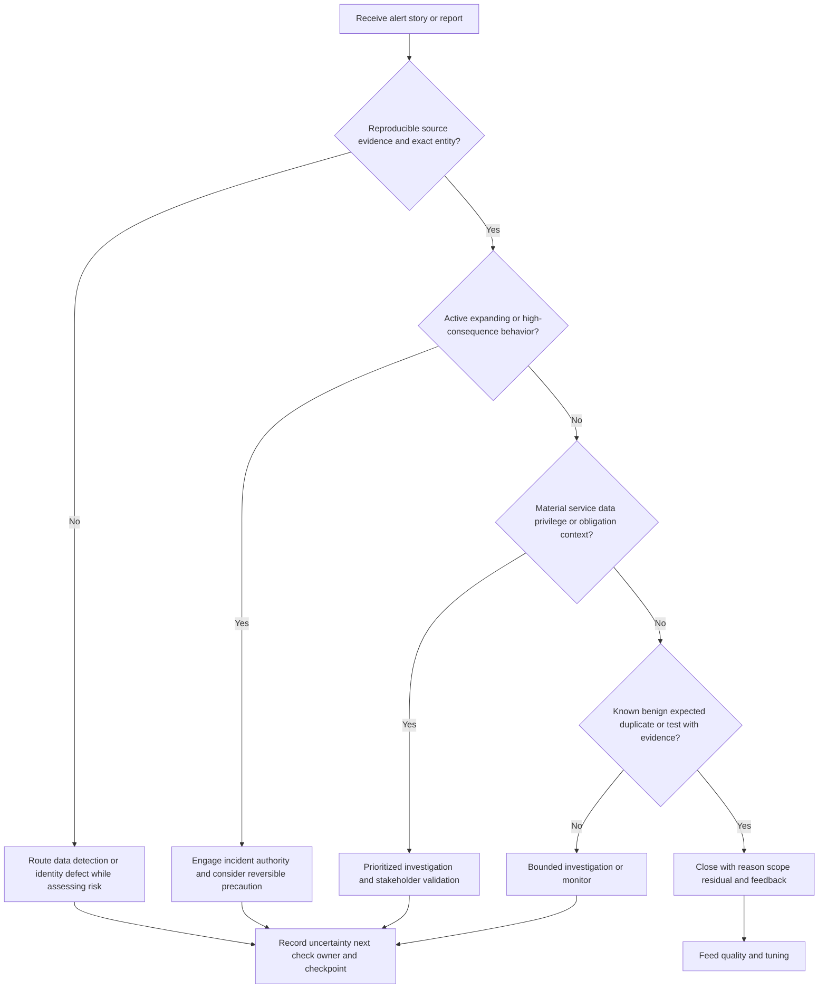

## Severity, priority, urgency, impact, and confidence

Do not collapse these terms. Technical severity describes potential harm if behavior is true. Urgency describes time pressure and continuation. Business impact describes customer consequence. Confidence describes evidence support. Priority is the customer-policy decision about attention order. A high-severity alert can be low priority if it is a proven test on an isolated lab system; a medium-severity identity anomaly can be high priority if it is active on a privileged identity supporting a critical service.

| Factor | Question | Example evidence | Misuse to avoid |
|---|---|---|---|
| Severity | How harmful could this behavior be? | Technique, privilege, control consequence | Vendor severity as incident truth |
| Urgency | How quickly can harm grow or evidence disappear? | Active sessions, spread, destructive action, time sensitivity | Recency alone |
| Impact | Which service, data, people, obligations, or recovery objectives are affected? | Customer-attested context and source effects | Potential impact stated as observed |
| Scope | Which entities are observed, affected, at risk, checked, unknown? | Bounded pivots and denominators | One alert equals one affected asset |
| Confidence | How strongly does evidence support each assertion? | Reliability, directness, corroboration, conflicts | Percentage without validated meaning |
| Control state | What currently prevents, detects, or limits the path? | Policy, health, source decision, test | Installed equals effective |
| Priority | What should be handled first under policy and capacity? | Combined factors and service commitment | Queue sorted by severity only |

## Investigation as competing hypotheses

Investigation is not collecting everything. Start with a bounded question and at least two plausible explanations. For example: malicious credential use, approved automation, account-lifecycle error, misattributed identity, or detection/data defect. Write what each hypothesis predicts. Choose the cheapest safe check that yields different expected results. Update the ledger when evidence arrives.

Separate direct observations from interpretations. Preserve evidence for and against. Set scope, time, and stop conditions so one case does not consume unlimited capacity. If evidence remains insufficient, state unknown and make a risk decision rather than forcing a conclusion.

| Hypothesis field | Purpose | Example neutral form |
|---|---|---|
| Statement | Testable explanation | "Session S-4 used a compromised user credential" |
| Predictions | What should be observed if true | New device, unapproved source, token activity, behavior continuation |
| Supporting evidence | Direct/indirect facts in favor | Identity source and endpoint timeline |
| Contradicting evidence | Facts against | Approved change and known device certificate |
| Assumptions | Unproven conditions | Identity mapping clock is accurate |
| Unknowns | Missing decisive facts | Token issuance detail unavailable |
| Discriminating check | Test separating alternatives | Verify device binding and change owner |
| Safety/authority | Constraints on the check | Read-only query under approved access |
| Stop/escalation | When to stop or widen | Escalate if second privileged action appears |
| Decision relevance | How result changes response | Determines step-up versus account disable request |

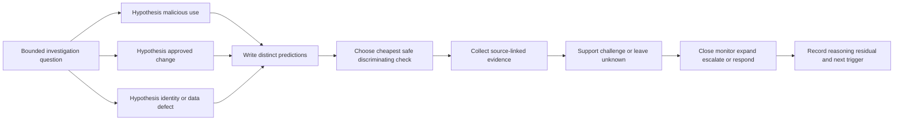

### Plain-English deep-dive 2 - Investigation is diagnosis under uncertainty

A doctor does not order every possible test for every symptom. They create a differential diagnosis, identify dangerous conditions that cannot wait, select tests that separate plausible causes, and consider the harm of testing or treatment. Sometimes a reversible precaution is appropriate before certainty, but the reason and risks are documented.

Security investigation uses the same logic. Analysts keep several explanations alive, prioritize checks by information gain and safety, and distinguish urgent safeguards from final conclusions. "We do not know yet" can be professionally strong when paired with current evidence, bounded risk, an owner, a next check, and a decision deadline.

## Evidence preservation and handling

Containment can change or destroy evidence. Device isolation may interrupt live connections. Session revocation changes authentication state. Reboots can remove volatile memory. Account changes can trigger downstream automation. Before acting, consider which evidence is needed, whether capture is authorized, whether delay increases harm, and whether an alternate source preserves enough information.

This is not an excuse to postpone urgent containment. It is a tradeoff to make explicitly. For active destructive behavior, limiting harm may outweigh perfect evidence. Record source IDs, exact target, current state, decision time, approver, and what evidence could be lost. Follow legal, privacy, HR, forensics, safety, and incident policy.

| Evidence type | Response interaction | Risk | Safeguard |
|---|---|---|---|
| Volatile endpoint state | Reboot/isolation/tool action may alter it | Loss of process/network/memory evidence | Authorized rapid capture or alternate telemetry |
| Active sessions/tokens | Revocation ends access and changes state | Lose live behavior but stop misuse | Preserve session IDs/events before action where safe |
| Cloud logs | Actions generate new records and may alter resources | Timeline complexity or retention gap | Bookmark native IDs and export under policy |
| Network connections | Isolation/route change terminates communication | Lose packet/session continuity | Preserve available metadata and timestamps |
| Identity/config state | Disable/reset/group change alters effective access | Hard to reconstruct pre-action permissions | Snapshot authoritative state and decision |
| Business operation | Containment interrupts transactions or care | Operational/safety harm | Business owner, fallback, canary, rollback |
| Third-party evidence | Provider retention/access may be limited | Evidence disappears or cannot be exported | Escalate preservation request under contract |

## Scope and blast-radius investigation

Use the threat story as a starting set, then pivot through exact relationships. Search other sessions for the identity, other identities on the device, other devices with the indicator or behavior, other apps reachable with the same privilege, related cloud actions, and data accessed. Track source health and checked denominators. Keep observed, affected, at-risk, checked, no-evidence-found, and unknown populations separate.

| Pivot | Question | Evidence | Caution |
|---|---|---|---|
| Identity to sessions | Where else is this identity active? | IAM/app/session-native records | Shared/recreated identity |
| Session to device | Which exact device or client context? | Device/session binding | NAT, proxy, unmanaged client |
| Device to users | Which identities used this endpoint in window? | EDR/OS/identity evidence | Shared terminal or stale login |
| Device to network | Which destinations and peers were contacted? | Endpoint/network/inline sources | Observation-point blind spots |
| App to data | What objects/actions were attempted or completed? | App/data-native audit | Read count not data theft proof |
| Indicator to cohort | Which entities share hash/domain/certificate/behavior? | Search with validity window | Common/shared infrastructure |
| Privilege to resources | What effective access existed at event time? | IAM/PAM/cloud/app policy | Membership does not prove use |
| Exposure to path | Which assets share prerequisite and control state? | Inventory/configuration/source evidence | Configured path not observed path |
| Business service | Which dependencies could be affected? | CMDB/service owner/architecture | Stale dependency map |

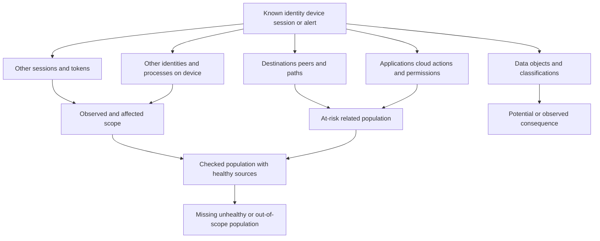

## Containment, eradication, and recovery are different

Containment limits current spread or harm. Eradication removes the cause and unsafe persistence. Recovery restores trusted operation and watches for recurrence. Isolating a device may contain some network paths but does not revoke cloud sessions, remove persistence, patch a weakness, rotate stolen secrets, restore corrupted data, or verify other affected entities. Resetting a password may not revoke all sessions or address a compromised device. Each action has bounded coverage.

| Phase | Core question | Example general action family | Exit evidence |
|---|---|---|---|
| Containment | How can current harm/spread be limited now? | Step-up, reduce access, revoke session, isolate entity, block route/indicator | Target state and activity reduction verified |
| Evidence stabilization | What must be preserved while risk is controlled? | Snapshot, export, case references, forensic capture | Authorized evidence available and protected |
| Eradication | What cause, artifact, persistence, secret, weakness, or unsafe configuration must be removed? | Remove artifact, patch, reimage, rotate secret, correct policy | Root conditions addressed under change control |
| Recovery | How can trusted service/access return safely? | Restore, re-enable gradually, canary, monitor | Security and business postconditions pass |
| Learning | What system change prevents/detects recurrence? | Tune detection, exposure, identity, control, process, training | Owner, due date, validation, residual recorded |

## The right-sized response ladder

Right-sized response means matching the control to the verified risk, scope, authority, and business context. It does not always mean the least disruptive action; it means the least disruptive action sufficient for the current threat and uncertainty. A weak action that cannot interrupt the path is not right-sized. A broad outage when a precise session control would work is also not right-sized.

The ladder below is a general reasoning model, not a list of guaranteed Zscaler or third-party features. Actions can overlap, and the correct order depends on active threat, evidence, capability, and policy.

| Response level | General purpose | Example | Main tradeoff |
|---|---|---|---|
| Observe/enrich | Gain evidence without changing access | Increase monitoring, collect source context | Harm may continue while observing |
| User verification | Confirm legitimate activity through approved channel | Contact owner or service desk verification | Social engineering and delay risk |
| Step-up authentication | Raise confidence for continued access | Require stronger/additional authentication | User friction; stolen factors/session nuances |
| Session restriction/revocation | End selected current access | Revoke exact session/token where supported | Business interruption; incomplete across apps |
| Reduced access | Limit apps, operations, privilege, data, duration, or location | Allow critical app but deny admin action | Policy complexity and residual access |
| Entity isolation | Strongly restrict user/device/workload communication/access | Isolate exact device or user under supported control | High disruption and possible evidence impact |
| Broad block/disable | Stop wider identity, network, application, or service access | Disable account or block shared indicator | Large blast radius and continuity risk |
| Eradication change | Remove root condition | Patch, rotate, rebuild, policy correction | Change risk and recovery time |
| Recovery release | Restore in stages with verification | Canary re-enable and enhanced monitoring | Premature release or prolonged disruption |

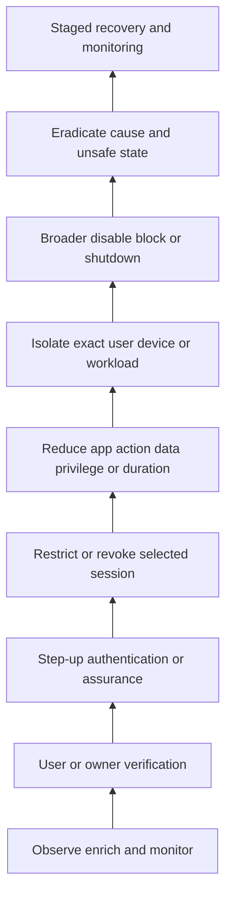

### Step-up authentication

Step-up authentication requires additional or stronger proof when risk changes. It can preserve business access while increasing assurance, making it attractive when evidence is concerning but not sufficient for a total block. However, it is useful only if the additional factor meaningfully addresses the threat. If an attacker controls the endpoint and authentication session, some step-up methods may not be sufficient. Exact method, trigger, integration, session behavior, fallback, accessibility, and recovery require customer and product verification.

| Step-up decision | Question | Evidence | Failure mode |
|---|---|---|---|
| Threat fit | Does added authentication challenge the suspected compromise? | Attack/session hypothesis | Extra prompt attacker can also satisfy |
| Identity binding | Is the challenge tied to exact current identity/session? | Native identity and session IDs | Wrong account challenged |
| Method strength | What new assurance does method add? | IAM policy and factor state | Same compromised channel reused |
| User safety | Can legitimate user complete it safely/accessibly? | Customer IAM/support policy | Lockout or unsafe fallback |
| Scope | Which apps/actions require step-up? | Policy/effective access | All-or-nothing surprise |
| Result | Was challenge passed, failed, bypassed, or unavailable? | Source-native decision | Prompt sent equals assurance gained |
| Next branch | What happens after each result? | Approved playbook | Failed challenge with no response |

### Reduced access

Reduced access narrows the potential blast radius while preserving necessary work. Dimensions include allowed applications, actions, privilege, data operations, device posture, location, network path, session duration, or time. A contractor may retain one required app but lose administrative functions. A suspicious identity may access a low-risk service only after step-up while sensitive data actions remain blocked. These are conceptual examples, not asserted product fields or features.

The danger is policy complexity. A reduction may leave an alternate path, break a dependent service, or create inconsistent state across systems. Model effective access before change, identify dependencies, use canaries where time permits, read back actual policy decisions, and define automatic or approved expiry.

| Reduction dimension | Security benefit | Business risk | Validation |
|---|---|---|---|
| Application | Limits reachable services | User cannot perform required work | Positive allowed and negative denied test |
| Operation | Blocks admin/write/download while allowing read | Workflow may require blocked function | Exact action decision evidence |
| Privilege | Removes elevated role or group | Automation/service dependency breaks | Effective privilege and dependency check |
| Data | Restricts sensitive content/action | False classification blocks legitimate use | Classification and transaction tests |
| Device posture | Allows only managed/healthy device context | Recovery path may be unavailable | Posture freshness and fallback |
| Location/network | Narrows permitted context | Travel/remote work disruption | Identity and source-location validity |
| Duration | Shortens session or grant | Reauthentication burden | Expiry and renewal behavior |
| Time window | Limits access to approved period | On-call/emergency work affected | Change/calendar and break-glass test |

## Isolation

Isolation is a stronger restriction on an entity's communication or access. Device isolation can reduce network reach while sometimes preserving a management path, depending on the product and policy. User isolation can mean a strong restriction on access or interaction under a particular control architecture. Workload or network isolation can limit communications. The exact semantics must be verified; do not assume the word means identical effects across tools.

Before isolation verify exact target, active business role, safety impact, shared use, management/recovery path, evidence needs, dependencies, and alternate sessions. Decide who communicates to the user or owner. After action, query target state and test relevant paths. A console label alone does not prove every route is blocked.

| Isolation concern | Pre-action check | Post-action proof | Recovery requirement |
|---|---|---|---|
| Exact target | Immutable user/device/workload ID and current lifecycle | Target source reports intended state | Reconfirm identity before release |
| Communication scope | Which paths remain/stop? | Positive and negative route/access tests | Document management and required paths |
| Shared/critical use | Who or what depends on entity? | Business owner confirms expected impact | Alternate service/device available |
| Evidence | What state may be lost? | Required source evidence preserved where authorized | Forensic/IR owner approves next step |
| Alternate sessions | Does identity retain cloud/app access elsewhere? | IAM/app session review | Revoke/restore consistently |
| Duration | When does isolation expire/review? | Timer and owner visible | Explicit release approval |
| Rollback | Can action be reversed safely? | Restoration test in controlled scope | Monitored staged re-entry |

### Plain-English deep-dive 3 - Containment is a set of doors, not one red button

A building emergency might require locking one room, disabling one badge, closing a floor, stopping an elevator, or evacuating the entire site. Each action interrupts different paths and creates different harm. Pressing the largest red button feels decisive but can endanger people or destroy operations. Locking only one door is insufficient if another route remains open.

Cyber containment is similarly path-specific. Ask which identity, session, device, application, privilege, route, or data action enables current harm. Choose controls that interrupt those prerequisites. Then verify the doors actually changed and look for alternate routes. "Contained" should always have a scope sentence: which path was interrupted, which evidence proves it, and which residual paths remain.

## Containment tradeoff analysis

Evaluate threat interruption, expected business harm, action certainty, reversibility, speed, authority, evidence preservation, target confidence, alternate paths, recovery complexity, and duration. The same action can be appropriate for one entity and reckless for another. A high-confidence compromised kiosk may be isolated immediately. A low-confidence alert on a life-critical shared server may require a rapid multi-team decision, a precise alternate control, and continuity activation.

| Decision factor | Question | Favors narrower action when | Favors stronger action when |
|---|---|---|---|
| Active harm | Is behavior ongoing or expanding? | No continuation and good monitoring | Destructive/exfiltration behavior active |
| Target confidence | Are exact entity and lifecycle certain? | Identity ambiguous | Immutable target confirmed |
| Threat fit | Which control interrupts required path? | Precise session/app control works | Threat controls many paths/entities |
| Business criticality | What service/safety dependency exists? | Broad action causes material harm | Continued compromise has greater harm |
| Reversibility | Can action be safely undone? | Irreversible/destructive control | Fast reversible containment available |
| Evidence | Will action destroy decisive evidence? | Short safe collection window exists | Delay creates unacceptable risk |
| Alternate paths | Can actor continue elsewhere? | Other paths can be separately controlled | Broad identity/device scope necessary |
| Recovery | How quickly can trusted service return? | Restoration complex/untested | Fallback and recovery validated |
| Authority | Is decision owner engaged? | Approval unavailable and no emergency policy | Pre-authorized emergency threshold met |
| Uncertainty | Which facts remain unknown? | Evidence can quickly discriminate | Consequence justifies precaution under uncertainty |

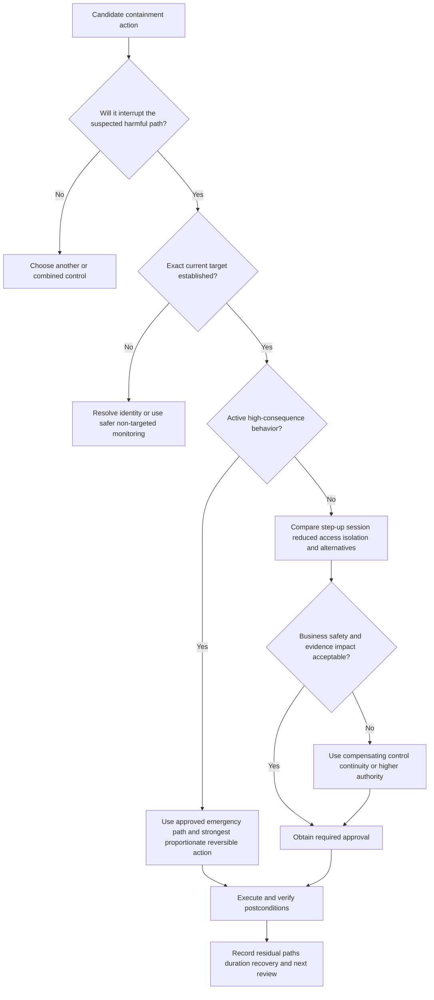

## Approval, RACI, and emergency authority

The person who discovers risk may not own the affected system or have authority to disrupt it. Define normal and emergency decisions before an incident. Separate request, recommendation, approval, execution, validation, communication, and risk acceptance. Ensure on-call coverage. Break-glass processes should have narrow thresholds, strong authentication, audit, retrospective review, and expiry.

| Decision/action | Accountable role example | Responsible role example | Consulted/informed | TSM boundary |
|---|---|---|---|---|
| Incident declaration | Customer incident authority | Incident lead/SOC per policy | Legal, privacy, business, executives as required | No declaration authority |
| Step-up/reduced access policy | IAM/access risk owner | IAM/ZT control operator | SOC, app owner, support | Explain documented capability; do not approve |
| Device isolation | Endpoint/IR authority | Endpoint or SOC operator | Device/service owner, forensics | Coordinate product evidence only |
| Account disable/session revocation | Identity/IR authority | IAM operator | App owners, HR/legal if applicable | No identity governance authority |
| Network/workload block | Network/cloud/service authority | Network/cloud operator | SOC, app/service owner | No customer change authority |
| Evidence collection | IR/legal/privacy authority | Forensics/source operator | HR, data owner as applicable | No legal-forensic direction |
| Recovery release | Incident and service owner | IT/app/IAM/endpoint teams | SOC, business, change, communications | Support validation; do not accept residual risk |
| Risk acceptance | Authorized business/risk owner | Governance records decision | Security, legal/privacy, audit | No customer acceptance authority |

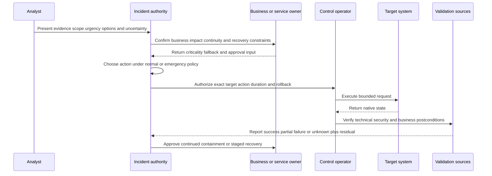

## Action execution and state model

Actions can be synchronous or asynchronous. A request may be rejected, accepted, queued, running, partially complete, completed, failed, timed out, cancelled, expired, rolled back, or unreconciled. Map actual product states from current documentation; do not invent them. The general rule is to preserve the native request ID and result, then translate only through a documented mapping.

Idempotency is important. Before retry, query current target and request state. An action can have side effects even if the caller receives a timeout. A duplicate account reset or repeated ticket/action can confuse recovery. Use a stable operation key where supported, bounded retries, and human escalation for unknown consequential state.

| Execution field | Why it matters | Required evidence |
|---|---|---|
| Exact target | Prevents wrong-user/device/app action | Immutable scoped ID and current lifecycle |
| Requested effect | Defines intended bounded change | Action type, parameters, duration, exclusions |
| Authority | Proves governance | Policy, approver, role, reason, time |
| Preconditions | Ensure action is still safe and relevant | Current target, incident state, business check |
| Operation key | Supports dedupe/idempotency | Stable request/case/action reference |
| Native request/result | Preserves source truth | API/control-system IDs and states |
| Timing | Supports deadline and timeout analysis | Request, accept, complete, verify times |
| Read-back | Proves actual target state | Control-native and independent checks |
| Rollback | Defines reversal | Owner, method, preconditions, test |
| Residual | States what action did not cover | Alternate sessions, paths, entities, unknowns |

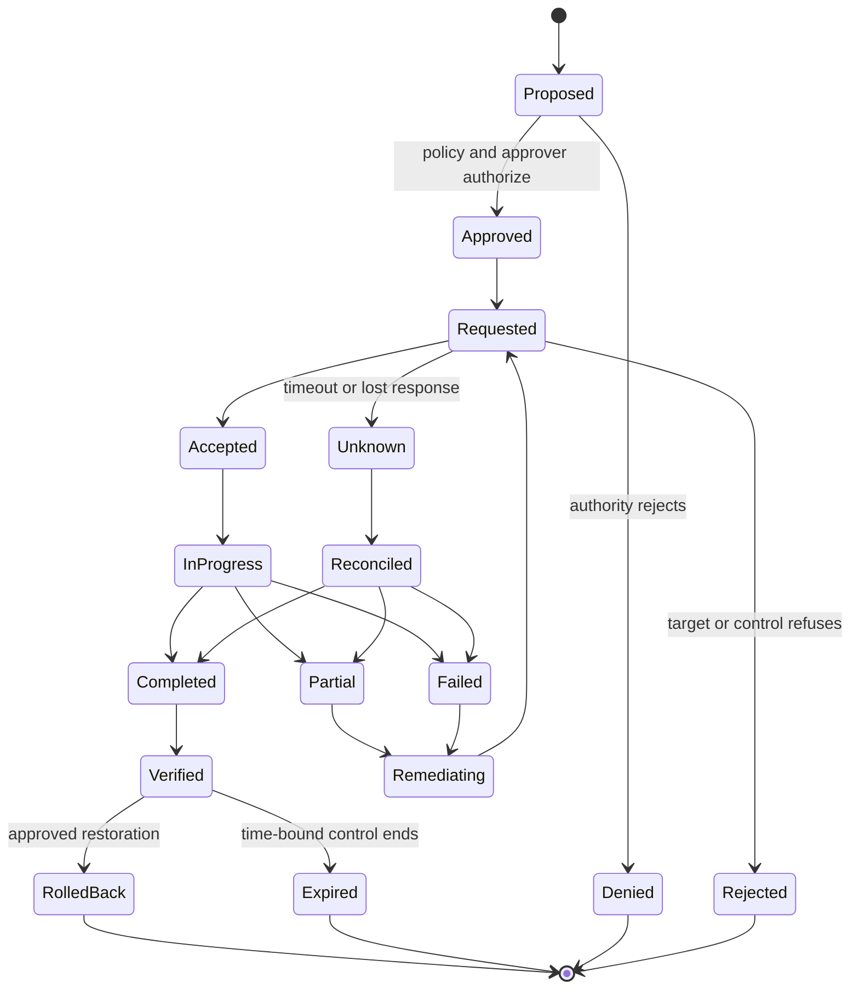

## Third-party and multi-control response

Right-sized response often spans systems. A Zscaler or other inline control may limit access; IAM may revoke sessions or adjust identity; EDR may isolate a device; cloud platforms may disable keys or change workload access; email/collaboration systems may remove content; network controls may restrict routes; ITSM/change systems may coordinate work. Each action has its own authority, state, latency, and rollback.

Avoid one giant opaque playbook. Use an incident-level plan with action-specific contracts and dependencies. Decide whether actions are parallel or sequential. Parallel action can reduce time but increase race conditions and business impact. Sequential action can preserve evidence and allow verification but leave windows of risk. Record the rationale.

| Control domain | General contribution | Dependency | Limitation |
|---|---|---|---|
| Zero-trust/inline access | Step-up, access reduction, policy-based containment where supported | Identity, app, traffic, policy coverage | Does not cover every endpoint/session/path |
| IAM/PAM | Session, credential, privilege, identity lifecycle controls | Accurate identity and app integration | Token/federation propagation varies |
| EDR/endpoint | Endpoint containment and evidence where supported | Healthy managed sensor/device | Offline/unmanaged/unsupported devices |
| Network | Route, segment, indicator, service controls | Correct topology and change authority | Shared infrastructure and bypass paths |
| Cloud/workload | Keys, roles, resources, network and workload controls | Cloud identity/resource ownership | Ephemeral resources and automation dependencies |
| Email/collaboration | Message, link, account, app controls | Tenant/source capability | Forwarded/copied content persists |
| Data security | Data-action policy and investigation context | Classification/channel coverage | Label/coverage/false-positive limits |
| ITSM/change | Ownership, approval, communication, audit | Timely integration and process | Ticket state not technical outcome |

## Recovery and release from containment

Recovery is not simply clicking "un-isolate." Confirm that the cause and unsafe access are addressed, evidence is preserved, identities and secrets are trustworthy, controls are healthy, dependencies are ready, and business owners accept the restoration plan. Restore in stages where possible. Use a canary entity or limited access, enhanced monitoring, explicit success and abort criteria, and a fallback.

Check both security and business postconditions. Security checks may include no repeated behavior, expected authentication and policy decisions, clean/rebuilt endpoint state, rotated credentials, closed alternate sessions, and validated controls. Business checks include service availability, transaction integrity, user access, data consistency, performance, and support load.

| Recovery gate | Evidence required | Failure branch |
|---|---|---|
| Cause addressed | Artifact/weakness/credential/policy correction verified | Continue eradication or compensating control |
| Scope stabilized | No unexplained expansion in covered sources | Reopen investigation and containment |
| Identity trusted | Credential/session/privilege state reconciled | Keep reduced access or reissue identity |
| Endpoint/workload trusted | Rebuild/scan/configuration and health evidence | Reimage/rebuild or alternate asset |
| Controls healthy | Prevention/detection/monitoring tests pass | Fix control before release |
| Business ready | Owner, continuity, data integrity, support plan | Delay or use alternate service |
| Rollback ready | Abort threshold and restoration path tested | Do not expand canary |
| Monitoring active | Signals, ownership, and review period defined | Maintain containment or manual watch |
| Acceptance | Incident/service authority approves residual | Escalate unresolved risk decision |

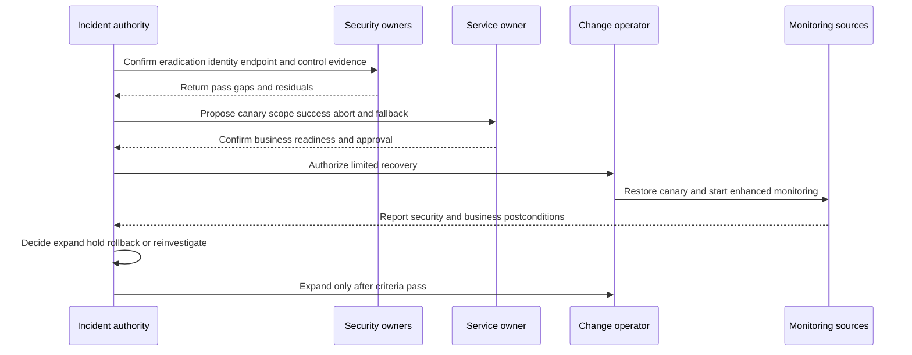

### Plain-English deep-dive 4 - Recovery is a controlled security change

After repairing a bridge, engineers do not immediately send maximum traffic across it. They inspect the repair, test with controlled loads, monitor movement, and keep a closure plan ready. Reopening too early can create a second failure; staying closed indefinitely causes its own harm.

Recovery from cyber containment has the same balance. Verify the reason for containment is addressed, restore a limited scope, watch security and business signals, and expand only when criteria pass. The release decision deserves the same identity, authority, audit, and postcondition rigor as the original containment action.

## Agentic assistance and automation boundaries

Agentic assistance can retrieve evidence, group alerts, summarize timelines, propose hypotheses, estimate scope, compare response options, draft approvals, and monitor action state. The public Zscaler page positions AI agents as supporting triage, investigation, recommendation, and risk-appropriate action. This does not remove human accountability or prove autonomy.

High-impact response must defend against hallucination, prompt injection, stale context, wrong entity resolution, overprivileged tool access, duplicate execution, and manipulated evidence. Separate recommend, approve, execute, and validate permissions. Use allowlisted tools and actions, target confirmation, policy evaluation, rate and blast-radius limits, sandbox/testing, audit, rollback, and emergency stop. Retrieved log or ticket text is data, not an instruction to the agent.

| Agentic step | Safe contribution | Required control | Prohibited assumption |
|---|---|---|---|
| Triage | Summarize alert logic and retrieve context | Citations, source health, analyst review | Summary is factual because fluent |
| Investigation | Propose pivots and competing hypotheses | Bounded read access and result validation | Agent determines malicious intent |
| Scope | Search approved populations | Denominators, source health, privacy | No hits prove no impact |
| Recommendation | Compare response ladder and tradeoffs | Current capability, policy, target, residual | Suggested action is supported/authorized |
| Approval package | Draft evidence and business-impact brief | Human approver sees sources and uncertainty | Approval can be inferred from silence |
| Execution | Call pre-authorized bounded action if policy permits | Idempotency, limits, target binding, audit | Any API permission grants authority |
| Verification | Query action and independent postconditions | Native result and business check | Request accepted equals containment |
| Feedback | Suggest detection/playbook/context changes | Owner review and controlled release | Model self-modifies production unchecked |

```mermaid
flowchart LR
    EVIDENCE[Approved source evidence] --> AGENT[Agentic triage and investigation assistance]
    AGENT --> REC[Recommendation with citations confidence and tradeoffs]
    REC --> POLICY[Customer policy and capability validation]
    POLICY --> HUMAN[Authorized human decision]
    HUMAN --> ACTION[Bounded allowlisted action]
    ACTION --> READBACK[Native and independent verification]
    READBACK --> RESULT[Outcome residual and business impact]
    RESULT --> REVIEW[Human quality and safety review]
    REVIEW --> TUNE[Controlled detection playbook context or policy update]
```

## Communications during response

Different audiences need different detail, but the evidence must remain consistent. Technical teams need IDs, times, hypotheses, source health, action states, and next checks. Business owners need service impact, options, decision, fallback, residual, and checkpoint. Executives need a bounded situation, observed/potential impact, response, current risk, decisions needed, and next update. Legal/privacy/communications decide regulated or external statements.

Never promise an ETA without a basis. State the next checkpoint instead. Avoid "fully contained" unless scope and postconditions support it. Prefer: "Access for identity U-17 to application A-3 was reduced at 14:05 UTC and source-native policy evidence confirms the intended denial. Separate sessions and two offline devices remain under review."

| Update field | Technical form | Executive form |
|---|---|---|
| Situation | Source-linked observations and hypotheses | What is known and why it matters |
| Scope | Observed/affected/checked/unknown entities | Current bounded business footprint |
| Impact | Technical effect and service/data evidence | Observed versus potential consequence |
| Action | Target, authority, native state, postconditions | Risk-reduction action and business effect |
| Uncertainty | Source gaps, alternatives, action unknowns | What remains unresolved and decision risk |
| Decision | Approver, option, rationale, residual | Decision made or needed |
| Next | Discriminating check, owner, due time | Next update checkpoint and expected learning |

## Troubleshooting response failures

When an action fails or appears wrong, protect the customer first. Determine whether an unintended effect is active, whether rollback is safe, and who has authority. Preserve exact target, operation ID, UTC, request/response, observed state, business impact, and changes. Do not repeat a high-impact action until state is reconciled.

| Symptom | Cheap discriminating check | Likely layer | Immediate safeguard |
|---|---|---|---|
| Wrong user/device targeted | Compare immutable scoped ID and lifecycle at request time | Entity mapping/target binding | Stop further actions; engage authority and correct safely |
| Action timed out | Query native operation and target state | Async API/network/control service | Treat state as unknown; do not blind retry |
| Console says isolated; traffic continues | Test exact covered paths and target source state | Semantics, alternate path, delay, wrong target | Add approved compensating control |
| Step-up repeatedly loops | Compare policy decision, identity session, factor, app, clock | IAM/integration/policy | Provide approved safe access/support path |
| Reduced access blocks critical service | Inspect effective policy and dependencies | Policy design/context/change | Roll back or use continuity under authority |
| Account disabled; sessions persist | Query app/token/session state and federation behavior | Propagation/session architecture | Revoke exact sessions or alternate control |
| Recovery triggers same alert | Determine expected test versus recurring cause | Eradication/detection/context | Hold expansion and reinvestigate |
| Third-party action succeeds but case stays pending | Compare operation/case mapping and update delivery | Integration/workflow | Reconcile manually and preserve native proof |

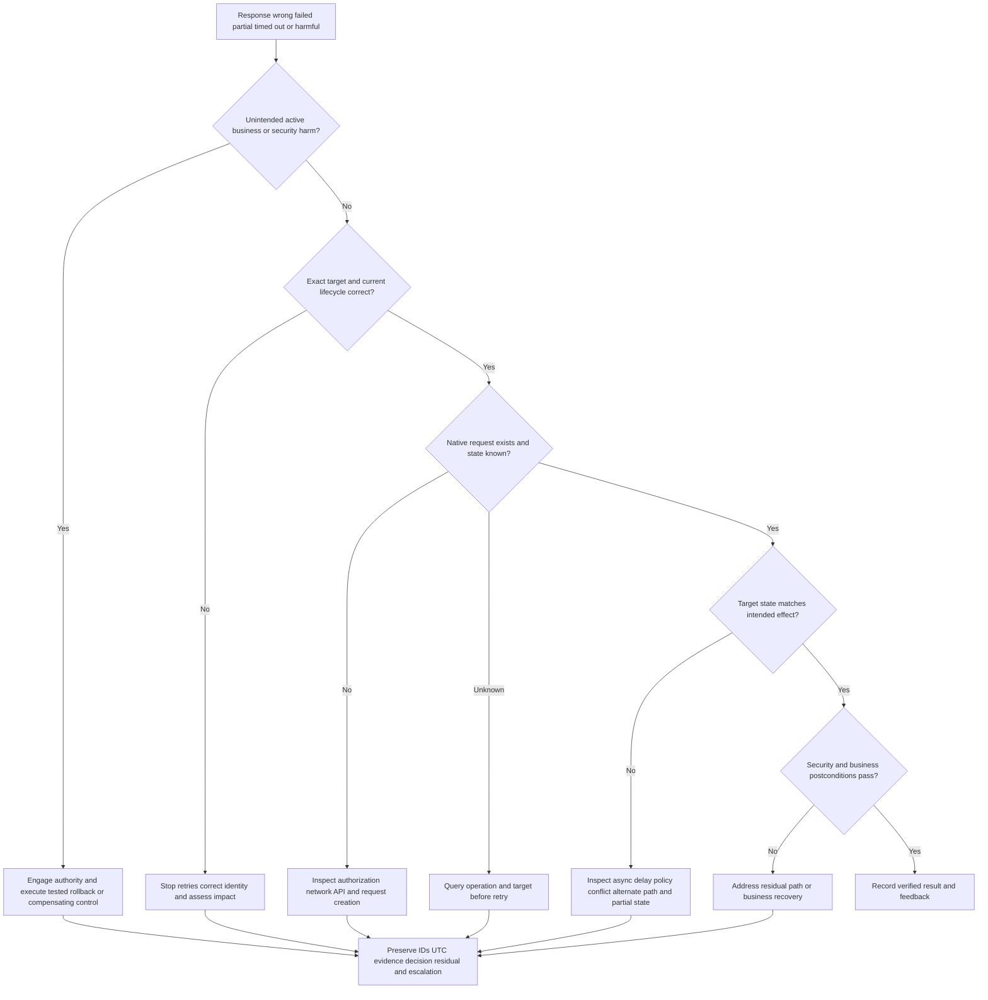

### Plain-English deep-dive 5 - An API success is a receipt, not a recovered patient

A hospital pharmacy can acknowledge a medication order, but that does not prove the medicine reached the correct patient, was administered, produced the intended effect, or avoided a harmful reaction. Each state has separate evidence.

A security action is similar. The orchestration platform may successfully submit a request. The target may accept it. Execution may complete partially. The control may change but fail to interrupt an alternate path. Security may improve while a critical business service breaks. Right-sized response therefore verifies request, target state, path effect, business effect, and residual separately.

## Security, privacy, legal, safety, and resilience

Response tools are high-value targets because they can disable identities, isolate devices, change access, and expose investigation data. Protect them with strong identity, least privilege, separation of duties, just-in-time access where appropriate, environment/tenant binding, allowlisted actions, secrets management, protected audit, rate/blast-radius limits, monitoring, and tested recovery. Test negative permissions: a viewer should not become an executor through an integration.

Investigations can involve employees, customers, regulated data, health information, legal privilege, or confidential business activity. Use purpose limitation, minimization, need-to-know access, approved retention, legal hold, regional restrictions, and controlled communication. Response should not become covert employee surveillance or disciplinary judgment. Legal, privacy, HR, safety, and communications roles enter according to customer policy.

| Risk | Potential harm | Control | Evidence |
|---|---|---|---|
| Compromised automation identity | Attacker performs broad containment or access changes | Least privilege, strong auth, tool/action allowlist, rotation | Role and credential review |
| Cross-tenant target error | Wrong customer/entity disrupted | Immutable tenant/object binding and confirmation | Negative isolation test |
| Insider misuse | Authorized operator harms or surveils | Separation, approval, audit, behavioral monitoring | Periodic action review |
| Prompt injection | Malicious log/ticket text commands agent | Treat content as data, tool policy, output validation | Adversarial exercise |
| Excessive containment | Business/safety outage | Impact preview, owner, canary, continuity, rollback | Tabletop and recovery test |
| Under-containment | Threat uses alternate path | Path model, multi-control scope, residual review | Positive/negative path tests |
| Evidence loss | Root cause or legal record unavailable | Preservation plan and protected originals | Reproduction check |
| Privacy overreach | Personal data misused or overshared | Purpose, minimization, role, retention, redaction | Access/export review |
| Control outage | Cannot contain or recover | Degraded mode, manual path, alternate control | Continuity exercise |
| Uncontrolled rollback | Threat regains access | Recovery gates and enhanced monitoring | Canary release record |

## Failure modes and misconceptions

| Misconception or failure | Why it fails | Better practice |
|---|---|---|
| Every high-severity alert needs immediate isolation | Severity is not entity certainty, active status, business impact, or authority | Triage and use proportionate action |
| More containment is always safer | Broad disruption can harm operations and obscure evidence | Interrupt required path with least sufficient effect |
| Step-up authentication solves credential compromise | Threat may control factor, endpoint, session, or fallback | Match control to threat hypothesis |
| Password reset ends all access | Sessions, tokens, service secrets, and apps may persist | Verify every relevant access path |
| Device isolation contains identity compromise | Other devices/cloud sessions can remain | Use multi-domain scope |
| Action requested means action complete | Async, partial, wrong-target, or timeout states exist | Read back native and independent postconditions |
| Technical permission equals approval | API access is not customer risk authority | Explicit policy and accountable approver |
| Recovery is an IT-only task | Releasing access changes security risk | Joint security/service gates and monitoring |
| No new alerts means eradication | Detection/source gaps or attacker adaptation may hide activity | Verify root conditions and coverage |
| AI can decide containment because it is faster | Grounding, identity, authority, safety, and adversarial risks remain | Human-governed bounded agentic assistance |
| Ticket closure proves recovery | Administrative state does not prove technical/business result | Require security and service postconditions |
| TSM becomes incident commander | Product guidance does not transfer customer authority | Facilitate evidence and escalation within role |
| Exact ETA builds trust | Unsupported ETA creates false certainty | Commit to owner and next checkpoint |
| Containment has no expiry | Temporary restrictions can become unmanaged permanent access policy | Duration, review, rollback, residual ownership |

## Explicitly fictional and synthetic NMH response case

Everything in this section is an explicitly fictional and synthetic NMH teaching scenario. Every date is a labeled fictional future date later than the 2026-08-24 source snapshot. Nothing is a customer fact, production action, Zscaler output, product result, or prediction.

On fictional future date **2026-09-28**, fictional synthetic NMH receives a synthetic threat story involving test identity `U-217`, test endpoint `D-31`, and training application `A-7`. Fictional evidence shows an unusual authentication, a script chain, and two denied attempts to reach an administration function. There is no synthetic evidence of successful administrative action or production data access. A stale service catalog incorrectly labels `A-7` as production critical; the authoritative fictional exercise record labels it a nonproduction training app.

The fictional analyst verifies native IDs and current lifecycle, confirms source health, and tests three hypotheses: authorized exercise, compromised test identity, and wrong entity correlation. Because the second denied attempt is recent, the fictional incident authority approves a temporary synthetic step-up requirement and reduced access to the training app while the exercise owner is contacted. This is a teaching action in the scenario only, not a claim about a supported product feature or executed system.

| Fictional synthetic decision factor | Teaching evidence | Interpretation | Next check |
|---|---|---|---|
| Exact identity | Native fictional ID U-217 across identity and app sources | High-confidence target identity | Verify owner and exercise roster |
| Device link | Session binding to test device D-31 | Medium/high association | Compare endpoint certificate and reimage history |
| Behavior | Two admin attempts denied | Attempted but not successful action | Search surrounding app events |
| Activity | Second attempt within recent fictional window | Potential continuation | Monitor exact identity/session |
| Business context | Training app; stale critical tag disputed | Lower direct production impact | Correct source context and effective time |
| Control option | Synthetic step-up plus reduced training-app access | Reversible and scoped teaching choice | Verify challenge and policy outcome |
| Residual | Other sessions and two offline test devices unknown | Not fully scoped | Check when sources return |

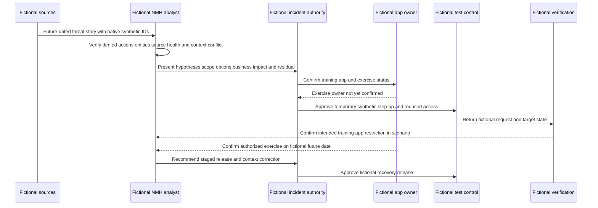

The fictional scenario ends only after the exercise owner verifies the synthetic activity, the test control is shown in the scenario as restored through a staged release, and the stale service context receives a separate correction task. The story remains explicit that denied actions were observed, successful administration was not observed in covered sources, two offline test devices were unknown during the first decision, and no production system was involved.

## Practical scenarios and decision drills

### Scenario 1 - Low-confidence alert on a critical server

Validate exact target and active behavior quickly. Engage incident and service authority. Compare enhanced monitoring, precise session/access restrictions, workload isolation, continuity, and evidence needs. Low confidence does not mean ignore; criticality does not make the alert true.

### Scenario 2 - Strong evidence on an unmanaged contractor device

EDR isolation may be unavailable. Consider identity sessions, app-specific/reduced access, step-up, network/inline policy, contractor sponsor, and third-party controls under current capability. Preserve evidence and communicate residual device risk.

### Scenario 3 - Step-up succeeds but behavior continues

Do not assume legitimacy. The threat may control the factor or endpoint, or approved automation may be occurring. Reassess hypotheses, session/device binding, behavior, and stronger scoped containment.

### Scenario 4 - Isolation request times out

Treat action state as unknown. Query the native operation and device state, test relevant paths, preserve IDs/times, avoid blind retry, and apply an approved compensating control if active risk continues.

### Scenario 5 - Reduced access blocks a patient-care workflow

Activate safety/continuity and incident authority. Verify exact policy impact, roll back or narrow the control if approved, use alternate safeguards, and record both security residual and service harm. Security action is not exempt from safety governance.

### Scenario 6 - Account disable succeeds but cloud session remains

Map federation/token/application semantics. Query active sessions and app-native evidence. Revoke or restrict the exact remaining path where supported and authorized. State that identity disable had bounded effect.

### Scenario 7 - Recovery canary triggers an old alert

Determine whether the alert reflects current recurring behavior, delayed data, replay, expected recovery activity, or stale detection state. Hold expansion until distinguished. Do not suppress merely to finish recovery.

### Scenario 8 - AI recommends broad user isolation

Require cited evidence, exact identity, supported action semantics, business impact, alternatives, authority, duration, rollback, and postconditions. An agent recommendation is an input, not approval.

## Artifact kit

| Artifact | Minimum content | Quality gate | Interview use |
|---|---|---|---|
| Triage card | Alert, entities, UTC, behavior, health, context, scope, confidence, branch | Another analyst reproduces decision | Shows first-response rigor |
| Hypothesis ledger | Alternatives, predictions, support/conflict, unknowns, next checks | At least one falsifiable alternative | Shows investigation discipline |
| Scope matrix | Observed, affected, at-risk, checked, unknown populations | Denominators/source health explicit | Shows blast-radius reasoning |
| Evidence-preservation plan | Evidence, action interaction, authority, priority | Harm versus preservation tradeoff recorded | Shows forensic awareness |
| Response option matrix | Path interruption, impact, speed, reversibility, authority, residual | Least sufficient action justified | Shows right-sizing |
| Step-up decision card | Threat fit, binding, method, scope, result branches | No prompt-equals-success assumption | Shows identity control reasoning |
| Reduced-access design | App/action/data/privilege/duration scope and dependencies | Positive/negative tests and expiry | Shows zero-trust thinking |
| Isolation checklist | Target, paths, business, evidence, alternate sessions, rollback | Independent postconditions | Shows containment safety |
| Approval/RACI | Request, recommend, approve, execute, validate, communicate, accept | Emergency and normal paths covered | Shows governance |
| Action ledger | Operation key, native state, times, read-back, rollback, residual | Unknown/partial states represented | Shows automation maturity |
| Recovery plan | Eradication gates, canary, monitoring, business tests, abort/fallback | Joint security/service approval | Shows end-to-end ownership |
| Response update | Situation, scope, impact, action, result, residual, next | No unsupported containment/ETA | Shows communication |
| Failure runbook | Wrong target, timeout, partial, harmful, rollback branches | Blind retry prohibited | Shows troubleshooting |
| Agentic control plan | Evidence, tool/action bounds, approvals, audit, stop, feedback | Prompt injection and wrong-entity tests | Shows responsible AI |
| Post-incident feedback register | Detection, exposure, identity, control, data, process changes | Owner, validation, due date, residual | Shows continuous improvement |

## Safe exercises

All exercises use fictional or sanitized data and perform no production response.

1. Triage ten synthetic alerts into close, monitor, investigate, escalate, and precaution branches with written reasons.
2. Build a hypothesis ledger for suspicious identity activity with malicious, approved-change, identity-defect, and detection-defect alternatives.
3. Create a source-linked UTC timeline and mark active, denied, successful, unknown, and analyst-action states.
4. Define observed, affected, at-risk, checked, and unknown scope for a synthetic identity-plus-device story.
5. Compare evidence preservation and urgent containment for a destructive process, suspicious login, and data-access anomaly.
6. Build a response ladder for one case and explain why each stronger action would or would not be justified.
7. Draft a conceptual step-up decision tree with pass, fail, bypass, unavailable, and repeated-risk branches.
8. Design reduced access by app, operation, privilege, data, posture, and duration; add positive and negative tests.
9. Write an isolation checklist for a shared critical device and include continuity and management-path concerns.
10. Create a RACI for incident declaration, identity restriction, endpoint isolation, network block, communication, and recovery.
11. Simulate an asynchronous action timeout and write the reconciliation steps before retry.
12. Define security and business postconditions for containment, eradication, and recovery.
13. Design a canary recovery with success, abort, fallback, and enhanced-monitoring criteria.
14. Review an AI response recommendation for unsupported facts, wrong target, excessive scope, missing authority, and missing rollback.
15. Write one technical and one executive update without claiming full containment or an unsupported ETA.
16. Create a Power BI-style action-state model separating request, completion, verification, business result, and residual.
17. Build a redacted escalation packet for a control whose UI state conflicts with observed traffic.
18. Explain the entire lifecycle aloud while identifying the customer decisions a TSM cannot make.

## TSM discovery and operating questions

1. Which policies define alert triage, incident declaration, containment, emergency action, evidence preservation, communication, recovery, and risk acceptance?
2. Who requests, recommends, approves, executes, validates, communicates, and reviews each action type?
3. Which identities, sessions, devices, workloads, apps, data, networks, and services can current controls affect?
4. What do step-up, reduced access, isolation, revoke, block, and restore mean in each actual product?
5. Which actions are recommend-only, human-approved, pre-authorized, break-glass, time-bound, reversible, or prohibited?
6. How are exact targets bound across aliases, reused devices, tenants, sessions, and lifecycle changes?
7. Which source, operation, and postcondition evidence proves request, completion, security effect, and business effect?
8. What evidence may containment alter, and who decides the preservation-versus-harm tradeoff?
9. Which critical service, safety, continuity, and recovery dependencies constrain response?
10. How are partial, timeout, duplicate, wrong-target, conflicting-policy, and rollback failures handled?
11. Which alternate paths remain after each control, and how are residuals communicated?
12. How are third-party actions coordinated without conflicting incident/case states?
13. Which AI or agentic tasks have read, recommend, approve, execute, and tune permissions?
14. Which metrics measure quality and outcome without rewarding unsafe speed or broad disruption?
15. Which current Zscaler documentation, entitlement, integration, tenant evidence, and Support guidance must be verified?

## Official Source Anchors

Research/source snapshot and source review date: **2026-08-24**.

The Zscaler pages support dated public positioning only. The response lifecycle, hypothesis method, approval model, action state model, recovery gates, and troubleshooting methods are general security practice. Exact product actions, names, triggers, APIs, fields, autonomy, and entitlements require current customer-specific verification.

| Source | URL | Used for | Boundary |
|---|---|---|---|
| Zscaler Agentic Security Operations | https://www.zscaler.com/products-and-solutions/security-operations | Public adaptive/right-sized response positioning, step-up authentication, reduced access, user isolation, third-party workflows, agentic recommendation | No action semantics, UI, field, trigger, approval, entitlement, autonomy, or result inferred |
| Zscaler Zero Trust Exchange | https://www.zscaler.com/products-and-solutions/zero-trust-exchange-zte | Public identity/context/business-policy, least-privilege, proxy/inline-control foundation | No specific response workflow inferred |
| Zscaler Data Fabric for Security | https://www.zscaler.com/products-and-solutions/data-fabric | Public context, business logic, workflows, and feedback positioning | Exposure focus; no response engine implementation inferred |
| NIST SP 800-61 Rev. 3 | https://csrc.nist.gov/pubs/sp/800/61/r3/final | Current incident-response recommendations and CSF-aligned context | Organizations tailor authority and procedures |
| NIST Cybersecurity Framework 2.0 | https://www.nist.gov/cyberframework | Govern, Protect, Detect, Respond, Recover outcomes | Voluntary; implementation varies |
| NIST SP 800-207 | https://csrc.nist.gov/pubs/sp/800/207/final | General zero-trust architecture and policy-decision concepts | Vendor-neutral; no product capability claim |
| MITRE ATT&CK | https://attack.mitre.org/ | Behavior vocabulary for investigation and response hypotheses | Mapping is not occurrence or coverage proof |

## Likely Interview Questions

### Q1. What should happen during threat triage?

**Model answer:** Reproduce the alert and source health, bind exact entities and UTC, distinguish attempted/denied/allowed/completed behavior, check active status, add privilege/business/data/control context, estimate observed/checked/unknown scope, assign claim-level confidence, and choose a bounded branch: close, monitor, enrich, investigate, escalate, declare, or recommend precaution. Record authority, next discriminating check, owner, and checkpoint. Speed without correctness is not quality.

### Q2. How do you investigate without collecting endless evidence?

**Model answer:** Start with a bounded question and competing hypotheses, including benign/change/data-defect alternatives. Write predictions, evidence for and against, assumptions, unknowns, and decision relevance. Choose the cheapest safe check whose outcomes separate hypotheses. Set time, population, stop, and escalation boundaries. Update confidence and make a risk decision if decisive evidence remains unavailable rather than forcing certainty.

### Q3. What does right-sized response mean?

**Model answer:** Select the least disruptive action sufficient to interrupt the verified or urgent suspected path, given target confidence, active harm, business/safety impact, evidence needs, reversibility, alternate paths, authority, recovery, and uncertainty. Options can range from monitoring and verification through step-up, session restriction, reduced access, isolation, broader block, eradication, and staged recovery. Weak containment and excessive containment are both failures.

### Q4. When would step-up authentication be appropriate, and what are its limits?

**Model answer:** It is useful when raising identity assurance can preserve legitimate work while reducing risk, especially before total blocking. I verify exact identity/session binding, the threat model, what additional assurance the method adds, fallback/accessibility, result semantics, and branches after pass/fail/unavailable. It may not help if the attacker controls the endpoint, session, additional factor, or recovery path, so continued behavior can require stronger scoped containment.

### Q5. How do reduced access and isolation differ?

**Model answer:** Reduced access narrows apps, actions, privilege, data, posture, location, or duration while preserving some work. Isolation is a stronger restriction on a user, device, workload, or communication path. Exact semantics vary by product. For both, verify the immutable target, dependencies, alternate paths, authority, expiry, rollback, native result, security effect, and business postconditions.

### Q6. Why are approval and read-back essential?

**Model answer:** Technical permission does not grant customer risk authority, so the accountable role must approve the exact target, effect, duration, and rollback under normal or emergency policy. APIs can be asynchronous, partial, duplicated, or timed out. I preserve operation IDs, reconcile unknown state before retry, query target state, test path effect, and validate business impact. Requested, accepted, completed, effective, and recovered are different states.

### Q7. How do you recover safely after containment?

**Model answer:** Confirm cause and unsafe persistence are addressed, scope is stable, identities/secrets and endpoints/workloads are trusted, controls and monitoring pass, business owners are ready, and rollback exists. Restore a canary or limited scope, measure security and service postconditions, and expand only if success criteria pass. Otherwise hold, roll back, or reinvestigate. Recovery release is another governed security decision.

### Q8. How does Arti's experience transfer without claiming incident-response experience?

**Model answer:** Enterprise escalation work provides factual experience in impact assessment, layered hypotheses, source timelines, mitigation tradeoffs, cross-team authority, status updates, fix validation, recovery, and RCA. Networking traces strengthen path troubleshooting; SQL/Power BI support case/action analytics; mentoring supports runbook adoption. She has studied security response with fictional cases, but production Zscaler controls, SOC triage, containment, and incident command remain explicit learning areas.

## 30-Second Memory Hooks

| Concept | Memory hook |
|---|---|
| Triage | Validate, bind, time, impact, scope, decide |
| Investigation | Competing hypotheses plus discriminating checks |
| Containment | Interrupt a path, buy time, state residual |
| Eradication | Remove cause, artifact, persistence, unsafe state |
| Recovery | Restore in stages and watch both security and service |
| Step-up | More assurance, not automatic legitimacy |
| Reduced access | Keep needed work, remove risky reach |
| Isolation | Strong quarantine with exact scope and cost |
| Right-sized | Least disruption that sufficiently changes risk |
| Authority | API permission is not approval |
| Action state | Requested, accepted, completed, effective, recovered |
| Timeout | Unknown until reconciled; never blind retry |
| Read-back | Check the door actually locked |
| Rollback | Planned reversal with its own authority |
| Residual | What the action did not cover |
| AI | Recommend with citations; humans govern consequential action |
| TSM | Enable product evidence and workflow, not customer command |
| Arti bridge | Escalation method transfers; incident authority does not |

## Completion Checklist

- [ ] I separate official product fact, general security practice, fictional scenario assumption, customer fact, and unknown.
- [ ] I define triage, investigation, observation, hypothesis, discriminating check, incident, containment, eradication, recovery, step-up, reduced access, isolation, approval, rollback, residual, and read-back.
- [ ] I triage alert validity, exact entity, UTC, behavior semantics, source health, active status, context, scope, impact, confidence, authority, and next check.
- [ ] I keep severity, urgency, business impact, scope, confidence, control state, and priority separate.
- [ ] I investigate with competing hypotheses, predictions, evidence for/against, assumptions, unknowns, safety, stop conditions, and decision relevance.
- [ ] I make evidence-preservation versus urgent-harm tradeoffs explicit and governed.
- [ ] I distinguish observed, affected, at-risk, checked, no-evidence-found, and unknown scope.
- [ ] I distinguish containment, evidence stabilization, eradication, recovery, and learning.
- [ ] I use a response ladder from observe through step-up, session restriction, reduced access, isolation, broader block, eradication, and recovery.
- [ ] I evaluate whether step-up materially addresses the suspected threat and verify result semantics.
- [ ] I design reduced access by app, action, privilege, data, posture, location, duration, and time with positive/negative tests.
- [ ] I verify exact isolation target, path effect, business/safety impact, evidence, alternate sessions, duration, rollback, and release.
- [ ] I compare threat interruption, target confidence, active harm, business impact, reversibility, evidence, alternate paths, recovery, authority, and uncertainty.
- [ ] I define request, recommend, approve, execute, validate, communicate, recover, and accept-risk roles.
- [ ] I preserve operation key, native request/result, asynchronous state, timing, read-back, rollback, and residual.
- [ ] I coordinate zero-trust, IAM, endpoint, network, cloud, email, data, and ITSM controls without assuming features.
- [ ] I recover through cause, scope, identity, endpoint/workload, control, business, rollback, monitoring, and approval gates.
- [ ] I validate agentic triage, investigation, scope, recommendation, approval package, execution, verification, and feedback.
- [ ] I communicate observed versus potential impact, bounded containment, uncertainty, decision, owner, and checkpoint without unsupported ETA.
- [ ] I troubleshoot wrong target, timeout, partial state, alternate path, policy conflict, business harm, and recovery recurrence.
- [ ] I protect response tools/data with least privilege, separation, tenant binding, action limits, audit, privacy, resilience, and prompt-injection defense.
- [ ] I can identify every NMH item and date as explicitly fictional, synthetic, and future-dated.
- [ ] I can create all fifteen artifacts and complete all eighteen exercises without production response.
- [ ] I make no unsupported production Zscaler, SOC, incident-command, containment, or recovery claim.
- [ ] I retain the source review date exactly as 2026-08-24.
- [ ] I can answer all eight interview questions with neutral evidence-bounded language.

[Part 95 - Threat Hunting, Deception, MDR, and Proactive Detection](Part-95-threat-hunting-deception-mdr.md)