# Part 95 - Threat Hunting, Deception, MDR, and Proactive Detection

> **Audience:** Arti Thakur, preparing for a Zscaler Security Operations Technical Success Manager role after Microsoft enterprise Support Escalation Engineering.

> **Purpose:** Explain threat hunting, deception, Managed Detection and Response, and proactive detection from zero, including hypothesis-led methods, high-fidelity network and identity context, managed-service responsibilities, operational feedback, tradeoffs, security/privacy, troubleshooting, and product boundaries.

> **Scope and honesty:** Northstar Meridian Holdings, abbreviated NMH, is an explicitly fictional and synthetic customer used only for study. Every NMH hunt, source, identity, device, decoy, event, provider, date, metric, detection, action, decision, and outcome is invented. Arti's factual background is Microsoft 365, OneDrive, and SharePoint support; networking and trace analysis; SQL and Power BI; enterprise escalations; mentoring; and responsible AI exploration. Production Zscaler, Threat Hunting, Deception, MDR, SOC, detection-engineering, threat-intelligence, threat-hunting, and incident-response ownership remain learning boundaries.

> **Currency caveat:** Product names, telemetry, services, integrations, methods, interfaces, fields, detections, actions, hours, service levels, packaging, limits, and entitlements change. The controlled official-source snapshot and source review date for this Part is exactly **2026-08-24**. Current official documentation, licensed-tenant evidence, service contract, statement of work, customer policy, product/service specialists, Support, source-native evidence, and tested runbooks govern production decisions.

> **Section goal:** Build a beginner-to-interview-ready proactive-detection model: turn intelligence, incidents, exposures, and anomalies into bounded hunt hypotheses; use network and identity context without overstating visibility; deploy and govern deception as intentional instrumentation; evaluate MDR as a shared operating service; and convert findings, misses, and data gaps into durable improvements.

The reviewed public Zscaler pages provide bounded official positioning. Zscaler describes Threat Hunting as expert-led proactive investigation using ZIA telemetry and network/user context; Deception as distributed decoys, lures, and breadcrumbs intended to generate high-fidelity signals when interacted with; and MDR as an around-the-clock expert and AI-supported service that complements a customer's SOC and can use Zscaler context. Those statements do not prove customer entitlement, source coverage, service scope, SLA, integration, detection, action, accuracy, autonomy, or outcome.

This chapter marks **official product fact** only when tied to the reviewed public pages. **General security practice** describes vendor-neutral methods. Every NMH item is an explicitly fictional and synthetic **scenario assumption**. **Customer fact** requires customer-authoritative evidence. **Unknown** remains the correct state when data, contract, or current product behavior has not been verified.

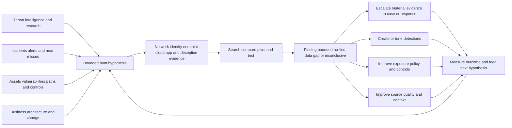

| Proactive principle | Plain meaning | Operational consequence | Failure prevented |
|---|---|---|---|
| Hypothesis before query | State what behavior may exist and what would support it | Searches have scope, evidence, and stop criteria | Random dashboard browsing |
| Hunt behavior, not only indicators | Adversaries change infrastructure and files | Use identity, sequence, relationship, and control context | IOC-only blind spots |
| Coverage bounds every result | No finding applies only to checked healthy data | Publish population, time, sources, method, and unknowns | "Nothing happened" claim |
| High fidelity is not infallibility | Strong signals still require identity, authorization, and integrity checks | Validate decoy/test/admin activity and source health | Automatic overreaction |
| Provider is shared capability | MDR augments expertise and hours under contract | Define RACI, evidence, escalation, response, and exit | Outsourced accountability illusion |
| Network plus identity adds meaning | Traffic becomes more useful when tied to the correct actor and app | Preserve mapping provenance and effective time | Shared-IP attribution |
| Detection is a product | Every analytic needs requirements, tests, ownership, monitoring, and retirement | Hunt findings become maintained capability | One-off query debt |
| Feedback is the outcome | A hunt is valuable when it changes cases, data, controls, exposure, or understanding | Track accepted improvements and residuals | Activity theater |

## JD Mapping

| JD signal | Capability developed | Customer or TSM artifact | Honest boundary |
|---|---|---|---|
| Develop SecOps expertise | Explain hunting, deception, MDR, data, detection, and feedback mechanics | Proactive-operations reference map | No production hunter/provider claim |
| Trusted advisor | Connect customer risk and blind spots to proactive options | Hunt and MDR decision brief | Customer owns risk and service decisions |
| Drive adoption and value | Convert telemetry and findings into repeatable workflows | Use-case adoption scorecard | No guaranteed detection or prevention |
| Troubleshoot complex environments | Isolate source, identity, hunt, decoy, provider, case, and action failures | Layered runbook | No unsupported product root cause |
| Use analytics | Define cohorts, windows, features, baselines, fidelity, coverage, and outcomes | SQL/Power BI-style hunt model | No product-internal schema claim |
| Coordinate stakeholders | Align SOC, hunters, IR, IAM, network, endpoint, cloud, app, privacy, business, and provider | RACI and handoff contract | TSM facilitates rather than commands |
| Communicate proactively | State hypothesis, evidence, scope, confidence, finding, residual, and next action | Hunt report and executive brief | No unsupported threat claim |
| Partner with Support/Product | Package redacted telemetry, decoy, or service evidence | Escalation packet | No defect, service credit, or roadmap promise |
| Apply AI responsibly | Bound AI to grounded hunt assistance and governed recommendations | AI/human hunt control plan | No autonomous threat conclusion or response claim |

## Candidate honesty note

Arti can say: "My production background is Microsoft enterprise escalation, not threat hunting, deception, MDR delivery, or SOC operations. I do bring transferable experience in hypothesis-led troubleshooting, network and identity traces, cross-source timelines, SQL/Power BI analysis, high-severity coordination, and knowledge scaling. I have studied these security methods and practiced only with fictional data. For Zscaler or an MDR service I would verify current telemetry, contract, entitlement, roles, and measured outcomes."

Neutral syntax preserves credibility. "I would frame the hunt this way" is not the same as "I hunted this threat in production." "The official page positions the service as" is not the same as "the customer receives this result." A fictional exercise is useful evidence of method when it is labeled honestly.

| Factual background | Transferable capability | Neutral evidence statement | Unsupported claim to avoid |
|---|---|---|---|
| M365/OneDrive/SharePoint support | Understand identity, permissions, SaaS, endpoint, browser, sync, and cloud service relationships | "I investigate behavior across enterprise layers." | "I hunted attackers in production." |
| Networking and traces | Analyze DNS, TCP, TLS, HTTP, proxy, path, process, and timing | "I can test network-behavior hypotheses." | "I operated ZIA Threat Hunting." |
| SQL and Power BI | Cohorts, joins, windows, baselines, outliers, quality, and trends | "I can build transparent hunt analytics." | "I queried a production security lake." |
| Critical escalations | Triage impact, coordinate specialists, preserve evidence, update stakeholders | "I can run disciplined evidence work." | "I led cyber incident response." |
| Mentoring and articles | Turn discoveries into repeatable runbooks and training | "I scale technical learning." | "I managed MDR analysts." |
| Responsible AI | Use grounded assistance and review output | "I validate AI-supported analysis." | "I deployed autonomous hunting agents." |
| Fictional synthetic NMH | Demonstrate hunt/service decision artifacts | "This scenario demonstrates method only." | "This is a customer detection result." |

## Beginner vocabulary and memory hooks

| Term | Meaning from zero | Why it matters | Analogy or memory hook |
|---|---|---|---|
| Proactive detection | Search and engineering before a known alert fully defines the problem | Finds gaps and emerging behavior | Inspect before alarm |
| Threat hunting | Bounded, hypothesis-driven search for suspicious activity not already resolved by alerts | Tests hidden behavior and visibility | Search for quiet leaks |
| Hunt hypothesis | Testable statement about actor behavior in a defined population | Gives the hunt purpose | Suspected route on a map |
| Threat intelligence | Collected and analyzed information about threats and implications | Seeds relevant hypotheses | Weather and adversary bulletin |
| TTP | Tactics, Techniques, and Procedures | Describes goals, methods, and specific implementations | Objective, method, exact play |
| IOC | Indicator of Compromise | Observable associated with known or suspected malicious activity | Known stolen plate |
| IOA | Indicator of Attack | Behavior suggesting attack activity | Suspicious driving pattern |
| Baseline | Expected behavior under stated population and time | Supports deviation analysis | Normal temperature range |
| Anomaly | Measured deviation from expectation | Clue requiring context | Unusual reading |
| Hunt population | Exact entities, sources, and period searched | Bounds conclusions | Survey area |
| Coverage | Portion of relevant behavior/population observable | Makes blind spots visible | Lit area of map |
| Telemetry | Data about activity or state | Hunt evidence | Instrument readings |
| Network context | Communication, destination, protocol, timing, volume, policy, and path evidence | Reveals behavior across entities | Road traffic record |
| Identity context | User/service identity, session, authentication, privilege, lifecycle, and ownership evidence | Connects behavior to actor/access | Badge and role record |
| Fidelity | How reliably a signal represents intended behavior | Shapes analyst trust and action | Image sharpness |
| Deception | Intentional decoys, lures, and false assets designed to reveal suspicious interaction | Creates defender-controlled signals | Marked dye packet or bait room |
| Decoy | Fake but realistic system, service, account, file, or resource | Interaction can be highly suspicious | Unused alarmed safe |
| Lure | Artifact that guides unauthorized exploration toward a decoy | Improves chance of detection | False map to alarmed room |
| Breadcrumb | Planted clue that suggests a path to a decoy | Detects enumeration or credential abuse | Trail leading to instrumented door |
| Honeypot | Decoy system intended to attract/observe attackers | Earlier/common deception concept | Empty alarmed storefront |
| Deterministic signal | Signal whose defined trigger has a direct intended interpretation | Can reduce ambiguity under valid assumptions | Seal broken on a never-used cabinet |
| MDR | Managed Detection and Response | Contracted service for detection, investigation, response support, and related operations | Specialist monitored response team |
| MSSP | Managed Security Service Provider | Broader managed security operations/services category | Outsourced security operations provider |
| SLA | Service Level Agreement | Contractual commitment and remedy structure | Delivery contract |
| SLO | Service Level Objective | Operational target | Internal delivery target |
| Escalation | Transfer or involvement of appropriate authority/expertise | Connects provider finding to customer action | Call specialist |
| Detection engineering | Lifecycle for reliable analytics | Turns hunt learning into maintained capability | Build and maintain alarms |
| Feedback loop | Outcome changes future data, detection, control, and process | Makes improvement cumulative | Learn, adjust, retest |
| Bounded negative result | No relevant evidence found within explicit healthy scope and method | Honest no-find statement | No leak found in inspected pipes |
| Dwell time | Duration harmful activity remains before discovery/removal | Outcome concept with measurement limits | Time leak remains unnoticed |

### Plain-English deep-dive 1 - Hunting is scientific inquiry, not wandering through logs

An engineer searching for an intermittent fault does not click every dashboard hoping something looks strange. They state a hypothesis, identify which traces should differ if it is true, define the affected population and time, run a safe query or test, compare alternatives, and record what the result can and cannot establish. An unexpected data gap may be as important as finding the fault.

Threat hunting uses the same discipline. A hypothesis might say: "A compromised cloud identity is using an approved file-sharing service from a new device to stage data in small periodic transfers that static volume alerts miss." The hunt defines identity and network features, sources, scope, time, exclusions, expected benign explanations, escalation criteria, and stop conditions. Its outcomes can be a case, a bounded no-find, an inconclusive result, a data gap, or a detection/control improvement.

## Reactive alerting versus proactive hunting

Reactive detection evaluates known logic against arriving evidence and produces alerts. Proactive hunting starts from a question and searches for behavior that may not have generated an adequate alert. The distinction is not absolute. Mature hunts often reuse detections, and successful hunts can become production analytics. Incident response can seed hunts for wider scope, while hunts can discover incidents.

| Dimension | Reactive detection | Threat hunting | Connection |
|---|---|---|---|
| Trigger | Rule/model match or report | Hypothesis from intelligence, incident, exposure, change, anomaly, gap | Alerts can seed hunts |
| Scope | Defined by analytic inputs | Explicit population/time chosen by hunter | Hunt may test analytic coverage |
| Cadence | Continuous/scheduled | Campaign, recurring, event-driven, continuous hunt service | Repeated hunt may become detection |
| Output | Alert/signal | Finding, no-find, inconclusive, gap, case, new analytic | Shared evidence and case process |
| Human work | Triage and investigate outputs | Design, query, pivot, challenge, communicate | Automation assists both |
| Main risk | Noise and blind spots | Unbounded search and confirmation bias | Quality governance applies to both |

## Hunt lifecycle

A complete hunt starts with a decision need, not a query. Select a hypothesis relevant to customer risk. Define observable behaviors and competing benign explanations. Inventory required sources and context. Verify data health before interpretation. Choose method, population, time, query/test, stop condition, and escalation threshold. Execute reproducibly. Review findings. Escalate material evidence. Then convert learning into detections, source fixes, controls, exposure work, threat intelligence, playbooks, or documented residuals.

| Hunt phase | Core question | Output | Exit evidence |
|---|---|---|---|
| Trigger | Why hunt now? | Intelligence, incident, exposure, change, anomaly, gap | Decision relevance and owner |
| Hypothesis | What behavior may exist? | Testable statement and alternatives | Predictions and falsifiers |
| Data contract | Which evidence can observe it? | Sources, fields, IDs, time, health, limits | Coverage assessment |
| Design | Who/what/when/how will be searched? | Population, method, query, stop/escalation | Peer review and authorization |
| Execute | What does reproducible search return? | Results with source references | Query/version/time captured |
| Analyze | Which results are expected, suspicious, unknown, or defects? | Evidence ledger and pivots | Quality-reviewed classification |
| Escalate | Does evidence meet case/incident threshold? | Case handoff and response input | Customer authority engaged |
| Operationalize | What should change permanently? | Detection, control, data, exposure, process improvement | Owner, validation, due date |
| Measure | Did the hunt improve decisions/capability? | Outcome and residual review | Denominator and feedback recorded |

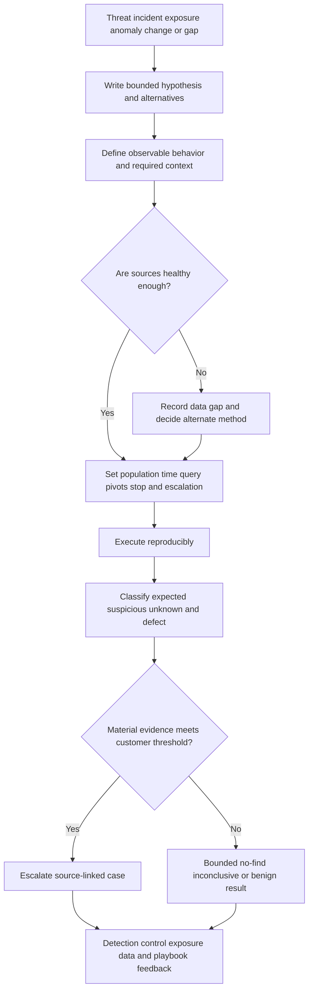

## Writing a hunt hypothesis

A strong hypothesis names a plausible actor or access condition, behavior, target population, data evidence, and customer consequence. It avoids assuming malicious intent. It is narrow enough to complete and broad enough to matter. It includes alternatives and tells the hunter what result would challenge it.

| Hypothesis component | Question | Example generic content | Weak version |
|---|---|---|---|
| Trigger | Why is this plausible now? | Recent incident pattern or exposure | "Threats are increasing" |
| Actor/access | What starting capability is assumed? | Valid cloud identity from unmanaged device | "A hacker" |
| Behavior | Which sequence or relationship matters? | New identity-device pair uses trusted service periodically | "Suspicious traffic" |
| Target | Which identities/apps/data/services? | Privileged contractor cohort and approved SaaS | "All users" |
| Evidence | Which network/identity/app sources can observe it? | Auth/session, inline traffic, app audit | "Check SIEM" |
| Alternatives | Which benign causes fit? | Migration, automation, travel, support test | No benign hypothesis |
| Consequence | Why would it matter? | Potential access to regulated repository | "Bad activity" |
| Falsifier | What would weaken the hypothesis? | Approved change and known managed device binding | No disconfirming evidence |

## Data sources and evidence hierarchy

No single source sees the entire attack. Endpoint evidence can show process lineage. Network/inline evidence can show communication and policy decisions. Identity sources show authentication, sessions, factors, privilege, and lifecycle. Cloud/app sources show object and control-plane actions. Data-security sources show classifications and governed channels. Deception creates intentional interaction points. Threat intelligence adds relevance. Business context adds consequence.

| Source family | Useful questions | Blind spots | Cross-check |
|---|---|---|---|
| Endpoint/EDR | Which process, user, file, and local connection? | Unmanaged/offline/unsupported, sensor gaps | Network, identity, app evidence |
| Network/NDR/inline | Which entity communicated with what, when, under which policy? | Placement, encryption, direct paths, process intent | Endpoint and app evidence |
| IAM/PAM | Which identity authenticated, held privilege, and had sessions? | App-local identities, token propagation, shared accounts | App and endpoint identity |
| Cloud control plane | Which resource/role/config action occurred? | Workload runtime and external paths | Identity, workload, network |
| SaaS/app audit | Which object/action/result occurred? | Retention, API scope, local semantics | Identity and data context |
| Data security | Which sensitive class/action/channel was observed? | Classification/coverage/false results | Source object and app-native audit |
| Deception | Who interacted with defender-planted artifact? | Authorized scans/tests, misdeployment, coverage | Exact entity and decoy integrity |
| Threat intelligence | Which indicators/behaviors/campaigns are relevant? | Staleness, sharing, applicability | Local observation and time |
| Business systems | Which service, owner, criticality, change, and obligation? | Drift and attestation gaps | Owner and source-effective time |

## High-fidelity network and identity context

Network evidence becomes far more useful when a team can link a communication to the correct identity, session, device, app, policy decision, and business role. Identity evidence becomes more useful when the team can see where and how that identity communicated. The combination can identify patterns such as a valid identity using unusual destinations, a new device-to-user relationship, periodic communication through an approved service, or activity outside expected app and time boundaries.

High fidelity does not mean complete visibility or malicious proof. Identity mapping can be stale. Shared egress IPs hide devices. Proxies change source/destination perspective. Encrypted traffic limits content depending on observation and policy. A legitimate process can contact a malicious destination; a compromised process can use a reputable service. Preserve exact observation point, source-native identity, mapping time, policy result, and limitations.

| Context element | Question | Quality check | Overclaim to avoid |
|---|---|---|---|
| User/service identity | Which scoped object acted? | Immutable tenant/source ID and lifecycle | Display name equals person |
| Session | Which authentication/access session? | Session/token/app binding and time | User activity without session proof |
| Device/workload | Which client entity? | Sensor/certificate/cloud IDs and aliases | IP equals endpoint |
| Destination/app | Which service/object was reached? | Resolved app/domain/resource and observation point | Domain equals intent |
| Policy decision | What control evaluated and decided? | Rule/version/context/result semantics | Allowed means safe; blocked means harmless |
| Traffic behavior | What protocol, timing, volume, direction, sequence? | Source coverage, late data, units | Volume alone equals exfiltration |
| Business role | What expected behavior and consequence apply? | Owner, effective time, criticality | Static role is always current |
| Threat relevance | Why is pattern suspicious now? | Local evidence plus fresh reliable intelligence | Intelligence equals occurrence |

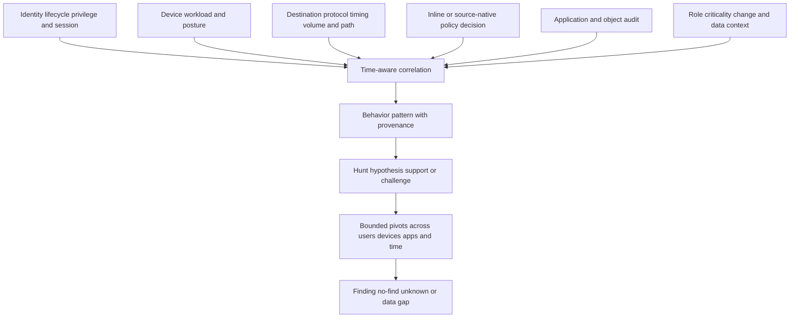

### Plain-English deep-dive 2 - High fidelity is a property of a claim, not a vendor label

A toll record may be very reliable evidence that a vehicle with a particular transponder passed a checkpoint at a time. It is weaker evidence about who drove, why they traveled, what was inside the vehicle, or whether a crime occurred. Adding a badge record and delivery order can strengthen some claims, but each source has its own meaning and error modes.

Security evidence works similarly. Network and identity context can strongly establish that a scoped identity/session and device communicated with an app under a policy. It may still be uncertain whether the human intended it, whether a process was compromised, or whether sensitive data moved. State confidence for each assertion and keep direct observations separate from intent and impact.

## Hunt query and analysis mechanics

Hunts can use exact-match indicators, sequence rules, joins, aggregations, peer comparisons, time-series patterns, graph traversal, clustering, and manual pivots. Begin with transparent methods. Use more complex models when they improve a defined decision and can be validated. Preserve query version, parameters, timezone, source/data versions, execution time, and result references.

Common analytical traps include current-state joins to historical events, double counting through many-to-many joins, ignoring late data, using average instead of distribution, building peers from mixed roles, and treating null as false. Test known positive, known benign, boundary, missing, delayed, duplicate, and volume cases. Sampling can help review large results but must not be presented as complete assessment.

| Method | Good use | Limitation | Validation |
|---|---|---|---|
| IOC match | Fresh specific indicator search | Reuse, expiry, shared infrastructure, easy evasion | Validity window and local context |
| Sequence | Ordered behavior pattern | Clock/late-data and alternative sequences | Source/receipt time tests |
| Aggregation | Repeated/volume behavior | Baseline and denominator sensitivity | Distribution and cohort review |
| Peer comparison | Role/entity deviation | Bad peer groups and organizational change | Owner/HR/IAM effective-time validation |
| Time series | Periodicity, drift, bursts | Seasonality and missing intervals | Compare source-health timeline |
| Graph traversal | Relationships and paths | False edges and combinatorial expansion | Edge provenance/confidence/depth limit |
| Statistical anomaly | Unknown deviation | Explainability, drift, bias | Backtest and analyst outcome review |
| Manual pivot | Novel reasoning and context | Inconsistency and limited scale | Notebook/runbook and peer review |

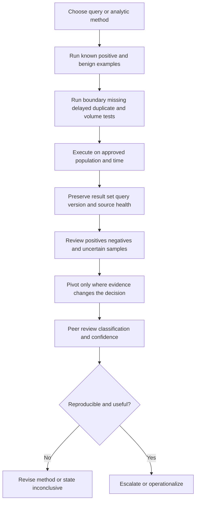

## Hunt result taxonomy

A hunt should never be forced into "threat found" or "nothing found." Use a richer result taxonomy. A confirmed or customer-declared incident is one possible outcome, but most hunts produce evidence that needs triage, benign explanations, tuning opportunities, source gaps, or bounded negative results.

| Result | Meaning | Required statement | Feedback |
|---|---|---|---|
| Material finding | Evidence supports suspicious/adverse activity requiring case | Source-linked observations, scope, confidence, authority | Incident/response and detection |
| Suspicious lead | Evidence warrants more investigation | Hypotheses, next check, owner, deadline | Case or follow-up hunt |
| Expected/benign | Activity explained with authoritative evidence | Scope and reason, not blanket allow | Detection/context tuning where safe |
| Bounded no-find | No relevant evidence in checked healthy scope/method | Population, time, sources, query, limitations | Residual and future trigger |
| Inconclusive | Evidence does not separate hypotheses | Missing facts and decision | Alternate method or risk decision |
| Data gap | Required behavior is not observable/reliable | Source, population, time, impact | Data onboarding/quality work |
| Detection gap | Behavior observable but existing analytics miss it | Test evidence and requirement | Detection engineering |
| Control/exposure gap | Hunt reveals unsafe access/path/control | Evidence and business context | CTEM/remediation/policy |
| Intelligence update | Local evidence changes threat relevance | Reliability, scope, sharing rules | Intelligence and future hunts |

### Plain-English deep-dive 3 - A no-find result is a measured statement, not reassurance

An inspector can say, "No leak was found in the twelve accessible pipes during a pressure test using this method." They cannot say, "The building has no leaks" if three pipes were inaccessible and the roof was not tested. The bounded result is still valuable: it narrows uncertainty and records what was checked.

A hunt should use the same honesty. State the eligible population, healthy checked population, time, sources, query or method, known blind spots, and how late data will be handled. A no-find can support a decision, but it does not prove absence outside that boundary. Data gaps are outcomes that deserve owners, not footnotes hidden after a confident conclusion.

## Deception from first principles

Deception introduces defender-controlled artifacts that legitimate users and systems should not normally need. Decoys imitate systems, services, accounts, files, credentials, sessions, applications, or infrastructure. Lures and breadcrumbs make the decoys discoverable to unauthorized exploration. Interaction can be a high-fidelity signal because the defender controls the asset and expected legitimate-use assumptions.

The reviewed Zscaler Deception page publicly positions decoys, lures, and breadcrumbs across endpoint, identity/Active Directory, cloud, application, network, and AI-related surfaces, plus integration with Zscaler and third-party tools. It uses strong marketing language such as deterministic and confirmed. In customer operations, validate decoy integrity, authorized scanner/red-team/administrator behavior, accidental interaction, entity mapping, source health, and response authority before a consequential action. This caveat is general operational rigor, not a claim that the official product performs poorly.

| Deception component | Purpose | Design question | Failure risk |
|---|---|---|---|
| Decoy asset/service | Attract unauthorized interaction | Is it realistic, isolated, instrumented, and safe? | Becomes vulnerable pivot or obvious noise |
| Decoy identity/credential | Reveal credential discovery/use | Can legitimate tools/users ever touch it? | Operational scanner or admin triggers |
| Lure/file/bookmark | Guide exploration to monitored target | Where is placement authorized and plausible? | User confusion or privacy issue |
| Breadcrumb | Suggest relationship/path | Does it reveal only safe fictional data? | Leaks real secrets/architecture |
| Alert | Notify on defined interaction | Are entity, time, artifact, action, and integrity clear? | High-fidelity label without target proof |
| Containment link | Trigger governed response | Which actions are pre-authorized and reversible? | Automatic broad disruption |
| Intelligence | Capture methods/infrastructure safely | What collection and legal/privacy limits apply? | Overcollection or unsafe engagement |

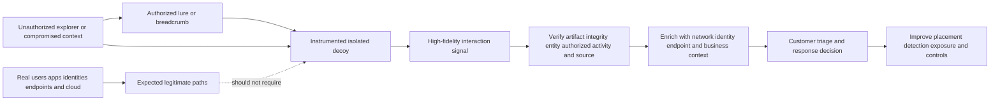

## Deception design and safety

Begin with a threat model and target behavior. Decide which unauthorized discovery or interaction should be revealed. Place decoys where an attacker could plausibly find them but where normal business workflows should not depend on them. Use fictional content and no real reusable secrets. Isolate and monitor the infrastructure. Define lifecycle, ownership, patching, rotation, naming, inventory, legal/privacy, red-team/scanner allowlists, and retirement.

| Design area | Required decision | Acceptance test |
|---|---|---|
| Objective | Which behavior or path should interaction reveal? | Authorized simulation reaches decoy as expected |
| Placement | Which endpoint, identity, app, cloud, network, or AI surface? | No normal workflow requires artifact |
| Realism | Is artifact plausible enough for target behavior? | Controlled exercise discovers it |
| Safety | Can decoy become pivot, leak data, or affect production? | Segmentation, no real secrets, abuse tests |
| Instrumentation | Which event, identity, time, path, and content are captured? | Signal reproduces with native evidence |
| Legitimate interaction | Which scanners, admins, tests, backups, or users may touch it? | Allowlist/process and alert classification tested |
| Response | What triage or pre-authorized action follows? | Exact target, approval, rollback, read-back tested |
| Lifecycle | Who deploys, changes, monitors, and retires? | Inventory and stale-decoy review works |
| Privacy/legal | Which interactions/content may be collected? | Approved purpose, access, retention, regions |

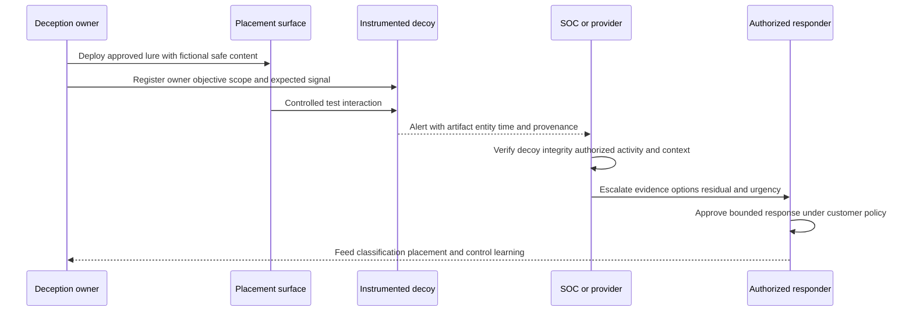

### Plain-English deep-dive 4 - Deception creates a quiet room, but the door still needs a camera

If an organization builds a locked room that no employee should enter and instruments the door, opening it is highly suspicious. Yet the operator still checks whether maintenance, a safety inspection, a mislabeled key, or a broken sensor explains the event before accusing a person or shutting down a building. They also ensure the room itself cannot endanger anyone.

Deception gains fidelity by controlling expected use, not by suspending operational rigor. Verify which decoy fired, whether it was healthy and current, which exact identity/device interacted, whether an authorized test or scanner was active, and what the interaction actually did. The resulting signal can justify faster triage and preplanned precautions, but consequential response still follows customer authority and exact target validation.

## MDR from first principles

Managed Detection and Response is a contracted service that supplies people, process, technology, content, and operating coverage for detection, investigation, threat hunting, notification, response guidance, and sometimes approved response/remediation actions. Scope varies widely. MDR is not a single universal product specification, and it does not eliminate the customer's accountability for risk, architecture, identity, business context, incident authority, legal/privacy, communications, and recovery.

The reviewed Zscaler MDR page publicly positions around-the-clock expert and AI-supported operations, detection engineering, threat intelligence, hunting, investigation, response support, ZIA context, and complementarity with an existing SOC. It describes ZIA integration and response possibilities in public terms. The contract and current technical documentation determine actual sources, hours, service levels, actions, hands-on-keyboard scope, retention, regions, and escalation.

| MDR capability area | Contract question | Customer responsibility that remains | Evidence to test |
|---|---|---|---|
| Monitoring hours | Which sources/use cases are monitored when? | Maintain source and contact readiness | Off-hours synthetic notification drill |
| Detection content | Who creates, tunes, tests, owns, and exports analytics? | Provide context and approve risk logic | Positive/negative detection test |
| Investigation | How deep, across which tools/data, with what evidence? | Grant lawful access and supply missing context | Reproducible sample case |
| Hunting | Recurring, intelligence-led, customer-requested, transparent? | Define priorities and receive findings | Hunt plan/result review |
| Notification | Which severity, channel, contacts, retries, acknowledgements? | Maintain on-call roster and response | Escalation drill |
| Response guidance | Recommendations or execution? | Approve/execute where retained | Scenario walkthrough |
| Hands-on action | Which exact systems/actions, authority, limits, rollback? | Retain incident/business authority | Bounded action test |
| Reporting | Which service, quality, outcome, coverage, and residual metrics? | Challenge denominator and act on learning | Monthly evidence review |
| Transition/exit | How are data, detections, cases, and knowledge returned? | Maintain continuity and ownership | Export/termination exercise |

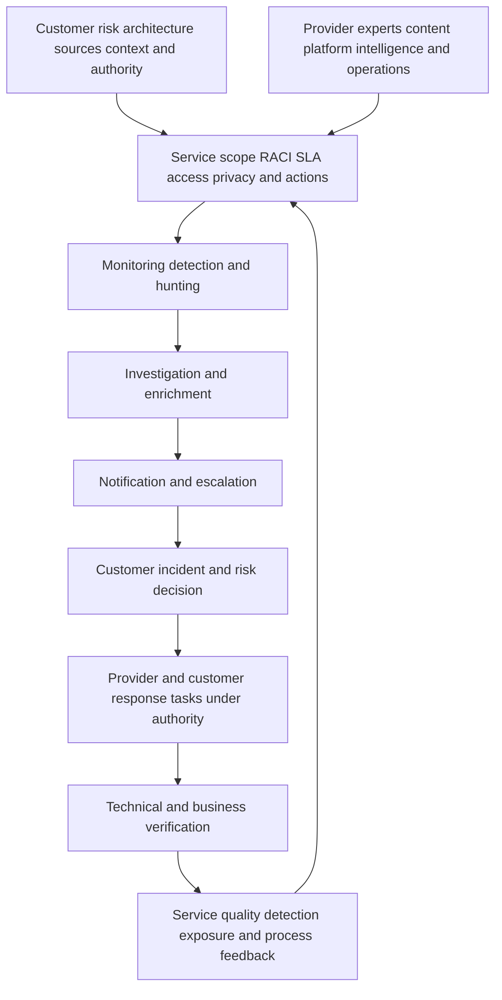

## MDR operating contract and RACI

Write responsibilities at task level. "Provider handles response" is too vague. Who validates the alert? Who can query endpoint, identity, network, and cloud systems? Who declares an incident? Who calls the application owner? Who may isolate a device at 3 a.m.? Who preserves evidence, contacts legal/privacy, manages communications, restores service, and accepts residual risk? What happens if the customer does not acknowledge?

| Activity | Provider role example | Customer role example | Boundary to document |
|---|---|---|---|
| Source health | Monitor agreed ingestion/telemetry | Operate source/integration and remediate access | Detection versus connector ownership |
| Detection triage | Validate and enrich in agreed scope | Supply business/context exceptions | Closure authority and visibility |
| Deep investigation | Pivot across contracted sources | Grant context/access and engage owners | Data/tools not in scope |
| Threat hunting | Execute agreed methodology/cadence | Set priorities and consume feedback | Custom request and result format |
| Notification | Send classified finding and retry/escalate | Maintain roster and acknowledge | Channels, deadlines, fallback |
| Incident declaration | Recommend/escalate evidence | Authorized customer role declares | Provider alert is not declaration |
| Containment | Recommend or execute exact pre-authorized actions | Approve and own business impact | Action list, thresholds, rollback |
| Recovery | Provide evidence/guidance in scope | Service owner restores and accepts residual | Provider hands-on boundary |
| Reporting | Produce service and security evidence | Review, decide, and fund improvements | Metric definitions and raw evidence |
| Quality improvement | Tune content and service process | Correct context and source/control gaps | Change ownership and validation |

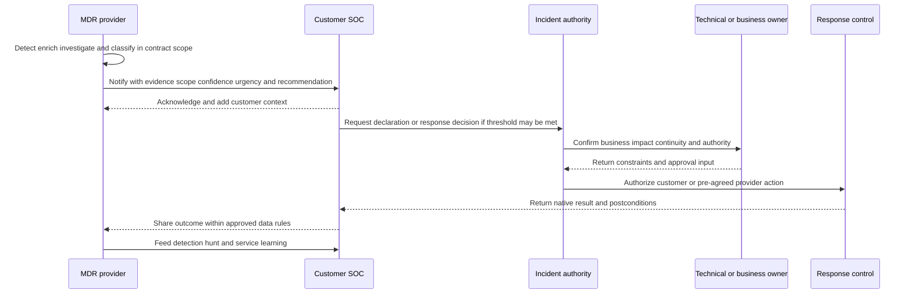

## Choosing internal hunting, managed hunting, MDR, or hybrid

The decision depends on business risk, service hours, skills, source/tool complexity, response authority, privacy, language/region, resilience, hiring, cost, and desired control. Internal teams may hold deep context and authority but face staffing gaps. A managed hunt service can add specialist proactive analysis without assuming full alert operations. MDR can add broader continuous detection and response support. Hybrid/co-managed models can combine context and scale but need strong handoffs.

| Model | Strength | Risk | Best-fit question |
|---|---|---|---|
| Internal hunting | Deep customer context and control | Skill/capacity/coverage concentration | Can team sustain method and hours? |
| Managed threat hunting | Specialist proactive focus | Findings may stop at handoff | Who receives and operationalizes results? |
| MDR | Broader continuous service and expertise | Contract ambiguity and dependency | Which exact sources/actions/outcomes are included? |
| MSSP monitoring | Broad operational service possibilities | May focus on alert handling rather than deep response | What investigation and response depth exists? |
| Co-managed/hybrid | Combines provider scale and customer context | Duplicate work and unclear authority | Is one case/RACI/handoff model defined? |
| On-demand IR retainer | Surge expertise for incidents | Not continuous detection/hunting | How is activation integrated with daily operations? |

## Proactive detection engineering

A hunt query becomes a production detection only after engineering. Define target behavior, required sources and context, semantic/time contracts, logic, exclusions, expected alert grain, severity/priority inputs, evidence output, playbook, owner, and metrics. Test positive, benign, boundary, delayed, duplicate, missing-source, source-drift, and volume cases. Shadow or backtest where appropriate. Monitor coverage, fidelity, latency, cost, analyst outcomes, drift, and unintended effects.

| Detection element | Required detail | Hunt-to-detection risk |
|---|---|---|
| Requirement | Behavior, threat relevance, customer consequence | Copy query without decision need |
| Data contract | Sources, populations, fields, semantics, time, health | Works only in one hunt snapshot |
| Logic | Sequence, aggregation, threshold/model, window, grouping | Hidden manual analyst steps |
| Output grain | One alert represents what? | Alert storm or over-grouping |
| Evidence | Source-linked facts included | Analyst cannot reproduce |
| Context | Identity, app, business, exposure, control | Stale enrichment changes priority |
| Playbook | Triage, pivots, authority, action, closure | Alert with no owner or next step |
| Tests | Positive, negative, boundary, failure, load | Overfitted to known case |
| Monitoring | Coverage, quality, latency, drift, cost, outcome | Rule silently decays |
| Lifecycle | Owner, review, version, retirement | Permanent obsolete content |

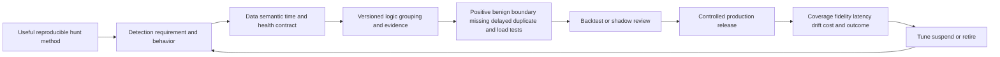

## Feedback loops

Hunt and MDR findings should improve more than alert rules. An identity mapping defect should improve entity resolution. A decoy interaction may reveal an exposed credential path. A no-find with a data gap should create source onboarding or quality work. Repeated benign administrative behavior can improve change context or playbooks. A missed incident can update intelligence requirements and validation tests.

| Finding type | Detection feedback | Exposure/control feedback | Operating feedback |
|---|---|---|---|
| New suspicious behavior | New analytic or test corpus | Policy/path review | Playbook and training |
| False positive | Logic/context/exclusion correction | Verify no control gap hidden | Closure taxonomy and review |
| False negative/miss | Coverage and detection redesign | Identify path and control failure | Escalation and validation improvement |
| Decoy interaction | Correlate exact entity and technique | Remove exposed real path/credential | Deception placement and response |
| Identity defect | Mapping/effective-time correction | IAM lifecycle/control remediation | Source-owner governance |
| Bounded no-find | Record method and future trigger | Residual remains explicit | Avoid false assurance |
| Data gap | Health gate and degraded-state logic | Telemetry/control coverage action | Integration owner/SLA review |
| Provider handoff failure | Notification/case workflow fix | Delay-risk assessment | Contract/RACI/escalation change |
| Successful containment | Validate detection-to-control chain | Harden policy and alternate paths | Recovery and action test update |

### Plain-English deep-dive 5 - The best hunt artifact may be a better alarm or a repaired sensor

A safety inspector who finds no fire but discovers that smoke detectors in one wing are disconnected has produced an important result. Fixing the sensors may protect the building more than writing a dramatic report. If the inspector identifies a recurring benign steam source, changing placement or logic can reduce false alarms without weakening fire detection.

Threat hunting creates value when learning enters normal operations. Findings become cases; repeated logic becomes tested detections; data gaps become owned telemetry work; exposure paths become remediation; decoy placement improves; provider handoffs improve; and bounded negative results inform future triggers. Count accepted, validated improvements and customer decisions, not only hunts completed.

## Metrics and measurement

Metrics need grains, denominators, exclusions, time bases, and guardrails. Hunt count measures activity, not risk reduction. Finding rate can be gamed by broad definitions. Detection count can reward noise. Mean response time can improve by closing complex work prematurely. Use a balanced set covering coverage, quality, timeliness, outcome, learning, capacity, cost, and safety.

| Metric family | Example question | Guardrail |
|---|---|---|
| Coverage | What relevant population/behavior has healthy evidence? | Do not use tool count as coverage |
| Hunt quality | Were hypotheses bounded, reproducible, peer reviewed, and decision-linked? | Review sample, not self-attestation only |
| Finding quality | Which findings became validated cases versus benign/defect/unknown? | Preserve classification consistency |
| Detection conversion | Which hunt methods became tested maintained analytics? | Conversion is not always appropriate |
| Data improvement | Which gaps were fixed and validated? | Ticket closure not source proof |
| Response outcome | Which actions interrupted paths with acceptable business effect? | Avoid causal claims without evidence |
| Recurrence | Did same behavior/control gap return? | Environment/threat changes matter |
| Provider service | Notification, evidence, acknowledgement, handoff, scope quality | Contract definitions and exclusions explicit |
| Safety/privacy | Wrong target, excessive data, harmful action, access violation? | Zero incidents may indicate underreporting |
| Cost/capacity | Analyst/provider effort per useful decision and sustained coverage | Do not sacrifice quality for volume |

## Troubleshooting hunts, deception, and MDR

Start with one concrete failure: expected hunt evidence missing, decoy signal absent or unexpected, provider notification delayed, entity attribution wrong, or action result inconsistent. Capture native IDs, UTC, scope, hypothesis/decoy/service contract, source health, expected versus observed, business impact, and first occurrence.

| Symptom | Cheap discriminating check | Likely layer | Evidence packet |
|---|---|---|---|
| Known test event absent from hunt | Search source-native ID/time and verify population | Source scope, delay, parsing, query | Native record, query/version, health |
| Hunt results suddenly drop | Compare source volume/latency and query changes | Data gap, schema drift, logic | Before/after distribution and changes |
| Wrong user attributed to traffic | Inspect scoped identity/session mapping at event time | Entity resolution, proxy/NAT, stale mapping | Native IDs and mapping lineage |
| Decoy test does not alert | Verify artifact placement, interaction path, instrumentation, policy | Deployment, routing, health, test | Decoy ID, test steps, source evidence |
| Decoy alerts on scanner | Confirm authorized scanner identity/schedule and exact interaction | Design/allowlist/process | Scanner record, decoy evidence, owner |
| MDR notifies wrong contact | Compare roster/version/severity/escalation path | Contract/workflow/contact data | Notification IDs, timestamps, roster |
| Provider says contained; customer sees access | Inspect exact action target/native result/postconditions | Scope, action semantics, alternate path | Operation and target evidence |
| Repeated benign hunt finding | Check change/business context and detection feedback | Context/tuning/handoff | Case outcomes and owner evidence |

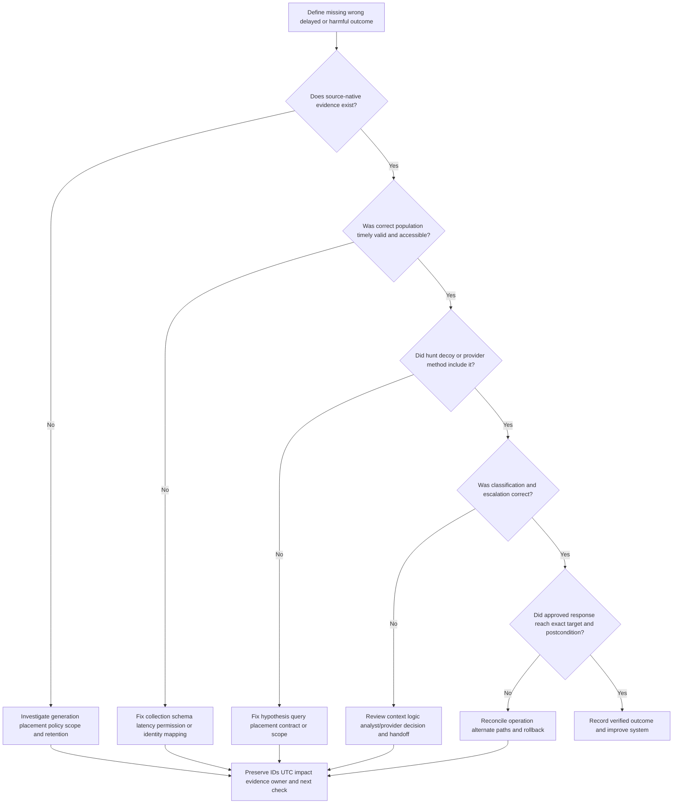

## Security, privacy, legal, and deception ethics

Hunting can reveal detailed employee, customer, endpoint, web, cloud, and data behavior. Use a defined security purpose, approved access, minimization, regional and labor/legal requirements, retention, masking, and controlled exports. Do not turn hunt data into general employee surveillance. Sensitive cases should use restricted need-to-know access and approved communications.

Deception must not collect more than necessary, expose real credentials, create unsafe vulnerable infrastructure, interfere with users, or invite uncontrolled counteraction. Do not "hack back." Provider access should be least privilege, time/role bounded, monitored, and contractually governed. Data transfer, subprocessors, regions, retention, incident handling, breach notification, and termination deserve explicit review.

| Risk | Potential harm | Control | Validation |
|---|---|---|---|
| Overbroad hunt access | Unnecessary personal/business surveillance | Purpose, role, scoped queries, audit | Query/access review |
| Wrong entity attribution | Unfair accusation or wrong response | Time-aware identity and human validation | Shared/recycled identity tests |
| Decoy contains real secret | Credential/data exposure | Fictional nonreusable content and scanning | Secret scan and review |
| Decoy becomes pivot | New attack surface | Isolation, hardening, monitoring, no trust path | Controlled abuse test |
| Unauthorized interaction test | Operational/legal violation | Written scope and change approval | Authorization record |
| Provider overprivilege | Broad customer compromise risk | Least privilege, separate roles, JIT, audit | Access and negative-permission test |
| Cross-customer leakage | Confidentiality breach | Tenant isolation and data handling controls | Contract/evidence and isolation test |
| Prompt injection | Logs/content manipulate AI workflow | Treat content as data, tool allowlist, validation | Adversarial samples |
| Automated overresponse | Business outage from strong signal | Exact target, preauthorization, limits, rollback | Failure drill |
| Evidence overretention | Privacy and breach impact | Purpose-based retention/deletion/hold | Deletion and legal-hold tests |

## Failure modes and misconceptions

| Misconception or failure | Why it fails | Better practice |
|---|---|---|
| Hunting means browsing alerts | No hypothesis, scope, or falsifier exists | Start with a decision-relevant hypothesis |
| Every hunt must find a threat | Incentivizes confirmation bias and weak findings | Accept no-find, inconclusive, and gap outcomes |
| No-find proves no compromise | Coverage/method/time bound the result | Publish checked and unknown populations |
| Threat intelligence proves local activity | Intelligence may be stale, broad, or inapplicable | Require local source evidence |
| Network data identifies the human | NAT, proxies, shared devices, and session mapping intervene | Correlate identity/session/device with time |
| High-fidelity means no validation | Authorized tools/tests or mapping defects can trigger | Verify exact artifact/entity/source and authority |
| Deception replaces endpoint/network detection | It instruments selected interactions, not every behavior | Use complementary coverage |
| A decoy is safe because it is fake | It can leak, pivot, confuse, or overcollect | Engineer isolation and lifecycle |
| MDR replaces customer accountability | Provider lacks some context/authority and works by contract | Shared RACI and customer governance |
| 24/7 means every source and response is covered | Hours do not define scope, SLA, action, or access | Read and test contract details |
| More detections prove better security | Noise and overlap can worsen outcomes | Measure behavior coverage and fidelity |
| Hunt query can go straight to production | Manual context and edge cases may be hidden | Complete detection-engineering lifecycle |
| Provider closure equals customer recovery | Administrative state is not technical/business proof | Reconcile case, action, and postconditions |
| AI can hunt without adversarial controls | Retrieved data can be malicious/incomplete | Bound tools, validate sources, retain human review |

## Explicitly fictional and synthetic NMH proactive case

Everything in this section is an explicitly fictional and synthetic NMH teaching scenario. Every date is a labeled fictional future date later than the 2026-08-24 source snapshot. Nothing is a customer fact, Zscaler output, provider service result, product result, or prediction.

On fictional future date **2026-10-05**, fictional synthetic NMH launches a hunt after an invented industry advisory describes compromised identities using trusted file-sharing services in periodic low-volume transfers. The fictional hypothesis is: "A synthetic contractor identity may use a new test device to access a trusted cloud service periodically after authentication from an unusual context, without crossing a static volume threshold." The eligible population is thirty fictional training identities over seven fictional days. Two identity records are explicitly marked unavailable, so the healthy checked denominator is twenty-eight.

The fictional hunt uses invented identity sessions, endpoint inventory, inline web metadata, app audit, and business context. It finds one synthetic identity-device pair with periodic access. A fictional change record shows an approved backup test, but the device ID in the change is different. The hunter keeps authorized-test and compromised-identity hypotheses alive. A synthetic deception credential located in the training path is then touched by the same test session, producing a fictional high-fidelity clue. The exercise owner later confirms that the touch was not part of the approved backup plan.

| Fictional synthetic evidence | Teaching observation | Interpretation | Next check |
|---|---|---|---|
| Identity session | New device association for contractor U-42 | Supports unusual-access hypothesis | Verify device certificate and lifecycle |
| Network pattern | Periodic trusted-service traffic below static threshold | Behavior of interest, not exfiltration proof | Compare app object/actions and peers |
| Change record | Backup test approved for different device | Challenges simple benign explanation | Contact authorized owner through approved channel |
| App audit | Synthetic files read; no external receipt evidence | Access observed, transfer impact unknown | Review object IDs and destination semantics |
| Deception event | Fictional training credential touched by same session | High-fidelity unauthorized-interaction clue | Verify decoy integrity, scanner/test exclusions, entity mapping |
| Coverage | Twenty-eight of thirty identities checked | Bounded scope only | Review two unavailable identities later |

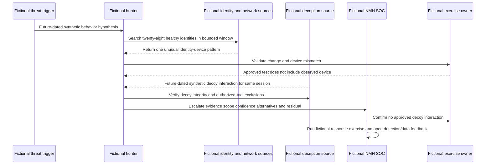

The fictional scenario does not claim compromise, data exfiltration, or a product detection. It demonstrates a progression from hypothesis to cross-source evidence, a high-fidelity deception clue, customer validation, and escalation. The final synthetic outputs are a case for authorized incident simulation, a new detection requirement for identity-device-plus-periodic-service behavior, a decoy-placement review, and a source-availability task for the two unchecked identities.

## Practical scenarios and decision drills

### Scenario 1 - Hunt returns no findings but one source was down

Publish a bounded negative result for the healthy checked scope and a separate data gap. Decide whether alternate evidence is sufficient, whether to rerun after recovery, and which residual remains. Do not combine "no findings" and "full coverage."

### Scenario 2 - Network pattern uses a popular cloud service

Shared infrastructure and legitimate tools weaken IOC-only conclusions. Resolve identity, session, device, app object/action, timing, peer behavior, and change context. Hunt the behavior sequence, not the domain reputation alone.

### Scenario 3 - Deception alert comes from a vulnerability scanner

Verify authorized scanner identity, schedule, target scope, and exact interaction. Classify appropriately, then decide whether the scanner should be excluded, the decoy moved, or the alert retained as a control test. Avoid hiding unauthorized scanner behavior through a broad allowlist.

### Scenario 4 - Decoy interaction triggers an automatic isolation proposal

Confirm decoy integrity, exact entity, legitimate-test exclusions, active risk, business role, supported action, preauthorization, rollback, and postconditions. High fidelity can accelerate a preplanned branch but does not erase target and authority checks.

### Scenario 5 - MDR notifies after the documented customer contact left

Protect the current incident through fallback escalation, then correct roster governance. Review provider retry/acknowledgement evidence, customer maintenance duties, and notification tests. Treat contact health as part of service readiness.

### Scenario 6 - Customer assumes MDR replaces internal SOC

Map every detection, investigation, declaration, containment, legal/privacy, communications, recovery, data, and governance task. Show provider and customer roles under the contract. Identify retained skills and continuity requirements.

### Scenario 7 - Hunt query becomes too expensive for continuous detection

Return to behavior and decision requirements. Reduce scope, precompute governed features, schedule appropriately, use a different source, or retain as periodic hunt. Do not weaken semantics invisibly merely to run continuously.

### Scenario 8 - AI-generated hunt hypothesis targets one employee unfairly

Require decision relevance, population rationale, privacy authority, alternative explanations, source quality, and peer review. Reframe around behavior and risk rather than personal suspicion. Audit access and avoid employment conclusions.

## Artifact kit

| Artifact | Minimum content | Quality gate | Interview value |
|---|---|---|---|
| Hunt trigger register | Intelligence, incident, exposure, change, anomaly, gap and priority | Decision owner and relevance | Shows program governance |
| Hunt hypothesis card | Actor/access, behavior, population, evidence, alternatives, consequence, falsifier | Bounded and testable | Shows analytical rigor |
| Data contract | Sources, fields, IDs, times, health, population, limitations | Known-event reconciliation | Shows telemetry literacy |
| Hunt plan | Method, query, pivots, stop, escalation, safety, privacy | Peer reviewed and authorized | Shows repeatability |
| Hunt notebook | Query/version, execution, results, decisions, references | Another analyst reproduces | Shows evidence discipline |
| Scope/result statement | Eligible, checked, positive, no-find, unknown, time, method | Denominators explicit | Prevents overclaim |
| Network-identity map | User/session/device/destination/policy/app/business relationships | Provenance and time on every link | Shows context reasoning |
| Deception design | Objective, placement, safety, instrumentation, legitimate use, lifecycle | No real secrets/pivot and test works | Shows proactive-control design |
| Deception alert playbook | Integrity, entity, exclusions, context, authority, response, feedback | High-fidelity not treated as infallible | Shows mature triage |
| MDR responsibility matrix | Sources, hours, detection, hunt, notification, action, recovery, reporting | Task-level customer/provider boundaries | Shows managed-service judgment |
| MDR escalation test | Contacts, channels, retry, acknowledge, severity, evidence | Off-hours drill passes | Shows operational readiness |
| Detection specification | Behavior, data, logic, output, tests, playbook, owner, metrics | Manual assumptions removed | Shows hunt operationalization |
| Feedback register | Finding, capability change, owner, validation, due date, residual | Accepted improvement tracked | Shows outcome focus |
| Service quality dashboard | Coverage, quality, timeliness, outcome, learning, safety, capacity | Definitions/denominators transparent | Shows analytics strength |
| Escalation packet | Symptom, IDs, UTC, scope, source/contract, reproduction, impact, ask | Redacted and minimal | Shows Support/provider partnership |

## Safe exercises

All exercises use fictional, synthetic, or sanitized data and perform no production hunting, deception deployment, or response.

1. Turn an invented threat advisory into three bounded hunt hypotheses with benign alternatives and falsifiers.
2. Define the eligible, healthy checked, positive, no-find, and unknown populations for a synthetic hunt.
3. Build a data contract across identity, endpoint, network, cloud app, and business context.
4. Write a SQL-style hunt using time-aware joins and document duplicate/late/null handling in plain English.
5. Compare IOC, sequence, aggregation, peer, time-series, graph, anomaly, and manual methods for one behavior.
6. Produce a bounded no-find report that gives useful reassurance without claiming absence.
7. Draw a network-identity-app timeline for periodic activity through a trusted cloud service.
8. Design an explicitly fictional decoy and lure with no real secrets, safe isolation, expected signal, and lifecycle.
9. Create deception tests for authorized scanner, admin mistake, red-team exercise, attacker-like interaction, and broken instrumentation.
10. Build a deception response decision tree that verifies exact entity, authority, business impact, rollback, and postconditions.
11. Compare internal hunting, managed hunting, MDR, MSSP, hybrid, and IR-retainer models for a generic company.
12. Write an MDR RACI covering source health, triage, investigation, hunt, notification, declaration, containment, recovery, reporting, and exit.
13. Conduct a paper off-hours notification drill with stale primary contact and working fallback.
14. Convert one synthetic hunt into a detection requirement and test positive, benign, boundary, missing, delayed, duplicate, and load cases.
15. Create a feedback register for one finding, one false positive, one no-find, one data gap, and one provider handoff defect.
16. Review an AI hunt output for privacy, confirmation bias, unsupported identity, prompt injection, and absent citations.
17. Build a Power BI-style semantic model for hunts, populations, queries, findings, cases, feedback actions, and validation.
18. Explain the official Zscaler positioning aloud while clearly separating public fact, general practice, customer contract, and personal experience.

## TSM discovery and operating questions

1. Which business risks, threat intelligence, incidents, exposures, changes, anomalies, and gaps should prioritize hunts?
2. Which behaviors are observable across endpoint, network, identity, cloud, app, data, deception, and business sources?
3. What are the eligible and healthy checked populations, and how are source outages represented?
4. How are user, service identity, session, device, destination, app, policy, and business context resolved over time?
5. Which hunt methods are recurring, customer-requested, intelligence-led, or candidates for detections?
6. How are no-find, inconclusive, data-gap, detection-gap, and control-gap outcomes reported and owned?
7. Which deception objectives, surfaces, legitimate interactions, safety constraints, and lifecycle owners exist?
8. What exactly makes a deception interaction high fidelity, and which target/authorization checks remain?
9. Which MDR sources, hours, investigations, hunts, notifications, response actions, hands-on work, regions, retention, and service levels are contracted?
10. Who declares incidents, approves containment, contacts business/legal/privacy, restores service, and accepts residual risk?
11. How do customer and provider cases synchronize, acknowledge, escalate, close, reopen, and retain evidence?
12. Which ZIA or other Zscaler telemetry and controls are actually licensed, configured, healthy, and within service scope?
13. How are AI agents grounded, tool-limited, reviewed, protected from prompt injection, and audited?
14. Which metrics reflect coverage, quality, outcome, learning, safety, capacity, and cost without gaming?
15. How will detections, data, cases, and knowledge remain portable during outage, transition, or exit?

## Official Source Anchors

Research/source snapshot and source review date: **2026-08-24**.

The vendor pages support dated public positioning only. Volatile numeric marketing claims and customer-result statements are intentionally not used as general performance claims. Current service contracts, technical documentation, entitlement, tenant evidence, source health, and customer policy determine real scope and results.

| Source | URL | Used for | Boundary |
|---|---|---|---|
| Zscaler Agentic Security Operations | https://www.zscaler.com/products-and-solutions/security-operations | Public portfolio relationship among Agentic SOC, Deception, Exposure Management, Threat Hunting, MDR, context, and feedback | No exact workflow, integration, service, entitlement, metric, or outcome inferred |
| Zscaler Threat Hunting | https://www.zscaler.com/products-and-solutions/managed-threat-hunting | Public expert-led proactive hunting, ZIA telemetry, network/user context, hypothesis and intelligence positioning | Contract, source scope, hours, methods, findings, and outcomes require verification |
| Zscaler Deception | https://www.zscaler.com/products-and-solutions/deception-technology | Public decoy/lure/breadcrumb, high-fidelity, surface, and integration positioning | Strong marketing terminology is attributed; no automatic action or perfect signal assumed |
| Zscaler Managed Detection and Response | https://www.zscaler.com/products-and-solutions/managed-detection-and-response | Public around-the-clock expert/AI support, ZIA context, investigation, hunt, response, and SOC-complement positioning | Service scope, SLA, integrations, hands-on action, data, and result are contractual/current |
| Zscaler Internet Access | https://www.zscaler.com/products-and-solutions/zscaler-internet-access | Public internet/SaaS inline security and telemetry context | No source field, retention, inspection, or service entitlement inferred |
| NIST SP 800-61 Rev. 3 | https://csrc.nist.gov/pubs/sp/800/61/r3/final | Incident-response and improvement context | Customer procedures and authority vary |
| NIST Cybersecurity Framework 2.0 | https://www.nist.gov/cyberframework | Govern, Identify, Protect, Detect, Respond, Recover outcomes | Voluntary; profiles and implementation vary |
| MITRE ATT&CK | https://attack.mitre.org/ | Tactic/technique knowledge for hypothesis and detection coverage | Mapping is not proof of occurrence or effectiveness |

## Likely Interview Questions

### Q1. What is threat hunting, and how is it different from alert triage?

**Model answer:** Threat hunting is a bounded, hypothesis-driven search for suspicious behavior not already resolved by alerts. It begins with a threat, incident, exposure, change, anomaly, or data-gap question; defines population, evidence, alternatives, method, stop, and escalation; and can produce findings, no-find, inconclusive, or capability-gap outcomes. Alert triage starts from a detection output and decides validity, urgency, and next action. Hunts often improve detections, and alerts can seed hunts.

### Q2. What makes a strong hunt hypothesis?

**Model answer:** It states why the behavior is plausible now, the assumed actor/access, observable sequence or relationship, bounded entities and time, required healthy sources, benign/data-defect alternatives, customer consequence, and evidence that would weaken it. It is decision-relevant, safe, testable, and small enough to complete. "Search for anything suspicious" is not a hypothesis.

### Q3. Why are network and identity context valuable for hunting?

**Model answer:** Network evidence shows destinations, protocol, timing, volume, path, and policy perspective; identity evidence shows scoped user/service identity, session, authentication, privilege, lifecycle, and owner. Together with device and app context they can reveal valid-credential or trusted-service abuse that static indicators miss. I still verify observation point, NAT/proxy, encryption, session/device mapping, effective time, and source health. A strong communication claim does not automatically establish human intent or data theft.

### Q4. What is deception, and why can its signals be high fidelity?

**Model answer:** Deception plants defender-controlled decoys, lures, and breadcrumbs that legitimate workflows should not normally use. Interaction can be highly suspicious because expected use is intentionally near zero. I still verify decoy integrity, exact identity/device, authorized scanner/red-team/admin activity, source health, and action authority. Decoys need safe isolation, fictional nonreusable content, lifecycle ownership, privacy, and tested response; they complement rather than replace other visibility.

### Q5. What is MDR, and does it replace a customer's SOC?

**Model answer:** MDR is a contracted service supplying expertise, technology, content, and operating coverage for detection, investigation, hunting, notification, response guidance, and sometimes approved actions. Scope varies. Zscaler's public MDR FAQ says MDR complements rather than replaces an existing SOC. The customer retains architecture, business context, incident/risk authority, legal/privacy, communications, recovery, and accountability. I would test task-level RACI, sources, hours, SLA, evidence, escalation, action, privacy, and exit.

### Q6. How do you communicate a hunt that finds nothing?

**Model answer:** I call it a bounded no-find: no relevant evidence was found within the eligible and healthy checked population, stated time, sources, query/method, and assumptions. I list unavailable/out-of-scope entities, source gaps, late-data handling, limitations, residual risk, and future trigger. That is useful evidence, but it is not proof that no compromise occurred anywhere.

### Q7. How should hunt findings improve the security program?

**Model answer:** Material evidence becomes a case and response. Repeatable behavior becomes a tested detection. False positives improve logic or context. Misses and data gaps improve coverage and health gates. Deception findings improve placement and exposed paths. Identity defects improve lifecycle resolution. Control/exposure gaps enter remediation. Provider handoff defects improve contract and workflow. Every action needs an owner, validation, due date, and residual; hunt count alone is not value.

### Q8. How does Arti's background transfer to this topic honestly?

**Model answer:** Microsoft support gives factual experience in hypothesis-led investigation across identity, permission, endpoint, browser, network, sync, and cloud-service layers. Networking traces support traffic and timing analysis. SQL and Power BI support cohorts, joins, baselines, anomalies, quality, and reporting. Escalations and mentoring support evidence handoffs and learning loops. She has studied hunting, deception, and MDR with synthetic exercises; production operation and service delivery remain explicit ramp areas.

## 30-Second Memory Hooks

| Concept | Memory hook |
|---|---|
| Hunt | Hypothesis, population, evidence, method, bounded result |
| Trigger | Intelligence, incident, exposure, change, anomaly, gap |
| No-find | No evidence in checked scope, not universal absence |
| Network context | Where, when, how, destination, policy, path |
| Identity context | Who/what, session, device, privilege, lifecycle |
| High fidelity | Strong support for one claim, not every conclusion |
| Deception | Defender-controlled interaction point |
| Decoy | Alarmed asset nobody should need |
| Lure | Safe trail toward instrumented decoy |
| MDR | Contracted experts and operations, shared accountability |
| 24/7 | Hours do not define sources, SLA, or authority |
| Detection engineering | Requirement, contract, logic, tests, release, monitor |
| Feedback | Case, detection, data, exposure, control, process |
| Metric | Count decisions and improvements, not activity alone |
| AI | Ground, bound tools, challenge, review, audit |
| Zscaler | Attribute dated public hunting/deception/MDR positioning |
| TSM | Clarify capability, contract, adoption, evidence, and boundaries |
| Arti bridge | Troubleshooting and analytics transfer; hunter claims do not |

## Completion Checklist

- [ ] I separate official product fact, general security practice, fictional scenario assumption, customer fact, and unknown.
- [ ] I define proactive detection, hunting, hypothesis, intelligence, TTP, IOC, IOA, baseline, anomaly, population, coverage, network context, identity context, fidelity, deception, decoy, lure, breadcrumb, MDR, SLA, and feedback.
- [ ] I distinguish reactive detection, threat hunting, incident response, deception, managed hunting, MDR, MSSP, and IR retainer.
- [ ] I run the hunt lifecycle from trigger through hypothesis, data contract, design, execution, analysis, escalation, operationalization, and measurement.
- [ ] I write hypotheses with actor/access, behavior, population, evidence, alternatives, consequence, and falsifier.
- [ ] I combine endpoint, network, identity, cloud, app, data, deception, intelligence, and business sources while stating blind spots.
- [ ] I resolve identity, session, device, destination, app, policy, traffic, business role, and threat relevance over time.
- [ ] I use IOC, sequence, aggregation, peer, time-series, graph, anomaly, and manual methods with appropriate validation.
- [ ] I classify results as material, suspicious, benign, bounded no-find, inconclusive, data gap, detection gap, control gap, or intelligence update.
- [ ] I communicate no-find with eligible, healthy checked, time, sources, method, limitations, unknowns, and residual.
- [ ] I design deception objective, placement, realism, safety, instrumentation, legitimate interaction, response, lifecycle, and privacy.
- [ ] I validate a high-fidelity deception signal before consequential action.
- [ ] I distinguish provider capability from customer incident, risk, legal/privacy, communication, and recovery authority.
- [ ] I define MDR sources, hours, detection, investigation, hunting, notification, action, reporting, privacy, transition, and exit contract terms.
- [ ] I create task-level provider/customer RACI and test off-hours escalation/acknowledgement.
- [ ] I convert a hunt into a detection through requirement, data contract, logic, output, evidence, context, playbook, tests, monitoring, and lifecycle.
- [ ] I feed findings into cases, detections, data, entity resolution, exposure, controls, intelligence, playbooks, and service governance.
- [ ] I measure coverage, quality, findings, conversion, data improvement, response, recurrence, service, safety, capacity, and cost with denominators.
- [ ] I troubleshoot source, scope, identity, query, decoy, provider, notification, classification, action, and feedback layers.
- [ ] I protect hunting/deception/provider data and controls with purpose, minimization, safe decoys, least privilege, tenant isolation, audit, retention, resilience, and prompt-injection defenses.
- [ ] I can identify every NMH item and date as explicitly fictional, synthetic, and future-dated.
- [ ] I can create all fifteen artifacts and complete all eighteen exercises without production activity.
- [ ] I make no unsupported production Zscaler, hunting, deception, MDR, SOC, detection, or response claim.
- [ ] I avoid volatile numeric marketing claims and attribute official positioning to the 2026-08-24 source snapshot.
- [ ] I can answer all eight interview questions with neutral evidence-bounded language.

[Part 96 - Zscaler Agentic SecOps Architecture and Workflows](Part-96-zscaler-agentic-secops.md)