# Part 96 - Zscaler Agentic SecOps Architecture and Workflows

> **Audience:** Candidates preparing for a Zscaler Security Operations Technical Success Manager role after enterprise Support Escalation Engineering.

> **Purpose:** Explain the current official public Zscaler Agentic SecOps architecture and workflow story from zero, including first-party and third-party signals, the security graph, business-context enrichment, risk prioritization, agentic triage and investigation, adaptive Zero Trust controls, feedback loops, existing-tool complementarity, and portfolio boundaries.

> **Scope and honesty:** Northstar Meridian Holdings, abbreviated NMH, is an explicitly fictional and synthetic customer used only for study. Every NMH tenant, product, license, source, identity, device, app, graph, alert, story, agent, date, score, action, metric, decision, and result is invented. Your factual background is Microsoft 365, OneDrive, and SharePoint support; networking and trace analysis; SQL and Power BI; enterprise escalations; mentoring; and responsible AI exploration. Production Zscaler, Agentic SecOps, Agentic SOC, Data Fabric for Security, Zero Trust Exchange, Deception, Threat Hunting, MDR, exposure-management, SOC, incident-response, and customer security authority remain learning boundaries.

> **Currency caveat:** Agentic SecOps is an evolving portfolio story. Product names, page routes, architecture, agents, telemetry, integrations, graph relationships, interfaces, fields, actions, automation, metrics, packaging, service scope, limits, and entitlements can change. The controlled official-source snapshot and source review date for this Part is exactly **2026-08-24**. Current official technical and ordering documentation, licensed-tenant evidence, customer policy, contracts, product specialists, Zscaler Support, source-native evidence, and tested runbooks govern production decisions.

> **Section goal:** Enable you to explain Zscaler's current public Agentic SecOps story accurately and operationally: identify what official pages state, draw a nonproprietary reasoning model for signal-to-action workflows, show how graph and business context support priority and investigation, govern agentic assistance and adaptive response, troubleshoot each boundary, and state exactly what must be verified in a real customer environment.

The primary reviewed public page positions Zscaler Agentic SecOps as connecting proactive and reactive security operations. It describes first-party Zscaler telemetry combined with third-party signals, a security graph built from network, identity, asset, and cloud context, business and risk context, unified threat stories, risk-based prioritization, agentic triage and investigation, right-sized adaptive response through Zero Trust Exchange and third-party controls, and feedback from incidents into exposure and posture programs. It also presents solution areas including Agentic SOC, Deception, Exposure Management, Threat Hunting, and Managed Detection and Response.

Those are **official product facts** only at the level of dated public positioning. They do not prove a proprietary implementation detail, customer source, data path, field, graph edge, model, score, UI, integration, agent, prompt, tool, action, autonomy level, service scope, response time, accuracy, savings, entitlement, or outcome. The architecture diagrams below are explicitly **general reasoning models**, not reverse-engineered Zscaler internals.

Every statement belongs to one of five classes. **Official product fact** is supported by a cited page reviewed on 2026-08-24. **General security practice** is a vendor-neutral operating method. **Scenario assumption** exists only in explicitly fictional and synthetic NMH. **Customer fact** requires current customer-authoritative evidence. **Unknown** is the correct label when current documentation, tenant evidence, or contract does not answer the question.

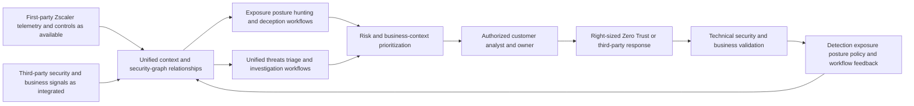

| Architecture principle | Plain meaning | Operational consequence | Overclaim prevented |
|---|---|---|---|
| Public fact has a boundary | Marketing architecture is useful but incomplete | Verify tenant, license, field, action, and service behavior | Slide treated as implementation spec |
| Data precedes agency | Agents can only reason over accessible, timely, correctly mapped evidence | Operate source, entity, time, quality, and provenance contracts | AI assumed omniscient |
| Graph edges are claims | Relationships need source, meaning, direction, time, and confidence | Challenge and version every material edge | Decorative graph certainty |
| Context changes decision, not history | Business criticality can change priority but not source observations | Preserve evidence and context lineage separately | High criticality makes alert true |
| Agentic means assisted workflow | AI agents can perform bounded tasks, not inherit customer authority | Separate retrieve, recommend, approve, execute, and validate roles | Agent equals autonomous incident commander |
| Right-sized response is path-specific | Controls should interrupt the relevant risk with minimum necessary disruption | Verify exact target, effect, alternate paths, rollback, and postconditions | One-button containment claim |
| Feedback requires proof | An action is not learning until an owned system change is validated | Track accepted detection, exposure, policy, and data improvements | Closed-loop marketing without operation |
| Portfolio is not one entitlement | Agentic SOC, Deception, Exposure, Hunting, MDR, Data Fabric, and controls have boundaries | Confirm current dependencies, packaging, and contracts | Every capability assumed present |
| Complement, then rationalize | Existing SIEM, EDR, IAM, and ticketing often remain important | Define systems of record and tested integrations | Automatic replacement promise |

## JD Mapping

| JD signal | Capability developed | Customer or TSM artifact | Honest boundary |
|---|---|---|---|
| Develop deep Zscaler and SecOps expertise | Explain dated Agentic SecOps public architecture, workflows, products, and verification needs | Official-claim and architecture ledger | No tenant or implementation claim |
| Become a trusted advisor | Translate signal, graph, priority, agent, and response concepts into customer decisions | Current-state and target-workflow brief | Customer owns risk and authority |
| Drive adoption and value | Define use cases, prerequisites, quality, analyst behavior, controls, and outcomes | Adoption acceptance scorecard | No guaranteed speed, accuracy, or savings |
| Troubleshoot complex environments | Isolate first-party, third-party, entity, graph, agent, case, control, and feedback failures | Layered Agentic SecOps runbook | No unsupported product root cause |
| Use analytics | Model grains, relationships, time, quality, priority drivers, decisions, and outcomes | SQL/Power BI-style semantic model | No internal Zscaler schema claim |
| Coordinate stakeholders | Align SOC, IR, IAM, endpoint, network, cloud, app, data, exposure, business, privacy, providers, and vendors | RACI and escalation map | TSM facilitates rather than commands |
| Communicate proactively | State official fact, tenant fact, evidence, uncertainty, action, residual, and checkpoint | Technical and executive updates | No unsupported assurance |
| Partner with Support/Product | Package redacted reproducible data, graph, agent, or action evidence | Minimal escalation packet | No defect, fix, or roadmap promise |
| Apply AI responsibly | Ground, constrain, review, audit, and improve agentic workflows | Agentic governance plan | No autonomous high-impact response claim |

## Candidate honesty note

You can say: "I have studied Zscaler's Agentic SecOps public architecture as of August 24, 2026 and can explain how its signal, context, graph, agentic-workflow, and adaptive-control story fits a broader SecOps operating model. My production experience is enterprise Support Escalation Engineering, networking evidence, analytics, critical coordination, mentoring, and responsible AI evaluation. I have not configured or operated Agentic SecOps in a production tenant, so I would verify current licensing, integrations, data, agents, actions, and customer authority."

The syntax is intentionally neutral. "Zscaler publicly positions" attributes the source. "A customer might design" labels a general option. "The tenant shows" requires customer evidence. "I would verify" identifies the next professional action. Avoid unsupported affirmative claims such as "I deployed Agentic SOC," "I automated isolation," "I reduced SOC noise," or "the platform correlates every tool."

| Factual background | Transferable strength | Neutral wording | Unsupported production claim to avoid |
|---|---|---|---|
| M365/OneDrive/SharePoint support | Identity, permission, device, browser, network, app, service, and data relationships | "I investigate connected enterprise evidence." | "I operated Zscaler Agentic SOC." |
| Networking and traces | DNS, TCP, TLS, HTTP, proxy, path, timing, and policy troubleshooting | "I can test telemetry and control-path hypotheses." | "I hunted threats with ZIA telemetry." |
| SQL and Power BI | Entity models, joins, graphs, time, quality, priorities, and outcomes | "I can design transparent SecOps analytics." | "I queried Zscaler's security graph." |
| Critical escalation work | Impact, hypotheses, owners, updates, mitigation, recovery, and RCA | "I coordinate high-pressure evidence work." | "I commanded cyber incidents." |
| Mentoring and enablement | Explain complex systems, teach methods, review quality | "I can drive responsible adoption." | "I trained production Agentic SOC analysts." |
| AI evaluation and training | Ground output, test risks, set human review, teach safe use | "I understand responsible agent assistance." | "I deployed autonomous containment agents." |
| Fictional synthetic NMH | Demonstrate a source-bounded architecture and workflow | "This is an invented practice artifact." | "This is a Zscaler customer result." |

## Beginner vocabulary and memory hooks

| Term | Meaning from zero | Why it matters | Analogy or memory hook |
|---|---|---|---|
| Security operations | Daily work to observe, detect, investigate, respond, recover, and improve security | Agentic SecOps supports this operating discipline | Emergency and safety service |
| Agent | Software component that pursues a bounded goal using instructions, context, and allowed tools | Can automate multi-step analysis or workflow | Junior assistant with a task and toolbelt |
| Agentic workflow | Multi-step task where one or more agents retrieve, reason, call tools, and produce results under controls | Goes beyond one static answer | Assistant follows a governed procedure |
| Agentic SecOps | Zscaler's current portfolio/solution story for AI-assisted proactive and reactive security operations | Connects data, context, analysis, and action | Context-to-decision operating system |
| Agentic SOC | Named current solution/product area in the public portfolio | Focuses public story on alert/threat operations | Threat-story and investigation workbench concept |
| First-party telemetry | Data generated by Zscaler products/services in the relevant customer deployment | Can add inline traffic, policy, identity/app, threat/data, or posture context as available | Building's own sensors |
| Third-party signal | Data from another vendor or customer system | Adds endpoint, identity, cloud, ticket, business, or other evidence | Neighboring agencies' reports |
| Data Fabric for Security | Zscaler capability publicly positioned to ingest, harmonize, deduplicate, correlate, enrich, apply logic, drive workflows, and report | Supports reusable security/business context | City data exchange |
| Security graph | Relationship model connecting entities and evidence | Enables pivots, context, paths, and agent reasoning | Map of people, places, routes, and controls |
| Node | Entity or condition in a graph | Represents a user, device, app, asset, finding, threat, data, or service | Station on a map |
| Edge | Defined relationship between nodes | Gives graph meaning | Track between stations |
| Business context | Customer facts such as owner, criticality, service, data, role, change, and obligation | Changes urgency and treatment | Why this building matters |
| Risk context | Evidence and assumptions about likelihood, consequence, exposure, threat, and controls | Helps prioritize decisions | Hazard plus consequence map |
| Unified threat story | Related alerts/evidence organized around entities, time, path, scope, and impact | Reduces fragment-by-fragment work | One cited case file |
| Risk prioritization | Ordering work using threat, exposure, business, confidence, urgency, and control context | Directs analyst attention | Emergency queue with context |
| Triage | Rapidly assess validity, urgency, impact, and next step | First decision after a signal/story | Emergency-room sorting |
| Investigation | Test hypotheses using evidence to determine sequence, scope, cause, and impact | Supports response | Diagnostic workup |
| Grounding | Supplying reliable source evidence and context to constrain an AI result | Reduces unsupported output | Open-book answer with citations |
| Tool use | Agent calls an approved query or action capability | Enables work beyond text generation | Assistant uses an authorized instrument |
| Adaptive response | Response that changes according to current risk/context | Supports proportional action | Security checkpoint tightens after warning |
| Step-up authentication | Require stronger/additional authentication | Raises access assurance | Ask for additional ID |
| Reduced access | Narrow apps, operations, data, privilege, location, or duration | Limits risk while preserving some work | Room-specific badge |
| Isolation | Strongly restrict an entity's communication or access | Contains risk with possible disruption | Quarantine room |
| Zero Trust Exchange | Zscaler platform publicly positioned around identity/context/business-policy-based least-privileged connections and inline controls | Provides current public response foundation | Intelligent access switchboard |
| Feedback loop | Incident/action learning changes future exposure, detection, posture, policy, or workflow | Prevents recurrence and drift | Repair, retest, update the map |
| Deception | Decoys, lures, and breadcrumbs intended to reveal suspicious interaction | Supplies proactive high-fidelity signals | Alarmed unused safe |
| Threat Hunting | Expert-led proactive search for hidden behavior | Finds activity beyond existing alerts | Search for quiet leaks |
| MDR | Managed Detection and Response | Adds contracted monitoring, investigation, hunting, and response support | Specialist monitored response team |
| Exposure Management | Portfolio/program area for identifying, contextualizing, prioritizing, validating, and treating exposures | Proactive side of risk reduction | Find and repair dangerous routes |
| System of record | Authoritative home for a defined object or decision | Prevents conflicting state among tools | Official registry |
| Provenance | Origin and transformation history of evidence | Makes AI and analyst claims reproducible | Chain of custody |
| Entitlement | Contracted right to use a capability | Public page does not prove customer access | Ticket granting entry |

### Plain-English deep-dive 1 - Agentic SecOps is an operating loop, not a robot analyst

Imagine an emergency center with sensors, maps, property records, business-owner contacts, response tools, and trained staff. A digital assistant can collect reports, connect addresses, summarize a timeline, recommend which team should act, and prepare a response request. It cannot assume a sensor is healthy, decide that two similar names are one person, order a hospital shutdown without authority, or declare recovery because a request was submitted.

Agentic SecOps should be understood as a context-to-action loop. Data and relationships support proactive exposure work and reactive threat work. Agents can reduce repetitive analysis and guide decisions. Customer policy and humans govern consequential interpretation and action. Controls change access or risk. Validation proves what happened. Feedback changes the next cycle. The architecture is only as strong as its weakest source, relationship, permission, decision, or postcondition.

## Official public claim ledger

The table below translates the reviewed main page into bounded statements. It intentionally omits volatile marketing numbers, rankings, customer outcomes, performance percentages, and universal superiority claims. The rightmost column identifies what a TSM must verify before using the statement for a customer.

| Publicly positioned area | Bounded official statement from reviewed material | What it does not establish | Customer verification |
|---|---|---|---|
| Proactive and reactive unification | Agentic SecOps is positioned to connect exposure reduction and active-threat operations | One product, one license, or one workflow covers both fully | Current portfolio, products, integrations, owners |
| First-party plus third-party data | Public page describes combining Zscaler telemetry with third-party signals | Every Zscaler/third-party source or field is available | Exact source, scope, mapping, latency, entitlement |
| Security graph | Data fabric is positioned to unify network, identity, asset, and cloud context for agentic insight | Proprietary graph schema, edge list, or complete truth | Nodes, edges, provenance, time, confidence, access |
| Business and risk context | Public page describes adding context to assess and prioritize exposures/threats | Context is current, authoritative, or complete | Owner, criticality, data, privilege, exposure, controls |
| Unified threat stories | Agentic SOC is positioned to connect disparate alerts and related context | Grouping is always correct or every alert source integrates | Alert grain, sources, merge/split logic, evidence links |
| Risk-based priority | Threats are positioned to be ranked using impact, AI insights, best practices, and business logic | Published formula, customer risk truth, or no bias/drift | Drivers, policy, overrides, effective-time context |
| Agentic triage/investigation | AI agents are positioned to group/triage threats, summarize evidence, and recommend next steps | Autonomous incident declaration or error-free analysis | Agent tasks, sources, tools, citations, evaluation, review |
| Adaptive response | Public page names step-up authentication, reduced access, and user isolation as examples | Exact triggers, actions, semantics, integration, authority, or outcome | Current control, target, approval, rollback, read-back |
| Third-party response | Public material describes right-sized action across Zero Trust and third-party systems | Any particular third-party action exists | Connector/action contract and ownership |
| Feedback loops | Incident learning is positioned to feed exposure/posture programs and harden controls | Automatic validated improvement | Workflow, owner, change control, validation, residual |
| Complementarity | FAQ states existing SIEM, EDR, IAM, and ticketing tools are important and integration/interoperability matter | Those tools are never rationalized or always retained | Current architecture, systems of record, use cases |
| Portfolio areas | Main page names Agentic SOC, Deception, Exposure Management, Threat Hunting, and MDR | All are one entitlement or identical delivery model | Product/service boundaries, dependencies, contracts |

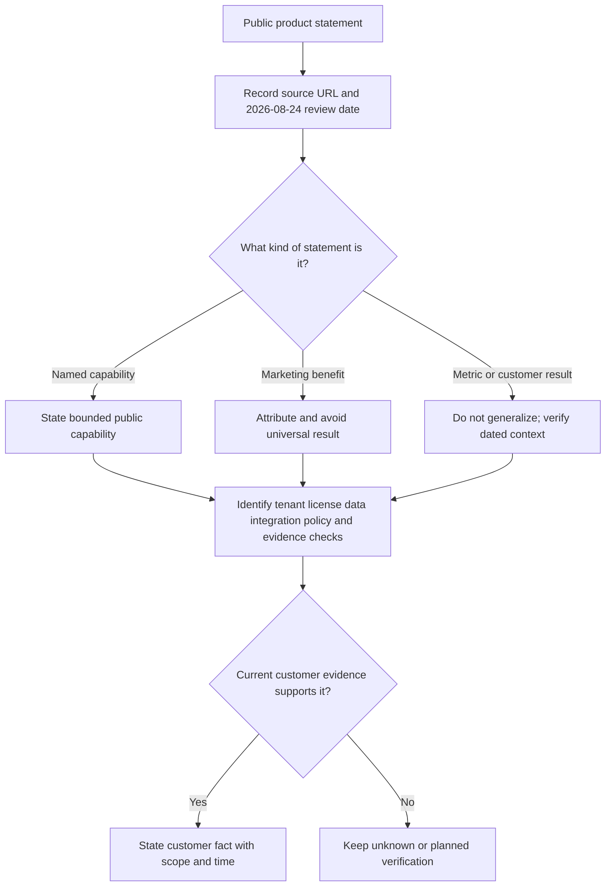

## Portfolio architecture and product boundaries

Agentic SecOps is the umbrella portfolio/solution story on the reviewed public page. Agentic SOC is a named solution area centered on alert-to-threat operations. Data Fabric for Security is a named foundation/capability publicly described for broader data ingestion, harmonization, deduplication, correlation, enrichment, business logic, workflow, and reporting, especially across exposure-management applications. Zero Trust Exchange is the broader inline zero-trust platform positioned around identity/context/business policies and controls. Exposure Management, Deception, Threat Hunting, and MDR have distinct product, program, or service roles.

The exact dependency graph is not fully specified by public marketing pages and may evolve. The diagram below is a **conceptual portfolio map**, not an ordering, licensing, control-plane, or implementation diagram.

| Name | Type in this study map | Primary public job | Boundary to preserve |
|---|---|---|---|
| Agentic SecOps | Portfolio/solution story | Connect proactive and reactive operations using telemetry, context, agents, and controls | Not one assumed SKU, console, or autonomy level |
| Agentic SOC | Named solution/product area | Turn alerts into prioritized threat stories and guide investigation/response | Verify current page, product scope, fields, sources, and entitlement |
| Data Fabric for Security | Foundation/capability platform | Unify broader security/business data and operationalize context | Exposure page does not prove every Agentic SOC internal |
| Security graph | Relationship/context concept in public story | Connect network, identity, asset, cloud, and other relevant context | No hidden schema or edge certainty inferred |
| Zero Trust Exchange | Platform | Identity/context/business-policy-based access and inline controls | Exact adaptive action requires product/license/configuration |
| Exposure Management | Portfolio/program support area | Find, contextualize, prioritize, validate, and mobilize exposures | Proactive risk work differs from live incident response |
| Deception | Product/capability area | Use decoys/lures/breadcrumbs for high-fidelity interaction signals | Safe deployment and response still require governance |
| Threat Hunting | Expert-led managed capability/service as positioned | Proactively search ZIA-related network/web/cloud behavior | Scope, data, hours, notification, and contract verify |
| MDR | Managed service | Around-the-clock detection, investigation, hunting, and response support | Customer accountability and contract boundaries remain |
| Existing SIEM/EDR/IAM/ITSM | Customer/third-party stack | Event search, endpoint, identity, case/change authority as designed | Public page emphasizes complementarity, not mandatory replacement |

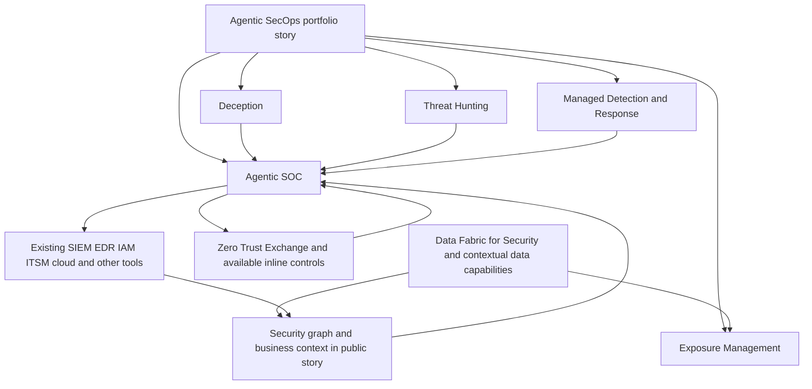

## First-party Zscaler telemetry

First-party telemetry means data produced by Zscaler capabilities in the customer's actual deployment. The official page describes unique zero-trust telemetry, real traffic, policy decisions, and context across areas such as user, app, web/SaaS, identity, endpoint/posture, data, AI, and other relevant Zscaler surfaces in broad public terms. It also says this context can help identify risks that endpoint-only sensors can miss, including unmanaged-device and identity-centered scenarios.

Do not turn that positioning into an assumed source inventory. A customer may license only part of the portfolio. Traffic may use alternate routes. TLS inspection can be subject to policy, privacy, legal, technical, certificate, application, or bypass limitations. Identity mapping can be missing or stale. A policy event has source-specific semantics. Data classifications and posture can be incomplete. For every use case, verify the exact source, population, observation point, fields, timestamps, retention, exclusions, health, and authority.

| First-party evidence family | General decision value | Verification questions | Unsafe inference |
|---|---|---|---|
| Traffic/session | Destination, protocol, timing, volume, direction, session context | Which traffic, users/devices, paths, inspection, time, retention? | All enterprise traffic is visible |
| Identity/access | User/workload/app identity and access context | Which identity provider, native IDs, session binding, lifecycle? | Display name proves actor |
| Policy decision | Allowed, denied, isolated, challenged, or other documented state as available | Which rule/version/context/result semantics? | Allowed means safe; denied means no risk |
| Threat/security event | Detection or control observation | Which engine, evidence, confidence, version, coverage? | Alert equals compromise |
| App/destination | Application/service category and relationship | How resolved, multi-tenant, custom app, time? | Domain equals one business app |
| Device/posture | Managed state and posture context where available | Source, freshness, supported device, conflicting records? | Installed agent means healthy coverage |
| Data context | Classification, action, channel, or policy evidence where available | Which data, classifier, confidence, channel, outcome? | Data alert proves exfiltration |
| Exposure/risk | Asset, vulnerability, control, path, or risk context where available | Which product, scope, factor, time, model? | Score is objective incident truth |

```mermaid
flowchart LR
    USER[User workload or other entity] --> ACCESS[Access and traffic through covered Zscaler path]
    ACCESS --> TELEMETRY[Available identity app traffic policy threat posture and data evidence]
    TELEMETRY --> HEALTH[Scope freshness completeness semantics and provenance checks]
    HEALTH --> RESOLVE[Resolve entities sessions apps and effective context]
    RESOLVE --> GRAPH[Publish governed relationships]
    GRAPH --> WORKFLOW[Exposure threat hunting triage investigation or response workflow]
    WORKFLOW --> SOURCE[Retain source-native references]
    SOURCE --> VERIFY[Reproduce claims and measure blind spots]
```

## Third-party signals

The main page publicly describes third-party signals and specifically says organizations often want to retain SIEM, EDR, IAM, and ticketing systems. Third-party evidence can add endpoint process causality, identity lifecycle, cloud control-plane activity, app audit, email, network, vulnerability, asset, ticket, change, business service, and other context. The exact integrations and semantic depth require current verification.

An integration badge is not a data contract. "Connected" might mean one-way alert forwarding, selected context retrieval, bidirectional case updates, or supported actions. It may cover only certain editions or fields. Define producer, consumer, purpose, scope, grain, identity keys, time, schema, delivery, quality, security, privacy, ownership, action behavior, and acceptance tests.

| Third-party family | Possible contribution | Authoritative role to consider | Integration risk |
|---|---|---|---|
| SIEM/data lake | Broad events, long-period search, detections, compliance retention | Event search/retention as customer designs | Duplicate alerts and cost/latency |
| EDR | Process/file/device evidence and endpoint response | Endpoint-native causality/control | Unmanaged/offline gaps and wrong device joins |
| IAM/PAM | Identity lifecycle, sessions, factors, privilege, access decisions | Identity/privilege source of record | Propagation, aliases, service accounts |
| Cloud security/control plane | Resource, role, workload, configuration, runtime context | Cloud-native resource/action truth | Ephemeral identities and many accounts |
| Network/security tools | Packet/flow/DNS/email/firewall or other evidence | Observation-point-specific source | NAT, encryption, route blind spots |
| Vulnerability/exposure tools | Findings, asset coverage, exploitability, remediation | Source finding and scanner evidence | Duplicates, stale assets, severity-only thinking |
| CMDB/asset/MDM | Ownership, lifecycle, inventory, device management | Context authority by attribute | Current-state/history drift |
| ITSM/change | Case, ticket, approval, change, owner, SLA | Work and change system of record | Ticket state mistaken for security outcome |
| HR/business systems | Role, organization, service, criticality, owner | Sensitive customer business context | Privacy, effective time, overdistribution |

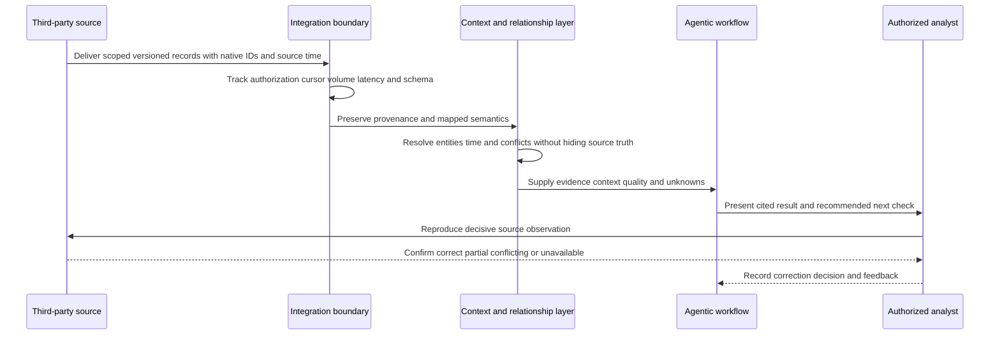

### Plain-English deep-dive 2 - First-party and third-party describe origin, not quality rank

A building's own badge reader is first-party to the building operator. A police report or contractor roster is third-party. The badge reader may be immediate but mapped to an outdated employee record. The contractor roster may contain the authoritative sponsor and end date but arrive daily. Neither source wins merely because of origin.

The same applies in Agentic SecOps. Zscaler telemetry may provide valuable inline traffic and policy perspective. An EDR may provide deeper process lineage. IAM may own the account lifecycle. An application may own object-level actions. A business system may own criticality. The architecture should use each source for the claim it can support, preserve disagreement, and expose latency and coverage. Context is assembled, not declared by one label.

## Security graph mechanics

The official page describes a security graph that connects network, identity, asset, and cloud context so AI agents can correlate signals and prioritize exposures and threats. A graph stores entities as nodes and relationships as edges. It can support pivots such as: which devices did this identity use, which apps did they reach, which alerts involve those sessions, which vulnerable assets support a critical service, which controls apply, and which data might be affected?

The public page does not publish a complete proprietary schema. The model below is general practice. Every edge needs a relationship type, direction, source, effective time, observation time, confidence, and lifecycle. Similar names or IPs are not enough. Graphs should permit unresolved entities and contradictory source assertions.

| Node family | Example general objects | Useful context | Integrity concern |
|---|---|---|---|
| Identity | Human, service account, workload, partner, agent | Privilege, owner, lifecycle, role | Aliases, reuse, shared accounts |
| Device/asset | Endpoint, server, workload, cloud resource, IoT/OT | Posture, owner, environment, exposure | Hostname/IP reuse and ephemeral assets |
| App/service | SaaS, private app, API, business service | Owner, criticality, dependencies, data | Domains and services are many-to-many |
| Session/event | Authentication, access, transaction, policy decision | Source, time, result, path | Late data and clock quality |
| Alert/threat | Detection output or correlated story | Logic, evidence, status, confidence | Duplicate/false merge |
| Finding/exposure | Vulnerability, configuration, path, control gap | Severity, exploitability, reachability, owner | Stale/duplicate findings |
| Control | Identity, endpoint, network, app, data, recovery safeguard | Policy, health, scope, effectiveness | Installed versus effective |
| Data | Repository, object class, label, transaction | Sensitivity, owner, action, channel | Classification accuracy and privacy |
| Business | Organization, service, process, obligation, owner | Consequence, recovery, decision authority | Drift and restricted access |

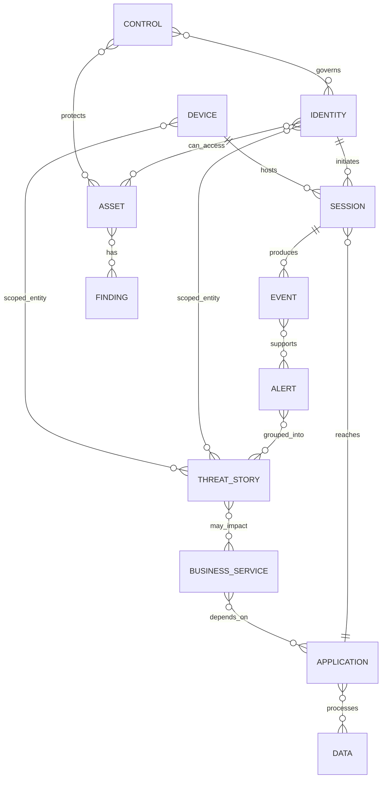

## Edge evidence and graph confidence

An edge such as "can access" may come from configuration. "Did access" should come from an observed event. "Owns" may come from CMDB or a business attestation. "Supports" may come from an architecture repository. These are not interchangeable. An agent traversing a graph can multiply one bad edge into a confident but wrong narrative, priority, scope, and action target.

| Edge state | Meaning | Example evidence | Safe use |
|---|---|---|---|
| Observed | Source recorded interaction/relationship at a time | Session or policy event | State bounded observation |
| Configured | Authoritative configuration permits/defines relationship | IAM/app/network policy | Model possible access, not actual use |
| Attested | Authorized owner states relationship | Service-owner review | Retain attestor and date |
| Inferred | Logic suggests relationship | Correlation using aliases/time | Label confidence and alternatives |
| Demonstrated | Authorized test proved bounded relationship | Validation exercise | State test conditions and expiry |
| Contradicted | Reliable sources disagree | CMDB owner versus cloud tag | Keep conflict and assign resolution |
| Unknown | Evidence cannot establish relationship | Missing/unhealthy/out-of-scope data | Do not force graph completeness |
| Expired | Relationship was valid previously | Historical ownership/access | Prevent current action from stale edge |

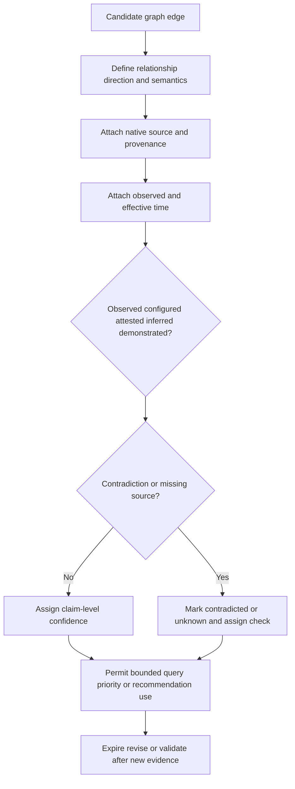

## Business-context enrichment

The public Agentic SOC positioning names business-context enrichment, including examples such as asset criticality, user identity, and exposure insights, to help analysts understand scope and impact. General customer context may also include service ownership, environment, privilege, data sensitivity, regulatory obligations, change windows, recovery objectives, geography, partner status, and compensating controls.

Context must have authority and effective time. A current CMDB tag should not automatically describe last month's event. An executive title does not prove current privilege. A vulnerability severity does not prove reachability. A critical service label raises consequence but does not turn uncertain activity into confirmed compromise. Agents and analysts should see missing or conflicting context rather than a fabricated default.

| Context domain | Decision improved | Authoritative evidence question | Failure if stale/wrong |
|---|---|---|---|
| Asset criticality | Priority and response caution | Who assigns it, for what service, effective when? | Lab device treated as critical production |
| Identity role/privilege | Scope and potential impact | Effective privilege/session at event time? | Job title substituted for access |
| Service dependency | Business consequence and recovery | Which apps/assets actually support service? | Wrong owner and outage estimate |
| Data sensitivity | Investigation and legal/privacy involvement | Which object/classification/action/source? | Repository label treated as access proof |
| Exposure | Plausible path and prioritization | Finding applicability, reachability, control state? | CVE severity becomes incident fact |
| Control state | Residual and response choice | Policy, health, observed decision, test? | Installed equals effective |
| Change context | Benign alternative and operational risk | Approved scope, exact identity/device/time? | Broad change suppresses unrelated behavior |
| Recovery objective | Containment and release design | Service-owner continuity requirements? | Security action causes unmanaged outage |
| Obligation | Escalation and handling | Legal/privacy authority and jurisdiction? | Analyst makes legal determination |

### Plain-English deep-dive 3 - Enrichment can make a story smarter or merely more confident

Adding a person's job title, building address, and department to an alarm can help a responder. If those records belong to a different person with the same name, the enriched report is worse than the original alarm because it looks complete and authoritative. More columns do not guarantee more truth.

Agentic enrichment must preserve the join rationale, source, time, and confidence. High-value context should be reviewed for authority and freshness. Missing values should remain unknown. Contradictions should be visible. A strong workflow allows the analyst to remove or correct a context edge and see which priority, scope, summary, or recommendation changed.

## From atomic alerts to unified threats

The public page describes rolling up atomic alerts into unified threats and providing unified threat stories. General mechanics include alert-quality checks, technical deduplication, entity resolution, time normalization, behavioral correlation, graph relationships, business enrichment, attack-path context, confidence, scope, and a versioned narrative. Part 93 covers these mechanics deeply.

Agentic assistance can propose duplicate candidates and relationships, but native observations should remain accessible. A story must be splittable when evidence changes. The analyst should see why alerts were grouped, what was excluded, which source is unhealthy, and which claims are inferred. "Unified" should mean coherent, not irreversible.

| Story layer | Input | Agentic assistance | Human/operational check |
|---|---|---|---|
| Alert quality | Rule/version, source evidence, health | Reproduce conditions and summarize | Detection/source owner validates defects |
| Deduplication | Native IDs, update/retry semantics | Suggest logical duplicates | Preserve delivery and source lineage |
| Entity resolution | IDs, aliases, lifecycle, time | Propose user/device/app matches | Reject weak or cross-tenant joins |
| Temporal order | Event, receipt, processing, effective time | Build UTC timeline | Mark late data and clock uncertainty |
| Correlation | Behavior, infrastructure, topology, threat context | Suggest related evidence and rationale | Require falsifier and split criteria |
| Path | Observed/configured/inferred edges and controls | Assemble candidate attack path | Label edge state and unknowns |
| Scope | Observed, affected, at-risk, checked, unknown | Execute bounded pivots | Verify denominators and source health |
| Narrative | Evidence, alternatives, context, impact | Draft cited summary and next steps | Analyst owns communication and decision |

```mermaid
flowchart LR
    ALERTS[Zscaler and third-party atomic alerts] --> QUALITY[Source rule time and health validation]
    QUALITY --> DEDUPE[Logical deduplication with lineage]
    DEDUPE --> ENTITY[Time-aware entity resolution]
    ENTITY --> CORRELATE[Behavior relationship and temporal correlation]
    CORRELATE --> GRAPH[Graph pivots and path context]
    GRAPH --> BUSINESS[Business risk exposure and control enrichment]
    BUSINESS --> STORY[Unified versioned threat story]
    STORY --> HUMAN[Analyst validates citations alternatives scope and impact]
    HUMAN --> DECISION[Close monitor investigate escalate or respond]
```

## Risk-based prioritization

The official page positions threats as ranked using business and risk context so analysts can focus on what matters. It also references AI-driven insights, best practices, and customer business logic. The public material does not publish one complete scoring formula. Do not invent weights or thresholds.

A general priority model can consider technical severity, active status, threat relevance, identity privilege, asset/service criticality, data consequence, exposure/path evidence, affected/at-risk scope, control state, confidence, urgency, and customer policy. These dimensions should remain explainable. Priority is an operational queue decision, not a probability of breach or objective financial truth.

| Priority driver | Question | Evidence | Important separation |
|---|---|---|---|
| Technical behavior | What action/technique and potential harm? | Detection and source events | Severity is not confidence |
| Active status | Is behavior current, expanding, or stopped? | Recent source-linked activity | Recency is not malicious proof |
| Threat relevance | Is intelligence applicable and fresh? | Source reliability and local match | Intelligence is not occurrence |
| Privilege | What effective access existed? | IAM/PAM/app/session evidence | Membership is not use |
| Criticality | Which customer service depends on entities? | Owner and effective-time source | Context is not evidence of attack |
| Data consequence | What sensitive data action is observed/potential? | Data/app-native evidence | Repository label is not exfiltration |
| Exposure/path | Which prerequisites and controls connect to objective? | Graph edge provenance and state | Possible path is not observed path |
| Scope | What is observed, affected, at risk, checked, unknown? | Bounded pivots and denominators | Alert count is not blast radius |
| Control state | Which safeguards interrupt or observe behavior? | Policy, health, decision, test | Installed is not effective |
| Confidence | How strongly does evidence support each key claim? | Reliability, directness, corroboration, conflict | Confidence is not impact |
| Customer policy | Which risk appetite, service, or regulatory rule applies? | Approved governance | Vendor priority is not authority |

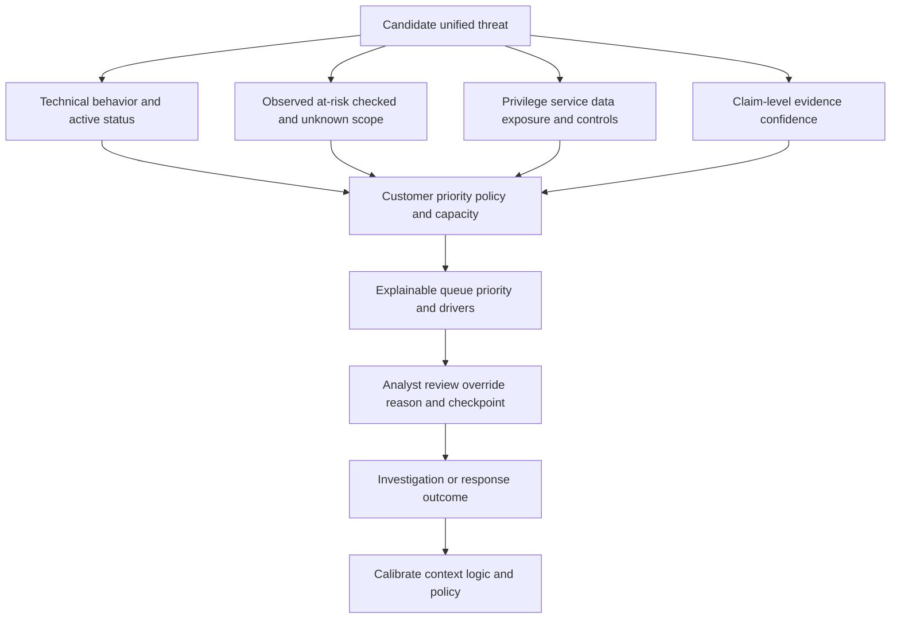

## Agentic triage

The official page says AI agents can group and triage threats, summarize evidence, and recommend next steps. General triage should verify source and detection meaning, exact entities, time, active status, business/risk context, source health, scope, confidence, and urgency. An agent can retrieve and organize these facts faster, but its output is still a transformation requiring validation.

Define the agent's task and allowed tools. A triage agent might read approved alert and context records, query limited evidence, compare a playbook, draft a classification, and recommend a next check. It should not silently access unrelated personal data, change a graph identity, declare an incident, or execute containment unless a separately governed action path explicitly permits it.

| Triage-agent task | Required input | Expected output | Validation |
|---|---|---|---|
| Group candidate alerts | Native alerts, entities, time, relationships | Grouping rationale, confidence, excluded alerts | Analyst can merge/split and reproduce |
| Retrieve context | Approved identity, asset, app, exposure, business sources | Values with provenance, freshness, conflict | Authority and effective time checked |
| Summarize evidence | Source-linked observations and timeline | Cited observations, alternatives, unknowns | Entailment and omission review |
| Estimate scope | Approved pivots and source-health data | Observed/checked/unknown cohorts | Denominators and limits checked |
| Suggest classification | Detection, context, playbook, customer policy | Recommended branch and reasoning | Human/customer policy owns classification |
| Recommend next check | Hypotheses and available evidence | Safe discriminating query/action | Relevance, permissions, privacy reviewed |
| Recommend response | Threat path, controls, impact, authority | Options, tradeoffs, target, rollback | Capability and authorized human decision |

## Agentic investigation

Investigation goes beyond initial sorting. An agent may build a source-linked timeline, traverse graph relationships, ask predefined investigative questions, compare peer or historical behavior, propose competing hypotheses, identify missing evidence, scope related entities, and prepare a response decision. Each step needs bounded access and traceable outputs.

Agentic investigation has special failure modes. A wrong entity edge can contaminate all pivots. Retrieved log text can contain prompt injection. A model can convert "denied" into "performed," confuse receipt with event time, or omit a contradiction. Tool calls can be expensive, rate limited, or expose sensitive data. A recommendation can exceed actual entitlement or customer authority.

| Investigation stage | Agent contribution | Guardrail | Human checkpoint |
|---|---|---|---|
| Question framing | Turn story into bounded hypotheses | Require alternatives and decision relevance | Analyst approves scope |
| Evidence retrieval | Query approved sources using native IDs and UTC | Least privilege, allowlisted queries, limits | Validate decisive source facts |
| Timeline | Normalize and order observations | Preserve all time fields and late data | Review sequence/causality language |
| Graph traversal | Find related users/devices/apps/alerts/exposures | Depth/population limits and edge confidence | Review surprising/high-impact links |
| Behavioral comparison | Compare entity/peer/history | Valid peers, seasonality, data health | Challenge bias and benign change |
| Scope | Search related population | Denominators and stop conditions | Approve widening and privacy |
| Hypothesis update | Weigh support/conflict/unknown | No forced single conclusion | Analyst assigns claim confidence |
| Decision package | Summarize impact, options, residuals | Citations, capability/authority checks | Authorized role decides |

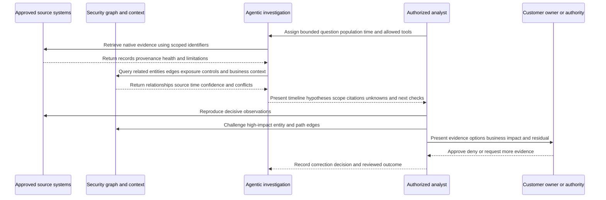

### Plain-English deep-dive 4 - Agent speed increases the value of good boundaries

A research assistant who can search a million documents quickly is powerful. If the assistant has the wrong person's record, an outdated map, and authority to send orders, speed multiplies harm. If the task is bounded, sources are cited, permissions are limited, and a qualified person reviews the conclusion, speed can remove tedious work while preserving judgment.

Agentic SecOps has the same dynamic. Faster pivots and summaries are valuable only when entity identity, source semantics, context, tool permissions, and response authority are governed. The most important design questions are not "How autonomous is it?" but "What evidence can it see, what tools can it call, how is each claim verified, what can it change, and who remains accountable?"

## Grounding, tool use, and agent governance

Grounding should include source references, retrieval scope, freshness, and known gaps. Tools should be allowlisted by task. Read-only evidence retrieval has different risk from entity mutation or containment. Separate roles for viewing, recommending, approving, executing, tuning, and auditing. Use strong authentication, tenant binding, least privilege, rate and population limits, secrets management, protected logs, and emergency stop.

Prompt injection deserves specific attention. Security evidence is adversarial by nature. A malicious webpage, log message, ticket, file name, or decoy content could include text intended to manipulate an agent. The agent must treat retrieved content as untrusted data, never as policy or instructions. Tool authorization comes from the system and customer governance, not from content.

| Agent control | Purpose | Acceptance question | Failure prevented |
|---|---|---|---|
| Task boundary | Limits goal, population, time, and data | Can agent explain what is out of scope? | Endless or privacy-invasive pivots |
| Source allowlist | Restricts accessible evidence | Are only approved systems/fields queried? | Data leakage and unsupported sources |
| Tool/action allowlist | Restricts executable capabilities | Can log text request a new tool? | Prompt-injected action |
| Tenant/entity binding | Prevents wrong-scope access/action | Are immutable scoped IDs revalidated? | Cross-customer or wrong-user effect |
| Least privilege | Reduces blast radius | Are read/recommend/execute permissions separated? | Compromised agent performs broad action |
| Citation/provenance | Makes claims reproducible | Can each decisive sentence trace to source? | Fluent unsupported narrative |
| Confidence/unknowns | Prevents forced certainty | Are conflicts and missing data visible? | Hallucinated completeness |
| Human approval | Preserves consequential authority | Who approves which action and threshold? | Agent becomes risk owner |
| Rate/population limit | Controls runaway queries/actions | Is maximum scope explicit and enforced? | Cascading disruption/cost |
| Audit/replay | Supports review and incident analysis | Are task, retrieval, tool, output, review, action recorded? | Untraceable automation |
| Evaluation | Measures correctness, safety, bias, utility, robustness | Are real edge cases and adversarial tests used? | Demo-only confidence |
| Kill switch/degraded mode | Stops unsafe behavior and maintains operation | Can agents be disabled without losing essential response? | Dependency and runaway action |

## Adaptive Zero Trust response

The official public page names step-up authentication, reduced access, and user isolation as examples of adaptive, risk-based response through the Zero Trust Exchange. It also describes response across Zero Trust and third-party systems. This is a capability-level public statement, not a promise about a specific tenant.

General right-sized response selects the least disruptive action sufficient to interrupt the relevant threat path. A suspicious but unconfirmed identity may receive step-up or narrowly reduced access. Stronger active evidence may justify session revocation or isolation under policy. Exact action semantics, target, timing, dependencies, management path, evidence impact, business impact, approval, rollback, and verification must be documented.

| Response family | General purpose | Verification before recommendation | Postcondition |
|---|---|---|---|
| Observe/enrich | Gain evidence without changing access | Active-risk tolerance and source health | Evidence arrives within decision deadline |
| Step-up authentication | Increase identity assurance | Threat fit, exact session, factor strength, fallback | Source-native challenge result and continued behavior |
| Reduced access | Narrow app/action/data/privilege/duration | Effective policy, dependencies, alternate paths | Intended allowed/denied paths tested |
| Session restriction/revocation | Interrupt selected active access | Exact session/token and propagation | Session invalidated across intended scope |
| User/device/workload isolation | Strongly restrict entity access/communication | Immutable target, business/safety, evidence, recovery | Covered paths blocked and management retained as designed |
| Third-party action | Use endpoint, identity, cloud, network, or ITSM control | Current integration/action contract and authority | Native result plus independent read-back |
| Eradication/remediation | Remove root condition | Change and incident authority | Artifact/weakness/secret/policy corrected |
| Recovery release | Restore trusted access gradually | Cause addressed, controls/monitoring healthy | Security and business canary passes |

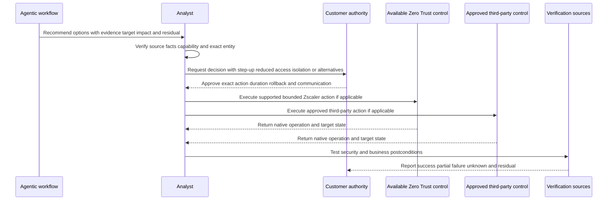

## Action states and human authority

An action can be proposed, approved, requested, accepted, running, partial, completed, failed, timed out, cancelled, expired, rolled back, or unreconciled, depending on the actual product. Never invent a state list for Zscaler; map current source-native states. The general requirement is to distinguish request from effect.

Customer authority is not an implementation detail. The customer decides incident declaration, risk appetite, business disruption, legal/privacy, employee handling, external communication, and recovery. A TSM explains documented capabilities, supports prerequisites and troubleshooting, coordinates specialists and Support, and helps measure adoption. The TSM does not silently approve customer containment or accept residual risk.

| Responsibility | Agentic workflow | Analyst/operator | Customer authority | TSM |
|---|---|---|---|---|
| Retrieve approved evidence | May perform within task/tools | Validates decisive facts | Defines access policy | Helps clarify product/source behavior |
| Propose grouping/hypothesis | May suggest with citations | Accepts, rejects, or revises | Sets incident policy | Supports adoption/troubleshooting |
| Recommend response | May compare options/tradeoffs | Verifies capability and target | Approves/denies under policy | Does not authorize customer action |
| Execute action | Only if explicitly allowed/pre-authorized | Operates or supervises | Owns authorization model | No assumed execution authority |
| Validate outcome | May collect read-back evidence | Confirms technical state | Confirms business/risk outcome | Helps investigate product discrepancies |
| Declare incident | No independent authority | Escalates evidence | Authorized customer role | No declaration authority |
| Accept residual risk | No authority | Documents residual | Authorized business/risk owner | No acceptance authority |
| Change production agent/detection | Suggest only unless governed otherwise | Capability owner implements | Governance approves | Coordinates documented product process |

## Feedback loops between reactive and proactive work

The official main page describes feeding incident learning into exposure and posture programs to close gaps, validate controls, and reduce repeat attacks. This is one of the most important architectural ideas. A reactive incident can expose a vulnerable asset, stale identity, excessive access, missing control, blind telemetry path, poor graph edge, weak detection, or unsafe playbook. Proactive programs should treat and validate those conditions. Exposure work can in turn seed detections, hunts, decoys, context, and response plans before an incident.

A feedback loop is not a line on a diagram. It needs a trigger, transformed artifact, destination owner, accepted change, validation, result, residual, and next review. For example, "incident showed stale contractor access" becomes an identity-lifecycle exposure cohort, customer-owned remediation, source reconciliation, new detection test, and closure proof.

| Reactive learning | Proactive destination | Durable change | Validation |
|---|---|---|---|
| Wrong entity correlation | Data/entity governance | Correct keys, lifecycle, confidence, conflict handling | Historical and new samples |
| Missed behavior | Detection/hunting | New requirement, query, tests, coverage | Simulation/backtest and monitoring |
| Exploited exposure | CTEM/UVM/AEM/process | Prioritized cohort, owner, treatment, path validation | Postcondition and recurrence check |
| Ineffective control | Policy/control assurance | Correct policy, health, placement, exception | Positive and negative tests |
| Excessive response harm | Playbook/governance | Narrower actions, better context, canary/rollback | Tabletop and controlled exercise |
| Deception interaction | Exposure/detection/response | Remove real path, tune placement, response plan | Retest decoy and alternate path |
| Provider handoff delay | MDR/SOC operations | RACI, roster, SLA, acknowledgement changes | Off-hours drill |
| Business context defect | CMDB/business data | Authority, effective-time update, quality monitor | Reconciliation and owner attestation |
| Agent error | AI evaluation/governance | Retrieval, prompt, tool, validation, permission correction | Regression and adversarial tests |

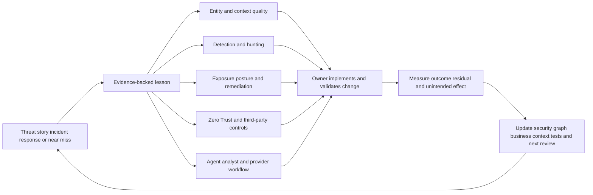

## End-to-end workflow reference model

The following workflow combines official public themes with general security operations practice. It is not a proprietary Zscaler state machine. A real customer should select a small number of high-value use cases and define exact data, products, roles, and postconditions.

1. **Discover the decision:** Identify the threat/exposure scenario, customer service, current workflow, pain, and success criteria.
2. **Confirm portfolio scope:** Verify which Zscaler and third-party products, services, licenses, integrations, regions, and source populations apply.
3. **Contract the data:** Define first/third-party sources, grains, IDs, time, semantics, quality, privacy, retention, and owners.
4. **Resolve context:** Establish entities, graph edges, business context, exposure, controls, provenance, conflicts, and effective time.
5. **Build threat/exposure output:** Produce a quality-checked finding or unified story, preserving native evidence and unknowns.
6. **Prioritize:** Apply explainable customer business/risk policy and claim-level confidence.
7. **Assist triage/investigation:** Let approved agents retrieve, summarize, pivot, compare, and recommend within bounded tools.
8. **Human decision:** Analyst and authorized customer owners validate sources, scope, impact, capability, and response tradeoffs.
9. **Execute right-sized response:** Use supported Zero Trust or third-party controls under approval with exact target and rollback.
10. **Verify:** Read native action states and independent security/business postconditions.
11. **Recover:** Remove unsafe conditions and restore access/service in stages under authority.
12. **Feed back:** Improve graph/context, detections, exposure, controls, playbooks, provider contracts, and agent evaluations.

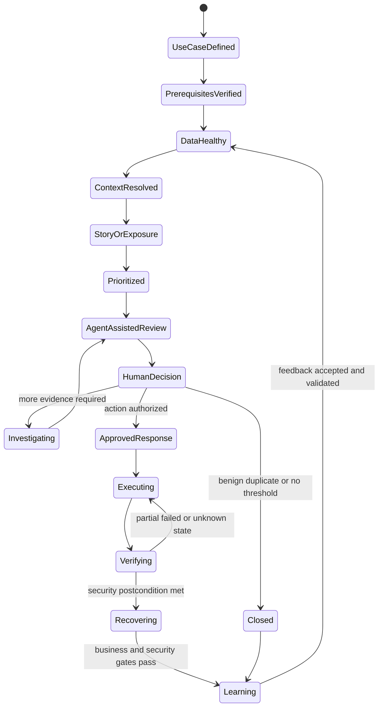

## Adoption and operating readiness

Start with one use case whose evidence and action can be tested safely. A broad "turn on Agentic SecOps" plan hides dependencies. Good candidates have a material customer decision, available sources, clear entities, known owners, measurable current pain, a governed response, and representative test cases. Establish a baseline before claiming value.

| Readiness domain | Discovery question | Acceptance evidence | Adoption risk |
|---|---|---|---|
| Business outcome | Which risk or analyst decision should improve? | Approved use-case charter and measure | Feature adoption without outcome |
| Product/entitlement | Which current products/services/licenses apply? | Current order/tenant/documentation confirmation | Public page assumed as license |
| Sources | Which first/third-party populations are healthy? | Reconciliation and known-event tests | Agent reasons over gaps |
| Entities/graph | Are users/devices/apps/assets/edges reliable over time? | Identity/edge sample tests and conflict process | Wrong story/action target |
| Business context | Who owns criticality, service, data, change, exposure? | Effective-time authority and quality checks | Stale priority |
| Agent task | What can agent read, infer, recommend, or execute? | Tool/permission matrix and evaluations | Excess authority |
| Workflow | Who triages, approves, executes, validates, and hands off? | RACI and tabletop | Automation without operation |
| Response | Which actions are supported, safe, reversible, and authorized? | Positive/negative/failure/rollback tests | Broad harmful action |
| Measurement | Which baseline, denominator, quality, outcome, safety metrics? | Reviewed scorecard | Marketing metric substituted for proof |
| Support | Who owns incidents and evidence escalation? | Runbook and redacted packet | Long multi-vendor blame loop |

## Metrics without marketing overreach

The official pages contain changing marketing metrics and benefit claims. This Part deliberately does not repeat volatile numbers. Customer value should be measured against an agreed baseline using transparent definitions. Useful dimensions include source coverage, entity resolution quality, story merge/split corrections, context freshness, citation completeness, triage decision quality, analyst effort, time to next useful decision, action verification, business disruption, recurrence, feedback completion, and user trust.

Do not claim incidents prevented from the absence of incidents. Do not claim time saved without a comparable workflow and workload. Do not treat alert reduction as improvement if data was lost. Do not use a vendor model's confidence as measured accuracy. Pair speed with correctness, safety, coverage, and outcome.

| Metric family | Example customer question | Denominator/guardrail |
|---|---|---|
| Source coverage | Are required populations present and timely? | Expected eligible population by source and period |
| Entity quality | Are high-impact user/device/app matches correct? | Reviewed representative and edge-case sample |
| Story quality | Are merges/splits, timelines, citations, and scope accurate? | Reviewed story cohort, not only open stories |
| Context quality | Is business/exposure/control context current and authoritative? | Applicable entities with validated effective-time values |
| Agent quality | Are outputs grounded, correct, complete, safe, and useful? | Fixed regression/adversarial set plus production review |
| Decision time | How quickly does analyst reach next correct action? | Comparable use case, clock, exclusions, quality guardrail |
| Response quality | Did exact supported action achieve intended path effect? | Eligible approved actions with native and independent proof |
| Business safety | What unintended disruption occurred? | All response actions, including rolled back/partial |
| Feedback closure | Which accepted improvements were validated? | Eligible feedback items, not tickets merely closed |
| Recurrence | Did same behavior/exposure/control gap reappear? | Stable definitions and observation coverage |
| Adoption | Are intended analysts using and challenging the workflow correctly? | Eligible users/use cases plus proficiency/quality |
| Cost | What platform/provider/analyst effort supports useful outcomes? | Total relevant cost and workload, not license alone |

## Troubleshooting Agentic SecOps workflows

Define one wrong object: missing source event, wrong entity, bad graph edge, incorrect story merge, stale business context, unsupported summary claim, unexpected priority, failed agent tool, wrong action, or absent feedback. Capture native IDs, UTC, source/receipt/effective times, tenant/scope, workflow/story version, agent task/output, expected versus observed, business impact, and first occurrence.

Trace the path in order. Source generation and licensed scope come first. Then authorization and collection, transport, parse/schema/time, entity resolution, graph edge, enrichment, alert/story logic, priority, agent retrieval/reasoning/tool use, human decision, action integration, native state, postcondition, and feedback. Do not diagnose an "AI issue" until the evidence and relationship layers are checked.

| Symptom | Cheap discriminating check | Likely layer | Evidence packet |
|---|---|---|---|
| Zscaler event missing | Verify source-native record and covered population | Product/source, license, policy, retention, integration | Native ID, UTC, scope, health |
| Third-party alert absent | Compare connector cursor, source count, schema/version | Authorization, transport, parse, mapping | Source sample and integration state |
| Wrong identity in story | Compare immutable scoped IDs and effective-time aliases | Entity resolution/graph | Source IDs, lifecycle, edge rationale |
| Wrong attack path | Inspect every edge type/state/source/time | Graph correlation and stale configuration | Node/edge ledger and conflicting evidence |
| Priority unexpectedly high | Remove/check context drivers one at a time | Context/risk logic | Driver values, sources, policy/version |
| Summary says action succeeded when denied | Compare sentence to native result | Retrieval, semantic mapping, generation | Source record, output, citation |
| Agent loops or retrieves too much | Inspect task/tool bounds and stop conditions | Orchestration/prompt/tool policy | Task, calls, limits, audit trace |
| Recommended action unavailable | Verify current entitlement/integration/action documentation | Product boundary/capability mapping | Recommendation, tenant evidence, docs |
| Action times out | Query native operation and target state before retry | Network/API/asynchronous control | Request ID, times, read-back |
| Feedback ticket closed but issue recurs | Test actual detection/context/control postcondition | Workflow/validation/ownership | Change, tests, recurrence evidence |

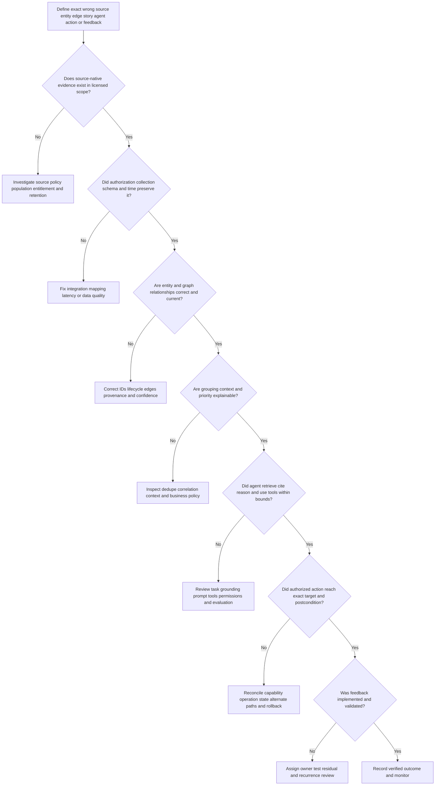

### Plain-English deep-dive 5 - Troubleshoot the evidence chain before blaming the agent

If a navigation assistant sends a driver to the wrong hospital, the language model may not be the first defect. The address registry may have merged two facilities, the road closure feed may be stale, or the destination request may contain an old patient location. Fixing the wording of the directions would not repair the data.

An agentic security error can originate in source coverage, timestamps, schema, identity, graph edges, business context, policy, tool permissions, action semantics, or the model itself. Start at the nearest source truth and walk forward. This layered method both finds root causes faster and produces a better Support or Product escalation than "the AI is wrong."

## Security, privacy, model risk, and resilience

Agentic SecOps concentrates security telemetry, identity, business context, graph relationships, investigations, tool credentials, and response capabilities. It is therefore a high-value security domain. Apply strong authentication, least privilege, tenant/environment separation, secrets management, encrypted transport/storage, protected audit, change control, monitoring, backup/recovery, data minimization, retention, export control, regional requirements, and provider/subprocessor governance.

Model risk includes unsupported claims, omissions, stale grounding, biased priority, unsafe recommendations, overreliance, prompt injection, tool misuse, drift, inconsistent outputs, and hidden dependency changes. Build a fixed evaluation set with common and edge cases: correct/incorrect identity, delayed data, conflicting context, denied versus successful action, no-find with gaps, high-impact low-confidence case, prompt injection in logs, unavailable action, timeout, and rollback.

| Risk | Potential harm | Control | Validation |
|---|---|---|---|
| Cross-tenant/entity error | Wrong data, priority, or containment target | Immutable scope binding and revalidation | Negative and recycled-ID tests |
| Prompt injection | Adversarial evidence manipulates tools/output | Instruction/data separation, allowlists, validation | Malicious log/ticket test corpus |
| Overprivileged agent | Compromise causes broad query/action | Separate roles, least privilege, JIT, limits | Permission and abuse tests |
| Sensitive enrichment leakage | Personal/business data reaches unnecessary users/tools | Purpose, field minimization, masking, role access | Data-flow and access review |
| Hallucinated incident fact | Wrong accusation/action/communication | Citations, entailment checks, human review | Regression and story sampling |
| Stale graph/context | Wrong scope and priority | Effective time, freshness, owner, conflict visibility | Historical/current edge tests |
| Action ambiguity | Request mistaken for containment | Native state, read-back, independent postconditions | Timeout/partial/wrong-target drill |
| Model or product change | Behavior shifts without customer awareness | Versioning, release review, regression, rollback | Before/after evaluation |
| Agent dependency outage | Triage/investigation stalls | Degraded mode, manual runbooks, source access | Continuity exercise |
| Feedback poisoning | Bad outcomes teach unsafe logic | Reviewed labels, separation, controlled release | Data lineage and approval audit |
| Insider misuse | Legitimate access used for surveillance/action | Need-to-know roles, query/action audit, review | Periodic access and activity review |
| Evidence integrity loss | Conclusions cannot be reproduced | Source references, protected originals, audit | Case reproduction exercise |

## Product, workflow, and claim failure modes

| Misconception or failure | Why it fails | Better practice |
|---|---|---|
| Agentic SecOps is one autonomous product | Public story spans products/services/data/controls and evolving boundaries | Map current portfolio, licenses, tasks, and authority |
| Agentic means no humans | Consequential decisions require context, policy, and accountability | Human-governed bounded agents |
| First-party data is always more accurate | Origin does not fix scope, identity, time, or semantics | Validate each source for each claim |
| Third-party integration means full fidelity | Connectors may expose limited objects or one-way flows | Write and test data/action contracts |
| Security graph is objective truth | Edges can be stale, inferred, contradictory, or wrong | Preserve provenance, time, state, confidence |
| More context always improves priority | Bad joins and stale business data create confident errors | Minimize, validate, and expose conflicts |
| Unified story is a confirmed incident | Correlation creates a hypothesis and work container | Validate evidence and customer declaration threshold |
| High priority means high confidence | Priority includes impact/urgency; confidence is separate | Expose drivers and claim-level confidence |
| AI summary is evidence | It is a derived transformation | Reproduce every decisive source claim |
| Recommended action is available | License, integration, configuration, and product support vary | Verify current capability before recommendation |
| Step-up always stops identity threats | Endpoint/session/factor compromise may persist | Match control to threat and verify behavior |
| Isolation means every path is blocked | Semantics and alternate sessions/routes vary | Test intended and residual paths |
| Feedback is automatic | Durable improvement needs owner, change, test, and residual | Operate a validated feedback register |
| Agentic SOC replaces SIEM/EDR/IAM/ITSM | Official FAQ emphasizes complementarity and interoperability | Define system-of-record/use-case rationalization |
| Marketing metrics guarantee customer results | Claims are dated and context-specific | Establish customer baseline and transparent measures |
| TSM owns incident response | Product success role does not inherit customer authority | Facilitate evidence, adoption, Support, and decisions within RACI |

## Explicitly fictional and synthetic NMH Agentic SecOps case

Everything in this section is an explicitly fictional and synthetic NMH teaching scenario. Every date is a labeled fictional future date later than the 2026-08-24 source snapshot. Every source, product state, graph edge, agent output, action, metric, and result is invented. Nothing is a customer fact, Zscaler tenant fact, product output, entitlement, production action, or prediction.

On fictional future date **2026-10-12**, fictional synthetic NMH evaluates an invented Agentic SecOps-style workflow in a paper exercise. Synthetic first-party-style evidence includes fictional traffic and policy records for training identity `U-301` accessing test app `A-22`. Synthetic third-party evidence includes an endpoint alert, directory lifecycle record, cloud audit record, and service catalog. A fictional graph initially links `U-301` to production finance service `B-9` because an old alias remains in the synthetic service catalog.

The fictional agent groups three alerts, creates a timeline, and recommends user isolation. The summary correctly cites a new destination and unusual endpoint process, but incorrectly says a cloud privilege change succeeded; the fictional cloud source shows it was denied. It also uses the stale `B-9` edge to assign high business impact. This deliberately tests whether the analyst treats the agent as authority.

| Fictional synthetic element | Teaching observation | Evidence class | Required correction/check |
|---|---|---|---|
| Traffic/policy record | Test identity reached a newly observed training destination | Scenario source observation | Verify exact identity/session/device mapping |
| Endpoint alert | Script chain on synthetic device D-62 | Scenario detection output | Reproduce process evidence and approved test status |
| Cloud action | Privilege change was denied | Scenario source observation | Correct summary from succeeded to denied |
| Service edge | U-301 linked to finance service B-9 by expired alias | Scenario graph defect | Expire edge and identify current training-service owner |
| Priority | High impact driven by stale service edge | Scenario derived output | Recalculate after context correction |
| Agent recommendation | User isolation proposed | Scenario derived recommendation | Compare step-up/reduced-access/monitor options and authority |
| Source gap | One fictional endpoint source delayed | Scenario unknown | State checked and unknown scope |

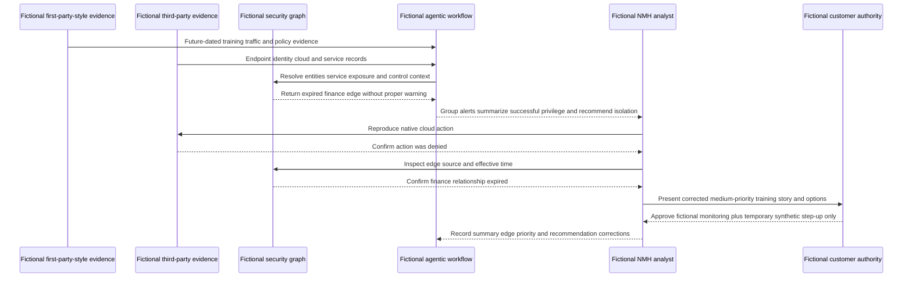

In the fictional exercise, the authorized owner later confirms a scheduled test on fictional future date **2026-10-12**. No production access, successful privilege change, or data loss is established. The synthetic response remains monitoring plus an invented temporary step-up in the paper workflow, not a real product action. Feedback creates four fictional tasks: expire the graph edge, add a denied-versus-success regression test, require recommendation alternatives, and monitor delayed endpoint coverage.

The lesson is not that agents fail. It is that source semantics, graph time, business context, recommendation scope, and human authority are all part of the architecture. A well-governed workflow uses the error to improve the system and can show exactly which outputs changed after correction.

## Practical scenarios and decision drills

### Scenario 1 - Customer asks which first-party signals Agentic SecOps will use

Do not recite every Zscaler product. Inventory the customer's licensed/deployed products, traffic paths, policies, inspection limits, identity/device mapping, telemetry scope, retention, and use case. State public categories separately from tenant facts and unknowns.

### Scenario 2 - Third-party EDR and Zscaler device records disagree

Compare immutable IDs, tenant, enrollment, reimage, hostname/IP aliases, source/effective times, and ownership. Keep the entities unresolved or conflicted until evidence supports a merge. Do not let the agent choose by majority vote.

### Scenario 3 - Security graph displays a path to sensitive data

Inspect each edge as observed, configured, attested, inferred, demonstrated, contradicted, unknown, or expired. Validate identity, app, privilege, reachability, control, and data semantics. Communicate possible path separately from observed use.

### Scenario 4 - Agentic summary says exfiltration

Trace the statement to data, app, traffic, and destination evidence. Separate read, transfer attempt, allowed transfer, bytes, sensitive classification, external receipt, authorization, and customer declaration. Correct unsupported language and add a regression case.

### Scenario 5 - High priority is driven by stale criticality

Preserve the original technical evidence. Correct the authoritative business-context value and effective time, recalculate priority, record affected decisions, and implement a context freshness monitor. Do not dismiss the alert solely because priority falls.

### Scenario 6 - Isolation is recommended but not licensed or integrated

Mark the recommendation unavailable, verify current product/entitlement documentation, and compare supported customer controls such as step-up, reduced access, IAM, EDR, or manual response under policy. File a product issue only if documented behavior contradicts evidence.

### Scenario 7 - Customer wants full autonomous response

Classify actions by impact, reversibility, target certainty, threat fit, frequency, and failure cost. Begin with recommendation and low-impact pre-authorized actions, evaluate reliability and adversarial cases, require limits/rollback/read-back, and retain human approval where consequence warrants it.

### Scenario 8 - Executive asks whether Agentic SecOps replaces the SIEM

Use the official complementarity statement. Compare source coverage, retention, search, detections, compliance, cases, response, integrations, staffing, cost, and systems of record. Recommend a use-case pilot and rationalization study, not an unsupported replacement promise.

## Artifact kit

| Artifact | Minimum content | Quality gate | Interview value |
|---|---|---|---|
| Official claim ledger | Claim, source URL/date, wording, boundary, verification | No UI/field/metric/entitlement invention | Shows product rigor |
| Portfolio map | Agentic SecOps, Agentic SOC, Data Fabric, ZTE, Exposure, Deception, Hunting, MDR, third parties | Marked conceptual, not licensing diagram | Shows architecture fluency |
| First-party inventory | Product/source, population, observation point, IDs, time, fields, health, owner | Tenant evidence distinguishes availability | Shows telemetry discovery |
| Third-party contract | Purpose, scope, grain, schema, time, identity, quality, security, action | End-to-end tests defined | Shows integration maturity |
| Graph dictionary | Node/edge semantics, direction, source, time, state, confidence, owner | Unknown/conflict/expiry supported | Shows graph reasoning |
| Context authority matrix | Attribute, source, owner, effective time, privacy, quality | High-impact context reviewed | Shows business translation |
| Threat-story quality rubric | Atoms, entities, timeline, correlation, path, scope, impact, citations | Merge/split and contradiction tests | Shows SOC understanding |
| Priority driver card | Technical, active, threat, privilege, criticality, data, path, scope, controls, confidence | No opaque universal score | Shows risk reasoning |
| Agent task card | Goal, scope, sources, tools, output, stop, permissions, reviewer | Task and out-of-scope explicit | Shows agent design |
| Agent evaluation pack | Correctness, completeness, citation, entity/time, safety, bias, prompt injection, action | Fixed regression and edge cases | Shows responsible AI expertise |
| Adaptive response matrix | Threat fit, target, supported control, impact, approval, rollback, postconditions | Capability verified before recommendation | Shows response governance |
| Human-authority RACI | Retrieve, recommend, approve, execute, validate, declare, recover, accept | Customer authority visible | Shows trusted-advisor boundary |
| Feedback register | Trigger, destination, owner, change, validation, result, residual, review | Loop closed by evidence | Shows continuous improvement |
| Adoption scorecard | Readiness, use, quality, decision, response, safety, feedback, trust | Baseline and denominators explicit | Shows TSM value method |
| Escalation packet | IDs, UTC, source, graph/story/agent/action version, expected/actual, impact, reproduction, ask | Redacted, minimal, source-grounded | Shows Support/Product partnership |

## Safe exercises

All exercises use official public sources plus fictional, synthetic, or sanitized data. They require no production Zscaler access or security action.

1. Build an official-claim ledger for the current Agentic SecOps page and classify every statement as capability, benefit, metric, customer story, or unknown implementation detail.
2. Draw a conceptual portfolio map and label Agentic SecOps, Agentic SOC, Data Fabric, security graph, Zero Trust Exchange, Exposure Management, Deception, Threat Hunting, MDR, and existing tools.
3. Create a fictional first-party source inventory without inventing product fields; list the questions required for tenant validation.
4. Write a third-party EDR integration contract with source IDs, times, schema, device lifecycle, quality, privacy, and action boundaries.
5. Design a graph node/edge dictionary and test observed, configured, attested, inferred, contradicted, unknown, and expired relationships.
6. Create a business-context authority matrix for criticality, owner, service, privilege, data, exposure, control, change, and recovery.
7. Correlate eight synthetic alerts into two threat stories and retain one unresolved alert with explicit rationale.
8. Build an explainable priority card and show how priority changes when stale context is corrected while source evidence remains unchanged.
9. Write a triage-agent task card that permits read-only queries but forbids incident declaration, graph mutation, and response.
10. Create an investigation-agent evaluation set containing wrong identity, delayed data, denied action, conflicting context, prompt injection, and no-find-with-gap cases.
11. Draft three response options for one synthetic story: step-up, reduced access, and isolation. State threat fit, impact, authority, rollback, and postconditions.
12. Simulate an action timeout and reconcile native operation/target state before any retry.
13. Convert a synthetic incident lesson into one graph fix, one detection test, one exposure action, one control test, and one playbook change.
14. Design an adoption scorecard pairing speed with correctness, coverage, safety, business outcome, and feedback.
15. Prepare a two-minute answer to "Does Agentic SecOps replace our SIEM and SOC?" using the dated official complementarity boundary.
16. Build a redacted escalation packet for a summary that changes "denied" to "successful" despite correct source evidence.
17. Conduct a tabletop where the agent service is unavailable and analysts use source tools and manual runbooks.
18. Explain every claim aloud using "official public fact," "general practice," "fictional scenario," "customer fact," or "unknown" before the statement.

## TSM discovery and operating questions

1. Which Agentic SecOps business outcomes and use cases matter to the customer, and what baseline pain supports them?
2. Which current Zscaler products, services, licenses, regions, traffic paths, policies, and source populations are actually deployed?
3. Which first-party telemetry is available for the use case, with what observation point, identity, time, retention, inspection, and blind spots?
4. Which third-party SIEM, EDR, IAM, cloud, network, app, exposure, ITSM, and business sources must remain authoritative?
5. What are the data/action contracts, including grain, IDs, schema, time, quality, privacy, owner, retry, and postconditions?
6. Which graph nodes and edges exist, and how are source, semantics, direction, effective time, state, confidence, conflict, and expiry represented?
7. Which business, risk, exposure, and control context is authoritative, current, restricted, or unknown?
8. How are alerts deduplicated, grouped, split, cited, versioned, and converted into unified threats?
9. Which drivers determine priority, how are overrides recorded, and how are stale context and model change detected?
10. Which agents/tasks can read, retrieve, correlate, summarize, recommend, approve, execute, tune, or audit?
11. How are citations, prompt injection, identity error, tool abuse, drift, bias, and model/product updates evaluated?
12. Which step-up, reduced-access, isolation, or third-party controls are currently supported, licensed, configured, and authorized?
13. Who requests, recommends, approves, executes, validates, declares, recovers, communicates, and accepts residual risk?
14. How do incident lessons become validated changes in exposure, posture, graph, detection, policy, playbook, provider, and agent evaluation?
15. Which source, graph, story, agent, action, business, safety, adoption, and feedback metrics will be measured with transparent denominators?

## Official Source Anchors

Research/source snapshot and source review date: **2026-08-24**.

These official Zscaler pages are the current public anchors used in this chapter. Volatile numeric marketing claims are deliberately omitted. The sources do not establish customer-specific licensing, implementation, data, integration, model, agent, action, service scope, performance, or outcome. Current technical/order documentation, contracts, tenant evidence, customer policy, and Support/Product guidance govern production.

| Source | URL | Used for | Boundary |
|---|---|---|---|
| Zscaler Agentic Security Operations | https://www.zscaler.com/products-and-solutions/security-operations | Primary proactive/reactive architecture story; first/third-party signals; security graph; context; unified threats; priority; agents; adaptive controls; feedback; portfolio; complementarity | Emerging public architecture; no internal schema, UI, field, model, action, autonomy, entitlement, metric, or result inferred |
| Zscaler Agentic SOC | https://www.zscaler.com/products-and-solutions/security-operations-core | Current named Agentic SOC solution/product context linked by official navigation | Route/name/scope can change; current technical/order details verify |
| Zscaler Data Fabric for Security | https://www.zscaler.com/products-and-solutions/data-fabric | Public ingest, harmonize/map, deduplicate, correlate/enrich, business logic, workflow, report, and exposure foundation positioning | No complete Agentic SOC internal architecture inferred |
| Zscaler Zero Trust Exchange | https://www.zscaler.com/products-and-solutions/zero-trust-exchange-zte | Public identity/context/business-policy, least-privilege, proxy/inline-control platform context | No specific adaptive response semantics or entitlement inferred |
| Zscaler Deception | https://www.zscaler.com/products-and-solutions/deception-technology | Current decoy/lure/breadcrumb, high-fidelity, surface, and response-integration positioning | Strong marketing language is attributed; customer safety and scope verify |
| Zscaler Threat Hunting | https://www.zscaler.com/products-and-solutions/managed-threat-hunting | Current expert-led, ZIA-telemetry, proactive network/identity-context hunting positioning | Service scope, hours, data, findings, and contract verify |
| Zscaler Managed Detection and Response | https://www.zscaler.com/products-and-solutions/managed-detection-and-response | Current around-the-clock expert/AI-supported detection, investigation, hunting, response, ZIA context, and SOC-complement positioning | Contract, integrations, actions, SLA, regions, retention, and outcomes verify |
| Zscaler CTEM | https://www.zscaler.com/products-and-solutions/ctem | Current exposure-management program positioning | Program alignment is not a complete Agentic SecOps dependency map |
| Zscaler UVM | https://www.zscaler.com/products-and-solutions/vulnerability-management | Current contextual vulnerability-prioritization and workflow positioning | No scanner, formula, or incident-response claim inferred |
| Zscaler Asset Exposure Management | https://www.zscaler.com/products-and-solutions/caasm | Current asset/entity/coverage and CAASM positioning | Source quality and current product scope verify |
| Zscaler Risk360 | https://www.zscaler.com/products-and-solutions/zscaler-risk-360 | Current enterprise risk-driver/trend and attack-stage context | No incident priority formula or objective risk truth inferred |
| NIST AI Risk Management Framework | https://www.nist.gov/itl/ai-risk-management-framework | General AI governance, mapping, measurement, and management context | Voluntary and vendor-neutral |
| NIST SP 800-61 Rev. 3 | https://csrc.nist.gov/pubs/sp/800/61/r3/final | General incident-response and improvement context | Customer procedures and authority vary |
| NIST SP 800-207 | https://csrc.nist.gov/pubs/sp/800/207/final | General zero-trust architecture concepts | Does not prescribe Zscaler implementation |
| MITRE ATT&CK | https://attack.mitre.org/ | General tactic/technique knowledge for stories, hunts, and detections | Mapping is not proof of occurrence or coverage |

## Likely Interview Questions

### Q1. What is Zscaler Agentic SecOps?

**Model answer:** As of the official public material reviewed on August 24, 2026, it is Zscaler's portfolio/solution story connecting proactive exposure and reactive threat operations. It combines available Zscaler telemetry and third-party signals, security-graph and business/risk context, unified threat stories, risk priority, agentic triage/investigation, and right-sized response through Zero Trust and integrated controls, with feedback into exposure and posture. It spans named areas such as Agentic SOC, Deception, Exposure Management, Threat Hunting, and MDR; exact licenses and implementations require verification.

### Q2. What is the role of first-party and third-party signals?

**Model answer:** First-party means evidence generated by Zscaler capabilities in the actual customer deployment; third-party means evidence from systems such as SIEM, EDR, IAM, cloud, apps, ITSM, or business sources. Origin does not decide quality. Zscaler context can add inline traffic and policy perspective, while other systems may own endpoint causality, identity lifecycle, object actions, or business state. I define source, scope, grain, identity, time, semantics, quality, privacy, ownership, and action contracts before correlation.

### Q3. What is the security graph, and what can go wrong?

**Model answer:** The public story describes a graph unifying network, identity, asset, and cloud context for agentic insight. Generally, nodes represent entities and edges represent relationships such as observed access, configured permission, ownership, exposure, or service dependency. Every edge needs source, direction, semantics, effective time, state, and confidence. Stale aliases, shared IPs, inferred edges, and outdated business context can produce wrong stories, priorities, scope, and targets, so unknowns and contradictions must remain visible.

### Q4. How do business context and risk prioritization work together?

**Model answer:** Business context adds customer-specific meaning such as asset/service criticality, user privilege, data sensitivity, ownership, exposure, controls, change, and recovery. Priority can combine that context with technical behavior, active status, threat relevance, scope, confidence, urgency, and policy. The official page positions risk-based ranking but does not publish one universal formula. Context changes attention and response; it does not rewrite weak evidence into confirmed compromise.

### Q5. What can agentic triage and investigation do, and where should humans remain?

**Model answer:** Public material positions agents to group and triage threats, summarize evidence, and recommend next steps. A governed design can also retrieve approved evidence, build timelines, traverse graph edges, compare behavior, scope entities, and draft decision packages. Humans validate decisive source facts, identity and path edges, business context, scope, and recommendations; customer authority declares incidents, approves consequential response, communicates, recovers service, and accepts residual risk. Tool permission never creates business authority.

### Q6. What are adaptive Zero Trust controls in this story?

**Model answer:** The reviewed public page names step-up authentication, reduced access, and user isolation as examples of risk-based response through the Zero Trust Exchange and describes integrated third-party response. In practice I verify the exact current supported action, license, integration, target semantics, threat fit, business impact, approval, duration, rollback, and read-back. I distinguish request, native completion, path effect, business effect, and recovery; "isolation" is never assumed to cover every route.

### Q7. How does Agentic SecOps complement existing SIEM, EDR, IAM, and ticketing tools?

**Model answer:** The official FAQ says many organizations are not looking to replace those tools and emphasizes integration and interoperability. Agentic SecOps can add Zscaler telemetry/context and coordinated workflows, while existing tools may remain authoritative for event retention/search, endpoint causality, identity lifecycle, enterprise cases, or changes. I define use cases and systems of record, test data/action contracts, and rationalize overlap only from measured evidence, not a blanket replacement claim.

### Q8. How would you position your readiness honestly?

**Model answer:** You can accurately explain the dated public architecture and has adjacent production strengths in multi-layer Microsoft service evidence, identity/permission troubleshooting, network traces, analytics, critical escalation, mentoring, and responsible AI evaluation. You can demonstrate synthetic claim ledgers, graph models, agent controls, response matrices, and troubleshooting artifacts. You should say you have not operated production Zscaler Agentic SecOps and would verify tenant licensing, data, integrations, agents, actions, contracts, and authority.

## 30-Second Memory Hooks

| Concept | Memory hook |
|---|---|
| Agentic SecOps | Signals, context, agents, action, feedback |
| Portfolio | Agentic SOC, Exposure, Deception, Hunting, MDR |
| First-party | Available Zscaler-origin evidence in this deployment |
| Third-party | Existing security and business evidence by contract |
| Origin | First versus third does not rank truth |
| Security graph | Nodes plus sourced time-aware relationships |
| Edge | Meaning, direction, source, time, state, confidence |
| Business context | Changes priority, not evidence history |
| Unified threat | Correlated story, not automatically incident |
| Priority | Explain drivers; do not worship one score |
| Agentic triage | Group, retrieve, summarize, recommend, review |
| Agentic investigation | Timeline, graph, hypotheses, scope, citations |
| Grounding | Open-book evidence with provenance and gaps |
| Prompt injection | Security evidence is untrusted data, not instructions |
| Adaptive response | Step-up, reduce, isolate, or integrate as verified |
| Human authority | Recommend is not approve; API is not risk owner |
| Feedback | Owner, change, test, outcome, residual |
| Complementarity | Keep systems of record until evidence supports change |
| TSM | Product truth, adoption, evidence, escalation, boundaries |
| Experience bridge | Escalation and AI rigor transfer; tenant experience does not |

## Completion Checklist

- [ ] I separate official product fact, general security practice, fictional scenario assumption, customer fact, and unknown.
- [ ] I retain the official-source snapshot date exactly as 2026-08-24 and avoid volatile numeric marketing claims.
- [ ] I define Agentic SecOps, Agentic SOC, agents, agentic workflows, first-party telemetry, third-party signals, Data Fabric, security graph, business context, risk priority, grounding, adaptive response, and feedback.
- [ ] I explain the dated public proactive-plus-reactive architecture without claiming proprietary internals.
- [ ] I distinguish portfolio, product/solution area, foundation/capability, platform, program, and managed service.
- [ ] I map Agentic SOC, Data Fabric, Zero Trust Exchange, Exposure Management, Deception, Threat Hunting, MDR, and existing tools with explicit boundaries.
- [ ] I inventory first-party evidence by actual product, license, population, observation point, identity, time, semantics, health, and blind spots.
- [ ] I contract third-party evidence by purpose, scope, grain, IDs, schema, time, quality, privacy, owner, and action behavior.
- [ ] I model security-graph nodes and observed, configured, attested, inferred, demonstrated, contradicted, unknown, and expired edges.
- [ ] I preserve edge source, direction, semantics, effective time, confidence, lifecycle, and conflict.
- [ ] I enrich with authoritative time-aware criticality, identity, service, data, exposure, control, change, recovery, and obligation context.
- [ ] I turn atomic alerts into unified threats through quality, dedupe, entities, time, correlation, graph, context, scope, confidence, and human review.
- [ ] I explain priority through technical, active, threat, privilege, criticality, data, path, scope, control, confidence, and customer-policy drivers.
- [ ] I bound triage agents to approved grouping, retrieval, summarization, scope, classification, next-check, and recommendation tasks.
- [ ] I govern investigation agents through hypotheses, allowlisted retrieval, timeline, graph limits, peer analysis, scope, citations, and human checkpoints.
- [ ] I separate instructions from untrusted evidence and test prompt injection, data leakage, wrong identity, stale context, and tool abuse.
- [ ] I separate read, recommend, approve, execute, validate, declare, recover, tune, audit, and accept-risk permissions.
- [ ] I verify current supported step-up, reduced-access, isolation, and third-party controls before recommendation or action.
- [ ] I preserve exact target, authority, native operation state, idempotency, read-back, rollback, business effect, and residual.
- [ ] I turn incident learning into owned validated graph, context, detection, exposure, control, playbook, provider, and agent-evaluation changes.
- [ ] I start adoption from one customer decision with verified prerequisites, baseline, tests, metrics, owners, and Support path.
- [ ] I measure source, entity, story, context, agent, decision, response, safety, feedback, recurrence, adoption, and cost with denominators.
- [ ] I troubleshoot source, integration, entity, graph, story, context, priority, agent, action, and feedback layers in order.
- [ ] I protect Agentic SecOps with tenant binding, least privilege, separation, minimization, provenance, audit, evaluation, change control, and degraded modes.
- [ ] I can identify every NMH item and date as explicitly fictional, synthetic, and future-dated.
- [ ] I can create all fifteen artifacts and complete all eighteen exercises without production access or action.
- [ ] I make no unsupported production Zscaler, Agentic SecOps, Agentic SOC, SOC, response, metric, entitlement, or customer-result claim.
- [ ] I can answer all eight interview questions with neutral source-bounded language.

[Part 97 - SecOps Integrations, Data Flow, Health, and Troubleshooting](Part-97-secops-integrations-troubleshooting.md)