# Part 97 - SecOps Integrations, Data Flow, Health, and Troubleshooting

> **Audience:** Arti Thakur, preparing for a Zscaler Security Operations Technical Success Manager role after Microsoft enterprise Support Escalation Engineering.

> **Purpose:** Explain SecOps integrations from zero across SIEM, EDR, IAM, ticketing, Zscaler, and other third parties, then provide an evidence-led method for data latency, data loss, clock, schema, entity-resolution, action, observability, ownership, and escalation problems.

> **Scope and honesty:** Northstar Meridian Holdings, abbreviated NMH, is an explicitly fictional and synthetic customer used only for study. Every NMH source, connector, tenant, record, identity, device, ticket, action, date, metric, incident, decision, and result is invented. Arti's factual background is Microsoft 365, OneDrive, and SharePoint support; network and trace analysis; SQL and Power BI; enterprise escalations; mentoring; and responsible AI exploration. Production Zscaler, SIEM, EDR, IAM, ITSM, SOC, connector-operation, incident-response, and security-action ownership remain learning boundaries.

> **Currency caveat:** Product names, integrations, interfaces, schemas, fields, delivery methods, APIs, actions, status semantics, limits, packaging, and entitlements change. The controlled official-source snapshot and source review date for this Part is exactly **2026-08-24**. Current official technical and ordering documentation, licensed-tenant evidence, source-native records, customer policy, contracts, product specialists, vendor Support, and tested runbooks govern production decisions.

> **Section goal:** Build a beginner-to-interview-ready integration method: map every producer-to-consumer path, define its contract and authority, observe health from source event through verified outcome, isolate latency/loss/time/schema/entity/action failures, preserve useful evidence, assign the correct owner, and escalate without inventing product behavior or claiming unsupported production experience.

This Part is primarily **general security practice**. The reviewed Zscaler public pages support only bounded positioning that Agentic SecOps combines available first-party Zscaler telemetry with third-party signals, values interoperability with SIEM, EDR, IAM, and ticketing systems, uses context to support security workflows, and can connect insight to right-sized controls. They do not establish a specific connector, endpoint, field, UI, entitlement, latency, retention period, action, health signal, support boundary, or customer result.

Every statement belongs to one of five evidence classes. **Official product fact** is a dated public statement supported by an anchor reviewed on 2026-08-24. **General security practice** is a reusable vendor-neutral method. **Scenario assumption** exists only inside explicitly fictional and synthetic NMH. **Customer fact** requires current customer-authoritative evidence. **Unknown** means the available evidence does not establish the answer. These labels must not be blended.

| Operating principle | Plain meaning | Practical consequence | Failure prevented |
|---|---|---|---|
| Map the whole path | A connector is one link, not the outcome | Trace producer through consumer and action read-back | Green badge with broken use case |
| Preserve native truth | Keep source IDs, time, payload reference, and semantics | Analysts can reproduce transformations | Normalized claim with no evidence |
| Define a contract | Purpose, scope, grain, identity, time, schema, delivery, security, and ownership are explicit | Each layer has acceptance tests | Integration by logo |
| Measure with denominators | Compare expected, eligible, sent, received, valid, resolved, and usable populations | Loss and coverage become visible | Counts without meaning |
| Treat unknown as a state | Timeout or missing evidence is not failure or success by assumption | Reconcile before retry or closure | Duplicate action or false reassurance |
| Separate technical and business authority | API permission does not grant risk authority | Approval and target checks remain explicit | Harmful automated response |
| Diagnose before escalating | Evidence should narrow the failing boundary | Send a minimal reproducible packet to the correct owner | Multi-vendor circular handoff |
| Verify current product truth | Public positioning does not prove tenant behavior | Check documentation, entitlement, configuration, and source evidence | Invented Zscaler capability |

## JD Mapping

| JD signal | Capability developed | Customer or TSM artifact | Honest boundary |
|---|---|---|---|
| Develop SecOps expertise | Explain integration architecture, data contracts, health, and action paths | End-to-end integration map | No production SOC-operation claim |
| Trusted technical advisor | Translate a desired analyst decision into source and workflow requirements | Use-case contract and decision record | Customer owns architecture and risk |
| Drive adoption and value | Prove that usable data reaches a repeated workflow | Adoption acceptance scorecard | No guaranteed use or outcome |
| Troubleshoot complex environments | Isolate source, export, transport, parse, schema, time, entity, analytic, ticket, and action faults | Layered troubleshooting runbook | No unsupported vendor root cause |
| Use analytics | Model expected populations, latency distributions, reconciliation, quality, and cost | SQL and Power BI-style health model | No product-internal schema claim |
| Coordinate stakeholders | Align SOC, IAM, endpoint, network, ITSM, platform, privacy, vendors, and business owners | RACI and escalation matrix | TSM facilitates rather than commands |
| Communicate proactively | State evidence, impact, uncertainty, owner, next check, and checkpoint | Technical and executive status templates | No unsupported assurance or ETA |
| Partner with Support and Product | Supply redacted native IDs, time, correlation IDs, payload evidence, and reproduction | Minimal escalation packet | No defect, fix, or roadmap promise |
| Apply AI responsibly | Prevent untrusted integration content from becoming agent instructions | Connector and agent trust-boundary review | No autonomous-response claim |

## Candidate honesty note

Arti can say: "My production experience is enterprise Microsoft Support Escalation Engineering rather than operating SecOps connectors. I have traced identity, permission, endpoint, network, proxy, browser, sync, and cloud-service dependencies; correlated timestamps and identifiers; used SQL and Power BI for data-quality analysis; coordinated multi-team escalations; and validated fixes. I have studied SecOps integration patterns and practiced with fictional artifacts. In a customer environment I would verify the actual Zscaler and third-party products, licenses, schemas, delivery methods, action semantics, ownership, and measured behavior."

That wording is deliberately neutral. It states factual work, a reasonable transfer, a studied boundary, and the next verification. Avoid claims such as "I operated production SIEM connectors," "I integrated Zscaler with every tool," "I automated EDR containment," or "I eliminated data loss." A diagram or synthetic exercise demonstrates reasoning, not production history.

| Factual background | Transferable strength | Neutral wording | Unsupported statement to avoid |
|---|---|---|---|
| M365, OneDrive, and SharePoint support | Multi-layer service and identity diagnosis | "I diagnose connected enterprise service paths." | "I ran a production SOC data fabric." |
| Network and process traces | DNS, TCP, TLS, HTTP, proxy, timing, retry, and path analysis | "I can test transport hypotheses using evidence." | "I operated Zscaler telemetry pipelines." |
| SQL and Power BI | Grain, joins, nulls, duplicates, latency, cohorts, and denominators | "I can model transparent integration quality." | "I know a vendor's internal event schema." |
| Critical escalations | Impact, workstreams, owners, updates, mitigation, and validation | "I coordinate evidence-led recovery." | "I owned cyber incident command." |
| Mentoring | Explain methods and improve runbook use | "I can enable repeatable troubleshooting." | "I managed SOC analysts." |
| Responsible AI work | Grounding, evaluation, privacy, and human review | "I can govern AI assistance around untrusted data." | "I deployed autonomous security response." |
| Fictional synthetic NMH work | Demonstrate contracts, trees, and evidence packs | "This artifact shows my study method." | "This is a customer implementation or result." |

## Beginner vocabulary and memory hooks

An integration allows two systems to exchange data or requests for a defined purpose. Think of it as a freight route. The producer packs a shipment, the carrier moves it, the receiver checks and stores it, and a downstream team uses it. A truck arriving does not prove that every item was packed, remained intact, was labeled correctly, or reached the intended shelf. Integration health therefore covers the complete business use, not merely network reachability.

| Term | Meaning from zero | Why it matters | Analogy or memory hook |
|---|---|---|---|
| Producer | System that creates authoritative source data | Establishes origin and native meaning | Factory that makes the item |
| Consumer | System that receives or uses data | Defines downstream acceptance | Warehouse receiving desk |
| Connector | Software/configuration joining systems | Implements part of the exchange | Loading dock adapter |
| Data flow | Ordered movement and transformation of data | Reveals where quality can change | Shipment route |
| Interface | Defined way systems communicate | Controls operations and formats | Service window with rules |
| API | Application Programming Interface | Common request/response integration method | Clerk accepting structured forms |
| Webhook | Source-initiated message to a receiver | Can deliver near-real-time notifications | Doorbell call when a parcel arrives |
| Polling | Consumer repeatedly asks for new data | Handles sources without push delivery | Checking a mailbox on a schedule |
| Stream | Continuous ordered or partitioned record flow | Supports high-volume ongoing delivery | Conveyor belt |
| Batch | Group of records transferred together | Efficient but creates availability delay | Scheduled delivery truck |
| Queue | Buffer holding messages until processed | Absorbs bursts and supports retry | Waiting line with numbered tickets |
| Cursor | Position marking what was read | Prevents gaps and duplicates during polling | Bookmark in a ledger |
| Checkpoint | Persisted progress state | Supports recovery after interruption | Last confirmed mile marker |
| Schema | Defined data shape and meanings | Consumers depend on stable interpretation | Form template and instructions |
| Parsing | Converting representation into usable fields | Makes records queryable | Reading entries from a form |
| Normalization | Mapping different source concepts into common concepts | Supports cross-source queries | Converting units to one standard |
| Provenance | Origin and transformation history | Makes a claim reproducible | Chain of custody |
| Grain | What one record represents | Prevents invalid joins and metrics | One parcel, one order, or one customer |
| Cardinality | Relationship counts between entities | Exposes one-to-many and many-to-many risk | One person with many badges |
| Entity resolution | Deciding which records describe the same real object | Enables correct correlation and targeting | Matching aliases to one person |
| Event time | When source activity occurred | Supports correct sequence | Time printed by the original camera |
| Receipt time | When the next system received it | Measures transport delay | Dock arrival time |
| Processing time | When transformation became available | Measures pipeline delay | Time placed on warehouse shelf |
| Effective time | When a state or relationship applies | Prevents stale context | Date an address change became valid |
| Latency | Delay between defined points | Determines freshness | Travel time |
| Loss | Expected eligible records never become available downstream | Creates blind spots | Missing parcels |
| Duplicate | Same logical item delivered more than once | Distorts alerts, tickets, and actions | Duplicate shipment |
| Backfill | Later delivery of historical records | Repairs gaps but changes timelines | Delayed truck carrying old parcels |
| Heartbeat | Periodic sign that a component is alive | Useful but insufficient health evidence | Driver says the truck is running |
| SLI | Service Level Indicator, a measured behavior | Provides objective health evidence | Actual delivery-time measure |
| SLO | Service Level Objective, a target for an SLI | Defines acceptable service | Delivery target |
| SLA | Service Level Agreement, a contractual commitment | Sets external obligation and remedy | Contracted delivery promise |
| Idempotency key | Stable key making safe retries recognizable | Reduces duplicate effects | One purchase-order number |
| Correlation ID | Identifier linking related operations | Supports cross-system tracing | Tracking number |
| Read-back | Querying target state after an action | Proves the requested effect | Check the door actually locked |
| Reconciliation | Comparing records or states across boundaries | Finds gaps, duplicates, and disagreement | Inventory count against manifest |
| Dead-letter queue | Holding area for messages that cannot be processed | Prevents silent discard | Inspection bay for rejected parcels |
| System of record | Authoritative home for a defined state | Prevents conflicting ownership | Official registry |
| ITSM | IT Service Management, often tickets, requests, incidents, and changes | Coordinates enterprise work | Work-order office |
| SIEM | Security Information and Event Management | Searches, analyzes, and alerts on security events | Security library and alarm desk |
| EDR | Endpoint Detection and Response | Supplies endpoint evidence and supported controls | Camera and control panel inside a room |
| IAM | Identity and Access Management | Owns identity lifecycle and access decisions as designed | Badge office |

### Plain-English deep-dive 1 - A connected connector can still be unhealthy

Imagine a hospital laboratory system that shows a green network connection to the patient-record system. Samples are collected and messages are transmitted. However, a software update changed the code for a critical test, so the receiver silently stores results as "unknown." Network connectivity is healthy. The clinical outcome is unsafe.

SecOps has the same trap. Credentials may be valid and the connector may send heartbeats while an excluded population never exports, a cursor skips records, a parser rejects a new format, a clock shift changes the search window, a user maps to the wrong identity, a ticket update loops, or an action request is accepted but not enforced. Health must be tested at each transformation and at the final analyst or control decision.

A useful sentence is: "The transport is reachable, but use-case health remains unknown until expected source records arrive with valid semantics, resolve to the correct entities, support the intended detection or case, and produce a verified outcome." That sentence prevents a component status from becoming an outcome claim.

## Integration jobs across the SecOps stack

Different systems contribute different evidence and authority. Their boundaries vary by product and customer design. The table is general practice, not a statement that any named product or tenant has these exact capabilities.

| System family | Common contribution | Possible authoritative role | Common integration failure |
|---|---|---|---|
| SIEM or security data platform | Broad events, search, detections, retention, reports | Event-search or detection record as designed | Delayed ingestion, parse drift, duplicate alert |
| EDR | Endpoint process, file, device, user, and supported response evidence | Endpoint-native telemetry and endpoint action state | Offline agent, reused device ID, action timeout |
| IAM or PAM | Identity lifecycle, groups, privilege, authentication, sessions | Identity/access source of record by attribute | Alias collision, stale group, propagation delay |
| ITSM or case platform | Ticket, task, approval, owner, change, communication | Work and change record as designed | Loop, state conflict, missing acknowledgement |
| Network/security platform | Traffic, DNS, proxy, firewall, policy, threat, data context | Observation-point-specific network evidence | Bypass, NAT, inspection gap, time mismatch |
| Zscaler capabilities as actually deployed | Publicly positioned zero-trust telemetry/context and available controls | Product-native event or control state where verified | Assumed source, field, action, or entitlement |
| Cloud platform | Resource, identity, control-plane, workload, audit evidence | Cloud-native resource/action truth | Ephemeral resource and account ambiguity |
| CMDB/MDM/asset source | Ownership, lifecycle, business service, managed state | Context authority by defined attribute | Stale inventory and many-to-one joins |
| Threat intelligence | Indicators, actor/campaign context, confidence, validity | Intelligence-source assertion | Expired indicator or context treated as proof |
| Collaboration/notification | Human notification and acknowledgement | Communication channel, rarely case truth | Message sent but not acknowledged |

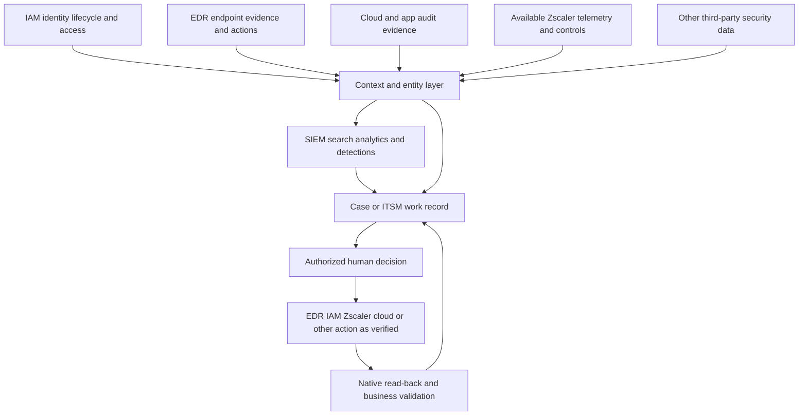

### System-of-record decisions

An integration becomes unstable when two systems both believe they own the same state. For example, an alert may open a SIEM incident and an ITSM ticket. If closing either one automatically closes the other, an analyst can create a loop or erase unresolved security work. Define which system owns alert state, case ownership, incident declaration, approval, technical action state, business validation, and closure.

| Work object | Candidate authoritative home | Key decision | Anti-pattern |
|---|---|---|---|
| Source event | Native source | Which copy preserves full meaning? | Normalized record replaces native truth |
| Detection alert | Detection engine | Which version and evidence produced it? | Ticket title becomes alert evidence |
| Security case | SIEM/XDR/SOAR/case platform by design | Where do analysts own investigation state? | Two active case masters |
| Enterprise ticket | ITSM | Which tasks, communications, and SLAs live here? | Ticket closure declares threat absent |
| Identity state | IAM/HR/PAM by attribute | Which source owns user, privilege, session, lifecycle? | One directory assumed universally current |
| Endpoint action | EDR native system | What is request, completion, and effective state? | SOAR success replaces endpoint read-back |
| Zero-trust control | Actual control system | Which policy/action state is authoritative? | Public product page used as tenant evidence |
| Incident declaration | Customer incident policy and assigned authority | Who can declare and end an incident? | Tool severity declares incident automatically |
| Metric | Governed analytical model | Which grain, denominator, exclusions, and version apply? | Dashboard count without data contract |

## The integration contract

An integration contract is not only an API specification. It is an operational agreement between producer, transport, consumer, workflow owner, and action owner. It states what should happen, for whom, how quickly, with which meaning, under which security rules, and how failure is detected and handled.

| Contract dimension | Questions to answer | Acceptance evidence | Failure if omitted |
|---|---|---|---|
| Purpose | Which decision, detection, investigation, report, or action needs the integration? | Named use case and owner | Data collected without use |
| Population | Which tenants, users, devices, apps, events, and exclusions are eligible? | Expected inventory and coverage denominator | Silent scope gap |
| Grain | What does one record or request represent? | Grain statement and unique key | Invalid counts and joins |
| Native identity | Which immutable scoped IDs exist? | Source/tenant/entity key examples | Display-name collision |
| Time | Which event, receipt, processing, effective, and update times apply? | UTC and source-time tests | Wrong sequence or window |
| Schema | Which types, units, enums, required/optional semantics, and versions apply? | Positive, negative, boundary payload tests | Silent semantic drift |
| Delivery | Push, pull, batch, stream, queue, ordering, cursor, retry, and backfill? | Failure/recovery test | Gap or duplicate |
| Quality | Which completeness, validity, uniqueness, freshness, and resolution targets apply? | SLI/SLO with denominator | Heartbeat-only health |
| Security | Authentication, authorization, secrets, network, encryption, tenant binding, and audit? | Access and misuse tests | Cross-tenant or excessive access |
| Privacy | Purpose, minimization, region, retention, masking, access, and deletion? | Approved data inventory | Unnecessary sensitive replication |
| Ownership | Who owns source, connector, consumer, schema, entity, detection, case, and action? | RACI and on-call route | Circular escalation |
| Change | How are versions, maintenance, deprecation, rollback, and notice handled? | Compatibility and release plan | Surprise breakage |
| Evidence | Which native IDs, correlation IDs, payload references, and logs are retained? | Reproducible trace | Unsupported root cause |
| Continuity | How do buffering, degraded mode, replay, export, and recovery work? | Outage exercise | Permanent blind spot |
| Action | Which target, authority, idempotency, timeout, read-back, rollback, and residual apply? | Safe action test | Duplicate or wrong-target effect |

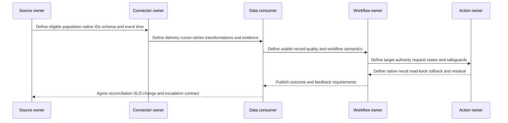

### Push, pull, batch, and stream tradeoffs

No delivery pattern is universally best. Push can reduce polling delay but needs receiver availability, authentication, backpressure, and replay. Polling can simplify consumer control but must handle cursor persistence, overlap, rate limits, pagination, and late updates. Batch can be efficient for high volume but intentionally increases freshness delay and creates larger replay units. Streams support continuous flow but require partition, ordering, checkpoint, lag, and poison-message operations.

| Pattern | Strength | Main risk | Required health evidence |
|---|---|---|---|
| Webhook/push | Low delivery delay when healthy | Lost callback or receiver overload | Source send, receiver acknowledge, replay path |
| Poll/API pull | Consumer controls pace and windows | Cursor gap, pagination, throttling | Cursor progress, overlap reconciliation, rate state |
| Scheduled batch | Efficient bulk transfer | Long freshness and large failure domain | Manifest counts, checksum, batch completion, late-arrival handling |
| Queue | Buffer and decouple components | Growing lag or poison records | Depth, oldest age, retry, dead-letter, drain rate |
| Stream | Continuous high-volume movement | Partition skew, checkpoint and ordering complexity | Per-partition lag, offset, processing success |
| File export | Portable and inspectable | Partial file, naming/version, duplicate pickup | Manifest, atomic completion, checksum, archive state |

## End-to-end data-flow mechanics

Start at the source observation, not at the dashboard. A complete trace asks whether the source created the expected native record, whether it was eligible for export, whether credentials and scope allowed access, whether transport accepted it, whether the consumer acknowledged it, whether parsing and normalization preserved meaning, whether entity resolution chose the correct object, whether downstream logic evaluated it, and whether the result reached the intended person or control.

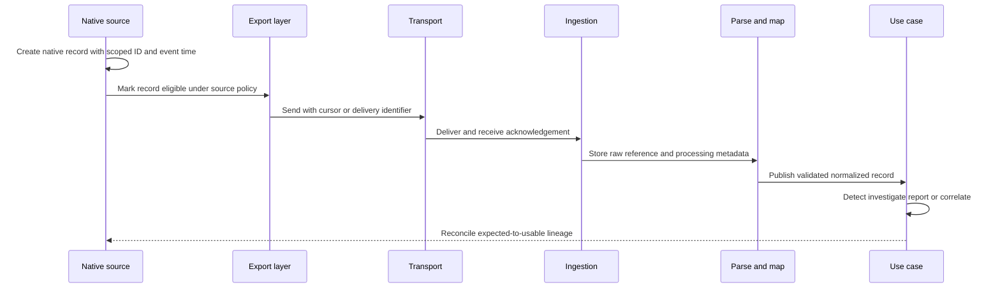

### Fan-out, fan-in, and loops

One source often fans out to several consumers. One case often fans in evidence from several sources. Ticketing and case synchronization can create a feedback loop. These shapes require explicit loop prevention, stable correlation, and conflict rules.

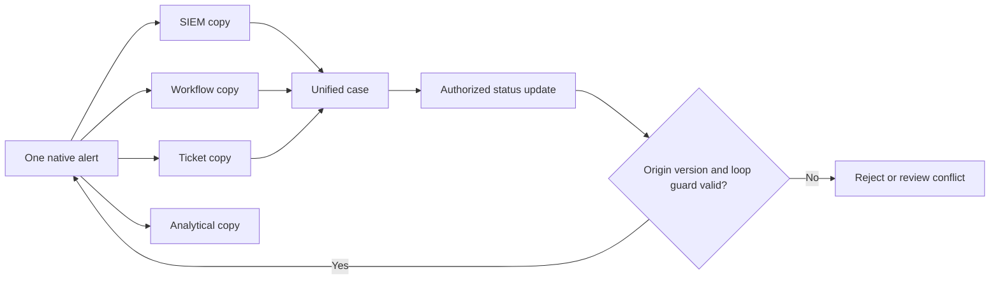

For fan-out, decide whether all destinations receive the same scope and whether privacy or cost requires filtering. For fan-in, preserve source-native IDs and do not use a display name as the only join key. For loops, include an origin marker, stable object key, version or update token, allowed state-transition map, deduplication rule, and maximum retry. A message that returns unchanged to its origin should not create a new logical event.

## Connector observability and health model

Observability is the ability to infer internal behavior from available evidence. Monitoring is the repeated collection and evaluation of that evidence. A dashboard is useful only when each signal maps to a failure mode and an owner. A mature integration has technical indicators, semantic tests, synthetic or controlled canaries, reconciliation, workflow outcomes, and user-reported evidence.

| Health layer | Example SLI | Denominator | Important distinction |
|---|---|---|---|
| Source creation | Eligible native records created | Expected eligible source activity | No source record versus export failure |
| Export scope | Eligible records selected | All eligible native records | Exclusion versus loss |
| Transport | Accepted deliveries | Export attempts | Acceptance versus eventual usability |
| Queue | Oldest age and depth | Messages by partition/type | Burst versus stuck consumer |
| Ingestion | Received unique logical records | Exported logical records | Duplicate delivery versus duplicate event |
| Parse | Valid records | Received records by schema version | Rejection versus null-filled acceptance |
| Normalization | Semantically mapped records | Valid parsed records | Technical type versus correct meaning |
| Entity | Correctly resolved records | Eligible resolvable records | Unknown versus wrong match |
| Freshness | Records available within objective | Usable records by class | Median hides long tail |
| Detection/workflow | Expected test outcome | Controlled positive/negative tests | Data presence versus use-case function |
| Case/ticket | Acknowledged synchronized state | Intended updates | Sent versus owned work |
| Action | Verified effective postcondition | Authorized action requests | Accepted API request versus effect |
| Feedback | Validated improvement completed | Accepted improvement items | Closure versus durable change |

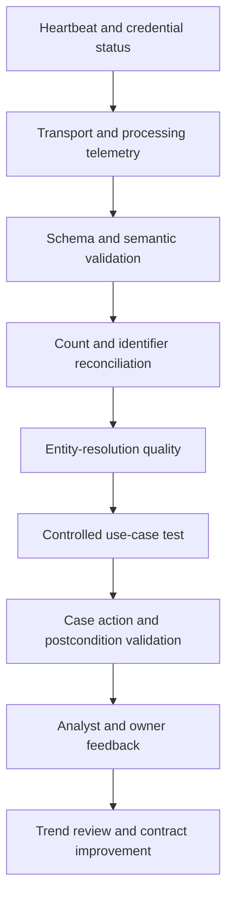

### Health dashboards that answer decisions

Do not start with chart types. Start with questions. Is the source producing? Is the connector moving? Is the consumer accepting? Are records usable? Which population is missing? How old is the oldest unavailable evidence? Did a controlled test reach the expected workflow? Can the action owner prove actual state? Who owns the current fault and when is the next check?

| Dashboard view | Decision supported | Minimum segmentation | Misleading version |
|---|---|---|---|
| Coverage funnel | Which expected population disappears? | Source, tenant, entity/event class, exclusion reason | One global percentage |
| Latency distribution | Is evidence fresh enough for use? | Source class, path, percentile, event/receipt/processing | Average only |
| Error taxonomy | Which repair team and runbook apply? | Auth, throttle, transport, parse, schema, entity, action | Total errors only |
| Queue/lag | Is backlog growing or draining? | Partition, oldest age, arrival and service rate | Depth without age |
| Reconciliation | Are IDs/counts missing or duplicated? | Window, source, cursor/batch, late-arrival allowance | Consumer count alone |
| Entity quality | Unknown or wrong mappings? | Entity type, source, match method, lifecycle | Match rate without sampled accuracy |
| Use-case canary | Does the intended workflow still work? | Positive, negative, boundary, delay, duplicate | Heartbeat treated as acceptance |
| Action outcome | Did the target state change safely? | Request, native result, read-back, business effect | HTTP status alone |

### Plain-English deep-dive 2 - Denominators make health honest

Suppose a team says 99 percent of received records parse successfully. That sounds excellent. If the source created one million eligible records but the connector received only half, the parse rate hides a major loss. The denominator changed from "eligible at source" to "arrived at parser." Both numbers can be true, yet only the full funnel exposes the blind spot.

Use a population ladder: expected, eligible, created, selected, sent, accepted, received, unique, parsed, semantically valid, correctly resolved, timely, usable, and outcome-producing. Each transition needs a reason for exclusions and an owner. Not every use case requires every record, but any intentional reduction must be defined before measurement rather than explained afterward.

Also inspect distributions. A median latency of two minutes can coexist with a severe tail in which ten percent of records arrive hours later. Security decisions often depend on the slowest critical class, not the typical record. State percentile or threshold compliance by source class and acknowledge unknown source creation time when it cannot be trusted.

## Data latency

Latency is elapsed time between two defined milestones. "The integration is five minutes late" is incomplete unless the start, end, event class, period, and distribution are named. Source clocks may be wrong, and batch design may intentionally delay availability. Separate event-to-export, export-to-receipt, receipt-to-parse, parse-to-index, index-to-alert, alert-to-ticket, and action-request-to-effective-state delays.

| Latency segment | Start | End | Likely owner/failure |
|---|---|---|---|
| Source generation | Activity | Native record created | Source application or sensor |
| Export wait | Native record eligible | Export attempt | Source export schedule/queue |
| Transport | Send attempt | Consumer receipt | Network, broker, receiver, retry |
| Ingestion | Receipt | Durable acceptance | Consumer intake/storage |
| Processing | Acceptance | Parsed/indexed availability | Parser, mapper, index, backlog |
| Analytic | Usable data | Detection/story result | Rule schedule, dependency, query |
| Workflow | Alert/result | Case/ticket availability | Orchestration, ITSM, throttle |
| Action | Authorized request | Verified effective state | Target queue/control/policy propagation |

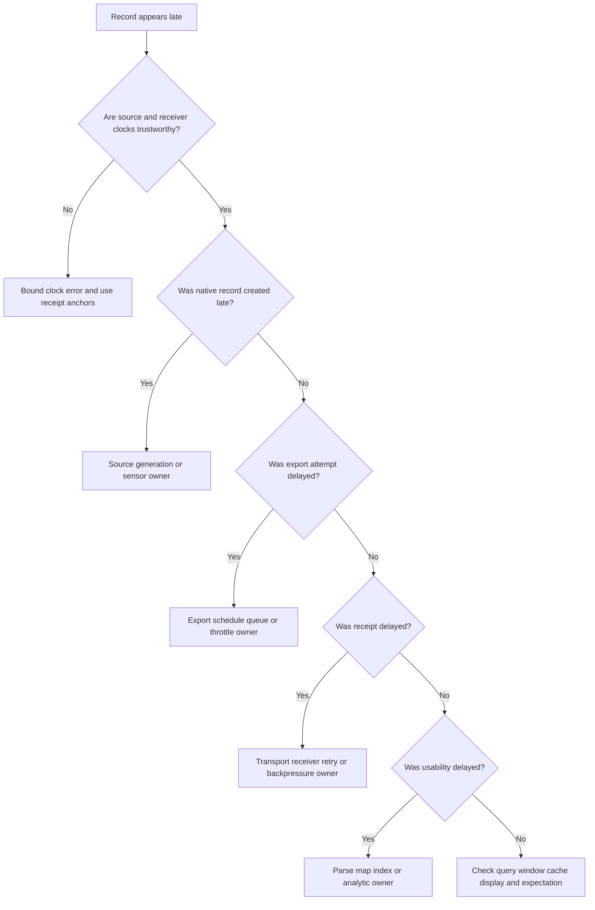

### Latency troubleshooting method

1. Choose one known native record with a stable ID and expected path.
2. Record source event, source creation, export attempt, receiver receipt, processing, availability, analytic, case, and action times where evidence exists.
3. Normalize display to UTC while preserving raw timestamps and timezone metadata.
4. Check clock quality before subtracting timestamps from different systems.
5. Compare one record with a cohort to distinguish isolated retry from systemic lag.
6. Segment by event type, source partition, tenant, connector worker, payload size, and delivery pattern only where those dimensions are available and permitted.
7. Compare arrival rate with service rate and inspect oldest age, not only queue depth.
8. Test throttling, pagination, maintenance, batch schedule, retry backoff, and downstream index/query delay.
9. State observed delay, affected population, business use, owner, next check, and residual uncertainty.

Latency can be intermittent. Preserve an interval around the problem rather than one screenshot after recovery. A queue may drain and erase the visible backlog while records retain receipt metadata proving delay. If the source does not expose export timestamps, say that the segment is bounded between source creation and consumer receipt rather than inventing precision.

## Data loss, gaps, and duplicates

Loss means an expected eligible logical record never becomes usable downstream within the defined retention and late-arrival boundary. A missing search result is not automatically loss. The source may never have created a record, the event may be excluded by design, the search may use the wrong time or tenant, the record may be transformed, or retention may have expired.

| Symptom | Competing explanations | Discriminating evidence |
|---|---|---|
| One native ID absent | Export exclusion, cursor gap, rejection, search mistake | Source eligibility, export log, receipt/reject evidence |
| Range of IDs absent | Batch failure, partition outage, cursor jump | Manifest, checkpoint history, per-partition offsets |
| Counts lower downstream | Filtering, late arrival, dedupe, loss, aggregation grain | Population funnel and stable logical keys |
| Counts higher downstream | Retry duplicate, update versions, fan-out loop, grain mismatch | Delivery IDs, logical IDs, version/origin markers |
| Old records arrive together | Backfill, recovered queue, delayed source generation | Event versus receipt time and recovery evidence |
| Only one type disappears | Schema-specific reject, disabled category, scope change | Error by schema/event type and configuration history |
| Search finds record but rule missed | Rule window, dependency, suppression, schedule | Rule version, evaluated window, input snapshot |

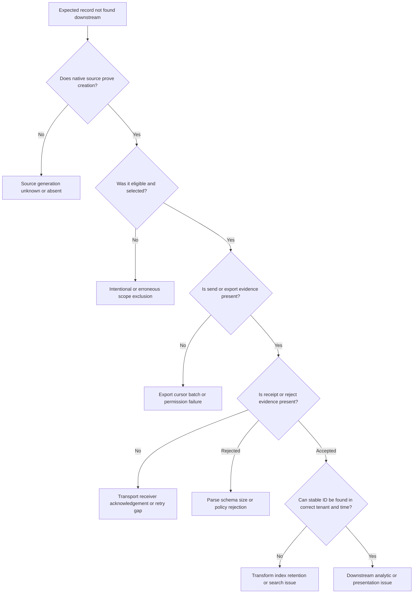

### Reconciliation mechanics

Reconcile stable logical IDs when available. Counts alone fail when records are updated, aggregated, sampled, intentionally filtered, or duplicated. If native IDs are not globally unique, scope them by producer, tenant, record type, and lifecycle. For batches, compare manifests and checksums. For streams, compare offsets and gaps by partition. For polling, retain cursor history and use controlled overlap so a crash between fetch and checkpoint does not skip records.

Deduplication should distinguish a delivery attempt from a logical event. Two delivery IDs can refer to one logical record. Two source records can describe distinct detections of the same behavior. One source record can receive updates. Preserve raw delivery lineage even when the analyst view collapses duplicates.

Backfill policy matters. Historical records should retain original event time and new receipt/processing time. Downstream rules must decide whether to evaluate late data, suppress old notifications, recalculate stories, or create a review task. Silent backfill can rewrite dashboards and incident timelines without explanation.

## Time synchronization and temporal integrity

Security investigations combine clocks from endpoints, identity providers, cloud services, network controls, collectors, and analyst systems. Clock drift means a clock gradually diverges. Clock skew means clocks show different values at a moment. Timezone and daylight-saving interpretation can also shift displays. Buffering and backfill create real delay even when clocks are correct.

```mermaid
flowchart LR
    ACT[Real-world activity] --> SRC[Source event time]
    SRC --> CREATE[Source record creation time]
    CREATE --> SEND[Export time]
    SEND --> RECEIVE[Consumer receipt time]
    RECEIVE --> PROCESS[Processing and index time]
    PROCESS --> ALERT[Detection or story time]
    ALERT --> DECISION[Analyst decision time]
    DECISION --> ACTION[Action request and effective time]
    ACTION --> RECOVER[Recovery and closure time]
```

| Time concept | Use | Failure mode | Safe practice |
|---|---|---|---|
| Event time | Sequence source activity | Wrong source clock | Preserve raw and clock-quality evidence |
| Creation time | Detect source logging delay | Generated after activity | Keep separate from event time |
| Receipt time | Anchor arrival at consumer | Receiver clock issue | Compare trusted infrastructure clocks |
| Processing time | Measure internal backlog | Reprocessing overwrites original | Retain first and latest processing metadata |
| Effective time | Apply identity/ownership/policy state | Current state joined to historical event | Use time-aware relationship |
| Update time | Interpret changed records | Update mistaken as new event | Track version and logical ID |
| Display time | Human viewing | Local timezone confusion | Use UTC for shared timeline and label local display |
| Action time | Measure requested/accepted/effective stages | One timestamp hides asynchronous states | Capture each state separately |

### Plain-English deep-dive 3 - Correct timestamps can still tell the wrong story

Consider a letter written Monday, placed in a mailbox Tuesday, delivered Friday, scanned into a system Saturday, and read Sunday. Every timestamp can be accurate. If an analyst sorts by scan time and calls it the writing time, the story is still wrong.

Security records have the same layers. A cloud audit record may describe an action at event time but arrive after a batch delay. An identity record may show a manager today even though another manager owned the account during the event. An action API may accept a request now while policy propagation completes later. The timeline must say which clock and business meaning each timestamp represents.

When clocks conflict, do not force exact order. Use trusted anchor events, receipt times, request/response pairs, monotonic sequence numbers where available, and bounded uncertainty. Say "A occurred no later than this receipt" or "The order is uncertain within the measured skew" rather than inventing causality.

## Schema and semantic drift

A schema defines structure and meaning. Structural drift changes names, types, nesting, required properties, or encodings. Semantic drift keeps the shape but changes meaning, units, enum interpretation, population, or lifecycle. Semantic drift is often more dangerous because parsing remains green.

| Drift type | Example in general terms | Detection | Response |
|---|---|---|---|
| Added optional attribute | New context appears | Contract/schema diff | Accept safely and assess value/privacy |
| Removed attribute | Previously available value disappears | Null-rate and required-field test | Degrade use case or block release |
| Type change | Number becomes text | Parser/type validation | Version mapper and quarantine invalid records |
| Enum expansion | New status value appears | Unknown-enum monitor | Treat unknown explicitly; update logic |
| Unit change | Bytes versus kilobytes | Range and semantic test | Correct mapping and affected history |
| Meaning change | "Success" now means accepted, not effective | Source release review and outcome tests | Update contract, rules, training, metrics |
| Population change | New event class or tenant included | Coverage and volume baseline | Review privacy, cost, detection behavior |
| Timestamp change | Local time becomes UTC or precision changes | Controlled time tests | Version parsing and timeline logic |
| Identifier reuse | Field remains text but lifecycle changes | Entity accuracy sample | Scope by lifecycle and authoritative source |

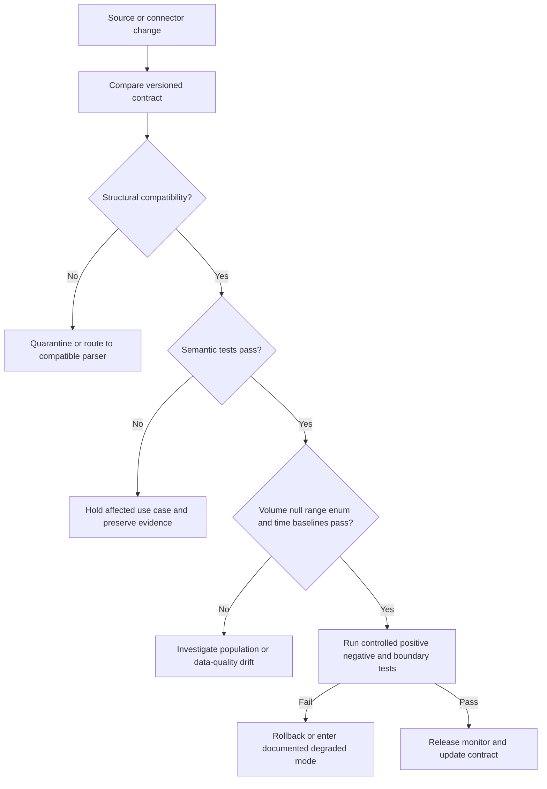

### Schema operations

Retain a versioned data dictionary with producer meaning, data type, cardinality, sensitivity, optionality, effective date, transformation, and known limitations. Contract tests should include valid, invalid, boundary, null, unknown-enum, delayed, duplicate, and out-of-order records. Keep raw or source-faithful references where policy permits so a normalization error can be corrected.

Do not invent vendor fields. In a real customer engagement, obtain current supported documentation or inspect authorized tenant/source evidence. The generic attributes in this chapter are conceptual requirements, not claims about a Zscaler or third-party UI or payload.

When drift affects a detection, case, action target, or metric, assess historical contamination. Identify the first known affected version and period, impacted use cases, false positives/negatives, tickets/actions, and reports. Correct forward behavior, decide whether historical reprocessing is justified and safe, and communicate uncertainty.

## Entity resolution and relationship failures

Entity resolution links records that refer to the same user, device, workload, application, IP, domain, file, data object, or business service. It is a claim with scope and time. A display name, email alias, IP address, hostname, or domain may be shared, changed, recycled, proxied, translated, or ambiguous.

| Entity | Stronger evidence | Common ambiguity | Consequence of wrong match |
|---|---|---|---|
| Human user | Scoped immutable directory ID plus lifecycle | Alias change, guest, duplicate name | Wrong investigation or access action |
| Service identity | Scoped object ID and credential/workload binding | Shared account, rotated credential | Human intent inferred incorrectly |
| Device | Stable management/EDR ID plus hardware/lifecycle evidence | Reimage, clone, reused hostname | Wrong endpoint isolated |
| Session | Native session/token ID and time | Multiple devices, refresh, proxy | Activity attached to wrong login |
| IP address | Time-aware allocation/NAT/proxy evidence | Shared egress, DHCP, carrier NAT | Many users collapsed into one |
| Application | Authoritative app/service ID and tenant | Shared domain, SaaS multi-tenancy | Wrong business impact |
| Workload/resource | Cloud-native scoped resource ID and lifecycle | Ephemeral rebuild, same name | Stale exposure or action target |
| Ticket/case | Stable system-scoped ID and origin | Number collision across systems | Updates sent to wrong case |

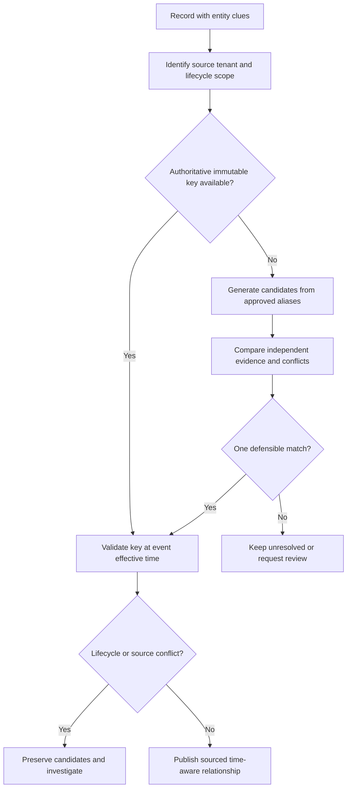

### Resolution quality

A high match rate is not enough. A system can achieve near-total matching by choosing the first similar name, producing dangerous false matches. Measure unresolved rate, sampled precision, conflict rate, stale relationship rate, manual correction rate, and downstream consequence. High-impact targets need stricter evidence than low-risk enrichment.

Keep match method and confidence visible. Prefer authoritative deterministic keys, then carefully governed composite evidence. Never let a probabilistic identity link silently authorize containment. The action path should revalidate the exact target in the target system using native current identifiers and lifecycle state.

Entity corrections need propagation. If two records were wrongly merged, identify affected stories, detections, tickets, actions, metrics, and learned context. Splitting the entity in one graph without repairing downstream artifacts leaves the operational error alive.

## Ticketing and case synchronization

Ticketing integrations are often treated as simple notification, but they coordinate ownership, approvals, evidence, and closure. Decide whether the integration creates a ticket, updates an existing ticket, synchronizes selected states, or merely links systems. Do not copy sensitive evidence into a broader-access ticket unless purpose and policy permit it.

| Design question | Safe answer pattern | Failure prevented |
|---|---|---|
| Creation key | Stable alert/case logical key plus origin | Duplicate tickets on retry |
| System of record | One owner for investigation state; one for enterprise work as designed | Conflicting truth |
| State mapping | Explicit allowed transitions and unknown handling | Closed ticket closes active case |
| Ownership | Named queue/person acknowledgement and timeout | Sent notification with no owner |
| Evidence | Link or minimum redacted summary with provenance | Sensitive overcopy and stale narrative |
| Comments | Origin/version marker and loop suppression | Infinite update echo |
| Priority | Mapping with business policy and override record | Vendor severity becomes business priority |
| Closure | Security, technical, and administrative closure separated | Premature completion |
| Reopen | Defined trigger and synchronization behavior | New evidence ignored |

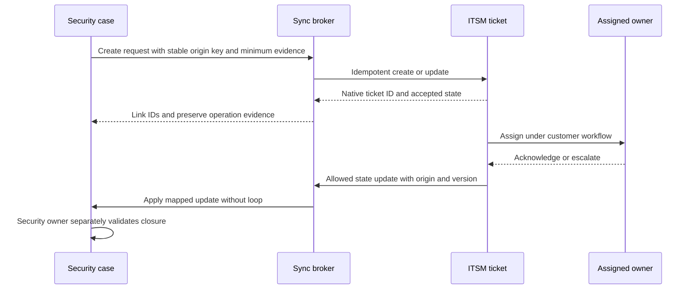

## Action paths and third-party action failures

Data integrations inform decisions; action integrations change systems. That increases risk. Separate recommendation, approval, request, acceptance, execution, effectiveness, business validation, rollback, and recovery. An HTTP success or workflow completion does not prove that the target state changed or that the threat path was interrupted.

| Action state | Meaning | Evidence | Unsafe shortcut |
|---|---|---|---|
| Proposed | Workflow suggests an action | Cited rationale and alternatives | Suggestion treated as authority |
| Approved | Authorized customer role accepts exact scope | Approver, target, effect, duration, rollback | Generic standing approval |
| Requested | Integration sent a bounded operation | Correlation/idempotency ID and payload reference | Request equals result |
| Accepted | Target acknowledged processing | Native operation ID/status | Acceptance equals effectiveness |
| Completed | Target reports technical completion | Native terminal state | Completion covers every route |
| Effective | Independent read-back/path test shows intended state | Target query and safe validation | Workflow green check |
| Business validated | Service owner confirms acceptable impact | Defined postcondition evidence | Security change assumed harmless |
| Rolled back/recovered | State restored under authority and monitoring | Native and business read-back | Expiry assumed to restore correctly |
| Unknown | Evidence cannot distinguish states | Timeout/gap evidence and reconciliation plan | Blind retry or false failure |

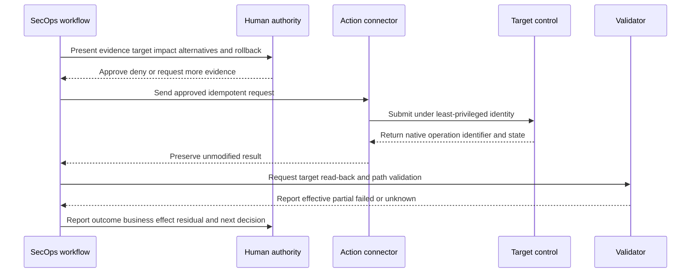

### Action failure taxonomy

| Failure | Evidence pattern | Safe response |
|---|---|---|
| Authorization denied | Target-native denial, no request effect | Verify identity, scope, policy, and intended authority |
| Wrong target binding | Request target differs from current authoritative entity | Stop, contain workflow, assess impact, correct identity chain |
| Timeout before acknowledgement | No conclusive target state | Query operation and target before retry |
| Partial completion | Some objects/routes changed | Bound affected/unaffected scope and decide compensate/continue |
| Duplicate request | Same intent sent more than once | Use idempotency and reconcile actual state |
| Policy conflict | Another control reverses or overrides state | Map precedence, effective policy, and owners |
| Propagation delay | Native accepted state precedes path effect | Wait bounded objective and perform read-back |
| Rollback failure | Restoration request incomplete or unsafe | Escalate under recovery authority and preserve residual |
| Business harm | Intended security effect disrupts critical service | Apply tested rollback/alternative and involve service owner |
| Audit gap | Action occurred without complete decision evidence | Preserve available evidence and treat as governance incident |

### Plain-English deep-dive 4 - Timeout is a fork, not a verdict

Imagine pressing a remote garage-door button while the camera feed freezes. The door might be open, closed, moving, or blocked. Pressing the button repeatedly can reverse the direction or damage the mechanism. The missing response creates an unknown state, not proof that nothing happened.

Action APIs behave similarly. A timeout may occur before the target receives a request, after it receives it, during execution, or after completion while the response is lost. Use an idempotency key, preserve the native operation ID when available, query current state, and reconcile before retry. If state remains unknown, protect the business and security risk through an approved manual or alternate path rather than guessing.

This distinction belongs in status updates: "The request was sent; the integration timed out before a conclusive acknowledgement. Current endpoint/control state is unknown. The target owner is reconciling native operation and effective state before any retry." That is more useful than "the action failed."

## Layered troubleshooting workflow

Troubleshooting should move from a concrete known record or request across the path. Broadly restarting connectors can erase evidence, create duplicates, drain backlogs unpredictably, or hide the failing boundary. Begin with one reproducible symptom and a cheap check that can falsify the current hypothesis.

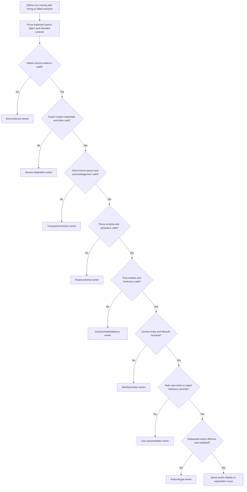

### Step-by-step diagnostic checklist

1. **Define the symptom:** Name the exact missing, late, duplicated, misparsed, misresolved, unsynchronized, or failed object and its decision impact.
2. **Establish expectation:** Show why the source object was eligible under the current contract. Do not infer expectation from a similar record.
3. **Capture native evidence:** Preserve source-scoped ID, raw timestamp, source semantics, relevant configuration version, and a redacted source reference.
4. **Trace export:** Check population scope, permissions, token validity, cursor, pagination, schedule, quota, throttle, and source-side errors.
5. **Trace transport:** Check DNS, routing, proxy, TLS, endpoint reachability, acknowledgement, queue, retry, backoff, dead letter, and receiver pressure where applicable.
6. **Validate intake:** Check receipt ID, durable acceptance, duplicates, size/format limits, and rejection evidence.
7. **Validate schema:** Compare version, required/optional semantics, types, enums, units, nulls, and transforms.
8. **Validate time:** Separate event, creation, receipt, processing, effective, update, display, and action times; measure clock trust.
9. **Validate entity:** Check tenant scope, immutable IDs, aliases, lifecycle, match method, conflict, and current target binding.
10. **Validate use case:** Reproduce the rule, story, ticket, report, or workflow with the correct version and time window.
11. **Validate action:** Check approval, exact target, request, native result, read-back, alternate path, rollback, and business postcondition.
12. **Package and communicate:** State observations, strongest hypothesis, alternatives, affected population, impact, evidence, owner, next check, checkpoint, and residual.

### Common transport checks without overreach

Arti's networking background transfers directly to method. DNS can resolve the wrong or stale destination; TCP can fail or reset; TLS can fail because of trust, name, protocol, interception, or certificate lifecycle; proxies can require authentication or block destinations; firewalls and egress policy can filter; rate limits can produce retry/backlog; payload sizes can exceed limits. Yet a successful TLS request says nothing about schema or downstream use.

Trace only under authorization and minimize sensitive payload exposure. Correlate client and server times, connection IDs, HTTP status and headers where available, retry behavior, and application logs. Do not claim that one packet trace establishes product root cause when the failure can reside in application state or remote processing.

## Evidence collection and escalation packet

Good evidence shortens multi-vendor diagnosis and protects privacy. Collect the minimum information that distinguishes boundaries. Redact secrets, tokens, personal data, and customer content. Use approved secure transfer. Preserve originals and note transformations.

| Evidence item | Why it matters | Privacy/security caution |
|---|---|---|
| Business symptom and impact | Prioritizes the right outcome | Avoid unnecessary sensitive incident detail |
| Expected contract and population | Shows why behavior is wrong | State exclusions without exposing identities broadly |
| Native source ID/reference | Anchors source truth | Scope by tenant/source; redact payload |
| Event/receipt/processing UTC times | Localizes delay | Preserve raw timezone metadata safely |
| Correlation, delivery, batch, cursor, or operation IDs | Links components | Do not include authentication secrets |
| Redacted representative payload | Tests schema and semantics | Minimize personal/security-sensitive content |
| Source and connector versions/config changes | Identifies drift | Export only approved configuration evidence |
| Error/reject/retry evidence | Distinguishes failure layer | Remove tokens and unrelated records |
| Expected versus observed counts/IDs | Proves population gap | Use bounded windows and protected identifiers |
| Reproduction steps | Makes behavior testable | Prefer safe canary over harmful action |
| Action approval and native result | Proves authority and state | Restrict to need-to-know audience |
| Troubleshooting already performed | Prevents repeated work | Separate observations from interpretation |

```mermaid
flowchart LR
    OBS[Observed symptom and impact] --> CONTRACT[Expected contract and population]
    CONTRACT --> IDS[Native IDs correlation IDs and UTC]
    IDS --> TRACE[Source export transport receive parse entity use action evidence]
    TRACE --> HYP[Hypothesis alternatives and discriminating check]
    HYP --> REDACT[Minimize redact and classify]
    REDACT --> OWNER[Route to boundary owner]
    OWNER --> CHECK[Agree next check checkpoint and escalation trigger]
    CHECK --> UPDATE[Report result residual and customer decision]
```

### Escalation quality

An escalation is not "Vendor A says Vendor B." State the last proven good boundary and first proven bad or unknown boundary. Example neutral wording: "The native source contains record X and export evidence shows delivery attempt Y. The consumer has no receipt or rejection for Y during the bounded interval. DNS/TLS reachability was observed, but application acknowledgement is absent. Transport or receiver acceptance remains the current boundary. Attached evidence is redacted; the next requested check is server-side lookup by delivery ID."

Do not promise a root cause, fix date, product defect, or roadmap. If a vendor asks for evidence outside policy, coordinate an approved alternative such as hashes, metadata, controlled reproduction, secure support collection, or joint live review.

## Ownership, RACI, and escalation boundaries

RACI means Responsible, Accountable, Consulted, and Informed. Responsible performs the work. Accountable owns the decision or outcome. Consulted supplies expertise. Informed receives status. One task should have clear accountability even when many vendors contribute.

| Layer | Responsible candidate | Accountable candidate | Consulted | Escalation trigger |
|---|---|---|---|---|
| Source generation | Source platform/sensor owner | Service owner | Security use-case owner | Expected native record absent |
| Export scope/access | Source integration owner | Source service owner | IAM, privacy, vendor | Eligible data not selected or authorized |
| Transport/connector | Integration/platform owner | Integration service owner | Network, proxy, vendor | Send/receive/queue evidence fails objective |
| Parse/schema | Consumer data owner | Security data owner | Producer, detection owner | Required semantics invalid or drifted |
| Entity resolution | Identity/asset/context owner | Data governance owner | IAM, CMDB, endpoint, SOC | Wrong or unresolved high-impact entity |
| Detection/story | Detection/SOC content owner | Security operations owner | Source/data owners | Controlled test fails despite healthy input |
| Case/ticket | Workflow/ITSM owner | Operations process owner | SOC, service desk | Ownership/state/loop failure |
| Action | Target control owner | Customer risk/action authority | SOC, business, legal/privacy | Unknown, partial, wrong, harmful state |
| Product issue | Vendor Support with customer owner | Customer service owner | TSM, engineering/product as routed | Reproducible supported behavior deviates |
| Executive impact | Incident/service leadership | Customer executive owner | Technical leads, communications | Material risk, continuity, or prolonged uncertainty |

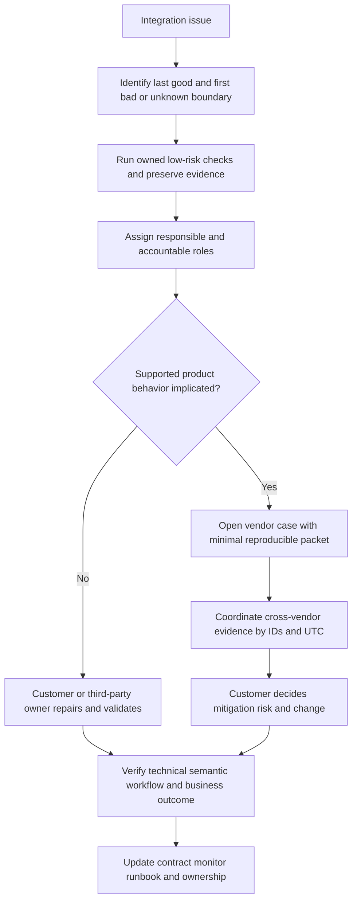

### Communication cadence

A useful technical update contains observed behavior, affected population, time, business/security impact, evidence, current hypothesis, alternatives, actions taken, risk, owner, next discriminating check, and next checkpoint. An executive update is shorter: what capability is impaired, what risk it creates, what compensating control exists, who owns recovery, and when the next decision occurs.

Avoid "all data is lost" unless reconciliation supports it. Say "Records from the defined source class have not become usable downstream since the last verified receipt; the eligible population and replayability are being reconciled." Avoid "fixed" until backlog, semantics, use case, and recurrence checks pass. Say "Transport recovered; historical reconciliation and controlled workflow validation remain open."

## Security, privacy, and resilience

SecOps integrations centralize sensitive identity, activity, device, network, threat, case, business, and control information. They can also execute high-impact actions. Security must cover the connector identity, secrets, transport, data stores, logs, support artifacts, action targets, and administrative change path.

| Control area | General practice | Threat reduced |
|---|---|---|
| Purpose/minimization | Transfer only data needed for approved use cases | Unnecessary sensitive replication |
| Least privilege | Separate read, write, approve, execute, and administer rights | Connector compromise blast radius |
| Tenant binding | Bind source, destination, identity, and action to exact tenant | Cross-tenant data/action error |
| Secret lifecycle | Vault, rotate, revoke, monitor, and avoid logs | Credential theft and stale access |
| Transport security | Authenticate endpoints and protect data in transit | Interception and impersonation |
| Data protection | Encrypt, classify, restrict, audit, retain, and delete | Unauthorized evidence exposure |
| Change control | Review schema, scope, mapping, and action changes | Silent breakage or privilege expansion |
| Action safeguards | Exact target, approval, limits, idempotency, read-back, rollback | Harmful or duplicate response |
| Support handling | Minimize/redact and use approved transfer | Leakage through troubleshooting |
| Resilience | Buffer, replay, reconcile, export, restore, and test degraded mode | Permanent gaps and brittle dependency |
| Supply chain | Review connector/software origin, update, and dependencies | Compromised integration component |
| AI boundary | Treat source content as untrusted data, not instructions | Prompt injection and tool misuse |

```mermaid
flowchart LR
    UNTRUST[Untrusted source content] --> VALID[Validate schema size type and tenant]
    VALID --> MIN[Minimize and classify]
    MIN --> STORE[Protected evidence store]
    STORE --> READ[Least-privileged analyst or agent retrieval]
    READ --> DECIDE[Human-governed decision]
    DECIDE --> APPROVE[Independent approval where required]
    APPROVE --> TOOL[Bounded action tool]
    TOOL --> TARGET[Exact target system]
    TARGET --> AUDIT[Immutable-enough audit and read-back]
    AUDIT --> REVIEW[Privacy security and outcome review]
```

### Resilience and degraded modes

Define what happens when a source, connector, SIEM, ticketing system, or action target is unavailable. Can the source buffer? How long? Is replay ordered? Which data can be reconstructed? Which critical alerts use an alternate path? Can analysts access native systems? Are actions manual and governed? How are duplicate tickets prevented after recovery? Which metrics remain trustworthy during gaps?

A degraded mode should reduce claims. If endpoint context is unavailable, a story should show that gap rather than retain old confidence. If ticketing is down, customer policy may require an alternate incident channel and later reconciliation. If an action connector is unavailable, the workflow may produce a reviewed manual action package. Degradation must never silently widen an agent's permissions or suppress human approval.

## Failure modes and misconceptions

| Misconception | Why it fails | Better reasoning |
|---|---|---|
| "Connected means healthy" | Reachability ignores scope, meaning, workflow, and outcome | Test source-to-decision acceptance |
| "No downstream record means transport loss" | Source, scope, search, retention, and transform may explain absence | Prove each boundary with stable IDs |
| "Counts match, so data matches" | Different records can produce equal totals | Reconcile identifiers and grain |
| "Parsing succeeded, so semantics are correct" | Meaning can drift without structural error | Run semantic and controlled use-case tests |
| "Current identity context explains historical events" | Ownership and privilege change over time | Join effective-time context |
| "Same IP means same device or person" | NAT, proxy, DHCP, and shared egress break identity | Use independent scoped evidence |
| "Ticket sent means somebody owns it" | Delivery is not assignment or acknowledgement | Track owner and acknowledgement objective |
| "API 200 means containment worked" | Request acceptance is not effective state | Read back target and path outcome |
| "Retry is harmless" | Actions and creates can duplicate or reverse effects | Use idempotency and reconcile unknown state |
| "Average latency proves freshness" | Long tails can hide critical delay | Use distributions and threshold compliance |
| "Vendor page proves integration" | Public positioning lacks tenant/license/config proof | Verify current supported customer reality |
| "More telemetry is always better" | Cost, privacy, noise, and complexity can exceed value | Collect by decision and retention purpose |
| "One vendor owns every boundary" | Multi-system workflows divide evidence and authority | Use RACI and last-good/first-bad evidence |
| "Restart first" | Restart can erase evidence and create replay/duplicate effects | Capture state and test a local hypothesis first |
| "AI can interpret any connector data safely" | Security content may contain false or malicious instructions | Separate data from instructions and bound tools |

## Decision trees

### Decision tree 1 - Is the issue loss, delay, or visibility?

1. Does the native source prove that the expected record was created? If no, investigate source generation or expectation.
2. Was the record eligible and selected under the current export contract? If no, classify intentional exclusion or scope defect.
3. Did the consumer receive or reject it? If no, investigate export, transport, acknowledgement, retry, or retention.
4. Did it become usable after the objective? If yes but late, classify latency/backfill. If accepted but unusable, inspect parsing, mapping, indexing, or retention.
5. Can a correct query find it but the detection/case cannot? Investigate use-case logic, windows, dependencies, and presentation.
6. Reconcile the affected population before claiming a global gap.

### Decision tree 2 - Can an automated action proceed?

1. Is the evidence sufficient for the customer-approved action threshold? If no, recommend a discriminating check or lower-impact safeguard.
2. Is the exact current target bound by native scoped identifiers? If no, stop.
3. Is the action supported, licensed, configured, and tested in this customer environment? If unknown, verify; do not infer from public positioning.
4. Does the requester have technical permission and customer authority? Both are required.
5. Are impact, alternatives, duration, rollback, and read-back defined? If no, stop or redesign.
6. If the request times out, reconcile native state before retry.
7. Validate security and business postconditions and record residual paths.

### Decision tree 3 - Who owns the next check?

1. Find the last boundary with positive native evidence.
2. Find the first boundary with negative or absent expected evidence.
3. Assign the component owner responsible for the cheapest discriminating check.
4. Keep the end-to-end service owner accountable for customer impact.
5. If evidence implicates supported vendor behavior, escalate with the minimal packet.
6. If boundaries remain ambiguous, run a joint trace using shared IDs and UTC rather than transferring the ticket blindly.

## Explicitly fictional and synthetic NMH scenarios

Everything in this section is an **explicitly fictional and synthetic NMH scenario assumption**. No item is a customer fact, Zscaler tenant fact, product field, UI, entitlement, production incident, action, metric, or result. No dates are used, so no scenario date can be confused with the 2026-08-24 official-source snapshot.

### Scenario 1 - The late-alert puzzle

The fictional and synthetic NMH team observes that a controlled source event is visible in its native system, but the related SIEM test alert appears much later than the study objective. The connector heartbeat remains green. The team avoids blaming transport. It captures native ID and event time, export attempt evidence, consumer receipt time, processing time, and rule evaluation time.

The evidence shows prompt receipt but delayed processing during a consumer backlog. That is a scenario assumption, not a product result. The owner drains the fictional backlog under change control, validates a positive and negative canary, reconciles the bounded interval, and updates oldest-message-age monitoring. The lesson is that heartbeat proved component life, not processing freshness.

**Practice questions:** Which timestamp localizes the delay? Which denominator bounds impact? What evidence is needed before saying data was not lost? Which team owns backlog, and which service owner remains accountable?

### Scenario 2 - The wrong-person ticket

The fictional and synthetic NMH workflow receives two records with a shared display name. A study-only normalization rule joins one alert to the wrong identity and creates a fictional ticket for the wrong manager. No production action occurs. The team preserves both source IDs, identifies the display-name join, separates the entities, reviews other affected records, and redesigns matching around scoped immutable IDs and effective lifecycle.

The team also adds a high-impact safeguard: unresolved or conflicting identities may enrich an investigation but cannot become an action target. The ticketing workflow carries a source-scoped case key and links to restricted evidence rather than copying all security content.

**Practice questions:** Which evidence proves the records are distinct? How far must correction propagate? Which metric detects wrong matches rather than merely unresolved ones? How should the customer communicate the privacy impact?

### Scenario 3 - The unknown action state

The fictional and synthetic NMH analyst approves a study-only reduced-access request against an invented test identity. The connector times out. The workflow does not retry. It records the state as unknown, queries the fictional target using a native operation reference, and discovers that the request was accepted but effective policy is still propagating. These are scenario assumptions only.

The team waits within its invented objective, validates the target state and a safe path test, then records business effect and expiry. It updates the runbook to distinguish requested, accepted, completed, effective, and recovered states. The lesson is not that any Zscaler or third-party product behaves this way; the lesson is the general action-state discipline.

**Practice questions:** Why is retry unsafe? What authority is required? What would partial completion look like? Which evidence belongs in an escalation packet?

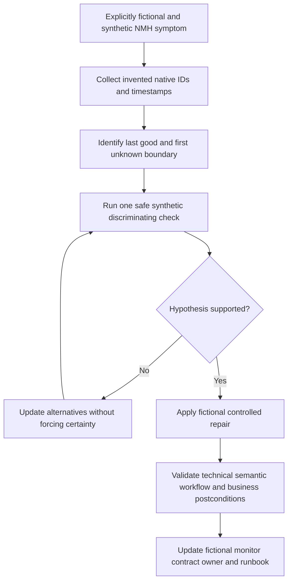

## Artifact kit

These artifacts are templates for study and customer discovery. They contain no invented Zscaler fields or UI steps.

### Artifact 1 - Integration inventory

| Item | Template content |
|---|---|
| Use case | Decision, detection, investigation, report, case, or action |
| Producer/consumer | Current systems and accountable owners |
| Scope | Tenant, population, event/entity classes, exclusions |
| Delivery | Push/pull/batch/stream, schedule, cursor, retry, replay |
| Identity/time | Native keys, lifecycle, event/receipt/effective time |
| Schema | Current supported version and semantic owner |
| Security/privacy | Identity, permissions, secrets, region, retention, access |
| Quality | Coverage, freshness, validity, uniqueness, resolution objectives |
| Workflow/action | System of record, authority, states, read-back, rollback |
| Support | Runbook, escalation route, evidence, continuity plan |

### Artifact 2 - Trace ledger

| Boundary | Expected evidence | Observed evidence | Status | Owner | Next check |
|---|---|---|---|---|---|
| Native source | Stable ID and source semantics | Record reference | Good/bad/unknown | Source owner | Verify creation/scope |
| Export | Selection and send/cursor evidence | Export reference | Good/bad/unknown | Integration owner | Check cursor/retry |
| Transport | Delivery and acknowledgement | Correlation evidence | Good/bad/unknown | Platform owner | Receiver lookup |
| Consumer | Receipt, parse, map, index | Processing evidence | Good/bad/unknown | Data owner | Schema test |
| Entity/use | Correct resolution and workflow | Case/query result | Good/bad/unknown | SOC/workflow owner | Controlled canary |
| Action | Native state and postcondition | Read-back evidence | Good/bad/unknown | Target owner | Reconcile state |

### Artifact 3 - Escalation packet outline

1. One-sentence business/security symptom and bounded impact.
2. Expected behavior under the current contract.
3. First and last known affected UTC times.
4. Native source ID and redacted source evidence.
5. Correlation, delivery, cursor, batch, ticket, or operation IDs.
6. Last proven good boundary and first bad or unknown boundary.
7. Representative redacted payload or metadata where approved.
8. Versions, scope, configuration/change context, and current support status.
9. Troubleshooting performed and results, separated from interpretation.
10. Strongest hypothesis, alternatives, requested discriminating check, and owner.
11. Current mitigation/degraded mode, residual risk, and next checkpoint.
12. Secure evidence-transfer and privacy handling requirements.

### Artifact 4 - Action safety card

| Question | Required answer before action |
|---|---|
| Evidence | What establishes risk and threshold? |
| Target | Which exact current native entity is affected? |
| Authority | Who requests, approves, executes, validates, and recovers? |
| Capability | Is the exact action supported and tested here? |
| Impact | Which business, safety, and evidence effects are possible? |
| Scope/duration | What is bounded, and when does it expire? |
| Alternate paths | What remains possible after the control? |
| Retry | What idempotency and unknown-state reconciliation exist? |
| Read-back | Which native and independent checks prove effect? |
| Rollback | How is restoration authorized, tested, and monitored? |

## Exercises

All exercises are vendor-neutral and non-production. Use invented records or authorized test evidence.

1. Draw a source-to-outcome path for one alert, including at least eight boundaries and one action read-back.
2. Write an integration contract for an identity event feeding a SIEM detection without naming invented vendor fields.
3. Build a population funnel from expected through outcome-producing records and define each denominator.
4. Create a latency ledger using event, receipt, processing, alert, ticket, request, and effective times.
5. Explain why a green heartbeat and successful authentication do not prove use-case health.
6. Design positive, negative, null, unknown-enum, duplicate, delayed, and out-of-order schema tests.
7. Compare webhook, polling, batch, queue, stream, and file delivery for one use case.
8. Diagnose a missing record using the loss decision tree and state the last proven good boundary.
9. Diagnose a high average freshness result that hides a severe long tail.
10. Create an entity-resolution matrix for users, devices, sessions, apps, and IP addresses.
11. Write a ticket synchronization map with origin, version, allowed states, acknowledgement, closure, and reopen.
12. Write an unknown-action-state update that prevents a blind retry.
13. Build a RACI covering source, connector, schema, entity, detection, ticket, action, and executive impact.
14. Produce a redacted escalation packet for a semantic drift problem.
15. Design a degraded mode for SIEM unavailability while preserving customer authority and later reconciliation.
16. Review a hypothetical connector for least privilege, tenant binding, secret lifecycle, privacy, audit, and replay.
17. State how untrusted source text could attack an AI-assisted workflow and design an instruction/data boundary.
18. Practice a two-minute interview answer that connects Arti's trace and escalation experience without claiming SOC operation.

## Customer discovery questions

1. Which analyst or business decisions depend on each integration?
2. Which systems and product editions are actually licensed, deployed, supported, and authoritative?
3. What exact populations, event/entity classes, observation points, and exclusions apply?
4. Which delivery pattern, cursor, ordering, retry, backfill, and retention behavior is documented?
5. Which native identifiers and effective-time sources resolve users, devices, sessions, apps, workloads, and tickets?
6. Which schema versions, semantic owners, release notices, and compatibility tests exist?
7. Which freshness, completeness, validity, uniqueness, resolution, and use-case objectives have denominators?
8. Which health signals cover source through verified outcome rather than connector heartbeat alone?
9. How are late, missing, duplicated, rejected, and backfilled records reconciled?
10. Which tickets/cases own investigation, work, approval, action, communication, closure, and reopen?
11. Which actions are recommend-only, human-approved, pre-authorized, prohibited, reversible, or externally owned?
12. How are unknown, partial, wrong-target, conflicting-policy, and rollback states handled?
13. Which data is sensitive, where may it flow, who can access it, and how is support evidence minimized?
14. Who owns each boundary, and what evidence triggers customer, third-party, or Zscaler escalation?
15. What continuity, replay, degraded-mode, export, and recovery tests have been completed?

## Official Source Anchors

Research/source snapshot and source review date: **2026-08-24**.

The Zscaler sources below support only dated public positioning. The NIST sources support general cybersecurity, zero-trust, incident-response, and log-management practices. They do not establish customer entitlement, connector implementation, interface, field, action, latency, service level, autonomy, or result. Current official technical/order documentation, customer contracts, licensed-tenant evidence, source-native records, and Support guidance govern production.

| Source | URL | Used for | Boundary |
|---|---|---|---|
| Zscaler Agentic Security Operations | https://www.zscaler.com/products-and-solutions/security-operations | Public first/third-party signal, SIEM/EDR/IAM/ticketing complementarity, context, workflow, and right-sized response positioning | No connector, field, UI, action semantics, entitlement, health metric, or outcome inferred |
| Zscaler Agentic SOC | https://www.zscaler.com/products-and-solutions/security-operations-core | Current named public solution context linked from official navigation | Scope, route, technical behavior, and licensing can change |
| Zscaler Data Fabric for Security | https://www.zscaler.com/products-and-solutions/data-fabric | Public ingest, harmonize/map, deduplicate, correlate/enrich, workflow, and reporting positioning | No hidden schema, connector behavior, or customer implementation inferred |
| Zscaler Zero Trust Exchange | https://www.zscaler.com/products-and-solutions/zero-trust-exchange-zte | Public identity/context/business-policy and inline zero-trust platform context | No specific integration action or policy semantics inferred |
| NIST Cybersecurity Framework 2.0 | https://www.nist.gov/cyberframework | Govern, Identify, Protect, Detect, Respond, and Recover outcome framing | Voluntary and implementation-neutral |
| NIST SP 800-61 Rev. 3 | https://csrc.nist.gov/pubs/sp/800/61/r3/final | Incident-response preparation, analysis, response, recovery, and improvement context | Customer tailors roles and procedures |
| NIST SP 800-207 | https://csrc.nist.gov/pubs/sp/800/207/final | General zero-trust policy and architecture concepts | Does not prescribe a vendor product |
| NIST SP 800-92 | https://csrc.nist.gov/pubs/sp/800/92/final | General log-management planning and operational context | Older general guidance; current customer requirements govern |

## Likely Interview Questions

### Q1. What does end-to-end integration health mean?

**Model answer:** It means the intended source population creates native records, eligible data exports securely, transport delivers it, the consumer accepts and preserves semantics, entities and time resolve correctly, the detection/case/report uses it, and any authorized action reaches a verified technical and business postcondition. I measure every transition with explicit denominators. A heartbeat or successful API call proves only one component state.

### Q2. How would you troubleshoot a missing SIEM event?

**Model answer:** I start with one stable source-native ID and prove the expected event was created, eligible, and within retention. Then I trace export selection, cursor or batch, send evidence, receiver acknowledgement or rejection, parse/schema, index/search scope, time interpretation, entity mapping, and downstream rule behavior. I reconcile a bounded population before claiming loss and route the next check to the first bad or unknown boundary owner.

### Q3. How do you diagnose latency accurately?

**Model answer:** I define the exact start and end and separate source generation, export wait, transport, ingestion, processing, analytics, ticketing, and action propagation. I preserve event, receipt, processing, and effective timestamps, verify clock trust, inspect distributions and oldest age rather than average alone, segment the affected class, and compare arrival with service rate. If a segment lacks evidence, I state a bound instead of inventing precision.

### Q4. Why are schema and entity problems dangerous even when the connector is green?

**Model answer:** Structural or semantic drift can make accepted records unusable or misleading, while wrong entity resolution can attach evidence or action to the wrong person, device, app, or case. I version schemas, run semantic and boundary tests, preserve native evidence, use scoped lifecycle-aware identifiers, measure sampled resolution accuracy, keep uncertainty visible, and revalidate any high-impact action target in the target system.

### Q5. What should happen when a third-party action times out?

**Model answer:** Timeout is unknown state. I preserve the idempotency and native operation references, query the target and current state, avoid blind retry, determine whether the request was unreceived, accepted, partial, complete, or effective, and involve the target owner. Then I validate the security path and business effect, decide rollback or further action under customer authority, and record residual risk.

### Q6. What belongs in a strong multi-vendor escalation?

**Model answer:** A bounded symptom and impact, expected contract, source-native and correlation IDs, UTC event/receipt/processing times, redacted payload or metadata, relevant versions and changes, expected-versus-observed population, last proven good and first bad or unknown boundary, troubleshooting results, current hypotheses and alternatives, requested discriminating check, owner, mitigation, residual, and next checkpoint. I minimize sensitive data and do not predeclare a vendor defect.

### Q7. How does Zscaler fit with SIEM, EDR, IAM, and ticketing integrations?

**Model answer:** Zscaler's public Agentic SecOps material reviewed on August 24, 2026 positions available Zscaler first-party telemetry and controls alongside third-party signals and emphasizes interoperability with existing SIEM, EDR, IAM, and ticketing tools. That is portfolio positioning, not proof of a connector or entitlement. I would verify current products, supported methods, schema, scope, authority, actions, and measured source-to-outcome behavior for the customer.

### Q8. How does Arti's background transfer honestly?

**Model answer:** Her Microsoft escalation work required tracing identity, permission, endpoint, network, proxy, browser, sync, and service boundaries using IDs and timestamps, coordinating owners, preserving evidence, and validating recovery. SQL and Power BI support quality funnels and latency analysis; mentoring supports runbook adoption. She has studied SecOps integrations with synthetic exercises, while production Zscaler, SIEM, EDR, IAM, ticketing, SOC, and security-action operation remain explicit ramp areas.

## 30-Second Memory Hooks

| Concept | Memory hook |
|---|---|
| Integration | A route with a contract, not a logo |
| Health | Source through verified outcome |
| Heartbeat | Alive does not mean useful |
| Denominator | Expected, eligible, sent, received, usable, effective |
| Latency | Name the start, end, class, and distribution |
| Loss | Prove source, scope, delivery, receipt, and usability |
| Duplicate | Delivery attempt is not logical event |
| Time | Event, receipt, processing, effective, action |
| Schema | Structure plus meaning plus version |
| Entity | Scoped identity plus lifecycle plus time |
| Ticket | Sent is not acknowledged or owned |
| Action | Proposed, approved, requested, accepted, effective |
| Timeout | Unknown until reconciled |
| Read-back | Check the target and the path |
| Observability | Signal tied to failure mode and owner |
| Escalation | Last good, first bad, stable IDs, UTC |
| Security | Least privilege, tenant binding, minimization, audit |
| Zscaler | Attribute public positioning; verify customer reality |
| Arti bridge | Trace and escalation rigor transfer; SOC claims do not |

## Completion Checklist

- [ ] I separate official product fact, general security practice, fictional scenario assumption, customer fact, and unknown.
- [ ] I retain the official-source review date exactly as 2026-08-24.
- [ ] I define producer, consumer, connector, API, webhook, polling, stream, batch, queue, cursor, schema, grain, provenance, and system of record.
- [ ] I map SIEM, EDR, IAM, ITSM, Zscaler, cloud, asset, intelligence, and other third-party roles without assuming capabilities.
- [ ] I define purpose, population, grain, identity, time, schema, delivery, quality, security, privacy, ownership, change, evidence, continuity, and action contracts.
- [ ] I trace source creation through export, transport, receipt, parse, mapping, entity, use case, action, read-back, and feedback.
- [ ] I distinguish push, pull, batch, queue, stream, and file tradeoffs.
- [ ] I measure coverage, completeness, freshness, validity, uniqueness, resolution, workflow, and action health with denominators.
- [ ] I use event, creation, receipt, processing, effective, update, display, request, and completion times correctly.
- [ ] I diagnose latency by segment, clock trust, distribution, oldest age, and arrival/service rate.
- [ ] I diagnose missing data by source creation, eligibility, export, delivery, receipt/reject, usability, and use-case behavior.
- [ ] I distinguish delivery duplicate, logical duplicate, update, backfill, and distinct evidence.
- [ ] I detect structural and semantic schema drift with versioned contract tests.
- [ ] I resolve users, devices, sessions, IPs, apps, workloads, and cases with scoped lifecycle-aware evidence.
- [ ] I measure entity correctness rather than match rate alone.
- [ ] I design ticket creation, acknowledgement, state mapping, loop prevention, closure, and reopen behavior.
- [ ] I separate proposed, approved, requested, accepted, completed, effective, business-validated, recovered, and unknown action states.
- [ ] I never blind-retry a consequential unknown-state action.
- [ ] I collect minimal redacted source IDs, correlation IDs, UTC, payload metadata, errors, versions, and reproduction evidence.
- [ ] I assign source, connector, schema, entity, use-case, ticket, action, vendor, and executive ownership.
- [ ] I communicate observation, impact, hypothesis, alternatives, owner, next check, checkpoint, and residual without unsupported assurance.
- [ ] I protect integrations with minimization, least privilege, tenant binding, secrets, encryption, audit, retention, change control, and resilience.
- [ ] I treat source content as untrusted data and prevent prompt injection into AI-assisted workflows.
- [ ] I can identify every NMH element as explicitly fictional and synthetic.
- [ ] I can complete all eighteen exercises without production access or action.
- [ ] I make no unsupported production Zscaler, SIEM, EDR, IAM, ITSM, SOC, connector, action, or customer-result claim.
- [ ] I can answer all eight interview questions with neutral evidence-bounded language.

[Part 98 - AI Agents for Security: Prompting, Grounding, Validation, and Governance](Part-98-ai-agents-security-governance.md)