# Part 99 - SecOps Metrics, Quality, Cost, and Continuous Improvement

> **Audience:** Arti Thakur, preparing for a Zscaler Security Operations Technical Success Manager role after Microsoft enterprise Support Escalation Engineering.

> **Purpose:** Explain SecOps metrics from zero, including MTTD, MTTA, MTTR, dwell time, false positives, precision and recall concepts, coverage, containment, recurrence, analyst effort, SIEM cost, denominator integrity, Goodhart's law, improvement loops, and evidence-based executive narratives.

> **Scope and honesty:** Northstar Meridian Holdings, abbreviated NMH, is an explicitly fictional and synthetic customer used only for study. Every NMH event, alert, case, identity, incident, timestamp, metric, cost, target, decision, action, date, trend, and result is invented. Arti's factual background is Microsoft 365, OneDrive, and SharePoint support; networking and trace analysis; SQL and Power BI; enterprise escalations; mentoring; and responsible AI exploration. Production Zscaler, Agentic SecOps, SIEM, SOC, detection engineering, incident-response, containment, security-metric ownership, and customer outcomes remain learning boundaries.

> **Currency caveat:** Product capabilities, telemetry, schemas, fields, reports, AI agents, actions, pricing, packaging, limits, entitlements, and public claims change. The controlled official-source snapshot and source review date for this Part is exactly **2026-08-24**. Current official technical and ordering documentation, licensed-tenant evidence, customer metric definitions, source-native records, contracts, finance methods, customer policy, product specialists, vendor Support, and tested analytical models govern production decisions.

> **Section goal:** Build a beginner-to-interview-ready measurement system: start from customer decisions and outcomes, define grains and timestamp contracts, protect denominators, distinguish speed from quality, measure detection and coverage honestly, connect containment and recurrence to validated effects, quantify analyst effort and SIEM cost without hiding risk, run closed improvement loops, and communicate an executive narrative without inventing product or production results.

This Part is primarily **general security and analytical practice**. The reviewed Zscaler public pages support bounded positioning around first-party and third-party context, risk prioritization, agentic triage/investigation, right-sized response, and feedback between reactive and proactive security work. They do not establish a customer metric, benchmark, reduction percentage, response time, cost saving, UI, field, entitlement, detection rate, or outcome.

Every statement belongs to one of five evidence classes. **Official product fact** is a dated public statement supported by an anchor reviewed on 2026-08-24. **General security practice** is a vendor-neutral metric or improvement method. **Scenario assumption** exists only inside explicitly fictional and synthetic NMH. **Customer fact** requires current customer-authoritative evidence. **Unknown** means the available evidence does not establish an answer. A metric never upgrades an assumption into a fact.

```mermaid
flowchart LR
    RISK[Customer risks and business services] --> DEC[Security decisions and control objectives]
    DEC --> WORK[Detect triage investigate respond recover improve]
    WORK --> DATA[Events cases actions outcomes effort and cost]
    DATA --> QUALITY[Grain time provenance coverage and quality checks]
    QUALITY --> METRIC[Versioned metrics with denominators]
    METRIC --> REVIEW[Operational and executive review]
    REVIEW --> CHANGE[Owned prioritized improvement]
    CHANGE --> VALIDATE[Validate security business and cost effects]
    VALIDATE --> RISK
```

| Operating principle | Plain meaning | Practical consequence | Failure prevented |
|---|---|---|---|
| Start with a decision | A metric should change an owned action | Name audience, decision, owner, threshold, and next step | Decorative dashboard |
| Define the grain | Know what one row and one count represent | Separate event, alert, story, case, incident, action, and entity | Invalid averages and joins |
| Define every clock | Speed requires exact start, stop, pause, and eligibility | Publish timestamp and missing-data rules | MTTD/MTTR theater |
| Protect denominators | Rates need the full eligible population | Show exclusions, unknowns, coverage, and version | Selective success claims |
| Pair speed with quality | Faster can mean rushed or automated closure | Add correctness, safety, recurrence, and impact | Unsafe optimization |
| Measure outcomes in layers | Request, completion, effect, and business recovery differ | Validate technical and business postconditions | Action count treated as protection |
| Segment before averaging | Risk and workload populations differ | Review by severity, source, service, coverage, and cohort | One number hides tail risk |
| Expect gaming | People and systems adapt to targets | Use balanced measures, samples, and qualitative evidence | Goodhart failure |
| Close the loop | Insight needs owner, change, test, result, and residual | Track accepted improvements to validated outcome | Lessons-learned theater |
| Attribute product claims | Public positioning is not customer result | Verify current tenant and analytical evidence | Invented Zscaler value |

## JD Mapping

| JD signal | Capability developed | Customer or TSM artifact | Honest boundary |
|---|---|---|---|
| Develop SecOps expertise | Explain operational, detection, response, quality, coverage, and cost measures | SecOps metric catalog | No production SOC-metric ownership claim |
| Trusted technical advisor | Convert business risk into measurable security decisions | Outcome tree and scorecard | Customer owns targets and risk appetite |
| Drive adoption and value | Measure prerequisite, use, behavior, quality, outcome, and cost | Adoption/value evidence plan | No guaranteed ROI or reduction |
| Troubleshoot complex systems | Detect metric defects in source, time, grain, joins, coverage, and logic | Metric lineage/runbook | No unsupported product root cause |
| Use analytics | Model cohorts, distributions, rates, uncertainty, trends, and costs | SQL and Power BI-style semantic model | No product-internal schema claim |
| Coordinate stakeholders | Align SOC, IR, detection, platform, finance, privacy, service, and executives | Metric RACI and review cadence | TSM facilitates rather than sets customer policy |
| Communicate proactively | Explain signal, driver, impact, confidence, action, owner, and residual | Executive narrative | No unsupported causal claim |
| Partner with Support/Product | Provide reproducible metric logic and source evidence | Minimal analytical escalation packet | No defect, fix, or roadmap promise |
| Responsible AI | Evaluate agent assistance with quality, safety, effort, and outcome measures | AI workflow scorecard | No autonomous-agent success claim |

## Candidate honesty note

Arti can say: "My production background is Microsoft Support Escalation Engineering rather than owning a SOC metrics program. I have used SQL and Power BI to reason about grains, joins, data quality, trends, and customer impact; coordinated critical incidents using timestamps and checkpoints; and validated technical recovery. I have studied SecOps measurement and practiced with fictional data. In a customer environment I would verify source semantics, event/case definitions, clocks, populations, exclusions, costs, and customer targets before interpreting results."

Neutral wording protects credibility. Say "the observed cohort changed," "the current evidence suggests," "this metric excludes," "a plausible driver is," and "I would validate." Avoid "I reduced MTTD," "I cut SIEM cost," "I improved detection coverage," or "Zscaler delivered this outcome" without current scoped customer evidence and a defensible attribution method.

| Factual background | Transferable strength | Neutral wording | Unsupported statement to avoid |
|---|---|---|---|
| SQL and Power BI | Grain, relationships, data quality, calculations, cohorts, and trends | "I build transparent operational analytics." | "I owned a production SIEM metric model." |
| Enterprise support | Impact, incident chronology, mitigation, recovery, and RCA | "I measure service workflows and validated outcomes." | "I reduced cyber dwell time." |
| Network and trace analysis | Event/receipt timing, path evidence, and latency distributions | "I distinguish source and processing clocks." | "I measured production threat detection latency." |
| Critical escalations | Owners, checkpoints, communications, and recurrence prevention | "I connect evidence to an owned improvement." | "I commanded security containment." |
| Mentoring | Teach definitions, review quality, and drive consistent use | "I can improve metric literacy." | "I managed SOC performance." |
| Responsible AI exploration | Evaluate quality, safety, human review, and cost | "I can design balanced AI-workflow measures." | "I proved an autonomous agent's ROI." |
| Fictional synthetic NMH exercises | Demonstrate metric design | "This is a study artifact, not a result." | "This is customer evidence." |

## Beginner vocabulary and memory hooks

A **metric** is a defined measurement used to understand or decide something. A count becomes useful only when its object, population, time, source, and interpretation are known. "We had 500 alerts" does not say whether alerting was good, whether all sources were healthy, whether duplicates were included, whether threats were missed, or what analysts accomplished.

Think of a hospital. It can count patients, waiting time, diagnosis accuracy, treatment time, readmission, staff effort, and cost. Optimizing only waiting time might encourage rushed discharge. Security measurement has the same challenge. Speed, quality, coverage, safety, recurrence, workload, and cost must be viewed together.

| Term | Meaning from zero | Why it matters | Analogy or memory hook |
|---|---|---|---|
| Measure | Observed quantity under a definition | Raw ingredient for analysis | Reading on an instrument |
| Metric | Measure interpreted for a purpose | Supports a decision | Instrument reading with meaning |
| KPI | Key Performance Indicator | Selected metric tied to a priority | Dashboard instrument chosen for a mission |
| KRI | Key Risk Indicator | Metric signaling changing risk | Early warning gauge |
| Grain | What one row or fact represents | Prevents invalid counting | One visit versus one patient |
| Population | Full set relevant to a question | Defines who/what is measured | All eligible patients |
| Cohort | Subset sharing defined characteristics | Enables fair comparison | Patients with same procedure |
| Denominator | Eligible total below a rate fraction | Makes rates honest | All chances for success |
| Numerator | Items meeting the measured condition | Counts successes/failures in denominator | Successful treatments |
| Exclusion | Item intentionally outside metric definition | Can be valid or manipulative | Ineligible case with reason |
| Unknown | Eligible item lacking enough evidence | Must remain visible | Chart not found |
| Baseline | Reference behavior under stated period and scope | Supports comparison | Starting fitness measurement |
| Target | Desired level approved by owner | Guides action but can be gamed | Training goal |
| Trend | Change over ordered periods | Shows direction, not automatic cause | Temperature over days |
| Distribution | Full spread of values | Reveals tails hidden by averages | All waiting times |
| Mean | Arithmetic average | Common but sensitive to extremes | Total divided by count |
| Median | Middle ordered value | Represents typical center robustly | Middle waiting time |
| Percentile | Threshold below which a percentage falls | Exposes long-tail performance | 95th wait threshold |
| MTTD | Mean Time To Detect under a precise contract | Measures one detection interval | Time from eligible start to defined detection |
| MTTA | Mean Time To Acknowledge or Assess, definition must be stated | Measures ownership/initial decision | Time until a qualified person takes responsibility |
| MTTR | Mean Time To Respond, Remediate, Recover, or Resolve, definition must be stated | Ambiguous without stop event | Never say MTTR alone |
| Dwell time | Time harmful presence/activity remains before defined removal or end | Outcome-oriented but hard to observe | Time a leak remains active |
| False positive | A positive system output that is negative under defined reviewed truth | Consumes effort and trust | Alarm without the target condition |
| True positive | A positive output confirmed under defined truth | Supports detection value | Alarm with target condition |
| False negative | Target condition exists but system output is negative or absent | Represents missed detection | Fire with no alarm |
| True negative | Negative output when target condition is absent | Needed for full evaluation | Quiet room with no fire |
| Precision | Of predicted positives, fraction that are true positives | Measures alert purity | How many alarms were real |
| Recall | Of all actual positives, fraction detected | Measures sensitivity | How many real fires alarmed |
| Coverage | Eligible scope actually observed/tested by a control or process | Bounds claims | Cameras covering intended rooms |
| Containment | Bounded action interrupting a harmful path | Changes risk while investigation continues | Close a valve around a leak |
| Recurrence | Similar condition returns under a defined relationship and period | Tests durability of improvement | Same leak returns |
| Analyst effort | Human time and cognitive/workflow burden | Connects automation to capacity and quality | Staff minutes per case |
| TCO | Total Cost of Ownership | Includes more than license/storage | Full cost to operate service |
| Unit cost | Cost per defined unit or useful outcome | Enables comparison | Cost per tested case |
| Goodhart's law | When a measure becomes a target, it can stop being a good measure | Warns about gaming and distortion | Teaching only to the test |
| Leading indicator | Measure that may signal future outcome | Supports early intervention | Rising pressure before failure |
| Lagging indicator | Measure observed after outcome | Confirms what happened | Repair completed after failure |
| Attribution | Reasoned assignment of change to causes | Prevents unsupported value claim | Which treatment caused recovery? |
| Confidence interval | Range expressing sampling uncertainty under a method | Prevents false precision | Margin around survey result |

### Plain-English deep-dive 1 - A metric is a contract, not a label

Suppose three teams report MTTR. Team A stops the clock when a ticket receives a workaround. Team B stops when a threat path is contained. Team C stops when service is restored and monitoring passes. Their numbers cannot be compared even if all are called MTTR.

A metric contract names purpose, audience, decision, grain, eligible population, numerator, denominator, source, start event, stop event, pauses, exclusions, unknowns, aggregation, segments, target, owner, version, limitations, and action. Without that contract, a polished dashboard can produce arguments rather than understanding.

Definitions may legitimately differ. An operational team may need time-to-first-qualified-assessment, while executives need time-to-business-recovery. Publish both with distinct names. Never shorten them into one ambiguous acronym merely to fit a tile.

## Measurement architecture and semantic model

SecOps data has several grains. Events describe observations. Alerts describe detection outputs. Stories group evidence. Cases describe work. Incidents represent customer-declared situations. Actions describe requested changes. Entities describe continuing users, devices, apps, workloads, and services. Costs describe resource consumption. Joining these carelessly multiplies rows.

| Fact/object | Grain | Core identifiers/time | Metric use | Join risk |
|---|---|---|---|---|
| Event | One source observation/version | Source ID, event/receipt time | Source coverage, latency | Duplicate/update and many alerts |
| Alert | One logical detection output/version | Alert ID, create/update time | Volume, precision, triage | One alert linked to many events/cases |
| Story | One correlated grouping/version | Story ID, merge/split time | Consolidation and narrative quality | Changing membership |
| Case | One work container/version | Case ID, open/ack/close/reopen times | Effort, queue, SLA | Multiple cases per incident |
| Incident | One customer-declared incident | Incident ID, declare/contain/recover times | Response and outcome | Declaration policy differences |
| Action | One requested operation/target | Action/operation ID, state times | Containment quality | Retries and multi-target requests |
| Entity state | One entity attribute over effective interval | Scoped entity ID, effective from/to | Coverage, criticality, ownership | Current state applied historically |
| Analyst activity | One bounded work interval/task | User/task/case ID, start/end | Effort and handoff | Idle time and parallel work |
| Cost | One charge/allocation by service and period | Cost center, usage, period | TCO and unit cost | Shared allocation and currency |

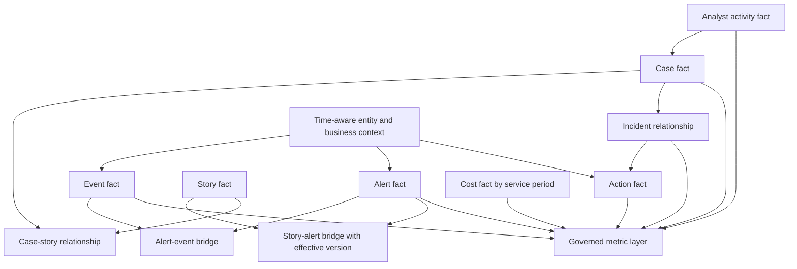

### Metric catalog

| Contract element | Example question | Why it matters |
|---|---|---|
| Name | Is this mean time to containment or recovery? | Removes acronym ambiguity |
| Purpose | Which decision should change? | Prevents vanity metrics |
| Audience | Analyst, manager, platform owner, executive, regulator? | Controls detail and interpretation |
| Grain | One alert, case, incident, entity, or action? | Prevents row multiplication |
| Population | Which eligible objects and period? | Defines denominator |
| Start/stop | Which native events begin and end time? | Makes duration reproducible |
| Pauses | Are customer wait, maintenance, or unavailable source periods paused? | Prevents hidden clock manipulation |
| Exclusions | What is omitted and why? | Exposes scope |
| Unknowns | How are missing starts/stops represented? | Prevents survival bias |
| Aggregation | Mean, median, percentiles, rate, distribution? | Controls interpretation |
| Segments | Severity, source, service, region, control, cohort? | Reveals uneven behavior |
| Source/lineage | Which systems and transformations? | Supports audit and troubleshooting |
| Target/owner | Who acts when threshold changes? | Connects metric to operation |
| Version | When did definition or source change? | Preserves comparability |
| Limitation | What cannot be concluded? | Prevents overclaim |

## Incident and workflow time metrics

Time metrics need a sequence of observable events. The true start of malicious activity may be unknown. Detection time may mean source alert creation, first platform receipt, first qualified correlation, or human confirmation. Response may mean first safeguard, full containment, remediation, business recovery, or administrative closure.

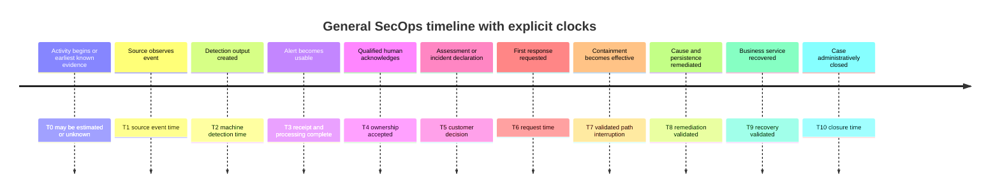

Mermaid timelines are conceptual here. They do not describe a Zscaler or third-party field. A customer model must map each milestone to actual source-native evidence.

### MTTD

MTTD usually means Mean Time To Detect, but the interval varies. Possible starts include earliest confirmed malicious activity, earliest observable event in covered telemetry, or exposure onset. Possible stops include source detection, alert availability, story creation, or human confirmation. If the true malicious start is discovered only during later investigation, the metric can change retrospectively.

| MTTD variant | Start | Stop | Use | Limitation |
|---|---|---|---|---|
| Observable-to-alert | Earliest eligible observable event | Detection alert creation | Detection pipeline responsiveness | Ignores pre-observable attacker time |
| Event-to-usable | Source event | Alert available to workflow | End-to-end data/detection latency | Mixes source, pipeline, and rule delay |
| Intrusion-to-detection | Earliest supported harmful presence | Defined detection milestone | Dwell-related outcome | Start often estimated and biased to known cases |
| Exposure-to-finding | Exposure effective time | Exposure finding available | Proactive detection responsiveness | Exposure onset may be uncertain |

Do not average missing starts away. Cases with discoverable early history may be more severe or better instrumented. Report known, estimated, and unknown start populations separately. Use median and tail percentiles beside mean because a few very long cases can dominate the mean.

### MTTA

MTTA can mean Mean Time To Acknowledge or Mean Time To Assess. These are different. Acknowledge means a qualified owner accepts responsibility. Assess means an initial evidence-based decision occurs. Automated assignment is not human acknowledgement unless the metric explicitly measures routing.

| Metric | Start | Stop | Quality companion |
|---|---|---|---|
| Time to route | Usable alert | Assigned queue/person | Correct destination rate |
| Time to acknowledge | Assigned/usable alert per policy | Qualified owner acknowledgement | Reassignment and abandon rate |
| Time to first assessment | Usable alert | Evidence-based triage disposition/next step | Assessment correctness and reopen |
| Time to escalation | Threshold met | Receiving owner acknowledges | Correct escalation and handoff quality |

Faster acknowledgement can be gamed by clicking without meaningful ownership. Pair speed with queue age, reassignment, sampled assessment quality, missed escalation, and analyst workload.

### MTTR

MTTR is dangerously ambiguous. Spell it out every time.

| Full name | Start | Stop | Decision supported |
|---|---|---|---|
| Mean Time To Respond | Defined detection/acknowledgement | First qualified response begins | Mobilization speed |
| Mean Time To Contain | Defined detection/declaration | Validated containment effective | Threat-path interruption |
| Mean Time To Remediate | Defined incident milestone | Cause/persistence/control gap remediated | Technical correction |
| Mean Time To Recover | Defined impact/containment milestone | Security and business recovery gates pass | Operational restoration |
| Mean Time To Resolve | Case open | Customer-defined resolution state | Work completion, often administrative |

Administrative closure is not recovery. A case may remain open for documentation after risk is controlled, or close while follow-up improvement remains. Report the lifecycle milestones instead of forcing one number to represent all of them.

### Dwell time

Dwell time is the duration an adversary or harmful activity remains before detection, containment, eviction, or end, depending on definition. True start and end are rarely observed perfectly. It is often known only for investigated confirmed incidents, producing selection bias. State whether the end is first containment, last observed malicious activity, eradication, or validated removal.

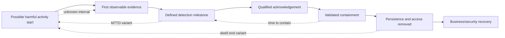

### Plain-English deep-dive 2 - Faster is not automatically better

Imagine a call center that targets the shortest call duration. Agents can improve the number by ending difficult calls quickly, transferring them, or marking them resolved. Customers call back, and total effort increases. The metric improved while service worsened.

A SOC can close alerts quickly by classifying ambiguous items as benign, using broad suppression, merging cases, or stopping the clock at assignment. Pair time with decision accuracy, reopen, recurrence, coverage, containment effectiveness, business impact, and sampled evidence quality. For critical cases, a slower but correct target validation may prevent harmful containment.

Use speed metrics to locate delay, not to shame individuals. Queue design, missing context, tool latency, unclear authority, and noisy detections often drive time more than analyst effort. Improvement should address the system.

## Detection quality: false positives, precision, and recall

Detection quality requires a defined target condition and reviewed truth. An alert can be technically correct that a rule matched yet false for the intended security condition. "False positive" should name the level: source event, analytic condition, threat classification, incident declaration, or business policy.

| Reviewed truth / Detection output | Positive output | Negative output |
|---|---|---|
| Target condition present | True positive (TP) | False negative (FN) |
| Target condition absent | False positive (FP) | True negative (TN) |

The basic concepts are:

- `precision = TP / (TP + FP)`: among positive outputs, how many were truly positive under the definition?
- `recall = TP / (TP + FN)`: among all actual positives, how many did the system detect?
- `false positive rate = FP / (FP + TN)`: among actual negatives, how many were incorrectly positive?
- `specificity = TN / (TN + FP)`: among actual negatives, how many were correctly negative?

These formulas are simple; obtaining TP, FP, FN, and TN is not. In live security data, undetected malicious activity is usually unknown. Labels may emerge later. Analysts may disagree. A dismissed alert can be a missed true positive. Use controlled simulations, historical adjudication, red-team/purple-team exercises, sampled negatives, threat hunting, and incident retrospectives, while labeling limitations.

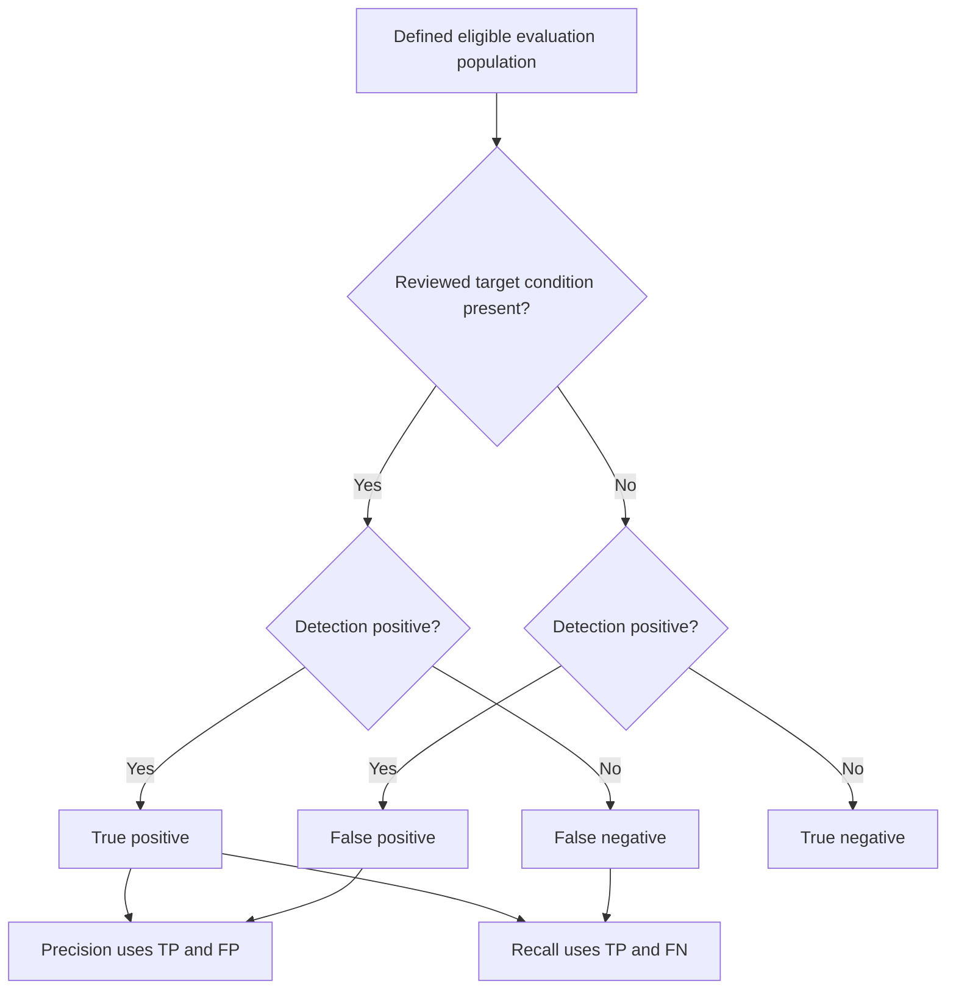

### Precision-recall tradeoff

Lowering a threshold can find more positives but create more false positives. Raising it can improve alert purity while missing subtler activity. The right balance depends on consequence, response cost, analyst capacity, available context, and layered controls. A high-severity low-frequency behavior may justify lower precision if triage is safe and fast. A disruptive automated action requires stronger confidence and target validation.

| Decision context | Precision concern | Recall concern | Balanced design |
|---|---|---|---|
| Analyst-only lead | Effort and trust | Missing novel behavior | Enrichment and prioritization |
| High-volume rule | Queue overload | Broad blind spot | Segmentation, suppression with audit, tuning |
| High-impact containment | Wrong target and disruption | Delayed threat interruption | Strong evidence, human authority, staged action |
| Hunt query | Investigation cost | Missing weak signal | Iterative hypothesis and bounded scope |
| Executive coverage | False assurance | Hidden undetected risk | Tested controls plus unknowns |

### Alert quality beyond false positives

Quality also includes evidence completeness, entity correctness, timeline integrity, uniqueness, priority usefulness, actionability, explanation, source health, and downstream outcome. An alert can be a true positive but arrive too late, target the wrong user, lack evidence, duplicate another alert, or suggest an unsafe action.

| Quality dimension | Question | Example measure concept |
|---|---|---|
| Validity | Did logic match intended source behavior? | Sampled rule correctness |
| Fidelity | How strongly does output support the intended claim? | Reviewed claim classification |
| Timeliness | Was evidence usable before decision deadline? | Threshold compliance distribution |
| Entity accuracy | Is exact user/device/app/workload correct? | Sampled match precision/conflict |
| Uniqueness | Are retries/duplicates controlled? | Logical duplicate rate |
| Context | Are key source, time, privilege, business, and control facts present? | Required-context coverage |
| Explainability | Can analyst reproduce why it fired? | Reproduction success |
| Actionability | Is there a safe next check or decision? | Useful-next-step rate |
| Outcome | Did it contribute to correct risk reduction? | Cases/actions/improvements with validation |

## Coverage measurement

Coverage asks how much of an eligible scope is observed, tested, or controlled. It must name the dimension. Source onboarding coverage, telemetry coverage, detection coverage, behavior coverage, entity coverage, response coverage, and temporal coverage are not interchangeable.

| Coverage type | Numerator | Denominator | Limitation |
|---|---|---|---|
| Source coverage | Healthy onboarded required sources | Required sources by use case | One source may have partial population |
| Entity coverage | Eligible entities with required healthy evidence | All eligible entities | Inventory itself may be incomplete |
| Event coverage | Usable expected event classes | Required classes/populations | Presence does not prove semantic quality |
| Detection coverage | Tested behavior/control cases with passing detection | Defined required behavior/control cases | ATT&CK mapping alone is not test proof |
| Temporal coverage | Time within freshness/availability objective | Eligible monitored time | Maintenance and late data need policy |
| Response coverage | Scenarios with tested authorized action/recovery path | Required response scenarios | Tool existence does not prove effect |
| Analyst coverage | Cases receiving qualified review | Eligible cases requiring review | Automated closure can hide exclusions |
| Business-service coverage | Critical services with mapped sources/detections/actions | In-scope critical services | Criticality and dependencies can be stale |

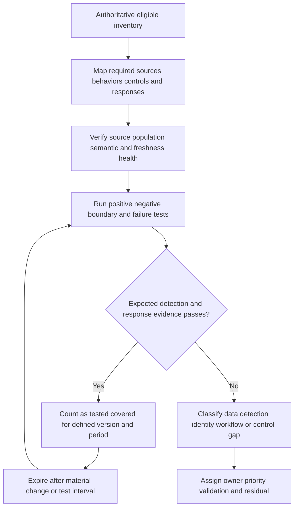

### ATT&CK and technique coverage

MITRE ATT&CK provides a common knowledge base of adversary tactics and techniques. Mapping a rule to a technique is useful organization, not proof that every procedure is visible or detected. One technique can have many implementations and data needs. Coverage should include scoped behavior, required telemetry, analytic version, test procedure, expected output, last result, blind spots, and response path.

Do not report "80 percent ATT&CK coverage" without defining eligible technique/procedure set, platform, environment, data, test method, weighting, and validity period. A smaller set of validated high-risk scenarios can be more meaningful than broad untested mapping.

### Coverage denominator integrity

The denominator often depends on inventory. Unknown unmanaged devices, cloud accounts, workloads, apps, or users make coverage appear higher. Report known eligible, observed, excluded, and unknown inventory. Reconcile authoritative sources and effective time. When inventory changes, distinguish real control improvement from denominator movement.

## Containment quality and response outcomes

Containment is a bounded action intended to interrupt a harmful path. Metrics should distinguish request speed, technical completion, effective path interruption, business effect, alternate paths, duration, rollback, recovery, and recurrence.

| Containment metric | Definition question | Quality companion |
|---|---|---|
| Time to recommend | From which milestone to cited recommendation? | Recommendation correctness |
| Time to approve | From complete approval package to decision? | Evidence completeness and authority |
| Time to request | From approval to target request? | Exact-target correctness |
| Time to technical completion | Request to native terminal state? | Partial/unknown/duplicate rate |
| Time to effective containment | Detection/declaration to validated path interruption? | Alternate-path and residual assessment |
| Scope accuracy | Were intended entities/routes affected, no more/no less? | Wrong-target and overcontainment rate |
| Business impact | What service/access disruption occurred? | Severity, duration, safety, rollback |
| Recovery quality | Did staged restoration pass security/business gates? | Reopen and recurrence |

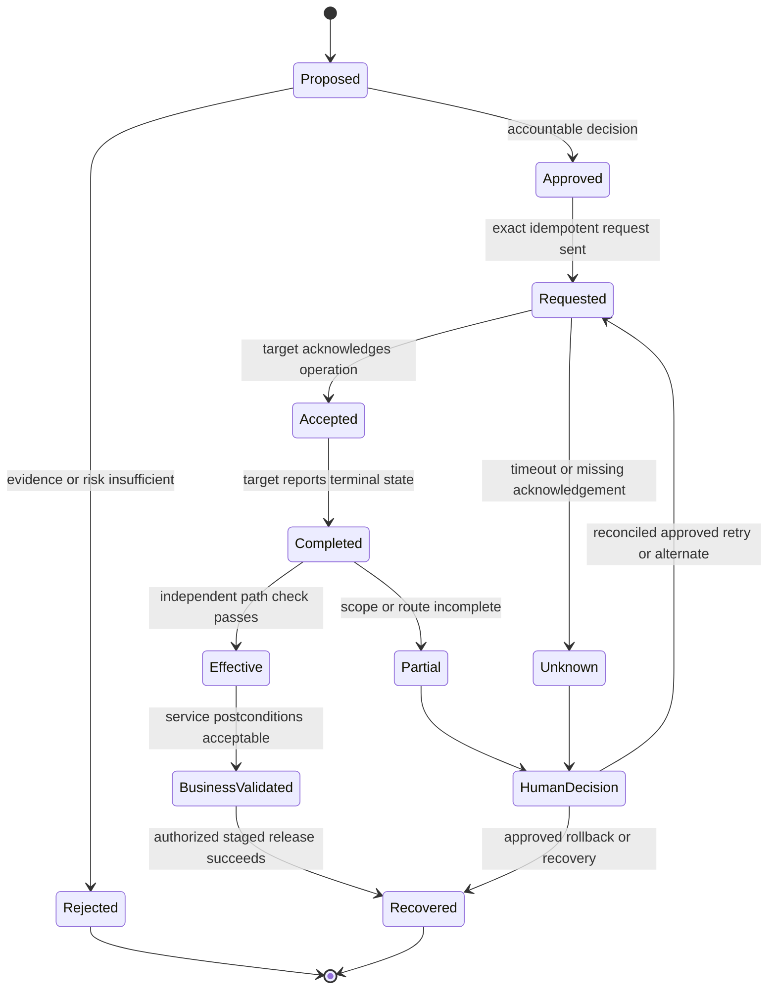

Action volume is not a success metric by itself. More isolations can indicate more threats, an aggressive policy, duplicate requests, or poor upstream prevention. Pair actions with evidence threshold, target accuracy, effective containment, business harm, rollback, alternate path, recurrence, and analyst/customer acceptance.

## Recurrence and durable improvement

Recurrence means a materially similar condition returns after a supposed correction. Define similarity: same root cause, control gap, identity lifecycle defect, detection miss, service, behavior, entity, or business outcome. Exact duplicate incidents are uncommon; overly narrow definitions undercount recurrence.

| Recurrence lens | Question | Evidence |
|---|---|---|
| Same cause | Did the same technical/process cause return? | RCA taxonomy and validation |
| Same control gap | Did an uncorrected or drifted control permit similar risk? | Control state and change history |
| Same behavior | Did related attack behavior recur? | Source evidence and detection mapping |
| Same entity/service | Did the same population experience repeat impact? | Scoped IDs and effective service map |
| Same workflow failure | Did handoff, approval, action, or recovery fail similarly? | Case/action audit |
| Reopened case | Did new evidence invalidate closure? | Reopen reason and timeline |
| Prevented recurrence | Did a test show the prior path is now blocked/detected? | Controlled regression test |

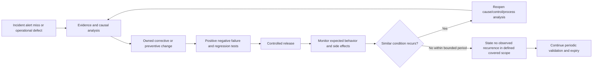

"No recurrence" must be bounded by time, eligible population, source health, detection capability, and definition. Absence of observed alerts is not proof of absence. A durable improvement has an owner, implemented change, test evidence, monitoring, residual risk, and expiry/review date.

## Analyst effort, workload, and human quality

Analyst effort includes active investigation time, waiting, context switching, console pivots, manual data entry, evidence reconstruction, approvals, communication, correction, and learning. Handle time alone may punish careful work or exclude off-tool effort.

| Effort dimension | Measurement approach | Caveat |
|---|---|---|
| Active touch time | Bounded task activity or sampled time study | Instrumentation can create surveillance and miss thinking |
| Queue wait | Usable case to qualified ownership | Depends on routing and staffing |
| Tool wait | Query, retrieval, enrichment, action, and page latency | Separate human from system delay |
| Context switches | Systems/cases changed during work | Counts do not measure cognitive difficulty alone |
| Manual pivots | Repeated lookups/copying across tools | Some pivots are valuable validation |
| Rework | Corrections, reassignment, reopen, duplicate handling | Needs reason taxonomy |
| Escalation effort | Evidence packaging, handoff, follow-up | Complex valid cases naturally cost more |
| Review burden | Human validation/approval time | Must preserve meaningful review |
| Knowledge effort | Time to find or update runbook | Search telemetry can be incomplete |
| Cognitive load | Survey/interview and error indicators | Subjective but important |

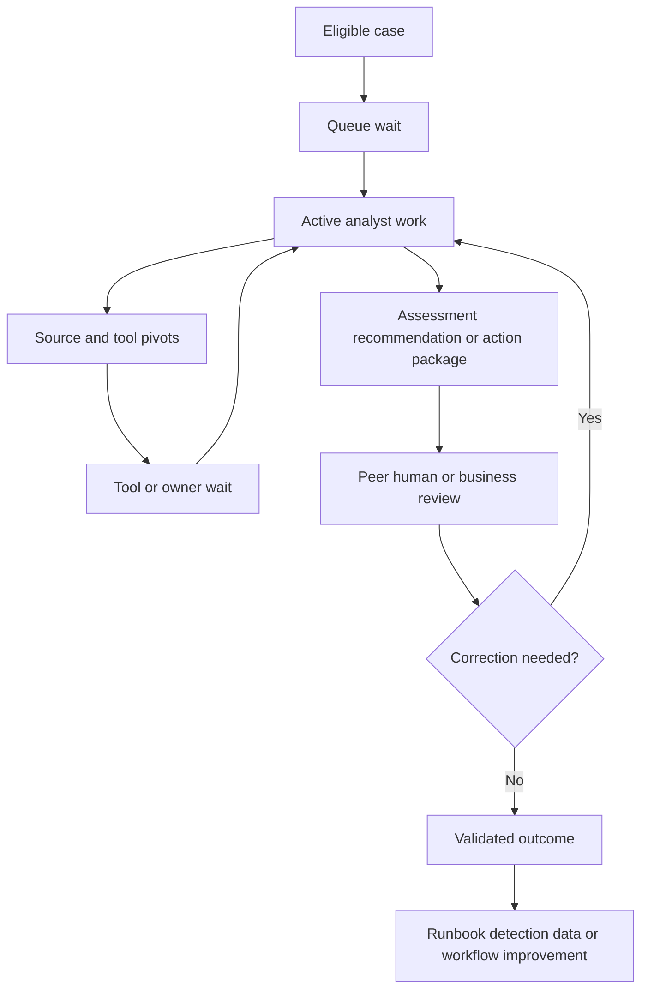

### Automation and agent-assistance value

Measure whether assistance reduces avoidable effort while preserving or improving decision quality and safety. Compare eligible cohorts or controlled trials where possible. Include reviewer time, correction, model/tool cost, incidents, and new oversight work. Easy cases may be preferentially automated, so compare matched risk and complexity rather than raw averages.

Useful measures include source retrieval time, manual pivot count, evidence completeness, citation correctness, assessment quality, override/correction rate, end-to-end time, analyst-reported burden, action safety, recurrence, and total cost per validated outcome. An agent can reduce drafting time while increasing verification time; that may still be worthwhile if quality improves, but it is not pure time saving.

### Workforce ethics

Operational metrics can become worker surveillance. Define purpose, minimize personal monitoring, involve appropriate stakeholders, control access, retain only necessary data, avoid simplistic ranking, and use metrics to improve systems rather than punish individuals. Case difficulty, shift, source health, language, accessibility, and role differ. Pair telemetry with qualitative review.

## SIEM and security-data cost

SIEM cost can include ingestion, processing, indexing, hot/warm/archive storage, retention, search/compute, queries, egress, connectors, infrastructure, licenses, support, engineering, content maintenance, and analyst effort. Exact pricing and entitlements are customer/vendor facts requiring current verification.

| Cost component | Possible driver | Quality/risk companion |
|---|---|---|
| Ingestion | Events/bytes, source verbosity, duplicates | Required use-case and source coverage |
| Processing | Parsing, normalization, enrichment, correlation | Semantic validity and latency |
| Storage | Volume, retention, tier, replication | Investigation/compliance purpose and retrieval test |
| Search/compute | Query frequency/complexity, scans, concurrency | Analyst usefulness and response time |
| Egress/export | Data moved to tools/regions | Portability, privacy, and continuity |
| Connectors | Instances, maintenance, API limits | Health, support, and failure recovery |
| Detection content | Engineering, testing, tuning, lifecycle | Precision, recall evidence, coverage |
| Operations | Monitoring, on-call, incident, upgrades | Reliability and resilience |
| Analyst effort | Triage, pivots, rework, reporting | Decision quality and workload |
| Tool overlap | Duplicate storage/detection/case/action | System-of-record clarity and continuity |

```mermaid
flowchart LR
    SOURCES[Source inventory and use cases] --> SELECT[Purpose-based collection and filtering]
    SELECT --> INGEST[Ingest and process cost]
    INGEST --> STORE[Retention and storage tiers]
    STORE --> SEARCH[Search analytics and detection compute]
    SEARCH --> WORK[Analyst and workflow effort]
    WORK --> OUT[Validated security/business outcomes]
    OUT --> UNIT[Cost per eligible use case and validated outcome]
    UNIT --> OPT[Optimize duplication verbosity retention query and workflow]
    OPT --> TEST[Retest coverage quality latency resilience and compliance]
    TEST --> SELECT
```

### Cost optimization without creating blindness

Start with use cases and obligations. Identify required evidence, frequency, retention, and retrieval performance. Find duplicates, low-value verbose records, unused indexes, failed sources, repeated transformations, expensive broad queries, and overlapping tools. Test proposed changes against detection, hunt, investigation, response, audit, legal, and continuity needs.

Filtering can move rather than remove cost. Source-side filtering may reduce ingestion but make later reconstruction impossible. Archive may lower storage price but increase retrieval time/fees. Sampling may suit performance trends but break rare-event detection. Normalization can accelerate common queries but lose source detail. Every optimization needs positive, negative, boundary, historical-retrieval, and outage tests plus rollback.

### Unit economics

Possible units include cost per eligible entity, healthy source, usable event volume, tested detection scenario, investigated case, validated containment, or protected critical service. Each has limitations. Cost per alert can be gamed by suppressing alerts. Cost per incident varies with severity. Use a small set of complementary units and show fixed/shared allocation assumptions.

### Plain-English deep-dive 3 - Cheap telemetry can be expensive, and expensive telemetry can be valuable

A warehouse can save money by discarding every package record after one day. Storage falls, but investigating a missing shipment becomes impossible. It can also waste money by retaining every camera frame forever without a retrieval use. The right answer follows purpose and risk.

Security data value depends on which decisions it supports, how often, how uniquely, and under which retention obligation. A high-volume source may enable crucial incident reconstruction. A low-volume source may be redundant. Measure use-case contribution and blind-spot risk before cutting cost. Do not use query frequency alone; rarely used evidence can be essential during rare severe incidents.

Optimization claims should be layered: "The proposed change reduces this defined cost driver under current pricing assumptions; controlled tests show these specified detections and retrievals still pass; these residual scenarios remain; customer owners approved the tradeoff." That is stronger than "We cut log cost by deleting noise."

## Denominator integrity and data quality

Denominator integrity means the eligible population is complete enough, consistently defined, versioned, and not selectively changed to improve results. It is one of the most important SecOps analytics disciplines.

| Denominator failure | Example | Detection/control |
|---|---|---|
| Missing inventory | Unmanaged assets absent from eligible count | Reconcile multiple authoritative inventories |
| Survivorship bias | Only closed cases have duration | Include open/censored and unknown populations |
| Label availability bias | Only investigated alerts have truth labels | Report labeled fraction and sampling method |
| Exclusion drift | Hard cases silently removed | Version exclusions and show counts/reasons |
| Duplicate units | Retries counted as separate alerts/actions | Stable logical keys and lineage |
| Grain mismatch | Events divided by cases | Semantic model and unit tests |
| Time-window bias | Late data excluded from recent denominator | Maturity window and backfill policy |
| Source outage | Missing alerts make workload look lower | Source-health overlay and eligible expectation |
| Definition change | Closure or severity semantics change | Version break and restatement decision |
| Population mix | More low-risk cases improve average | Segment and standardize cohorts |

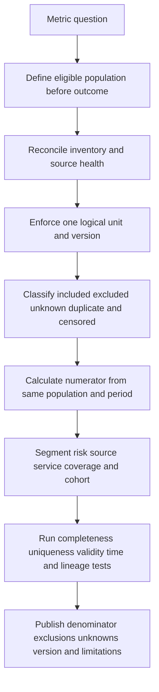

### Open and censored cases

A duration metric calculated only for closed cases excludes the longest ongoing cases. This is survivorship bias. Show open-case age distributions and consider survival-analysis methods where expertise exists. At minimum, separate completed durations from currently open ages and avoid claiming full-period recovery performance before cases mature.

### Late-arriving and corrected data

Define a maturity window after which a period is considered stable enough to report. Track preliminary versus finalized values. When backfill or corrections materially change a metric, record the revision and reason. Do not silently overwrite executive history.

### Data-quality dimensions

| Dimension | Question | Metric implication |
|---|---|---|
| Completeness | Are expected records/attributes present? | Missing starts/stops bias speed |
| Validity | Do values follow type/range/semantic rules? | Invalid severity or state missegments |
| Uniqueness | Is each logical object counted once? | Duplicates inflate volume/actions |
| Consistency | Do sources agree under defined authority? | Conflicting case/status truth |
| Timeliness | Is data available before the decision? | Freshness affects coverage and MTTD |
| Accuracy | Does record represent real object/state? | Wrong entity corrupts quality/outcome |
| Provenance | Can value be traced and reproduced? | Unsupported executive claim |

## Goodhart's law and metric gaming

Goodhart's law is commonly summarized: when a measure becomes a target, it can stop being a good measure. People optimize what is rewarded, sometimes by changing classification, scope, or workflow rather than the intended outcome. Automated systems do the same when objective functions reward proxies.

| Target | Possible gaming/distortion | Countermeasure |
|---|---|---|
| Lower alert volume | Suppress difficult alerts or lose sources | Coverage, source health, sampled misses |
| Lower MTTA | Click acknowledgement without ownership | Reassignment, assessment quality, queue age |
| Lower MTTR | Close before recovery or split cases | Recovery gates, reopen, recurrence, residual |
| Higher precision | Raise threshold and miss positives | Recall evidence, hunt/red-team, risk coverage |
| Higher recall | Flood analysts with low-value alerts | Precision, workload, decision utility |
| More automated actions | Trigger unnecessary containment | Target accuracy, business harm, effective outcome |
| More cases closed | Avoid reopen or relabel unresolved | Outcome sampling and recurrence |
| Lower SIEM cost | Remove valuable data or retention | Use-case tests, coverage, retrieval, residual risk |
| High agent acceptance | Human rubber stamping | Blinded quality samples and override effectiveness |
| High coverage percentage | Shrink denominator or count untested mappings | Inventory reconciliation and test evidence |

### Balanced scorecards and guardrails

Pair a primary metric with quality, coverage, safety, cost, and human guardrails. For example, improve time to first assessment while maintaining sampled decision accuracy, source coverage, reopen rate, analyst workload, and severe-case tail. The scorecard should remain small enough to drive decisions, with deeper diagnostic metrics behind it.

Use qualitative evidence. Analyst interviews may reveal that a faster workflow hides repeated manual reconciliation. Incident reviews may show one severe miss that a monthly average masks. Metrics support judgment; they do not replace it.

## Continuous improvement loops

Continuous improvement converts evidence into a validated system change. The loop needs a trigger, problem statement, baseline, cause/hypothesis, prioritized intervention, owner, test, release, measured result, unintended-effect check, residual, and next review.

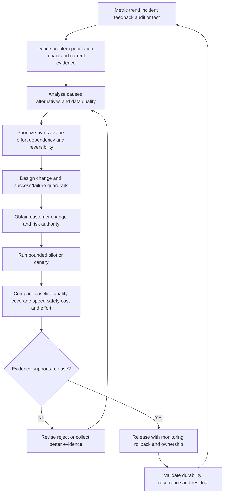

### Improvement backlog

| Field | Purpose |
|---|---|
| Problem/evidence | What observed behavior needs change? |
| Affected population | Which entities, sources, cases, services, and period? |
| Risk/value | Why does it matter to security/business? |
| Hypothesis | What cause and intervention are proposed? |
| Metric baseline | Which versioned measures describe current state? |
| Guardrails | Which quality, coverage, privacy, safety, and cost must not degrade? |
| Owner/dependencies | Who is accountable and what must happen first? |
| Test | Positive, negative, boundary, failure, and rollback criteria |
| Result | What changed versus baseline, with uncertainty? |
| Residual/next review | What remains and when does validity expire? |

### Prioritization

Prioritize by customer risk, active impact, affected population, recurrence, control gap, confidence, effort, dependency, reversibility, and learning value. Avoid prioritizing only by dashboard color or raw frequency. A rare severe identity-resolution error can outrank common low-impact noise.

## Executive narratives

Executives need a concise decision narrative, not a wall of operational charts. A strong narrative answers: What risk or business service is in scope? What changed? Is the change real or a definition/source effect? Why does it matter? What drivers and uncertainty exist? What action is owned? What result is expected or validated? What residual risk and decision remain?

### Executive narrative template

1. **Context:** "For the defined critical-service cohort..."
2. **Signal:** "The tail of event-to-usable-alert latency increased while median remained stable..."
3. **Integrity:** "The definition is unchanged; source coverage remained within the stated objective; two source classes are excluded and shown separately..."
4. **Drivers:** "Evidence associates the tail with backlog in one path; schema and source generation tests passed; causality is still being validated..."
5. **Impact:** "Delayed evidence can postpone triage for this behavior; no customer harm is asserted from the metric alone..."
6. **Action:** "The integration owner is testing capacity and backpressure changes with rollback..."
7. **Outcome/residual:** "Success requires tail recovery without loss, duplicate, cost, or detection regression; next decision follows bounded reconciliation..."

### Causality and attribution

A before-and-after chart does not prove a product or process caused the change. Other factors include workload mix, source health, staffing, threat activity, policy, seasonality, label maturity, and metric-definition changes. Stronger attribution can use controlled pilots, matched cohorts, interrupted time series, phased rollout, or explicit causal analysis where expertise and data permit. Even then, state assumptions.

For customer success, separate adoption, capability, behavior, and outcome. A product can be enabled but unused; used but poorly configured; useful but not causal for a broad risk trend. An evidence chain might be: prerequisite healthy, use case activated, analysts use it, decision quality changes, action outcome validates, recurrence/cost changes, and customer owner accepts the value interpretation.

### Plain-English deep-dive 4 - Executives need the denominator and the decision, not every query

A weather briefing does not list every sensor reading. It states the storm's scope, confidence, expected impact, actions, and uncertainty. Yet the forecast team retains detailed evidence so specialists can reproduce it.

SecOps reporting should work similarly. The executive view can say that validated containment time for a defined severe-incident cohort improved while coverage and recurrence guardrails remained stable. It should also disclose a small or changing denominator, source gaps, and whether the result is preliminary. Technical appendices retain metric contracts and lineage.

Do not hide uncertainty to sound decisive. "The sample is small, but the same workflow defect appeared in three independent reviews; this reversible improvement has a clear validation plan" can support action. Confidence and urgency are different dimensions.

## Metric operations and troubleshooting

Metrics are products. They need owners, source contracts, tests, release, access, incident response, documentation, and deprecation. A dashboard can fail silently after schema, timezone, status, join, or source changes.

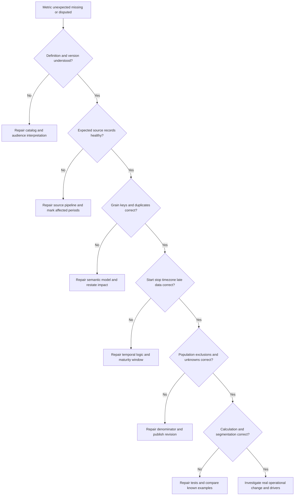

### Metric test suite

| Test | Purpose |
|---|---|
| Known small example | Reproduce hand-calculated expected result |
| Duplicate records | Ensure logical object counted once |
| Missing start/stop | Preserve unknown/open rather than discard |
| Reopen/reclose | Define lifecycle treatment |
| Late arrival/backfill | Apply maturity and revision policy |
| Timezone/clock | Prevent shifted or negative durations |
| Many-to-many join | Detect row multiplication |
| Definition version | Prevent invalid trend continuity |
| Source outage | Mark coverage impact instead of "improvement" |
| Exclusion change | Show population movement and reason |
| Extreme values | Validate mean, median, percentile, and caps |
| Access/privacy | Ensure audience sees authorized aggregate/detail |

### Metric incident evidence

Capture metric contract/version, query/model version, source lineage, refresh state, first/last affected period, sample stable IDs, expected hand calculation, observed output, source-health changes, schema/config releases, affected reports/decisions, mitigation, owner, and restatement plan. Avoid exporting broad sensitive case data if minimal synthetic or redacted examples suffice.

## Security, privacy, and governance

Metrics can expose incident details, employee activity, privileged identities, customer services, control weaknesses, costs, and performance judgments. Use purpose limitation, aggregation, minimum necessary detail, role-based access, audit, retention, and approved sharing. Small groups can be re-identified even when names are removed.

| Governance area | General practice | Risk reduced |
|---|---|---|
| Metric ownership | Named business/security and data owners | Uncontrolled interpretation |
| Definition/version | Catalog, review, effective date, change log | False comparison |
| Access | Audience-specific aggregate and drill-down | Sensitive incident/worker exposure |
| Privacy | Minimize personal data and surveillance use | Unfair worker monitoring |
| Integrity | Source lineage, tests, approvals, reproducibility | Manipulated or accidental error |
| Retention | Keep detail/aggregate by purpose and obligation | Unnecessary historical exposure |
| Segregation | Separate production, test, and synthetic data | Contaminated reporting |
| Export | Govern external, executive, vendor, and regulatory sharing | Context loss and leakage |
| AI summaries | Ground narrative in authorized metric definitions | Hallucinated executive claims |
| Challenge | Provide correction and dispute path | Entrenched bad metric |

## Failure modes and misconceptions

| Misconception | Why it fails | Better reasoning |
|---|---|---|
| "MTTR is standard" | Respond, remediate, recover, and resolve differ | Spell out start and stop |
| "Lower mean means everyone improved" | Tail or cohort can worsen | Show distribution and segments |
| "No alerts means no threats" | Source/detection coverage may be absent | Overlay health, testing, and unknowns |
| "False-positive rate equals one minus precision" | They use different denominators | Publish confusion-matrix definitions |
| "High precision means good coverage" | System can alert rarely and miss positives | Pair with recall evidence and coverage |
| "ATT&CK mapping proves detection" | Mapping is not tested behavior | Require source, analytic, procedure, result |
| "Action completed means contained" | Target/path/business effect may differ | Validate effective postcondition |
| "Closed case means recovered" | Administrative and security states differ | Track lifecycle milestones |
| "No recurrence proves permanent fix" | Observation scope/time can be weak | Bound claim and retest |
| "Less analyst time always means value" | Quality or hidden verification may worsen | Measure total effort and outcome |
| "Lower ingestion cost means optimization" | Blindness, retrieval, or risk may rise | Test use cases and residuals |
| "Dashboard caused improvement" | Correlation and attribution are not causality | Use evidence chain and alternatives |
| "A target motivates everyone correctly" | People optimize proxy | Balanced scorecard and quality samples |
| "One score fits executives and analysts" | Decisions require different detail | Layer narrative and diagnostics |
| "Public vendor claim is our result" | Customer configuration and population differ | Attribute source and verify customer evidence |

## Decision trees

### Decision tree 1 - Is this time metric valid?

1. Is the object grain explicit and counted once?
2. Are eligible population, severity/risk cohort, and period defined before outcome?
3. Are start and stop source events observable and semantically stable?
4. Are pauses, reopen, open cases, unknown starts/stops, timezone, and late data handled?
5. Are mean, median, percentiles, and sample size shown where useful?
6. Are quality, coverage, recurrence, and impact companions present?
7. If definitions or sources changed, is the trend broken or restated transparently?

### Decision tree 2 - Is a detection-quality claim defensible?

1. What exact target condition and output are classified?
2. Which eligible evaluation population and label process exist?
3. How were true positives, false positives, false negatives, and true negatives found?
4. What fraction remains unlabeled or unknown?
5. Does the sample represent risk cohorts and source-health conditions?
6. Are precision, recall concept, coverage, timeliness, entity accuracy, and analyst impact reviewed together?
7. What behavior would change the threshold or use of the detection?

### Decision tree 3 - Is cost optimization safe?

1. Which use case, obligation, and risk justify the data/tool today?
2. Which cost driver is measured under current pricing/allocation assumptions?
3. Is duplication, verbosity, retention, query, tier, or workflow the actual driver?
4. Which positive, negative, boundary, historical, outage, and recovery tests protect value?
5. What blindness, latency, privacy, egress, continuity, or incident-reconstruction residual follows?
6. Who approves the tradeoff, and what rollback and post-change monitoring exist?

## Explicitly fictional and synthetic NMH scenarios

Everything in this section is an **explicitly fictional and synthetic NMH scenario assumption**. No item is a customer fact, Zscaler tenant fact, production metric, UI, field, entitlement, action, benchmark, saving, or result. No dates are used, so no scenario date can be confused with the 2026-08-24 official-source snapshot.

### Scenario 1 - The improving MTTR that was not recovery

The fictional and synthetic NMH dashboard shows an invented MTTR improvement after a workflow change. The study team inspects the contract and discovers that the stop event changed from validated business recovery to administrative ticket closure. The improvement is therefore a definition artifact, not an operational result.

The team versions the metric, restores separate time-to-containment, time-to-recovery, and time-to-closure measures, and publishes a break in trend. It checks open cases and recurrence. This scenario teaches semantic integrity; it does not claim any product or customer result.

### Scenario 2 - The high-precision blind spot

The fictional and synthetic NMH detection has very few false positives among reviewed alerts. A controlled synthetic exercise introduces target behavior in a population lacking the required source, so no alert occurs. Precision remains high because false negatives are outside the alert-only denominator. The team adds source/entity coverage and controlled recall evidence, then prioritizes the data gap.

The lesson is that alert purity cannot prove detection completeness. The team also labels the exercise result as synthetic and avoids presenting it as real attack detection.

### Scenario 3 - The cheap SIEM change with hidden effort

The fictional and synthetic NMH team moves invented records to a slower study tier and observes lower storage allocation. Analysts then spend more fictional time waiting and reconstructing context for cases. Total cost and recovery latency rise under the scenario assumptions.

The team evaluates license/storage, retrieval, egress, analyst effort, detection, investigation, compliance, and severe-case needs together. It pilots a purpose-based retention design with rollback. The lesson is that component cost differs from total cost and value.

### Scenario 4 - The agent acceptance target

The fictional and synthetic NMH pilot rewards a high rate of accepted AI summaries. Reviewers begin approving drafts with minimal inspection. A blinded synthetic quality sample finds omitted contradictions. The team removes acceptance as a stand-alone target, adds citation correctness, contradiction preservation, correction quality, review burden, and outcome measures, and redesigns the review interface.

This scenario demonstrates Goodhart's law and responsible AI measurement. It is not a Zscaler Agentic SecOps result.

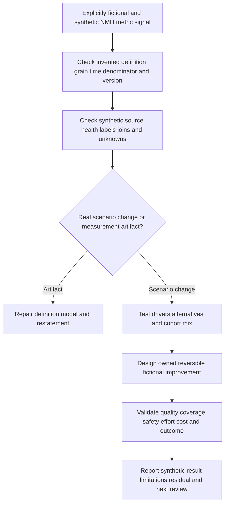

## Artifact kit

These artifacts are vendor-neutral templates. They contain no invented Zscaler fields or customer results.

### Artifact 1 - Metric definition card

| Item | Template content |
|---|---|
| Name/purpose | Full unambiguous name and decision |
| Audience/owner | Who uses and who acts |
| Grain/population | One measured unit, eligible cohort, period |
| Numerator/denominator | Exact calculation and unknown handling |
| Time | Start, stop, pauses, timezone, maturity, reopen |
| Sources/lineage | Authoritative systems and transformations |
| Exclusions | Versioned reasons and counts |
| Aggregation | Mean, median, percentiles, distribution, segments |
| Target/guardrails | Desired signal plus quality, coverage, safety, cost |
| Limitations/version | What cannot be concluded and effective date |

### Artifact 2 - Balanced SecOps scorecard

| Dimension | Example question | Example concept |
|---|---|---|
| Risk/coverage | Are critical in-scope entities and behaviors tested? | Healthy tested coverage with unknowns |
| Detection quality | Are outputs useful without hidden misses? | Precision/recall evidence, fidelity, entity accuracy |
| Workflow | Is qualified ownership and decision timely? | Queue/assessment distributions plus correctness |
| Response | Is harmful path interrupted safely? | Effective containment, target accuracy, business impact |
| Durability | Do causes and control gaps recur? | Bounded recurrence and regression-test pass |
| People | Is work sustainable and review meaningful? | Effort, rework, cognitive burden, quality |
| Cost | Is spend connected to required outcomes? | TCO and unit economics with risk guardrails |
| Improvement | Are insights becoming validated changes? | Accepted-to-validated loop completion |

### Artifact 3 - Executive one-page narrative

1. Customer risk/service context and reporting period.
2. Two or three material signals, each with definition and population.
3. Data/source health, denominator, sample size, and important unknowns.
4. Supported drivers, alternatives, and whether causality is established.
5. Observed and potential business/security implications.
6. Owned actions, investment/decision needed, and success guardrails.
7. Validated result if available, residual risk, and next checkpoint.
8. Link to technical metric catalog and lineage for reproducibility.

### Artifact 4 - Improvement experiment card

| Item | Required content |
|---|---|
| Problem | Observed behavior, population, impact, evidence |
| Hypothesis | Proposed driver and intervention |
| Baseline | Versioned metrics and qualitative evidence |
| Design | Pilot/canary, comparison, scope, duration |
| Guardrails | Quality, coverage, security, privacy, effort, cost |
| Authority | Change, risk, business, and data owners |
| Result | Difference, distribution, uncertainty, side effects |
| Decision | Release, revise, stop, rollback, or gather evidence |
| Durability | Recurrence test, owner, residual, next review |

## Exercises

All exercises are non-production and use synthetic or authorized test evidence.

1. Write separate contracts for time to detect, acknowledge, assess, contain, remediate, recover, and close.
2. Draw an incident timeline and label unknown, estimated, source, receipt, decision, action, and effective times.
3. Create a semantic model separating events, alerts, stories, cases, incidents, actions, entities, effort, and cost.
4. Calculate precision and recall from a small synthetic confusion matrix, then explain why live truth is harder.
5. Design source, entity, event, detection, temporal, response, analyst, and business-service coverage denominators.
6. Review an ATT&CK mapping and convert it into a tested behavior-coverage record.
7. Build a containment scorecard that separates request, completion, effect, business impact, rollback, and recovery.
8. Define recurrence broadly enough to capture same cause, control gap, behavior, service, and workflow defect.
9. Map analyst effort into queue, active work, tool wait, pivots, rework, review, and learning.
10. Build a SIEM TCO tree covering ingestion, processing, storage, search, egress, connectors, content, operations, and people.
11. Review a proposed retention reduction and define detection, investigation, compliance, outage, and rollback tests.
12. Find denominator bias in a duration report that includes only closed cases.
13. Design a balanced scorecard resistant to gaming of MTTA, MTTR, precision, action count, and cost.
14. Create an improvement backlog item from a data-quality defect through validated outcome.
15. Write an executive narrative that distinguishes observation, driver, attribution, action, and residual.
16. Design a metric incident runbook for schema, join, timezone, source-outage, or definition change.
17. Create an AI-agent evaluation scorecard pairing acceptance with citation quality, safety, review, effort, and outcome.
18. Practice a two-minute interview answer using Arti's analytics background without claiming production SOC results.

## Customer discovery questions

1. Which customer risks, services, and decisions should the metric system support?
2. Which event, alert, story, case, incident, action, entity, analyst, and cost grains exist?
3. What do MTTD, MTTA, and each MTTR variant mean here, including start, stop, pause, reopen, and unknown?
4. Which source clocks and timestamps are authoritative or estimated?
5. Which eligible populations, exclusions, unknowns, late data, and maturity windows define denominators?
6. How are false positives, false negatives, true positives, and true negatives labeled and reviewed?
7. Which source, entity, behavior, temporal, response, analyst, and critical-service coverage is tested?
8. How are ATT&CK mappings distinguished from validated behavior detection?
9. Which action states and postconditions prove effective containment and safe recovery?
10. How are recurrence, reopen, regression, and durable control improvement defined?
11. Where do analysts spend effort, wait, pivot, rework, review, and learn?
12. Which SIEM/data costs include ingestion, processing, storage, search, egress, engineering, operations, and people?
13. Which targets could create Goodhart behavior, and what balanced guardrails apply?
14. Which metric owners, versions, tests, access/privacy controls, and dispute paths exist?
15. Which current Zscaler capabilities and customer facts can be measured without inferring unverified outcomes?

## Official Source Anchors

Research/source snapshot and source review date: **2026-08-24**.

The Zscaler sources support dated public positioning only. NIST sources support general cybersecurity and incident-response outcome framing. MITRE ATT&CK supports behavior taxonomy, not detection-effectiveness proof. No source below establishes a customer's metric definition, benchmark, denominator, dashboard, cost, improvement, entitlement, or result. Current customer data, finance methods, contracts, policy, and technical evidence govern production claims.

| Source | URL | Used for | Boundary |
|---|---|---|---|
| Zscaler Agentic Security Operations | https://www.zscaler.com/products-and-solutions/security-operations | Public risk-priority, triage/investigation, right-sized response, feedback, and SIEM/EDR/IAM/ticketing complementarity positioning | No customer speed, quality, coverage, action, cost, UI, field, entitlement, or outcome inferred |
| Zscaler Agentic SOC | https://www.zscaler.com/products-and-solutions/security-operations-core | Current named public solution context | Scope, route, technical metrics, and packaging can change |
| Zscaler Data Fabric for Security | https://www.zscaler.com/products-and-solutions/data-fabric | Public data harmonization, deduplication, correlation, enrichment, workflow, and reporting positioning | No customer semantic model, denominator, or cost result inferred |
| Zscaler Zero Trust Exchange | https://www.zscaler.com/products-and-solutions/zero-trust-exchange-zte | Public identity/context/business-policy and inline-control context | No specific containment metric or effectiveness inferred |
| NIST Cybersecurity Framework 2.0 | https://www.nist.gov/cyberframework | Govern, Identify, Protect, Detect, Respond, and Recover outcome framing | Voluntary; profiles, tiers, and measures are customer-defined |
| NIST SP 800-61 Rev. 3 | https://csrc.nist.gov/pubs/sp/800/61/r3/final | Incident-response preparation, response, recovery, and improvement context | Organizations tailor roles, metrics, and procedures |
| NIST AI Risk Management Framework | https://www.nist.gov/itl/ai-risk-management-framework | General AI governance and measurement context | Voluntary and vendor-neutral |
| MITRE ATT&CK | https://attack.mitre.org/ | General tactic/technique knowledge for coverage organization | Mapping is not proof of occurrence, detection, prevention, or response |

## Likely Interview Questions

### Q1. How do you define MTTD, MTTA, and MTTR correctly?

**Model answer:** I never use the acronym without a contract. I define the grain, eligible population, source-native start and stop, pauses, reopen, open/unknown cases, timezone, late-data maturity, exclusions, aggregation, segments, owner, and quality companion. MTTA must say acknowledge or assess. MTTR must say respond, contain, remediate, recover, or resolve. I show distributions and sample size, not mean alone.

### Q2. What is dwell time, and why is it difficult to measure?

**Model answer:** Dwell time is the interval harmful presence or activity remains before a defined end such as detection, containment, or eviction. The true start is often discovered retrospectively or remains unknown, and only confirmed investigated incidents have labels, creating selection bias. I separate earliest supported activity, first observable evidence, detection, effective containment, removal, and recovery, and report known, estimated, and unknown populations.

### Q3. How do precision and recall apply to security detections?

**Model answer:** Precision asks: of positive alerts, what fraction were true positives under reviewed truth? Recall asks: of all actual positives, what fraction were detected? Higher thresholds can improve precision while reducing recall. Live false negatives and true negatives are hard to know, so I combine controlled tests, historical adjudication, hunts, exercises, and sampled review, state label coverage, and pair these concepts with source/entity coverage, timeliness, and actionability.

### Q4. How do you measure detection coverage honestly?

**Model answer:** I define eligible business services, entities, behaviors, platforms, sources, time, and response scenarios. A covered item requires healthy scoped telemetry, versioned analytic logic, a controlled expected-behavior test, correct output, and a validity period. ATT&CK mapping organizes behaviors but does not prove detection. I show excluded and unknown inventory and re-test after material changes.

### Q5. What should containment metrics include beyond speed?

**Model answer:** I separate proposed, approved, requested, accepted, completed, effective, business-validated, recovered, partial, and unknown states. I measure exact-target and scope accuracy, path interruption, alternate routes, business harm, duration, rollback, recovery, and recurrence. Action count or API completion is not protection. Customer authority and native read-back are part of the measurement contract.

### Q6. How would you optimize SIEM cost without creating blind spots?

**Model answer:** I map sources and retention to detections, hunts, investigations, response, audit, legal, and continuity needs; measure current ingestion, processing, storage, search, egress, connectors, engineering, operations, and analyst effort; find duplication and low-value cost drivers; then pilot changes. Positive, negative, boundary, historical retrieval, outage, and rollback tests must protect quality and coverage. I report assumptions and residual risk, not savings alone.

### Q7. What is Goodhart's law, and how do you prevent metric gaming?

**Model answer:** When a measure becomes a target, people or systems may optimize the proxy rather than the intended outcome. Lower MTTR can come from premature closure; higher precision from missing threats; lower cost from deleting useful evidence. I use balanced speed, quality, coverage, safety, recurrence, effort, and cost measures; version denominators; inspect samples and tails; include qualitative evidence; and assign outcome ownership.

### Q8. How does Arti's background transfer, and how would she report Zscaler value honestly?

**Model answer:** SQL and Power BI support metric grains, joins, denominators, cohorts, quality, and executive views. Enterprise escalation work supports timelines, impact, owners, recovery, and recurrence prevention. She can connect Zscaler's dated public positioning around context, prioritization, agentic assistance, response, and feedback to a proposed measurement plan, while stating that production Zscaler/SOC metrics, causal value, savings, and outcomes require current customer evidence.

## 30-Second Memory Hooks

| Concept | Memory hook |
|---|---|
| Metric | Definition plus decision plus owner |
| Grain | Know what one row represents |
| Denominator | All eligible opportunities, including unknowns |
| MTTD | Which start and which detection? |
| MTTA | Acknowledge is not assess |
| MTTR | Spell out respond, contain, remediate, recover, or resolve |
| Dwell | Harmful presence with uncertain start and end |
| Precision | Of alerts, how many were real? |
| Recall | Of real positives, how many alerted? |
| Coverage | Eligible, healthy, tested, time-bounded scope |
| ATT&CK | Behavior map, not detection proof |
| Containment | Effective path interruption, not request count |
| Recurrence | Did cause, control gap, behavior, or workflow return? |
| Analyst effort | Queue, touch, wait, pivot, rework, review |
| SIEM cost | Data, compute, tools, people, risk, and value |
| Goodhart | Target the outcome, guard the proxy |
| Improvement | Owner, change, test, result, residual |
| Executive story | Context, signal, integrity, driver, action, residual |
| Zscaler | Attribute public positioning; measure customer reality |
| Arti bridge | Analytics and escalation transfer; outcome claims do not |

## Completion Checklist

- [ ] I separate official product fact, general security practice, fictional scenario assumption, customer fact, and unknown.
- [ ] I retain the official-source review date exactly as 2026-08-24.
- [ ] I define metric, KPI, KRI, grain, population, cohort, numerator, denominator, exclusion, unknown, baseline, target, trend, and distribution.
- [ ] I separate event, alert, story, case, incident, action, entity, analyst-effort, and cost grains.
- [ ] I publish purpose, audience, decision, population, time, sources, exclusions, unknowns, calculation, target, owner, version, and limitation.
- [ ] I spell out MTTD, MTTA, and every MTTR variant with exact start and stop.
- [ ] I distinguish route, acknowledge, assess, respond, contain, remediate, recover, resolve, and close.
- [ ] I include open/censored cases, missing clocks, late data, reopen, timezone, and maturity rules.
- [ ] I report means beside medians, tails, distributions, cohort segments, and sample sizes where useful.
- [ ] I define dwell start/end evidence and separate known, estimated, observable, and unknown intervals.
- [ ] I explain TP, FP, FN, TN, precision, recall, false-positive rate, and specificity with correct denominators.
- [ ] I state label and false-negative limitations and use controlled tests, reviews, hunts, or exercises appropriately.
- [ ] I measure alert validity, fidelity, timeliness, entity accuracy, uniqueness, context, explanation, actionability, and outcome.
- [ ] I define source, entity, event, detection, temporal, response, analyst, and business-service coverage.
- [ ] I never equate ATT&CK mapping with tested detection effectiveness.
- [ ] I separate proposed, approved, requested, accepted, completed, effective, business-validated, recovered, partial, and unknown actions.
- [ ] I pair containment speed with target accuracy, path effect, business impact, rollback, recovery, and recurrence.
- [ ] I define recurrence across cause, control gap, behavior, entity/service, workflow, reopen, and regression testing.
- [ ] I measure analyst queue, touch, wait, pivot, rework, escalation, review, knowledge, and cognitive burden responsibly.
- [ ] I model SIEM TCO across ingestion, processing, storage, search, egress, connectors, content, operations, and people.
- [ ] I test cost changes against detection, investigation, compliance, continuity, quality, and residual risk.
- [ ] I protect denominator integrity from missing inventory, survivorship, label bias, exclusion drift, duplicates, late data, outages, and mix changes.
- [ ] I recognize Goodhart risks and use balanced scorecards, samples, tails, and qualitative evidence.
- [ ] I run improvement loops with problem, baseline, cause, owner, test, authority, result, guardrails, recurrence, and residual.
- [ ] I write executive narratives with context, signal, data integrity, drivers, impact, action, result, uncertainty, and next decision.
- [ ] I govern metric access, privacy, lineage, testing, retention, change, correction, and dispute.
- [ ] I can identify every NMH element as explicitly fictional and synthetic.
- [ ] I can complete all eighteen exercises without production data or action.
- [ ] I make no unsupported production Zscaler, Agentic SecOps, SIEM, SOC, metric, cost, containment, improvement, entitlement, or customer-result claim.
- [ ] I can answer all eight interview questions with neutral evidence-bounded language.

[Part 100 - Enterprise Discovery, Qualification, and Current-State Assessment](Part-100-enterprise-discovery-assessment.md)